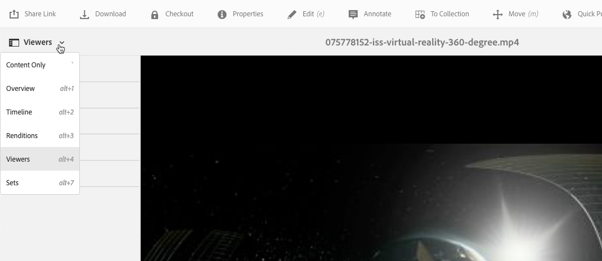

# 360/VR Video {#vr-video}

Vídeos de 360 graus gravam uma visualização em todas as direções ao mesmo tempo. Eles são filmados usando uma câmera onidirecional ou uma coleção de câmeras. Durante a reprodução num visor plano, o utilizador controla o ângulo de visualização; a reprodução em dispositivos móveis normalmente aproveita seus controles giroscópicos incorporados.

Dynamic Media - O modo Scene7 inclui suporte nativo para o delivery de 360 ativos de vídeo. Por padrão, nenhuma configuração adicional é necessária para exibir ou reproduzir. Você fornece 360 vídeos usando extensões de vídeo padrão, como .mp4, .mkv e .mov. O codec mais comum é H.264.

Esta seção descreve como trabalhar com o visualizador de vídeo 360/VR para renderizar vídeos necessários para uma experiência de visualização imersiva de uma sala, propriedade, local, paisagem, procedimento médico e assim por diante.

Não há suporte para áudio espacial no momento; se o áudio estiver misturado em estéreo, o equilíbrio (L/R) não é alterado à medida que o cliente altera o ângulo de visualização da câmera.

See also [Managing Viewer Presets](/help/assets/managing-viewer-presets.md).

## 360 Vídeo em ação {#video-in-action}

Toque em [Space Station 360](http://mobiletest.scene7.com/s7viewers/html5/Video360Viewer.html?asset=Viewers/space_station_360-AVS) para abrir uma janela do navegador e assistir a um vídeo de 360 graus. Durante a reprodução do vídeo, arraste o ponteiro do mouse para um novo local para alterar o ângulo de visualização.

de quadro de *vídeo da Estação Espacial 360*

## Vídeo 360/VR e Adobe Premiere Pro {#vr-video-and-adobe-premiere-pro}

Você pode usar o Adobe Premier Pro para visualização e edição de imagens 360/VR. Por exemplo, você pode colocar logotipos e texto corretamente em uma cena e aplicar efeitos e transições projetados especificamente para mídia retangular.

Consulte [Editar vídeo](https://helpx.adobe.com/premiere-pro/how-to/edit-360-vr-video.html)360/VR.

## Fazer upload de ativos para uso com o visualizador de vídeo 360 {#uploading-assets-for-use-with-the-video-viewer}

Os ativos de vídeo 360 que são carregados no AEM são rotulados como **Multimídia** em uma página Ativo, similar ao ativo de vídeo normal.

*Um ativo de vídeo 360 carregado visto na visualização de cartão. O ativo é rotulado como Multimídia.*

**Para fazer upload de ativos para uso com o visualizador de vídeo 360:**

1. Criada uma pasta dedicada ao seu ativo de vídeo 360.
1. [Aplique um perfil de vídeo adaptável à pasta](/help/assets/video-profiles.md#applying-a-video-profile-to-folders).

   A renderização de conteúdo de vídeo 360 coloca requisitos mais altos para a resolução de vídeo de origem e para a resolução de execuções codificadas do que o conteúdo de vídeo padrão não-360.

   Você pode usar o Perfil de vídeo adaptável pronto para uso que já vem com o Dynamic Media. No entanto, lembre-se de que isso resultará em uma qualidade de vídeo 360 nitidamente menor do que a obtida para vídeos não-360 codificados com as mesmas configurações renderizadas com um visualizador de vídeo não-360. Portanto, se for necessário um vídeo 360 de alta qualidade, faça o seguinte:

   * Idealmente, seu conteúdo original de vídeo 360 deve ter uma das seguintes resoluções:

      * 1080p - 1920 x 1080, conhecida como resolução Full HD ou FHD ou
      * 2160p - 3840 x 2160, conhecida como resolução 4K, UHD ou Ultra HD. Essa resolução de tela muito grande é encontrada na maioria das vezes em televisores premium e monitores de computador. A resolução 2160p é frequentemente chamada de &quot;4K&quot; porque a largura é próxima a 4000 pixels. Em outras palavras, ele oferta quatro vezes mais pixels do que 1080p.
   * [Crie um Perfil](/help/assets/video-profiles.md#creating-a-video-encoding-profile-for-adaptive-streaming) Adaptive Video personalizado com execuções de qualidade superior. Por exemplo, você pode criar um Perfil de vídeo adaptativo que contenha as três configurações a seguir:

      * width=auto; height=720; bitrate=2500 kbps
      * width=auto; height=1080; bitrate=5000 kbps
      * width=auto; height=1440; bitrate=6600 kbps
   * Processa o conteúdo de vídeo 360 em uma pasta dedicada exclusivamente a 360 ativos de vídeo.
   Esteja ciente de que essa abordagem também exigirá mais demandas na rede e na CPU do usuário final.

1. [Carregue seu vídeo na pasta](/help/assets/managing-video-assets.md#uploadingandpreviewingvideoassets).

## Substituição da proporção padrão de 360 vídeos  {#overriding-the-default-aspect-ratio-of-videos}

Para um ativo carregado se qualificar como um vídeo 360 que você pretende usar com o visualizador de vídeo 360, o ativo deve ter uma proporção de 2.

Por padrão, o AEM detecta o vídeo como &quot;360&quot; se sua proporção (largura/altura) for 2.0. Se você for um Administrador, poderá substituir a configuração padrão de proporção 2 definindo a propriedade opcional no CRXDE Lite da seguinte maneira: `s7video360AR`

* `/conf/global/settings/cloudconfigs/dmscene7/jcr:content`

   * **Tipo** de propriedade: Duplo
   * **Valor**: proporção de ponto flutuante, padrão 2.0.

Após definir essa propriedade, ela entrará em vigor imediatamente nos vídeos existentes e nos vídeos carregados recentemente.

A proporção se aplica a 360 ativos de vídeo para a página de detalhes do ativo e o componente Video 360 Media WCM.

Start por meio do upload de vídeos 360.

## Previewing 360 Video {#previewing-video}

Você pode usar a Pré-visualização para ver a aparência do seu vídeo 360 para os clientes e garantir que ele esteja se comportando como esperado.

Consulte também [Edição de predefinições](/help/assets/managing-viewer-presets.md#editing-viewer-presets)do visualizador.

Quando estiver satisfeito com o vídeo 360, você poderá publicá-lo.

See [Embedding the Video or Image Viewer on a Web Page](https://helpx.adobe.com/experience-manager/6-5/help/assets/embed-code.html).
See [Linking URLs to your web application](https://helpx.adobe.com/experience-manager/6-5/help/assets/linking-urls-to-yourwebapplication.html). Observe que o método de vinculação baseado em URL não é possível se o conteúdo interativo tiver links com URLs relativos, principalmente links para páginas de AEM Sites.
See [Adding Dynamic Media Assets to pages.](https://helpx.adobe.com/experience-manager/6-5/help/assets/adding-dynamic-media-assets-to-pages.html)

**Para a pré-visualização 360 vídeos**

1. Em **[!UICONTROL Ativos]**, navegue até um vídeo 360 existente que você criou. Toque no recurso Vídeo 360 para abri-lo no modo de pré-visualização.

   

   Toque no ativo de vídeo 360 para pré-visualização do vídeo.

1. Na página pré-visualização, próximo ao canto superior esquerdo da página, toque na lista suspensa e selecione **[!UICONTROL Visualizadores.]**

   

   Na lista Visualizadores, toque em **[!UICONTROL Video360_social]** e execute um dos procedimentos a seguir:

   * Arraste o ponteiro do mouse sobre o vídeo para alterar o ângulo de visualização da cena estática.
   * Toque no botão **[!UICONTROL Reproduzir]** do vídeo para iniciar a reprodução; à medida que o vídeo é reproduzido, arraste o ponteiro do mouse pelo vídeo para alterar seu ângulo de visualização.
   *socialA 360.*

   * Na lista Visualizadores, toque em **[!UICONTROL Video360VR.]**

      O vídeo Virtual Reality (VR) é um conteúdo de vídeo imersivo que é acessado através do uso de headsets de realidade virtual. Assim como acontece com os vídeos comuns, você cria vídeos VR no início quando um vídeo está sendo gravado ou capturado com câmeras de vídeo de 360 graus.
   
   *Uma imagem de vídeo de 360 VR.*

1. Near the upper-right of the preview page, tap **[!UICONTROL Close.]**

## Publicação de vídeo 360 {#publishing-video}

Você precisa publicar o vídeo 360 para usá-lo. A publicação de um vídeo 360 ativa o URL e o código incorporado. Ele também publica o vídeo 360 na nuvem do Dynamic Media, que é integrada a um CDN para delivery escaláveis e com desempenho.

Consulte [Publicação dos ativos](/help/assets/publishing-dynamicmedia-assets.md) Dynamic Media para obter detalhes sobre como publicar o vídeo 360.
See also [Embedding the Video or Image Viewer on a Web Page](https://helpx.adobe.com/experience-manager/6-5/help/assets/embed-code.html).
See also [Linking URLs to your web application](https://helpx.adobe.com/experience-manager/6-5/help/assets/linking-urls-to-yourwebapplication.html). Observe que o método de vinculação baseado em URL não é possível se o conteúdo interativo tiver links com URLs relativos, principalmente links para páginas de AEM Sites.
See also [Adding Dynamic Media Assets to pages.](https://helpx.adobe.com/experience-manager/6-5/help/assets/adding-dynamic-media-assets-to-pages.html)
