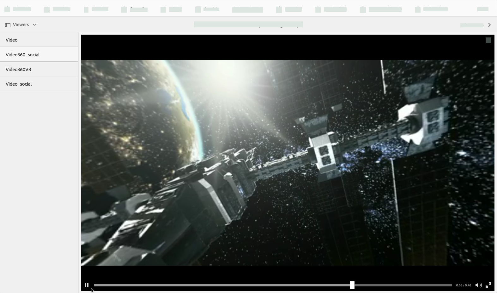
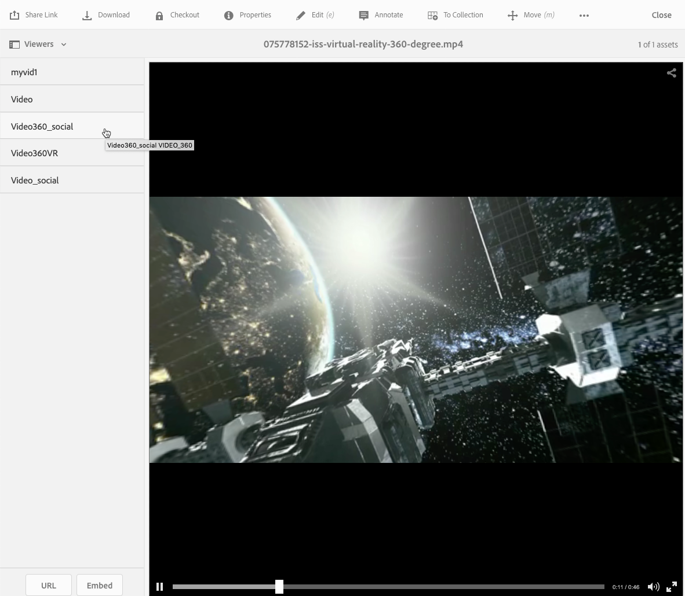
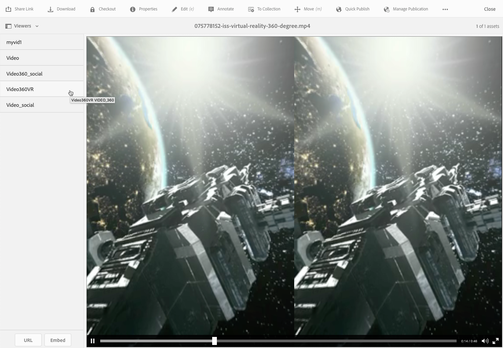

# Vídeo 360/VR {#vr-video}

Vídeos de 360 graus gravam uma visualização em todas as direções ao mesmo tempo. Eles são filmados com uma câmera onidirecional ou com uma coleção de câmeras. Durante a reprodução num ecrã plano, o utilizador controla o ângulo de visualização; as reproduções em dispositivos móveis geralmente usam os controles giroscópicos incorporados.

Dynamic Media - O modo Scene7 inclui suporte nativo para a entrega de 360 ativos de vídeo. Por padrão, nenhuma configuração adicional é necessária para visualizar ou reproduzir. Você fornece 360 vídeos usando extensões de vídeo padrão, como .mp4, .mkv e .mov. O codec mais comum é o H.264.

Esta seção descreve como trabalhar com o visualizador de vídeo 360/VR para renderizar vídeos tangulares necessários para uma experiência de visualização imersiva de uma sala, propriedade, local, paisagem, procedimento médico e assim por diante.

Atualmente, não há suporte para áudio espacial; se o áudio estiver misturado em estéreo, o saldo (L/R) não muda conforme o cliente altera o ângulo de visualização da câmera.

Consulte também [Gerenciar predefinições do visualizador](/help/assets/managing-viewer-presets.md).

## 360 Vídeo em ação {#video-in-action}

Toque em [Estação Espacial 360](https://mobiletest.scene7.com/s7viewers/html5/Video360Viewer.html?asset=Viewers/space_station_360-AVS) para abrir uma janela do navegador e assistir a um vídeo de 360 graus. Durante a reprodução do vídeo, arraste o ponteiro do mouse para um novo local para alterar o ângulo de exibição.

*Exemplo de vídeoQuadro de vídeo da Estação Espacial 360*

## Vídeo 360/VR e Adobe Premiere Pro {#vr-video-and-adobe-premiere-pro}

Você pode usar o Adobe Premier Pro para exibir e editar imagens 360/VR. Por exemplo, você pode colocar logotipos e texto corretamente em uma cena e aplicar efeitos e transições projetadas especificamente para mídia Retangular.

Consulte [Editar vídeo 360/VR](https://helpx.adobe.com/premiere-pro/how-to/edit-360-vr-video.html).

## Upload de ativos para uso com o visualizador de vídeo 360 {#uploading-assets-for-use-with-the-video-viewer}

Os ativos de vídeo 360 que são carregados no Adobe Experience Manager são rotulados como **Multimídia** em uma página de Ativo, de modo semelhante ao ativo de vídeo normal.

*selectUm ativo de vídeo 360 carregado e visualizado na exibição Cartão. O ativo é rotulado como Multimídia.*

**Para fazer upload de ativos para uso com o visualizador de vídeo 360:**

1. Criada uma pasta dedicada ao seu ativo de vídeo 360.
1. [Aplique um perfil de vídeo adaptável à pasta.](/help/assets/video-profiles.md#applying-a-video-profile-to-folders)

   A renderização do conteúdo de vídeo 360 coloca requisitos mais altos para a resolução de vídeo de origem e para as representações codificadas do que o conteúdo de vídeo não-360 padrão.

   Você pode usar o Perfil de vídeo adaptável pronto para uso que já vem com o Dynamic Media. No entanto, isso resulta em uma qualidade de vídeo 360 consideravelmente menor do que a obtida para vídeos não-360 codificados com as mesmas configurações renderizadas com um visualizador de vídeo não-360. Portanto, se for necessário vídeo de alta qualidade 360, faça o seguinte:

   * Idealmente, seu conteúdo original de vídeo 360 é melhor para ter uma das seguintes resoluções:

      * 1080p - 1920 x 1080, conhecida como resolução Full HD ou FHD ou
      * 2160p - 3840 x 2160, conhecida como resolução 4K, UHD ou Ultra HD. Essa grande resolução de exibição é encontrada com mais frequência em televisores premium e monitores de computador. A resolução 2160p geralmente é chamada de &quot;4K&quot; porque a largura é próxima a 4000 pixels. Em outras palavras, ele oferece quatro vezes mais pixels do que 1080p.
   * [Crie um ](/help/assets/video-profiles.md#creating-a-video-encoding-profile-for-adaptive-streaming) Perfil de vídeo adaptativo personalizado com representações de maior qualidade. Por exemplo, crie um Perfil de vídeo adaptativo que contenha as três configurações a seguir:

      * width=auto; height=720; bitrate=2500 kbps
      * width=auto; height=1080; bitrate=5000 kbps
      * width=auto; height=1440; bitrate=6600 kbps
   * Processar o conteúdo de vídeo 360 em uma pasta dedicada exclusivamente a 360 ativos de vídeo.

   Essa abordagem coloca maiores demandas na rede e na CPU do usuário final.

1. [Faça upload do vídeo para a pasta](/help/assets/managing-video-assets.md#upload-and-preview-video-assets) .

## Substituição da taxa de proporção padrão de 360 vídeos {#overriding-the-default-aspect-ratio-of-videos}

Para que um ativo carregado seja qualificado como um vídeo 360 que você pretende usar com o visualizador de vídeo 360, o ativo deve ter uma proporção de aspecto de 2.

Por padrão, o Experience Manager detecta vídeo como &quot;360&quot; se sua proporção (largura/altura) for 2.0. Se você for um Administrador, poderá substituir a configuração padrão de proporção de aspecto de 2 ao definir a propriedade opcional `s7video360AR` no CRXDE Lite no seguinte:

* `/conf/global/settings/cloudconfigs/dmscene7/jcr:content`

   * **Tipo** de propriedade: Duplo
   * **Valor**: taxa de proporção de ponto flutuante, padrão 2.0.

Após definir essa propriedade, ela entrará em vigor imediatamente nos vídeos existentes e nos vídeos recém-carregados.

A taxa de proporção se aplica a 360 ativos de vídeo para a página de detalhes do ativo e o [Componente WCM de mídia Vídeo 360](/help/assets/adding-dynamic-media-assets-to-pages.md#dynamic-media-components).

Comece carregando 360 vídeos.

## Visualização do vídeo 360 {#previewing-video}

Você pode usar a Visualização para ver a aparência do seu vídeo 360 para os clientes e garantir que ele se comporte conforme esperado.

Consulte também [Editar predefinições do visualizador](/help/assets/managing-viewer-presets.md#editing-viewer-presets).

Quando estiver satisfeito com o vídeo 360, você poderá publicá-lo.

Consulte [Incorporando o visualizador de vídeo ou imagem em uma página da Web.](/help/assets/embed-code.md)
Consulte  [Vincular URLs ao aplicativo da Web](/help/assets/linking-urls-to-yourwebapplication.md). O método de vinculação baseado em URL não é possível se o conteúdo interativo tiver links com URLs relativos, especialmente links para páginas de Experience Manager Sites .
Consulte [Adicionar ativos Dynamic Media às páginas.](/help/assets/adding-dynamic-media-assets-to-pages.md)

**Para visualizar 360 vídeos:**

1. Em **[!UICONTROL Assets]**, navegue até um vídeo 360 existente que você criou. Toque no ativo 360 Vídeo para abri-lo no modo de visualização.

   

   Toque no ativo de vídeo 360 para visualizar o vídeo.

1. Na página de visualização, próximo ao canto superior esquerdo da página, toque na lista suspensa e selecione **[!UICONTROL Visualizadores.]**

   

   Na lista Visualizadores, toque em **[!UICONTROL Video360_social]** e siga um destes procedimentos:

   * Arraste o ponteiro do mouse sobre o vídeo se quiser alterar o ângulo de exibição da cena estática.
   * Toque no botão **[!UICONTROL Reproduzir]** do vídeo se desejar iniciar a reprodução. Conforme o vídeo é reproduzido, arraste o ponteiro do mouse sobre o vídeo para alterar seu ângulo de visualização.

   *socialA 360.*

   * Na lista Visualizadores, toque em **[!UICONTROL Video360VR.]**

      Vídeo VR (Virtual Reality) é um conteúdo de vídeo imersivo que é acessado usando fones de realidade virtual. Assim como em vídeos comuns, você cria vídeos VR no início quando um vídeo está sendo gravado ou capturado por meio de câmeras de vídeo de 360 graus.
   
   *Uma captura de tela de vídeo 360 VR.*

1. Próximo ao canto superior direito da página de visualização, toque em **[!UICONTROL Fechar.]**

## Publicando vídeo 360 {#publishing-video}

Publique o vídeo 360 para usá-lo. A publicação de um vídeo 360 ativa o URL e o código incorporado. Ele também publica o vídeo 360 na nuvem do Dynamic Media, que é integrada a uma CDN para entrega escalável e com desempenho.

Consulte [Publicação de ativos Dynamic Media](/help/assets/publishing-dynamicmedia-assets.md) para obter detalhes sobre como publicar vídeo 360.
Consulte também [Incorporação do visualizador de vídeo ou imagem em uma página da Web](/help/assets/embed-code.md).
Consulte também [Vincular URLs ao seu aplicativo Web](/help/assets/linking-urls-to-yourwebapplication.md). O método de vinculação baseado em URL não é possível se o conteúdo interativo tiver links com URLs relativos, especialmente links para páginas de Experience Manager Sites .
Consulte também [Adicionar ativos Dynamic Media às páginas.](/help/assets/adding-dynamic-media-assets-to-pages.md)
