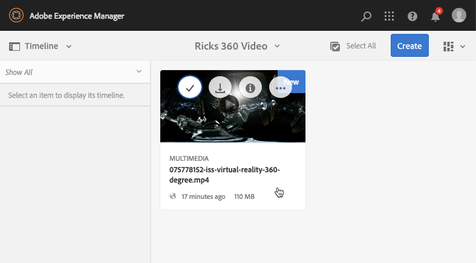

# Vídeo 360/VR {#vr-video}

Vídeos de 360 graus gravam uma vista em todas as direções ao mesmo tempo. Elas são filmadas usando uma câmera onidirecional ou uma coleção de câmeras. Durante a reprodução em uma tela plana, o usuário tem controle do ângulo de visão; as reproduções em dispositivos móveis geralmente usam seus controles giroscópicos incorporados.

Dynamic Media - o modo Scene7 inclui suporte nativo para a entrega de 360 ativos de vídeo. Por padrão, nenhuma configuração adicional é necessária para exibir ou reproduzir. Você fornece vídeo 360 usando extensões de vídeo padrão, como .mp4, .mkv e .mov. O codec mais comum é o H.264.

Esta seção descreve como trabalhar com o visualizador de vídeo 360/VR para renderizar vídeos equiretangulares para obter uma experiência de visualização imersiva de uma sala, propriedade, localização, paisagem, procedimento médico e assim por diante.

O áudio espacial não é suportado atualmente; se o áudio estiver misturado em estéreo, o equilíbrio (L/R) não muda conforme o cliente muda o ângulo de visão da câmera.

Consulte também [Gerenciamento de predefinições do visualizador](/help/assets/managing-viewer-presets.md).

## Vídeo 360 em ação {#video-in-action}

Selecionar [Estação Espacial 360](https://s7d1.scene7.com/s7viewers/html5/Video360Viewer.html?asset=Viewers/space_station_360-AVS) para abrir uma janela do navegador e assistir a um vídeo de 360 graus. Durante a reprodução do vídeo, arraste o ponteiro do mouse para um novo local para alterar o ângulo de exibição.

*Quadro de vídeo da estação espacial 360*

## Vídeo e Adobe Premiere Pro 360/VR {#vr-video-and-adobe-premiere-pro}

Você pode usar o Adobe Premier Pro para visualizar e editar a gravação 360/VR. Por exemplo, você pode colocar logotipos e texto corretamente em uma cena e aplicar efeitos e transições projetados especificamente para mídia quadrretangular.

Consulte [Editar vídeo 360/VR](https://helpx.adobe.com/premiere-pro/how-to/edit-360-vr-video.html).

## Fazer upload de ativos para uso com o visualizador de vídeo 360 {#uploading-assets-for-use-with-the-video-viewer}

360 ativos de vídeo carregados no Adobe Experience Manager são rotulados como **Multimídia** em uma página de Ativo, semelhante ao ativo de vídeo normal.

*Um ativo de vídeo 360 carregado visto na exibição de Cartão. O ativo é rotulado como Multimídia.*

**Faça upload de ativos para uso com o visualizador de vídeo 360:**

1. Criação de uma pasta dedicada ao seu ativo de 360 vídeos.
1. [Aplicar um perfil de vídeo adaptável à pasta](/help/assets/video-profiles.md#applying-a-video-profile-to-folders).

   A renderização de conteúdo de vídeo 360 impõe requisitos mais altos para a resolução do vídeo de origem e para a resolução de representações codificadas do que o conteúdo de vídeo padrão que não seja de 360.

   Você pode usar o Perfil de vídeo adaptável pronto para uso que já vem com o Dynamic Media. No entanto, isso resulta em uma qualidade de vídeo 360 consideravelmente menor do que a obtida para vídeos não-360 codificados com as mesmas configurações renderizadas com um visualizador de vídeo não-360. Portanto, se o vídeo 360 de alta qualidade for necessário, faça o seguinte:

   * Idealmente, o conteúdo original de 360 vídeos é melhor ter uma das seguintes resoluções:

      * 1080p - 1920 x 1080, conhecido como resolução Full HD ou FHD ou
      * 2160p - 3840 x 2160, conhecido como 4k, UHD ou resolução de alta definição Ultra. Essa grande resolução de tela é mais frequentemente encontrada em televisores premium e monitores de computador. A resolução de 2160p é frequentemente chamada de &quot;4k&quot; porque a largura é próxima a 4000 pixels. Em outras palavras, oferece quatro vezes mais pixels do que 1080p.

   * [Criar um perfil de vídeo adaptável personalizado](/help/assets/video-profiles.md#creating-a-video-encoding-profile-for-adaptive-streaming) com representações de maior qualidade. Por exemplo, crie um Perfil de vídeo adaptável que contenha as três configurações a seguir:

      * width=auto; height=720; bitrate=2500 kbps
      * width=auto; height=1080; bitrate=5000 kbps
      * width=auto; height=1440; bitrate=6600 kbps

   * Processe conteúdo de 360 vídeos em uma pasta dedicada exclusivamente a 360 ativos de vídeo.

   Essa abordagem exige mais da rede e da CPU do usuário final.

1. [Carregue seu vídeo na pasta](/help/assets/managing-video-assets.md#upload-and-preview-video-assets).

## Substituir a taxa de proporção padrão de 360 vídeos  {#overriding-the-default-aspect-ratio-of-videos}

Para que um ativo carregado se qualifique como um vídeo 360 que você pretende usar com o visualizador de vídeo 360, o ativo deve ter uma taxa de proporção de 2.

Por padrão, o Experience Manager detecta o vídeo como &quot;360&quot; se sua proporção (largura/altura) for 2,0. Se você for um Administrador, é possível substituir a configuração padrão de taxa de proporção de 2 ao definir a configuração opcional `s7video360AR` propriedade no CRXDE Lite no seguinte local:

* `/conf/global/settings/cloudconfigs/dmscene7/jcr:content`

   * **Tipo de propriedade** - Duplo
   * **Valor** - proporção de ponto flutuante, padrão 2.0.

Depois de definir essa propriedade, ela entrará em vigor imediatamente nos vídeos existentes e nos vídeos recém-carregados.

A taxa de proporção se aplica a 360 ativos de vídeo para a página de detalhes do ativo e a [Componente WCM de mídia de vídeo 360](/help/assets/adding-dynamic-media-assets-to-pages.md#dynamic-media-components).

Comece carregando 360 vídeos.

## Visualizar vídeo 360 {#previewing-video}

Você pode usar a Visualização para ver a aparência do seu vídeo 360 para os clientes e garantir que ele esteja se comportando conforme esperado.

Consulte também [Editar predefinições do visualizador](/help/assets/managing-viewer-presets.md#editing-viewer-presets).

Quando estiver satisfeito com o vídeo 360, você poderá publicá-lo.

Consulte [Incorporar o visualizador de vídeo ou imagem em uma página da Web](/help/assets/embed-code.md).
Consulte [Vincular URLs ao aplicativo da Web](/help/assets/linking-urls-to-yourwebapplication.md). O método de vinculação baseado em URL não é possível se o conteúdo interativo tiver links com URLs relativos, principalmente links para páginas do Experience Manager Sites.
Consulte [Adicionar ativos do Dynamic Media a páginas](/help/assets/adding-dynamic-media-assets-to-pages.md).

**Para visualizar o Vídeo 360:**

1. Entrada **[!UICONTROL Assets]**, navegue até um vídeo 360 existente que você criou. Selecione o ativo de Vídeo 360 para que você possa abri-lo no modo de visualização.

   

   Selecione o ativo de 360 vídeos para poder visualizar o vídeo.

1. Na página de visualização, próximo ao canto superior esquerdo da página, selecione a lista suspensa e, em seguida, **[!UICONTROL Visualizadores]**.

   

   Na lista Visualizadores, selecione **[!UICONTROL Video360_social]**, siga um destes procedimentos:

   * Arraste o ponteiro do mouse pelo vídeo se desejar alterar o ângulo de visão da cena estática.
   * Selecione o vídeo do **[!UICONTROL Reproduzir]** se quiser iniciar a reprodução. Enquanto o vídeo é reproduzido, arraste o ponteiro do mouse sobre ele para alterar seu ângulo de visão.

   *Uma captura de tela de 360 vídeos.*

   * Na lista Visualizadores, selecione **[!UICONTROL Video360VR]**.

     O vídeo de realidade virtual (VR) é um conteúdo de vídeo imersivo que é acessado usando fones de ouvido de realidade virtual. Assim como em vídeos comuns, você cria vídeos de RV no início, quando um vídeo está sendo gravado ou capturado usando câmeras de vídeo de 360 graus.

   
   *Captura de tela do vídeo 360 VR.*

1. Próximo ao canto superior direito da página de visualização, selecione **[!UICONTROL Fechar]**.

## Publicando vídeo 360 {#publishing-video}

Publique o vídeo 360 para poder usá-lo. A publicação de um Vídeo 360 ativa o URL e o Código incorporado. Ele também publica o vídeo 360 na nuvem do Dynamic Media, que é integrada a um CDN para entrega escalável e eficiente.

Consulte [Publicar ativos do Dynamic Media](/help/assets/publishing-dynamicmedia-assets.md) para obter detalhes sobre como publicar o Vídeo 360.
Consulte também [Incorporar o visualizador de vídeo ou imagem em uma página da Web](/help/assets/embed-code.md).
Consulte também [Vincular URLs ao aplicativo da Web](/help/assets/linking-urls-to-yourwebapplication.md). O método de vinculação baseado em URL não é possível se o conteúdo interativo tiver links com URLs relativos, principalmente links para páginas do Experience Manager Sites.
Consulte também [Adicionar ativos do Dynamic Media a páginas](/help/assets/adding-dynamic-media-assets-to-pages.md).
