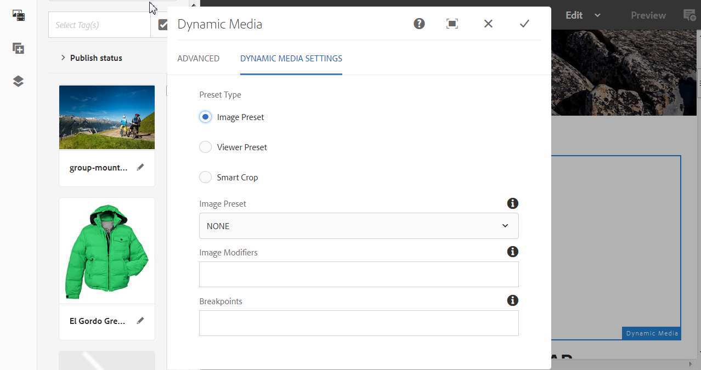

# Adição de ativos do Dynamic Media a páginas{#adding-dynamic-media-assets-to-pages}

Para adicionar a funcionalidade Dynamic Media aos ativos que você usa nos sites, é possível adicionar a variável **Dynamic Media**, **Mídia interativa**, **Mídia panorâmica** ou **Mídia de vídeo 360** diretamente na página. Adicione componentes ao entrar no modo Layout e ativar os componentes do Dynamic Media. Em seguida, adicione esses componentes à página e adicionar ativos ao componente. Os componentes do Dynamic Media são inteligentes - eles sabem se você está adicionando uma imagem ou um vídeo e as opções de configuração disponíveis mudam de acordo.

Você adiciona ativos do Dynamic Media diretamente à página se estiver usando o Adobe Experience Manager como o WCM. Se estiver usando um dispositivo de terceiros no WCM, [link](/help/assets/linking-urls-to-yourwebapplication.md) ou [incorporar](/help/assets/embed-code.md) seus ativos. Para obter um site responsivo de terceiros, consulte [Fornecer imagens otimizadas para um site responsivo](/help/assets/responsive-site.md).

>[!NOTE]
>
>Certifique-se de publicar ativos antes de adicioná-los às páginas no Experience Manager. Consulte [Publicar ativos do Dynamic Media](/help/assets/publishing-dynamicmedia-assets.md).

## Adicionar um componente Dynamic Media a uma página {#adding-a-dynamic-media-component-to-a-page}

Adicionar um componente de Mídia 3D, Dynamic Media, Mídia interativa, Mídia panorâmica, Recorte inteligente de vídeo ou Mídia de vídeo 360 a uma página é o mesmo que adicionar um componente a qualquer página. Os componentes do Dynamic Media são descritos nas seções a seguir.

**Para adicionar um componente Dynamic Media a uma página:**

1. No Experience Manager, abra a página em que deseja adicionar o componente Dynamic Media.
1. No painel no lado esquerdo da página (se necessário, alterne a exibição do painel lateral), selecione a **[!UICONTROL Componentes]** ícone.
1. No **[!UICONTROL Componentes]** cabeçalho, na lista suspensa, selecione **[!UICONTROL Dynamic Media]**.

   Se nenhuma lista de componentes do Dynamic Media estiver disponível, você deverá ativar os componentes do Dynamic Media que deseja usar. Consulte [Ativar componentes do Dynamic Media](#enabling-dynamic-media-components).

   

1. Arraste um **[!UICONTROL Dynamic Media]** que deseja utilizar e solte-o no local desejado na página.

1. Passe o ponteiro do mouse diretamente no componente. Quando o componente estiver rodeado por uma caixa azul, selecione uma vez para exibir a barra de ferramentas do componente. Selecione o **[!UICONTROL Configuração (chave inglesa)]** ícone.

   

1. Dependendo do componente do Dynamic Media que você soltou na página, uma caixa de diálogo de configuração se abre. [Definir as opções do componente](/help/assets/adding-dynamic-media-assets-to-pages.md#dynamic-media-components) conforme necessário.

   O exemplo abaixo mostra o Dynamic Media **[!UICONTROL Mídia de vídeo 360]** e as opções disponíveis na lista suspensa Predefinição do visualizador.

   

   O componente de mídia do Dynamic Media Video 360.

1. Quando terminar, no canto superior direito da caixa de diálogo, marque a marca de seleção para salvar as alterações.

### Ativar componentes do Dynamic Media {#enabling-dynamic-media-components}

Se nenhum componente do Dynamic Media estiver disponível para ser adicionado a uma página, provavelmente significa que você deve primeiro ativar os componentes que deseja usar.

**Para ativar componentes do Dynamic Media:**

1. No Experience Manager, abra a página em que deseja adicionar o componente Dynamic Media.
1. No lado esquerdo da barra de ferramentas próximo à parte superior da página, selecione o ícone Informações da página e, em seguida, **[!UICONTROL Editar modelo]** na lista suspensa.

   

1. No lado direito da barra de ferramentas próximo à parte superior da página, na lista suspensa, selecione **[!UICONTROL Estrutura]**.

   

1. Próximo à parte inferior da página, selecione **[!UICONTROL Contêiner de layout]** para abrir a barra de ferramentas e, em seguida, selecione o ícone Política.
1. No **[!UICONTROL Contêiner de layout]** página, sob o **[!UICONTROL Propriedades]** cabeçalho, certifique-se de que o **[!UICONTROL Componentes permitidos]** for selecionada.

   

1. Role até ver **[!UICONTROL Dynamic Media]**.
1. Selecione o ícone > à esquerda de **[!UICONTROL Dynamic Media]** para expandir a lista e selecionar os componentes do Dynamic Media que deseja ativar.

   

1. Próximo ao canto superior direito do **[!UICONTROL Contêiner de layout]** selecione o ícone Concluído (marca de seleção).

1. No lado direito da barra de ferramentas próximo à parte superior da página, na lista suspensa, selecione **[!UICONTROL Conteúdo inicial]**, depois [adicionar um componente Dynamic Media a uma página](#adding-a-dynamic-media-component-to-a-page) como de costume.

## Localizar componentes do Dynamic Media {#localizing-dynamic-media-components}

Você pode traduzir componentes do Dynamic Media de uma das duas formas a seguir:

* Em uma página da Web no Sites, abra **[!UICONTROL Propriedades]** e selecione a guia **[!UICONTROL Avançado]**. Selecione o idioma desejado para localização.

  

* No seletor de sites, selecione a página ou o grupo de páginas desejado. Selecionar **[!UICONTROL Propriedades]** e selecione o **[!UICONTROL Avançado]** guia. Selecione o idioma desejado para localização.

  >[!NOTE]
  >
  >Nem todos os idiomas disponíveis no **[!UICONTROL Idioma]** atualmente, os tokens estão atribuídos.

## Componentes do Dynamic Media {#dynamic-media-components}

Os componentes do Dynamic Media estão disponíveis ao selecionar a **[!UICONTROL Componentes]** ícone, filtrar em **[!UICONTROL Dynamic Media]**.

Os componentes do Dynamic Media disponíveis incluem o seguinte:

* **[!UICONTROL Dynamic Media]** - use para ativos como imagens, vídeo, eCatalogs e conjuntos de rotação.
* **[!UICONTROL Mídia interativa]** : use para qualquer ativo interativo, como vídeo interativo, imagens interativas ou conjuntos de carrossel.
* **[!UICONTROL Mídia panorâmica]** - Use para ativos de imagem panorâmica ou imagem panorâmica VR.
* **[!UICONTROL Mídia de vídeo 360]** - Use para ativos de vídeo 360 e vídeo 360 VR.

>[!NOTE]
>
>Esses componentes não estão disponíveis por padrão. Eles devem ser disponibilizados por meio do editor de modelo antes de você usá-los. [Depois que forem disponibilizados no](/help/sites-authoring/templates.md#editing-templates-template-authors)No editor de modelo, é possível adicionar os componentes à página da mesma maneira que qualquer outro componente de Experience Manager.

### Componente do Dynamic Media {#dynamic-media-component}

O componente Dynamic Media é inteligente. Ao adicionar uma imagem ou um vídeo, você tem várias opções. O componente oferece suporte a predefinições de imagens, visualizadores baseados em imagem, como conjuntos de imagens, conjuntos de rotação, conjuntos de mídia mista e vídeo. Além disso, o visualizador é responsivo - o tamanho da tela muda automaticamente com base no tamanho da tela. Todos os visualizadores são visualizadores HTML5.

>[!NOTE]
>
>Se sua página da Web tiver o seguinte:
>
>* Várias instâncias do componente Dynamic Media em uso na mesma página.
>* Cada instância usa o mesmo tipo de ativo.
>
>Não há suporte para atribuir uma predefinição do visualizador diferente a cada componente do Dynamic Media nessa página.
>
>No entanto, é possível usar a mesma predefinição do visualizador para todos os componentes do Dynamic Media que usam ativos do mesmo tipo, na página.

Ao adicionar o componente Dynamic Media e **[!UICONTROL Configurações do Dynamic Media]** estiver em branco ou não puder adicionar um ativo corretamente, verifique o seguinte:

* Você tem [Dynamic Media habilitado](/help/assets/config-dynamic.md). O Dynamic Media está desativado por padrão.
* A imagem tem um arquivo TIFF de pirâmide. As imagens importadas antes de habilitar o Dynamic Media não têm um arquivo TIFF em pirâmide.

#### Ao trabalhar com imagens {#when-working-with-images}

O componente Dynamic Media permite adicionar imagens dinâmicas, incluindo conjuntos de imagens, conjuntos de rotação e conjuntos de mídia mista. Você pode ampliar, reduzir e, se aplicável, girar uma imagem em um conjunto de rotação ou selecionar uma imagem de outro tipo de conjunto.

Também é possível configurar a predefinição do visualizador, a predefinição da imagem ou o formato da imagem diretamente no componente. Para tornar uma imagem responsiva, você pode definir os pontos de interrupção ou aplicar uma predefinição de imagem responsiva.

Edite as seguintes configurações do Dynamic Media selecionando o **[!UICONTROL Editar]** no componente e, em seguida, **[!UICONTROL Configurações do Dynamic Media]**.

>[!NOTE]
>
>Por padrão, o componente de imagem do Dynamic Media é adaptável. Se desejar torná-lo de um tamanho fixo, defina-o no componente na guia **[!UICONTROL Avançado]** com a **[!UICONTROL Largura]** e a **[!UICONTROL Altura]**.

* **[!UICONTROL Predefinição do visualizador]** - Selecione uma predefinição do visualizador existente no menu suspenso. Se a predefinição do visualizador que você está procurando não estiver visível, é necessário torná-la visível. Consulte [Gerenciar predefinições do visualizador](/help/assets/managing-viewer-presets.md). Não é possível selecionar uma predefinição do visualizador se você estiver usando uma predefinição de imagem e vice-versa.

  Essa opção é a única disponível se você estiver visualizando conjuntos de imagens, conjuntos de rotação ou conjuntos de mídia mista. As predefinições do visualizador exibidas são inteligentes - somente as predefinições relevantes do visualizador são exibidas.

* **[!UICONTROL Modificadores do visualizador]** - Os modificadores do visualizador tomam a forma de um par nome=valor com um delimitador &amp; e permitem alterar os visualizadores conforme descrito no Guia de referência do visualizador. Um exemplo de um modificador de visualizador é `posterimage=img.jpg&caption=text.vtt,1` que define uma imagem diferente para a miniatura do vídeo e associa um arquivo de legenda oculta/subtítulo ao vídeo.

* **[!UICONTROL Predefinição de imagem]** - Selecione uma predefinição de imagem existente no menu suspenso. Se a predefinição de imagem que você está procurando não estiver visível, será necessário torná-la visível. Consulte Gerenciamento de predefinições de imagem. Não é possível selecionar uma predefinição do visualizador se você estiver usando uma predefinição de imagem e vice-versa.

  Essa opção não estará disponível se você estiver visualizando conjuntos de imagens, conjuntos de rotação ou conjuntos de mídia mista.

* **[!UICONTROL Modificadores de imagem]** - Você pode aplicar efeitos de imagem fornecendo comandos de imagem adicionais. Esses efeitos são descritos nas Predefinições de imagem e na referência do Comando de disponibilização de imagens.

  Essa opção não estará disponível se você estiver visualizando conjuntos de imagens, conjuntos de rotação ou conjuntos de mídia mista.

* **[!UICONTROL Pontos de interrupção]** - Se estiver usando esse ativo em um site responsivo, você deve adicionar os pontos de interrupção da imagem. Os pontos de interrupção da imagem são separados por vírgulas (,). Essa opção funciona quando não há altura ou largura definidas em uma predefinição de imagem.

  Essa opção não estará disponível se você estiver visualizando conjuntos de imagens, conjuntos de rotação ou conjuntos de mídia mista.

  Você pode editar as seguintes Configurações avançadas selecionando **[!UICONTROL Editar]** no componente.

* **[!UICONTROL Otimizar para dispositivos de maior resolução]** - Marque (padrão) a caixa de seleção para permitir a otimização de DPR (Device Pixel Ratio, proporção de pixels do dispositivo).

  A variável **[!UICONTROL Otimizar para dispositivos de maior resolução]** A opção só é exibida quando o seguinte é verdadeiro:

   * Em Tipo de predefinição, **[!UICONTROL Predefinição de imagem]** estiver selecionado e **[!UICONTROL RESS_IP]** está selecionado no **[!UICONTROL Predefinição de imagem]** lista suspensa.

  

  Consulte também [Sobre a otimização da proporção de pixels do dispositivo](/help/assets/imaging-faq.md#dpr). Quaisquer valores de DPR de Imagem inteligente do Adobe Experience Manager Dynamic Media são ignorados.

* **[!UICONTROL Título]** - Alterar o título da imagem.

* **[!UICONTROL Texto Alternativo]** - Adicione um título à imagem para os usuários com gráficos desativados.

  Essa opção não estará disponível se você estiver visualizando conjuntos de imagens, conjuntos de rotação ou conjuntos de mídia mista.

* **[!UICONTROL URL, Abrir em]** - É possível definir um ativo para abrir um link. Defina o URL e, em Abrir no, indique se deseja abri-lo na mesma janela ou em uma nova janela.

  Essa opção não estará disponível se você estiver visualizando conjuntos de imagens, conjuntos de rotação ou conjuntos de mídia mista.

* **[!UICONTROL Largura]** - Digite o valor em pixels se quiser que a imagem seja de tamanho fixo. Deixar esse valor em branco torna o ativo adaptável.

* **[!UICONTROL Altura]** - Digite o valor em pixels se quiser que a imagem seja de tamanho fixo. Deixar esse valor em branco torna o ativo adaptável.

#### Ao trabalhar com Vídeo {#when-working-with-video}

Use o componente Dynamic Media para adicionar vídeo dinâmico às suas páginas da Web. Ao editar o componente, você pode optar por usar uma predefinição predefinida do visualizador de vídeo para reproduzir o vídeo na página.

Edite as seguintes configurações do Dynamic Media selecionando **[!UICONTROL Editar]** no componente.

>[!NOTE]
>
>Por padrão, o componente de vídeo do Dynamic Media é adaptável. Se desejar torná-lo de um tamanho fixo, defina-o no componente com a tag **[!UICONTROL Largura]** e **[!UICONTROL Altura]** no **[!UICONTROL Avançado]** guia.

* **[!UICONTROL Predefinição do visualizador]** - Selecione uma predefinição do visualizador de vídeo existente no menu suspenso. Se a predefinição do visualizador que você está procurando não estiver visível, é necessário torná-la visível. Consulte [Gerenciar predefinições do visualizador](/help/assets/managing-viewer-presets.md).

* **[!UICONTROL Modificadores do visualizador]** - Os modificadores do visualizador assumem a forma de um par nome=valor com um delimitador &amp; e permitem alterar os visualizadores conforme descrito no Guia de referência do visualizador de Adobe. Um exemplo de um modificador de visualizador é `posterimage=img.jpg&caption=text.vtt,1`

  Com modificadores do visualizador, por exemplo, você pode fazer o seguinte:

   * Associar um arquivo de legenda a um vídeo: [legenda](https://experienceleague.adobe.com/docs/dynamic-media-developer-resources/library/viewers-aem-assets-dmc/video/command-reference-url-video/r-html5-video-viewer-url-caption.html)
   * Associar um arquivo de navegação a um vídeo: [navegação](https://experienceleague.adobe.com/docs/dynamic-media-developer-resources/library/viewers-aem-assets-dmc/video/command-reference-url-video/r-html5-video-viewer-url-navigation.html)

     Você pode editar as seguintes Configurações avançadas selecionando **[!UICONTROL Editar]** no componente.

* **[!UICONTROL Título]** - Alterar o título do vídeo.

* **[!UICONTROL Largura]** - Digite o valor em pixels se quiser que a imagem seja de tamanho fixo. Deixar esse valor em branco torna o ativo adaptável.

* **[!UICONTROL Altura]** - Digite o valor em pixels se quiser que a imagem seja de tamanho fixo. Deixar esse valor em branco torna o ativo adaptável.

#### Ao trabalhar com o Recorte inteligente {#when-working-with-smart-crop}

Use o componente Dynamic Media para adicionar ativos de imagem do Corte inteligente às suas páginas da Web. Ao editar o componente, você pode optar por usar uma predefinição predefinida do visualizador de vídeo para reproduzir o vídeo na página.

Consulte também [Perfis de imagem](/help/assets/image-profiles.md).

Edite a seguinte configuração do Dynamic Media selecionando **[!UICONTROL Editar]** no componente.

>[!NOTE]
>
>Por padrão, o componente de imagem do Dynamic Media é adaptável. Se desejar torná-lo de um tamanho fixo, defina-o no componente na guia **[!UICONTROL Avançado]** com a **[!UICONTROL Largura]** e a **[!UICONTROL Altura]**.

* **[!UICONTROL Modificadores de imagem]** - Você pode aplicar efeitos de imagem fornecendo comandos de imagem adicionais. Esses efeitos são descritos nas Predefinições de imagem e na referência do Comando de disponibilização de imagens.

  Essa opção não estará disponível se você estiver visualizando conjuntos de imagens, conjuntos de rotação ou conjuntos de mídia mista.

  Você pode editar as seguintes Configurações avançadas selecionando **[!UICONTROL Editar]** no componente.

* **[!UICONTROL Habilitar correspondência de taxa de proporção]** - Para permitir que o Dynamic Media escolha uma representação de recorte inteligente com uma proporção que melhor corresponda à proporção da imagem original, selecione essa opção.

* **[!UICONTROL Otimizar para dispositivos de maior resolução]** - Marque (padrão) a caixa de seleção para permitir a otimização de DPR (Device Pixel Ratio, proporção de pixels do dispositivo).

  A variável **[!UICONTROL Otimizar para dispositivos de maior resolução]** A opção só é exibida quando o seguinte é verdadeiro:

   * Em Tipo de predefinição, **[!UICONTROL Corte inteligente]** for selecionada.

  

  Consulte também [Sobre a otimização da proporção de pixels do dispositivo](/help/assets/imaging-faq.md#dpr). Quaisquer valores de DPR de Imagem inteligente do Adobe Experience Manager Dynamic Media são ignorados.

* **[!UICONTROL Título]** - Alterar o título da imagem do Corte inteligente.

* **[!UICONTROL Texto Alternativo]** - Adicione um título à imagem de recorte inteligente para os usuários com gráficos desativados.

  Essa opção não estará disponível se você estiver visualizando conjuntos de imagens, conjuntos de rotação ou conjuntos de mídia mista.

* **[!UICONTROL URL, Abrir em]** - É possível definir um ativo para abrir um link. Defina o URL e, em Abrir no, indique se deseja abri-lo na mesma janela ou em uma nova janela.

  Essa opção não estará disponível se você estiver visualizando conjuntos de imagens, conjuntos de rotação ou conjuntos de mídia mista.

* **[!UICONTROL Largura]** - Digite o valor em pixels se quiser que a imagem seja de tamanho fixo. Deixar esse valor em branco torna o ativo adaptável.

* **[!UICONTROL Altura]** - Digite o valor em pixels se quiser que a imagem seja de tamanho fixo. Deixar esse valor em branco torna o ativo adaptável.

### Componente de mídia interativa {#interactive-media-component}

O componente de Mídia interativa é para os ativos que têm interatividade, como pontos de acesso ou mapas de imagem. Se você tiver uma imagem interativa, vídeo interativo ou banner do carrossel, use o **[!UICONTROL Mídia interativa]** componente.

O componente de Mídia interativa é inteligente. Ao adicionar uma imagem ou um vídeo, você tem várias opções. Além disso, o visualizador é responsivo - o tamanho da tela muda automaticamente com base no tamanho da tela. Todos os visualizadores são visualizadores HTML5.

>[!NOTE]
>
>Se sua página da Web tiver o seguinte:
>
>* Várias instâncias do componente de Mídia interativa sendo usadas na mesma página.
>* Cada instância usa o mesmo tipo de ativo.
>
>Não há suporte para a atribuição de uma predefinição do visualizador diferente para cada componente de Mídia interativa nessa página.
>
>No entanto, você pode usar a mesma predefinição do visualizador para todos os componentes de Mídia interativa que usam ativos do mesmo tipo, na página.

Você pode editar o seguinte **[!UICONTROL Geral]** configurações selecionando **[!UICONTROL Editar]** no componente.

* **[!UICONTROL Predefinição do visualizador]** - Selecione uma predefinição do visualizador existente no menu suspenso. Se a predefinição do visualizador que você está procurando não estiver visível, é necessário torná-la visível. As predefinições do visualizador devem ser publicadas antes de serem usadas. Consulte Gerenciamento de predefinições do visualizador.

* **[!UICONTROL Título]** - Alterar o título do vídeo.

* **[!UICONTROL Largura]** - Digite o valor em pixels se quiser que a imagem seja de tamanho fixo. Deixar esse valor em branco torna o ativo adaptável.

* **[!UICONTROL Altura]** - Digite o valor em pixels se quiser que a imagem seja de tamanho fixo. Deixar esse valor em branco torna o ativo adaptável.

  Você pode editar o seguinte **[!UICONTROL Adicionar ao carrinho]** configurações selecionando **[!UICONTROL Editar]** no componente.

* **[!UICONTROL Mostrar ativo do produto]** - Por padrão, esse valor é selecionado. O ativo do produto mostra uma imagem do produto conforme definido no módulo Comércio. Desmarque a marca de seleção para não mostrar o ativo do produto.

* **[!UICONTROL Mostrar preço do produto]** - Por padrão, esse valor é selecionado. Preço do produto mostra o preço do item conforme definido no módulo Comércio. Desmarque a marca de seleção para não mostrar o preço do produto.

* **[!UICONTROL Mostrar formulário do produto]** - Por padrão, esse valor não está selecionado. O Formulário de produto inclui qualquer variante de produto, como tamanho e cor. Desmarque a marca de seleção para não mostrar as grades de produtos.

### Componente de mídia panorâmica {#panoramic-media-component}

O componente de Mídia panorâmica é para os ativos que são imagens panorâmicas esféricas. Essas imagens fornecem uma experiência de visualização de 360 graus de uma sala, propriedade, localização ou paisagem. Para que uma imagem seja qualificada como panorama esférico, ela deve ter uma ou ambas as opções a seguir:

* Uma proporção de 2:1.
* Marcado com as palavras-chave `equirectangular` ou (`spherical` + `panorama`) ou (`spherical` + `panoramic`). Consulte [Uso de tags](/help/sites-authoring/tags.md).

Tanto a proporção quanto os critérios de palavra-chave se aplicam aos ativos panorâmicos da página de detalhes do ativo e o componente **[!UICONTROL Panorâmica Media]** WCM.

>[!NOTE]
>
>Se sua página da Web tiver o seguinte:
>
>* Várias instâncias do **[!UICONTROL Mídia panorâmica]** componente sendo usado na mesma página.
>* Cada instância usa o mesmo tipo de ativo.
>
>Atribuição de uma predefinição do visualizador diferente a cada um **[!UICONTROL Mídia panorâmica]** componente nessa página não é suportado.
>
>No entanto, você pode usar a mesma predefinição do visualizador para todos os componentes de Mídia panorâmica que usam ativos do mesmo tipo, na página.

Você pode editar as seguintes configurações selecionando **[!UICONTROL Configurar]** no componente.

* **[!UICONTROL Predefinição do visualizador]** - Selecione um visualizador existente no menu suspenso Predefinição do visualizador.

Se a predefinição do visualizador que você está procurando não estiver visível, verifique se ela foi publicada. Publique as predefinições do visualizador antes de usá-las. Consulte [Gerenciamento de predefinições do visualizador](/help/assets/managing-viewer-presets.md).

### Componente de mídia de vídeo 360 {#video-media-component}

Use o **[!UICONTROL Mídia de vídeo 360]** componente para renderizar vídeo equiretangular em sua página da Web para obter uma experiência de visualização imersiva de uma sala, propriedade, local, paisagem ou procedimento médico.

Durante a reprodução em uma tela plana, o usuário tem controle do ângulo de visão; a reprodução em dispositivos móveis geralmente usa seus controles giroscópicos incorporados.

O visualizador inclui suporte nativo para a entrega de 360 ativos de vídeo. Por padrão, nenhuma configuração adicional é necessária para exibir ou reproduzir. Você fornece vídeo 360 usando extensões de vídeo padrão, como .mp4, .mkv e .mov. O codec mais comum é o H.264.

Você pode editar as seguintes configurações selecionando **[!UICONTROL Configurar]** no componente.

* **[!UICONTROL Predefinição do visualizador]** - Selecione um visualizador existente no menu suspenso Predefinição do visualizador. Use o Video360VR para usuários finais que utilizam óculos de realidade virtual. Inclui controles básicos de reprodução de vídeo e recursos de redes sociais. Use Video360_social, que inclui controles básicos de reprodução de vídeo. A renderização de vídeo é feita no modo estéreo. O controle manual do ponto de vista está desativado, mas o controle giroscópico está ativado. Não há recursos de redes sociais.

Se a predefinição do visualizador que você está procurando não estiver visível, verifique se ela foi publicada. Certifique-se de publicar as predefinições do visualizador antes de usá-las. Consulte [Gerenciamento de predefinições do visualizador](/help/assets/managing-viewer-presets.md).

### Utilização de HTTP/2 para entrega de ativos do Dynamic Media {#using-http-to-delivery-dynamic-media-assets}

HTTP/2 é o novo protocolo da Web atualizado que melhora a maneira como navegadores e servidores se comunicam. Ele possibilita a transferência mais rápida de informações e reduz a quantidade necessária de poder de processamento. A entrega de ativos do Dynamic Media agora pode ser por HTTP/2, o que fornece melhores tempos de resposta e carregamento.

Consulte [Entrega de conteúdo HTTP2](/help/assets/http2.md) para obter detalhes completos sobre a introdução ao uso de HTTP/2 com sua conta da Dynamic Media.

>[!MORELIKETHIS]
>
>* [Usar o reprodutor de vídeo no Experience Manager Dynamic Media](https://experienceleague.adobe.com/docs/experience-manager-learn/assets/dynamic-media/video/dynamic-media-video-player-feature-video-use.html)
>* [Usar vídeo interativo com o Experience Manager Dynamic Media](https://experienceleague.adobe.com/docs/experience-manager-learn/assets/dynamic-media/video/dynamic-media-interactive-video-feature-video-use.html)
>* [Entender o visualizador de ativos com o Experience Manager Dynamic Media](https://experienceleague.adobe.com/docs/experience-manager-learn/assets/dynamic-media/viewers/dynamic-media-viewer-feature-video-understand.html)
>* [Usar miniatura de vídeo personalizada com o Experience Manager Dynamic Media](https://experienceleague.adobe.com/docs/experience-manager-learn/assets/dynamic-media/video/dynamic-media-video-thumbnails-feature-video-use.html)
>* [Entenda o gerenciamento de cores com o Experience Manager Dynamic Media](https://experienceleague.adobe.com/docs/experience-manager-learn/assets/dynamic-media/images/dynamic-media-color-management-technical-video-setup.html)
>* [Utilização da nitidez de imagem com o Experience Manager Dynamic Media](https://experienceleague.adobe.com/docs/experience-manager-learn/assets/dynamic-media/images/dynamic-media-image-sharpening-feature-video-use.html)
