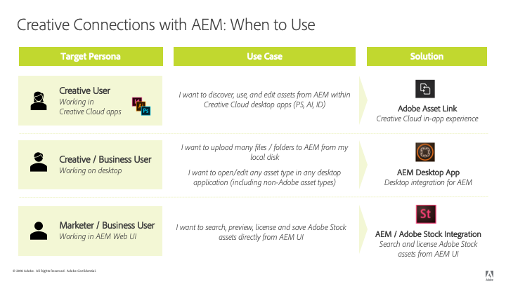

# [!DNL Adobe Experience Manager] e [!DNL Creative Cloud] práticas recomendadas de integração {#aem-and-creative-cloud-integration-best-practices}

| Versão | Link do artigo |
| -------- | ---------------------------- |
| AEM as a Cloud Service | [Clique aqui](https://experienceleague.adobe.com/docs/experience-manager-cloud-service/content/assets/manage/aem-cc-integration-best-practices.html?lang=en) |
| AEM 6.5 | Este artigo |
| AEM 6.4 | [Clique aqui](https://experienceleague.adobe.com/docs/experience-manager-64/assets/administer/aem-cc-integration-best-practices.html?lang=en) |

[!DNL Adobe Experience Manager Assets] O é uma solução de gerenciamento de ativos digitais (DAM) que pode se integrar ao [!DNL Adobe Creative Cloud] para ajudar usuários do DAM a trabalhar junto com equipes criativas, simplificando a colaboração no processo de criação de conteúdo.

[!DNL Adobe Creative Cloud] O fornece às equipes criativas um ecossistema de soluções e serviços para ajudá-las a criar ativos digitais. Ele inclui aplicativos móveis e de desktop, serviços em nuvem como armazenamento com sincronização de desktop ou experiência na Web, além de mercados como [!DNL Adobe Stock].

Leia para saber quais integrações devem ser escolhidas entre o desktop e o DAM de nível empresarial com base no seu caso de uso e quais são as práticas recomendadas associadas para os workflows de conexão.

>[!NOTE]
>
>[!DNL Experience Manager] para [!DNL Creative Cloud] o compartilhamento de pastas está obsoleto e não é mais coberto por este guia. O Adobe recomenda usar recursos mais recentes, como [Adobe Asset Link](https://helpx.adobe.com/br/enterprise/using/adobe-asset-link.html) ou [Aplicativo de desktop do Experience Manager](https://experienceleague.adobe.com/docs/experience-manager-desktop-app/using/troubleshoot.html) para fornecer ao usuário criativo acesso aos ativos gerenciados no [!DNL Experience Manager].

## Necessidades de colaboração de criadores, profissionais de marketing e usuários do DAM {#collaboration-needs-of-creatives-marketers-and-dam-users}

| Requisitos | Caso de uso | Superfícies envolvidas |
|---|---|---|
| Simplifique a experiência para criações no desktop | Simplifique o acesso a ativos de um DAM ([!DNL Experience Manager Assets]) para profissionais criativos, ou de maneira mais ampla, usuários de desktop que trabalham em aplicativos de criação de ativos nativos. Eles precisam de uma maneira fácil e direta de descobrir, usar (abrir), editar e salvar alterações no [!DNL Experience Manager], bem como fazer upload de novos arquivos. | Desktop Win ou Mac; [!DNL Creative Cloud] aplicativos |
| Fornecer ativos de alta qualidade e prontos para uso do [!DNL Adobe Stock] | Os profissionais de marketing ajudam a acelerar o processo de criação de conteúdo, auxiliando no fornecimento e descoberta de ativos. Profissionais de criação usam os ativos aprovados diretamente de suas ferramentas criativas. | [!DNL Experience Manager Assets]; [!DNL Adobe Stock] Mercado; campos de metadados |
| Distribuir e compartilhar ativos por organizações | Os departamentos internos/ramificações locais e parceiros externos, distribuidores e agências usam os ativos aprovados compartilhados pela organização pai. A organização deseja compartilhar com segurança e facilidade os ativos criados para reutilização mais ampla. | Brand Portal, Compartilhamento de Ativos Commons |

## Ofertas do Adobe para dar suporte à necessidade de colaboração {#adobe-offerings-to-support-the-collaboration-need}

| Proposta de valor para as personas envolvidas | oferta de Adobe | Superfícies envolvidas |
|---|---|---|
| Usuários criativos descobrem ativos de [!DNL Experience Manager], abra-as e use-as, edite e faça upload das alterações em [!DNL Experience Manager], bem como fazer upload de novos arquivos no [!DNL Experience Manager], sem sair [!DNL Creative Cloud] aplicativos. | [Adobe Asset Link](https://helpx.adobe.com/enterprise/using/adobe-asset-link.html) | [!DNL Adobe Photoshop], [!DNL Adobe Illustrator], e [!DNL Adobe InDesign]. |
| Usuários empresariais simplificam a abertura e o uso de ativos, a edição e o upload de alterações em [!DNL Experience Manager]e fazer upload de novos arquivos no [!DNL Experience Manager] no ambiente de desktop. Eles usam uma integração genérica para abrir qualquer tipo de ativo no aplicativo de desktop nativo, incluindo os não-Adobe. | [Aplicativo de desktop do Experience Manager](https://experienceleague.adobe.com/docs/experience-manager-desktop-app/using/using.html) | [!DNL Experience Manager] aplicativo de desktop no desktop Win e Mac |
| Profissionais de marketing e usuários empresariais descobrem, visualizam, licenciam e salvam e gerenciam o [!DNL Adobe Stock] ativos de dentro [!DNL Experience Manager]. Os ativos licenciados e salvos fornecem seleção [!DNL Adobe Stock] metadados para melhor governança. | [Integração do Experience Manager e Adobe Stock](aem-assets-adobe-stock.md) | [!DNL Experience Manager] interface da Web |

Este artigo foca principalmente nos dois primeiros aspectos das necessidades de colaboração. A distribuição e o fornecimento de ativos em escala são brevemente mencionadas como um caso de uso. Para essas necessidades, considere o Adobe Brand Portal ou o Asset Share Commons. Soluções alternativas, como [Brand Portal](https://experienceleague.adobe.com/docs/experience-manager-brand-portal/using/home.html), soluções que podem ser criadas com base em [Compartilhamento de ativos Commons](https://adobe-marketing-cloud.github.io/asset-share-commons/) componentes, [Compartilhamento de links](/help/assets/link-sharing.md), usando [Experience Manager Assets](/help/assets/manage-assets.md) devem ser revistas com base em requisitos específicos.

### Mapeamento de casos de uso e soluções Adobe {#mapping-of-use-cases-and-adobe-solutions}

<!-- TBD: Add some info about XD integration and possibly info about DA v2.0.
-->

| Caso de uso  | [!DNL Adobe Asset Link] | Aplicativo de desktop do [!DNL Experience Manager] | Observações / Outras soluções |
|---|---|---|---|
| Discover - procurar pastas do DAM | Sim | [!DNL Experience Manager] Interface da Web e ações da área de trabalho |  |
| Discover - acessar coleções de DAM | Sim | [!DNL Experience Manager] Interface da Web e ações da área de trabalho |  |
| Discover - pesquisar ativos do DAM | Sim | [!DNL Experience Manager] Interface da Web e ações da área de trabalho |  |
| Usar - abrir ativo | Sim | Sim | [Abrir da interface da Web](manage-assets.md#previewing-assets) ou do Finder |
| Usar - colocar ativo do DAM em um documento | Sim - incorporação | Sim - vinculação ou incorporação | [!DNL Experience Manager] o aplicativo de desktop fornece acesso a ativos como arquivos no sistema de arquivos local. Esses links nos aplicativos nativos são representados por caminhos locais. |
| Editar - abrir para edição | Sim - Ação de check-out | Sim - Abrir ação (no compartilhamento de rede) | [Check-out no AAL](https://helpx.adobe.com/br/enterprise/using/manage-assets-using-adobe-asset-link.html) salva o ativo na conta de armazenamento da creative cloud do usuário (sincronizada pelo aplicativo do Creative Cloud) por padrão. |
| Editar - trabalho em andamento fora do DAM | Sim - Ativo disponível na conta de armazenamento de Creative Cloud do usuário sincronizada com o desktop. | Sim |  |
| Editar - fazer upload de alterações | Sim - [Ação de check-in](https://helpx.adobe.com/enterprise/using/manage-assets-using-adobe-asset-link.html) com comentário opcional | Sim |  |
| Upload - arquivo único | Sim - carrega o documento ativo atual | Sim | [Fazer upload por meio da interface da Web](manage-assets.md#uploading-assets) |
| Upload - vários arquivos / estruturas hierárquicas de pastas | Não | Sim | [Fazer upload por meio da interface da Web](manage-assets.md#uploading-assets) ou por meio de scripts ou ferramentas personalizados. |
| Misc - usuário e logon | O usuário Creative Cloud conectado ao aplicativo de desktop Creative Cloud é reconhecido (SSO) | [!DNL Experience Manager] usuário e credenciais | Os usuários de ambas as soluções contam para a [!DNL Experience Manager] cota de usuário. |
| Misc - rede e acesso | Requer acesso do desktop do usuário para o [!DNL Experience Manager] implantação pela rede | Requer acesso do desktop do usuário para o [!DNL Experience Manager] implantação pela rede | [!DNL Adobe Asset Link] não compartilha o ambiente proxy de rede. |
| Diversos - Migrar um grande número de ativos | Não | Não | [Guia de migração de ativos](assets-migration-guide.md) |

Para suportar casos de uso de distribuição de ativos, outras soluções devem ser consideradas:

* [Brand Portal](https://experienceleague.adobe.com/docs/experience-manager-brand-portal/using/home.html) para um complemento configurável, SaaS para [!DNL Experience Manager Assets] para publicar ativos.
* As soluções personalizadas são criadas com base em [Compartilhamento de ativos Commons](https://adobe-marketing-cloud.github.io/asset-share-commons/) base de código.
* [!DNL Experience Manager] [compartilhamento de link](/help/assets/link-sharing.md) para compartilhar ativos ad hoc usando links.
* [Interface da Web do Experience Manager Assets](/help/assets/manage-assets.md) com zonas para partes externas garantidas por [!DNL Experience Manager] configuração do controle de acesso e com ajustes necessários de configuração de TI/rede, dando a esses usuários externos acesso [!DNL Experience Manager].

## Principais conceitos e casos de uso {#key-concepts-and-use-cases}

### Glossário de termos comuns {#glossary-of-common-terms}

* **Trabalho em andamento ou trabalho criativo em andamento (WIP)**: uma fase no ciclo de vida do ativo em que um ativo sofre várias alterações e normalmente ainda não está pronto para ser compartilhado com equipes maiores.
* **Ativos prontos para criação:** [!DNL Assets] que estejam prontos para serem compartilhadas com uma equipe maior ou tenham sido selecionadas ou aprovadas pela equipe criativa para compartilhamento com equipes de marketing ou LOB.
* **Aprovações de ativos**: o processo de aprovação que executa ativos já carregados no DAM, que normalmente inclui aprovações de marca, legais e assim por diante.
* **Ativo final**: um ativo que passou por todas as aprovações/marcações de metadados e está pronto para ser usado pela equipe maior. Esse ativo é armazenado no DAM e disponibilizado a todos os usuários (ou a todos os interessados). Ele pode ser usado em canais de marketing ou por equipes criativas para criar designs.
* **Atualização/alteração de ativos secundários:** uma pequena e rápida mudança em um ativo digital. Geralmente é feito em resposta a uma solicitação de retoque ou edição secundária, revisão de ativos ou aprovação (por exemplo, reposição, alteração do tamanho do texto, ajuste da saturação/brilho, cor e assim em diante).
* **Atualizações/alterações de ativos principais:** uma mudança em um ativo digital que requer trabalho considerável, e às vezes deve ser feita por um período mais longo. Normalmente, inclui várias alterações. O ativo deve ser salvo várias vezes durante a atualização. As atualizações de ativos principais normalmente fazem com que o ativo entre em um estágio WIP.
* **DAM:** Gerenciamento de ativos digitais. Neste documento, ele é sinônimo de [!DNL Experience Manager Assets], salvo menção em contrário.
* **Usuário criativo**: um profissional criativo, que cria ativos digitais usando aplicativos e serviços da Creative Cloud. Em alguns casos, um usuário criativo pode ser membro de uma equipe criativa que pode usar a Creative Cloud, mas não cria ativos digitais (como um diretor criativo ou gerente de equipe criativa).
* **Usuário do DAM:** um usuário típico de um sistema DAM. Dependendo da organização, um usuário do DAM pode ser um usuário de marketing ou não, por exemplo, um usuário de Linha de Negócios (LOB), um bibliotecário, um vendedor e assim por diante.

### Considerações ao usar [!DNL Experience Manager] e [!DNL Creative Cloud] integração {#considerations-when-using-aem-and-creative-cloud-integration}

* Consulte [práticas recomendadas do aplicativo de desktop](https://experienceleague.adobe.com/docs/experience-manager-desktop-app/using/troubleshoot.html#best-practices-to-prevent-troubles)
* Consulte [Integração do Adobe Stock](aem-assets-adobe-stock.md)
* Consulte o [Adobe Asset Link](https://helpx.adobe.com/enterprise/using/adobe-asset-link.html)

Este é um breve resumo das práticas recomendadas para [!DNL Experience Manager] e [!DNL Creative Cloud] integração. Leia o resto deste documento para obter a compreensão detalhada sobre eles.

* **Para usuários criativos, que trabalham no Photoshop, InDesign ou Illustrator:** o do Adobe Asset Link fornece a melhor experiência do usuário, incluindo a manipulação limpa do Trabalho em andamento em ativos tirados do [!DNL Experience Manager].
* **Para simplificar o acesso a ativos do desktop para qualquer formato de arquivo ou aplicativo genérico:** use [!DNL Experience Manager] aplicativo de desktop.
* **Entenda por que e quando armazenar ativos no DAM:** atualizações a serem disponibilizadas para a equipe maior em sua organização.
* **Considere o volume de ativos compartilhados:** se o caso de uso for a distribuição de ativos, a governança e a segurança podem ser os aspectos mais importantes. Considere usar ferramentas criadas para fazer isso em escala, como o Brand Portal.
* **Entenda o ciclo de vida do ativo:** saiba como os ativos são manipulados em sua organização por equipes diferentes
* **Lidar com salvamentos frequentes em ativos com cuidado:** o Adobe Asset Link cuida disso para você com PS, AI, ID. Em outros aplicativos, não realize tarefas em andamento na pasta mapeada/compartilhada, a menos que precise de todas as alterações no DAM

### Acesso ao [!DNL Adobe Stock] ativos de [!DNL Assets] {#access-to-adobe-stock-assets-from-aem-assets}

[Integração do Experience Manager e Adobe Stock](/help/assets/aem-assets-adobe-stock.md) forneça [!DNL Experience Manager] usuários com a capacidade de pesquisar, visualizar, licenciar e salvar ativos de [!DNL Adobe Stock] em [!DNL Experience Manager]. Licenciado e salvo [!DNL Stock] os ativos selecionaram [!DNL Stock] metadados, que podem ser usados para pesquisá-los com filtros extras.

Alguns pontos importantes sobre essa integração:

* Quando os ativos do estoque de Adobe são salvos em [!DNL Experience Manager], tornam-se um [!DNL Assets], com o binário salvo no [!DNL Experience Manager] repositório. Alguns metadados relacionados a [!DNL Adobe Stock] são salvas para o ativo em [!DNL Experience Manager]caso contrário, o processo de assimilação será igual ao de qualquer outro arquivo. Por exemplo, se as Tags inteligentes estiverem ativas, as tags serão adicionadas a esses ativos ao salvar.
* O ativo salvo em [!DNL Experience Manager] é uma cópia, não um link para [!DNL Adobe Stock].

**Trabalhar com ativos salvos de [!DNL Adobe Stock] em [!DNL Experience Manager] em[!DNL Creative Cloud]**. Essa integração é independente do [!DNL Adobe Asset Link], mas [!DNL Adobe Asset Link] reconhece esses ativos salvos de [!DNL Stock] dessa forma, e exibe metadados adicionais e um [!DNL Adobe Stock] logotipo desses ativos em [!DNL Adobe Asset Link] interface do usuário da extensão em [!DNL Photoshop], [!DNL Illustrator]ou [!DNL InDesign]. Os arquivos estão disponíveis para navegação, abertura e assim por diante, porque são ativos comuns quando salvos em [!DNL Experience Manager].
Usuários criativos que trabalham no [!DNL Creative Cloud] aplicativos com [!DNL Adobe Asset Link] extensão presente, além de ter acesso a ativos já licenciados do [!DNL Adobe Stock] em [!DNL Experience Manager], também pode usar [!DNL Creative Cloud] Painel Bibliotecas para pesquisar, visualizar e licenciar [!DNL Adobe Stock] ativos.
[!DNL Assets] from [!DNL Adobe Stock] licenciado e salvo em [!DNL Experience Manager] tornar-se disponível para as equipes mais amplas que acessam [!DNL Experience Manager Assets] , considerando que criativos licenciam ativos de [!DNL Adobe Stock] via [!DNL Creative Cloud] O painel Bibliotecas os os disponibiliza somente por padrão em suas [!DNL Creative Cloud] conta.

<!-- 
TBD: A condensed version of the below content is better placed in the Adobe DAM introduction article.
-->

## Sobre o armazenamento de ativos em um DAM {#about-storing-assets-in-a-dam}

Para projetar um fluxo de trabalho eficiente entre equipes de criação e de marketing/linha de negócios (LOB) e escolher os melhores recursos de suporte, é importante entender quando e por que os ativos são armazenados no DAM.

### Por que os ativos são armazenados no DAM {#why-assets-are-stored-in-dam}

Armazenar ativos no DAM os torna facilmente acessíveis e acessíveis. Ela garante que os ativos possam ser aproveitados por vários usuários na organização ou no ecossistema, o que inclui parceiros, clientes e assim por diante.

A maioria das organizações opta por armazenar apenas ativos relevantes para os processos de marketing/LOB de downstream (publicação em canais como canal da Web por meio de [!DNL Experience Manager Sites] ou outros canais servidos pelo Adobe Experience Cloud - Marketing Cloud, Advertising Cloud e medidos pela Analytics Cloud, fornecendo a usuários/parceiros e assim por diante). Além disso, as organizações armazenam ativos que podem estar sujeitos a um processo de revisão/aprovação no DAM. Dessa forma, o DAM armazena principalmente ativos que têm altas chances de serem aproveitados e evita o armazenamento de ativos inativos.

O armazenamento de ativos também está sujeito a considerações técnicas e de utilização de recursos. O DAM fornece serviços adicionais sobre ativos armazenados, incluindo extração de metadados, controle de versão, geração de visualizações/transcodificação, gerenciamento de referências e adição de informações de controle de acesso. Esses serviços consomem mais tempo e recursos de infraestrutura.

Geralmente, o armazenamento de todos os ativos e atualizações não é desejável. Por exemplo, se as atualizações de ativos específicos forem de baixa qualidade e consumirem recursos excessivos, os ativos podem não ser armazenados no DAM.

#### Quando os ativos são armazenados no DAM {#when-assets-are-stored-in-dam}

Geralmente, as equipes criativas (e organizações) não estão interessadas em armazenar ativos em cada estágio do ciclo de vida do ativo. Por exemplo, eles evitam armazenar ativos nos seguintes casos:

* Ativos que ainda não foram finalizados ou estão sujeitos a experimentação.
* Ativos que não passam no ciclo de análise de criação/equipe interna.
* Em comparação com o ativo em questão, a equipe tem melhores candidatos para representar seu trabalho para equipes externas.

Normalmente, os seguintes ativos de classes são armazenados no DAM:

* Ativos que atingiram um determinado prazo e são considerados prontos para serem partilhados.
* Ativos pré-selecionados pela equipe criativa.
* Formatos de ativos específicos que podem ser usados ou solicitados pelo marketing, dependendo de um contrato ou contrato específico (por exemplo, arquivos JPG convertidos de arquivos RAW, TIFF/imagens de originais do PSD).

#### Quando as atualizações de ativos são armazenadas no DAM {#when-updates-to-assets-are-stored-in-dam}

Como regra, somente as atualizações de ativos relevantes para o conjunto mais amplo de usuários do DAM devem ser armazenadas no DAM. Isso garante que os usuários (marketing e funções semelhantes) visualizem apenas as versões relevantes na linha do tempo do ativo do DAM.

Normalmente, as alterações estão relacionadas aos marcos principais no ciclo de vida do ativo. Por exemplo, o ativo pronto para marketing ou uma atualização oficial com base na solicitação/revisão fornecida pela equipe criativa deve ser armazenado e ter controle de versão no DAM.

A atualização da equipe criativa para revisão pela equipe de marketing após uma solicitação de alteração do ativo existente no DAM é um exemplo de uma atualização relevante. Ele deve ser armazenado e ter controle de versão no DAM para referência adicional ou para reverter para a versão anterior.

A seguir estão exemplos de atualizações que normalmente não são relevantes:

* Versões anteriores de ativos carregados antes de estarem prontos para análise de marketing
* Alterações criativas frequentes no ativo na fase de trabalho em andamento antes que as equipes criativas e de marketing decidam que o ativo está pronto

### Acesso do usuário ao DAM {#user-access-to-dam}

[!DNL Assets] O suporta dois tipos de usuários com base em seu acesso ao [!DNL Assets] implantação. Normalmente, os usuários dentro da rede corporativa (firewall) têm acesso direto ao DAM. Outros utilizadores fora da rede empresarial não teriam acesso direto. O tipo de usuário determina quais integrações podem ser usadas do ponto de vista técnico.

#### Usuários criativos com acesso direto ao DAM {#creative-users-with-direct-access-to-dam}

Normalmente, as equipes de criação interna ou agências/profissionais de criação integrados à rede interna têm acesso à implantação do DAM, incluindo [!DNL Experience Manager] fazer logon. [!DNL Experience Manager] e a infraestrutura de rede pode ser configurada para permitir acesso direto a partes externas - geralmente organizações confiáveis como agências que trabalham para um cliente - para ter acesso ao [!DNL Experience Manager] pela rede, por exemplo, via VPN ou lista de permissões IP.

Em tais casos, o Adobe Asset Link ou [!DNL Experience Manager] o aplicativo de desktop ajuda a fornecer acesso fácil a ativos finais/aprovados e permite salvar ativos prontos para criação no DAM.

#### Usuários criativos sem acesso ao DAM {#creative-users-without-access-to-dam}

Agências externas e freelancers sem acesso direto à implantação do DAM podem exigir acesso a ativos aprovados ou desejar adicionar seus novos designs ao DAM.

Use as seguintes estratégias para fornecer acesso a ativos finais/aprovados:

* Use o aplicativo de desktop se o Asset Link não funcionar.
* Use [Experience Manager Assets Brand Portal](https://experienceleague.adobe.com/docs/experience-manager-brand-portal/using/home.html) para distribuir ativos com segurança para parceiros externos
* Usar uma implementação personalizada de um portal de distribuição e fornecimento com base em [Compartilhamento de ativos Commons](https://adobe-marketing-cloud.github.io/asset-share-commons/)
* Usar a configuração de Controle de Acesso em [!DNL Experience Manager] e a infraestrutura de rede necessária (por exemplo, VPN e lista de permissões de IP) para dar a terceiros acesso a uma área dedicada de conteúdo no DAM. Eles podem usar [!DNL Experience Manager] Interface do usuário da Web para obter ativos e carregar novo conteúdo no DAM.

#### Trabalho em andamento em ativos de [!DNL Experience Manager] {#work-in-progress-on-assets-from-aem}

Conforme discutido neste documento, é recomendável realizar atualizações importantes em ativos, às vezes chamados de trabalho em andamento, sem ter todas as edições salvas no arquivo local também carregadas para [!DNL Experience Manager] conforme alterado. Isso acelera o trabalho de um usuário de desktop, limita a largura de banda da rede usada e mantém a linha do tempo dos ativos limpa e focada em atualizações importantes e controladas.

O Adobe Asset Link oferece um bom suporte para este caso de uso:

* Quando os usuários [!DNL Photoshop], [!DNL InDesign]ou [!DNL Illustrator] com o objetivo de editar um arquivo, eles executam uma operação de Check-out no ativo em questão
* O ativo é baixado em segundo plano, colocado na conta do Creative Cloud de usuários sincronizada ao disco pelo aplicativo de desktop do Creative Cloud e o sinalizador de check-out é alternado [!DNL Experience Manager] no ativo para minimizar conflitos de edição
* A partir daí, o usuário trabalha em um arquivo armazenado localmente no local sincronizado e pode continuar trabalhando e salvando as alterações necessárias a qualquer frequência necessária
* Além disso, como o ativo está na conta do Creative Cloud, ele também está disponível em outros dispositivos que o usuário pode ter (por exemplo, pode ser aberto ou editado em um aplicativo móvel Creative Cloud dedicado) e pode ser compartilhado com outros usuários do Creative Cloud para fins de colaboração.
* Quando o usuário criativo terminar com as alterações, ele poderá executar uma operação de Check-in nesse arquivo em seu aplicativo Creative Cloud, com um comentário opcional. O ativo correspondente em [!DNL Experience Manager] têm controle de versão e são atualizadas para com o novo binário. [!DNL Experience Manager] usuários como profissionais de marketing ou usuários de LOB têm acesso às principais alterações de ativos ou marcos por meio de [!DNL Experience Manager] interface do usuário da linha do tempo do ativo.

[!DNL Experience Manager] o aplicativo de desktop fornece um compartilhamento de rede para ativos abertos no aplicativo nativo. Por padrão, todas as alterações feitas localmente são carregadas no [!DNL Experience Manager] automaticamente após um breve período. Com essa configuração, salvas frequentes durante a fase de trabalho em andamento seriam carregadas para [!DNL Experience Manager] e versão, criando muito tráfego de rede e possíveis desafios de escalabilidade - para não mencionar versões desnecessárias no [!DNL Experience Manager].

A abordagem recomendada aqui é usar uma opção em [!DNL Experience Manager] aplicativo de desktop para desativar atualizações automáticas e fazer upload de alterações em ativos para [!DNL Experience Manager] manualmente, aproveitando a ação de fazer upload de alterações na interface do usuário de status do ativo do aplicativo.

#### Upload em massa no DAM {#bulk-upload-to-dam}

Você pode ter um requisito para fazer upload simultâneo de um número maior de arquivos no DAM em alguns cenários, por exemplo:

* Upload de resultados de fotos ou projetos maiores
* Upload de ativos fornecidos por agências criativas
* Fazer upload dos ativos selecionados de um conjunto maior se a seleção for feita fora do DAM

A descrição se refere ao upload de arquivos operacionalmente (por exemplo, toda semana ou com cada sessão fotográfica), como parte normal do fluxo de trabalho do usuário do desktop. As migrações de ativos grandes não são contempladas aqui.

Você pode aproveitar os seguintes recursos de upload:

* Para fazer upload de pastas grandes/hierárquicas em massa, use [!DNL Experience Manager] aplicativo de desktop que fornece [upload de pasta](https://experienceleague.adobe.com/docs/experience-manager-desktop-app/using/using.html#upload-and-add-new-assets-to-aem) funcionalidade. Também é possível fazer upload de estruturas hierárquicas de pastas. [!DNL Assets] são carregadas em segundo plano e, portanto, não estão vinculadas a uma sessão do navegador da Web
* Para carregar alguns arquivos de uma única pasta, arraste os arquivos diretamente para a interface da Web ou use a opção Criar na [!DNL Assets] interface da Web.
* Dependendo dos requisitos de sua empresa, você também pode usar o carregador personalizado.

#### Gerenciar ativos digitais diretamente do desktop {#managing-digital-assets-directly-from-desktop}

Se você usar Compartilhamentos de arquivos de rede para gerenciar ativos digitais, usando apenas o compartilhamento de rede mapeado por [!DNL Experience Manager] o aplicativo de desktop pode ser visto como um substituto conveniente. Durante a transição de compartilhamentos de arquivos de rede, [!DNL Experience Manager] a interface da Web fornece um conjunto avançado de recursos de Gerenciamento de ativos digitais que vai muito além do que é possível em um compartilhamento de rede (pesquisa, coleções, metadados, colaboração, visualizações e assim por diante), e [!DNL Experience Manager] o aplicativo de desktop fornece um link útil para conectar o repositório DAM do lado do servidor com o trabalho no desktop.

Evite usar [!DNL Experience Manager] aplicativo de desktop para gerenciar ativos diretamente no compartilhamento de rede do [!DNL Assets]. Por exemplo, evite usar [!DNL Experience Manager] aplicativo de desktop para mover/copiar vários arquivos. Em vez disso, use o [!DNL Assets] interface para arrastar as pastas do Localizador/Explorer para o compartilhamento de rede ou usar o [!DNL Assets] Recurso de upload de pasta.

#### Migração de ativos {#asset-migration}

Para planejar e executar as migrações de ativos do sistema existente para um novo sistema ou a migração de um grande volume de ativos armazenados em servidores, consulte o [Guia de migração](/help/assets/assets-migration-guide.md). [!DNL Experience Manager] aplicativo de desktop e [!DNL Experience Manager] para [!DNL Creative Cloud] as integrações não são compatíveis com essas migrações. Devido aos grandes volumes de ativos a serem assimilados e aos requisitos adicionais sobre mapeamento, transformação e assimilação de metadados, as migrações devem ser tratadas usando diferentes ferramentas e abordagens.

>[!MORELIKETHIS]
>
>* [Adobe Asset Link](https://helpx.adobe.com/enterprise/using/adobe-asset-link.html)
>* [Práticas recomendadas para aplicativos de desktop do Experience Manager](https://experienceleague.adobe.com/docs/experience-manager-desktop-app/using/archive/best-practices-for-v1.html)
>* [Experience Manager Brand Portal](https://experienceleague.adobe.com/docs/experience-manager-brand-portal/using/introduction/brand-portal.html)
>* [Integração do Experience Manager e Adobe Stock](aem-assets-adobe-stock.md)

