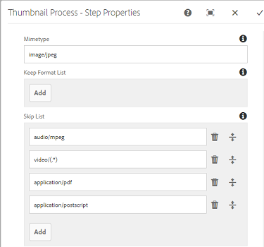

# Usar o PDF Rasterizer {#using-pdf-rasterizer}

Ao fazer upload de arquivos PDF ou AI grandes e com uso intenso de conteúdo para [!DNL Adobe Experience Manager Assets], a biblioteca padrão pode não gerar uma saída precisa. O Adobe pode gerar uma saída mais confiável e precisa em comparação com uma biblioteca padrão. O Adobe recomenda usar a biblioteca Rasterizer de PDF para os seguintes cenários:

O Adobe recomenda usar a biblioteca Rasterizer de PDF para o seguinte:

* Arquivos AI ou PDF com grande quantidade de conteúdo.
* Arquivos AI e PDF com miniaturas que não são geradas por padrão.
* Arquivos AI com cores Pantone Matching System (PMS).

As miniaturas e visualizações geradas com o PDF Rasterizer têm melhor qualidade em comparação com a saída predefinida e, portanto, fornecem uma experiência de visualização consistente em todos os dispositivos. A biblioteca Adobe PDF Rasterizer não oferece suporte a nenhuma conversão de espaço de cores. Ele sempre gera para RGB independentemente do espaço de cores do arquivo de origem.

1. Instale o pacote PDF Rasterizer na sua implantação [!DNL Adobe Experience Manager] a partir de [Distribuição de software](https://experience.adobe.com/#/downloads/content/software-distribution/en/aem.html?package=/content/software-distribution/en/details.html/content/dam/aem/public/adobe/packages/cq640/product/assets/aem-assets-pdf-rasterizer-pkg).

   >[!NOTE]
   >
   >A biblioteca PDF Rasterizer está disponível somente para Windows e Linux.

1. Acesse o console [!DNL Assets] do workflow em `https://[aem_server]:[port]/workflow`. Abra o [!UICONTROL DAM Update Asset] fluxo de trabalho.

1. Para impedir a geração de miniaturas e renderizações da Web para arquivos PDF e arquivos AI usando os métodos padrão, siga estas etapas:

   * Abra a etapa **[!UICONTROL Processar miniaturas]** e adicione `application/pdf` ou `application/postscript` no campo **[!UICONTROL Ignorar tipos MIME]** na guia **[!UICONTROL Miniaturas]** conforme necessário.

   

   * Na guia **[!UICONTROL Imagem ativada pela Web]**, adicione `application/pdf` ou `application/postscript` em **[!UICONTROL Ignorar lista]** dependendo de seus requisitos.

   

1. Abra a etapa **[!UICONTROL Rasterizar PDF/Representação de visualização de imagem AI]** e remova o tipo MIME para o qual deseja ignorar a geração padrão de representações de imagens de visualização. Por exemplo, remova o tipo MIME `application/pdf`, `application/postscript` ou `application/illustrator` da lista **[!UICONTROL MIME Types]**.

   

1. Arraste a etapa **[!UICONTROL Manipulador de rasterizador de PDF]** do painel lateral para abaixo da etapa **[!UICONTROL Processar miniaturas]**.
1. Configure os seguintes argumentos para a etapa **[!UICONTROL Manipulador de Rasterizador de PDF]**:

   * Tipos MIME: `application/pdf` ou `application/postscript`
   * Comandos: `PDFRasterizer -d -s 1280 -t PNG -i ${file}`
   * Adicionar tamanhos de miniatura: 319:319, 140:100, 48:48. Adicione a configuração personalizada de miniatura, se necessário.

   Os argumentos da linha de comando para o comando `PDFRasterizer` podem incluir o seguinte:

   * `-d`: Sinalizador para permitir uma renderização suave do texto, da arte-final vetorial e das imagens. Cria imagens de melhor qualidade. No entanto, incluir esse parâmetro faz com que o comando seja executado lentamente e aumente o tamanho das imagens.

   * `-s`: Dimensão máxima da imagem (altura ou largura). Isso é convertido em DPI para cada página. Se as páginas tiverem um tamanho diferente, cada página poderá ser dimensionada de forma diferente. O padrão é o tamanho real da página.

   * `-t`: Tipo de imagem de saída. Os tipos válidos são JPEG, PNG, GIF e BMP. O valor padrão é JPEG.

   * `-i`: Caminho para entrada de PDF. É um parâmetro obrigatório.

   * `-h`: Ajuda

1. Para excluir representações intermediárias, selecione **[!UICONTROL Excluir representação gerada]**.
1. Para permitir que o PDF Rasterizer gere renderizações da Web, selecione **[!UICONTROL Gerar representação da Web]**.

   

1. Especifique as configurações na guia **[!UICONTROL Imagem ativada pela Web]**.

   

1. Salve o workflow.
1. Para permitir que o PDF Rasterizer processe páginas PDF com bibliotecas PDF, abra o modelo **[!UICONTROL DAM Process Subasset]** no console [!UICONTROL Workflow].
1. No painel lateral, arraste a etapa Manipulador de rasterizador de PDF na etapa **[!UICONTROL Criar representação de imagem ativada para a Web]**.
1. Configure os seguintes argumentos para a etapa **[!UICONTROL Manipulador de Rasterizador de PDF]**:

   * Tipos MIME: `application/pdf` ou `application/postscript`
   * Comandos: `PDFRasterizer -d -s 1280 -t PNG -i ${file}`
   * Adicionar tamanhos de miniatura: `319:319`, `140:100`, `48:48`. Adicione a configuração personalizada de miniatura, conforme necessário.

   Os argumentos da linha de comando para o comando `PDFRasterizer` podem incluir o seguinte:

   * `-d`: Sinalizador para permitir uma renderização suave do texto, da arte-final vetorial e das imagens. Cria imagens de melhor qualidade. No entanto, incluir esse parâmetro faz com que o comando seja executado lentamente e aumente o tamanho das imagens.

   * `-s`: Dimensão máxima da imagem (altura ou largura). Isso é convertido em DPI para cada página. Se as páginas tiverem um tamanho diferente, cada página poderá ser dimensionada de forma diferente. O padrão é o tamanho real da página.

   * `-t`: Tipo de imagem de saída. Os tipos válidos são JPEG, PNG, GIF e BMP. O valor padrão é JPEG.

   * `-i`: Caminho para entrada de PDF. É um parâmetro obrigatório.

   * `-h`: Ajuda

1. Para excluir representações intermediárias, selecione **[!UICONTROL Excluir representação gerada]**.
1. Para permitir que o PDF Rasterizer gere renderizações da Web, selecione **[!UICONTROL Gerar representação da Web]**.

   

1. Especifique as configurações na guia **[!UICONTROL Imagem ativada pela Web]**.

   

1. Salve o workflow.
1. Carregue um arquivo PDF ou um arquivo AI para [!DNL Experience Manager Assets]. O PDF Rasterizer gera as miniaturas e renderizações da Web para o arquivo.
