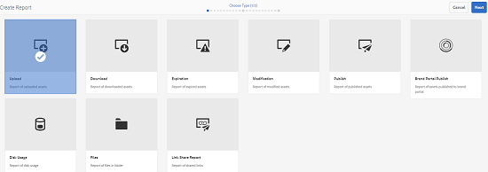

# Relatórios de ativos {#asset-reports}

| Versão | Link do artigo |
| -------- | ---------------------------- |
| AEM as a Cloud Service | [Clique aqui](https://experienceleague.adobe.com/docs/experience-manager-cloud-service/content/assets/admin/asset-reports.html?lang=en) |
| AEM 6.5 | Este artigo |

Os relatórios de ativos permitem avaliar a utilidade do [!DNL Adobe Experience Manager Assets] implantação. Com [!DNL Assets], você pode gerar vários relatórios para seus ativos digitais. Os relatórios fornecem informações úteis sobre o uso do sistema, como os usuários interagem com ativos e quais ativos são baixados e compartilhados.

Use as informações nos relatórios para obter as principais métricas de sucesso e medir a adoção de [!DNL Assets] em sua empresa e por clientes.

A variável [!DNL Assets] usos da estrutura de relatórios [!DNL Sling] processos para processar solicitações de relatório de forma assíncrona e ordenada. Ele é escalável para repositórios grandes. O processamento assíncrono de relatórios aumenta a eficiência e a velocidade com que os relatórios são gerados.

A interface de gerenciamento de relatórios é intuitiva e inclui opções e controles refinados para acessar relatórios arquivados e exibir status de execução de relatórios (bem-sucedido, com falha e em fila).

Quando um relatório é gerado, você é notificado por email (opcional) e uma notificação na caixa de entrada. É possível visualizar, baixar ou excluir um relatório da página de listagem de relatórios, na qual todos os relatórios gerados anteriormente são exibidos.

## Pré-requisitos {#prerequisite-for-reporting}

Para gerar relatórios, faça o seguinte:

* Ativar [!UICONTROL Gravador de eventos DAM CQ do dia] serviço de **[!UICONTROL Ferramentas]** > **[!UICONTROL Operações]** > **[!UICONTROL Console da Web]**.
* Selecione as atividades ou eventos sobre os quais deseja criar relatórios. Por exemplo, para gerar um relatório sobre ativos baixados, selecione [!UICONTROL Ativo baixado (BAIXADO)].

## Gerar relatórios {#generate-reports}

[!DNL Experience Manager Assets] O gera os seguintes relatórios padrão para você:

* Upload
* Download
* Expiração
* Modificação
* Publicação
* [!DNL Brand Portal] publicar
* Uso do disco
* Arquivos
* Compartilhamento de link

[!DNL Adobe Experience Manager] os administradores podem gerar e personalizar facilmente esses relatórios para sua implementação. Um administrador pode seguir estas etapas para gerar um relatório:

1. Entrada [!DNL Experience Manager] clique em **[!UICONTROL Ferramentas]** > **[!UICONTROL Assets]** > **[!UICONTROL Relatórios]**.

   

1. No [!UICONTROL Relatórios de ativos] clique em **[!UICONTROL Criar]** na barra de ferramentas.
1. No **[!UICONTROL Criar relatório]** escolha o relatório que deseja criar e clique em **[!UICONTROL Próxima]**.

   

   >[!NOTE]
   >
   >Por padrão, os Fragmentos de conteúdo e compartilhamentos de links são incluídos no Ativo [!UICONTROL Baixar] relatório. Selecione a opção apropriada para criar um relatório de compartilhamentos de links ou excluir Fragmentos de conteúdo do relatório de download.

   >[!NOTE]
   >
   >A variável [!UICONTROL Baixar] O relatório de exibe detalhes apenas dos ativos que são baixados após a seleção individual ou que são baixados usando a Ação rápida. No entanto, não inclui os detalhes dos ativos que estão dentro de uma pasta baixada.

1. Configure os detalhes do relatório, como título, descrição, miniatura e caminho da pasta no repositório CRX onde o relatório está armazenado. Por padrão, o caminho da pasta é `/content/dam`. Você pode especificar um caminho diferente.

   

   Escolha o intervalo de datas do relatório.

   Você pode optar por gerar o relatório agora ou em uma data e hora futuras.

   >[!NOTE]
   >
   >Se optar por agendar o relatório posteriormente, certifique-se de especificar a data e a hora nos campos Data e Hora. Se você não especificar nenhum valor, o mecanismo de relatório o tratará como um relatório a ser gerado instantaneamente.

   Os campos de configuração podem diferir de acordo com o tipo de relatório que você cria. Por exemplo, a variável **[!UICONTROL Uso do disco]** O relatório de fornece opções para incluir representações de ativos ao calcular o espaço em disco usado pelos ativos. Você pode optar por incluir ou excluir ativos em subpastas para cálculo de uso do disco.

   >[!NOTE]
   >
   >O relatório **[!UICONTROL Uso de disco]** não inclui campos de intervalo de datas porque indica apenas o uso atual do espaço em disco.

   

   Ao criar a variável **[!UICONTROL Arquivos]** incluir/excluir subpastas. No entanto, não é possível incluir representações de ativos neste relatório.

   

   A variável **[!UICONTROL Compartilhamento de link]** O relatório de exibe URLs de ativos que são compartilhados com usuários externos a partir do [!DNL Assets]. Inclui IDs de email do usuário que compartilhou os ativos, IDs de email de usuários com os quais os ativos são compartilhados, data de compartilhamento e data de expiração do link. As colunas não são personalizáveis.

   A variável **[!UICONTROL Compartilhamento de link]** relatório, não inclui opções para subpastas e representações porque apenas publica os URLs compartilhados que aparecem em `/var/dam/share`.

   

1. Clique em **[!UICONTROL Próxima]** na barra de ferramentas.

1. No **[!UICONTROL Configurar colunas]** algumas colunas são selecionadas para aparecer no relatório por padrão. Você pode selecionar mais colunas. Cancele a seleção de uma coluna para excluí-la no relatório.

   

   Para exibir um nome de coluna ou caminho de propriedade personalizado, configure as propriedades para o binário de ativo no `jcr:content` no CRX. Como alternativa, adicione-o por meio do seletor de caminho de propriedade.

   

1. Clique em **[!UICONTROL Criar]** na barra de ferramentas. Uma mensagem notifica que a geração de relatório foi iniciada.
1. No [!UICONTROL Relatórios de ativos] página, o status de geração de relatório é baseado no estado atual do trabalho de relatório, por exemplo, [!UICONTROL Sucesso], [!UICONTROL Failed], [!UICONTROL Em fila]ou [!UICONTROL Agendado]. O mesmo status aparece na caixa de entrada de notificações.Para exibir a página do relatório, clique no link do relatório. Como alternativa, selecione o relatório e clique em **[!UICONTROL Exibir]** na barra de ferramentas.

   <!---->
   [Status do relatório](assets/report-status.JPG)

   Clique em **[!UICONTROL Baixar]** na barra de ferramentas para baixar o relatório no formato CSV.

## Adicionar colunas personalizadas {#add-custom-columns}

Você pode adicionar colunas personalizadas aos seguintes relatórios para exibir mais dados de acordo com seus requisitos personalizados:

* Upload
* Download
* Expiração
* Modificação
* Publicação
* [!DNL Brand Portal] publicar
* Arquivos

Para adicionar colunas personalizadas a esses relatórios, siga estas etapas:

1. No [!DNL Manager interface], clique em **[!UICONTROL Ferramentas]** > **[!UICONTROL Assets]** > **[!UICONTROL Relatórios]**.
1. No [!UICONTROL Relatórios de ativos] clique em **[!UICONTROL Criar]** na barra de ferramentas.

1. No **[!UICONTROL Criar relatório]** escolha o relatório que deseja criar e clique em **[!UICONTROL Próxima]**.
1. Configure os detalhes do relatório, como título, descrição, miniatura, caminho da pasta e intervalo de datas, conforme aplicável.

1. Para exibir uma coluna personalizada, especifique o nome da coluna em **[!UICONTROL Colunas personalizadas]**.

   

1. Adicione o caminho da propriedade sob o `jcr:content` no CRXDE usando o seletor de caminho de propriedade. Como alternativa, digite o caminho no campo caminho da propriedade.

   

   Para adicionar mais colunas personalizadas, clique em **[!UICONTROL Adicionar]** e repita as etapas 5 e 6.

1. Clique em **[!UICONTROL Criar]** na barra de ferramentas. Uma mensagem notifica que a geração de relatório foi iniciada.

## Configurar serviço de limpeza {#configure-purging-service}

Para remover relatórios desnecessários, configure o serviço de Limpeza de relatórios do DAM no console da Web para limpar os relatórios existentes com base na quantidade e idade.

1. Acesse o console da Web (gerenciador de configurações) em `https://[aem_server]:[port]/system/console/configMgr`.
1. Abra o **[!UICONTROL Serviço de limpeza de relatório DAM]** configuração.
1. Especifique a frequência (intervalo de tempo) do serviço de expurgação na `scheduler.expression.name` campo. Você também pode configurar a idade e o limite de quantidade dos relatórios.
1. Salve as alterações.

## Informações sobre solução de problemas, dicas e limitações {#best-practices-and-limitations}

* Se alguns relatórios ou números nos relatórios não estiverem disponíveis ou como esperado, verifique se [!UICONTROL Gravador de eventos DAM CQ do dia] serviço está ativado.

* Remova os relatórios que não são mais necessários. Use as opções de configuração no serviço de Limpeza de relatório do DAM para configurar os critérios para limpar relatórios.

* Se o Relatório de uso de disco não for gerado e você estiver usando [!DNL Dynamic Media], certifique-se de que todos os ativos prossigam corretamente. Para resolver, reprocesse os ativos e gere o relatório novamente.
