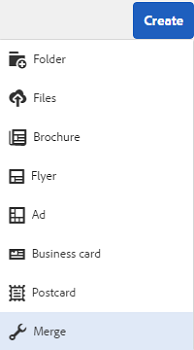

# Asset templates {#asset-templates}

Os modelos de ativos são uma classe especial de ativos que facilitam a rápida redefinição de objetivos de conteúdo visualmente rico para mídia digital e impressa. Um modelo de ativo inclui duas partes, a seção de mensagens fixas e a seção editável. A seção de mensagens fixas pode conter conteúdo proprietário, como o logotipo da marca e as informações de direitos autorais que estão desativados para edição. A seção editável pode conter conteúdo visual e textual em campos que podem ser editados para personalizar as mensagens.

A flexibilidade para fazer edições limitadas e, ao mesmo tempo, proteger a sinalização global torna os modelos de ativos os elementos básicos ideais para a adaptação e distribuição rápidas de conteúdo como artefatos de conteúdo para várias funções. A redefinição de metas de conteúdo ajuda a reduzir o custo de gerenciamento de canais digitais e impressos, além de oferecer experiências holísticas e consistentes nesses canais.

Como comerciante, você pode armazenar e gerenciar modelos dentro de um único modelo básico [!DNL Experience Manager Assets] e usar um único modelo para criar várias experiências de impressão personalizadas com facilidade. Você pode criar vários tipos de materiais de suporte de marketing, incluindo folhetos, folhetos, cartões postais, cartões de visita e assim por diante, para transmitir de forma lúdica sua mensagem de marketing aos clientes. Você também pode reunir saídas de impressão de várias páginas de saídas de impressão novas ou existentes. Acima de tudo, você pode fornecer experiências digitais e de impressão simultaneamente com facilidade, para proporcionar uma experiência consistente e integrada aos usuários.

Embora os modelos de ativos sejam principalmente [!DNL Adobe InDesign] arquivos, a proficiência em não [!DNL Adobe InDesign] é uma barreira para a criação de artefatos estelares. Não é necessário mapear os campos do seu [!DNL Adobe InDesign] modelo com os campos do produto que você precisaria para criar catálogos. Você pode editar os modelos no modo WYSIWYG diretamente na interface da Web. No entanto, para [!DNL Adobe InDesign] processar suas alterações de edição, é necessário primeiro configurar [!DNL Experience Manager Assets] para integrar com [!DNL Adobe InDesign Server].

A capacidade de editar [!DNL Adobe InDesign] modelos na interface da Web ajuda a promover maior colaboração entre a equipe de criação e marketing. O aumento da velocidade do conteúdo reduz o tempo de entrada no mercado para os colaterais de marketing.

Você pode obter o seguinte com modelos de ativos:

* Modifique campos de modelo editáveis da interface da Web.
* Controle o estilo básico do texto, por exemplo, tamanho da fonte, estilo e tipo no nível da tag.
* Altere as imagens no modelo usando o Seletor de conteúdo.
* Edições de modelo de pré-visualização.
* Mesclar vários arquivos de modelo para criar um artefato de várias páginas.

Quando você escolhe um modelo para seu material de apoio, [!DNL Experience Manager Assets] cria uma cópia do modelo que você pode editar. O modelo original é preservado, garantindo que sua assinatura global permaneça intacta e possa ser reutilizada para reforçar a consistência da marca.

É possível exportar o arquivo atualizado dentro da pasta pai nos formatos INDD, PDF ou JPG. Também é possível baixar a saída nesses formatos para o sistema de arquivos local.

## Criar uma garantia {#creating-a-collateral}

Considere um cenário em que você deseja criar materiais de suporte para impressão digital, como folhetos, folhetos e anúncios para uma próxima campanha e compartilhar com lojas de varejo globalmente. A criação de material de apoio com base em um modelo ajuda a fornecer uma experiência unificada ao cliente em todos os canais. Os designers podem criar os templates de campanha (página única ou página múltipla) usando uma solução criativa, como [!DNL InDesign] e fazer upload dos modelos [!DNL Experience Manager Assets] para você. Antes de criar um material de apoio, faça com que um ou mais modelos INDD sejam carregados e disponibilizados [!DNL Experience Manager] antecipadamente.

1. Na [!DNL Experience Manager] interface, clique em [!UICONTROL Ativos].

1. Nas opções, escolha **[!UICONTROL Modelos]**.

   

1. Clique em **[!UICONTROL Criar]** e escolha o material de apoio que deseja criar no menu. Por exemplo, escolha **[!UICONTROL Brochura]**.

   

1. Faça com que um ou mais modelos INDD sejam carregados e disponibilizados [!DNL Experience Manager] antecipadamente. Escolha um modelo para o folheto e clique em **[!UICONTROL Avançar]**.
1. Especifique um nome e uma descrição opcional para o folheto.

   

1. (Opcional) Clique em **[!UICONTROL Tags]** e selecione uma ou mais tags para o folheto. Clique em **[!UICONTROL Confirmar]** para confirmar sua seleção.
1. Clique em **[!UICONTROL Criar]**. Uma caixa de diálogo confirma que um novo folheto foi criado. Clique em **[!UICONTROL Abrir]** para abrir o folheto no modo de edição.

   <!-- -->

   Como alternativa, feche a caixa de diálogo e navegue até a pasta na página Modelos que você começou para visualização o folheto que criou. O tipo de garantia aparece na sua miniatura na visualização do cartão. Por exemplo, neste caso, a palavra [!UICONTROL Brochure] é exibida na miniatura.

   

## Editar um material de apoio {#editing-a-collateral}

Você pode editar um material de apoio imediatamente após criá-lo. Como alternativa, abra-o na página [!UICONTROL Modelos] ou na página de ativos.

1. Para abrir o material promocional para edição, execute um dos procedimentos a seguir:

   * Abra o material de apoio (neste caso, folheto) criado na etapa 7 de [Criar um material de apoio](/help/assets/asset-templates.md#creating-a-collateral).
   * Na página Modelos, navegue até uma pasta na qual você criou o material de apoio e clique na ação rápida [!UICONTROL Editar] na miniatura de um material de apoio.
   * Na página de ativos do material de apoio, clique em **[!UICONTROL Editar]** na barra de ferramentas.
   * Select the collateral and click **[!UICONTROL Edit]** from the toolbar.

   <!-- -->

   O localizador de ativos e o editor de texto são exibidos à esquerda da página. O editor de texto é aberto por padrão.

   Você pode usar o editor de texto para modificar o texto que deseja exibir no campo de texto. É possível modificar o tamanho, o estilo, a cor e o tipo da fonte no nível da tag.

   Usando o localizador de ativos, você pode navegar ou procurar por imagens dentro [!DNL Experience Manager Assets] e substituir as imagens editáveis no modelo por imagens de sua escolha.

   

   Os editáveis são exibidos à direita. Para que um campo possa ser editado, [!DNL Experience Manager Assets]o campo correspondente no modelo deve estar marcado [!DNL InDesign]. Em outras palavras, eles devem ser marcados como editáveis em [!DNL InDesign].

   >[!NOTE]
   >
   >Certifique-se de que sua [!DNL Experience Manager] implantação esteja integrada com um [!DNL InDesign Server] para permitir [!DNL Experience Manager Assets] a extração de dados do [!DNL InDesign] modelo e disponibilizá-los para edição. Para obter detalhes, consulte [integrar os ativos Experience Manager com o InDesign Server](/help/assets/indesign.md).

1. Para modificar o texto em um campo editável, clique no campo de texto da lista de campos editáveis e edite o texto no campo.

   

   É possível editar as propriedades do texto, por exemplo, estilo de fonte, cor e tamanho usando as opções fornecidas.

1. Clique em **[!UICONTROL Pré-visualização]** para pré-visualização das alterações de texto.

1. Para trocar uma imagem, clique no Localizador **[!UICONTROL de]** ativos .

1. Selecione o campo de imagem na lista de campos editáveis e arraste uma imagem desejada do seletor de ativos para o campo editável.

   

   Você também pode pesquisar por imagens usando palavras-chave, tags e com base no status de publicação. Você pode navegar pelo [!DNL Experience Manager Assets] repositório e navegar até o local da imagem desejada.

   

1. Clique em **[!UICONTROL Pré-visualização]** para pré-visualização da imagem.
1. Para editar uma página específica em um material promocional de várias páginas, use o navegador da página na parte inferior.

1. Clique em **[!UICONTROL Pré-visualização]** na barra de ferramentas para pré-visualização de todas as alterações. Clique em **[!UICONTROL Concluído]** para salvar as alterações de edição no material de apoio.

   >[!NOTE]
   >
   >As opções Pré-visualização e Concluído são ativadas somente quando os campos de imagem editáveis no material de apoio não têm ícones ausentes. Se houver ícones ausentes em seu material de apoio, isso ocorre porque não [!DNL Experience Manager] é possível resolver as imagens no [!DNL InDesign] modelo. Normalmente, não [!DNL Experience Manager] é possível resolver imagens nos seguintes casos:
   >
   >* As imagens não são incorporadas no [!DNL InDesign] modelo subjacente.
   >* As imagens são vinculadas do sistema de arquivos local.

   >
   >Para permitir [!DNL Experience Manager] a resolução de imagens, faça o seguinte:
   >
   >* Incorporar imagens ao criar [!DNL InDesign] modelos (Consulte [Sobre links e gráficos](https://helpx.adobe.com/indesign/using/graphics-links.html)incorporados).
   >* Monte [!DNL Experience Manager] no seu sistema de arquivos local e mapeie ícones ausentes com ativos existentes no [!DNL Experience Manager].

   >
   >Para obter mais informações sobre como trabalhar com [!DNL InDesign] documentos, consulte as práticas [recomendadas para trabalhar com documentos InDesigns no Experience Manager](https://helpx.adobe.com/experience-manager/kb/best-practices-idd-docs-aem.html).

1. Para gerar uma execução em PDF para o folheto, selecione a opção Acrobat na caixa de diálogo e clique em **[!UICONTROL Continuar]**.
1. O material de apoio é criado na pasta com a qual você começou. Para visualização das representações, abra o material de apoio e escolha **[!UICONTROL Representações]** na lista GlobalNav.

   

1. Clique na representação em PDF da lista de execuções para baixar o arquivo PDF. Abra o arquivo PDF para revisar o material adicional.

   

## Colateral de mesclagem {#merge-collateral}

1. Na [!DNL Experience Manager] interface, clique em [!UICONTROL Ativos] na página Navegação.

1. Nas opções, escolha **[!UICONTROL Modelos]**.

1. Clique em **[!UICONTROL Criar]** e escolha **[!UICONTROL Mesclar]** no menu.

   

1. Na página Mesclagem [!UICONTROL de] modelos, clique em **[!UICONTROL Mesclar]** para .

1. Navegue até o local do material de apoio que deseja mesclar e clique nas miniaturas do material de apoio que deseja mesclar para selecioná-los.

   

   Você também pode pesquisar por modelos na caixa Omnisearch.

   Você pode navegar pelo [!DNL Experience Manager Assets] repositório ou coleções, navegar até o local dos modelos desejados e selecioná-los para mesclar.

   Você pode aplicar vários filtros para pesquisar os modelos desejados. Por exemplo, você pode pesquisar por modelos com base no tipo de arquivo ou tags.

1. Click **[!UICONTROL Next]** from the toolbar.
1. Na tela **[!UICONTROL Pré-visualização e reorganização]** , reorganize os modelos, se necessário, e pré-visualização a seleção de modelos para mesclar. Em seguida, clique em **[!UICONTROL Avançar]** na barra de ferramentas.

   

1. Na tela [!UICONTROL Configurar modelo] , especifique um nome para o material de apoio. Opcionalmente, especifique quaisquer tags que você considerar apropriadas. Se desejar exportar a saída no formato PDF, selecione **[!UICONTROL Acrobat (.PDF)]**. Por padrão, o material de apoio é exportado em JPG e [!DNL InDesign] formato. Para alterar a miniatura de exibição do material de suporte de várias páginas, clique em **[!UICONTROL Alterar miniatura]**.

   

1. Clique em **[!UICONTROL Salvar]** e em **[!UICONTROL OK]** na caixa de diálogo para fechar a caixa de diálogo. O material de apoio de várias páginas é criado na pasta com a qual você começou.

   >[!NOTE]
   >
   >Não é possível editar um colateral mesclado posteriormente ou usá-lo para criar outro colateral.

## Práticas recomendadas e limitações {#best-practices-limitations-tips}

* O editor [!DNL InDesign] [!DNL Experience Manager] funciona em um nível de tag e todo o texto sob uma única tag é considerado uma única entidade. Para preservar a formatação e os estilos do texto durante a edição, insira separadamente tags em cada parágrafo (ou texto com estilos diferentes).
