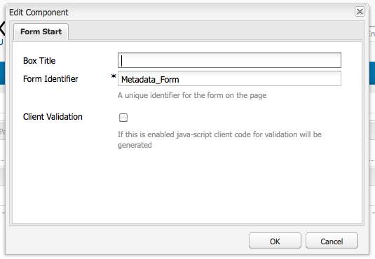

# Criar e configurar páginas do Editor de ativos {#creating-and-configuring-asset-editor-pages}

Este documento descreve o seguinte:

* Por que você criaria páginas personalizadas do Editor de ativos.
* Como criar e personalizar páginas do Editor de ativos, que são páginas do WCM que permitem que você visualização e edite metadados, bem como executar ações no ativo.
* Como editar vários ativos simultaneamente.

<!-- TBD: Add UICONTROL tags. Need PM review. Flatten the structure a bit. Re-write to remove Geometrixx mentions and to adhere to 6.5 default samples. -->

>[!NOTE]
>
>O Compartilhamento de ativos está disponível como uma implementação de referência de código aberto. Consulte [Compartilhamento de ativos comuns](https://adobe-marketing-cloud.github.io/asset-share-commons/). Não é oficialmente suportado.

## Por que criar e configurar as páginas do Editor de ativos? {#why-create-and-configure-asset-editor-pages}

O Gerenciamento de ativos digitais está sendo usado em mais e mais cenários. Ao mudar de uma solução em pequena escala para um pequeno grupo de usuários treinados profissionalmente - por exemplo, fotógrafos ou taxonomistas - para grupos de usuários maiores e mais diversos - por exemplo, usuários comerciais, autores de WCM, jornalistas e assim por diante - a poderosa interface de usuário dos Ativos Adobe Experience Manager para usuários profissionais pode fornecer informações demais e start de participantes para solicitar interfaces de usuário ou aplicativos específicos para acessar os ativos digitais que são relevantes para eles.

Esses aplicativos centrados em ativos podem ser simples galerias de fotos em uma intranet onde os funcionários podem carregar fotos de visitas comerciais ou de um centro de imprensa em um site voltado ao público. Aplicativos centrados em ativos também podem ser estendidos para soluções completas, incluindo carrinhos de compras, processos de checkout e verificação.

A criação de um aplicativo centrado em ativos torna-se, em grande medida, um processo de configuração que não exige codificação, apenas conhecimento dos grupos de usuários e suas necessidades, bem como conhecimento dos metadados usados. Os aplicativos centrados em ativos criados com os Ativos são extensíveis: com o esforço de codificação moderado, é possível criar componentes reutilizáveis para pesquisa, visualização e modificação de ativos.

Um aplicativo centrado em ativos no Experience Manager consiste em uma página do Editor de ativos, que pode ser usada para obter uma visualização detalhada de um ativo específico. Uma página do Editor de ativos também permite a edição de metadados, desde que o usuário que acessa o ativo tenha as permissões necessárias.

<!--
## Create and configure an Asset Share page {#creating-and-configuring-an-asset-share-page}

You customize the DAM Finder functionality and create pages that have all the functionality you require, which are called Asset Share pages. To create a new Asset Share page, you add the page using the Geometrixx Asset Share template and then you customize the actions users can perform on that page, determine how viewers see the assets, and decide how users can build their queries.

Here are some use cases for creating a customized Asset Share page:

* Press Center for Journalists.
* Image Search Engine for internal business users.
* Image Database for website users.
* Media Tagging Interface for metadata editors.

### Create an Asset Share page {#creating-an-asset-share-page}

To create a new Asset Share page, you can either create it when you are working on web sites or from the digital asset manager.

>[!NOTE]
>
>By default, when you create an Asset Share page from **New** in the digital asset manager, an Asset viewer and Asset editor are automatically created for you.

To create an new Asset Share page in the **Websites** console:

1. In the **Websites** tab, navigate to the place where you want to create an asset share page and click **New**.

1. Select the **Asset Share** page and click **Create**. The new page is created and the asset share page is listed in the **Websites** tab.

The basic page created using the Geometrixx DAM Asset Share template looks as follows:

To customize your Asset Share page, you use elements from the sidekick and you also edit query builder properties. The page **Geometrixx Press Center** is a customized version of a page based on this template:

To create a new asset share page via the digital asset manager:

1. In the digital asset manager, in **New**, select **New Asset Share**.
1. In the **Title**, enter the name of the asset share page. If desired, enter a name for the URL.

   

1. Double-click the asset share page to open it and configure the page.

   

   By default, when you create an Asset Share page from **New**, an Asset viewer and Asset editor are automatically created for you.

#### Customize actions {#customizing-actions}

You can determine what actions users can perform on selected digital assets from a selection of predefined actions.

To add actions to the Asset Share page:

1. In the Asset Share page that you want to customize, click **Actions** in the sidekick.

The following actions are available:

 | Action | Description |
 |---|---|
 | [!UICONTROL Delete Action] | Users can delete the selected assets. |
 | [!UICONTROL Download Action] | Lets users download selected assets to their computers. |
 | [!UICONTROL Lightbox Action] | Saves assets to a "lightbox"   where you can perform other actions on them. This comes in handy when working   with assets across multiple pages. The lightbox can also be used as a   shopping cart for assets. |
 | [!UICONTROL Move Action] | Users can move the asset to another   location |
 | [!UICONTROL Tags Action] | Lets users add tags to selected assets |
 | [!UICONTROL View Asset Action] | Opens the asset in the Asset editor for   user manipulation. |

1. Drag the appropriate action to the **Actions** area on the page. Doing so creates a button that is used to execute that action.

#### Determine how search results are presented {#determining-how-search-results-are-presented}

You determine how results are displayed from a predefined list of lenses.

To change how search results are viewed:

1. In the Asset Share page that you want to customize, click Search.

1. Drag the appropriate lens to the top center of the page. In the Press Center, the lenses are already available. Users press the appropriate lens icon to display search results as desired.

The following lenses are available:

| Lens | Description |
|---|---|
| **[!UICONTROL List Lens]** |Presents the assets in a list fashion with details. |
| **[!UICONTROL Mosaic Lens]** |Presents assets in a mosaic fashion. |

#### Mosaic Lens {#mosaic-lens}

#### List Lens {#list-lens}

#### Customize the Query Builder {#customizing-the-query-builder}

The query builder lets you enter search terms and create content for the Asset Share page. When you edit the query builder, you also get to determine how many search results are displayed per page, which asset editor opens when you double-click an asset, the path the query searches, and customizes nodetypes.

To customize the query builder:

1. In the Asset Share page that you want to customize, click **Edit** in the Query Builder. By default, the **General** tab opens.
1. Select the number of results per page, the path of the asset editor (if you have a customized asset editor) and the Actions title.

1. Click the **Paths** tab. Enter a path or multiple paths that the search will run. These paths are overwritten if the user uses the Paths predicate.

1. Enter another node type, if desired.

1. In the **Query Builder URL** field, you can override or wrap the query builder and enter the new servlet URLs with the existing query builder component. In the **Feed URL** field, you can override the Feed URL as well.

1. In the **Text** field, enter the text you want to appear for results and page numbers of results. Click **OK** when finished making changes.

#### Add predicates {#adding-predicates}

Experience Manager Assets includes a number of predicates that you can add to the Asset Share page. These let your users further narrow searches. In some cases, they may override a query builder parameter (for example, the Path parameter).

To add predicates:

1. In the Asset Share page that you want to customize, click **Search**.

1. Drag the appropriate predicates to the Asset Share page underneath the query builder. Doing so creates the appropriate fields.

The following predicates are available:

| Predicate | Description |
|---|---|
| **[!UICONTROL Date Predicate]** |Lets users search for assets that were modified before and after certain dates. |
| **[!UICONTROL Options Predicate]** |The site owner can specify a property to search for (as in the property predicate, for example cq:tags) and a content tree to populate the options from (for example the tag tree). Doing so generates a list of options where the users can select the values (tags) that the selected property (tag property) should have. This predicate lets you build list controls like the list of tags, file types, image orientations, and so on. It is great for a fixed set of options. |
| **[!UICONTROL Path Predicate]** |Lets users define the path and subfolders, if desired. |
| **[!UICONTROL Property Predicate]** |The site owner specifies a property to search for, e.g. tiff:ImageLength and the user can then enter a value, e.g. 800. This returns all images that are 800 pixels high. Useful predicate if your property can have arbitrary values. |

For more information, see the [predicate Javadocs](https://helpx.adobe.com/experience-manager/6-5/sites/developing/using/reference-materials/javadoc/com/day/cq/search/eval/package-summary.html).

1. To configure the predicate further, double-click it. For example, when you open the Path Predicate, you need to assign the root path.

-->

## Criar e configurar uma página do Editor de ativos {#creating-and-configuring-an-asset-editor-page}

Personalize o editor de ativos para determinar como os usuários podem visualização e editar os ativos digitais. Para fazer isso, crie uma nova página do Editor de ativos e personalize as visualizações e as ações que os usuários podem executar nessa página.

>[!NOTE]
>
>Se desejar adicionar campos personalizados ao editor de ativos DAM, adicione novos `cq:Widget` nós a `/apps/dam/content/asseteditors.`

### Criar uma página do Editor de ativos {#creating-the-asset-editor-page}

Ao criar a página Editor de ativos, uma boa prática é criar a página logo abaixo da página Compartilhamento de ativos.

Para criar uma página do Editor de ativos:

1. Na guia **Sites** , navegue até o local onde deseja criar uma página do editor de ativos e clique em **Novo**.
1. Selecione **Editor** de ativos Geometrixx e clique em **Criar**. A nova página é criada e listada na guia **Sites** .

A página básica criada usando o modelo do Editor de ativos Geometrixx tem a seguinte aparência:

Para personalizar a página do Editor de ativos, use elementos do sidekick. A página do Editor de ativos que é acessada do **Geometrixx Press Center** é uma versão personalizada de uma página baseada neste modelo:

#### Definir um editor de ativos para abrir a partir de uma página de compartilhamento de ativos {#setting-which-asset-editor-opens-from-an-asset-share-page}

Depois de criar a página personalizada do Editor de ativos, é necessário garantir que, ao clicar no duplo em ativos, o Compartilhamento personalizado de ativos que você criou abra os ativos na página personalizada do Editor.

Para definir a página do Editor de ativos:

1. Na página Compartilhamento de ativos, clique em **Editar** ao lado do Construtor de Query.

1. Clique na guia **Geral** se ainda não estiver selecionada.

1. No campo **Caminho do Editor** de ativos, digite o caminho para o editor de ativos no qual você deseja que a página Compartilhamento de ativos abra os ativos e clique em **OK**.

#### Adicionar componentes do Editor de ativos {#adding-asset-editor-components}

Você determina qual funcionalidade um editor de ativos tem adicionando componentes à página.

Para adicionar componentes do editor de ativos:

1. Na página do Editor de ativos que deseja personalizar, selecione o Editor **de** ativos no sidekick. Todos os componentes disponíveis do editor de ativos são exibidos.

>[!NOTE]
>
>O que você pode personalizar depende de quais componentes estão disponíveis. Para ativar os componentes, vá para o Modo de design e selecione os componentes necessários habilitados.

1. Arraste os componentes do sidekick para o editor de ativos e faça quaisquer modificações nas caixas de diálogo do componente. Os componentes são descritos na tabela a seguir e descritos nas instruções detalhadas a seguir.

>[!NOTE]
>
>Ao projetar a página do editor de ativos, você cria componentes que são somente leitura ou editáveis. Os usuários sabem que um campo pode ser editado se uma imagem de um lápis for exibida nesse componente. Por padrão, a maioria dos componentes é configurada como somente leitura.

| Componente | Descrição |
|---|---|
| **[!UICONTROL Campo de texto de formulário]de metadados e[!UICONTROL metadados]** | Permite que você adicione metadados adicionais a um ativo e execute uma ação, como enviar, nesse ativo. |
| **[!UICONTROL Subativos]** | Permite personalizar subativos. |
| **Tags** | Permite que os usuários selecionem e adicionem tags a um ativo. |
| **[!UICONTROL Miniatura]** | Mostra uma miniatura do ativo, seu nome de arquivo e permite que você adicione um texto alternativo. Também é possível adicionar ações do editor de ativos aqui. |
| **[!UICONTROL Título]** | Exibe o título do ativo, que pode ser personalizado. |

#### Formulário de metadados e campo de texto - Configuração do componente Metadados de Visualização {#metadata-form-and-text-field-configuring-the-view-metadata-component}

O Formulário de metadados é um formulário que inclui um start e uma ação final. No meio, você insere campos **de Texto** . Consulte [Formulários](/help/sites-authoring/default-components-foundation.md#form-component) para obter mais informações sobre como trabalhar com formulários.

1. Crie uma ação de start clicando em **Editar** na área Start do formulário. Você pode inserir um título de Caixa, se desejar. Por padrão, o título Caixa é **Metadados**. Marque a caixa de seleção Validação do cliente se desejar que o código do cliente Java-script para validação seja gerado.

1. Crie uma ação Encerrar clicando em **Editar** na área Fim do formulário. Por exemplo, você pode criar um botão **Enviar** para permitir que os usuários enviem suas alterações de metadados. Como opção, você pode adicionar um botão **Redefinir** que redefine os metadados para seu estado original.

1. Entre o Start **de** formulário e o Fim **do** formulário, arraste os Campos de texto de metadados para o formulário. Os usuários preenchem metadados nesses campos de texto, que podem enviar ou concluir outra ação.

1. Clique com o Duplo do mouse no nome do campo, por exemplo, **Título** para abrir o campo de metadados e fazer alterações. Na guia **Geral** da janela **Editar componente** , defina a namespace e o rótulo do campo, bem como o tipo, por exemplo, `dc:title`.

Consulte [Personalização e extensão de ativos](/help/assets/extending-assets.md) para obter informações sobre como modificar as namespaces disponíveis no formulário de metadados.

1. Click the **Constraints** tab. Aqui, você pode selecionar se um campo é obrigatório e, se necessário, adicionar quaisquer restrições.

1. Click the **Display** tab. Aqui, você pode inserir uma nova largura e número de linhas para o campo de metadados. Marque a caixa de seleção **Campo é somente** leitura para permitir que os usuários editem os metadados.

A seguir está um exemplo de um formulário Metadados com vários campos:

Na página Editor de ativos, os usuários podem inserir valores nos campos de metadados (se eles forem editáveis) e executar a ação final (por exemplo, enviar as alterações).

#### Subativos {#sub-assets}

O componente Sub-ativos é onde você pode visualização e selecionar subativos. Você pode determinar quais nomes aparecem no ativo [e subativos](/help/assets/assets.md#what-are-digital-assets) principais.

Clique com o Duplo no componente Sub Assets para abrir a caixa de diálogo Sub-ativos, onde é possível alterar os títulos do ativo principal e de qualquer subativo. Os valores padrão são exibidos abaixo do campo correspondente.

A seguir está um exemplo de um componente Sub Assets preenchido:

Por exemplo, se você selecionar um subativo, observe como o componente exibe a página apropriada e o título da Caixa muda de Sub-ativos para Irmãos.

#### Tags {#tags}

O componente Tags é um componente no qual os usuários podem atribuir tags existentes a um ativo, o que ajuda posteriormente na organização e recuperação. Você pode tornar esse componente somente leitura, de modo que os usuários não possam adicionar tags, mas apenas visualizações.

Clique no componente Tags com o Duplo para abrir a caixa de diálogo Tags, onde você pode alterar o título de Tags, se desejar, e selecionar as namespaces alocadas. Para tornar esse campo editável, desmarque a caixa de seleção **[!UICONTROL Ocultar edição]** . Por padrão, as tags são editáveis.

Se os usuários puderem editar tags, poderão clicar no lápis para adicionar tags selecionando-as no menu suspenso Tags.

A seguir está um componente de Tags preenchido:

#### Miniatura     {#thumbnail}

O componente de Miniatura é o local em que o ativo exibe a miniatura selecionada (para muitos dos formatos, a miniatura é extraída automaticamente). Além disso, o componente exibe o nome do arquivo e [as ações que você pode modificar](/help/assets/assets-finder-editor.md#adding-asset-editor-actions).

Clique com o Duplo no componente de miniatura para abrir a caixa de diálogo em miniatura, onde é possível alterar o texto alternativo. Por padrão, o texto alternativo em miniatura assume **Click para baixar** o ativo como padrão.

A seguir está um exemplo de um componente Miniatura preenchido:

#### Título {#title}

O componente Título exibe o título do ativo e uma descrição.

Por padrão, ele está no modo somente leitura, portanto os usuários não podem editá-lo. Para torná-lo editável, clique com o duplo no componente e desmarque a caixa de seleção **Ocultar botão** de edição. Além disso, insira um título para vários ativos.

Se o Título puder ser editado, você poderá adicionar um título e uma descrição clicando em Lápis para abrir a janela Propriedades **do** ativo. Além disso, você pode ativar e desativar o ativo selecionando a data e a hora.

Quando os usuários editam o Título clicando no ícone Lápis, eles podem alterar o **Título**, a **Descrição** e digitar os Tempos **Ativado** e **Desativado** para ativar e desativar o ativo.

A seguir está um exemplo de um componente Título preenchido:

#### Adicionar ações do Editor de ativos {#adding-asset-editor-actions}

Você pode determinar quais ações os usuários podem executar em ativos digitais selecionados a partir de uma seleção de ações predefinidas.

Para adicionar ações à página Editor de ativos:

1. Na página do Editor de ativos que você deseja personalizar, clique em Editor **de** ativos no sidekick.

As seguintes ações estão disponíveis:

| Ação | Descrição |
|---|---|
| [!UICONTROL Download] | Permite que os usuários baixem ativos selecionados em seus computadores. |
| [!UICONTROL Editores] | Permite que os usuários editem uma imagem (edição interativa) |
| [!UICONTROL Lightbox] | Salva os ativos em um &quot;lightbox&quot; onde você pode executar outras ações. Isso é útil ao trabalhar com ativos em várias páginas. |
| [!UICONTROL Bloqueio] | Permite que os usuários bloqueiem um ativo. Essa funcionalidade não está ativada por padrão e precisa ser ativada na lista de componentes. |
| [!UICONTROL Referências] | Clique para mostrar em quais páginas o ativo está sendo usado. |
| [!UICONTROL Versões] | Permite criar e restaurar versões de um ativo. |

1. Arraste a ação apropriada para a área **Ações** na página. Isso cria um botão que é usado para executar essa ação.

## Vários ativos de edição com a página Editor de ativos {#multi-editing-assets-with-the-asset-editor-page}

Com os ativos Experience Manager, é possível fazer alterações em vários ativos ao mesmo tempo. Depois de ter selecionado os ativos, é possível alterar simultaneamente os seguintes itens:

* Tags
* Metadados

Para fazer várias edições de ativos com a página Editor de ativos:

1. Abra a página do Geometrixx **Press Center** :
   `https://localhost:4502/content/geometrixx/en/company/press.html`

1. Selecione os ativos:

   * no Windows: `Ctrl + click` cada ativo.
   * no Mac: `Cmd + click` cada ativo.
   Para selecionar uma faixa de ativos: clique no primeiro ativo e depois `Shift + click` no último ativo.

1. Clique em **Editar metadados** no campo **Ações** (parte esquerda da página).
1. A página do Editor **de ativos do Geometrixx** Press Center é aberta em uma nova guia. Os metadados dos ativos são exibidos da seguinte maneira:

   * Uma tag, que não se aplica a todos os ativos, mas apenas a alguns, é exibida em itálico.
   * Uma tag que se aplica a todos os ativos é exibida com uma fonte normal.
   * Metadados diferentes de tags: o valor do campo só será exibido se for o mesmo para todos os ativos selecionados.

1. Clique em **Download** para baixar um arquivo zip que contém as representações originais dos ativos.
1. Clique no ícone de lápis ao lado do campo **Tags** para editar as tags:

   * Uma tag que não se aplica a todos os ativos, mas somente a alguns tem um fundo cinza.
   * Uma tag que se aplica a todos os ativos tem um fundo branco.
   É possível:

   * Clique no ícone **x** para remover a tag de todos os ativos.
   * Clique no ícone **+** para adicionar a tag a todos os ativos.
   * Clique na **seta** e selecione uma tag para adicionar uma nova tag a todos os ativos.
   Clique em **OK** para gravar as alterações no formulário. A caixa ao lado do campo **Tags** é automaticamente marcada.

1. Edite o campo Descrição. Por exemplo, defina-o como:

   `This is a common description`

   Quando um campo é editado, seu valor substitui os valores existentes dos ativos selecionados quando o formulário é submetido.

   Observação: a caixa ao lado do campo é automaticamente marcada quando o campo é editado.

1. Clique em **Atualizar metadados** para enviar o formulário e salvar as alterações de todos os ativos.

   Observação: somente os metadados marcados são modificados.
