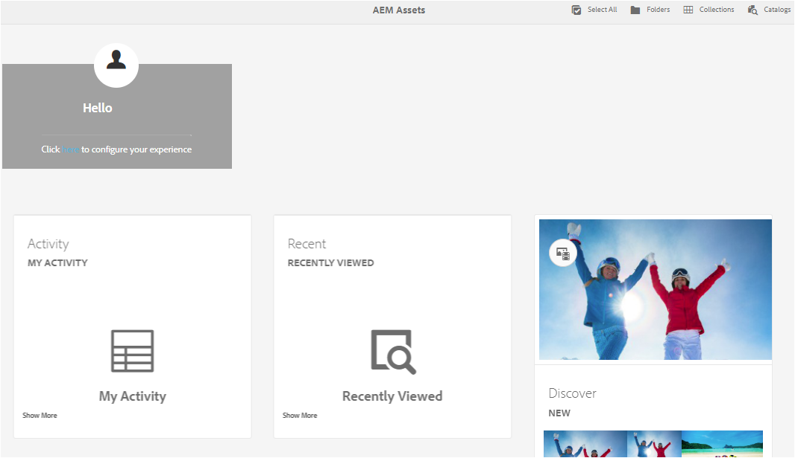

# Experiência de Home page do AEM Assets {#aem-assets-home-page-experience}

Personalize o home page de ativos Adobe Experience Manager (AEM) para obter uma experiência de tela de boas-vindas, incluindo um instantâneo de atividades recentes sobre ativos.

O home page AEM Assets fornece uma experiência de tela de boas-vindas avançada e personalizada, que inclui um instantâneo de atividades recentes, como ativos que foram exibidos ou carregados recentemente.

O home page Ativos está desativado por padrão. Para ativá-lo, execute as seguintes etapas:

1. Abra o AEM Configuration Manager `https://[aem_server]:[port]/system/console/configMgr`.
1. Abra o serviço Gravador **[!UICONTROL do Evento CQ DAM]** Day.
1. Selecione **[!UICONTROL Ativar este serviço]** para ativar a gravação de atividade.

   

1. Na lista **[!UICONTROL Tipos de evento]** , selecione os eventos a serem gravados e salve as alterações.

   >[!CAUTION]
   >
   >Ativar as opções visualizadas Ativo visualizado, Projetos visualizados e Coleções aumenta significativamente o número de eventos registrados.

1. Abra o serviço Sinalizador **[!UICONTROL do recurso Home page do ativo]** DAM no Configuration Manager `https://[aem_server]:[port]/system/console/configMgr`.
1. Selecione a `isEnabled.name` opção para ativar o recurso Home page Ativos. Salve as alterações.

   

1. Abra a caixa de diálogo Preferências **[!UICONTROL de]** usuário e selecione **[!UICONTROL Ativar Home page]** de ativos. Salve as alterações.

   

Depois de ativar o Home page Ativos, navegue até a interface do usuário Ativos na página Navegação ou acesse-o diretamente do URL `https://[aem_server]:[port]/aem/assetshome.html/content/dam`.

Clique aqui para **[!UICONTROL configurar o link]** de experiência para adicionar o nome de usuário, a imagem de plano de fundo e a imagem do perfil.

O Home page Ativos inclui as seguintes seções:

* Seção de boas-vindas
* Seção do Widget

**Seção de boas-vindas**

Se o seu perfil existir, a seção Boas-vindas exibirá uma mensagem de boas-vindas endereçada a você. Além disso, exibe a imagem do perfil e uma imagem de boas-vindas (se já estiver configurada).

Se o perfil estiver incompleto, a seção Bem-vindo exibirá uma mensagem genérica de boas-vindas e um espaço reservado para a imagem do perfil.

**Seção do Widget**

Esta seção é exibida abaixo da seção Boas-vindas e exibe os widgets predefinidos nas seguintes seções:

* Atividade
* Recentes
* Descobrir

**Atividade**: Nesta seção, o widget **[!UICONTROL Minha Atividade]** exibe atividades recentes executadas pelo usuário conectado com ativos (incluindo ativos sem representações), como uploads de ativos, downloads, criação de ativos, edições, comentários, anotações e compartilhamentos.

**Recente**: O widget **[!UICONTROL Visualizado]** recentemente nesta seção exibe entidades acessadas recentemente pelo usuário conectado, incluindo pastas, coleções e projetos.

**Discover**: O widget **[!UICONTROL Novo]** nesta seção exibe os ativos e as execuções carregados recentemente na instância AEM Assets.

Para ativar a remoção de dados de atividade do usuário, ative o Serviço **[!UICONTROL de Expurgação de Eventos]** DAM do Configuration Manager. Após habilitar esse serviço, as atividades do usuário conectado que excederem um número especificado serão excluídas pelo sistema.

A tela de boas-vindas fornece ferramentas de navegação fáceis, por exemplo ícones na barra de ferramentas para acessar pastas, coleções e catálogos.

>[!NOTE]
>
>Habilitar os serviços [!UICONTROL Day CQ DAM Evento Recorder] e [!UICONTROL DAM Evento Purge] aumenta as operações de gravação no JCR e a indexação de pesquisa, o que aumenta significativamente a carga no servidor AEM. A carga adicional no servidor AEM pode afetar seu desempenho.

>[!CAUTION]
>
>Capturar, filtrar e expurgar atividades de usuário necessárias para o home page Ativos impõem uma sobrecarga no desempenho. Portanto, os administradores devem configurar o Home page de forma eficiente para os usuários do público alvo.
>
>A Adobe recomenda que os administradores e usuários que executam operações em massa evitem usar o recurso Home page de ativos para evitar o aumento das atividades do usuário. Além disso, os administradores podem excluir atividades de gravação para usuários específicos ao configurar o Gravador [!UICONTROL de Eventos] Day CQ DAM do [!UICONTROL Configuration Manager].
>
>Se você usar o recurso, a Adobe recomenda programar a frequência de expurgação com base na carga do servidor.
