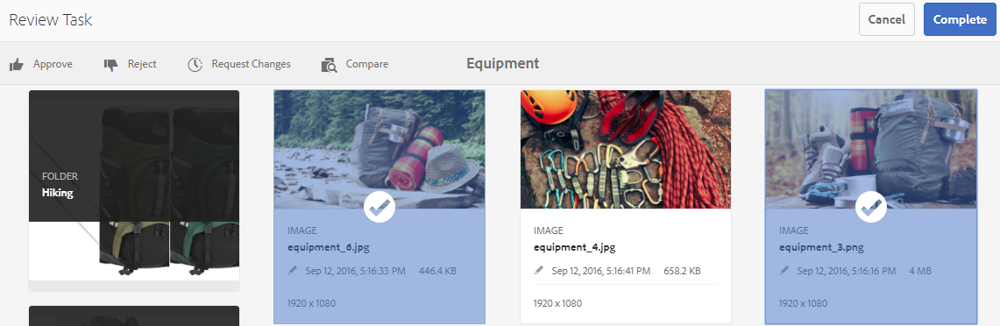
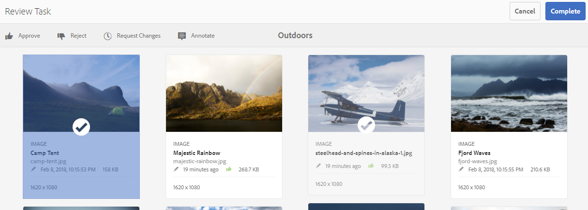

# Revisar ativos e coleções de pastas {#review-folder-assets-and-collections}

Configure fluxos de trabalho de revisão para ativos em uma pasta ou coleção e compartilhe-os com revisores ou parceiros criativos para buscar feedback.

Os ativos Adobe Experience Manager (AEM) permitem configurar um fluxo de trabalho de revisão ad hoc para ativos em uma pasta ou coleção e compartilhá-lo com revisores ou parceiros criativos para buscar feedback.

Você pode associar o fluxo de trabalho de revisão a um projeto ou criar uma tarefa de revisão independente.

Depois de compartilhar os ativos, os revisores podem aprová-los ou rejeitá-los. As notificações são enviadas em vários estágios do fluxo de trabalho para notificar os destinatários pretendidos sobre a conclusão de várias tarefas. Por exemplo, quando você compartilha uma pasta ou coleção, o revisor recebe uma notificação de que uma pasta/coleção foi compartilhada para revisão.

Depois que o revisor concluir a revisão (aprova ou rejeita ativos), você receberá uma notificação de conclusão da revisão.

## Criar uma tarefa de revisão para pastas {#creating-a-review-task-for-folders}

1. Na interface do usuário Ativos, selecione a pasta para a qual deseja criar uma tarefa de revisão.
1. From the toolbar, tap **[!UICONTROL Create Review Task]** to open the **[!UICONTROL Review Task]** page. If you cannot see the option in the toolbar, tap/click **[!UICONTROL More]** and then select the option.

   

1. (Opcional) Na lista **[!UICONTROL Projeto]** , selecione o projeto ao qual você deseja associar a tarefa de revisão. Por padrão, a opção **[!UICONTROL Nenhum]** está selecionada. Se você não quiser associar qualquer projeto à tarefa de revisão, mantenha essa seleção.

   >[!NOTE]
   >
   >Somente os projetos para os quais você tem permissões no nível do Editor (ou superior) estão visíveis na lista **[!UICONTROL Projetos]** .

1. Insira um nome para a tarefa de revisão e selecione um aprovador na lista **[!UICONTROL Atribuir a]** .

   >[!NOTE]
   >
   >Os membros/grupos do projeto selecionado estão disponíveis como aprovadores na lista **[!UICONTROL Atribuir a]** .

1. Informe uma descrição, a prioridade da tarefa e a data de vencimento da tarefa de revisão.

   

1. Na guia Avançado, digite um rótulo a ser usado para criar o URI.

   

1. Toque/clique em **[!UICONTROL Enviar]** e em **[!UICONTROL Concluído]** para fechar a mensagem de confirmação. Uma notificação para a nova tarefa é enviada ao aprovador.
1. Faça logon nos ativos AEM como aprovador e navegue até a interface do usuário dos ativos. Para aprovar ativos, toque em **[!UICONTROL Notificações]** e selecione a tarefa de revisão na lista.

   

1. Na página **[!UICONTROL Tarefa de revisão]**, examine os detalhes da tarefa de revisão e toque/clique em **[!UICONTROL Revisar]**.
1. In the **[!UICONTROL Review Task]** page, select assets, and tap **[!UICONTROL Approve/Reject]** to approve or reject, as appropriate.

   

1. Tap **[!UICONTROL Complete]** from the toolbar. Na caixa de diálogo, digite um comentário e toque/clique em **[!UICONTROL Concluir]** para confirmar.
1. Navegue até a interface do usuário Ativos e abra a pasta. Os ícones de status de aprovação dos ativos aparecem na exibição de cartão e na exibição de lista.

   **Exibição de cartão**

   

   **Exibição de lista**

   

## Criar uma tarefa de revisão para coleções {#creating-a-review-task-for-collections}

1. Na página Coleções, selecione a coleção para a qual deseja criar uma tarefa de revisão.
1. From the toolbar, tap **[!UICONTROL Create Review Task]** to open the **[!UICONTROL Review Task]** page. If you cannot see the option on the toolbar, tap **[!UICONTROL More]** and then select the option.

   

1. (Opcional) Na lista **[!UICONTROL Projeto]** , selecione o projeto ao qual você deseja associar a tarefa de revisão. Por padrão, a opção **[!UICONTROL Nenhum]** está selecionada. Se você não quiser associar qualquer projeto à tarefa de revisão, mantenha essa seleção.

   >[!NOTE]
   >
   >Somente os projetos para os quais você tem permissões no nível do Editor (ou superior) estão visíveis na lista **[!UICONTROL Projetos]** .

1. Insira um nome para a tarefa de revisão e selecione um aprovador na lista **[!UICONTROL Atribuir a]** .

   >[!NOTE]
   >
   >Os membros/grupos do projeto selecionado estão disponíveis como aprovadores na lista **[!UICONTROL Atribuir a]** .

1. Informe uma descrição, a prioridade da tarefa e a data de vencimento da tarefa de revisão.

   

1. Toque/clique em **[!UICONTROL Enviar]** e em **[!UICONTROL Concluído]** para fechar a mensagem de confirmação. Uma notificação para a nova tarefa é enviada ao aprovador.
1. Faça logon nos ativos AEM como aprovador e navegue até o console Ativos. Para aprovar ativos, toque em **[!UICONTROL Notificações]** e selecione a tarefa de revisão na lista.
1. Na página **[!UICONTROL Tarefa de revisão]**, examine os detalhes da tarefa de revisão e toque/clique em **[!UICONTROL Revisar]**.
1. Todos os ativos na coleção estão visíveis na página de revisão. Selecione os ativos e toque em **[!UICONTROL Aprovar/Rejeitar]** para aprovar ou rejeitar ativos, conforme apropriado.

   

1. Tap **[!UICONTROL Complete]** from the toolbar. Na caixa de diálogo, digite um comentário e toque/clique em **[!UICONTROL Concluir]** para confirmar.
1. Navegue até o console Coleções e abra a coleção. Os ícones de status de aprovação dos ativos são exibidos nas exibições Cartão e Lista.

   

   *Figura: Exibição de cartão*

   

   *Figura: Exibição de lista*
