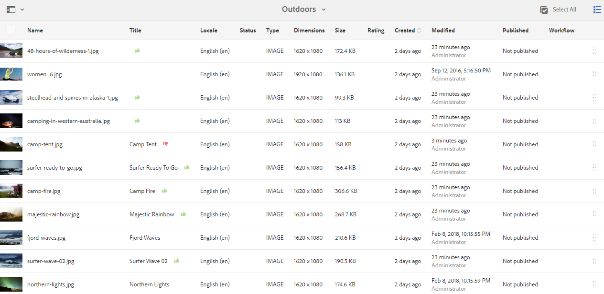

# Revisar ativos e coleções de pastas {#review-folder-assets-and-collections}

Configure workflows de revisão para ativos em uma pasta ou coleção e compartilhe-os com revisores ou parceiros criativos para obter feedback.

[!DNL Adobe Experience Manager Assets] permite configurar um fluxo de trabalho de revisão ad hoc para ativos em uma pasta ou coleção e compartilhá-lo com revisores ou parceiros criativos para buscar feedback.

Você pode associar o fluxo de trabalho de revisão a um projeto ou criar uma tarefa de revisão independente.

Depois de compartilhar os ativos, os revisores podem aprová-los ou rejeitá-los. As notificações são enviadas em vários estágios do fluxo de trabalho para notificar recipient pretendidos sobre a conclusão de várias tarefas. Por exemplo, quando você compartilha uma pasta ou coleção, o revisor recebe uma notificação de que uma pasta/coleção foi compartilhada para revisão.

Depois que o revisor concluir a revisão (aprova ou rejeita ativos), você receberá uma notificação de conclusão da revisão.

## Criar uma tarefa de revisão para pastas {#creating-a-review-task-for-folders}

1. Na interface do usuário [!DNL Assets], selecione a pasta para a qual deseja criar uma tarefa de revisão.
1. Na barra de ferramentas, clique em **[!UICONTROL Criar Tarefa de revisão]**  para abrir a página **[!UICONTROL Revisar Tarefa]**. Se você não conseguir ver a opção na barra de ferramentas, clique em **[!UICONTROL Mais]** e selecione a opção.

1. (Opcional) Na lista **[!UICONTROL Project]**, selecione o projeto ao qual deseja associar a tarefa de revisão. Por padrão, a opção **[!UICONTROL None]** está selecionada. Se você não quiser associar qualquer projeto à tarefa de revisão, mantenha essa seleção.

   >[!NOTE]
   >
   >Somente os projetos para os quais você tem permissões no nível do Editor (ou superiores) estão visíveis na lista **[!UICONTROL Projects]**.

1. Insira um nome para a tarefa de revisão e selecione um aprovador na lista **[!UICONTROL Atribuir a]**.

   >[!NOTE]
   >
   >Os membros/grupos do projeto selecionado estão disponíveis como aprovadores na lista **[!UICONTROL Atribuir a]**.

1. Informe uma descrição, a prioridade da tarefa e a data de vencimento da tarefa de revisão.

   

1. Na guia Avançado, digite um rótulo a ser usado para criar o URI.

   

1. Clique em **[!UICONTROL Enviar]** e, em seguida, clique em **[!UICONTROL Concluído]** para fechar a mensagem de confirmação. Uma notificação para a nova tarefa é enviada ao aprovador.
1. Faça logon em [!DNL Assets] como um aprovador e navegue até a interface do usuário [!DNL Assets]. Para aprovar ativos, clique em **[!UICONTROL Notificações]** e selecione a tarefa de revisão na lista.

   

1. Na página **[!UICONTROL Revisar Tarefa]**, examine os detalhes da tarefa de revisão e clique em **[!UICONTROL Revisar]**.
1. Na página **[!UICONTROL Revisar Tarefa]**, selecione ativos e clique em **[!UICONTROL Aprovar/Rejeitar]** para aprovar ou rejeitar, conforme apropriado.

   

1. Clique em **[!UICONTROL Concluir]** na barra de ferramentas. Na caixa de diálogo, digite um comentário e clique em **[!UICONTROL Concluir]** para confirmar.
1. Navegue até a interface do usuário [!DNL Assets] e abra a pasta. Os ícones de status de aprovação dos ativos são exibidos na visualização do cartão e na visualização da lista.

   **Exibição de cartão**

   

   **Exibição de lista**

   

## Criar uma tarefa de revisão para coleções {#creating-a-review-task-for-collections}

1. Na página Coleções, selecione a coleção para a qual deseja criar uma tarefa de revisão.
1. Na barra de ferramentas, clique em **[!UICONTROL Criar Tarefa de revisão]**  para abrir a página **[!UICONTROL Revisar Tarefa]**. Se você não conseguir ver a opção na barra de ferramentas, clique em **[!UICONTROL Mais]** e selecione a opção.

1. (Opcional) Na lista **[!UICONTROL Project]**, selecione o projeto ao qual deseja associar a tarefa de revisão. Por padrão, a opção **[!UICONTROL None]** está selecionada. Se você não quiser associar qualquer projeto à tarefa de revisão, mantenha essa seleção.

   >[!NOTE]
   >
   >Somente os projetos para os quais você tem permissões no nível do Editor (ou superiores) estão visíveis na lista **[!UICONTROL Projects]**.

1. Insira um nome para a tarefa de revisão e selecione um aprovador na lista **[!UICONTROL Atribuir a]**.

   >[!NOTE]
   >
   >Os membros/grupos do projeto selecionado estão disponíveis como aprovadores na lista **[!UICONTROL Atribuir a]**.

1. Informe uma descrição, a prioridade da tarefa e a data de vencimento da tarefa de revisão.

   

1. Clique em **[!UICONTROL Enviar]** e, em seguida, clique em **[!UICONTROL Concluído]** para fechar a mensagem de confirmação. Uma notificação para a nova tarefa é enviada ao aprovador.
1. Faça logon em [!DNL Assets] como Aprovador e navegue até o console [!DNL Assets]. Para aprovar ativos, clique em **[!UICONTROL Notificações]** e selecione a tarefa de revisão na lista.
1. Na página **[!UICONTROL Revisar Tarefa]**, examine os detalhes da tarefa de revisão e clique em **[!UICONTROL Revisar]**.
1. Todos os ativos na coleção estão visíveis na página de revisão. Selecione os ativos e clique em **[!UICONTROL Aprovar/Rejeitar]** para aprovar ou rejeitar ativos, conforme apropriado.

   

1. Clique em **[!UICONTROL Concluir]** na barra de ferramentas. Na caixa de diálogo, digite um comentário e clique em **[!UICONTROL Concluir]** para confirmar.
1. Navegue até o console Coleções e abra a coleção. Os ícones de status de aprovação dos ativos são exibidos nas visualizações Cartão e Lista.

   

   *Figura: Visualização da placa.*

   

   *Figura: Visualização da lista.*
