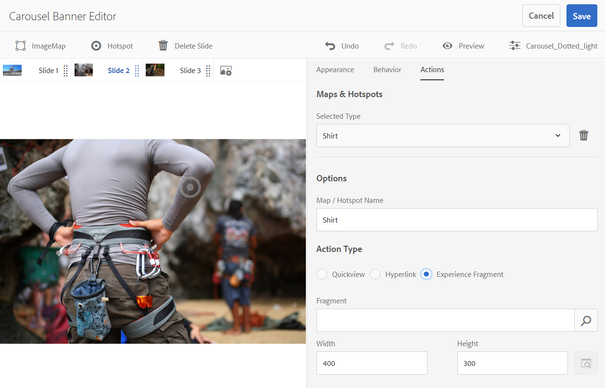

# Banners em carrossel{#carousel-banners}

Os banners do carrossel permitem que os profissionais de marketing impulsionem a conversão criando facilmente conteúdo promocional rotativo interativo e entregando-o em qualquer tela.

Criar e modificar conteúdo em destaque em banners promocionais pode ser demorado, limitando sua capacidade de publicar rapidamente novo conteúdo ou torná-lo mais direcionado. Os banners do carrossel permitem criar ou modificar rapidamente banners giratórios. É possível adicionar interatividade, como pontos de acesso vinculados a detalhes do produto ou recursos relacionados, e entregá-los em qualquer tela, permitindo que você coloque novos conteúdos promocionais no mercado mais rapidamente.

Os banners do carrossel são designados por um banner com a palavra **[!UICONTROL CAROUSELSET]**

Em seu site, um banner de carrossel pode ter a seguinte aparência:

Aqui você pode navegar pelas imagens (clicando nos números). Além disso, os slides giram automaticamente com base em um intervalo de tempo que pode ser personalizado. As imagens adicionadas nos banners do carrossel são compatíveis com pontos de acesso e mapas de imagem, nos quais os usuários podem selecionar ou acessar um hiperlink ou uma janela do Quickview.

Neste exemplo, um usuário tocou ou clicou em um mapa de imagem e acessou a janela Quickview para luvas:

## Veja como os banners do carrossel são criados {#watch-how-carousel-banners-are-created}

Reproduzir uma apresentação sobre [como os banners do carrossel são criados](https://s7d5.scene7.com/s7viewers/html5/VideoViewer.html?videoserverurl=https://s7d5.scene7.com/is/content/&amp;emailurl=https://s7d5.scene7.com/s7/emailFriend&amp;serverUrl=https://s7d5.scene7.com/is/image/&amp;config=Scene7SharedAssets/Universal_HTML5_Video_social&amp;contenturl=https://s7d5.scene7.com/skins/&amp;asset=S7tutorials/InteractiveCarouselBanner)(10 minutos e 33 segundos). Você também aprenderá a visualizar, editar e entregar banners do carrossel.

>[!NOTE]
>
>Os usuários não administrativos devem ser adicionados ao **[!UICONTROL dam-users]** para poder criar ou editar banners do carrossel. Se você tiver problemas para criar ou editar, consulte o administrador do sistema que pode adicioná-lo ao **[!UICONTROL dam-users]** grupo.

## Início rápido: banners do Carousel {#quick-start-carousel-banners}

Para começar a usar rapidamente os banners do carrossel:

1. [Identificar variáveis de ponto de acesso e mapa de imagem](#identifying-hotspot-and-image-map-variables) (somente para clientes que usam Experience Manager Assets + Dynamic Media)

   Comece identificando variáveis dinâmicas usadas pela implementação existente do Quickview para que você possa inserir hotspots e dados de mapa de imagem corretamente durante o processo de criação do banner de carrossel no Adobe Experience Manager Assets.

   >[!NOTE]
   >
   >Se você for um cliente do Experience Manager Sites ou do Ecommerce, poderá usar o recurso integrado para navegar até as páginas dos produtos e pesquisar as SKUs (Stock Keeping Unit, Unidade de Manutenção de Estoque) existentes no catálogo de produtos. Não é necessário inserir manualmente as variáveis de ponto de acesso ou mapa de imagem. Consulte as informações sobre [configuração de comércio eletrônico](/help/commerce/cif-classic/administering/generic.md).
   >
   >
   >Se você for um cliente do Experience Manager Assets e do Dynamic Media, insira manualmente os dados de hotspots e mapas de imagem e, em seguida, integre o URL publicado ou o código incorporado ao seu sistema de gerenciamento de conteúdo de terceiros.

1. Opcional: [crie uma predefinição do visualizador Conjunto de carrossel](/help/assets/managing-viewer-presets.md), conforme necessário.

   Se você for um administrador, poderá personalizar o comportamento e a aparência do carrossel criando sua própria predefinição do visualizador do Carrossel. O principal benefício é poder reutilizar essa predefinição do visualizador personalizado para vários carrosséis. No entanto, os usuários podem, opcionalmente, personalizar o comportamento e a aparência do carrossel diretamente durante a criação do carrossel. Esse método é a abordagem preferida quando você deseja um design específico para um determinado carrossel.

1. [Carregar um banner de imagem](#uploading-image-banners).

   Carregue banners de imagem que você deseja tornar interativos.

1. [Criar conjuntos de carrossel](#creating-carousel-sets).

   Em Conjuntos de carrosséis, os usuários navegam por imagens de banner e selecionam pontos de acesso ou mapas de imagem para acessar conteúdo relevante.

   Para criar um Conjunto de carrossel no Assets, selecione **[!UICONTROL Criar]** e selecione **[!UICONTROL Conjuntos de carrossel]**. Adicionar ativos a slides e selecionar **[!UICONTROL Salvar]**. Além disso, edite a aparência e o comportamento do carrossel diretamente no editor.

1. [Adicionar pontos de acesso ou mapas de imagem a um banner de imagem](#adding-hotspots-or-image-maps-to-an-image-banner).

   Adicione um ou mais pontos de acesso ou mapas de imagem a um banner de imagem e associe cada um a uma ação, como um link, uma Quickview ou um Fragmento de experiência. Depois de adicionar pontos de acesso ou mapas de imagem, conclua essa tarefa publicando o conjunto de carrossel. A publicação cria o código incorporado que pode ser usado para copiar e aplicar à página de aterrissagem do site.

   Consulte [(Opcional) Visualizar banners do carrossel](#optional-previewing-carousel-banners) - Opcional. Se desejar, é possível visualizar uma representação do conjunto de carrossel e testar a interatividade.

1. [Publicar banners do carrossel](#publishing-carousel-banners).

   Publique um Conjunto de carrossel como faria com qualquer ativo. No Assets, navegue até o Conjunto de carrosséis, selecione-o e **[!UICONTROL Publish]**. A publicação de um Conjunto de carrossel ativa o URL e a sequência de caracteres Incorporada.

1. Siga uma das seguintes opções:

   * [Adicione um banner de carrossel à página do site](#adding-a-carousel-banner-to-your-website-page) É possível adicionar o URL do banner do carrossel ou o código incorporado copiado na página do site.

      * [Integre o banner do carrossel a uma visualização rápida existente](#integrating-the-carousel-banner-with-an-existing-quickview). Se você usa um sistema de gerenciamento de conteúdo da Web de terceiros, é necessário integrar o novo banner do carrossel com a implementação do Quickview existente em seu site.
   * [Adicione um banner de carrossel ao seu site no Experience Manager](/help/assets/adding-dynamic-media-assets-to-pages.md) Se você for um cliente do Experience Manager Sites, poderá adicionar o conjunto de carrossel diretamente à página no Experience Manager, usando o componente de Mídia interativa.

Para editar Conjuntos de carrossel, consulte [edição de conjuntos de carrossel](#editing-carousel-sets). Além disso, é possível exibir e editar [Propriedades do conjunto de carrossel](manage-assets.md#editing-properties).

## Identificar variáveis de ponto de acesso e Mapa de imagem {#identifying-hotspot-and-image-map-variables}

Comece identificando variáveis dinâmicas usadas pela implementação existente do Quickview para que você possa inserir pontos de acesso ou dados de mapa de imagem corretamente durante o processo de criação do conjunto de carrossel no Experience Manager Assets.

Ao adicionar pontos de acesso ou mapas de imagem a uma imagem de banner no Experience Manager Assets, atribua uma SKU e variáveis adicionais opcionais a cada ponto de acesso ou mapa de imagem. Essas variáveis são usadas posteriormente para corresponder pontos de acesso ou mapas de imagem ao conteúdo do Quickview.

>[!NOTE]
>
>Se você for um cliente de comércio eletrônico do Experience Manager Sites e/ou Experience Manager, pule esta etapa. Não é necessário identificar manualmente as variáveis de ponto de acesso ou mapa de imagem; você pode usar a integração com o Ecommerce para fazer a integração do produto. Consulte as informações sobre [configuração de comércio eletrônico](/help/commerce/cif-classic/administering/generic.md). Além disso, você pode usar o componente Interativo e adicioná-lo à sua página da Web.
>
>Se você for um cliente do Experience Manager Assets ou Media, publique o URL ou o código incorporado e, em seguida, integre o ao seu sistema de gerenciamento de conteúdo de terceiros e identifique pontos de acesso e mapas de imagem manualmente.

É importante identificar corretamente o número e o tipo de variáveis a serem associadas aos dados de ponto de acesso ou mapa de imagem. Cada ponto de acesso ou mapa de imagem adicionado a uma imagem de banner deve carregar informações suficientes para identificar sem ambiguidade o produto no sistema de back-end existente. Ao mesmo tempo, cada ponto de acesso ou mapa de imagem não deve incluir mais dados do que o necessário. O motivo é que isso tornaria o processo de entrada de dados muito complexo e contínuo, como o gerenciamento de pontos de acesso ou de mapas de imagem, mais sujeito a erros.

Há diferentes maneiras de identificar um conjunto de variáveis a serem usadas para dados de ponto de acesso ou mapa de imagem.

Às vezes, basta consultar especialistas de TI responsáveis pela implementação do Quickview existente. Eles provavelmente saberão qual é o conjunto mínimo de dados necessários para identificar o Quickview no sistema. No entanto, geralmente também é possível simplesmente analisar o comportamento existente do código front-end.

A maioria das implementações do Quickview usa o seguinte paradigma:

* O usuário ativa um elemento da interface do usuário no site. Por exemplo, tocar em um **[!UICONTROL Quickview]** botão.
* O site envia uma solicitação de Ajax para o backend a fim de carregar os dados ou o conteúdo da Visualização rápida, se necessário.
* Os dados do Quickview são traduzidos no conteúdo como preparação para renderização na página da Web.
* Por fim, o código de front-end renderiza visualmente esse conteúdo na tela.

A abordagem então é visitar diferentes áreas do site existente onde o recurso de Visualização rápida é implementado. Acione o Quickview e capture o URL do Ajax enviado pela página da Web para carregar os dados ou conteúdo do Quickview.

Normalmente, não há necessidade de usar ferramentas de depuração especializadas. Navegadores da Web modernos possuem inspetores da Web que fazem um trabalho adequado. A seguir estão alguns exemplos de navegadores da Web que incluem inspetores da Web:

* Para ver todas as solicitações HTTP de saída no Google Chrome, pressione F12 (Windows) ou Command-Option-I (Mac) para abrir o painel Ferramentas do desenvolvedor e selecione a guia Rede.
* No Firefox, você pode ativar o plug-in do Firebug pressionando F12 (Windows) ou Command-Option-I (Mac) e usar a guia Net, ou usar a ferramenta Inspetor integrada e a guia Rede.

Quando o monitoramento de rede estiver ativado no navegador, acione o Quickview na página.

Agora, localize o URL do Ajax Quickview no log de rede e copie o URL gravado para análise futura. Geralmente, quando você aciona a Visualização rápida, várias solicitações são enviadas para o servidor. Normalmente, o URL do Ajax Quickview é um dos primeiros na lista. Ele tem uma parte ou um caminho de sequência de consulta complexo e seu tipo de resposta MIME é `text/html`, `text/xml`ou `text/javascript`.

Durante esse processo, é importante visitar diferentes áreas do site, com diferentes categorias e tipos de produtos. O motivo é que os URLs do Quickview têm partes comuns em determinada categoria de site, mas só são alterados se você visitar outra área do site.

No caso mais simples, a única parte variável no URL do Quickview é o SKU do produto. Nesse caso, o valor do SKU é a única parte dos dados necessária para adicionar pontos de acesso ou mapas de imagem à imagem do banner.

No entanto, em casos complexos, o URL do Quickview tem diferentes elementos variáveis, além do SKU, como ID de categoria, código de cor e código de tamanho, por exemplo. Nesses casos, cada elemento é uma variável separada na definição de dados de ponto de acesso ou mapa de imagem no recurso de banner do carrossel.

Considere os seguintes exemplos de URLs do Quickview e seus pontos de acesso ou variáveis de mapa de imagem resultantes:

<table>
 <tbody>
  <tr>
   <td>SKU única, encontrada na cadeia de caracteres de consulta.</td>
   <td>
Os URLs de Quickview gravados incluem o seguinte:

    <ul>
     <li>
<code>https://server/json?productId=866558&amp;source=100</code>
 </li>
     <li>
<code>https://server/json?productId=1196184&amp;source=100</code>
 </li>
     <li>
<code>https://server/json?productId=1081492&amp;source=100</code>
 </li>
     <li>
<code>https://server/json?productId=1898294&amp;source=100</code>
 </li>
    </ul> 
A única parte variável no URL é o valor da variável <code>productId=</code> parâmetro da sequência de consulta e é claramente um valor de SKU. Portanto, os pontos de acesso ou mapas de imagem precisam apenas de campos SKU preenchidos com valores como <code>866558,</code> <code>1196184,</code> <code>1081492,</code> <code>1898294.</code>
 </td>
  </tr>
  <tr>
   <td>SKU única, encontrada no caminho do URL.</td>
   <td>
Os URLs de Quickview gravados incluem o seguinte:

    <ul>
     <li>
<code>https://server/product/6422350843</code>
 </li>
     <li>
<code>https://server/product/1607745002</code>
 </li>
     <li>
<code>https://server/product/0086724882</code>
 </li>
    </ul> 
A parte variável está na última parte do caminho e se torna o valor SKU dos pontos de acesso/mapas de imagem:<strong><code>6422350843</code>, <code>1607745002,</code> </strong><code>0086724882.</code>
 </td>
  </tr>
  <tr>
   <td>SKU e ID de categoria na cadeia de caracteres de consulta.</td>
   <td>
Os URLs de Quickview gravados incluem o seguinte:

    <ul>
     <li>
<code>https://server/quickView/product/?category=1100004&amp;prodId=305466</code>
 </li>
     <li>
<code>https://server/quickView/product/?category=1100004&amp;prodId=310181</code>
 </li>
     <li>
<code>https://server/quickView/product/?category=1740148&amp;prodId=308706</code>
 </li>
    </ul> 
Nesse caso, há duas partes variáveis no URL. O SKU é armazenado no <code>prodId</code> e a ID da categoria for armazenada na variável <code>category=</code>parâmetro.
 
Dessa forma, as definições de ponto de acesso/mapa de imagem são pares. Ou seja, um valor de SKU e uma variável extra chamada <code>categoryId</code>. Os pares resultantes são os seguintes:

    <ul>
     <li>
O SKU é <strong><code>305466</code></strong> e <code>categoryId</code> é <code>1100004</code>.
 </li>
     <li>
O SKU é <strong><code>310181</code></strong> e <code>categoryId</code> é <strong><code>1100004</code></strong>.
 </li>
     <li>
O SKU é <strong><code>308706</code></strong> e <code>categoryId</code> é <strong><code>1740148</code></strong>.
 </li>
    </ul> </td>
  </tr>
 </tbody>
</table>

## Fazer upload de banners de imagem {#uploading-image-banners}

Se você já tiver carregado as imagens que deseja usar, avance para a próxima etapa, [Criar conjuntos de carrossel](#creating-carousel-sets). Observe que as imagens usadas no carrossel devem ser carregadas após a ativação do Dynamic Media.

Para carregar banners de imagem, consulte [Fazer upload de ativos](/help/assets/manage-assets.md).

## Criar conjuntos de carrossel {#creating-carousel-sets}

>[!NOTE]
>
>Os usuários não administrativos devem ser adicionados ao **[!UICONTROL dam-users]** para criar ou editar banners do carrossel. Se você tiver problemas para criar ou editar, consulte o administrador do sistema que pode adicioná-lo ao **[!UICONTROL dam-users]** grupo.

**Para criar Conjuntos de Carrossel:**

1. No Assets, navegue até a pasta em que deseja criar o Conjunto de carrossel e acesse **[!UICONTROL Criar]** > **[!UICONTROL Conjunto do Carousel]**.
1. Na página do editor do banner do carrossel, selecione **[!UICONTROL Toque para abrir o Seletor de ativos]** para selecionar a imagem do primeiro slide.

   Na página do editor de banner do carrossel, siga um destes procedimentos:

   * Próximo ao canto superior esquerdo da página, selecione **[!UICONTROL Adicionar slide]** ícone.

   * Próximo ao meio da página, selecione **[!UICONTROL Toque para abrir o Seletor de ativos]**.
   Selecione para selecionar os ativos que deseja incluir no Conjunto de carrosséis. Os ativos selecionados têm um ícone de marca de seleção sobre eles. Quando terminar, próximo ao canto superior direito da página, selecione **[!UICONTROL Selecionar]**.

   Com o Seletor de ativos, procure por ativos ao digitar uma palavra-chave e tocar ou clicar em **[!UICONTROL Retornar]**. Aplique filtros para refinar os resultados da pesquisa. Filtre por caminho, coleção, tipo de arquivo e tag. Selecione o filtro e, em seguida, selecione a variável **[!UICONTROL Filtro]** na barra de ferramentas. Altere a exibição ao tocar no ícone Exibir e selecionar **[!UICONTROL Exibição em coluna]**, **[!UICONTROL Exibição de cartão]** ou **[!UICONTROL Exibição em lista]**.

   Consulte [Trabalhar com seletores](/help/assets/working-with-selectors.md) para obter mais informações.

1. Continue a adicionar slides até ter adicionado todas as imagens que deseja girar no Conjunto de carrossel.
1. (Opcional) Siga qualquer um destes procedimentos:

   * Se necessário, arraste o slide para reordenar as imagens na lista.
   * Para excluir uma imagem, selecione-a e, em seguida, **[!UICONTROL Excluir slide]** na barra de ferramentas.

   * Para aplicar uma predefinição, próximo ao canto superior direito da página, selecione a lista suspensa predefinição e, em seguida, selecione uma predefinição para aplicar simultaneamente ao conjunto.
   Para excluir um slide, selecione-o e, na barra de ferramentas, selecione **[!UICONTROL Excluir slide]**. Para mover um slide, selecione o ícone de reordenação, mantenha pressionada a tecla e mova-o para o local desejado.

1. Depois de adicionar as imagens aos slides, é possível adicionar um ponto de acesso, um mapa de imagem ou ambos à imagem. Consulte [Adicionar pontos de acesso ou mapas de imagem a um banner de imagem](#adding-hotspots-or-image-maps-to-an-image-banner).
1. Você pode alterar o design visual e o comportamento dos conjuntos de carrossel. Selecione o **[!UICONTROL Comportamento]** e **[!UICONTROL Aparência]** guias e ajuste como o banner do carrossel é exibido ou como componentes específicos se comportam. Consulte [Gerenciar predefinições do visualizador](/help/assets/viewer-presets.md) para obter mais informações sobre como usar o editor do visualizador.

   >[!NOTE]
   >
   >Para banners do carrossel, você pode ajustar o seguinte:
   >
   >    * Duração da exibição de uma imagem. Por padrão, cada imagem é exibida por 9 segundos.
   >    * Animação. Por padrão, cada transição de slide é um fade. Você pode alterá-la para uma transição de slides.
   >    * Estilo dos botões. Os usuários podem girar pelos banners tocando cada ponto ou número. É possível alterar o local em que os botões indicadores definidos são exibidos (e se são numéricos ou de um estilo pontilhado) e o tamanho deles.
   >    * Altere o estilo de destaque de um mapa de imagem ou do ícone usado para pontos de acesso.
   >    * Antes de editar uma predefinição do visualizador, escolha o estilo no qual deseja basear a predefinição. Se você não escolher um estilo, ao começar a editar a predefinição do visualizador, perderá todas as alterações se decidir alterá-la para uma predefinição diferente.

   >
   >Consulte [Considerações especiais para banners do carrossel](/help/assets/managing-viewer-presets.md#special-considerations-for-creating-a-carousel-banner-viewer-preset) para obter instruções detalhadas e mais informações sobre o editor do visualizador.

   Você também pode visualizar como o banner do carrossel é exibido. Consulte [(Opcional) Visualizar banners do carrossel](#optional-previewing-carousel-banners).

1. Selecionar **[!UICONTROL Salvar]** quando terminar.

## Adicionar pontos de acesso ou mapas de imagem a um banner de imagem {#adding-hotspots-or-image-maps-to-an-image-banner}

Você pode adicionar pontos de acesso ou mapas de imagem a um banner usando o editor de conjunto de carrossel.

Ao adicionar pontos de acesso ou mapas de imagem, você pode defini-los como uma exibição pop-up do Quickview, como um hiperlink ou um Fragmento de experiência.

Consulte [Fragmento de experiência](/help/sites-authoring/experience-fragments.md).

>[!NOTE]
>
>As ferramentas de compartilhamento de redes sociais no banner do carrossel não são compatíveis quando você incorpora o visualizador em um Fragmento de experiência.
>
>Para contornar esse problema, é possível usar ou criar predefinições do visualizador que não tenham ferramentas de compartilhamento de redes sociais. Essas predefinições do visualizador permitem incorporá-lo com sucesso aos Fragmentos de experiência.

Ao adicionar pontos de acesso ou mapas de imagem a uma imagem, lembre-se de salvar seu trabalho. As opções Desfazer e Refazer, próximas ao canto superior direito da página, são compatíveis durante a sessão de criação/edição atual.

Ao terminar de criar o banner do carrossel, você pode usar a opção Visualizar para ver uma representação de como o banner do carrossel aparece para os clientes.

Consulte [(Opcional) Visualizar banners do carrossel](#optional-previewing-carousel-banners).

>[!NOTE]
>
>Quando você adiciona pontos de acesso a uma imagem em um [Imagem interativa](/help/assets/interactive-images.md) Para um banner de carrossel, as informações do ponto de acesso são armazenadas no mesmo local de metadados. Esse local é relativo ao local da imagem, independentemente de ser uma Imagem interativa ou um banner de carrossel. Essa funcionalidade significa que você pode reutilizar facilmente a mesma imagem, juntamente com seus dados de ponto de acesso definidos, em qualquer visualizador.
No entanto, esteja ciente de que os banners do carrossel são compatíveis com mapas de imagem em imagens que também podem conter pontos de acesso; uma Imagem interativa não é compatível. Lembre-se dessa regra se você pretende criar uma Imagem interativa ou um banner de carrossel que use a mesma imagem. Considere a criação de Imagens interativas e banners do carrossel usando cópias separadas da mesma imagem.

>[!NOTE]
Se você estiver editando imagens interativas com pontos de acesso e recortar a imagem, os pontos de acesso serão removidos.

Consulte também [Adicionar mapas de imagem](/help/assets/image-maps.md).

**Para adicionar pontos de acesso ou mapas de imagem a um Banner de imagem:**

1. No Assets, navegue até o conjunto de carrossel que deseja tornar interativo.
1. Selecione o conjunto de carrossel e **[!UICONTROL Editar]**. O Editor do visualizador do carrossel é aberto.
1. Selecione o slide que deseja tornar interativo.
1. Próximo ao canto superior esquerdo da página, selecione **[!UICONTROL Ponto de acesso]** ou **[!UICONTROL Mapa de imagem]**.
1. Siga um destes procedimentos:

   * Para pontos de acesso: na imagem, selecione um local onde deseja que o ponto de acesso apareça.
   * Para mapas de imagem: na imagem, selecione e arraste de cima à esquerda para baixo à direita para criar a área do mapa de imagem. Você pode ajustar o tamanho do mapa de imagem arrastando os cantos.

   Se necessário, arraste o ponto de acesso ou o mapa de imagem para um novo local. Adicione pontos de acesso ou mapas de imagem adicionais conforme necessário.

   Para excluir um ponto de acesso ou mapa de imagem, selecione o **[!UICONTROL Ações]** guia. No cabeçalho **[!UICONTROL Mapas e pontos de acesso]**, no menu suspenso **[!UICONTROL Tipo selecionado]**, selecione o nome do ponto de acesso ou mapa de imagem que deseja remover. Selecione o **[!UICONTROL Lixeira]** ícone ao lado do menu, selecione **[!UICONTROL Excluir]**.

1. No campo de texto Nome, digite o nome do ponto de acesso ou do mapa de imagem. Esse nome também aparece no campo **[!UICONTROL Mapas e ponto de acesso]** lista suspensa. Fornecer um nome facilita a identificação do ponto de acesso ou mapa de imagem se você decidir alterá-lo no futuro.
1. Siga um destes procedimentos na **[!UICONTROL Ações]** guia:

   * Selecionar **[!UICONTROL Quickview]**.

      * Se você for um cliente do Experience Manager Sites e do Ecommerce, selecione o ícone Seletor de produto (lupa) para abrir a página Selecionar produto. Selecione o produto que deseja usar e marque a marca de seleção no canto superior direito da página para que você possa retornar ao editor de banner do carrossel.
      * Se você não for um cliente do Experience Manager Sites ou do Ecommerce

         * Consulte [Identificação de variáveis de ponto de acesso](#identifying-hotspot-and-image-map-variables) se você quiser definir essas variáveis.
         * Em seguida, insira manualmente o valor do SKU. No campo de texto Valor do SKU, digite o SKU (Unidade de manutenção de estoque) do produto, que é um identificador exclusivo para cada produto ou serviço distinto que você oferece. O valor de SKU inserido preenche automaticamente a parte variável do modelo Quickview para que o sistema saiba como associar o ponto de acesso tocado a uma Quickview de SKU específica.
         * (Opcional) Se houver outras variáveis na Visualização rápida que você deve usar para identificar melhor um produto, selecione **[!UICONTROL Adicionar variável genérica]**. No campo de texto, especifique uma variável extra. Por exemplo, category=Mens é uma variável adicionada.

         * Consulte [Trabalhar com seletores](/help/assets/working-with-selectors.md) para obter mais informações.
   * Selecionar **[!UICONTROL Hiperlink]**.

      * Se você for um cliente do Experience Manager Sites, selecione o ícone Seletor de sites (pasta) para navegar até um URL.
         >[!NOTE]
         O método de vinculação baseado em URL não é possível se o conteúdo interativo tiver links com URLs relativos, principalmente links para páginas do Experience Manager Sites.

      * Se você for um cliente independente, no campo de texto HREF, especifique o caminho completo do URL para uma página da Web vinculada.

   Certifique-se de especificar se o link deve ser aberto em uma nova guia do navegador (padrão recomendado) ou na mesma guia.

   Consulte [Trabalho com seletores](/help/assets/working-with-selectors.md) para obter mais informações.

   * Selecionar **[!UICONTROL Fragmento de experiência]**.

      * Se você for um cliente do Experience Manager Sites, selecione o ícone Pesquisar (lupa) para abrir a página Fragmento de experiência. Selecione o Fragmento de experiência que deseja usar e selecione **[!UICONTROL Selecionar]** no canto superior direito da página, para que você possa retornar à página de gerenciamento de pontos de acesso.
Consulte [Fragmentos de experiência](/help/sites-authoring/experience-fragments.md).

      * Especifique a largura e a altura do Fragmento de experiência conforme ele aparece no banner.

         >[!NOTE]
         As ferramentas de compartilhamento de redes sociais no banner do carrossel não são compatíveis quando você incorpora o visualizador em um Fragmento de experiência.
         Para contornar esse problema, crie predefinições do visualizador que não tenham ferramentas de compartilhamento de redes sociais. Essas predefinições do visualizador permitem incorporá-lo com sucesso aos Fragmentos de experiência.
   

   Você também pode visualizar como o banner do carrossel é exibido. Consulte [(Opcional) Visualização de banners do carrossel](#optional-previewing-carousel-banners).

1. Selecione **[!UICONTROL Salvar]**.
1. Publique o conjunto de carrossel. A publicação cria o código incorporado ou o URL que você pode usar na página do site. Se você for um cliente do Experience Manager Sites, poderá adicionar o conjunto de carrossel diretamente à sua página da Web.

   Consulte [Publicar ativos](/help/assets/publishing-dynamicmedia-assets.md).

   Consulte [Adicionar um conjunto de carrossel à página de aterrissagem do seu site](#adding-a-carousel-banner-to-your-website-page)

## Editar conjuntos de carrossel {#editing-carousel-sets}

>[!NOTE]
Os usuários não administrativos devem ser adicionados ao **[!UICONTROL dam-users]** para poder criar ou editar banners do carrossel. Se você tiver problemas para criar ou editar, consulte o administrador do sistema que pode adicioná-lo ao **[!UICONTROL dam-users]** grupo.

É possível executar várias tarefas de edição em Conjuntos de carrosséis, como as seguintes:

* Adicione slides a um Conjunto de carrossel. Consulte também [Trabalhar com seletores](/help/assets/working-with-selectors.md).
* Reordenar slides no Conjunto de carrossel.
* Excluir ativos no conjunto de carrossel.
* Aplicar uma predefinição do visualizador.
* Exclua o conjunto de carrosséis.
* Adicionar ou editar pontos de acesso e mapas de imagem. Consulte também [Trabalhar com seletores](/help/assets/working-with-selectors.md).

**Para editar Conjuntos de Carrossel:**

1. Siga um destes procedimentos:

   * Passe o mouse sobre um ativo Conjunto de carrossel e selecione **[!UICONTROL Editar]** (lápis).
   * Passe o mouse sobre um ativo Conjunto de carrossel, selecione **[!UICONTROL Selecionar]** (ícone de marca de seleção), selecione **[!UICONTROL Editar]** na barra de ferramentas.

   * Selecione um ativo Conjunto de carrossel e, no canto superior esquerdo da página, selecione **[!UICONTROL Editar]** (lápis).

1. Para editar o Conjunto de carrosséis, siga um destes procedimentos:

   * Para adicionar um slide, selecione o **[!UICONTROL Adicionar slide]** ícone, navegue até o ativo que deseja adicionar a esse slide e selecione a marca de seleção.
   * Para reordenar slides, arraste um slide para um novo local (selecione o ícone reordenar para mover itens).
   * Para adicionar um ponto de acesso ou mapa de imagem, selecione os ícones de ponto de acesso ou mapa de imagem e consulte [adição de pontos de acesso e mapas de imagem](#adding-hotspots-or-image-maps-to-an-image-banner).
   * Para editar a aparência ou o comportamento do conjunto de carrossel, selecione a **[!UICONTROL Aparência]** ou **[!UICONTROL Comportamento]** e defina as opções desejadas.
   * Para editar pontos de acesso ou mapas de imagem, no slide apropriado, selecione um ponto de acesso ou mapa de imagem e altere conforme necessário na **[!UICONTROL Ações]** guia.
   * Para excluir um slide, selecione-o e, em seguida, **[!UICONTROL Excluir slide]** na barra de ferramentas.
   * Para aplicar uma predefinição, próximo ao canto superior direito da página, selecione a **[!UICONTROL Predefinição]** e selecione uma predefinição do visualizador.
   * Para excluir um Conjunto de carrossel inteiro, navegue até o Conjunto de carrossel, selecione-o e, em seguida, **[!UICONTROL Excluir]**.

   >[!NOTE]
   Se você estiver editando imagens interativas com pontos de acesso e recortar a imagem, os pontos de acesso serão removidos.

## (Opcional) Visualizar banners do carrossel {#optional-previewing-carousel-banners}

Você pode usar a Visualização para ver como o banner do carrossel é exibido para os clientes e testar os pontos de acesso e mapas de imagem dos banners do carrossel para garantir que eles estejam se comportando conforme esperado.

Quando estiver satisfeito com o banner do carrossel, você poderá publicá-lo.
Consulte [Incorporação do visualizador de vídeo ou imagem em uma página da Web](/help/assets/embed-code.md).
Consulte [Vincular URLs ao aplicativo da Web](/help/assets/linking-urls-to-yourwebapplication.md). O método de vinculação baseado em URL não é possível se o conteúdo interativo tiver links com URLs relativos, principalmente links para páginas do Experience Manager Sites.
Consulte [Adição de ativos Dynamic Media a páginas](/help/assets/adding-dynamic-media-assets-to-pages.md).

Você pode visualizar banners do carrossel no Editor do carrossel (método preferencial) ou no **[!UICONTROL Visualizadores]** lista.

**Para visualizar banners do carrossel:**

1. Entrada **[!UICONTROL Assets]**, navegue até um banner de carrossel existente que você criou e selecione-o para abri-lo.
1. Selecione **[!UICONTROL Editar]**.
1. Na lista de predefinições do visualizador, no canto direito da barra de ferramentas, selecione um visualizador para visualizar o banner do carrossel.

   

1. Selecionar **[!UICONTROL Visualizar]**.
1. Selecione os pontos de acesso ou mapas de imagem na imagem para testar as ações associadas a eles.

**Para visualizar banners do carrossel na lista Visualizadores:**

1. Entrada **[!UICONTROL Assets]**, navegue até um banner de carrossel existente que você criou e selecione-o para abri-lo.
1. Próximo ao canto superior esquerdo da página Visualizar, selecione o ícone Conteúdo.
1. No **[!UICONTROL Visualizadores]** no painel no lado esquerdo da página, selecione o nome da predefinição do visualizador de banner do carrossel que deseja usar.
1. Selecione os pontos de acesso ou mapas de imagem na imagem para testar as ações associadas a eles.

## Publicar banners do carrossel {#publishing-carousel-banners}

Publique o carrossel para usá-lo. A publicação de um Conjunto de carrossel ativa o URL e o Código incorporado. Ele também publica o carrossel na nuvem do Dynamic Media, que é integrada a um CDN para entrega escalável e com desempenho.

>[!NOTE]
Se você usar uma imagem interativa existente com pontos de acesso para o banner do carrossel, será necessário publicar a imagem interativa separadamente após publicar o banner do carrossel.
Além disso, se você modificar uma imagem interativa publicada pré-existente que esteja usando em um banner do carrossel, será necessário publicar a imagem interativa antes que essas alterações sejam refletidas no banner do carrossel.

Consulte [Publicar ativos do Dynamic Media](/help/assets/publishing-dynamicmedia-assets.md) para obter informações sobre como publicar banners do carrossel.

## Adicione um banner de carrossel à página do site {#adding-a-carousel-banner-to-your-website-page}

Depois de carregar as imagens do banner para criar um carrossel, adicionar pontos de acesso e/ou mapas de imagem ao banner e publicar o conjunto de carrossel, você estará pronto para adicioná-lo à página do site existente.

>[!NOTE]
Se você for um cliente do Experience Manager Sites, poderá adicionar o banner do carrossel diretamente à sua página arrastando o componente de Mídia interativa para sua página. Consulte [Adicionar ativos do Dynamic Media a páginas](/help/assets/adding-dynamic-media-assets-to-pages.md).

No entanto, se você for um cliente independente do Experience Manager Assets, poderá adicionar manualmente o banner do carrossel à landing page do seu site, conforme descrito nesta seção.

1. Copie o código incorporado do conjunto de carrossel publicado.
Consulte [Incorporar o vídeo ou o Visualizador de imagens em uma página da Web](/help/assets/embed-code.md).

1. Adicione o código incorporado que você copiou do Experience Manager Assets para sua página da Web.
O código incorporado copiado é responsivo, portanto, deve se ajustar automaticamente à área de incorporação da página.

## Integre o banner do carrossel a uma visualização rápida existente {#integrating-the-carousel-banner-with-an-existing-quickview}

>[!NOTE]
Essa etapa se aplica somente se você for um cliente independente do Experience Manager Assets.

A última etapa deste processo é integrar o banner do carrossel a uma implementação do Quickview existente no seu site. Cada implementação do Quickview é única e é necessária uma abordagem específica que envolva a assistência de um profissional de TI de front-end.

A implementação existente do Quickview normalmente representa uma cadeia de ações inter-relacionadas que ocorrem na página da Web na seguinte ordem:

1. Um usuário aciona um elemento na interface do usuário do seu site.
1. O código de front-end obtém um URL do Quickview com base no elemento de interface do usuário que foi acionado na etapa 1.
1. O código de front-end envia uma solicitação de Ajax usando o URL obtido na etapa 2.
1. A lógica de back-end retorna os dados ou o conteúdo correspondentes do Quickview ao código de front-end.
1. O código de front-end carrega os dados ou o conteúdo da visualização rápida.
1. Como opção, o código de front-end converte os dados do Quickview carregados em uma representação HTML.
1. O código de front-end exibe uma caixa de diálogo ou painel modal e renderiza o conteúdo de HTML na tela para o usuário final.

Essas chamadas não representam chamadas de API públicas independentes que podem ser chamadas pela lógica da página da Web de uma etapa arbitrária. Em vez disso, é uma chamada encadeada em que cada próxima etapa é ocultada na última fase (retorno de chamada) da etapa anterior.

Ao mesmo tempo em que o banner do carrossel substitui a etapa 1 e parcialmente a etapa 2, quando um usuário toca em um ponto de acesso ou mapa de imagem dentro do banner do carrossel, essa interação é realizada pelo visualizador. O visualizador retorna um evento à página da Web que contém todos os dados de ponto de acesso ou mapa de imagem adicionados anteriormente.

Nesse manipulador de eventos, o código de front-end faz o seguinte:

* Escuta um evento emitido pelo banner do carrossel.
* Constrói um URL do Quickview com base nos dados de ponto de acesso ou mapa de imagem.
* Aciona o processo de carregar o Quickview do back-end e renderizá-lo na tela para exibição.

O código incorporado retornado pelo Experience Manager Assets já tem um manipulador de eventos pronto para uso em vigor que está comentado.

Portanto, é necessário apenas remover o comentário do código e substituir o corpo do manipulador fictício pelo código específico da página da Web.

O processo de construção do URL do Quickview é oposto do processo usado para identificar as variáveis de ponto de acesso e mapa de imagem abordadas anteriormente.

Consulte [Identificar variáveis de ponto de acesso e Mapa de imagem](#identifying-hotspot-and-image-map-variables).

A última etapa para acionar o URL do Quickview e ativar o painel do Quickview provavelmente requer a assistência de um profissional de TI de front-end do seu departamento de TI. Eles têm o conhecimento para saber melhor como acionar com precisão a implementação do Quickview a partir da etapa adequada, tendo um URL do Quickview pronto para uso.

## Criar pop-ups personalizados usando o Quickview {#using-quickviews-to-create-custom-pop-ups}

Consulte [Criar pop-ups personalizados usando o Quickview](/help/assets/custom-pop-ups.md).
