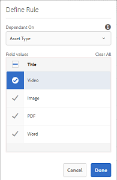
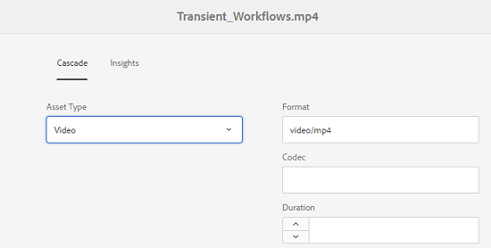

# Metadados em cascata {#cascading-metadata}

Ao capturar as informações de metadados de um ativo, os usuários fornecem informações nos vários campos disponíveis. É possível exibir campos de metadados específicos ou valores de campos que dependem das opções selecionadas nos outros campos. Essa exibição condicional de metadados é chamada de metadados em cascata. Em outras palavras, é possível criar uma dependência entre um campo/valor de metadados específico e um ou mais campos e/ou seus valores.

Use esquemas de metadados para definir regras para exibir metadados em cascata. Por exemplo, se o esquema de metadados incluir um campo de tipo de ativo, você poderá definir um conjunto pertinente de campos a serem exibidos com base no tipo de ativo selecionado pelo usuário.

Estes são alguns casos de uso para os quais você pode definir metadados em cascata:

* Quando a localização do usuário for obrigatória, exiba os nomes relevantes da cidade com base na escolha do país e estado pelo usuário.
* Carregue os nomes de marca pertinentes em uma lista com base na categoria de produto escolhida pelo usuário.
* Alterna a visibilidade de um campo específico com base no valor especificado em outro campo. Por exemplo, exiba campos de endereço de entrega separados se o usuário desejar que a entrega seja entregue em um endereço diferente.
* Designar um campo como obrigatório com base no valor especificado em outro campo.
* Opções de alteração exibidas para um campo específico com base no valor especificado em outro campo.
* Defina o valor de metadados padrão em um campo específico com base no valor especificado em outro campo.

## Configurar metadados em cascata no AEM {#configure-cascading-metadata-in-aem}

Considere um cenário em que você deseja exibir metadados em cascata com base no tipo de ativo selecionado. Alguns exemplos

* Para um vídeo, exiba campos aplicáveis, como formato, codec, duração e assim por diante.
* Para um documento do Word ou PDF, exiba campos, como contagem de páginas, autor e assim por diante.

Independentemente do tipo de ativo escolhido, exiba as informações de direitos autorais como um campo obrigatório.

1. Toque/clique no logotipo do AEM e vá para **[!UICONTROL Ferramentas]** > **[!UICONTROL Ativos]** > Esquemas **[!UICONTROL de metadados]**.
1. Na página Formulários **[!UICONTROL de]** esquema, selecione um formulário de esquema e toque/clique em **[!UICONTROL Editar]** na barra de ferramentas para editar o esquema.

   

1. (Opcional) No editor de esquema de metadados, crie um novo campo para condicionalizar. Especifique um nome e um caminho de propriedade na guia **[!UICONTROL Configurações]** .

   Para criar uma nova guia, toque/clique `+` para adicionar uma guia e, em seguida, adicionar um campo de metadados.

   

1. Adicionar um campo Suspenso para o tipo de ativo. Especifique um nome e um caminho de propriedade na guia **[!UICONTROL Configurações]** . Adicione uma descrição opcional.

   

1. Os pares de valores-chave são as opções fornecidas a um usuário de formulário. Você pode fornecer os pares de valor chave manualmente ou de um arquivo JSON.

   * Para especificar os valores manualmente, selecione **[!UICONTROL Adicionar manualmente]**, toque/clique em **[!UICONTROL Adicionar escolha]** e especifique o texto e o valor da opção. Por exemplo, especifique os tipos de ativos Vídeo, PDF, Word e Imagem.

   * Para obter os valores de um arquivo JSON dinamicamente, selecione **[!UICONTROL Adicionar pelo caminho]** JSON e forneça o caminho do arquivo JSON. O AEM obtém os pares de valor chave em tempo real quando o formulário é apresentado ao usuário.
   Ambas as opções são mutuamente exclusivas. Não é possível importar as opções de um arquivo JSON e editar manualmente.

   

   >[!NOTE]
   >
   >Quando você adiciona um arquivo JSON, os pares de valor chave não são exibidos no editor de esquema de metadados, mas estão disponíveis no formulário publicado.

   >[!NOTE]
   >
   >Ao adicionar opções, se você clicar no campo Suspenso, a interface fica distorcida e o ícone Excluir das opções para de funcionar. Não clique na lista suspensa até salvar as alterações. Se você enfrentar esse problema, salve o esquema e abra-o novamente para continuar a edição.

1. (Opcional) Adicione os outros campos obrigatórios. Por exemplo, formato, codec e duração do tipo de ativo de vídeo.

   Da mesma forma, adicione campos dependentes para outros tipos de ativos. Por exemplo, adicione campos de contagem de páginas e autor para ativos de documento, como arquivos PDF e Word.

   

1. Para criar uma dependência entre o campo de tipo de ativo e outros campos, escolha o campo dependente e abra a guia **[!UICONTROL Regras]** .

   

1. Em **[!UICONTROL Requisito]**, escolha **[!UICONTROL Obrigatório, com base na nova opção de regra]** .
1. Toque/clique em **[!UICONTROL Adicionar regra]** e escolha o campo Tipo **[!UICONTROL de]** ativo para criar uma dependência. Também escolha o valor do campo sobre o qual criar a dependência. Nesse caso, escolha **[!UICONTROL Vídeo]**. Tap/click **[!UICONTROL Done]** to save the changes.

   

   >[!NOTE]
   >
   >A lista suspensa com valores predefinidos manualmente pode ser usada com regras. Menus suspensos com caminho JSON configurado não podem ser usados com regras que usam valores predefinidos para aplicar condições. Se os valores forem carregados do JSON no tempo de execução, não será possível aplicar uma regra predefinida.

1. Em **[!UICONTROL Visibilidade]**, escolha **[!UICONTROL Visível, com base na nova opção de regra]** .

1. Toque/clique em **[!UICONTROL Adicionar regra]** e escolha o campo Tipo **[!UICONTROL de]** ativo para criar uma dependência. Também escolha o valor do campo sobre o qual criar a dependência. Nesse caso, escolha **[!UICONTROL Vídeo]**. Tap/click **[!UICONTROL Done]** to save the changes.

   

   >[!NOTE]
   >
   >Tocar/clicar em um espaço em branco (ou em qualquer outro lugar que não os valores) redefine os valores. Se isso acontecer, selecione novamente os valores.

   >[!NOTE]
   >
   >É possível aplicar as condições **[!UICONTROL de Requisito]** e **[!UICONTROL Visibilidade]** independentemente umas das outras.

1. Da mesma forma, crie uma dependência entre o valor Vídeo no campo Tipo de ativo e outros campos, como Codec e Duração.
1. Repita as etapas para criar dependência entre ativos de documento (PDF e Word) no campo Tipo [!UICONTROL de] ativo e campos como Contagem [!UICONTROL de] página e [!UICONTROL Autor].
1. Clique em **[!UICONTROL Salvar]**. Aplique o esquema de metadados a uma pasta.

1. Navegue até a pasta na qual você aplicou o Esquema de metadados e abra a página de propriedades de um ativo. Dependendo de sua escolha no campo Tipo de ativo, os campos de metadados em cascata pertinentes são exibidos.

   
   *Figura: Metadados em cascata para um vídeo*

   
   *Figura: Metadados em cascata para um documento*
