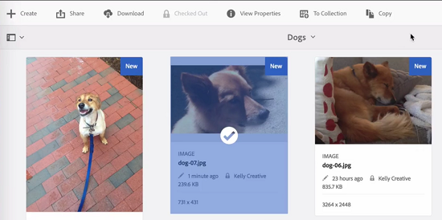

# Arquivos de check-in e check-out no [!DNL Experience Manager] DAM {#check-in-and-check-out-files-in-assets}

[!DNL Adobe Experience Manager Assets] permite que você faça check-out dos ativos para edição e faça check-in deles novamente depois de concluir a realização das alterações. Depois de fazer check-out de um ativo, somente você pode editar, anotar, publicar, mover ou excluir o ativo. Fazer check-out de um ativo bloqueia o ativo. Outros usuários não podem executar nenhuma dessas operações no ativo até que você faça check-in do ativo de volta para [!DNL Assets]. No entanto, eles ainda podem alterar os metadados do ativo bloqueado.

Para poder fazer check-out/check-in de ativos, você precisa ter acesso de gravação neles.

Esse recurso ajuda a impedir que outros usuários substituam as alterações feitas por um autor, onde vários usuários colaboram na edição de workflows entre equipes.

## Verificar ativos {#checking-out-assets}

1. Na interface do [!DNL Assets] usuário, selecione o ativo que deseja fazer check-out. Você também pode selecionar vários ativos para fazer check-out.
1. Na barra de ferramentas, clique em **[!UICONTROL Check-out]**.
A opção **[!UICONTROL Check-out]** alterna para **[!UICONTROL Check-in]**.
Para verificar se outros usuários podem editar o ativo que você fez check-out, faça logon como um usuário diferente. Um símbolo de cadeado é exibido na miniatura do ativo que você deu baixa.

   

   Selecione o ativo. Observe que a barra de ferramentas não exibe nenhuma opção que permita editar, anotar, publicar ou excluir o ativo.

   

   Você pode clicar em Propriedades **[!UICONTROL da]** Visualização para editar os metadados do ativo bloqueado.

1. Clique em **[!UICONTROL Editar]** para abrir o ativo no modo de edição.

   

1. Edite o ativo e salve as alterações. Por exemplo, recorte a imagem e salve-a.

   

   Você também pode optar por anotar ou publicar o ativo.

1. Selecione o ativo editado na [!DNL Assets] interface e clique em **[!UICONTROL Check-in]** na barra de ferramentas. O ativo modificado é feito check-in e está disponível para outros usuários [!DNL Assets] para edição.

## Check-in forçado {#forced-check-in}

Os administradores podem fazer check-in de ativos cujo check-out foi feito por outros usuários.

1. Faça logon [!DNL Assets] como administrador.
1. Na interface do [!DNL Assets] usuário, selecione um ou mais ativos cujo check-out foi feito por outros usuários.

   

1. Na barra de ferramentas, clique em **[!UICONTROL Liberar bloqueio]**. O ativo é devolvido e está disponível para edição para outros usuários.

>[!MORELIKETHIS]
>
>* [Entenda o check-in e o check-out no aplicativo de desktop Experience Manager](https://docs.adobe.com/content/help/en/experience-manager-desktop-app/using/using.html#how-app-works2)
>* [Tutorial em vídeo para entender o check-in e o check-out nos ativos](https://docs.adobe.com/content/help/en/experience-manager-learn/assets/collaboration/checkin-checkout-technical-video-understand.html)

