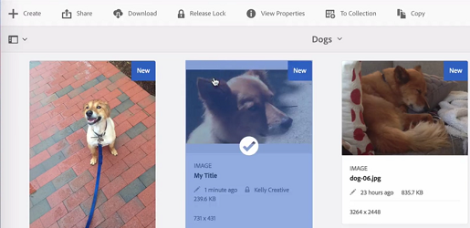

# Arquivos de check-in e check-out no DAM [!DNL Experience Manager] {#check-in-and-check-out-files-in-assets}

| Versão | Link do artigo |
| -------- | ---------------------------- |
| AEM as a Cloud Service | [Clique aqui](https://experienceleague.adobe.com/docs/experience-manager-cloud-service/content/assets/manage/check-out-and-submit-assets.html?lang=en) |
| AEM 6.5 | Este artigo |

[!DNL Adobe Experience Manager Assets] permite que você faça check-out dos ativos para edição e check-in novamente depois que você concluir as alterações. Depois de fazer check-out de um ativo, somente você pode editar, anotar, publicar, mover ou excluir o ativo. Fazer o check-out de um ativo bloqueia o ativo. Outros usuários não podem realizar nenhuma dessas operações no ativo até que você faça check-in do ativo novamente em [!DNL Assets]. No entanto, eles ainda podem alterar os metadados do ativo bloqueado.

Para fazer check-out/check-in de ativos, é necessário ter acesso de gravação a eles.

Este recurso ajuda a impedir que outros usuários substituam as alterações feitas por um autor, em que vários usuários colaboram na edição de workflows entre equipes.

## Fazer check-out dos ativos {#checking-out-assets}

1. Na interface de usuário do [!DNL Assets], selecione o ativo que deseja verificar. Você também pode selecionar vários ativos para fazer check-out.
1. Na barra de ferramentas, clique em **[!UICONTROL Check-out]**. A opção **[!UICONTROL Check-out]** alterna para **[!UICONTROL Check-in]**.
Para verificar se outros usuários podem editar o ativo do qual você fez check-out, faça logon como um usuário diferente. Um símbolo de bloqueio é exibido na miniatura do ativo do qual você fez check-out.

   

   Selecione o ativo. Observe que a barra de ferramentas não exibe nenhuma opção que permita editar, anotar, publicar ou excluir o ativo.

   

   Para editar os metadados do ativo bloqueado, clique em **[!UICONTROL Exibir Propriedades]**.

1. Clique em **[!UICONTROL Editar]** para abrir o ativo no modo de edição.

   

1. Edite o ativo e salve as alterações. Por exemplo, recorte a imagem e salve.

   

   Também é possível optar por anotar ou publicar o ativo.

1. Selecione o ativo editado na interface [!DNL Assets] e clique em **[!UICONTROL Check-in]** na barra de ferramentas. Foi feito check-in do ativo modificado em [!DNL Assets] e ele está disponível para edição por outros usuários.

## Check-in forçado {#forced-check-in}

Os administradores podem fazer check-in de ativos que passaram por check-out por outros usuários.

1. Faça logon em [!DNL Assets] como administrador.
1. Na interface de usuário do [!DNL Assets], selecione um ou mais ativos cujo check-out foi feito por outros usuários.

   

1. Na barra de ferramentas, clique em **[!UICONTROL Liberar Bloqueio]**. É feito check-in do ativo e ele fica disponível para edição para outros usuários.

## Práticas recomendadas e limitações {#tips-limitations}

* É possível excluir uma *pasta* que contenha arquivos de ativos com check-out. Antes de excluir uma pasta, verifique se nenhum ativo digital foi retirado por usuários.

>[!MORELIKETHIS]
>
>* [Entender o check-in e o check-out no [!DNL Experience Manager] aplicativo de desktop](https://experienceleague.adobe.com/docs/experience-manager-desktop-app/using/using.html#how-app-works2)
>* [Tutorial em vídeo para entender o check-in e o check-out em [!DNL Assets]](https://experienceleague.adobe.com/docs/experience-manager-learn/assets/collaboration/check-in-and-check-out.html)
