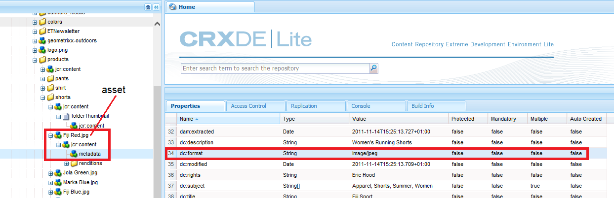

# Configuração do Dynamic Media - modo Scene7{#configuring-dynamic-media-scene-mode}

Se você usar a configuração do Adobe Experience Manager para ambientes diferentes, como desenvolvimento, armazenamento temporário e produção, configure os Cloud Services Dynamic Media para cada um desses ambientes.

## Diagrama de arquitetura do Dynamic Media - modo Scene7 {#architecture-diagram-of-dynamic-media-scene-mode}

O diagrama de arquitetura a seguir descreve como o modo Dynamic Media - Scene7 funciona.

Com a nova arquitetura, o Experience Manager é responsável por ativos de origem primária e sincronizações com a Dynamic Media para processamento e publicação de ativos:

1. Quando o ativo de origem principal é carregado para o Experience Manager, ele é replicado para o Dynamic Media. Nesse ponto, a Dynamic Media lida com todo o processamento de ativos e geração de representação, como codificação de vídeo e variantes dinâmicas de uma imagem. <!-- (In Dynamic Media - Scene7 mode, be aware that you can only upload assets whose file sizes are 2 GB or less.) Jira ticket CQ-4286561 fixed this issue. DM-S7 NOW SUPPORTS THE UPLOAD OF ASSETS LARGER THAN 2 GB. -->
1. Depois que as renderizações são geradas, o Experience Manager pode acessar e pré-visualização com segurança as renderizações remotas do Dynamic Media (nenhum binário é enviado de volta à instância Experience Manager).
1. Depois que o conteúdo estiver pronto para ser publicado e aprovado, ele aciona o serviço Dynamic Media para enviar conteúdo para os servidores de delivery e armazená-lo em cache no CDN (Content Delivery Network).


>[!NOTE]
>
>A lista de recursos a seguir requer o uso do CDN pronto para uso fornecido com o Adobe Experience Manager - Dynamic Media. Nenhum outro CDN personalizado é compatível com esses recursos.
>
>* [Imagem inteligente](/help/assets/imaging-faq.md)
>* [Invalidação de cache](/help/assets/invalidate-cdn-cache-dynamic-media.md)
>* [Proteção de link](/help/assets/hotlink-protection.md)
>* [DELIVERY HTTP/2 de conteúdo](/help/assets/http2.md)
>* Redirecionamento de URL no nível CDN
>* Akamai ChinaCDN (para um delivery ideal na China)


## Ativação do Dynamic Media no modo Scene7 {#enabling-dynamic-media-in-scene-mode}

[As mídias dinâmicas são desativadas por padrão. ](https://www.adobe.com/solutions/web-experience-management/dynamic-media.html) Para aproveitar os recursos do Dynamic Media, é necessário ativá-lo.

>[!NOTE]
>
>Dynamic Media - O modo Scene7 é apenas para a instância Experience Manager. Dessa forma, você deve configurar `runmode=dynamicmedia_scene7` na instância do autor do Experience Manager, *e não* na instância de publicação do Experience Manager.

Para habilitar o Dynamic Media, é necessário start Experience Manager usando o modo de execução `dynamicmedia_scene7` da linha de comando inserindo o seguinte em uma janela de terminal (a porta de exemplo usada é 4502):

```shell
java -Xms4096m -Xmx4096m -Doak.queryLimitInMemory=500000 -Doak.queryLimitReads=500000 -jar cq-quickstart-6.5.0.jar -gui -r author,dynamicmedia_scene7 -p 4502
```

## (Opcional) Migração de predefinições e configurações do Dynamic Media de 6.3 para 6.5 Zero Downtime {#optional-migrating-dynamic-media-presets-and-configurations-from-to-zero-downtime}

A atualização do Experience Manager Dynamic Media de 6.3 para 6.4 ou 6.5 agora inclui a capacidade de implantações de tempo de inatividade zero. Para migrar todas as predefinições e configurações de `/etc` para `/conf` no CRXDE Lite, execute o seguinte comando de ondulação.

>[!NOTE]
>
>Se você executar sua instância do Experience Manager no modo de compatibilidade - isto é, se a compatibilidade estiver empacotada - não será necessário executar esses comandos.

Para todas as atualizações, com ou sem o pacote de compatibilidade, você pode copiar as predefinições padrão e predefinidas do visualizador que originalmente veio com o Dynamic Media executando o seguinte comando de curl do Linux:

`curl -u admin:admin -X POST https://<server_address>:<server_port>/libs/settings/dam/dm/presets/viewer.pushviewerpresets.json`

Para migrar quaisquer predefinições e configurações do visualizador personalizado que você tenha criado de `/etc` para `/conf`, execute o seguinte comando de rolagem do Linux:

`curl -u admin:admin -X POST https://<server_address>:<server_port>/libs/settings/dam/dm/presets.migratedmcontent.json`

## Instalação do pacote de recursos 18912 para migração de ativos em massa {#installing-feature-pack-for-bulk-asset-migration}

A instalação do pacote de recursos 18912 é *opcional*.

O pacote de recursos 18912 permite que você ingira ativos em massa por meio do FTP ou migre ativos do modo Dynamic Media - Híbrido ou Dynamic Media Classic para o modo Dynamic Media - Scene7 no Experience Manager. Está disponível em [Adobe Professional Services](https://www.adobe.com/experience-cloud/consulting-services.html).

Consulte [Instalando o pacote de recursos 18912 para migração de ativos em massa](/help/assets/bulk-ingest-migrate.md) para obter mais informações.

## Criação de uma configuração Dynamic Media no Cloud Services {#configuring-dynamic-media-cloud-services}

**Antes de configurar o Dynamic Media** : depois de receber seu email de provisionamento com credenciais do Dynamic Media, você deve abrir o aplicativo [ de desktop ](https://experienceleague.adobe.com/docs/dynamic-media-classic/using/getting-started/signing-out.html#getting-started)Dynamic Media Classic e, em seguida, fazer logon na sua conta para alterar sua senha. A senha fornecida no email de provisionamento é gerada pelo sistema e deve ser apenas uma senha temporária. É importante que você atualize a senha para que o Dynamic Media Cloud Service esteja configurado com as credenciais corretas.


**Para criar uma configuração Dynamic Media em Cloud Services**

1. No Experience Manager, toque no logotipo do Experience Manager para acessar o console de navegação global e toque no ícone Ferramentas, em seguida, toque em **[!UICONTROL Cloud Services > Configuração do Dynamic Media.]**
1. Na página Navegador de configuração do Dynamic Media, no painel à esquerda, toque em **[!UICONTROL global]** (não toque ou selecione o ícone de pasta à esquerda de **[!UICONTROL global]**) e, em seguida, toque em **[!UICONTROL Criar.]**
1. Na página **[!UICONTROL Criar Configuração do Dynamic Media]**, digite um título, o endereço de email da conta do Dynamic Media, a senha e selecione sua região. Essas informações são fornecidas por Adobe no e-mail de provisionamento. Entre em contato com o Atendimento ao cliente do Adobe se você não recebeu o email.

   Toque em **[!UICONTROL Ligar ao Dynamic Media.]**

   >[!NOTE]
   Depois de receber seu email de provisionamento com credenciais da Dynamic Media, abra o [aplicativo Dynamic Media Classic para desktop](https://experienceleague.adobe.com/docs/dynamic-media-classic/using/getting-started/signing-out.html#getting-started) e faça logon na sua conta para alterar sua senha. A senha fornecida no email de provisionamento é gerada pelo sistema e deve ser apenas uma senha temporária. É importante que você atualize a senha para que o Cloud Service Dynamic Media seja configurado com as credenciais corretas.

1. Quando a conexão for bem-sucedida, defina o seguinte. Cabeçalhos com asterisco (*) são obrigatórios:

   * **[!UICONTROL Empresa]**  - o nome da conta do Dynamic Media. Você tem várias contas Dynamic Media. Por exemplo, você pode ter diferentes submarcas, divisões, preparo ou ambientes de produção.

   * **[!UICONTROL Caminho da pasta raiz da empresa]**

   * **[!UICONTROL Ativos]**  de publicação - você pode escolher entre as três opções a seguir:
      * **** Imediatamente significa que quando os ativos são carregados, o sistema ingere os ativos e fornece o URL/Incorporado instantaneamente. Não há necessidade de intervenção do usuário para publicar ativos.
      * **[!UICONTROL Na]** ativação, significa que você deve publicar explicitamente o ativo primeiro antes que um link URL/Incorporado seja fornecido.
      * **[!UICONTROL Publicação seletivaEssa opção permite controlar quais pastas são publicadas no Dynamic Media.]** Ele permite que você use recursos como Recorte inteligente ou representações dinâmicas, ou determine quais pastas são publicadas exclusivamente no Experience Manager para visualização. Esses mesmos ativos são *e não* publicados no Dynamic Media para delivery no domínio público.<br>Você pode definir essa opção aqui na  **[!UICONTROL Dynamic Media Cloud]** Configuration ou, se preferir, pode optar por definir essa opção no nível da pasta, em  **[!UICONTROL Propriedades]** de uma pasta.<br>Consulte  [Trabalhar com publicação seletiva no Dynamic Media.](/help/assets/selective-publishing.md)<br>Se você alterar essa configuração posteriormente ou posteriormente alterá-la no nível da pasta, essas alterações afetarão somente os novos ativos que você carregar a partir desse ponto em diante. O estado de publicação dos ativos existentes na pasta permanece como está até que você os altere manualmente da caixa de diálogo **[!UICONTROL Publicação rápida]** ou **[!UICONTROL Gerenciar publicação]**.
   * **[!UICONTROL Servidor]**  de Pré-visualização seguro - permite que você especifique o caminho do URL para o servidor de pré-visualização de representações seguras. Ou seja, depois que as renderizações são geradas, o Experience Manager pode acessar e pré-visualização com segurança as renderizações remotas do Dynamic Media (nenhum binário é enviado de volta para a instância Experience Manager).
A menos que você tenha uma disposição especial para usar seu próprio servidor empresa ou um servidor especial, o Adobe recomenda deixar essa configuração como especificado.

   * **[!UICONTROL Sincronizar todo o conteúdo]**  -  <!-- NEW OPTION, CQDOC-15371, Added March 4, 2020-->Selecionado por padrão. Desmarque essa opção se desejar incluir ou excluir seletivamente ativos da sincronização para o Dynamic Media. Desmarcar essa opção permite escolher entre os dois modos de sincronização do Dynamic Media a seguir:

   * **[!UICONTROL Modo de sincronização do Dynamic Media]**
      * **[!UICONTROL Ativado por padrão]**  - a configuração é aplicada a todas as pastas por padrão, a menos que você marque uma pasta especificamente para exclusão.  <!-- you can then deselect the folders that you do not want the configuration applied to.-->
      * **[!UICONTROL Desativado por padrão]**  - a configuração não é aplicada a nenhuma pasta até que você marque explicitamente uma pasta selecionada para sincronização com o Dynamic Media.
Para marcar uma pasta selecionada para sincronização com o Dynamic Media, selecione uma pasta de ativos e, na barra de ferramentas, toque em **[!UICONTROL Propriedades]**. Na guia **[!UICONTROL Details]**, na lista suspensa **[!UICONTROL Modo de sincronização Dynamic Media]**, escolha uma das três opções a seguir. Quando terminar, toque em **[!UICONTROL Salvar.]** *Lembre-se: essas três opções não estarão disponíveis se você tiver selecionado **Sincronizar todo o**conteúdo anteriormente.* Consulte também  [Trabalhar com publicação seletiva no nível da pasta no Dynamic Media.](/help/assets/selective-publishing.md)
         * **[!UICONTROL Herdado]**  - Nenhum valor de sincronização explícito na pasta; em vez disso, a pasta herda o valor de sincronização de uma de suas pastas ancestrais ou o modo padrão na configuração da nuvem. O status detalhado para herdado é exibido por meio de uma dica de ferramenta.
         * **[!UICONTROL Ativar para subpastas]**  - Inclua tudo nesta subárvore para sincronização com o Dynamic Media. As configurações específicas da pasta substituem o modo padrão na configuração da nuvem.
         * **[!UICONTROL Desabilitado para subpastas]**  - Exclua toda a sincronização desta subárvore para o Dynamic Media.

   >[!NOTE]
   Não há suporte para controle de versão no DMS7. Além disso, a ativação atrasada se aplica somente se **[!UICONTROL Publicar ativos]** na página Editar configuração do Dynamic Media estiver definida como **[!UICONTROL Na ativação]** e, em seguida, somente até a primeira vez que o ativo for ativado.
   Depois que um ativo é ativado, todas as atualizações são publicadas imediatamente no Delivery S7.

1. Toque em **[!UICONTROL Salvar.]**
1. Para pré-visualização segura do conteúdo do Dynamic Media antes de ele ser publicado, é necessário &quot;lista de permissões&quot; a instância do autor do Experience Manager para se conectar ao Dynamic Media:

   * Abra o [aplicativo Dynamic Media Classic para desktop](https://experienceleague.adobe.com/docs/dynamic-media-classic/using/getting-started/signing-out.html#getting-started) e faça logon em sua conta. Suas credenciais e detalhes de logon foram fornecidos pelo Adobe no momento do provisionamento. Se você não tiver essas informações, entre em contato com o Suporte Técnico.

   * Na barra de navegação próxima à parte superior direita da página, toque em **[!UICONTROL Configuração > Configuração do aplicativo > Configuração de publicação > Servidor de imagens]**.

   * Na página Publicação do Servidor de Imagens, na lista suspensa Contexto de Publicação, selecione **[!UICONTROL Servidor de Imagens de Teste.]**
   * Para o Filtro de Endereço do Cliente, toque em **[!UICONTROL Adicionar.]**
   * Para ativar (ativar) o endereço, marque a caixa de seleção. Insira o endereço IP da instância do autor do Experience Manager (não o IP do Dispatcher).
   * Toque em **[!UICONTROL Salvar.]**

Agora você terminou com a configuração básica; você está pronto para usar o modo Dynamic Media - Scene7.

Se desejar personalizar ainda mais sua configuração, você pode, opcionalmente, concluir qualquer uma das tarefas em [(Opcional) Configurando configurações avançadas no Dynamic Media - modo Scene7](#optional-configuring-advanced-settings-in-dynamic-media-scene-mode).

## (Opcional) Configuração de configurações avançadas no Dynamic Media - modo Scene7 {#optional-configuring-advanced-settings-in-dynamic-media-scene-mode}

Se quiser personalizar ainda mais a configuração e configuração do Dynamic Media - modo Scene7, ou otimizar seu desempenho, você pode concluir uma ou mais das seguintes tarefas *opcionais*:

* [(Opcional) Configuração e configuração do Dynamic Media - configurações do modo Scene7](#optional-setup-and-configuration-of-dynamic-media-scene7-mode-settings)

* [(Opcional) Ajuste do desempenho do Dynamic Media - modo Scene7](#optional-tuning-the-performance-of-dynamic-media-scene-mode)

* [(Opcional) Filtrar ativos para replicação](#optional-filtering-assets-for-replication)

### (Opcional) Configuração e configuração do Dynamic Media - configurações de modo Scene7 {#optional-setup-and-configuration-of-dynamic-media-scene7-mode-settings}

Quando você estiver no modo de execução `dynamicmedia_scene7`, use a interface do usuário do Dynamic Media Classic para alterar as configurações do Dynamic Media.

Algumas das tarefas acima exigem que você abra o [aplicativo Dynamic Media Classic desktop](https://experienceleague.adobe.com/docs/dynamic-media-classic/using/getting-started/signing-out.html#getting-started) e faça logon em sua conta.

As tarefas de configuração incluem:

* [Configuração de publicação para o Image Server](#publishing-setup-for-image-server)
* [Definição das configurações gerais do aplicativo](#configuring-application-general-settings)
* [Configuração do gerenciamento de cores](#configuring-color-management)
* [Edição de tipos MIME para formatos suportados](#editing-mime-types-for-supported-formats)
* [Adicionar tipos MIME para formatos não suportados](#adding-mime-types-for-unsupported-formats)
* [Criando predefinições de conjuntos de lotes para gerar automaticamente Conjuntos de imagens e Conjuntos de rotação](#creating-batch-set-presets-to-auto-generate-image-sets-and-spin-sets)

#### Configuração de publicação para o Image Server {#publishing-setup-for-image-server}

As configurações de publicação determinam como os ativos são entregues por padrão da Dynamic Media. Se nenhuma configuração for especificada, a Dynamic Media fornece um ativo de acordo com as configurações padrão definidas na Configuração de publicação. Por exemplo, uma solicitação para fornecer uma imagem que não inclui um atributo de resolução gera uma imagem com a configuração Resolução de objeto padrão.

Para configurar a Configuração de publicação: no Dynamic Media Classic, toque em **[!UICONTROL Configuração > Configuração de aplicativo > Configuração de publicação > Servidor de imagens]**.

A tela Servidor de imagens estabelece as configurações padrão para a entrega de imagens. Consulte a tela da interface do usuário para obter a descrição de cada configuração.

* **[!UICONTROL Atributos]**  de solicitação - essas configurações impõem limites às imagens que podem ser entregues do servidor.
* **[!UICONTROL Atributos]**  de solicitação padrão - essas configurações pertencem à aparência padrão das imagens.
* **[!UICONTROL Atributos]**  de miniatura comuns - Essas configurações pertencem à aparência padrão das imagens em miniatura.
* **[!UICONTROL Padrões para campos]** de catálogo - Essas configurações pertencem à resolução e ao tipo de miniatura padrão das imagens.
* **[!UICONTROL Atributos]**  de gerenciamento de cores: essas configurações determinam quais perfis de cores ICC são usados.
* **[!UICONTROL Atributos]**  de compatibilidade - essa configuração permite que os parágrafos à esquerda e à direita em camadas de texto sejam tratados como na versão 3.6 para compatibilidade com versões anteriores.
* **[!UICONTROL Suporte]**  à localização - Essas configurações permitem gerenciar vários atributos de localidade. Ela também permite que você especifique uma string de mapa de localidade para que você possa definir quais idiomas deseja suportar para as várias dicas de ferramentas nos Visualizadores. Para obter mais informações sobre como configurar **[Suporte à Localização]**, consulte [Considerações ao configurar a localização de ativos](https://help.adobe.com/en_US/scene7/using/WS997f1dc4cb0179f034e07dc31412799d19a-8000.html).

#### Definição das configurações gerais do aplicativo {#configuring-application-general-settings}

Para abrir a página Configurações gerais do aplicativo, na barra Navegação global do Dynamic Media Classic, toque em **[!UICONTROL Configuração > Configuração do aplicativo > Configurações gerais.]**

**Servidores - **No provisionamento da conta, a Dynamic Media fornece automaticamente os servidores designados para a sua empresa. Esses servidores são usados para construir strings de URL para seu site e aplicativos. Essas chamadas de URL são específicas para sua conta. Não altere nenhum dos nomes de servidor, a menos que seja explicitamente instruído a fazê-lo pelo Atendimento ao cliente da Adobe.

**[!UICONTROL Substituir imagens]**  - o Dynamic Media não permite que dois arquivos tenham o mesmo nome. A ID do URL de cada item (o nome do arquivo menos a extensão) deve ser exclusiva. Essas opções especificam como os ativos de substituição são carregados: se eles substituem o original ou se tornam duplicados. Os ativos do duplicado são renomeados com um &quot;-1&quot; (por exemplo, o nome &quot;President.tif&quot; é renomeado como President-1.tif). Essas opções afetam os ativos carregados em uma pasta diferente do original ou os ativos com uma extensão de nome de arquivo diferente do original (como JPG, TIF ou PNG).

* **[!UICONTROL Substituir na pasta atual, mesmo nome/extensão]**  da imagem base - Essa opção é a regra mais estrita para substituição. Ele requer que você carregue a imagem de substituição na mesma pasta que a original e que a imagem de substituição tenha a mesma extensão de nome de arquivo que a original. Se esses requisitos não forem atendidos, um duplicado será criado.

>[!NOTE]
Para manter a consistência com o Experience Manager, sempre escolha esta configuração: **Substituir na pasta atual, mesmo nome/extensão da imagem base**

* **[!UICONTROL Substituir em qualquer pasta, o mesmo nome/extensão]**  do ativo básico - Requer que a imagem de substituição tenha a mesma extensão de nome de arquivo que a imagem original (por exemplo, o arquivo visit.jpg deve substituir o arquivo .jpg, não o domínio .tif). No entanto, é possível carregar a imagem de substituição para uma pasta diferente da original. A imagem atualizada reside na nova pasta; o arquivo não pode mais ser encontrado em seu local original
* **[!UICONTROL Substituir em qualquer pasta, o mesmo nome do ativo básico independentemente da extensão]**  - Essa opção é a regra de substituição mais inclusiva. Você pode carregar uma imagem de substituição para uma pasta diferente da original, carregar um arquivo com uma extensão de nome de arquivo diferente e substituir o arquivo original. Se o arquivo original estiver em uma pasta diferente, a imagem de substituição residirá na nova pasta para a qual foi carregada.

**[!UICONTROL Perfis]**  de cor padrão - Consulte  [Configuração do ](#configuring-color-management) gerenciamento de cores para obter mais informações.

>[!NOTE]
Por padrão, o sistema mostra 15 execuções ao selecionar **[!UICONTROL Representações]** e 15 predefinições do visualizador ao selecionar **[!UICONTROL Visualizadores]** na exibição detalhada do ativo. Você pode aumentar esse limite. Consulte [Aumentando o número de predefinições de imagens que exibem](/help/assets/managing-image-presets.md#increasing-or-decreasing-the-number-of-image-presets-that-display) ou [Aumentando o número de predefinições do visualizador que exibem](/help/assets/managing-viewer-presets.md#increasing-the-number-of-viewer-presets-that-display).


#### Configuração do gerenciamento de cores {#configuring-color-management}

O gerenciamento dinâmico de cores de mídia permite que você corrija ativos. Com a correção de cores, os ativos ingeridos retêm seu espaço de cores (RGB, CMYK, Cinza) e o perfil de cores incorporado. Quando você solicita uma representação dinâmica, a cor da imagem é corrigida no espaço de cor do público alvo usando a saída CMYK, RGB ou Gray. Consulte [Configuração de predefinições de imagens](/help/assets/managing-image-presets.md).

Para configurar as propriedades de cor padrão, a correção de cores é ativada quando as imagens são solicitadas:

1. Abra o [aplicativo Dynamic Media Classic para desktop](https://experienceleague.adobe.com/docs/dynamic-media-classic/using/getting-started/signing-out.html#getting-started) e faça logon na sua conta usando as credenciais fornecidas durante o provisionamento.
1. Navegue até **[!UICONTROL Configuração > Configuração de Aplicativo.]**
1. Expanda a área **[!UICONTROL Publicar configuração]** e selecione **[!UICONTROL Servidor de imagens.]** Defina **[!UICONTROL Publicar contexto]** como **[!UICONTROL Serviço de imagem]** ao definir padrões para instâncias de publicação.
1. Role até a propriedade que deseja alterar. Por exemplo, uma propriedade na área **[!UICONTROL Atributos de gerenciamento de cores]**.

   É possível definir as seguintes propriedades de correção de cores:

   * **[!UICONTROL Espaço]**  de cor padrão CMYK - Nome do perfil de cor padrão CMYK
   * **[!UICONTROL Espaço]**  de cor padrão em escala de cinza - Nome do perfil de cor cinza padrão
   * **[!UICONTROL Espaço]**  de cor padrão RGB - Nome do perfil de cor RGB padrão
   * **[!UICONTROL Propósito]**  de renderização da conversão de cores - Especifica o propósito de renderização. Os valores aceitáveis são: **[!UICONTROL perceptual]**, **[!UICONTROL colométrica relativa]**, **[!UICONTROL saturação]**, **[!UICONTROL colométrica absoluta.]** Adobe recomenda  **** como padrão.

1. Toque em **[!UICONTROL Salvar.]**

Por exemplo, você pode definir o **[!UICONTROL Espaço de cor padrão RGB]** como *sRGB* e o **[!UICONTROL Espaço de cor padrão CMYK]** como *WebCoated*.

Isso faria o seguinte:

* Permite a correção de cores para imagens RGB e CMYK.
* Imagens RGB que não têm um perfil colorido são consideradas como estando no espaço de cores *sRGB*.
* Imagens CMYK que não têm um perfil colorido são consideradas como estando em *WebCoated* espaço colorido.
* Execuções dinâmicas que retornam a saída RGB, retornam no espaço de cores *sRGB*.
* Execuções dinâmicas que retornam a saída CMYK, retornam no espaço de cores *WebCoated*.

#### Edição de tipos MIME para formatos suportados {#editing-mime-types-for-supported-formats}

Você pode definir quais tipos de ativos são processados pela Dynamic Media e personalizar parâmetros avançados de processamento de ativos. Por exemplo, você pode especificar parâmetros de processamento de ativos para fazer o seguinte:

* Converter um Adobe PDF em um ativo eCatalog.
* Converta um Documento Adobe Photoshop (.PSD) em um ativo de modelo de banner para personalização.
* Rasterize um arquivo Adobe Illustrator (.AI) ou um arquivo Adobe Photoshop Encapsulated PostScript® (.EPS).
* [Os ](/help/assets/video-profiles.md) Perfis de vídeo e os  [Perfis ](/help/assets/image-profiles.md) de imagem podem ser usados para definir o processamento de vídeos e imagens, respectivamente.

Consulte [Upload de ativos](/help/assets/manage-assets.md#uploading-assets).

**Para editar tipos MIME para formatos suportados**

1. No Experience Manager, toque no logotipo do Experience Manager para acessar o console de navegação global e, em seguida, toque em **[!UICONTROL Ferramentas > Geral > CRXDE Lite.]**
1. No painel esquerdo, navegue até o seguinte:

   `/conf/global/settings/cloudconfigs/dmscene7/jcr:content/mimeTypes`

   

1. Na pasta mimeTypes, selecione um tipo mime.
1. No lado direito da página CRXDE Lite, na parte inferior:

   * Clique com o duplo no campo **[!UICONTROL enabled]**. Por padrão, todos os tipos MIME de ativos estão ativados (definidos como **[!UICONTROL true]**), o que significa que os ativos são sincronizados com a Dynamic Media para processamento. Se você desejar excluir esse tipo MIME de ativo do processamento, altere essa configuração para **[!UICONTROL false.]**

   * Toque em duplo **[!UICONTROL jobParam]** para abrir o campo de texto associado. Consulte [Tipos MIME Suportados](/help/assets/assets-formats.md#supported-mime-types) para obter uma lista de valores de parâmetro de processamento permitidos que você pode usar para um determinado tipo MIME.

1. Faça uma das seguintes opções:

   * Repita as etapas 3 a 4 para editar mais tipos MIME.
   * Na barra de menus da página CRXDE Lite, toque em **[!UICONTROL Salvar tudo.]**

1. No canto superior esquerdo da página, toque em **[!UICONTROL CRXDE Lite]** para voltar ao Experience Manager.

#### Adicionar tipos MIME para formatos sem suporte {#adding-mime-types-for-unsupported-formats}

Você pode adicionar tipos MIME personalizados para formatos não suportados em Ativos Experience Manager. Certifique-se de que qualquer novo nó adicionado ao CRXDE Lite não seja excluído pelo Experience Manager movendo o tipo MIME antes de `image_`. Além disso, certifique-se de que o valor ativado esteja definido como **[!UICONTROL false.]**

**Para adicionar tipos MIME para formatos não suportados**

1. No Experience Manager, toque em **[!UICONTROL Ferramentas > Operações > Console Web.]**

   

1. Uma nova guia do navegador é aberta na página **[!UICONTROL Configuração do Adobe Experience Manager Web Console]**.

   

1. Na página, role para baixo até o nome *Adobe CQ Scene7 Asset MIME type Service*, como visto na seguinte captura de tela. À direita do nome, toque em **[!UICONTROL Editar os valores]** de configuração (ícone de lápis).

   

1. Na página **Adobe CQ Scene7 Asset MIME type Service**, toque em qualquer ícone de sinal de mais &lt;+>. O local na tabela onde você toca no sinal de mais para adicionar o novo tipo mime é trivial.

   

1. Digite `DWG=image/vnd.dwg` no campo de texto vazio que você acabou de adicionar.

   O exemplo `DWG=image/vnd.dwg` é apenas para fins ilustrativos. O tipo MIME que você adicionar aqui pode ser qualquer outro formato sem suporte.

   

1. No canto inferior direito da página, toque em **[!UICONTROL Salvar.]**

   Nesse ponto, você pode fechar a guia do navegador que tem a página aberta Configuração do Adobe Experience Manager Web Console.

1. Retorne à guia do navegador que tem seu console Experience Manager aberto.
1. No Experience Manager, toque em **[!UICONTROL Ferramentas > Geral > CRXDE Lite.]**

   

1. No painel esquerdo, navegue até o seguinte:

   `conf/global/settings/cloudconfigs/dmscene7/jcr:content/mimeTypes`

1. Arraste o tipo mime `image_vnd.dwg` e solte-o diretamente acima de `image_` na árvore, conforme exibido na seguinte captura de tela.

   

1. Com o tipo mime `image_vnd.dwg` ainda selecionado, na guia **[!UICONTROL Propriedades]**, na linha **[!UICONTROL enabled]**, no cabeçalho da coluna **[!UICONTROL Valor]**, toque com o duplo no valor para abrir a lista suspensa **[!UICONTROL Valor]**.
1. Digite `false` no campo (ou selecione **[!UICONTROL false]** na lista suspensa).

   

1. Perto do canto superior esquerdo da página CRXDE Lite, toque em **[!UICONTROL Salvar tudo.]**

#### Criando predefinições de conjuntos de lotes para gerar automaticamente Conjuntos de imagens e Conjuntos de rotação {#creating-batch-set-presets-to-auto-generate-image-sets-and-spin-sets}

Use predefinições de conjuntos de lotes para automatizar a criação de conjuntos de imagens ou conjuntos de rotação enquanto os ativos são carregados para a Dynamic Media.

Primeiro, defina a convenção de nomenclatura para como os ativos são agrupados em um conjunto. Em seguida, crie uma predefinição de conjunto de lotes que seja um conjunto exclusivo de instruções autocontidas e nomeadas. Ele deve definir como construir o conjunto usando imagens que correspondam às convenções de nomenclatura definidas na fórmula predefinida.

Quando você carrega arquivos, o Dynamic Media cria automaticamente um conjunto com todos os arquivos que correspondem à convenção de nomenclatura definida nas predefinições ativas.

**Configuração da nomenclatura padrão**

Crie uma convenção de nomenclatura padrão que seja usada em qualquer fórmula predefinida de conjunto de lotes. A convenção de nomenclatura padrão selecionada na definição predefinida do conjunto de lotes provavelmente é tudo o que a sua empresa precisa para gerar conjuntos em lote. Uma predefinição de conjunto de lotes é criada para usar a convenção de nomenclatura padrão definida. Você pode criar quantas predefinições de Conjunto de Lotes tiver convenções de nomenclatura alternativas e personalizadas, necessárias para um determinado conjunto de conteúdo, em casos em que haja uma exceção para a nomeação padrão definida pela empresa.

Embora a configuração de uma convenção de nomenclatura padrão não seja necessária para usar a funcionalidade predefinida de conjunto de lotes, a prática recomendada é usar a convenção de nomenclatura padrão. Ele permite definir quantos elementos da sua convenção de nomenclatura você deseja agrupar em um conjunto para que você possa dinamizar a criação de um conjunto de lotes.

Como alternativa, você pode usar **[!UICONTROL Código de Visualização]** sem campos de formulário disponíveis. Nessa visualização, você cria suas definições de convenção de nomenclatura totalmente usando expressões regulares.

Dois elementos estão disponíveis para definição, Correspondência e Nome básico. Esses campos permitem que você defina todos os elementos de uma convenção de nomenclatura e identifique a parte da convenção usada para nomear o conjunto no qual eles estão contidos. A convenção de nomenclatura individual de uma empresa geralmente usa uma ou mais linhas de definição para cada um desses elementos. Você pode usar quantas linhas desejar para sua definição exclusiva e agrupá-las em elementos distintos, como para a Imagem principal, o elemento Cor, o elemento Visualização alternativa e o elemento Amostra.

**Para configurar a nomeação padrão**

1. Abra o [aplicativo Dynamic Media Classic para desktop](https://experienceleague.adobe.com/docs/dynamic-media-classic/using/getting-started/signing-out.html#getting-started) e faça logon em sua conta.

   Suas credenciais e detalhes de logon foram fornecidos pelo Adobe no momento do provisionamento. Se você não tiver essas informações, entre em contato com o Suporte Técnico.

1. Na barra de navegação próxima à parte superior da página, toque em **[!UICONTROL Configuração > Configuração de Aplicativo > Predefinições de Conjunto de Lotes > Nomeação Padrão.]**
1. Selecione **[!UICONTROL Exibir formulário]** ou **[!UICONTROL Exibir código]** para especificar como deseja exibir e inserir informações sobre cada elemento.

   Você pode marcar a caixa de seleção **[!UICONTROL Código de Visualização]** para visualização da criação regular de valores de expressão ao lado das seleções de formulário. Você pode inserir ou alterar esses valores para ajudar a definir os elementos da convenção de nomenclatura, se a visualização de formulário limitar você por algum motivo. Se os valores não puderem ser analisados na visualização de formulário, os campos de formulário ficarão inativos.

   >[!NOTE]
   Campos de formulário desativados não executam nenhuma validação de que suas expressões normais estão corretas. Você verá os resultados da expressão regular que está criando para cada elemento após a linha de resultados. A expressão regular completa fica visível na parte inferior da página.

1. Expanda cada elemento conforme necessário e informe as convenções de nomenclatura que deseja usar.
1. Conforme necessário, execute um dos procedimentos a seguir:

   * Toque em **[!UICONTROL Adicionar]** para adicionar outra convenção de nomenclatura para um elemento.
   * Toque em **[!UICONTROL Remover]** para excluir uma convenção de nomenclatura para um elemento.

1. Faça uma das seguintes opções:

   * Toque em **[!UICONTROL Salvar como]** e digite um nome para a predefinição.
   * Toque em **[!UICONTROL Salvar]** se estiver editando uma predefinição existente.

**Criando uma predefinição de conjunto de lotes**

A Dynamic Media usa predefinições de conjuntos de lotes para organizar ativos em conjuntos de imagens (imagens alternativas, opções de cores, rotação 360) para exibição em visualizadores. As predefinições de conjunto de lotes são executadas automaticamente junto com os processos de upload de ativos no Dynamic Media.

Você pode criar, editar e gerenciar predefinições de conjuntos de lotes. Existem duas formas de definições predefinidas de conjuntos de lotes: uma para uma convenção de nomenclatura padrão que pode ser configurada e outra para convenções de nomenclatura personalizadas que você cria dinamicamente.

Você pode usar o método de campo de formulário para definir uma predefinição de conjunto de lotes ou o método de código, que permite usar expressões regulares. Como em Nomenclatura padrão, você pode escolher Código de Visualização ao mesmo tempo que está definindo na Visualização de formulário e usar expressões comuns para criar suas definições. Como alternativa, você pode desmarcar qualquer visualização para usar uma ou a outra exclusivamente.

**Para criar uma predefinição de conjunto de lotes**

1. Abra o [aplicativo Dynamic Media Classic para desktop](https://experienceleague.adobe.com/docs/dynamic-media-classic/using/getting-started/signing-out.html#getting-started) e faça logon em sua conta.

   Suas credenciais e detalhes de logon foram fornecidos pelo Adobe no momento do provisionamento. Se você não tiver essas informações, entre em contato com o Suporte Técnico.

1. Na barra de navegação próxima à parte superior da página, toque em **[!UICONTROL Configuração > Configuração de Aplicativo > Predefinições de Conjunto de Lotes > Predefinição de Conjunto de Lotes.]**

   **[!UICONTROL Formulário]** de visualização, conforme definido no canto superior direito da página Detalhes, é a visualização padrão.

1. No painel Lista predefinida, toque em **[!UICONTROL Adicionar]** para ativar os campos de definição no painel Detalhes no lado direito da tela.
1. No painel Detalhes, no campo Nome da predefinição, digite um nome para a predefinição.
1. No menu suspenso Tipo de conjunto de lotes, selecione um tipo predefinido.
1. Faça uma das seguintes opções:

   * Se estiver usando uma convenção de nomenclatura padrão que você configurou anteriormente em **[!UICONTROL Configuração do aplicativo > Predefinições do conjunto de lotes > Nomeação padrão]**, expanda **[!UICONTROL Convenções de nomenclatura de ativos]** e, em seguida, na lista suspensa Nomeação de arquivos, toque em **[!UICONTROL Padrão.]**

   * Para definir uma nova convenção de nomenclatura à medida que você configura a predefinição, expanda **[!UICONTROL Convenções de nomenclatura de ativos]** e, em seguida, na lista suspensa Nomenclatura de arquivos, toque em **[!UICONTROL Personalizado.]**

1. Para ordem de sequência, defina a ordem em que as imagens são exibidas depois que o conjunto é agrupado no Dynamic Media.

   Por padrão, seus ativos são ordenados alfanuméricos. Entretanto, é possível usar uma lista separada por vírgulas de expressões regulares para definir a ordem.

1. Para Definir a Convenção de Nomeação e Criação, especifique o sufixo ou o prefixo para o nome básico definido na Convenção de Nomeação de Ativos. Além disso, defina onde o conjunto é criado na estrutura de pastas do Dynamic Media.

   Se você definir grandes números de conjuntos, mantenha os conjuntos separados das pastas que contêm os próprios ativos. Por exemplo, crie uma pasta Conjuntos de imagens e coloque os conjuntos gerados aqui.

1. No painel Detalhes, toque em **[!UICONTROL Salvar.]**
1. Toque em **[!UICONTROL Ative]** ao lado do novo nome predefinido.

   A ativação da predefinição garante que, ao carregar ativos para a Dynamic Media, a predefinição do conjunto de lotes seja aplicada para gerar o conjunto.

**Criando uma predefinição de conjunto de lotes para a geração automática de um conjunto de rotação 2D**

Você pode usar o Tipo de Conjunto de Lotes **[!UICONTROL Conjunto de rotação de vários eixos]** para criar uma fórmula que automatize a geração de Conjuntos de rotação 2D. O agrupamento de imagens usa expressões regulares de Linha e Coluna para que os ativos de imagem sejam alinhados corretamente no local correspondente na matriz multidimensional. Não há um número mínimo ou máximo de linhas ou colunas que você deve ter em um conjunto de rotação de vários eixos.

Por exemplo, suponha que você queira criar um conjunto de rotação de vários eixos chamado `spin-2dspin`. Você tem um conjunto de imagens de conjunto de rotação que contém três linhas, com 12 imagens por linha. As imagens são nomeadas da seguinte forma:

```
spin-01-01
 spin-01-02
 …
 spin-01-12
 spin-02-01
 …
 spin-03-12
```

Com essas informações, sua receita de Tipo de Conjunto de Lotes pode ser criada da seguinte maneira:


O agrupamento para a parte do nome do ativo compartilhado do conjunto de rotação é adicionado ao campo **Corresponder** (como destacado). A parte variável do nome do ativo que contém a linha e a coluna é adicionada aos campos **Linha** e **Coluna**, respectivamente.

Quando o Conjunto de rotação é carregado e publicado, você ativaria o nome da fórmula do Conjunto de rotação 2D que está listada em **Predefinições de conjunto de lote** na caixa de diálogo **Opções de trabalho de upload**.

**Para criar uma predefinição de conjunto de lotes para a geração automática de um conjunto de rotação 2D**

1. Abra o [aplicativo Dynamic Media Classic para desktop](https://experienceleague.adobe.com/docs/dynamic-media-classic/using/getting-started/signing-out.html#getting-started) e faça logon em sua conta.

   Suas credenciais e detalhes de logon foram fornecidos pelo Adobe no momento do provisionamento. Se você não tiver essas informações, entre em contato com o Suporte Técnico.

1. Na barra de navegação próxima à parte superior da página, toque em **[!UICONTROL Configuração] > [!UICONTROL Configuração de Aplicativo] > [!UICONTROL Predefinições de Conjunto de Lote] > [!UICONTROL Predefinição de Conjunto de Lote]**.

   **[!UICONTROL Formulário]** de visualização, conforme definido no canto superior direito da página Detalhes, é a visualização padrão.

1. No painel Lista predefinida, toque em **[!UICONTROL Adicionar]** para ativar os campos de definição no painel Detalhes no lado direito da tela.
1. No painel Detalhes, no campo Nome da predefinição, digite um nome para a predefinição.
1. No menu suspenso Tipo de conjunto de lote, selecione **[!UICONTROL Conjunto de ativos.]**
1. Na lista suspensa Subtipo, selecione **[!UICONTROL Conjunto de rotação de vários eixos.]**
1. Expanda **[!UICONTROL Convenções de nomenclatura de ativos]** e, em seguida, na lista suspensa Nomenclatura de arquivos, toque em **[!UICONTROL Personalizado.]**
1. Use os atributos **[!UICONTROL Correspondência]** e, opcionalmente, **[!UICONTROL Nome de base]** para definir uma expressão regular para nomear ativos de imagem que compõem o agrupamento.

   Por exemplo, sua expressão regular de Correspondência literal pode ter a seguinte aparência:

   `(w+)-w+-w+`

1. Expanda **[!UICONTROL Posição da coluna da linha]** e, em seguida, defina o formato do nome para a posição do ativo de imagem na matriz 2D do Conjunto de rotação.

   Use os parênteses para adotar a posição de linha ou coluna no nome do arquivo.

   Por exemplo, para a sua expressão regular de linha, ela pode parecer com o seguinte:

   `\w+-R([0-9]+)-\w+`

   ou

   `\w+-(\d+)-\w+`

   Para sua expressão regular de coluna, ela pode se parecer com o seguinte:

   `\w+-\w+-C([0-9]+)`

   ou

   `\w+-\w+-C(\d+)`

   As amostras acima são apenas para fins ilustrativos. Você pode criar sua expressão normal da maneira que quiser, de acordo com suas necessidades.

   >[!NOTE]
   Se a combinação de expressões regulares de linha e coluna não puder determinar a posição do ativo dentro da matriz de conjunto de rotação multidimensional, o ativo não será adicionado ao conjunto. Um erro também é registrado.

1. Para Definir a Convenção de Nomeação e Criação, especifique o sufixo ou o prefixo para o nome básico definido na Convenção de Nomeação de Ativos.

   Além disso, defina onde o conjunto de rotação será criado na estrutura de pastas do Dynamic Media Classic.

   Se você definir grandes números de conjuntos, mantenha os conjuntos separados das pastas que contêm os próprios ativos. Por exemplo, crie uma pasta Conjuntos de rotação para colocar os conjuntos gerados aqui.

1. No painel Detalhes, toque em **[!UICONTROL Salvar.]**
1. Toque em **[!UICONTROL Ative]** ao lado do novo nome predefinido.

   A ativação da predefinição garante que, ao carregar ativos para a Dynamic Media, a predefinição do conjunto de lotes seja aplicada para gerar o conjunto.

### (Opcional) Ajuste do desempenho do Dynamic Media - modo Scene7 {#optional-tuning-the-performance-of-dynamic-media-scene-mode}

Para manter o Dynamic Media - modo Scene7 funcionando sem problemas, o Adobe recomenda as seguintes dicas de ajuste de desempenho/escalabilidade de sincronização:

* Atualização dos parâmetros de trabalho predefinidos para processamento de diferentes formatos de arquivo.
* Atualizando os threads de trabalho de fila do fluxo de trabalho Granite (ativos de vídeo) predefinidos.
* Atualizando os threads de trabalho de fila de transientes predefinidos do Granite (imagens e ativos que não sejam de vídeo).
* Atualização das conexões máximas de upload para o servidor Dynamic Media Classic.

#### Atualização dos parâmetros de trabalho predefinidos para processamento de diferentes formatos de arquivo

Você pode ajustar os parâmetros de trabalho para processamento mais rápido ao carregar arquivos. Por exemplo, se você estiver carregando arquivos PSD, mas não quiser processá-los como modelos, poderá definir a extração de camada como false (desligado). Nesse caso, o parâmetro de trabalho ajustado apareceria como `process=None&createTemplate=false`.

O Adobe recomenda usar os seguintes parâmetros de trabalho &quot;ajustados&quot; para arquivos PDF, PostScript® e PSD:

<!-- OLD PDF JOB PARAMETERS `pdfprocess=Rasterize&resolution=150&colorspace=Auto&pdfbrochure=false&keywords=false&links=false` -->

<!-- OLD POSTSCRIPT JOB PARAMETERS `psprocess=Rasterize&psresolution=150&pscolorspace=Auto&psalpha=false&psextractsearchwords=false&aiprocess=Rasterize&airesolution=150&aicolorspace=Auto&aialpha=false` -->

| Tipo de arquivo | Parâmetros de tarefa recomendados |
| ---| ---|
| PDF | `pdfprocess=Thumbnail&resolution=150&colorspace=Auto&pdfbrochure=false&keywords=false&links=false` |
| PostScript® | `psprocess=Rasterize&psresolution=150&pscolorspace=Auto&psalpha=false&psextractsearchwords=false&aiprocess=Thumbnail&airesolution=150&aicolorspace=Auto&aialpha=false` |
| PSD | `process=None&layerNaming=Layername&anchor=Center&createTemplate=false&extractText=false&extendLayers=false` |

Para atualizar qualquer um desses parâmetros, siga as etapas em [Habilitando o suporte ao parâmetro de trabalho de upload do tipo MIME Assets/Dynamic Media Classic](#enabling-mime-type-based-assets-scene-upload-job-parameter-support).

#### Atualizando a fila de fluxo de trabalho temporário do Granite {#updating-the-granite-transient-workflow-queue}

A fila Fluxo de trabalho de trânsito Granite é usada para o fluxo de trabalho **[!UICONTROL Ativo de atualização do DAM]**. No Dynamic Media, é usado para assimilação e processamento de imagens.

**Para atualizar a fila de fluxo de trabalho temporário do Granite**

1. Navegue até [https://&lt;server>/system/console/configMgr](https://localhost:4502/system/console/configMgr) e procure **Fila: Fila de Fluxo de Trabalho Transitório Granite**.

   >[!NOTE]
   Uma pesquisa de texto é necessária em vez de um URL direto, pois o PID do OSGi é gerado dinamicamente.

1. No campo **[!UICONTROL Máximo de trabalhos paralelos]**, altere o número para o valor desejado.

   Você pode aumentar **[!UICONTROL Máximo de trabalhos paralelos]** para suportar adequadamente o carregamento pesado de arquivos para a Dynamic Media. O valor exato depende da capacidade do hardware. Em certos cenários - ou seja, uma migração inicial ou um carregamento em massa único - você pode usar um valor grande. No entanto, esteja ciente de que o uso de um valor grande (como duas vezes o número de núcleos) pode ter efeitos negativos em outras atividades simultâneas. Dessa forma, teste e ajuste o valor com base no caso de uso específico.

<!--    By default, the maximum number of parallel jobs depends on the number of available CPU cores. For example, on a 4-core server, it assigns 2 worker threads. (A value between 0.0 and 1.0 is ratio based, or any numbers greater than 1 will assign the number of worker threads.)

   Adobe recommends that 32 **[!UICONTROL Maximum Parallel Jobs]** be configured to adequately support heavy upload of files to Dynamic Media Classic (Scene7). -->


1. Toque em **[!UICONTROL Salvar.]**

#### Atualizando a fila de fluxo de trabalho do Granite {#updating-the-granite-workflow-queue}

A fila Fluxo de trabalho Granite é usada para workflows não transitórios. No Dynamic Media, ele processava vídeos com o fluxo de trabalho **[!UICONTROL Dynamic Media Encode Video]**.

**Para atualizar a fila de fluxo de trabalho do Granite**

1. Navegue até `https://<server>/system/console/configMgr` e procure **Fila: Fila de Fluxo de Trabalho Granite**.

   >[!NOTE]
   Uma pesquisa de texto é necessária em vez de um URL direto, pois o PID do OSGi é gerado dinamicamente.

1. No campo **[!UICONTROL Máximo de trabalhos paralelos]**, altere o número para o valor desejado.

   Você pode aumentar o número máximo de trabalhos paralelos para suportar adequadamente o carregamento pesado de arquivos para a Dynamic Media. O valor exato depende da capacidade do hardware. Em certos cenários - ou seja, uma migração inicial ou um carregamento em massa único - você pode usar um valor grande. No entanto, esteja ciente de que o uso de um valor grande (como duas vezes o número de núcleos) pode ter efeitos negativos em outras atividades simultâneas. Dessa forma, teste e ajuste o valor com base no caso de uso específico.

   

1. Toque em **[!UICONTROL Salvar.]**

#### Atualização da conexão de upload do Dynamic Media Classic {#updating-the-scene-upload-connection}

A configuração Scene7 Upload Connection sincroniza os ativos Experience Manager para os servidores Dynamic Media Classic.

**Para atualizar a conexão de upload do Dynamic Media Classic**

1. Vá até `https://<server>/system/console/configMgr/com.day.cq.dam.scene7.impl.Scene7UploadServiceImpl`
1. No campo **[!UICONTROL Número de conexões]** e/ou no campo **[!UICONTROL Tempo limite do trabalho ativo]**, altere o número conforme desejado.

   A configuração **[!UICONTROL Número de conexões]** controla o número máximo de conexões HTTP permitidas para upload de Experience Manager para Dynamic Media; normalmente, o valor predefinido de dez conexões é suficiente.

   A configuração **[!UICONTROL Tempo limite do trabalho ativo]** determina o tempo de espera para os ativos Dynamic Media carregados serem publicados no servidor de delivery. Esse valor é de 2100 segundos ou 35 minutos por padrão.

   Para a maioria dos casos de uso, a configuração de 2100 é suficiente.

   

1. Toque em **[!UICONTROL Salvar.]**

### (Opcional) Filtrar ativos para replicação {#optional-filtering-assets-for-replication}

Em implantações que não sejam da Dynamic Media, você replica *todos* ativos (imagens e vídeo) do ambiente do autor do Experience Manager para o nó de publicação do Experience Manager. Esse fluxo de trabalho é necessário porque os servidores de publicação de Experience Manager também fornecem os ativos.

No entanto, em implantações do Dynamic Media, como os ativos são fornecidos por meio do Cloud Service, não há necessidade de replicar esses mesmos ativos para nós de publicação do Experience Manager. Esse fluxo de trabalho de &quot;publicação híbrida&quot; evita custos de armazenamento extras e tempos de processamento mais longos para replicar ativos. Outro conteúdo, como páginas do site, continua a ser disponibilizado a partir dos nós de publicação do Experience Manager.

Os filtros fornecem uma maneira de *excluir* ativos de serem replicados para o nó de publicação Experience Manager.

#### Uso de filtros de ativos padrão para replicação {#using-default-asset-filters-for-replication}

Se você usar o Dynamic Media para imagens, vídeos ou ambos, poderá usar os filtros padrão que o Adobe fornece como estão. Os seguintes filtros estão ativos por padrão:

<table>
 <tbody>
  <tr>
   <td> </td>
   <td><strong>Filtro</strong></td>
   <td><strong>Mimetype</strong></td>
   <td><strong>Representações</strong></td>
  </tr>
  <tr>
   <td>delivery de imagem Dynamic Media</td>
   <td><p>filtro-imagens</p> <p>conjuntos de filtros</p> <p> </p> </td>
   <td><p>Start com <strong>image/</strong></p> <p>Contém <strong>application/</strong> e termina com <strong>set</strong>.</p> </td>
   <td>As "imagens-filtro" predefinidas (se aplica a ativos de imagens únicas, incluindo imagens interativas) e "conjuntos de filtros" (se aplica a Conjuntos de rotação, Conjuntos de imagens, Conjuntos de mídia mista e Conjuntos de carrossel):
    <ul>
     <li>Exclua da replicação a imagem original e as representações de imagem estática.</li>
    </ul> </td>
  </tr>
  <tr>
   <td>delivery Dynamic Media Video</td>
   <td>filter-video</td>
   <td>Start com <strong>video/</strong></td>
   <td>O "filtro-vídeo" predefinido irá:
    <ul>
     <li>Exclua da replicação o vídeo original e as representações de miniatura estáticas.<br /> <br /> </li>
    </ul> </td>
  </tr>
 </tbody>
</table>

>[!NOTE]
Filtros se aplicam a tipos MIME e não podem ser específicos de caminho.

#### Personalização de filtros de ativos para replicação {#customizing-asset-filters-for-replication}

1. No Experience Manager, toque no logotipo do Experience Manager para acessar o console de navegação global e toque em **[!UICONTROL Ferramentas > Geral > CRXDE Lite.]**
1. Na árvore da pasta esquerda, navegue até `/etc/replication/agents.author/publish/jcr:content/damRenditionFilters` para revisar os filtros.

   

1. Para definir o Tipo MIME para o filtro, localize o Tipo MIME da seguinte forma:

   No painel esquerdo, expanda `content > dam > <locate_your_asset> > jcr:content > metadata` e, em seguida, na tabela, localize `dc:format`.

   O gráfico a seguir é um exemplo do caminho de um ativo para `dc:format`.

   

   Observe que `dc:format` para o ativo `Fiji Red.jpg` é `image/jpeg`.

   Para que esse filtro se aplique a todas as imagens, independentemente do formato, defina o valor como `image/*`, onde `*` é uma expressão regular aplicada a todas as imagens de qualquer formato.

   Para que o filtro seja aplicado somente a imagens do tipo JPEG, digite um valor de `image/jpeg`.

1. Defina quais execuções você deseja incluir ou excluir da replicação.

   Os caracteres que você pode usar para filtrar para replicação incluem o seguinte:

<table>
 <tbody>
  <tr>
   <td><strong>Caractere a ser usado</strong></td>
   <td><strong>Como ele filtros ativos para replicação</strong></td>
  </tr>
  <tr>
   <td>*</td>
   <td>Caracteres válidos<br /> </td>
  </tr>
  <tr>
   <td>+</td>
   <td>Inclui ativos para replicação.</td>
  </tr>
  <tr>
   <td>-</td>
   <td>Exclui ativos da replicação.</td>
  </tr>
 </tbody>
</table>

Vá até `content/dam/<locate your asset>/jcr:content/renditions`.

O gráfico a seguir é um exemplo de representações de um ativo.


Se você só quisesse replicar o original, então você inseriria `+original`.

