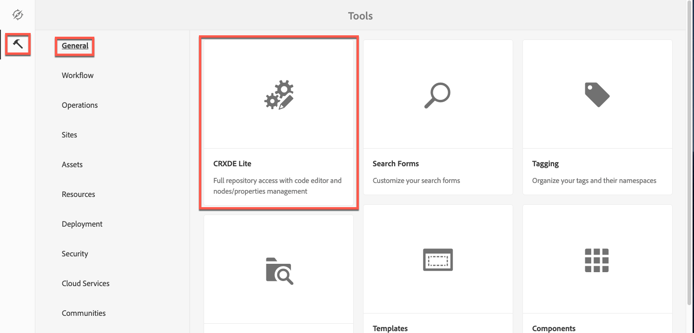

# Configuração do modo Dynamic Media - Scene7{#configuring-dynamic-media-scene-mode}

Se você usar o Adobe Experience Manager configurado para ambientes diferentes, como desenvolvimento, armazenamento temporário e produção, configure os Dynamic Media Cloud Services para cada um desses ambientes.

## Diagrama de arquitetura do Dynamic Media - Modo Scene7 {#architecture-diagram-of-dynamic-media-scene-mode}

O diagrama de arquitetura a seguir descreve como o modo Dynamic Media - Scene7 funciona.

Com a nova arquitetura, o Experience Manager é responsável pelos ativos e sincronizações de origem primária com o Dynamic Media para processamento e publicação de ativos:

1. Quando o ativo de origem principal é carregado no Experience Manager, ele é replicado no Dynamic Media. Nesse momento, o Dynamic Media lida com todo o processamento de ativos e a geração de representação, como a codificação de vídeo e as variantes dinâmicas de uma imagem. <!-- (In Dynamic Media - Scene7 mode, be aware that you can only upload assets whose file sizes are 2 GB or less.) Jira ticket CQ-4286561 fixed this issue. DM-S7 NOW SUPPORTS THE UPLOAD OF ASSETS LARGER THAN 2 GB. -->
1. Depois que as renderizações são geradas, o Experience Manager pode acessar com segurança e visualizar as renderizações remotas do Dynamic Media (nenhum binário é enviado de volta para a instância do Experience Manager).
1. Depois que o conteúdo estiver pronto para ser publicado e aprovado, ele aciona o serviço da Dynamic Media para enviar o conteúdo para os servidores de entrega e armazenar em cache o conteúdo na CDN (Content Delivery Network).


>[!NOTE]
>
>A lista de recursos a seguir requer o uso do CDN pronto para uso fornecido com o Adobe Experience Manager - Dynamic Media. Nenhum outro CDN personalizado é compatível com esses recursos.
>
>* [Imagem inteligente](/help/assets/imaging-faq.md)
>* [Invalidação de cache](/help/assets/invalidate-cdn-cache-dynamic-media.md)
>* [Proteção de hotlink](/help/assets/hotlink-protection.md)
>* [Entrega de conteúdo HTTP/2](/help/assets/http2.md)
>* Redirecionamento de URL no nível CDN
>* Akamai ChinaCDN (para entrega ideal na China)


## Ativação do Dynamic Media no modo Scene7 {#enabling-dynamic-media-in-scene-mode}

[As mídias dinâmicas são desativadas por padrão. ](https://www.adobe.com/solutions/web-experience-management/dynamic-media.html) Para aproveitar os recursos do Dynamic Media, você deve habilitá-lo.

>[!NOTE]
>
>Dynamic Media - O modo Scene7 é somente para a instância do autor do Experience Manager. Dessa forma, você deve configurar `runmode=dynamicmedia_scene7` na instância Experience Manager Author, *not* na instância Experience Manager Publish.

Para ativar o Dynamic Media, você deve iniciar o Experience Manager usando o modo de execução `dynamicmedia_scene7` da linha de comando inserindo o seguinte em uma janela de terminal (a porta de exemplo usada é 4502):

```shell
java -Xms4096m -Xmx4096m -Doak.queryLimitInMemory=500000 -Doak.queryLimitReads=500000 -jar cq-quickstart-6.5.0.jar -gui -r author,dynamicmedia_scene7 -p 4502
```

## (Opcional) Migração de predefinições e configurações do Dynamic Media de 6.3 para 6.5 Zero Down {#optional-migrating-dynamic-media-presets-and-configurations-from-to-zero-downtime}

A atualização do Experience Manager Dynamic Media de 6.3 para 6.4 ou 6.5 agora inclui a capacidade de zero implantações de tempo de inatividade. Para migrar todas as suas predefinições e configurações de `/etc` para `/conf` no CRXDE Lite, execute o seguinte comando curl.

>[!NOTE]
>
>Se você executar a instância do Experience Manager no modo de compatibilidade, ou seja, você tem o pacote de compatibilidade instalado, não é necessário executar esses comandos.

Para todas as atualizações, com ou sem o pacote de compatibilidade, você pode copiar as predefinições padrão e prontas para uso do visualizador que vieram originalmente com o Dynamic Media executando o seguinte comando curl do Linux®:

`curl -u admin:admin -X POST https://<server_address>:<server_port>/libs/settings/dam/dm/presets/viewer.pushviewerpresets.json`

Para migrar qualquer predefinição e configuração do visualizador personalizado que você criou de `/etc` para `/conf`, execute o seguinte comando curl do Linux®:

`curl -u admin:admin -X POST https://<server_address>:<server_port>/libs/settings/dam/dm/presets.migratedmcontent.json`

## Instalando o pacote de recursos 18912 para migração de ativos em massa {#installing-feature-pack-for-bulk-asset-migration}

A instalação do pacote de recursos 18912 é *opcional*.

O Feature pack 18912 permite assimilar ativos em massa por meio de FTP ou migrar ativos do Dynamic Media - Modo híbrido ou Dynamic Media Classic para o Dynamic Media - modo Scene7 no Experience Manager. Está disponível em [Adobe Professional Services](https://www.adobe.com/experience-cloud/consulting-services.html).

Consulte [Instalando o feature pack 18912 para migração de ativos em massa](/help/assets/bulk-ingest-migrate.md) para obter mais informações.

## Criação de uma configuração do Dynamic Media no Cloud Services {#configuring-dynamic-media-cloud-services}

**Antes de configurar o Dynamic Media** : depois de receber seu email de provisionamento com credenciais do Dynamic Media, você deve abrir o aplicativo [ de desktop do ](https://experienceleague.adobe.com/docs/dynamic-media-classic/using/getting-started/signing-out.html#getting-started)Dynamic Media Classic e fazer logon em sua conta para alterar a senha. A senha fornecida no email de provisionamento é gerada pelo sistema e deve ser apenas uma senha temporária. É importante atualizar a senha para que o Dynamic Media Cloud Service seja configurado com as credenciais corretas.


**Para criar uma configuração do Dynamic Media no Cloud Services**

1. No Experience Manager, toque no logotipo do Experience Manager para acessar o console de navegação global e toque no ícone Ferramentas e, em seguida, toque em **[!UICONTROL Cloud Services > Configuração do Dynamic Media]**.
1. Na página Navegador de configuração do Dynamic Media, no painel à esquerda, toque em **[!UICONTROL global]** (não toque ou selecione o ícone de pasta à esquerda de **[!UICONTROL global]**) e, em seguida, toque em **[!UICONTROL Criar]**.
1. Na página **[!UICONTROL Criar configuração do Dynamic Media]**, insira um título, o endereço de email da conta do Dynamic Media, a senha e selecione sua região. Essas informações são fornecidas pelo Adobe no email de provisionamento. Entre em contato com o Atendimento ao cliente do Adobe se não tiver recebido o email.

   Toque em **[!UICONTROL Conectar-se ao Dynamic Media]**.

   >[!NOTE]
   Depois de receber seu email de provisionamento com credenciais do Dynamic Media, abra o [aplicativo de desktop do Dynamic Media Classic](https://experienceleague.adobe.com/docs/dynamic-media-classic/using/getting-started/signing-out.html#getting-started) e faça logon em sua conta para alterar sua senha. A senha fornecida no email de provisionamento é gerada pelo sistema e deve ser apenas uma senha temporária. É importante atualizar a senha para que o Cloud Service Dynamic Media seja configurado com as credenciais corretas.

1. Quando a conexão for bem-sucedida, defina o seguinte. São necessários títulos com um asterisco (*):

   * **[!UICONTROL Empresa]**  - o nome da conta do Dynamic Media. Você tem várias contas Dynamic Media. Por exemplo, você pode ter diferentes submarcas, divisões, preparo ou ambientes de produção.

   * **[!UICONTROL Caminho da pasta raiz da empresa]**

   * **[!UICONTROL Publicação de ativos]**  - você pode escolher entre as três opções a seguir:
      * **** Imediatamente significa que, quando os ativos são carregados, o sistema assimila os ativos e fornece o URL/Incorporado instantaneamente. Não há necessidade de intervenção do usuário para publicar ativos.
      * **[!UICONTROL Após a]** ativação, significa que você deve publicar explicitamente o ativo primeiro antes que um link de URL/Incorporar seja fornecido.<br><!-- CQDOC-17478, Added March 9, 2021-->A partir do Experience Manager 6.5.8, a instância de publicação do Experience Manager reflete valores precisos de metadados de Dynamic Media, como  `dam:scene7Domain` e  `dam:scene7FileStatus` no modo de publicação  **[!UICONTROL Após]** ativação somente. Para ativar essa funcionalidade, instale o Service Pack 8 e, em seguida, reinicie o Experience Manager. Vá para o Sling Config Manager. Encontre a configuração para `Scene7ActivationJobConsumer Component` ou crie uma nova). Marque a caixa de seleção **[!UICONTROL Replicar metadados após a publicação do Dynamic Media]** e toque em **[!UICONTROL Salvar]**.

         

      * **** Publicação seletivaEssa opção permite controlar quais pastas são publicadas no Dynamic Media. Ele permite usar recursos como Recorte inteligente ou representações dinâmicas, ou determinar quais pastas são publicadas exclusivamente no Experience Manager para visualização. Esses mesmos ativos são *e não* publicados no Dynamic Media para entrega no domínio público.<br>Você pode definir essa opção aqui na  **[!UICONTROL Dynamic Media Cloud]** Configurationou, se preferir, você pode optar por definir essa opção no nível da pasta, em  **[!UICONTROL Propriedades]** de uma pasta.<br>Consulte [Trabalho com publicação seletiva no Dynamic Media.](/help/assets/selective-publishing.md)<br>Se posteriormente alterar essa configuração ou alterá-la no nível da pasta, essas alterações afetarão somente os novos ativos que você carregar a partir desse ponto. O estado de publicação dos ativos existentes na pasta permanece como está até que você os altere manualmente da caixa de diálogo **[!UICONTROL Publicação rápida]** ou **[!UICONTROL Gerenciar publicação]**.
   * **[!UICONTROL Servidor de visualização segura]**  - permite especificar o caminho do URL para o servidor de visualização de representações seguras. Ou seja, depois que as renderizações são geradas, o Experience Manager pode acessar com segurança e visualizar as renderizações remotas do Dynamic Media (nenhum binário é enviado de volta à instância do Experience Manager).
A menos que você tenha um acordo especial para usar o servidor da sua empresa ou um servidor especial, o Adobe recomenda deixar essa configuração como especificado.

   * **[!UICONTROL Sincronizar todo o conteúdo]**  -  <!-- NEW OPTION, CQDOC-15371, Added March 4, 2020-->Selecionado por padrão. Desmarque essa opção se desejar incluir ou excluir seletivamente ativos da sincronização com o Dynamic Media. Desmarcar essa opção permite escolher entre os dois modos de sincronização Dynamic Media a seguir:

   * **[!UICONTROL Modo de sincronização do Dynamic Media]**
      * **[!UICONTROL Ativado por padrão]**  - A configuração é aplicada a todas as pastas por padrão, a menos que você marque uma pasta especificamente para exclusão.  <!-- you can then deselect the folders that you do not want the configuration applied to.-->
      * **[!UICONTROL Desativado por padrão]**  - A configuração não é aplicada a nenhuma pasta até que você marque explicitamente uma pasta selecionada para sincronização com o Dynamic Media.
Para marcar uma pasta selecionada para sincronização com o Dynamic Media, selecione uma pasta de ativos e, na barra de ferramentas, toque em **[!UICONTROL Propriedades]**. Na guia **[!UICONTROL Details]**, na lista suspensa **[!UICONTROL Dynamic Media sync mode]**, escolha entre as três opções a seguir. Quando terminar, toque em **[!UICONTROL Salvar]**. *Lembre-se: essas três opções não estarão disponíveis se você tiver selecionado **Sincronizar todo o**conteúdo anteriormente.* Consulte também  [Trabalhar com publicação seletiva no nível da pasta no Dynamic Media.](/help/assets/selective-publishing.md)
         * **[!UICONTROL Herdado]**  - Nenhum valor de sincronização explícito na pasta; em vez disso, a pasta herda o valor de sincronização de uma de suas pastas ancestrais ou o modo padrão na configuração da nuvem. O status detalhado de herdado é exibido por meio de uma dica de ferramenta.
         * **[!UICONTROL Ativar para subpastas]**  - Inclua tudo nesta subárvore para sincronização com o Dynamic Media. As configurações específicas da pasta substituem o modo padrão na configuração da nuvem.
         * **[!UICONTROL Desabilitado para subpastas]**  - Exclua tudo nesta subárvore da sincronização com o Dynamic Media.

   >[!NOTE]
   Não há suporte para o controle de versão no DMS7. Além disso, a ativação atrasada se aplica somente se **[!UICONTROL Publicar ativos]** na página Editar configuração do Dynamic Media estiver definida como **[!UICONTROL Na ativação]** e, em seguida, somente até a primeira vez que o ativo for ativado.
   Depois que um ativo é ativado, todas as atualizações são publicadas imediatamente no S7 Delivery.

1. Toque em **[!UICONTROL Salvar]**.
1. Para visualizar com segurança o conteúdo do Dynamic Media antes de ele ser publicado, é necessário &quot;lista de permissões&quot; a instância do autor do Experience Manager para se conectar ao Dynamic Media:

   * Abra o [aplicativo de desktop do Dynamic Media Classic](https://experienceleague.adobe.com/docs/dynamic-media-classic/using/getting-started/signing-out.html#getting-started) e faça logon em sua conta. Suas credenciais e detalhes de logon foram fornecidos pelo Adobe no momento do provisionamento. Caso não tenha essas informações, entre em contato com o Suporte Técnico.

   * Na barra de navegação próxima à parte superior direita da página, toque em **[!UICONTROL Configuração > Configuração do aplicativo > Configuração de publicação > Servidor de imagem]**.

   * Na página Publicação do servidor de imagens, na lista suspensa Publicar contexto , selecione **[!UICONTROL Servir imagem de teste]**.
   * Para o Filtro de endereço do cliente, toque em **[!UICONTROL Adicionar]**.
   * Para ativar (ativar) o endereço, marque a caixa de seleção . Insira o endereço IP da instância Experience Manager Author (não o IP do Dispatcher).
   * Toque em **[!UICONTROL Salvar]**.

Agora você terminou com a configuração básica; você está pronto para usar o modo Dynamic Media - Scene7.

Se você quiser personalizar ainda mais sua configuração, poderá, opcionalmente, concluir qualquer uma das tarefas em [(Opcional) Configuração das configurações avançadas no Dynamic Media - Modo Scene7](#optional-configuring-advanced-settings-in-dynamic-media-scene-mode).

## (Opcional) Definição das configurações avançadas no Dynamic Media - Modo Scene7 {#optional-configuring-advanced-settings-in-dynamic-media-scene-mode}

Se quiser personalizar ainda mais a configuração e configuração do Dynamic Media - modo Scene7 ou otimizar seu desempenho, poderá concluir uma ou mais das seguintes tarefas *opcionais*:

* [(Opcional) Configuração e configuração do Dynamic Media - Configurações do modo Scene7](#optional-setup-and-configuration-of-dynamic-media-scene7-mode-settings)

* [(Opcional) Ajuste do desempenho do Dynamic Media - Modo Scene7](#optional-tuning-the-performance-of-dynamic-media-scene-mode)

* [(Opcional) Filtrar ativos para replicação](#optional-filtering-assets-for-replication)

### (Opcional) Configuração e configuração do Dynamic Media - Configurações do modo Scene7 {#optional-setup-and-configuration-of-dynamic-media-scene7-mode-settings}

Quando estiver no modo de execução `dynamicmedia_scene7`, use a interface do usuário do Dynamic Media Classic para alterar as configurações do Dynamic Media.

Algumas das tarefas acima exigem que você abra o [aplicativo de desktop do Dynamic Media Classic](https://experienceleague.adobe.com/docs/dynamic-media-classic/using/getting-started/signing-out.html#getting-started) e faça logon em sua conta.

As tarefas de configuração e configuração incluem:

* [Configuração de publicação para o servidor de imagem](#publishing-setup-for-image-server)
* [Definição das configurações gerais do aplicativo](#configuring-application-general-settings)
* [Configuração do gerenciamento de cores](#configuring-color-management)
* [Edição de tipos MIME para formatos compatíveis](#editing-mime-types-for-supported-formats)
* [Adição de tipos MIME para formatos não suportados](#adding-mime-types-for-unsupported-formats)
* [Criando predefinições de conjuntos de lotes para gerar automaticamente Conjuntos de imagens e Conjuntos de rotação](#creating-batch-set-presets-to-auto-generate-image-sets-and-spin-sets)

#### Configuração de publicação para o Servidor de imagem {#publishing-setup-for-image-server}

As configurações de Configuração de publicação determinam como os ativos são entregues por padrão no Dynamic Media. Se nenhuma configuração for especificada, o Dynamic Media fornece um ativo de acordo com as configurações padrão definidas na Configuração de publicação. Por exemplo, uma solicitação para fornecer uma imagem que não inclua um atributo de resolução gera uma imagem com a configuração Resolução de objeto padrão .

Para configurar a Configuração de publicação: no Dynamic Media Classic, toque em **[!UICONTROL Configuração > Configuração do aplicativo > Configuração de publicação > Servidor de imagem]**.

A tela Servidor de imagens estabelece as configurações padrão para entrega de imagens. Consulte a tela da interface do usuário para obter uma descrição de cada configuração.

* **[!UICONTROL Atributos de solicitação]**  - essas configurações impõem limites às imagens que podem ser entregues a partir do servidor.
* **[!UICONTROL Atributos de solicitação padrão]**  - Essas configurações pertencem à aparência padrão das imagens.
* **[!UICONTROL Atributos de miniatura comuns]**  - Essas configurações pertencem à aparência padrão das imagens em miniatura.
* **[!UICONTROL Padrões para campos de catálogo]** - Essas configurações pertencem à resolução e ao tipo de miniatura padrão de imagens.
* **[!UICONTROL Atributos de gerenciamento de cores]**  - Essas configurações determinam quais perfis de cores ICC são usados.
* **[!UICONTROL Atributos de compatibilidade]**  - Essa configuração permite que parágrafos anteriores e posteriores em camadas de texto sejam tratados como na versão 3.6 para compatibilidade com versões anteriores.
* **[!UICONTROL Suporte à localização]**  - Essas configurações permitem gerenciar vários atributos de localidade. Ela também permite especificar uma sequência de mapa de localidade para que você possa definir quais idiomas deseja suportar para as várias dicas de ferramentas em Visualizadores. Para obter mais informações sobre como configurar o **[Suporte de localização]**, consulte [Considerações ao configurar a localização de ativos](https://help.adobe.com/en_US/scene7/using/WS997f1dc4cb0179f034e07dc31412799d19a-8000.html).

#### Definição das configurações gerais do aplicativo {#configuring-application-general-settings}

Para abrir a página Configurações gerais do aplicativo , na barra Navegação global do Dynamic Media Classic, toque em **[!UICONTROL Configuração > Configuração do aplicativo > Configurações gerais]**.

**[!UICONTROL Servidores]**  - No provisionamento da conta, a Dynamic Media fornece automaticamente os servidores atribuídos à sua empresa. Esses servidores são usados para criar strings de URL para seu site e aplicativos. Essas chamadas de URL são específicas da sua conta do . Não altere nenhum nome de servidor a menos que seja explicitamente instruído a fazê-lo pelo Atendimento ao Cliente do Adobe.

**[!UICONTROL Substituir imagens]**  - o Dynamic Media não permite que dois arquivos tenham o mesmo nome. A ID de URL de cada item (o nome do arquivo menos a extensão) deve ser exclusiva. Essas opções especificam como os ativos de substituição são carregados: se substituem o original ou se tornam duplicatas. Os ativos duplicados são renomeados com um &quot;-1&quot; (por exemplo, chair.tif é renomeado chair-1.tif). Essas opções afetam ativos carregados em uma pasta diferente do original ou ativos com uma extensão de nome de arquivo diferente do original (como JPG, TIF ou PNG).

* **[!UICONTROL Substituir na pasta atual, mesmo nome/extensão de imagem base]**  - Essa opção é a regra mais estrita para substituição. Ela requer que você carregue a imagem de substituição na mesma pasta do original e que a imagem de substituição tenha a mesma extensão de nome de arquivo do original. Se esses requisitos não forem atendidos, uma duplicata será criada.

>[!NOTE]
Para manter a consistência com o Experience Manager, sempre escolha essa configuração: **Substituir na pasta atual, mesmo nome/extensão de imagem base**

* **[!UICONTROL Substituir em qualquer pasta, mesmo nome/extensão do ativo base]**  - Requer que a imagem de substituição tenha a mesma extensão de nome de arquivo que a imagem original (por exemplo, chair.jpg deve substituir chair.jpg, não chair.tif). No entanto, é possível fazer upload da imagem de substituição para uma pasta diferente da original. A imagem atualizada reside na nova pasta; o arquivo não pode mais ser encontrado em seu local original
* **[!UICONTROL Substituir em qualquer pasta, o mesmo nome do ativo base independentemente da extensão]**  - Essa opção é a regra de substituição mais inclusiva. Você pode fazer upload de uma imagem de substituição para uma pasta diferente do original, fazer upload de um arquivo com uma extensão de nome de arquivo diferente e substituir o arquivo original. Se o arquivo original estiver em uma pasta diferente, a imagem de substituição residirá na nova pasta para a qual foi carregada.

**[!UICONTROL Perfis de cores padrão]**  - Consulte  [Configuração do ](#configuring-color-management) gerenciamento de cores para obter mais informações.

>[!NOTE]
Por padrão, o sistema mostra 15 execuções ao selecionar **[!UICONTROL Representações]** e 15 predefinições do visualizador ao selecionar **[!UICONTROL Visualizadores]** na exibição detalhada do ativo. Você pode aumentar esse limite. Consulte [Aumentar o número de predefinições de imagens que exibem](/help/assets/managing-image-presets.md#increasing-or-decreasing-the-number-of-image-presets-that-display) ou [Aumentar o número de predefinições do visualizador que exibem](/help/assets/managing-viewer-presets.md#increasing-the-number-of-viewer-presets-that-display).


#### Configuração do gerenciamento de cores {#configuring-color-management}

O gerenciamento dinâmico de cores da mídia permite que você corrija os ativos. Com a correção de cores, os ativos assimilados retêm seu espaço de cores (RGB, CMYK, Cinza) e o perfil de cores incorporado. Quando você solicita uma representação dinâmica, a cor da imagem é corrigida no espaço de cores de destino usando saída CMYK, RGB ou Cinza. Consulte [Configuração de predefinições de imagem](/help/assets/managing-image-presets.md).

Para configurar as propriedades de cores padrão, a correção de cores é ativada quando as imagens são solicitadas:

1. Abra o [aplicativo de desktop do Dynamic Media Classic](https://experienceleague.adobe.com/docs/dynamic-media-classic/using/getting-started/signing-out.html#getting-started) e faça logon em sua conta usando as credenciais fornecidas durante o provisionamento.
1. Navegue até **[!UICONTROL Configurar > Configuração do Aplicativo]**.
1. Expanda a área **[!UICONTROL Publicar configuração]** e selecione **[!UICONTROL Servidor de imagens]**. Defina **[!UICONTROL Publicar contexto]** como **[!UICONTROL Serviço de imagem]** ao definir padrões para instâncias de publicação.
1. Role até a propriedade que deseja alterar. Por exemplo, uma propriedade na área **[!UICONTROL Atributos de gerenciamento de cores]**.

   Você pode definir as seguintes propriedades de correção de cores:

   * **[!UICONTROL Espaço]**  de cores padrão CMYK - Nome do perfil de cores CMYK padrão
   * **[!UICONTROL Espaço]**  de cor padrão em escala de cinza - Nome do perfil de cor cinza padrão
   * **[!UICONTROL Espaço]**  de cores padrão RGB - Nome do perfil de cores RGB padrão
   * **[!UICONTROL Propósito de renderização da conversão de cor]**  - Especifica o propósito de renderização. Os valores aceitáveis são: **[!UICONTROL perceptual]**, **[!UICONTROL calorimetria relativa]**, **[!UICONTROL saturação]**, **[!UICONTROL calorimetria absoluta]**. O Adobe recomenda **[!UICONTROL relative]** como padrão.

1. Toque em **[!UICONTROL Salvar]**.

Por exemplo, você pode definir o **[!UICONTROL Espaço de cor padrão RGB]** como *sRGB* e o **[!UICONTROL Espaço de cor padrão CMYK]** como *WebCoated*.

Isso faria o seguinte:

* Permite a correção de cores para imagens RGB e CMYK.
* Imagens RGB que não têm um perfil de cor são consideradas como estando no espaço de cores *sRGB*.
* Imagens CMYK que não têm um perfil de cor são consideradas como estando no espaço de cores *WebCoated*.
* As representações dinâmicas que retornam a saída RGB, retornam no espaço de cores *sRGB*.
* As representações dinâmicas que retornam saída CMYK, retornam no espaço de cores *WebCoated*.

#### Editar tipos MIME para formatos compatíveis {#editing-mime-types-for-supported-formats}

Você pode definir quais tipos de ativos são processados pelo Dynamic Media e personalizar parâmetros avançados de processamento de ativos. Por exemplo, você pode especificar parâmetros de processamento de ativos para fazer o seguinte:

* Converter um Adobe PDF em um ativo de eCatalog.
* Converta um documento do Adobe Photoshop (.PSD) em um ativo de modelo de banner para personalização.
* Rasterize um arquivo Adobe Illustrator (.AI) ou um arquivo Adobe Photoshop Encapsulated PostScript® (.EPS).
* [É possível usar ](/help/assets/video-profiles.md) Perfis de vídeo e  [Perfis ](/help/assets/image-profiles.md) de imagem para definir o processamento de vídeos e imagens, respectivamente.

Consulte [Upload de ativos](/help/assets/manage-assets.md#uploading-assets).

**Para editar tipos MIME para formatos compatíveis:**

1. No Experience Manager, toque no logotipo do Experience Manager para acessar o console de navegação global e toque em **[!UICONTROL Ferramentas > Geral > CRXDE Lite]**.
1. No painel à esquerda, navegue até o seguinte:

   `/conf/global/settings/cloudconfigs/dmscene7/jcr:content/mimeTypes`

   

1. Na pasta mimeTypes , selecione um tipo MIME.
1. No lado direito da página CRXDE Lite, na parte inferior:

   * clique duas vezes no campo **[!UICONTROL enabled]**. Por padrão, todos os tipos mime de ativos são ativados (definidos como **[!UICONTROL true]**), o que significa que os ativos são sincronizados com a Dynamic Media para processamento. Se desejar excluir esse tipo MIME de ativo do processamento, altere essa configuração para **[!UICONTROL false]**.

   * toque duas vezes em **[!UICONTROL jobParam]** para abrir seu campo de texto associado. Consulte [Tipos Mime Suportados](/help/assets/assets-formats.md#supported-mime-types) para obter uma lista de valores de parâmetros de processamento permitidos que você pode usar para um determinado tipo mime.

1. Faça uma das seguintes opções:

   * Repita as etapas 3 a 4 para editar mais tipos MIME.
   * Na barra de menu da página CRXDE Lite, toque em **[!UICONTROL Salvar tudo]**.

1. No canto superior esquerdo da página, toque em **[!UICONTROL CRXDE Lite]** para retornar ao Experience Manager.

#### Adicionar tipos MIME para formatos não suportados {#adding-mime-types-for-unsupported-formats}

Você pode adicionar tipos MIME personalizados para formatos não compatíveis no Experience Manager Assets. Certifique-se de que qualquer novo nó adicionado no CRXDE Lite não seja excluído pelo Experience Manager movendo o tipo MIME antes de `image_`. Além disso, verifique se o valor ativado está definido como **[!UICONTROL false]**.

**Para adicionar tipos MIME para formatos não suportados:**

1. No Experience Manager, toque em **[!UICONTROL Ferramentas > Operações > Console da Web]**.

   

1. Uma nova guia do navegador é aberta para a página **[!UICONTROL Configuração do console da Web do Adobe Experience Manager]**.

   

1. Na página, role para baixo até o nome *Adobe CQ Scene7 Asset MIME type Service*, como visto na seguinte captura de tela. À direita do nome, toque em **[!UICONTROL Editar os valores]** de configuração (ícone de lápis).

   

1. Na página **Adobe CQ Scene7 Asset MIME type Service**, toque em qualquer ícone de sinal de mais &lt;+>. O local na tabela onde você toca no sinal de mais para adicionar o novo tipo MIME é trivial.

   

1. Digite `DWG=image/vnd.dwg` no campo de texto vazio que acabou de adicionar.

   O exemplo `DWG=image/vnd.dwg` é somente para fins ilustrativos. O tipo MIME adicionado aqui pode ser qualquer outro formato não suportado.

   

1. No canto inferior direito da página, toque em **[!UICONTROL Salvar]**.

   Nesse ponto, você pode fechar a guia do navegador que tem a página de Configuração do Console da Web do Adobe Experience Manager aberta.

1. Retorne à guia do navegador que tem seu console de Experience Manager aberto.
1. No Experience Manager, toque em **[!UICONTROL Ferramentas > Geral > CRXDE Lite]**.

   

1. No painel à esquerda, navegue até o seguinte:

   `conf/global/settings/cloudconfigs/dmscene7/jcr:content/mimeTypes`

1. Arraste o tipo MIME `image_vnd.dwg` e solte-o diretamente acima de `image_` na árvore, como visto na seguinte captura de tela.

   

1. Com o tipo MIME `image_vnd.dwg` ainda selecionado, na guia **[!UICONTROL Propriedades]**, na linha **[!UICONTROL ativada]**, no cabeçalho da coluna **[!UICONTROL Valor]**, toque duas vezes no valor para abrir a lista suspensa **[!UICONTROL Valor]**.
1. Digite `false` no campo (ou selecione **[!UICONTROL false]** na lista suspensa).

   

1. Próximo ao canto superior esquerdo da página do CRXDE Lite, toque em **[!UICONTROL Salvar tudo]**.

#### Criando predefinições de conjuntos de lotes para gerar automaticamente Conjuntos de imagens e Conjuntos de rotação {#creating-batch-set-presets-to-auto-generate-image-sets-and-spin-sets}

Use predefinições de conjuntos em lotes para automatizar a criação de conjuntos de imagens ou conjuntos de rotação enquanto os ativos são carregados no Dynamic Media.

Primeiro, defina a convenção de nomenclatura para como os ativos são agrupados em um conjunto. Em seguida, crie uma predefinição de conjunto de lotes que seja um conjunto de instruções autocontido e com nome exclusivo. Ele deve definir como construir o conjunto usando imagens que correspondam às convenções de nomenclatura definidas na receita predefinida.

Ao carregar arquivos, o Dynamic Media cria automaticamente um conjunto com todos os arquivos que correspondem à convenção de nomenclatura definida nas predefinições ativas.

**Configuração da nomenclatura padrão**

Crie uma convenção de nomenclatura padrão que seja usada em qualquer fórmula predefinida de conjunto de lotes. A convenção de nomenclatura padrão selecionada na definição predefinida do conjunto de lotes provavelmente é tudo o que é necessário para a empresa gerar conjuntos em lote. Uma predefinição de conjunto de lotes é criada para usar a convenção de nomenclatura padrão que você define. Você pode criar quantas predefinições do Conjunto de Lotes tiverem as convenções de nomenclatura alternativas e personalizadas necessárias para um conjunto específico de conteúdo, em casos em que há uma exceção na nomenclatura padrão definida pela empresa.

Embora a configuração de uma convenção de nomenclatura padrão não seja necessária para usar a funcionalidade predefinida do conjunto de lotes, a prática recomendada é usar a convenção de nomenclatura padrão. Ele permite definir quantos elementos de sua convenção de nomenclatura você deseja agrupar em um conjunto, para que seja possível simplificar a criação do conjunto de lotes.

Como alternativa, você pode usar **[!UICONTROL Exibir código]** sem campos de formulário disponíveis. Nesta visualização, você cria suas definições de convenção de nomenclatura totalmente usando expressões regulares.

Dois elementos estão disponíveis para definição, Correspondência e Nome de base. Esses campos permitem definir todos os elementos de uma convenção de nomenclatura e identificar a parte da convenção usada para nomear o conjunto no qual eles estão contidos. A convenção de nomenclatura individual de uma empresa geralmente usa uma ou mais linhas de definição para cada um desses elementos. Você pode usar quantas linhas para sua definição exclusiva e agrupá-las em elementos distintos, como para Imagem principal, Elemento de cor, Elemento de exibição alternativo e Elemento de amostra.

**Para configurar a nomenclatura padrão:**

1. Abra o [aplicativo de desktop do Dynamic Media Classic](https://experienceleague.adobe.com/docs/dynamic-media-classic/using/getting-started/signing-out.html#getting-started) e faça logon em sua conta.

   Suas credenciais e detalhes de logon foram fornecidos pelo Adobe no momento do provisionamento. Caso não tenha essas informações, entre em contato com o Suporte Técnico.

1. Na barra de navegação próxima à parte superior da página, toque em **[!UICONTROL Configuração > Configuração do aplicativo > Predefinições do conjunto de lotes > Nomeação padrão]**.
1. Selecione **[!UICONTROL Exibir formulário]** ou **[!UICONTROL Exibir código]** para especificar como deseja exibir e inserir informações sobre cada elemento.

   Você pode marcar a caixa de seleção **[!UICONTROL Exibir código]** para exibir o valor da expressão regular criado ao lado das seleções de formulário. É possível inserir ou alterar esses valores para ajudar a definir os elementos da convenção de nomenclatura, se a exibição do formulário limitar você por qualquer motivo. Se os valores não puderem ser analisados na visualização do formulário, os campos do formulário ficarão inativos.

   >[!NOTE]
   Campos de formulário desativados não executam nenhuma validação para confirmar se as expressões regulares estão corretas. Você verá os resultados da expressão regular que está criando para cada elemento após a linha Resultado. A expressão regular completa é visível na parte inferior da página.

1. Expanda cada elemento conforme necessário e insira as convenções de nomenclatura que deseja usar.
1. Conforme necessário, execute um dos seguintes procedimentos:

   * Toque em **[!UICONTROL Adicionar]** para adicionar outra convenção de nomenclatura para um elemento.
   * Toque em **[!UICONTROL Remover]** para excluir uma convenção de nomenclatura para um elemento.

1. Faça uma das seguintes opções:

   * Toque em **[!UICONTROL Salvar como]** e digite um nome para a predefinição.
   * Toque em **[!UICONTROL Salvar]** se estiver editando uma predefinição existente.

**Criando uma predefinição de conjunto de lotes**

O Dynamic Media usa predefinições de conjuntos em lotes para organizar ativos em conjuntos de imagens (imagens alternativas, opções de cores, rotação 360) para exibição em visualizadores. As predefinições do conjunto de lotes são executadas automaticamente com os processos de upload de ativos no Dynamic Media.

Você pode criar, editar e gerenciar as predefinições do conjunto de lotes. Existem duas formas de definições predefinidas de conjunto de lotes: um para uma convenção de nomenclatura padrão que você pode configurar e um para convenções de nomenclatura personalizadas que você cria em tempo real.

Você pode usar o método de campo de formulário para definir uma predefinição de conjunto de lotes ou o método de código, que permite usar expressões regulares. Como em Nomenclatura padrão, você pode escolher Exibir código ao mesmo tempo em que está definindo na Exibição do formulário e usar expressões regulares para criar suas definições. Como alternativa, você pode desmarcar qualquer exibição para usar uma ou a outra exclusivamente.

**Para criar uma predefinição de conjunto de lotes:**

1. Abra o [aplicativo de desktop do Dynamic Media Classic](https://experienceleague.adobe.com/docs/dynamic-media-classic/using/getting-started/signing-out.html#getting-started) e faça logon em sua conta.

   Suas credenciais e detalhes de logon foram fornecidos pelo Adobe no momento do provisionamento. Caso não tenha essas informações, entre em contato com o Suporte Técnico.

1. Na barra de navegação próxima à parte superior da página, toque em **[!UICONTROL Configuração > Configuração do aplicativo > Predefinições do conjunto de lotes > Predefinição do conjunto de lotes]**.

   **[!UICONTROL Exibir formulário]**, conforme definido no canto superior direito da página Detalhes, é a exibição padrão.

1. No painel Lista de predefinições , toque em **[!UICONTROL Adicionar]** para ativar os campos de definição no painel Detalhes no lado direito da tela.
1. No painel Detalhes, no campo Nome da predefinição , digite um nome para a predefinição.
1. No menu suspenso Tipo de conjunto de lote, selecione um tipo predefinido.
1. Faça uma das seguintes opções:

   * Se você estiver usando uma convenção de nomenclatura padrão configurada anteriormente em **[!UICONTROL Configuração do aplicativo > Predefinições do conjunto de lotes > Nomeação padrão]**, expanda **[!UICONTROL Convenções de nomenclatura de ativos]** e, na lista suspensa Nomeação de arquivos, toque em **[!UICONTROL Padrão]**.

   * Para definir uma nova convenção de nomenclatura conforme configura a predefinição, expanda **[!UICONTROL Convenções de nomenclatura de ativos]** e, na lista suspensa Nomenclatura de arquivos, toque em **[!UICONTROL Personalizado]**.

1. Para Ordem de sequência, defina a ordem na qual as imagens são exibidas após o conjunto ser agrupado em Dynamic Media.

   Por padrão, os ativos são classificados alfanumérico. No entanto, é possível usar uma lista separada por vírgulas de expressões regulares para definir a ordem.

1. Para Definir a Convenção de Nomenclatura e Criação, especifique o sufixo ou prefixo do nome básico definido na Convenção de Nomenclatura de Ativos. Além disso, defina onde o conjunto é criado na estrutura de pastas do Dynamic Media.

   Se você definir grandes números de conjuntos, mantenha os conjuntos separados das pastas que contêm os próprios ativos. Por exemplo, crie uma pasta Conjuntos de imagens e coloque os conjuntos gerados aqui.

1. No painel Detalhes, toque em **[!UICONTROL Salvar]**.
1. Toque em **[!UICONTROL Ativo]** ao lado do novo nome predefinido.

   Ativar a predefinição garante que, ao fazer upload de ativos no Dynamic Media, a predefinição do conjunto de lotes seja aplicada para gerar o conjunto.

**Criação de uma predefinição de conjunto de lotes para a geração automática de um conjunto de rotação 2D**

Você pode usar o Tipo de Conjunto de Lotes **[!UICONTROL Conjunto de Rotação de Vários Eixos]** para criar uma fórmula que automatiza a geração de Conjuntos de Rotação 2D. O agrupamento de imagens usa expressões regulares de Linha e Coluna para que os ativos de imagem sejam alinhados corretamente no local correspondente na matriz multidimensional. Não há um número mínimo ou máximo de linhas ou colunas que você deve ter em um conjunto de rotação de vários eixos.

Como exemplo, suponha que você queira criar um conjunto de rotação de vários eixos chamado `spin-2dspin`. Você tem um conjunto de imagens de conjunto de rotação que contém três linhas, com 12 imagens por linha. As imagens são nomeadas da seguinte maneira:

```
spin-01-01
 spin-01-02
 …
 spin-01-12
 spin-02-01
 …
 spin-03-12
```

Com essas informações, a fórmula Tipo de conjunto de lotes pode ser criada da seguinte maneira:


O agrupamento para a parte do nome do ativo compartilhado do conjunto de rotação é adicionado ao campo **Match** (como destacado). A parte variável do nome do ativo que contém a linha e a coluna é adicionada aos campos **Linha** e **Coluna**, respectivamente.

Quando o Conjunto de rotação é carregado e publicado, você ativaria o nome da fórmula do Conjunto de rotação 2D que está listada em **Predefinições de conjunto de lote** na caixa de diálogo **Opções de trabalho de upload**.

**Para criar uma predefinição de conjunto de lotes para a geração automática de um conjunto de rotação 2D:**

1. Abra o [aplicativo de desktop do Dynamic Media Classic](https://experienceleague.adobe.com/docs/dynamic-media-classic/using/getting-started/signing-out.html#getting-started) e faça logon em sua conta.

   Suas credenciais e detalhes de logon foram fornecidos pelo Adobe no momento do provisionamento. Caso não tenha essas informações, entre em contato com o Suporte Técnico.

1. Na barra de navegação próxima à parte superior da página, toque em **[!UICONTROL Configurar] > [!UICONTROL Configuração do aplicativo] > [!UICONTROL Predefinições do conjunto de lotes] > [!UICONTROL Predefinição do conjunto de lotes]**.

   **[!UICONTROL Exibir formulário]**, conforme definido no canto superior direito da página Detalhes, é a exibição padrão.

1. No painel Lista de predefinições , toque em **[!UICONTROL Adicionar]** para ativar os campos de definição no painel Detalhes no lado direito da tela.
1. No painel Detalhes, no campo Nome da predefinição , digite um nome para a predefinição.
1. No menu suspenso Tipo de conjunto de lote, selecione **[!UICONTROL Conjunto de ativos]**.
1. Na lista suspensa Subtipo , selecione **[!UICONTROL Conjunto de rotação de vários eixos]**.
1. Expanda **[!UICONTROL Convenções de nomenclatura de ativos]** e, na lista suspensa Nomenclatura de arquivos, toque em **[!UICONTROL Personalizado]**.
1. Use os atributos **[!UICONTROL Correspondência]** e, opcionalmente, **[!UICONTROL Nome de base]** para definir uma expressão regular para nomear ativos de imagem que compõem o agrupamento.

   Por exemplo, a expressão regular Correspondência literal pode ter a seguinte aparência:

   `(w+)-w+-w+`

1. Expanda **[!UICONTROL Posição da Coluna da Linha]** e defina o formato do nome para a posição do ativo de imagem dentro da matriz do Conjunto de rotação 2D.

   Use os parênteses para abraçar a posição da linha ou da coluna no nome do arquivo.

   Por exemplo, para a expressão regular da linha, ela pode ter a seguinte aparência:

   `\w+-R([0-9]+)-\w+`

   ou

   `\w+-(\d+)-\w+`

   Para a expressão regular da coluna, ela pode ter a seguinte aparência:

   `\w+-\w+-C([0-9]+)`

   ou

   `\w+-\w+-C(\d+)`

   As amostras acima são apenas para fins ilustrativos. Você pode criar sua expressão regular da maneira que quiser, de acordo com suas necessidades.

   >[!NOTE]
   Se a combinação de expressões regulares de linha e coluna não puder determinar a posição do ativo dentro da matriz de conjunto de rotação multidimensional, o ativo não será adicionado ao conjunto. Um erro também é registrado.

1. Para Definir a Convenção de Nomenclatura e Criação, especifique o sufixo ou prefixo do nome básico definido na Convenção de Nomenclatura de Ativos.

   Além disso, defina onde o conjunto de rotação é criado na estrutura de pastas do Dynamic Media Classic.

   Se você definir grandes números de conjuntos, mantenha os conjuntos separados das pastas que contêm os próprios ativos. Por exemplo, crie uma pasta Conjuntos de rotação para colocar conjuntos gerados aqui.

1. No painel Detalhes, toque em **[!UICONTROL Salvar]**.
1. Toque em **[!UICONTROL Ativo]** ao lado do novo nome predefinido.

   Ativar a predefinição garante que, ao fazer upload de ativos no Dynamic Media, a predefinição do conjunto de lotes seja aplicada para gerar o conjunto.

### (Opcional) Ajuste do desempenho do Dynamic Media - Modo Scene7 {#optional-tuning-the-performance-of-dynamic-media-scene-mode}

Para manter o Dynamic Media - modo Scene7 em execução sem problemas, o Adobe recomenda as seguintes dicas de ajuste de desempenho/escalabilidade de sincronização:

* Atualização dos parâmetros de Trabalho predefinidos para processamento de diferentes formatos de arquivo.
* Atualizar os encadeamentos de trabalho de fila predefinidos do fluxo de trabalho Granite (ativos de vídeo).
* Atualização dos threads de trabalho de fila predefinidos do fluxo de trabalho transitório do Granite (imagens e ativos que não são de vídeo).
* Atualização das conexões máximas de upload para o servidor do Dynamic Media Classic.

#### Atualização dos parâmetros de trabalho predefinidos para o processamento de diferentes formatos de arquivo

Você pode ajustar parâmetros de trabalho para processamento mais rápido ao carregar arquivos. Por exemplo, se você carregar arquivos PSD, mas não quiser processá-los como modelos, poderá definir a extração de camada como false (off). Nesse caso, o parâmetro de trabalho ajustado aparece da seguinte maneira: `process=None&createTemplate=false`.

Caso deseje ativar a criação do modelo, use os seguintes parâmetros: `process=MaintainLayers&layerNaming=AppendName&createTemplate=true`.

<!-- THIS PARAGRAPH WAS REPLACED WITH THE TWO PARAGRAPHS DIRECTLY ABOVE BASED ON CQDOC-17657 You can tune job parameters for faster processing when you upload files. For example, if you are uploading PSD files, but do not want to process them as templates, you can set layer extraction to false (off). In such case, the tuned job parameter would appear as `process=None&createTemplate=false`. -->

O Adobe recomenda usar os seguintes parâmetros de trabalho &quot;ajustados&quot; para arquivos PDF, PostScript® e PSD:

<!-- OLD PDF JOB PARAMETERS `pdfprocess=Rasterize&resolution=150&colorspace=Auto&pdfbrochure=false&keywords=false&links=false` -->

<!-- OLD POSTSCRIPT JOB PARAMETERS `psprocess=Rasterize&psresolution=150&pscolorspace=Auto&psalpha=false&psextractsearchwords=false&aiprocess=Rasterize&airesolution=150&aicolorspace=Auto&aialpha=false` -->

| Tipo de arquivo | Parâmetros de tarefa recomendados |
| ---| ---|
| PDF | `pdfprocess=Thumbnail&resolution=150&colorspace=Auto&pdfbrochure=false&keywords=false&links=false` |
| PostScript® | `psprocess=Rasterize&psresolution=150&pscolorspace=Auto&psalpha=false&psextractsearchwords=false&aiprocess=Thumbnail&airesolution=150&aicolorspace=Auto&aialpha=false` |
| PSD | `process=None&layerNaming=AppendName&anchor=Center&createTemplate=false&extractText=false&extendLayers=false` |

<!-- CQDOC-17657 for PSD entry in table above -->

Para atualizar qualquer um desses parâmetros, siga as etapas em [Habilitar o parâmetro de trabalho de upload do tipo MIME Assets/Dynamic Media Classic com suporte](/help/sites-administering/scene7.md#enabling-mime-type-based-assets-scene-upload-job-parameter-support).

#### Atualizar a fila do fluxo de trabalho transitório do Granite {#updating-the-granite-transient-workflow-queue}

A fila Fluxo de trabalho de trânsito do Granite é usada para o fluxo de trabalho **[!UICONTROL Ativo de atualização do DAM]**. No Dynamic Media, é usado para assimilação e processamento de imagens.

**Para atualizar a fila de fluxo de trabalho transitório do Granite:**

1. Navegue até [https://&lt;server>/system/console/configMgr](https://localhost:4502/system/console/configMgr) e procure por **Fila: Fila de Fluxo de Trabalho Transitório do Granite**.

   >[!NOTE]
   Uma pesquisa de texto é necessária em vez de um URL direto porque o PID do OSGi é gerado dinamicamente.

1. No campo **[!UICONTROL Máximo de Trabalhos Paralelos]**, altere o número para o valor desejado.

   Você pode aumentar **[!UICONTROL Máximo de trabalhos paralelos]** para suportar adequadamente o upload pesado de arquivos para o Dynamic Media. O valor exato depende da capacidade do hardware. Em determinados cenários - ou seja, uma migração inicial ou um upload em massa único - é possível usar um valor grande. Esteja ciente, no entanto, de que o uso de um valor grande (como duas vezes o número de núcleos) pode ter efeitos negativos em outras atividades simultâneas. Dessa forma, teste e ajuste o valor com base no seu caso de uso específico.

<!--    By default, the maximum number of parallel jobs depends on the number of available CPU cores. For example, on a 4-core server, it assigns 2 worker threads. (A value between 0.0 and 1.0 is ratio based, or any numbers greater than 1 will assign the number of worker threads.)

   Adobe recommends that 32 **[!UICONTROL Maximum Parallel Jobs]** be configured to adequately support heavy upload of files to Dynamic Media Classic (Scene7). -->


1. Toque em **[!UICONTROL Salvar]**.

#### Atualizar a fila do fluxo de trabalho do Granite {#updating-the-granite-workflow-queue}

A fila Fluxo de trabalho do Granite é usada para fluxos de trabalho não transitórios. No Dynamic Media, ele processava vídeo com o fluxo de trabalho **[!UICONTROL Codificação de vídeo do Dynamic Media]**.

**Para atualizar a fila do fluxo de trabalho do Granite:**

1. Navegue até `https://<server>/system/console/configMgr` e procure por **Fila: Fila de fluxo de trabalho do Granite**.

   >[!NOTE]
   Uma pesquisa de texto é necessária em vez de um URL direto porque o PID do OSGi é gerado dinamicamente.

1. No campo **[!UICONTROL Máximo de Trabalhos Paralelos]**, altere o número para o valor desejado.

   Você pode aumentar o número máximo de trabalhos paralelos para suportar adequadamente o upload pesado de arquivos para o Dynamic Media. O valor exato depende da capacidade do hardware. Em determinados cenários - ou seja, uma migração inicial ou um upload em massa único - é possível usar um valor grande. Esteja ciente, no entanto, de que o uso de um valor grande (como duas vezes o número de núcleos) pode ter efeitos negativos em outras atividades simultâneas. Dessa forma, teste e ajuste o valor com base no seu caso de uso específico.

   

1. Toque em **[!UICONTROL Salvar]**.

#### Atualização da conexão de upload do Dynamic Media Classic {#updating-the-scene-upload-connection}

A configuração Scene7 Upload Connection sincroniza ativos do Experience Manager para servidores do Dynamic Media Classic.

**Para atualizar a conexão de upload do Dynamic Media Classic:**

1. Vá até `https://<server>/system/console/configMgr/com.day.cq.dam.scene7.impl.Scene7UploadServiceImpl`
1. No campo **[!UICONTROL Number of connections]** e/ou no campo **[!UICONTROL Ative job timeout]**, altere o número conforme desejado.

   A configuração **[!UICONTROL Number of connections]** controla o número máximo de conexões HTTP permitidas para upload do Experience Manager para o Dynamic Media; normalmente, o valor predefinido de dez conexões é suficiente.

   A configuração **[!UICONTROL Tempo limite do trabalho ativo]** determina o tempo de espera para que os ativos Dynamic Media carregados sejam publicados no servidor de delivery. Esse valor é de 2100 segundos ou 35 minutos por padrão.

   Para a maioria dos casos de uso, a configuração de 2100 é suficiente.

   

1. Toque em **[!UICONTROL Salvar]**.

### (Opcional) Filtrar ativos para replicação {#optional-filtering-assets-for-replication}

Em implantações que não são da Dynamic Media, é possível replicar *todos* ativos (imagens e vídeo) do ambiente do autor do Experience Manager para o nó de publicação do Experience Manager. Esse workflow é necessário porque os servidores de Publicação do Experience Manager também entregam os ativos.

No entanto, em implantações do Dynamic Media, como os ativos são fornecidos por meio do Cloud Service, não há necessidade de replicar esses mesmos ativos para nós de publicação do Experience Manager. Esse workflow de &quot;publicação híbrida&quot; evita custos de armazenamento extras e tempos de processamento mais longos para replicar ativos. Outros conteúdos, como páginas do Site, continuam a ser veiculados a partir dos nós de publicação do Experience Manager.

Os filtros fornecem uma maneira de *excluir* ativos de serem replicados para o nó de publicação do Experience Manager.

#### Uso de filtros de ativos padrão para replicação {#using-default-asset-filters-for-replication}

Se você usa o Dynamic Media para geração de imagens, ou vídeo, ou ambos, você pode usar os filtros padrão que o Adobe fornece como estão. Os seguintes filtros estão ativos por padrão:

<table>
 <tbody>
  <tr>
   <td> </td>
   <td><strong>Filtro</strong></td>
   <td><strong>Tipo Mime</strong></td>
   <td><strong>Representações</strong></td>
  </tr>
  <tr>
   <td>Entrega de imagem do Dynamic Media</td>
   <td><p>filter-images</p> <p>conjuntos de filtros</p> <p> </p> </td>
   <td><p>Começa com <strong>image/</strong></p> <p>Contém <strong>application/</strong> e termina com <strong>set</strong>.</p> </td>
   <td>As "imagens-filtro" prontas para uso (aplica-se a ativos de imagens individuais, incluindo imagens interativas) e "conjuntos de filtros" (aplica-se a Conjuntos de rotação, Conjuntos de imagens, Conjuntos de mídia mista e Conjuntos de carrossel):
    <ul>
     <li>Excluir da replicação a imagem original e as representações de imagem estática.</li>
    </ul> </td>
  </tr>
  <tr>
   <td>Entrega de vídeo do Dynamic Media</td>
   <td>filter-video</td>
   <td>Começa com <strong>video/</strong></td>
   <td>O "filter-video" pronto para uso:
    <ul>
     <li>Exclua da replicação o vídeo original e as representações de miniatura estáticas.<br /> <br /> </li>
    </ul> </td>
  </tr>
 </tbody>
</table>

>[!NOTE]
Os filtros se aplicam aos tipos MIME e não podem ser específicos de caminho.

#### Personalização de filtros de ativos para replicação {#customizing-asset-filters-for-replication}

1. No Experience Manager, toque no logotipo do Experience Manager para acessar o console de navegação global e toque em **[!UICONTROL Tools > General > CRXDE Lite]**.
1. Na árvore da pasta esquerda, navegue até `/etc/replication/agents.author/publish/jcr:content/damRenditionFilters` para revisar os filtros.

   

1. Para definir o Tipo MIME para o filtro, você pode localizar o Tipo MIME da seguinte maneira:

   No painel à esquerda, expanda `content > dam > <locate_your_asset> > jcr:content > metadata` e, em seguida, na tabela, localize `dc:format`.

   O gráfico a seguir é um exemplo do caminho de um ativo para `dc:format`.

   

   Observe que `dc:format` para o ativo `Fiji Red.jpg` é `image/jpeg`.

   Para que esse filtro se aplique a todas as imagens, independentemente do formato, defina o valor como `image/*`, onde `*` é uma expressão regular aplicada a todas as imagens de qualquer formato.

   Para que o filtro seja aplicado somente às imagens do tipo JPEG, insira um valor `image/jpeg`.

1. Defina quais representações deseja incluir ou excluir da replicação.

   Os caracteres que você pode usar para filtrar para replicação incluem:

<table>
 <tbody>
  <tr>
   <td><strong>Caractere a ser usado</strong></td>
   <td><strong>Como ele filtra ativos para replicação</strong></td>
  </tr>
  <tr>
   <td>*</td>
   <td>Caracteres válidos</td>
  </tr>
  <tr>
   <td>+</td>
   <td>Inclui ativos para replicação.</td>
  </tr>
  <tr>
   <td>-</td>
   <td>Exclui ativos da replicação.</td>
  </tr>
 </tbody>
</table>

Vá até `content/dam/<locate your asset>/jcr:content/renditions`.

O gráfico a seguir é um exemplo das representações de um ativo.


Se você quiser replicar apenas o original, digite `+original`.
