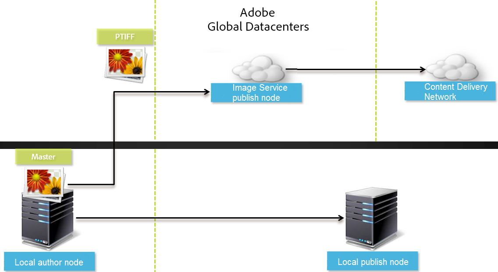

# Configuração do Dynamic Media - Modo híbrido {#configuring-dynamic-media-hybrid-mode}

O Dynamic Media-Hybrid precisa ser habilitado e configurado para uso. Dependendo do caso de uso, a Dynamic Media tem várias configurações [](#supported-dynamic-media-configurations)suportadas.

>[!NOTE]
>
>Se você pretende configurar e executar o Dynamic Media no modo de execução Scene7, consulte [Configuração do Dynamic Media - modo](/help/assets/config-dms7.md)Scene7.
>
>Se você pretende configurar e executar o Dynamic Media no modo de execução híbrido, siga as instruções desta página.

Saiba mais sobre como trabalhar com [vídeo](/help/assets/video.md) no Dynamic Media.

>[!NOTE]
>
>Se você usar a configuração de Adobe Experience Manager para ambientes diferentes, como um para desenvolvimento, um para armazenamento temporário e outro para produção ao vivo, é necessário configurar Cloud Service Dynamic Media para cada um desses ambientes.

>[!NOTE]
>
>Se você tiver problemas com a configuração do Dynamic Media, um local importante para procurar são os arquivos de registro específicos da mídia dinâmica. Eles são instalados automaticamente quando você ativa a mídia dinâmica:
>
>* `s7access.log`
>* `ImageServing.log`

>
>
Eles estão documentados em [Monitoramento e manutenção da sua instância](/help/sites-deploying/monitoring-and-maintaining.md)do AEM.

Publicação e delivery híbridos são um recurso principal da adição do Dynamic Media ao Adobe Experience Manager. A publicação híbrida permite fornecer ativos do Dynamic Media, como imagens, conjuntos e vídeos, da nuvem em vez dos nós de publicação do AEM.

Outro conteúdo, como visualizadores do Dynamic Media, páginas do site e conteúdo estático, continuará a ser disponibilizado nos nós de publicação do AEM.

Se você for um cliente da Dynamic Media, será necessário usar o delivery híbrido como mecanismo de delivery para todo o conteúdo da Dynamic Media.

## Arquitetura de publicação híbrida para vídeos {#hybrid-publishing-architecture-for-videos}


## Arquitetura de publicação híbrida para imagens {#hybrid-publishing-architecture-for-images}



## Configurações Dynamic Media suportadas {#supported-dynamic-media-configurations}

As tarefas de configuração a seguir fazem referência aos seguintes termos:

| **Termo** | **Habilitado para Dynamic Media** | **Descrição** |
|---|---|---|
| Nó de autor de AEM | Marca de seleção branca em um círculo verde | O nó do autor que você implanta no Local ou por meio dos Serviços gerenciados. |
| Nó de publicação do AEM | &quot;X&quot; branco em um quadrado vermelho. | O nó de publicação que você implanta no Local ou por meio dos Serviços gerenciados. |
| Nó de publicação do Serviço de imagem | Marca de seleção branca em um círculo verde. | O nó de publicação que você executa em data centers gerenciados pela Adobe. Refere-se ao URL do serviço de imagem. |

Você pode optar por implementar o Dynamic Media somente para geração de imagens, somente para vídeo ou para geração de imagens e vídeos. Para determinar as etapas para configurar o Dynamic Media para seu cenário específico, consulte a tabela a seguir.

<table>
 <tbody>
  <tr>
   <td><strong>Cenário</strong></td>
   <td ><strong>Como funciona</strong></td>
   <td><strong>Etapas de configuração</strong></td>
  </tr>
  <tr>
   <td>Fornecer SOMENTE imagens na produção</td>
   <td>As imagens são fornecidas por meio de servidores nos data centers mundiais da Adobe e, em seguida, são armazenadas em cache por um CDN para proporcionar desempenho escalável e alcance global.</td>
   <td>
    <ol>
     <li>No nó do <strong>autor</strong> do AEM, <a href="#enabling-dynamic-media">ative a mídia</a>dinâmica.</li>
     <li>Configure a geração de imagens nos Cloud Service <a href="#configuring-dynamic-media-cloud-services"></a>Dynamic Media.</li>
     <li><a href="#configuring-image-replication">Configure a replicação</a>de imagens.</li>
     <li><a href="#replicating-catalog-settings">Replicar configurações</a>de catálogo.</li>
     <li><a href="#replicating-viewer-presets">Replicar predefinições</a>do visualizador.</li>
     <li><a href="#using-default-asset-filters-for-replication">Use filtros de ativos padrão para replicação</a>.</li>
     <li><a href="#configuring-dynamic-media-image-server-settings">Defina as configurações</a>do Dynamic Media Image Server.</li>
     <li><a href="#delivering-assets">Entregar ativos</a>.</li>
    </ol> </td>
  </tr>
  <tr>
   <td>Entregue SOMENTE imagens na pré-produção (Dev, QE, Stage e assim por diante).</td>
   <td>As imagens são entregues pelo nó de publicação do AEM. Nesse cenário, como o tráfego é mínimo, não há necessidade de fornecer imagens para o data center da Adobe. Uma vantagem adicional é que isso permite uma pré-visualização segura do conteúdo antes do lançamento da produção</td>
   <td>
    <ol>
     <li>No nó do <strong>autor</strong> do AEM, <a href="#enabling-dynamic-media">ative a mídia</a>dinâmica.</li>
     <li>No nó de <strong>publicação</strong> do AEM, <a href="#enabling-dynamic-media">ative a mídia</a>dinâmica.</li>
     <li><a href="#replicating-viewer-presets">Replicar predefinições</a>do visualizador.</li>
     <li>Configure o filtro <a href="#setting-up-asset-filters-for-imaging-in-non-production-deployments">de ativos para imagens</a>que não sejam de produção.</li>
     <li><a href="#configuring-dynamic-media-image-server-settings">Defina as configurações do Dynamic Media Image Server.</a></li>
     <li><a href="#delivering-assets">Entregar ativos.</a></li>
    </ol> </td>
  </tr>
  <tr>
   <td>Entregue SOMENTE vídeo em qualquer ambiente (Produção, Desenvolvimento, QE, Palco e assim por diante)</td>
   <td>Os vídeos são fornecidos e armazenados em cache por um CDN para proporcionar desempenho escalável e alcance global. A imagem do pôster do vídeo (miniatura do vídeo que aparece antes do início da reprodução) será entregue pela instância de publicação do AEM.</td>
   <td>
    <ol>
     <li>No nó do <strong>autor</strong> do AEM, <a href="#enabling-dynamic-media">ative a mídia</a>dinâmica.</li>
     <li>No nó de <strong>publicação</strong> do AEM, <a href="#enabling-dynamic-media">ative a mídia</a> dinâmica (a instância de publicação serve a imagem de pôster do vídeo e fornece metadados para a reprodução do vídeo).</li>
     <li>Configure o vídeo nos Cloud Service <a href="#configuring-dynamic-media-cloud-services">Dynamic Media.</a></li>
     <li><a href="#replicating-viewer-presets">Replicar predefinições</a>do visualizador.</li>
     <li>Configure o filtro de <a href="#setting-up-asset-filters-for-video-only-deployments">ativo somente</a>para vídeo.</li>
     <li><a href="#delivering-assets">Entregar ativos.</a></li>
    </ol> </td>
  </tr>
  <tr>
   <td>Fornecer imagens e vídeos em produção</td>
   <td><p>Os vídeos são fornecidos e armazenados em cache por um CDN para proporcionar desempenho escalável e alcance global. Imagens e imagens de pôster de vídeo são entregues por meio de servidores em data centers globais da Adobe e, em seguida, armazenadas em cache por um CDN para proporcionar desempenho escalável e alcance global.</p> <p>Consulte as seções anteriores para configurar a imagem ou o vídeo na pré-produção. </p> </td>
   <td>
    <ol>
     <li>No nó do <strong>autor</strong> do AEM, <a href="#enabling-dynamic-media">ative a mídia</a>dinâmica.</li>
     <li>Configure o vídeo nos Cloud Service <a href="#configuring-dynamic-media-cloud-services">Dynamic Media.</a></li>
     <li>Configure imagens em Cloud Service <a href="#configuring-dynamic-media-cloud-services">Dynamic Media.</a></li>
     <li><a href="#configuring-image-replication">Configure a replicação</a>de imagens.</li>
     <li><a href="#replicating-catalog-settings">Replicar configurações</a>de catálogo.</li>
     <li><a href="#replicating-viewer-presets">Replicar predefinições</a>do visualizador.</li>
     <li><a href="#using-default-asset-filters-for-replication">Use filtros de ativos padrão para replicação.</a></li>
     <li><a href="#configuring-dynamic-media-image-server-settings">Defina as configurações do Dynamic Media Image Server.</a></li>
     <li><a href="#delivering-assets">Entregar ativos.</a></li>
    </ol> </td>
  </tr>
 </tbody>
</table>

## Ativação do Dynamic Media {#enabling-dynamic-media}

[A mídia](https://www.adobe.com/solutions/web-experience-management/dynamic-media.html) dinâmica está desativada por padrão. Para aproveitar os recursos de mídia dinâmica, é necessário ativar a mídia dinâmica usando o modo de `dynamicmedia` execução como, por exemplo, o modo de `publish` execução. Antes de habilitar, verifique se os requisitos [técnicos estão sendo revisados.](/help/sites-deploying/technical-requirements.md#dynamicmediaaddonprerequisites)

>[!NOTE]
>
>Habilitar a mídia dinâmica por meio do modo de execução substitui a funcionalidade no AEM 6.1 e no AEM 6.0, onde você habilitou a mídia dinâmica definindo o `dynamicMediaEnabled` sinalizador como **[!UICONTROL true.]** Esse sinalizador não tem funcionalidade no AEM 6.2 e posterior. Além disso, não é necessário reiniciar o início rápido para ativar a mídia dinâmica.

Ao habilitar o Dynamic Media, os recursos de mídia dinâmica estarão disponíveis na interface do usuário e cada ativo de imagem carregado receberá uma execução *cqdam.pyramid.tiff* usada para delivery rápido de representações de imagem dinâmicas. Esses PTIFFs têm vantagens significativas, incluindo (1) a capacidade de gerenciar apenas uma única imagem de fonte primária e gerar representações infinitas dinamicamente sem nenhum armazenamento adicional e (2) a capacidade de usar visualização interativa, como zoom, panorama, rotação e assim por diante.

Se quiser usar o Dynamic Media Classic (Scene7) no AEM, não ative o Dynamic Media a menos que esteja usando um cenário [](/help/sites-administering/scene7.md#aem-scene-integration-versus-dynamic-media)específico. O Dynamic Media é desativado a menos que você ative a mídia dinâmica por meio do modo de execução.

Para habilitar a mídia dinâmica, você deve habilitar o modo de execução de mídia dinâmica na linha de comando ou a partir do nome do arquivo de início rápido.

**Para ativar a mídia dinâmica**

1. Na linha de comando, ao iniciar o quickstart, faça o seguinte:

   * Adicione `-r dynamicmedia` ao final da linha de comando ao iniciar o arquivo jar.

   ```shell
   java -Xmx4096m -Doak.queryLimitInMemory=500000 -Doak.queryLimitReads=500000 -jar cq-quickstart-6.5.0.jar -r dynamicmedia
   ```

   Se você estiver publicando no s7delivery, também precisará incluir os seguintes argumentos trustStore:

   ```
   -Djavax.net.ssl.trustStore=<absoluteFilePath>/customerTrustStoreFileName>
   
    -Djavax.net.ssl.trustStorePassword=<passwordForTrustStoreFile>
   ```

1. Solicite `https://localhost:4502/is/image` e verifique se o Servidor de imagens está em execução.

   >[!NOTE]
   >
   >Para solucionar problemas com o Dynamic Media, consulte os seguintes registros no `crx-quickstart/logs/` diretório:
   >
   >* ImageServer-&lt;PortId>-&lt;yyyy>&lt;mm>&lt;dd>.log - O log do ImageServer fornece estatísticas e informações analíticas usadas para analisar o comportamento do processo interno do ImageServer.

   Exemplo de um nome de arquivo de log do Servidor de Imagens: `ImageServer-57346-2020-07-25.log`
   * s7access-&lt;yyyy>&lt;mm>&lt;dd>.log - o registro s7access registra cada solicitação feita à Dynamic Media por meio `/is/image` e `/is/content`.

   Esses registros só são usados quando o Dynamic Media está ativado. Eles não estão incluídos no pacote **Download completo** gerado a partir da `system/console/status-Bundlelist` página; ao entrar em contato com o Suporte ao cliente se tiver um problema com a Dynamic Media, anexe ambos os registros ao problema.

### Se você instalou o AEM em uma porta ou um caminho de contexto diferente... {#if-you-installed-aem-to-a-different-port-or-context-path}

Se você estiver implantando o [AEM em um servidor](/help/sites-deploying/application-server-install.md) de aplicativos e tiver o Dynamic Media ativado, será necessário configurar o domínio **próprio** no externalizador. Caso contrário, a geração de miniaturas de ativos não funcionará corretamente para ativos de mídia dinâmica.

Além disso, se você executar o Início rápido em uma porta ou um caminho de contexto diferente, também precisará alterar o domínio **próprio** .

Quando o Dynamic Media está ativado, as renderizações de miniatura estáticas para ativos de imagem são geradas usando o Dynamic Media. Para que a geração de miniaturas funcione corretamente para a mídia dinâmica, o AEM deve executar uma solicitação de URL para si mesmo e deve saber o número da porta e o caminho do contexto.

No AEM:

* O domínio **self** no [externalizador](/help/sites-developing/externalizer.md) é usado para recuperar o número da porta e o caminho do contexto.
* Se nenhum domínio **próprio** estiver configurado, o número da porta e o caminho do contexto serão recuperados do serviço HTTP Jetty.

Em uma implantação WAR do QuickStart do AEM, o número da porta e o caminho do contexto não podem ser derivados; portanto, você deve configurar um domínio **próprio** . Consulte a documentação [do](/help/sites-developing/externalizer.md) externalizador sobre como configurar o domínio **próprio** .

>[!NOTE]
Em uma implantação [independente do](/help/sites-deploying/deploy.md)AEM Quickstart, um domínio **próprio** geralmente não precisa ser configurado, pois o número da porta e o caminho do contexto podem ser configurados automaticamente. No entanto, se todas as interfaces de rede estiverem desativadas, será necessário configurar o domínio **próprio** .

## Desativação do Dynamic Media  {#disabling-dynamic-media}

A mídia dinâmica não está ativada por padrão. No entanto, se você ativou a mídia dinâmica anteriormente, talvez você queira desativá-la posteriormente.

Para desativar a mídia dinâmica depois de ativá-la, remova o sinalizador de modo de `-r dynamicmedia` execução.

**Para desativar o Dynamic Media depois que ele for ativado**

1. Na linha de comando, ao iniciar o quickstart, você pode executar um dos seguintes procedimentos:

   * Não adicione `-r dynamicmedia` à linha de comando ao iniciar o arquivo jar.

   ```shell
   java -Xmx4096m -Doak.queryLimitInMemory=500000 -Doak.queryLimitReads=500000 -jar cq-quickstart-6.5.0.jar
   ```

1. Request `https://localhost:4502/is/image`. Você receberá uma mensagem informando que o Dynamic Media está desativado.

   >[!NOTE]
   Depois que o modo de execução do Dynamic Media é desativado, a etapa do fluxo de trabalho que gera a `cqdam.pyramid.tiff` execução é ignorada automaticamente. Isso também desativa o suporte de execução dinâmica e outros recursos do Dynamic Media.
   Observe também que quando o modo de execução do Dynamic Media é desativado após a configuração do servidor AEM, todos os ativos que foram carregados nesse modo de execução agora são inválidos.

## (Opcional) Migração de predefinições e configurações do Dynamic Media de 6.3 para 6.5 Zero Downtime {#optional-migrating-dynamic-media-presets-and-configurations-from-to-zero-downtime}

Se você estiver atualizando o AEM Dynamic Media de 6.3 para 6.5 (que agora inclui a capacidade de implantações de tempo de inatividade zero), é necessário executar o seguinte comando de ondulação para migrar todas as predefinições e configurações de `/etc` para `/conf` o CRXDE Lite.

**Observação**: Se você executar sua instância do AEM no modo de compatibilidade, ou seja, se você tiver o pacote de compatibilidade instalado, não será necessário executar esses comandos.

Para todas as atualizações, com ou sem o pacote de compatibilidade, você pode copiar as predefinições padrão e predefinidas do visualizador que originalmente veio com o Dynamic Media executando o seguinte comando de curl do Linux:

`curl -u admin:admin -X POST https://<server_address>:<server_port>/libs/settings/dam/dm/presets/viewer.pushviewerpresets.json`

Para migrar as predefinições e configurações do visualizador personalizado que você criou `/etc` para `/conf`, execute o seguinte comando de rolagem do Linux:

`curl -u admin:admin -X POST https://<server_address>:<server_port>/libs/settings/dam/dm/presets.migratedmcontent.json`

## Configuração da replicação de imagem {#configuring-image-replication}

O delivery de imagem da Dynamic Media funciona publicando ativos de imagem, incluindo miniaturas de vídeo, do AEM Author e replicando-os para o serviço de replicação sob demanda da Adobe (o URL do serviço de replicação). Os ativos são entregues por meio do serviço de delivery de imagem sob demanda (o URL do serviço de imagem).

Você deve fazer o seguinte:

1. [Configurar autenticação](#setting-up-authentication).
1. [Configure o agente](#configuring-the-replication-agent)de replicação.

O Agente de Replicação publica ativos do Dynamic Media, como imagens, metadados de vídeo e conjuntos para o Serviço de Imagem hospedado pela Adobe. O Agente de Replicação não está habilitado por padrão.

Depois de configurar o agente de replicação, é necessário [validar e testar se ele foi configurado](#validating-the-replication-agent-for-dynamic-media)com êxito. Esta seção descreve esses procedimentos.

>[!NOTE]
O limite de memória padrão para a criação de PTIFF é de 3 GB em todos os workflows. Por exemplo, você pode processar uma imagem que requer 3 GB de memória enquanto outros workflows estão pausados, ou pode processar 10 imagens em paralelo que exigem 300 MB de memória cada.
O limite de memória é configurável e deve se ajustar à disponibilidade de recursos do sistema e ao tipo de conteúdo de imagem que está sendo processado. Se você tiver muitos ativos muito grandes e tiver memória suficiente no sistema, poderá aumentar esse limite para garantir que as imagens sejam processadas em paralelo.
Uma imagem que requer mais do que o limite máximo de memória será rejeitada.
Para alterar o limite de memória para a criação do PTIFF, navegue até **[!UICONTROL Ferramentas > Operações > Console da Web > Adobe CQ Scene7 PTiffManager]** e altere o valor de **[!UICONTROL maxMemory]** .

### Configuração da autenticação {#setting-up-authentication}

É necessário configurar a autenticação de replicação no autor para replicar imagens no serviço de delivery de imagem da Dynamic Media. Para fazer isso, obtenha um KeyStore e salve-o no usuário de replicação **[!UICONTROL de mídia]** dinâmica e configure-o. O administrador da empresa deve ter recebido um email de boas-vindas com o arquivo KeyStore e as credenciais necessárias durante o processo de provisionamento. Se você não recebeu esta solicitação, entre em contato com o Atendimento ao cliente.

**Para configurar a autenticação**

1. Entre em contato com o Atendimento ao cliente para obter o arquivo e a senha do KeyStore, caso ainda não tenha essa senha. Isso faz parte do provisionamento e associará as chaves à sua conta.
1. In AEM, tap the AEM logo to access the global navigation console, then tap **[!UICONTROL Tools > Security > Users.]**
1. Na página Gerenciamento de usuários, navegue até o usuário de replicação **[!UICONTROL de mídia]** dinâmica e, em seguida, toque para abrir.

   

1. Na página Editar configurações do usuário para replicação de mídia dinâmica, toque na guia **[!UICONTROL Keystore]** e clique em **[!UICONTROL Criar KeyStore.]**

   

1. Digite uma senha e confirme-a na caixa de diálogo **[!UICONTROL Definir senha]** de acesso do KeyStore.

   >[!NOTE]
   Lembre-se da senha digitada. Será necessário inseri-lo novamente quando configurar o Agente de Replicação mais tarde.

   

1. Na página **[!UICONTROL Editar configurações do usuário para replicação]** de mídia dinâmica, expanda a área de arquivo **** Adicionar chave privada do KeyStore e adicione o seguinte (consulte as imagens a seguir):

   * No campo **[!UICONTROL Novo alias]** , digite o nome de um alias que será usado posteriormente na configuração de replicação; por exemplo, `replication`.
   * Toque em Arquivo **[!UICONTROL KeyStore.]** Navegue até o arquivo KeyStore fornecido pela Adobe, selecione-o e toque em **[!UICONTROL Abrir.]**
   * No campo Senha **[!UICONTROL do arquivo]** KeyStore, digite a senha do arquivo KeyStore. Esta **não** é a senha do KeyStore que você criou na Etapa 5, mas é a senha do Arquivo KeyStore que a Adobe fornece no email de boas-vindas enviado a você durante o provisionamento. Entre em contato com o Atendimento ao cliente da Adobe se você não recebeu uma senha do Arquivo KeyStore.
   * No campo Senha **[!UICONTROL da chave]** privada, digite a senha da chave privada (pode ser a mesma senha da chave privada fornecida na etapa anterior). A Adobe fornece a senha da chave privada no email de boas-vindas enviado a você durante o provisionamento. Entre em contato com o Atendimento ao cliente da Adobe se você não recebeu uma senha de chave privada.
   * No campo Alias **[!UICONTROL da chave]** privada, informe o alias da chave privada. Por exemplo, `*companyname*-alias`. A Adobe fornece o alias da chave privada no email de boas-vindas enviado a você durante o provisionamento. Entre em contato com o Atendimento ao cliente da Adobe se você não recebeu um alias de chave privada.

   

1. Toque em **[!UICONTROL Salvar e fechar]** para salvar suas alterações neste usuário.

   Em seguida, é necessário [configurar o agente de replicação.](#configuring-the-replication-agent)

### Configuração do Agente de Replicação {#configuring-the-replication-agent}

1. No AEM, toque no logotipo do AEM para acessar o console de navegação global e, em seguida, toque em **[!UICONTROL Ferramentas > Implantação > Replicação > Agentes no autor.]**
1. Na página Agentes do autor, toque em Replicação de Imagem Híbrida **[!UICONTROL Dynamic Media (s7delivery).]**
1. Toque em **[!UICONTROL Editar.]**
1. Toque na guia **[!UICONTROL Configurações]** e digite o seguinte:

   * **[!UICONTROL Ativado]** - Marque esta caixa de seleção para ativar o agente de replicação.
   * **[!UICONTROL Região]** - Definido para a região apropriada: América do Norte, Europa ou Ásia
   * **[!UICONTROL ID]** do inquilino - esse valor é o nome da sua empresa/inquilino que está publicando no Serviço de Replicação. Esse valor é a ID do locatário fornecida pela Adobe no email de boas-vindas enviado a você durante o provisionamento. Entre em contato com o Atendimento ao cliente da Adobe se você não recebeu essa notificação.
   * **[!UICONTROL Alias]** do armazenamento de chave - Esse valor é o mesmo que o valor** New Alias*** definido ao gerar a chave na [Configuração da autenticação](#setting-up-authentication); por exemplo, `replication`. (Consulte a etapa 7 na [configuração da autenticação](#setting-up-authentication).)
   * **[!UICONTROL Senha]** do armazenamento de chaves - esta é a senha do KeyStore criada quando você tocou em **[!UICONTROL Criar armazenamento de chaves.]** A Adobe não fornece esta senha. Consulte a etapa 5 de [Configuração da autenticação](#setting-up-authentication).

   A imagem a seguir mostra o agente de replicação com dados de amostra:

   

1. Toque em **[!UICONTROL OK.]**

### Validação do Agente de Replicação para Dynamic Media {#validating-the-replication-agent-for-dynamic-media}

Para validar o agente de replicação para mídia dinâmica, faça o seguinte:

Toque em **[!UICONTROL Testar conexão.]** O exemplo de saída é o seguinte:

```shell
11.03.2016 10:57:55 - Transferring content for ReplicationAction{type=TEST, path[0]='/content/dam', time=1457722675402, userId='admin', revision='null'}
11.03.2016 10:57:55 - * Auth User: replication-receiver
11.03.2016 10:57:55 - * HTTP Version: 1.1
11.03.2016 10:57:55 - * Using OAuth 2.0 Authorization Grants
11.03.2016 10:57:55 - * OAuth 2.0 User: dynamic-media-replication
11.03.2016 10:57:55 - * OAuth 2.0 Token: '*****' initialized
11.03.2016 10:57:55 - Publishing: POST[https://replicate-na.assetsadobe.com:8580/is-publish/publish-receiver?Cmd=Test&RootId=xfpuu-6613]
11.03.2016 10:57:55 - Publish response: OK[]
11.03.2016 10:57:55 - Transfer succeeded in 141 ms for ReplicationAction{type=TEST, path[0]='/content/dam', time=1457722675402, userId='admin', revision='null'}
-------------------------------------------------------------------------------------------------------------------------------
Replication test succeeded
```

>[!NOTE]
Você também pode verificar seguindo um destes procedimentos:
* Verifique os registros de replicação para garantir que o ativo seja replicado.
* Publique uma imagem. Toque na imagem e selecione **[!UICONTROL Visualizadores]** no menu suspenso. Em seguida, selecione uma predefinição do visualizador, clique em URL e copie/cole o URL no navegador para verificar se você pode ver a imagem.


### Solução de problemas de autenticação {#troubleshooting-authentication}

Ao configurar a autenticação, veja alguns problemas que podem ocorrer com suas soluções. Antes de verificá-los, verifique se você configurou a replicação.

#### Problema: Código de status HTTP 401 com mensagem - Autorização obrigatória {#problem-http-status-code-with-message-authorization-required}

Esse problema pode ser causado por uma falha ao configurar o KeyStore para o `dynamic-media-replication` usuário.

```shell
Replication test to s7delivery:https://s7bern.macromedia.com:8580/is-publish/
17.06.2016 18:54:43 - Transferring content for ReplicationAction{type=TEST, path[0]='/content/dam', time=1466214883309, userId='admin', revision='null'}
17.06.2016 18:54:43 - * Auth User: replication-receiver
17.06.2016 18:54:43 - * HTTP Version: 1.1
17.06.2016 18:54:43 - * Using OAuth 2.0 Authorization Grants
17.06.2016 18:54:43 - * OAuth 2.0 User: dynamic-media-replication
17.06.2016 18:54:43 - No OAuth token available. OAuth not initialized
17.06.2016 18:54:43 - * Using Client Auth SSL alias - replication-alias *
17.06.2016 18:54:43 - Publishing: POST[https://<localhost>:8580/is-publish//publish-receiver?Cmd=Test&RootId=brough]
17.06.2016 18:54:43 - Transfer failed for ReplicationAction{type=TEST, path[0]='/content/dam', time=1466214883309, userId='admin', revision='null'}. java.io.IOException: Failed to execute request
'https://<localhost>:8580/is-publish//publish-receiver?Cmd=Test&RootId=brough':
 Server returned status code 401 with message: Authorization required.
17.06.2016 18:54:43 - Error while replicating: com.day.cq.replication.ReplicationException: Transfer failed for ReplicationAction{type=TEST, path[0]='/content/dam', time=1466214883309,
 userId='admin', revision='null'}. java.io.IOException: Failed to execute request
'https://<localhost>:8580/is-publish//publish-receiver?Cmd=Test&RootId=brough':
 Server returned status code 401 with message: Authorization required.
```

**Solução**: Verifique se o arquivo `KeyStore` está salvo no usuário de replicação **de mídia** dinâmica e se a senha está correta.

#### Problema: Não Foi Possível Descriptografar A Chave - Não Foi Possível Descriptografar Os Dados {#problem-could-not-decrypt-key-could-not-decrypt-data}

```xml
Replication test to s7delivery:https://<localhost>:8580/is-publish/
17.06.2016 19:00:16 - Transferring content for ReplicationAction{type=TEST, path[0]='/content/dam', time=1466215216662, userId='admin', revision='null'}
17.06.2016 19:00:16 - * Auth User: replication-receiver
17.06.2016 19:00:16 - * HTTP Version: 1.1
17.06.2016 19:00:16 - * Using OAuth 2.0 Authorization Grants
17.06.2016 19:00:16 - * OAuth 2.0 User: dynamic-media-replication
17.06.2016 19:00:16 - No OAuth token available. OAuth not initialized
17.06.2016 19:00:16 - * Using Client Auth SSL alias - replication-alias *
17.06.2016 19:00:16 - Transfer failed for ReplicationAction{type=TEST, path[0]='/content/dam', time=1466215216662, userId='admin', revision='null'}. java.lang.SecurityException: java.security.UnrecoverableKeyException: Could not decrypt key: Could not decrypt data.
```

**Solução**: Verifique a senha. A senha salva no agente de replicação não é a mesma senha usada para criar o armazenamento de chaves.

#### Problema: InvalidAlgorithmParameterException {#problem-invalidalgorithmparameterexception}

Esse problema é causado por um erro de configuração na instância do AEM Author. O processo java no Autor não está recebendo o correto `javax.net.ssl.trustStore`. Este erro é exibido no log de replicação:

```shell
14.04.2016 09:37:43 - Transfer failed for ReplicationAction{type=TEST, path[0]='/content/dam', time=1460651862089, userId='admin', revision='null'}. java.io.IOException: Failed to execute request 'https://<localhost>:8580/is-publish/publish-receiver?Cmd=Test&RootId=rbrough-osx2': java.lang.RuntimeException: Unexpected error: java.security.InvalidAlgorithmParameterException: the trustAnchors parameter must be non-empty
14.04.2016 09:37:43 - Error while replicating: com.day.cq.replication.ReplicationException: Transfer failed for ReplicationAction{type=TEST, path[0]='/content/dam', time=1460651862089, userId='admin', revision='null'}. java.io.IOException: Failed to execute request 'https://<localhost>:8580/is-publish/publish-receiver?Cmd=Test&RootId=rbrough-osx2': java.lang.RuntimeException: Unexpected error: java.security.InvalidAlgorithmParameterException: the trustAnchors parameter must be non-empty
```

Ou o registro de erros:

```shell
07.25.2019 12:00:59.893 *ERROR* [sling-threadpool-db2763bb-bc50-4bb5-bb64-10a09f432712-(apache-sling-job-thread-pool)-90-com_day_cq_replication_job_s7delivery(com/day/cq/replication/job/s7delivery)] com.day.cq.replication.Agent.s7delivery.queue Error during processing of replication.

java.io.IOException: Failed to execute request 'https://replicate-na.assetsadobe.com:8580/is-publish/publish-receiver?Cmd=Test&RootId=rbrough-osx': java.lang.RuntimeException: Unexpected error: java.security.InvalidAlgorithmParameterException: the trustAnchors parameter must be non-empty
        at com.scene7.is.catalog.service.publish.atomic.PublishingServiceHttp.executePost(PublishingServiceHttp.scala:195)
```

**Solução**: Verifique se o processo java no AEM Author tem a propriedade system definida `-Djavax.net.ssl.trustStore=` para uma Truststore válida.

#### Problema: O KeyStore não está configurado ou não foi inicializado {#problem-keystore-is-either-not-set-up-or-it-is-not-initialized}

Esse problema pode ser causado por uma correção ou por um pacote de recursos que sobrescreve o nó dynamic-media-user ou keystore.

Exemplo de log de replicação:

```shell
Replication test to s7delivery:https://replicate-na.assetsadobe.com/is-publish
02.08.2016 14:37:44 - Transferring content for ReplicationAction{type=TEST, path[0]='/content/dam', time=1470173864834, userId='admin', revision='null'}
02.08.2016 14:37:44 - * Auth User: replication-receiver
02.08.2016 14:37:44 - * HTTP Version: 1.1
02.08.2016 14:37:44 - * Using OAuth 2.0 Authorization Grants
02.08.2016 14:37:44 - * OAuth 2.0 User: dynamic-media-replication
02.08.2016 14:37:44 - Transfer failed for ReplicationAction{type=TEST, path[0]='/content/dam', time=1470173864834, userId='admin', revision='null'}. com.adobe.granite.keystore.KeyStoreNotInitialisedException: Uninitialised key store for user dynamic-media-replication
```

**Solução**:

1. Navegue até a página Gerenciamento de usuários:
   `localhost:4502/libs/granite/security/content/useradmin.html`
1. Na página Gerenciamento de usuários, navegue até o `dynamic-media-replication` usuário e toque para abrir.
1. Click the **[!UICONTROL KeyStore]** tab. Se o botão **[!UICONTROL Create KeyStore]** for exibido, você precisará refazer as etapas em [Setting up Authentication](#setting-up-authentication) before.
1. Se tiver que refazer a configuração do KeyStore, talvez seja necessário [Configurar o Replication Agent](/help/assets/config-dynamic.md#configuring-the-replication-agent) novamente.

   Reconfigure o s7delivery Replication Agent.
   `localhost:4502/etc/replication/agents.author/s7delivery.html`

1. Toque em **[!UICONTROL Testar conexão]** para verificar se a configuração é válida.

#### Problema: O Publicar Agent está usando SSL em vez de OAuth {#problem-publish-agent-is-using-ssl-instead-of-oauth}

Esse problema pode ser causado por uma correção ou por um pacote de recursos que não foram instalados corretamente ou que sobrescreveram as configurações.

Exemplo de registro de replicação:

```shell
01.08.2016 18:42:59 - Transferring content for ReplicationAction{type=TEST, path[0]='/content/dam', time=1470073379634, userId='admin', revision='null'}
01.08.2016 18:42:59 - * Auth User: replication-receiver
01.08.2016 18:42:59 - * HTTP Version: 1.1
01.08.2016 18:42:59 - * Using Client Auth SSL alias - replication-receiver *
01.08.2016 18:42:59 - Publishing: POST[https://replicate-eu.assetsadobe2.com:443/is-publish/publish-receiver?Cmd=Test&RootId=altayerstaging]
01.08.2016 18:42:59 - Transfer failed for ReplicationAction{type=TEST, path[0]='/content/dam', time=1470073379634, userId='admin', revision='null'}. java.io.IOException: Failed to execute request 'https://replicate-eu.assetsadobe2.com:443/is-publish/publish-receiver?Cmd=Test&RootId=rbroughstaging': Server returned status code 401 with message: Authorization required.
01.08.2016 18:42:59 - Error while replicating: com.day.cq.replication.ReplicationException: Transfer failed for ReplicationAction{type=TEST, path[0]='/content/dam', time=1470073379634, userId='admin', revision='null'}. java.io.IOException: Failed to execute request 'https://replicate-eu.assetsadobe2.com:443/is-publish/publish-receiver?Cmd=Test&RootId=rbroughstaging': Server returned status code 401 with message: Authorization required.
```

**Solução:**

1. In AEM, click **[!UICONTROL Tools > General > CRXDE Lite.]**

   `localhost:4502/crx/de/index.jsp`

1. Navegue até o nó s7delivery Replication Agent.
   `localhost:4502/crx/de/index.jsp#/etc/replication/agents.author/s7delivery/jcr:content`

1. Adicione essa configuração ao agente de replicação (Booliano com valor definido como **[!UICONTROL Verdadeiro]**):

   `enableOauth=true`

1. Perto do canto superior esquerdo da página, toque em **[!UICONTROL Salvar tudo.]**

### Teste da configuração {#testing-your-configuration}

A Adobe recomenda que você execute um teste completo da configuração.

Verifique se você já fez o seguinte antes de iniciar este teste:

* Predefinições de imagem adicionadas.
* Configure **[!UICONTROL Dynamic Media Configuration (Pre 6.3)]** em Cloud Service. O URL do Serviço de Imagem é necessário para este teste

**Para testar sua configuração**

1. Carregue um ativo de imagem. (Em Ativos, toque em **[!UICONTROL Criar > Arquivos]** e selecione o arquivo.)
1. Aguarde a conclusão do fluxo de trabalho.
1. Publique o ativo de imagem. (Selecione o ativo e toque em Publicação **[!UICONTROL rápida.]**)
1. Navegue até as representações dessa imagem abrindo a imagem e tocando em **[!UICONTROL Representações.]**

   

1. Selecione qualquer representação dinâmica.
1. Clique em **[!UICONTROL URL]** para obter o URL para este ativo.
1. Navegue até o URL selecionado e verifique se a imagem se comporta como esperado.

Outra maneira de testar se seus ativos foram entregues é anexar req=existe ao seu URL.

## Configuring Dynamic Media Cloud Services {#configuring-dynamic-media-cloud-services}

O serviço da Dynamic Media Cloud oferece suporte para serviços em nuvem, como publicação híbrida e delivery de imagens e vídeos, análise de vídeo e codificação de vídeo, entre outras coisas.

Como parte da configuração, é necessário inserir uma ID de registro, URL do serviço de vídeo, URL do serviço de imagem, URL do serviço de replicação e configurar a autenticação. Você deve ter recebido todas essas informações como parte do processo de provisionamento da conta. Se você não recebeu essas informações, entre em contato com o administrador do Adobe Experience Manager ou com o suporte técnico da Adobe para obter as informações.

>[!NOTE]
Antes de configurar os serviços da Dynamic Media Cloud, certifique-se de ter a instância de publicação configurada. Você também deve ter a replicação configurada antes de configurar os serviços da Dynamic Media Cloud.

Para configurar os serviços de nuvem de mídia dinâmica:

1. No AEM, toque no logotipo do AEM para acessar o console de navegação global e toque em **[!UICONTROL Ferramentas > Cloud Service > Configuração do Dynamic Media (Pré-6.3).]**
1. Na página Navegador de configuração do Dynamic Media, no painel esquerdo, selecione **[!UICONTROL global]** e, em seguida, toque em **[!UICONTROL Criar.]**
1. Na caixa de diálogo **[!UICONTROL Criar configuração]** do Dynamic Media, no campo Título, digite um título.
1. Se você estiver configurando o Dynamic Media para vídeo,

   * No campo **[!UICONTROL Registration ID (ID]** de registro), digite sua ID de registro.
   * No campo URL **[!UICONTROL do serviço de ]**vídeo, insira o URL do serviço de vídeo para o Dynamic Media Gateway.

1. Se você estiver configurando o Dynamic Media para geração de imagens, no campo URL **[!UICONTROL do Serviço de]** Imagens, digite o URL do serviço de imagem para o Dynamic Media Gateway.
1. Toque em **[!UICONTROL Salvar]** para retornar à página do Dynamic Media Configuration Browser.
1. Toque no logotipo do AEM para acessar o console de navegação global.

## Configuração do Relatórios de vídeo {#configuring-video-reporting}

Você pode configurar o relatórios de vídeo em várias instalações do AEM usando o Dynamic Media Hybrid.

**Quando usar:** No momento em que você configura a Configuração Dynamic Media (Pré 6.3), vários recursos são iniciados, incluindo o relatórios de vídeo. A configuração cria um conjunto de relatórios em uma empresa Analytics regional. Se você configurar vários nós de Autor, criará um conjunto de relatórios separado para cada um. Como resultado, os dados do relatórios são inconsistentes entre as instalações. Além disso, se cada nó Autor fizer referência ao mesmo servidor de publicação híbrido, a última instalação do Autor alterará o conjunto de relatórios de destino para todos os relatórios de vídeo. Esse problema sobrecarrega o sistema Analytics com muitos conjuntos de relatórios.

**Introdução:** Configure o relatórios de vídeo completando as três tarefas a seguir.

1. Crie um pacote predefinido de Analytics de vídeo depois de configurar a Configuração do Dynamic Media (Pré 6.3) no primeiro nó Autor. Essa tarefa inicial é importante porque permite que uma nova configuração continue usando o mesmo conjunto de relatórios.
1. Instale o pacote predefinido da Analytics de vídeo em qualquer nó do ***novo*** Autor ***antes*** de configurar a Configuração da Dynamic Media (Pré 6.3).
1. Verifique e depure a instalação do pacote.

### Criação de um pacote de Video Analytics Preset após a configuração do primeiro nó Autor {#creating-a-video-analytics-preset-package-after-configuring-the-first-author-node}

Quando terminar esta tarefa, você terá um arquivo de pacote que contém as predefinições do Video Analytics. Essas predefinições contêm um conjunto de relatórios, o servidor de rastreamento, a namespace de rastreamento e a ID de empresa da Marketing Cloud, se disponível.

1. Se você ainda não tiver feito isso, configure a Configuração do Dynamic Media (Pré 6.3).
1. (Opcional) Visualização e copie a ID do conjunto de relatórios (é necessário ter acesso ao JCR). Embora a ID do conjunto de relatórios não seja obrigatória, facilita a validação.
1. Crie um pacote usando o Gerenciador de pacotes.
1. Edite o pacote para incluir um filtro.

   No AEM: `/conf/global/settings/dam/dm/presets/analytics/jcr:content/userdata`

1. Crie o pacote.
1. Baixe ou compartilhe o pacote predefinido do Video Analytics para que ele possa ser compartilhado com os novos nós subsequentes do Autor.

### Instalar o pacote predefinido da Analytics de vídeo antes de configurar os nós adicionais do Autor {#installing-the-video-analytics-preset-package-before-you-configure-additional-author-nodes}

Certifique-se de concluir esta tarefa ***antes*** de configurar a Configuração Dynamic Media (Pré 6.3). Se isso não for feito, resultará na criação de outro conjunto de relatórios não utilizado. Além disso, mesmo que o relatórios de vídeo continue funcionando corretamente, a coleta de dados não é otimizada.

Certifique-se de que o pacote predefinido do Video Analytics do primeiro nó Autor esteja acessível no novo nó Autor.

1. Carregue o pacote predefinido do Video Analytics que você criou anteriormente para o Package Manager.
1. Instale o pacote predefinido Video Analytics.
1. Configuração do Dynamic Media (Pré 6.3).

### Verificação e depuração da instalação do pacote {#verifying-and-debugging-the-package-installation}

1. Execute um dos procedimentos a seguir para verificar e, se necessário, depurar a instalação do pacote:

   * **Verifique a predefinição do Analytics de vídeo por meio do JCR** Para verificar a predefinição do Analytics de vídeo por meio do JCR, você deve ter acesso ao CRXDE Lite.

      AEM - No CRXDE Lite, navegue até `/conf/global/settings/
dam/dm/presets/analytics/jcr:content/userdata`

      Isso é `https://localhost:4502/crx/de/index.jsp#/conf/global/settings/dam/dm/presets/analytics/jcr%3Acontent/userdata`

      Se você não tiver acesso ao CRXDE Lite no nó Autor, poderá verificar a predefinição pelo servidor de publicação.

   * **Verifique a predefinição Analytics de vídeo através do servidor de imagens**

      É possível validar a predefinição Analytics de vídeo diretamente, fazendo uma solicitação de dados de usuário req=userdata do Servidor de imagens.
Por exemplo, para ver a predefinição do Analytics no nó Autor, é possível fazer a seguinte solicitação:

      `https://localhost:4502/is/image/conf/global/settings/dam/dm/presets/analytics?req=userdata`

      Para validar a predefinição nos servidores de publicação, é possível fazer uma solicitação direta semelhante ao servidor de publicação. As respostas são as mesmas nos nós Autor e Publicar. A resposta é similar ao seguinte:**

      ```
      marketingCloudOrgId=0FC4E86B573F99CC7F000101
       reportSuite=aemaem6397618-2018-05-23
       trackingNamespace=aemvideodal
       trackingServer=aemvideodal.d2.sc.omtrdc.net
      ```

   * **Verifique a predefinição Analytics de vídeo através da ferramenta Relatórios de vídeo em AEM** Tap **[!UICONTROL Tools > Assets > Video Relatórios]**

      `https://localhost:4502/mnt/overlay/dam/gui/content/s7dam/videoreports/videoreport.html`

      Se você vir a seguinte mensagem de erro, o conjunto de relatórios estará disponível, mas não será preenchido. Esse erro está correto — e desejado — em uma nova instalação antes que o sistema colete dados.
   

   Para gerar dados de relatórios, carregue e publique um vídeo. Use **[!UICONTROL Copiar URL]** e execute o vídeo pelo menos uma vez.

   Esteja ciente de que pode levar até 12 horas até que os dados do relatórios sejam preenchidos a partir do uso do Visualizador de vídeo.

   Se houver um erro e o conjunto de relatórios não estiver definido corretamente, o seguinte alerta será exibido.

   

   Esse erro também será exibido se o Relatórios Vídeo for executado antes da configuração dos serviços de Configuração do Dynamic Media (Pre 6.3).

### Solução de problemas de configuração do relatórios de vídeo {#troubleshooting-the-video-reporting-configuration}

* Durante a instalação, às vezes as conexões com o servidor de API da Analytics expiram. A instalação tentativas a conexão 20 vezes, mas ainda falha. Quando essa situação ocorre, o arquivo de log registra vários erros. Pesquisar `SiteCatalystReportService`.
* A não instalação do pacote Analytics Preset pode causar a criação de um novo conjunto de relatórios.
* A atualização do AEM 6.3 para o AEM 6.4 ou o AEM 6.4.1 e, em seguida, a configuração da Configuração do Dynamic Media (Pré 6.3) ainda cria um conjunto de relatórios. Esse problema é conhecido e está marcado para ser corrigido no AEM 6.4.2.

### Sobre a predefinição Analytics de vídeo {#about-the-video-analytics-preset}

A predefinição de Analytics de vídeo, às vezes conhecida simplesmente como predefinição de análise, é armazenada ao lado das predefinições do visualizador no Dynamic Media. É basicamente o mesmo que uma predefinição do visualizador, mas com informações usadas para configurar o AppMeasurement e o relatórios Video Heartbeat.

As propriedades da predefinição são as seguintes:

* `reportSuite`
* `trackingServer`
* `trackingNamespace`
* `marketingCloudOrgId` (não está presente em versões anteriores do AEM)

AEM 6.4 e versões mais recentes salvam essa predefinição em `/conf/global/settings/dam/dm/presets/analytics/jcr:content/userdata`

## Replicando configurações do catálogo {#replicating-catalog-settings}

Você deve publicar suas próprias configurações de catálogo padrão como parte do processo de configuração por meio do JCR. Para replicar as configurações do catálogo:

1. Em uma janela Terminal, execute o seguinte procedimento:

   `curl -u admin:admin localhost:4502/libs/settings/dam/dm/presets/viewer.pushviewerpresets`

1. No AEM, navegue até o seguinte local no CRXDE Lite (requer privilégios de administrador):

   `https://<*server*>:<*port*>/crx/de/index.jsp#/conf/global/settings/dam/dm/imageserver/`

1. Toque na guia **[!UICONTROL Replicação]** .
1. Toque em **[!UICONTROL Replicar.]**

## Replicação de predefinições do visualizador {#replicating-viewer-presets}

Para fornecer *um ativo com uma predefinição do visualizador, você deve replicar/publicar* a predefinição do visualizador. (All viewer presets must be activated *and* replicated to obtain the URL or embed code for an asset.
Consulte Predefinições [do visualizador de](/help/assets/managing-viewer-presets.md#publishing-viewer-presets) publicação para obter mais informações.

>[!NOTE]
By default, the system shows a variety of renditions when you select **[!UICONTROL Renditions]** and a variety of viewer presets when you select **[!UICONTROL Viewers]** in the asset&#39;s detail view. Você pode aumentar ou diminuir o número visto. See [Increasing the number of image presets that display](/help/assets/managing-image-presets.md#increasingthenumberofimagepresetsthatdisplay) or [Increasing the number of viewer presets that display](/help/assets/managing-viewer-presets.md#increasing-the-number-of-viewer-presets-that-display).

## Filtrar ativos para replicação {#filtering-assets-for-replication}

Em implantações que não sejam da Dynamic Media, você replica *todos* os ativos (imagens e vídeos) do ambiente de autor do AEM para o nó de publicação do AEM. Esse fluxo de trabalho é necessário porque os servidores de publicação do AEM também fornecem os ativos.

No entanto, em implantações do Dynamic Media, como os ativos são fornecidos por meio da nuvem, não há necessidade de replicar esses mesmos ativos nos nós de publicação do AEM. Esse fluxo de trabalho de &quot;publicação híbrida&quot; evita custos de armazenamento extras e tempos de processamento mais longos para replicar ativos. Outros conteúdos, como visualizadores do Dynamic Media, páginas do site e conteúdo estático, continuam a ser oferecidos pelos nós de publicação do AEM.

Além de replicar os ativos, os seguintes não ativos também são replicados:

* Configuração do Delivery Dynamic Media: `/conf/global/settings/dam/dm/imageserver/jcr:content`
* Predefinições de imagem: `/conf/global/settings/dam/dm/presets/macros`
* Predefinições do visualizador: `/conf/global/settings/dam/dm/presets/viewer`

Os filtros fornecem uma maneira de *excluir* ativos de serem replicados para o nó de publicação do AEM.

### Uso de Filtros de ativos padrão para replicação {#using-default-asset-filters-for-replication}

Se você estiver usando o Dynamic Media para (1) geração de imagens na produção **** ou (2) geração de imagens e vídeo, você poderá usar os filtros padrão que fornecemos como estão. Os seguintes filtros estão ativos por padrão:

<table>
 <tbody>
  <tr>
   <td> </td>
   <td><strong>Filtro</strong></td>
   <td><strong>Mimetype</strong></td>
   <td><strong>Representações</strong></td>
  </tr>
  <tr>
   <td>Delivery de imagem Dynamic Media</td>
   <td><p>filtro-imagens</p> <p>conjuntos de filtros</p> <p> </p> </td>
   <td><p>Start com <strong>image/</strong></p> <p>Contém <strong>aplicativo/</strong> e termina com <strong>conjunto</strong>.</p> </td>
   <td>As "imagens-filtro" predefinidas (se aplica a ativos de imagens únicas, incluindo imagens interativas) e "conjuntos de filtros" (se aplica a Conjuntos de rotação, Conjuntos de imagens, Conjuntos de mídia mista e Conjuntos de carrossel):
    <ul>
     <li>Inclua imagens PTIFF e metadados para replicação (qualquer execução que comece com <strong>cqdam</strong>).</li>
     <li>Exclua da replicação a imagem original e as representações de imagem estática.</li>
    </ul> </td>
  </tr>
  <tr>
   <td>Delivery Dynamic Media Video</td>
   <td>filter-video</td>
   <td>Start com <strong>vídeo/</strong></td>
   <td>O "filtro-vídeo" predefinido irá:
    <ul>
     <li>Inclua representações de vídeo proxy, miniatura de vídeo/imagem de pôster, metadados (tanto em representações de vídeo pai quanto de vídeo) para replicação (qualquer execução que comece com <strong>cqdam</strong>).</li>
     <li>Exclua da replicação o vídeo original e as execuções de miniatura estáticas.<br /> <br /> <strong>Observação:</strong> As execuções de vídeo proxy não contêm binários, mas são apenas propriedades de nós. Portanto, não há impacto no tamanho do repositório do editor.</li>
    </ul> </td>
  </tr>
  <tr>
   <td>Integração com o Dynamic Media Classic (Scene7)</td>
   <td><p>filtro-imagens</p> <p>conjuntos de filtros</p> <p>filter-video</p> </td>
   <td><p>Start com <strong>image/</strong></p> <p>Contém <strong>aplicativo/</strong> e termina com <strong>conjunto</strong>.</p> <p>Start com <strong>vídeo/</strong></p> </td>
   <td><p>Você configura o URI de transporte para apontar para o servidor de publicação do AEM em vez do URL do Adobe Dynamic Media Cloud Replication Service. A configuração desse filtro permitirá que o Dynamic Media Classic entregue ativos em vez da instância de publicação do AEM.</p> <p>Os "filtros-imagens" prontos para uso, "filtros-conjuntos" e "filtro-vídeo" irão:</p>
    <ul>
     <li>Inclua imagem PTIFF, representações de vídeo proxy e metadados para replicação. No entanto, como eles não existem no JCR-para aqueles que executam o AEM - integração com o Dynamic Media Classic, ele não faz nada de forma eficaz.</li>
     <li>Exclua da replicação a imagem original, as representações de imagem estática, o vídeo original e as representações de miniatura estáticas. Em vez disso, o Dynamic Media Classic disponibilizará ativos de imagem e vídeo.</li>
    </ul> </td>
  </tr>
 </tbody>
</table>

>[!NOTE]
Filtros se aplicam a tipos mime e não podem ser específicos de caminho.

### Configuração de Filtros de ativos para implantações somente de vídeo {#setting-up-asset-filters-for-video-only-deployments}

Se você estiver usando o Dynamic Media somente para vídeo, siga estas etapas para configurar filtros de ativos para replicação:

1. No AEM, toque no logotipo do AEM para acessar o console de navegação global e toque em **[!UICONTROL Ferramentas > Implantação > Replicação > Agentes no autor.]**
1. Na página Agentes do autor, toque em Agente **[!UICONTROL padrão (publicar).]**
1. Toque em **[!UICONTROL Editar.]**
1. Na caixa de diálogo Configurações **[!UICONTROL do]** agente, na guia **[!UICONTROL Configurações]** , marque **[!UICONTROL Ativado]** para ativar o agente.
1. Toque em **[!UICONTROL OK.]**
1. No AEM, toque em **[!UICONTROL Ferramentas > Geral > CRXDE Lite.]**
1. Na árvore da pasta esquerda, navegue até `/etc/replication/agents.author/dynamic_media_replication/jcr:content/damRenditionFilters`
1. Localize o vídeo **[!UICONTROL do]** filtro, clique nele com o botão direito do mouse e selecione **[!UICONTROL Copiar.]**
1. Na árvore da pasta esquerda, navegue até `/etc/replication/agents.author/publish`
1. Localize **[!UICONTROL jcr:content]**, clique nele com o botão direito do mouse e selecione **[!UICONTROL Colar.]**

Isso configura a instância de publicação do AEM para fornecer a imagem de pôster do vídeo, bem como os metadados do vídeo necessários para a reprodução, enquanto o próprio vídeo é entregue pelo serviço de nuvem da Dynamic Media. O filtro também excluirá da replicação o vídeo original e as renderizações de miniatura estáticas, que não são necessárias na instância de publicação.

### Configuração de Filtros de ativos para geração de imagens em implantações que não sejam de produção {#setting-up-asset-filters-for-imaging-in-non-production-deployments}

Se você estiver usando a Dynamic Media para geração de imagens em implantações que não sejam de produção, siga estas etapas para configurar filtros de ativos para replicação:

1. No AEM, toque no logotipo do AEM para acessar o console de navegação global e toque em **[!UICONTROL Ferramentas > Implantação > Replicação > Agentes no autor.]**
1. Na página Agentes do autor, toque em Agente **[!UICONTROL padrão (publicar).]**
1. Toque em **[!UICONTROL Editar.]**
1. Na caixa de diálogo Configurações **[!UICONTROL do]** agente, na guia **[!UICONTROL Configurações]** , marque **[!UICONTROL Ativado]** para ativar o agente.
1. Toque em **[!UICONTROL OK.]**
1. No AEM, toque em **[!UICONTROL Ferramentas > Geral > CRXDE Lite.]**
1. Na árvore da pasta esquerda, navegue até `/etc/replication/agents.author/dynamic_media_replication/jcr:content/damRenditionFilters`

   

1. Localize imagens **[!UICONTROL de]** filtro, clique nele com o botão direito do mouse e selecione **[!UICONTROL Copiar.]**
1. Na árvore da pasta esquerda, navegue até `/etc/replication/agents.author/publish`
1. Localize **[!UICONTROL jcr:content]**, clique nele com o botão direito do mouse e selecione **[!UICONTROL Criar > Criar nó.]** Digite o nome `damRenditionFilters` do tipo `nt:unstructured`.
1. Localize `damRenditionFilters`, clique com o botão direito do mouse nele e selecione **[!UICONTROL Colar.]**

Isso configura a instância de publicação do AEM para entregar as imagens ao seu ambiente que não seja de produção. O filtro também excluirá da replicação a imagem original e as representações estáticas, que não são necessárias na instância de publicação.

>[!NOTE]
Se houver muitos filtros diferentes em um autor, cada agente precisará de um usuário diferente atribuído a ele. O código granito impõe o modelo de um filtro por usuário. Sempre ter um usuário diferente para cada filtro configurado.
Se você estiver usando mais de um filtro em um servidor - por exemplo, um filtro para a replicação para publicar e um segundo filtro para s7delivery -, você deverá garantir que esses dois filtros tenham um **userId** diferente atribuído a eles no nó **jcr:content** . Veja a imagem a seguir:


### Personalização de Filtros de ativos para replicação {#customizing-asset-filters-for-replication}

Como opção, personalize filtros de ativos para replicação:

1. No AEM, toque no logotipo do AEM para acessar o console de navegação global e toque em **[!UICONTROL Ferramentas > Geral > CRXDE Lite.]**
1. Na árvore da pasta esquerda, navegue até `/etc/replication/agents.author/dynamic_media_replication/jcr:content/damRenditionFilters` para revisar os filtros.

   

1. Para definir o Tipo MIME para o filtro, localize o Tipo MIME da seguinte forma:

   No painel esquerdo, expanda `content > dam > <locate_your_asset> >  jcr:content > metadata` e, em seguida, na tabela, localize **[!UICONTROL dc:format.]**

   O gráfico a seguir é um exemplo do caminho de um ativo para dc:format.

   

   Observe que o valor `dc:format` do ativo `Fiji Red.jpg` é `image/jpeg`.

   Para que esse filtro se aplique a todas as imagens, independentemente do formato, defina o valor para `image/*` onde `*` é uma expressão regular aplicada a todas as imagens de qualquer formato.

   Para que o filtro seja aplicado somente a imagens do tipo JPEG, insira um valor de `image/jpeg`.

1. Defina quais execuções você deseja incluir ou excluir da replicação.

   Os caracteres que você pode usar para filtrar para replicação incluem o seguinte:

<table>
 <tbody>
  <tr>
   <td><strong>Caractere a ser usado</strong></td>
   <td><strong>Como ele filtros ativos para replicação</strong></td>
  </tr>
  <tr>
   <td>*</td>
   <td>Caracteres válidos<br /> </td>
  </tr>
  <tr>
   <td>+</td>
   <td>Inclui ativos para replicação.</td>
  </tr>
  <tr>
   <td>-</td>
   <td>Exclui ativos da replicação.</td>
  </tr>
 </tbody>
</table>

Vá até `content/dam/<locate your asset>/jcr:content/renditions`.

O gráfico a seguir é um exemplo de representações de um ativo.


Usando o exemplo acima, se você só quiser replicar o PTIFF (Pyramid TIFF), insira o `+cqdam,*` que inclui todas as execuções com as quais o start foi realizado `cqdam`. No exemplo, essa representação é `cqdam.pyramid.tiff`.

Se você só quisesse replicar o original, então você entraria `+original`.

## Configuração do Dynamic Media Image Server {#configuring-dynamic-media-image-server-settings}

A configuração do Dynamic Media Image Server envolve a edição do pacote Adobe CQ Scene7 ImageServer e do pacote Adobe CQ Scene7 PlatformServer.

>[!NOTE]
A Dynamic Media trabalha prontamente [depois de habilitado](#enabling-dynamic-media). No entanto, opcionalmente, você pode optar por refinar sua instalação configurando o Dynamic Media Image Server para atender a determinadas especificações ou requisitos.

**Pré-requisito**: *Antes* de configurar o Dynamic Media Image Server, verifique se sua VM do Windows inclui uma instalação das Bibliotecas do Microsoft Visual C++. As bibliotecas são necessárias para executar o Dynamic Media Image Server. Você pode [baixar o Microsoft Visual C++ 2010 Redistributable Package (x64) aqui](https://www.microsoft.com/en-us/download/details.aspx?id=14632).

Para definir as configurações do Dynamic Media Image Server:

1. No canto superior esquerdo do AEM, toque em **[!UICONTROL Adobe Experience Manager]** para acessar o console de navegação global e em **[!UICONTROL Ferramentas > Operações > Console da Web.]**
1. Na página Configuração do console da Web do Adobe Experience Manager, toque em **[!UICONTROL OSGi > Configuração]** para lista de todos os pacotes que estão sendo executados atualmente no AEM.

   Os Servidores de Delivery Dynamic Media são encontrados sob os seguintes nomes na lista:

   * `Adobe CQ Scene7 ImageServer`
   * `Adobe CQ Scene7 PlatformServer`

1. Na lista de pacotes, à direita do Adobe CQ Scene7 ImageServer, toque no ícone Editar.
1. Na caixa de diálogo Adobe CQ Scene7 ImageServer, defina os seguintes valores de configuração:

   >[!NOTE]
   Na maioria dos casos, não há necessidade de alterar os valores padrão. No entanto, se você alterar os valores padrão, será necessário reiniciar o conjunto para que as alterações tenham efeito.

<table>
 <tbody>
  <tr>
   <td><strong>Propriedade</strong></td>
   <td><strong>Valor padrão</strong></td>
   <td><strong>Descrição</strong></td>
  </tr>
  <tr>
   <td>TcpPort.name</td>
   <td><code><em>empty</em></code></td>
   <td>Número da porta a ser usada para comunicação com o processo ImageServer. Por padrão, a porta gratuita é detectada automaticamente.</td>
  </tr>
  <tr>
   <td>AllowRemoteAccess.name</td>
   <td><code><em>empty</em></code></td>
   <td><p>Permitir ou proibir o acesso remoto ao processo do ImageServer. Se falso, o servidor de imagem escuta somente no host local.</p> <p>As configurações padrão do externalizador que apontam para o host local precisam especificar o domínio ou endereço IP real da instância da VM específica. Isso ocorre porque o host local pode estar apontando para o sistema pai da VM.</p> <p>Domínios ou endereços IP para a VM podem precisar de uma entrada de arquivo host para que ela possa se resolver.</p> </td>
  </tr>
  <tr>
   <td>MaxRenderRgnPixels</td>
   <td>16 MPixels</td>
   <td>Tamanho máximo em megapixels que é renderizado.</td>
  </tr>
  <tr>
   <td>MaxMessageSize</td>
   <td>16 MBytes</td>
   <td>Tamanho máximo de mensagem em megabytes entregues.</td>
  </tr>
  <tr>
   <td>RandomAccessUrlTimeout</td>
   <td>20</td>
   <td>Valor de tempo limite por quanto tempo, em segundos, o ImageServer aguardará que o JCR responda a uma solicitação de bloco variada.</td>
  </tr>
  <tr>
   <td>WorkerThreads</td>
   <td>10</td>
   <td>Número de threads de trabalho.</td>
  </tr>
 </tbody>
</table>

1. Toque em **[!UICONTROL Salvar.]**
1. Na lista de pacotes, à direita do Adobe CQ Scene7 PlatformServer, toque no ícone **[!UICONTROL Editar]** .
1. Na caixa de diálogo Adobe CQ Scene7 Platform Server, defina as seguintes opções de valor padrão:

   >[!NOTE]
   O Dynamic Media Image Server usa seu próprio cache de disco para armazenar em cache as respostas. O cache HTTP do AEM e o Dispacher não podem ser usados para armazenar respostas em cache do Dynamic Media Image Server.

   | **Propriedade** | **Valor padrão** | **Descrição** |
   |---|---|---|
   | Cache habilitado | Marcado | Se o cache de resposta está ou não ativado. |
   | Raízes de cache | cache | Um ou mais caminhos para as pastas do cache de resposta. Os caminhos relativos são resolvidos em relação à pasta interna do pacote de imagem s7imaging. |
   | Tamanho máx. do cache | 200000000 | Tamanho máximo do cache de resposta em bytes. |
   | Máximo de entradas de cache | 100000 | Número máximo de entradas permitidas no cache. |

### Configurações de Manifesto padrão {#default-manifest-settings}

O manifesto padrão permite configurar os padrões usados para gerar as respostas do Delivery Dynamic Media. Você pode ajustar a qualidade (qualidade JPEG, resolução, modo de reamostragem), armazenar em cache (expiração) e impedir a renderização de imagens muito grandes (padrão, padrão thumbpix, maxpix).

A localização da configuração padrão do manifesto é retirada do valor padrão raiz **[!UICONTROL do]** Catálogo do pacote **[!UICONTROL Adobe CQ Scene7 PlatformServer]** . Por padrão, esse valor está localizado no seguinte caminho em **[!UICONTROL Ferramentas > Geral > CRXDE Lite]**:

`/conf/global/settings/dam/dm/imageserver/`


É possível alterar os valores das propriedades, conforme descrito na tabela abaixo, inserindo novos valores.

Quando terminar de fazer alterações no manifesto padrão, no canto superior esquerdo da página, toque em **[!UICONTROL Salvar tudo.]**

Toque na guia **[!UICONTROL Controle de acesso]** (à direita da guia Propriedades) e defina os privilégios do controle de acesso como `jcr:read` para todos os usuários de replicação de mídia dinâmica e de mídia dinâmica.


Configurações da tabela de Manifesto e seus valores padrão:

<table>
 <tbody>
  <tr>
   <td><strong>Propriedade</strong></td>
   <td><strong>Valor padrão</strong></td>
   <td><strong>Descrição</strong></td>
  </tr>
  <tr>
   <td>bkgcolor</td>
   <td>FFFFFF</td>
   <td><p>Cor padrão do plano de fundo. Valor RGB usado para preencher qualquer área de uma imagem de resposta que não contenha dados de imagem reais.</p> <p>Consulte também <a href="https://microsite.omniture.com/t2/help/en_US/s7/is_ir_api/is_api/image_catalog/r_bkgcolor.html">BkgColor</a> na API de disponibilização de imagem.</p> </td>
  </tr>
  <tr>
   <td>defaultpix</td>
   <td>300,300</td>
   <td><p>Tamanho de visualização padrão. O servidor restringe as imagens de resposta a não serem maiores que essa largura e altura, se a solicitação não especificar o tamanho da visualização explicitamente usando wid=, hei= ou scl=.</p> <p>Especificado como dois números inteiros, 0 ou maior, separados por uma vírgula. Largura e altura em pixels. Um ou ambos os valores podem ser definidos como 0 para mantê-los sem restrições. Não se aplica a solicitações aninhadas/incorporadas.</p> <p>Consulte também <a href="https://microsite.omniture.com/t2/help/en_US/s7/is_ir_api/is_api/image_catalog/r_defaultpix.html">DefaultPix</a> na API de disponibilização de imagens.</p> <p>Normalmente, no entanto, você está usando uma predefinição do visualizador ou uma predefinição de imagem para entregar o ativo. O padrão pix se aplica somente a um ativo que não está usando uma predefinição do visualizador ou uma predefinição de imagem.</p> </td>
  </tr>
  <tr>
   <td>defaultthumbpix</td>
   <td>100,100</td>
   <td><p>Tamanho padrão da miniatura. Usado em vez do atributo::DefaultPix para solicitações de miniatura (req=tmb).</p> <p>O servidor limita as imagens de resposta a não serem maiores que essa largura e altura, se uma solicitação de miniatura (req=tmb) não especificar explicitamente o tamanho da visualização usando wid=, hei= ou scl=.</p> <p>Especificado como dois números inteiros, 0 ou maior, separados por uma vírgula. Largura e altura em pixels. Um ou ambos os valores podem ser definidos como 0 para mantê-los sem restrições. </p> <p>Não se aplica a solicitações aninhadas/incorporadas.</p> <p>Consulte também <a href="https://microsite.omniture.com/t2/help/en_US/s7/is_ir_api/is_api/image_catalog/r_defaultthumbpix.html">DefaultThumbPix</a> na API de disponibilização de imagem. </p> </td>
  </tr>
  <tr>
   <td>expiração</td>
   <td>36000000</td>
   <td><p>Tempo de funcionamento padrão do cache do cliente. Fornece um intervalo de expiração padrão no caso de um registro de catálogo específico não conter um valor de catálogo válido::Expiration.</p> <p>Número real, 0 ou maior. Número de milissegundos até a expiração desde que os dados de resposta foram gerados. Defina como 0 para sempre expirar a imagem de resposta imediatamente, o que efetivamente desativa o cache do cliente. Por padrão, esse valor é definido como 10 horas, o que significa que, se uma nova imagem for publicada, levará 10 horas para a imagem antiga deixar o cache do usuário. Entre em contato com o Atendimento ao cliente se precisar limpar o cache antes.</p> <p>Consulte também <a href="https://docs.adobe.com/content/help/en/dynamic-media-developer-resources/image-serving-api/image-serving-api/attributes/r-expiration.html">Expiração</a> na API de disponibilização de imagens.</p> </td>
  </tr>
  <tr>
   <td>jpegquality</td>
   <td>80</td>
   <td><p>Atributos de codificação JPEG padrão. Especifica os atributos padrão para imagens de resposta JPEG.</p> <p>Número inteiro e sinalizador, separados por vírgula. O primeiro valor está no intervalo 1.100 e define a qualidade. O segundo valor pode ser 0 para o comportamento normal ou 1 para desativar a redução da amostragem de cromaticidade RGB normalmente usada por codificadores JPEG.</p> <p>Consulte também <a href="https://microsite.omniture.com/t2/help/en_US/s7/is_ir_api/is_api/image_catalog/r_jpegquality.html">JpegQuality</a> na API de disponibilização de imagem.</p> </td>
  </tr>
  <tr>
   <td>maxpix</td>
   <td>2000,2000</td>
   <td><p>Limite de tamanho da imagem de resposta. Largura e altura máximas da imagem de resposta que é retornada ao cliente.</p> <p>O servidor retornará um erro se uma solicitação causar uma imagem de resposta cuja largura ou altura é maior que o atributo::MaxPix.</p> <p>Consulte também <a href="https://microsite.omniture.com/t2/help/en_US/s7/is_ir_api/is_api/image_catalog/r_maxpix.html">MaxPix</a> na API de disponibilização de imagens.</p> </td>
  </tr>
  <tr>
   <td>ressonância</td>
   <td>SHARP2</td>
   <td><p>Modo de reamostragem padrão. Especifica a reamostragem e os atributos de interpolação padrão a serem usados para dimensionar dados de imagem.</p> <p>Usado quando resMode= não é especificado em uma solicitação.</p> <p>Os valores permitidos incluem BILIN, BICUB ou SHARP2.</p> <p>Enum. Defina para 2 para bilin, 3 para bicub ou 4 para modo de interpolação aguda2. Use o nítido2 para obter melhores resultados.</p> <p>Consulte também <a href="https://microsite.omniture.com/t2/help/en_US/s7/is_ir_api/is_api/image_catalog/r_is_cat_resmode.html">ResMode</a> na API de disponibilização de imagem.</p> </td>
  </tr>
  <tr>
   <td>resolução</td>
   <td>72</td>
   <td><p>Resolução de objeto padrão. Fornece uma resolução de objeto padrão no caso de um registro de catálogo específico não conter um valor de catálogo válido::Resolution.</p> <p>Número real, maior que 0. Normalmente expresso como pixels por polegada, mas também pode estar em outras unidades, como pixels por metro.</p> <p>Consulte também <a href="https://microsite.omniture.com/t2/help/en_US/s7/is_ir_api/is_api/image_catalog/r_resolution.html">Resolução</a> na API de disponibilização de imagens.</p> </td>
  </tr>
  <tr>
   <td>thumbnailtime</td>
   <td>1%,11%,21%,31%,41%,51%,61%,71%,81%,91%</td>
   <td>Esses valores representam um instantâneo do tempo de reprodução do vídeo e são passados para <a href="https://encoding.com/">encoding.com</a>. Consulte <a href="/help/assets/video.md#aboutvideothumbnails">Sobre miniaturas</a> de vídeo para obter mais informações.</td>
  </tr>
 </tbody>
</table>

## Configuração do gerenciamento de cores Dynamic Media {#configuring-dynamic-media-color-management}

O gerenciamento dinâmico de cores de mídia permite que você corrija ativos para visualização.

Com a correção de cores, os ativos ingeridos retêm seu espaço de cores (RGB, CMYK, Cinza) e o perfil de cores incorporado na execução TIFF da pirâmide gerada. Quando você solicita uma representação dinâmica, a cor da imagem é corrigida no espaço de cor do público alvo. Você define o perfil de cor de saída nas configurações de publicação de mídia dinâmica no JCR.

O gerenciamento de cores da Adobe usa perfis ICC, um formato definido pelo International Color Consortium (ICC).

Você pode configurar o gerenciamento dinâmico de cores de mídia e configurar predefinições de imagens usando saída CMYK, RGB ou Gray. See [Configuring Image Presets](/help/assets/managing-image-presets.md).

Casos de uso avançado podem usar um modificador `icc=` de configuração manual para selecionar explicitamente um perfil de cores de saída:

* `icc` - [https://docs.adobe.com/content/help/en/dynamic-media-developer-resources/image-serving-api/image-serving-api/http-protocol-reference/command-reference/r-icc.html](https://docs.adobe.com/content/help/en/dynamic-media-developer-resources/image-serving-api/image-serving-api/http-protocol-reference/command-reference/r-icc.html)

* `iccEmbed` - [https://docs.adobe.com/content/help/en/dynamic-media-developer-resources/image-serving-api/image-serving-api/http-protocol-reference/command-reference/r-iccembed.html](https://docs.adobe.com/content/help/en/dynamic-media-developer-resources/image-serving-api/image-serving-api/http-protocol-reference/command-reference/r-iccembed.html)

>[!NOTE]
O conjunto padrão de perfis coloridos da Adobe só estará disponível se você tiver o [Feature Pack 12445 da Distribuição](https://experience.adobe.com/#/downloads/content/software-distribution/en/aem.html?package=/content/software-distribution/en/details.html/content/dam/aem/public/adobe/packages/cq630/featurepack/cq-6.3.0-featurepack-12445) de software instalada. Todos os pacotes de recursos e service packs estão disponíveis na Distribuição [de](https://experience.adobe.com/#/downloads/content/software-distribution/en/aem.html)software. O Feature Pack 12445 fornece os perfis coloridos da Adobe.

### Instalando o Feature Pack 12445 {#installing-feature-pack}

É necessário instalar o pacote de recursos 12445 para usar os recursos de gerenciamento de cores de mídia dinâmica.

**Para instalar o pacote de recursos 12445**

1. Navegue até Distribuição [de](https://experience.adobe.com/#/downloads/content/software-distribution/en/aem.html) software e faça o download `cq-6.3.0-featurepack-12445`.

   Consulte [Como trabalhar com pacotes](/help/sites-administering/package-manager.md) para obter mais informações sobre como usar pacotes em [!DNL Adobe Experience Manager].

1. Instale o pacote de recursos.

### Configuração dos perfis de cor padrão {#configuring-the-default-color-profiles}

Depois de instalar o pacote de recursos, é necessário configurar os perfis de cor padrão apropriados para ativar a correção de cores ao solicitar dados de imagem RGB ou CMYK.

**Para configurar os perfis de cor padrão**

1. Em **[!UICONTROL Ferramentas > Geral > CRXDE Lite]**, navegue até o `/conf/global/settings/dam/dm/imageserver/jcr:content` qual contém os Perfis de cor padrão da Adobe.

   

1. Adicione uma propriedade de correção de cor rolando até a parte inferior da guia **[!UICONTROL Propriedades]** e inserindo manualmente o nome, o tipo e o valor da propriedade, que estão descritos nas tabelas a seguir. Depois de inserir os valores, toque em **[!UICONTROL Adicionar]** e, em seguida, em **[!UICONTROL Salvar tudo]** para salvar os valores.

   As propriedades de correção de cores são descritas na tabela Propriedades **de correções de** cores. Os valores que você pode atribuir às propriedades de correção de cores estão na tabela Perfil **de** cores.

   Por exemplo, em **[!UICONTROL Nome]**, adicione `iccprofilecmyk`, selecione **[!UICONTROL Tipo]** `String`e adicione `WebCoated` como um **[!UICONTROL Valor.]** Em seguida, toque em **[!UICONTROL Adicionar]** e em **[!UICONTROL Salvar tudo]** para salvar seus valores.

   

   **Tabela de propriedades de correção de cores**

<table>
 <tbody>
  <tr>
   <td><strong>Propriedade</strong></td>
   <td><strong>Tipo</strong></td>
   <td><strong>Padrão</strong></td>
   <td><strong>Descrição</strong></td>
  </tr>
  <tr>
   <td><a href="https://docs.adobe.com/content/help/en/dynamic-media-developer-resources/image-serving-api/image-serving-api/attributes/r-iccprofilergb.html">iccprofilergb</a></td>
   <td>Sequência de caracteres</td>
   <td>&lt;vazio&gt;</td>
   <td>Nome do perfil de cor RGB padrão.</td>
  </tr>
  <tr>
   <td><a href="https://docs.adobe.com/content/help/en/dynamic-media-developer-resources/image-serving-api/image-serving-api/attributes/r-iccprofilecmyk.html">iccprofilecmyk</a></td>
   <td>Sequência de caracteres</td>
   <td>&lt;vazio&gt;</td>
   <td>Nome do perfil de cor CMYK padrão.</td>
  </tr>
  <tr>
   <td><a href="https://docs.adobe.com/content/help/en/dynamic-media-developer-resources/image-serving-api/image-serving-api/attributes/r-iccprofilegray.html">iccprofilegray</a></td>
   <td>Sequência de caracteres</td>
   <td>&lt;vazio&gt;</td>
   <td>Nome do perfil de cor cinza padrão.</td>
  </tr>
  <tr>
   <td><a href="https://docs.adobe.com/content/help/en/dynamic-media-developer-resources/image-serving-api/image-serving-api/attributes/r-iccprofilesrcrgb.html">iccprofilesrcrgb</a></td>
   <td>Sequência de caracteres</td>
   <td>&lt;vazio&gt;</td>
   <td>Nome do perfil de cor RGB padrão usado para imagens RGB que não têm um perfil de cor incorporado</td>
  </tr>
  <tr>
   <td><a href="https://docs.adobe.com/content/help/en/dynamic-media-developer-resources/image-serving-api/image-serving-api/attributes/r-iccprofilesrccmyk.html">iccprofilesrccmyk</a></td>
   <td>Sequência de caracteres</td>
   <td>&lt;vazio&gt;</td>
   <td>Nome do perfil de cor CMYK padrão usado para imagens CMYK que não têm um perfil de cor incorporado.</td>
  </tr>
  <tr>
   <td><a href="https://docs.adobe.com/content/help/en/dynamic-media-developer-resources/image-serving-api/image-serving-api/attributes/r-iccprofilesrcgray.html">iccprofilesrcgray</a></td>
   <td>Sequência de caracteres</td>
   <td>&lt;vazio&gt;</td>
   <td>Nome do perfil de cor cinza padrão usado para imagens CMYK que não têm um perfil de cor incorporado.</td>
  </tr>
  <tr>
   <td><a href="https://docs.adobe.com/content/help/en/dynamic-media-developer-resources/image-serving-api/image-serving-api/attributes/r-iccblackpointcompensation.html">icblackpoint</a></td>
   <td>Booleano</td>
   <td>Verdadeiro</td>
   <td>Especifica se a compensação de ponto preto deve ser feita durante a correção de cores. A Adobe recomenda que isso esteja ligado.</td>
  </tr>
  <tr>
   <td><a href="https://docs.adobe.com/content/help/en/dynamic-media-developer-resources/image-serving-api/image-serving-api/attributes/r-iccdither.html">iccdither</a></td>
   <td>Booleano</td>
   <td>Falso</td>
   <td>Especifica se o pontilhamento deve ser feito durante a correção de cores.</td>
  </tr>
  <tr>
   <td><a href="https://docs.adobe.com/content/help/en/dynamic-media-developer-resources/image-serving-api/image-serving-api/attributes/r-iccrenderintent.html">iccrenderintent</a></td>
   <td>Sequência de caracteres</td>
   <td>relativo</td>
   <td><p>Especifica o propósito de renderização. Os valores aceitáveis são: <strong>perceptual, relativo, saturação, absoluta. </strong><i></i>A Adobe recomenda <strong>relativa </strong><i></i>como padrão.</p> </td>
  </tr>
 </tbody>
</table>

>[!NOTE]
Os nomes de propriedades fazem distinção entre maiúsculas e minúsculas e precisam estar todos em minúsculas.

**Tabela de Perfil de cores**

Os seguintes perfis de cores estão instalados:

<table>
 <tbody>
  <tr>
   <th><p>Nome</p> </th>
   <th><p>Espaço de cor</p> </th>
   <th><p>Descrição</p> </th>
  </tr>
  <tr>
   <td>AdobeRGB</td>
   <td>RGB</td>
   <td>Adobe RGB (1998)</td>
  </tr>
  <tr>
   <td>AppleRGB</td>
   <td>RGB</td>
   <td>Apple RGB</td>
  </tr>
  <tr>
   <td>CIERGB</td>
   <td>RGB</td>
   <td>RGB CIE</td>
  </tr>
  <tr>
   <td>CoatedFogra27</td>
   <td>CMYK</td>
   <td>Revestido FOGRA27 (ISO 12647-2:2004)</td>
  </tr>
  <tr>
   <td>CoatedFogra39</td>
   <td>CMYK</td>
   <td>Revestido FOGRA39 (ISO 12647-2:2004)</td>
  </tr>
  <tr>
   <td>CoatedGraCol</td>
   <td>CMYK</td>
   <td>Revestido GRACoL 2006 (ISO 12647-2:2004)</td>
  </tr>
  <tr>
   <td>ColorMatchRGB</td>
   <td>RGB</td>
   <td>ColorMatch RGB</td>
  </tr>
  <tr>
   <td>EuropeISOCoated</td>
   <td>CMYK</td>
   <td>Europa ISO Revestido FOGRA27</td>
  </tr>
  <tr>
   <td>EuroscaleCoated</td>
   <td>CMYK</td>
   <td>Revestimento Euroscale v2</td>
  </tr>
  <tr>
   <td>EuroscaleUncovered</td>
   <td>CMYK</td>
   <td>Euroscale Uncovered v2</td>
  </tr>
  <tr>
   <td>JapanColorCoated</td>
   <td>CMYK</td>
   <td>Japan Color 2001 Coated</td>
  </tr>
  <tr>
   <td>JapanColorNewspaper</td>
   <td>CMYK</td>
   <td>Jornal Japan Color 2002</td>
  </tr>
  <tr>
   <td>JapanColorUncovered</td>
   <td>CMYK</td>
   <td>Japão - Cor 2001 sem revestimento</td>
  </tr>
  <tr>
   <td>JapanColorWebCoated</td>
   <td>CMYK</td>
   <td>Japan Color 2003 Web Coated</td>
  </tr>
  <tr>
   <td>JapanWebCoated</td>
   <td>CMYK</td>
   <td>Japan Web Coated (Anúncio)</td>
  </tr>
  <tr>
   <td>NewsprintSNAP2007</td>
   <td>CMYK</td>
   <td>Jornal dos EUA (SNAP 2007)</td>
  </tr>
  <tr>
   <td>NTSC</td>
   <td>RGB</td>
   <td>NTSC (1953)</td>
  </tr>
  <tr>
   <td>PAL</td>
   <td>RGB</td>
   <td>PAL/SECAM</td>
  </tr>
  <tr>
   <td>ProPhoto</td>
   <td>RGB</td>
   <td>ProPhoto RGB</td>
  </tr>
  <tr>
   <td>PS4Default</td>
   <td>CMYK</td>
   <td>CMYK padrão do Photoshop 4</td>
  </tr>
  <tr>
   <td>PS5Default</td>
   <td>CMYK</td>
   <td>CMYK padrão do Photoshop 5</td>
  </tr>
  <tr>
   <td>SheetfeedCoated</td>
   <td>CMYK</td>
   <td>U.S. Sheetfeed Coated v2</td>
  </tr>
  <tr>
   <td>SheetfeedNãoRevelado</td>
   <td>CMYK</td>
   <td>U.S. Sheetfeed UnRevelado v2</td>
  </tr>
  <tr>
   <td>SMPTE</td>
   <td>RGB</td>
   <td>SMPTE-C</td>
  </tr>
  <tr>
   <td>sRGB</td>
   <td>RGB</td>
   <td>sRGB IEC61966-2.1</td>
  </tr>
  <tr>
   <td>UncoatedFogra29</td>
   <td>CMYK</td>
   <td>FOGRA29 não revestida (ISO 12647-2:2004)</td>
  </tr>
  <tr>
   <td>WebCoated</td>
   <td>CMYK</td>
   <td>U.S. Web Coated (SWOP) v2</td>
  </tr>
  <tr>
   <td>WebCoatedFogra28</td>
   <td>CMYK</td>
   <td>Revestido pela Web FOGRA28 (ISO 12647-2:2004)</td>
  </tr>
  <tr>
   <td>WebCoatedGrade3</td>
   <td>CMYK</td>
   <td>Papel SWOP 2006 Grau 3 Revestido pela Web</td>
  </tr>
  <tr>
   <td>WebCoatedGrade5</td>
   <td>CMYK</td>
   <td>Papel SWOP 2006 Grau 5 Revestido pela Web</td>
  </tr>
  <tr>
   <td>WebUncovered</td>
   <td>CMYK</td>
   <td>U.S. Web Uncovered v2</td>
  </tr>
  <tr>
   <td>WideGamutRGB</td>
   <td>RGB</td>
   <td>Gamut amplo RGB</td>
  </tr>
 </tbody>
</table>

1. Toque em **[!UICONTROL Salvar tudo.]**

Por exemplo, você pode definir o **[!UICONTROL iccprofilergb]** como `sRGB`, e **[!UICONTROL iccprofilecmyk]** como **[!UICONTROL WebCoated.]**

Isso faria o seguinte:

* Permite a correção de cores para imagens RGB e CMYK.
* Imagens RGB que não tenham um perfil colorido serão consideradas como estando no espaço de cores *sRGB* .
* Imagens CMYK que não têm um perfil colorido serão consideradas como estando no espaço de cores *WebCoated* .
* As renderizações dinâmicas que retornam a saída RGB retornarão no *sRGB *espaço de cor.
* As renderizações dinâmicas que retornam a saída CMYK retornarão no espaço de cores *WebCoated* .

## Fornecer ativos {#delivering-assets}

Depois de concluir todas as tarefas acima, os ativos ativados do Dynamic Media são fornecidos pelo Serviço de imagem ou vídeo. No AEM, essa capacidade é exibida em um URL **[!UICONTROL de]** cópia de imagem, URL **[!UICONTROL do visualizador de]** cópia, Código **[!UICONTROL do visualizador de]** incorporação e no WCM.

See [Delivering Dynamic Media Assets](/help/assets/delivering-dynamic-media-assets.md).

<table>
 <tbody>
  <tr>
   <td><strong>Quando você...</strong></td>
   <td><strong>Resultado</strong></td>
  </tr>
  <tr>
   <td>Copiar um URL de imagem</td>
   <td><p>A caixa de diálogo Copiar URL exibe um URL semelhante ao seguinte (o URL é apenas para fins de demonstração):</p> <p><code>https://IMAGESERVICEPUBLISHNODE/is/image/content/dam/path/to/Image.jpg?$preset$</code></p> <p>Onde <code>IMAGESERVICEPUBLISHNODE</code> se refere ao URL do serviço de imagem.</p> <p>Consulte também <a href="/help/assets/delivering-dynamic-media-assets.md">Fornecer ativos</a>Dynamic Media.</p> </td>
  </tr>
  <tr>
   <td>Copiar um URL do visualizador</td>
   <td><p>A caixa de diálogo Copiar URL exibe um URL semelhante ao seguinte (o URL é apenas para fins de demonstração):</p> <p><code>https://PUBLISHNODE/etc/dam/viewers/s7viewers/html5/BasicZoomViewer.html?asset=/content/dam/path/to/Image.jpg&amp;config=/conf/global/settings/dam/dm/presets/viewer/Zoom_dark&amp;serverUrl=https://IMAGESERVICEPUBLISHNODE/is/image/&amp;contentRoot=%2F</code></p> <p>Onde <code>PUBLISHNODE</code> se refere ao nó de publicação AEM regular e <code>IMAGESERVICEPUBLISHNODE</code> se refere ao URL do Serviço de imagem.</p> <p>Consulte também <a href="/help/assets/delivering-dynamic-media-assets.md">Fornecer ativos</a>Dynamic Media.</p> </td>
  </tr>
  <tr>
   <td>Copiar o código incorporado de um visualizador</td>
   <td><p>A caixa de diálogo Copiar código incorporado exibe um trecho de código semelhante ao seguinte (a amostra de código é apenas para fins de demonstração):</p> <p><code class="code">&lt;style type="text/css"&gt;
       #s7basiczoom_div.s7basiczoomviewer{
       width:100%;
       height:auto;
       }
       &lt;/style&gt;
       &lt;script
       type="text/javascript" src="https://PUBLISHNODE/etc/dam/viewers/s7viewers/html5/js/BasicZoomViewer.js"&gt;&lt;/script&gt;
       &lt;div id="s7basiczoom_div"&gt;&lt;/div&gt;
       &lt;script type="text/javascript"&gt;
       var s7basiczoomviewer = new s7viewers.BasicZoomViewer({
       "containerId" : "s7basiczoom_div",
       "params" : {
       "serverurl" : "https://IMAGESERVICEPUBLISHNODE/is/image/",
       "contenturl" : "https://PUBLISHNODE/",
       "config" : "/conf/global/settings/dam/dm/presets/viewer/Zoom_dark",
       "asset" : "/content/dam/path/to/Image.jpg" }
       }).init();
       &lt;/script&gt;</code></p> <p>Onde <code>PUBLISHNODE</code> se refere ao nó de publicação AEM regular e <code>IMAGESERVICEPUBLISHNODE</code> se refere ao URL do Serviço de imagem.</p> <p>Consulte também <a href="/help/assets/delivering-dynamic-media-assets.md">Fornecer ativos</a>Dynamic Media.</p> </td>
  </tr>
 </tbody>
</table>

### Componentes de mídia interativa e Dynamic Media WCM {#wcm-dynamic-media-and-interactive-media-components}

As páginas WCM que fazem referência aos componentes Dynamic Media e Interative Media fazem referência ao serviço do delivery.
