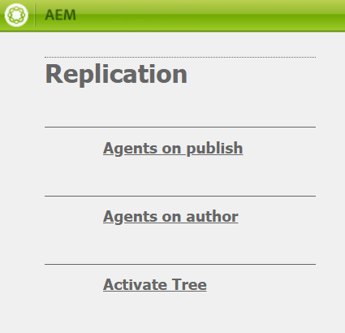

# Configurar ativos AEM com o Portal de marcas {#configure-integration-65}

Os ativos Adobe Experience Manager (AEM) são configurados com o Brand Portal por meio da E/S da Adobe, que obtém um token IMS para autorização do locatário do Brand Portal.

>[!NOTE]
>
>A configuração dos ativos AEM com o Portal da marca por meio da E/S da Adobe é compatível com o AEM 6.5.4.0 e superior.
>
>Anteriormente, o Brand Portal estava configurado na interface clássica via Gateway OAuth herdado, que usa a troca de token JWT para obter um token de Acesso IMS para autorização.
>
>A configuração por meio do Legacy OAuth não é mais compatível a partir de 6 de abril de 2020 e é alterada para configuração por meio da E/S da Adobe.
>
>Se você for um usuário do Brand Portal com configuração no gateway OAuth herdado, é recomendável excluir as configurações existentes e criar uma nova configuração em E/S da Adobe.
>
>No entanto, a configuração existente continuará a funcionar se você não modificar as configurações.

Esta ajuda descreve os dois casos de uso a seguir:
* [Nova configuração](#configure-new-integration-65): Se você for um novo usuário do Brand Portal e quiser configurar sua instância de autor do AEM Assets com o Brand Portal, poderá criar uma nova configuração em E/S da Adobe.
* [Configuração](#upgrade-integration-65)de atualização: Se você for um usuário do Brand Portal com sua instância do autor do AEM Assets configurada com o Brand Portal no gateway OAuth herdado, é recomendável excluir as configurações existentes e criar uma nova configuração na E/S da Adobe.

As informações fornecidas baseiam-se no pressuposto de que qualquer pessoa que leia esta Ajuda está familiarizada com as seguintes tecnologias:

* Instalação, configuração e administração de pacotes do Adobe Experience Manager e do AEM

* Usando sistemas operacionais Linux e Microsoft Windows

## Pré-requisitos {#prerequisites}

Você precisa do seguinte para configurar os ativos AEM com o Portal de marcas:

* Uma instância do autor do AEM Assets em funcionamento com o Service Pack mais recente.
* URL do locatário do Portal de Marcas.
* Um usuário com privilégios de administrador do sistema na organização IMS do locatário do Brand Portal.

[Baixar e instalar o AEM 6.5](#aemquickstart)

[Baixe e instale o AEM Service Pack mais recente](#servicepack)

### Baixar e instalar o AEM 6.5 {#aemquickstart}

É recomendável ter o AEM 6.5 para configurar uma instância do autor de AEM. Se o AEM não estiver funcionando, baixe-o dos seguintes locais:

* Se você já for um cliente do AEM, baixe o AEM 6.5 do site [de licenciamento da](http://licensing.adobe.com)Adobe.

* Se você for um parceiro da Adobe, use o Programa [de treinamento para parceiros da](https://adobe.allegiancetech.com/cgi-bin/qwebcorporate.dll?idx=82357Q) Adobe para solicitar o AEM 6.5.

Depois de baixar o AEM, para obter instruções sobre como configurar uma instância do autor de AEM, consulte [implantação e manutenção](https://helpx.adobe.com/experience-manager/6-5/sites/deploying/using/deploy.html#defaultlocalinstall).

### Baixar e instalar o Service Pack mais recente do AEM {#servicepack}

Para obter instruções detalhadas, consulte

* [Notas de versão do AEM 6.5 Service Pack ](https://helpx.adobe.com/experience-manager/6-5/release-notes/sp-release-notes.html)

**Entre em contato com o suporte** se não conseguir encontrar o pacote AEM ou o Service Pack mais recente.

## Create configuration {#configure-new-integration-65}

Execute as seguintes etapas na sequência listada se você estiver configurando ativos AEM com o Portal de marca pela primeira vez:
1. [Obter certificado público](#public-certificate)
1. [Criar integração de E/S da Adobe](#createnewintegration)
1. [Criar configuração de conta IMS](#create-ims-account-configuration)
1. [Configurar serviço em nuvem](#configure-the-cloud-service)
1. [Testar configuração](#test-integration)

### Criar configuração IMS {#create-ims-configuration}

A configuração do IMS autentica seu locatário do Brand Portal com a instância do autor AEM Assets.

A configuração de IMS inclui duas etapas:

* [Obter certificado público](#public-certificate)
* [Criar configuração de conta IMS](#create-ims-account-configuration)

### Obter certificado público {#public-certificate}

O certificado público permite que você autentique seu perfil em E/S da Adobe.

1. Faça logon na instância de autor do AEM AssetsURL padrão: http:// localhost:4502/aem/start.html
1. No painel **Ferramentas**  , navegue até **[!UICONTROL Segurança]** > Configurações **[!UICONTROL do]** Adobe IMS.

   

1. A página Configurações do Adobe IMS é aberta.

   Clique em **[!UICONTROL Criar]**.

   Isso o levará à página Configuração **[!UICONTROL técnica da conta]** Adobe IMS.

1. Por padrão, a guia **Certificado** é aberta.

   Na **Cloud Solution**, selecione **[!UICONTROL Adobe Brand Portal]**.

1. Marcar a caixa de seleção **[!UICONTROL Criar novo certificado]** e especificar um **alias** para o certificado. O alias serve como nome da caixa de diálogo.

1. Clique em **[!UICONTROL Criar certificado]**. Uma caixa de diálogo é exibida. Clique em **[!UICONTROL OK]** para gerar o certificado público.

   

1. Clique em **[!UICONTROL Baixar chave]** pública e salve o arquivo de certificado *AEM-Adobe-IMS.crt* em seu computador. O arquivo de certificado é usado para [criar a integração](#createnewintegration)de E/S da Adobe.

   

1. Clique em **[!UICONTROL Avançar]**.

   Na guia **Conta** , você cria a conta Adobe IMS, mas para isso você precisará dos detalhes de integração. Mantenha esta página aberta por enquanto.

   Abra uma nova guia e [crie a integração](#createnewintegration) de E/S da Adobe para obter os detalhes de integração das configurações da conta IMS.

### Criar integração de E/S da Adobe {#createnewintegration}

A integração de E/S da Adobe gera a chave da API, o segredo do cliente e a carga (JWT), que são necessários para configurar as configurações da conta IMS.

1. Faça logon no Console de E/S da Adobe com privilégios de administrador de sistema na organização IMS do locatário do Portal de Marcas.

   URL padrão: [https://console.adobe.io/](https://console.adobe.io/)

1. Clique em **[!UICONTROL Criar integração]**.

1. Selecione **[!UICONTROL Acessar uma API]** e clique em **[!UICONTROL Continuar]**.

   

1. Será aberta uma nova página de integração.

   Selecione sua organização na lista suspensa.

   Na **[!UICONTROL Experience Cloud]**, selecione **[!UICONTROL AEM Brand Portal]** e clique em **[!UICONTROL Continuar]**.

   Se a opção Brand Portal estiver desativada para você, verifique se você selecionou a organização correta na caixa suspensa acima da opção Serviços **[!UICONTROL da]** Adobe. Se você não souber sua organização, entre em contato com o administrador.

   

1. Especifique um nome e uma descrição para a integração. Clique em **[!UICONTROL Selecionar um arquivo do seu computador]** e faça upload do `AEM-Adobe-IMS.crt` arquivo baixado na seção [obter certificados](#public-certificate) públicos.

1. Selecione o perfil de sua organização.

   Ou selecione o perfil padrão **[!UICONTROL Assets Brand Portal]** e clique em **[!UICONTROL Criar integração]**. A integração é criada.

1. Clique em **[!UICONTROL Continuar para obter os detalhes]** da integração para exibir as informações da integração.

   Copiar a chave **[!UICONTROL da API]**

   Clique em **[!UICONTROL Recuperar segredo]** do cliente e copie a chave Segredo do cliente.

   

1. Navegue até a guia **[!UICONTROL JWT]** e copie a carga **[!UICONTROL JWT]**.

   As informações da chave da API, da chave Segredo do cliente e da carga JWT serão usadas para criar a configuração da conta IMS.

### Criar configuração de conta IMS {#create-ims-account-configuration}

Verifique se você executou as seguintes etapas:

* [Obter certificado público](#public-certificate)
* [Criar integração de E/S da Adobe](#createnewintegration)

**Etapas para criar a configuração da conta IMS:**

1. Abra a página Configuração IMS, guia **[!UICONTROL Contas]** . Você manteve a página aberta no final da seção, [Obter certificado](#public-certificate)público.

1. Especifique um **[!UICONTROL Título]** para a conta IMS.

   No Servidor **[!UICONTROL de Autorização]**, insira o URL: [https://ims-na1.adobelogin.com/](https://ims-na1.adobelogin.com/)

   Cole a chave da API, o segredo do cliente e a carga JWT que você copiou no final da integração Criar E/S da Adobe.

   Clique em **[!UICONTROL Criar]**.

   A integração é criada.

   

1. Selecione a configuração IMS e clique em **[!UICONTROL Verificar integridade]**. Uma caixa de diálogo é exibida.

   Clique em **[!UICONTROL Verificar]**. Na conexão bem-sucedida, a mensagem *Token recuperado com êxito* é exibida.

   

>[!CAUTION]
>
>Crie apenas uma configuração IMS válida. Não crie várias configurações IMS.
>
> Certifique-se de que a configuração esteja saudável. Caso a configuração não esteja funcionando, exclua-a e crie uma configuração nova e saudável.

   

### Configurar serviço em nuvem {#configure-the-cloud-service}

Execute as seguintes etapas para criar a configuração do serviço em nuvem do Brand Portal:

1. Faça logon na instância do autor do AEM Assets

   URL padrão: http:// localhost:4502/aem/start.html
1. No painel **Ferramentas**  , navegue até Serviços **[!UICONTROL em nuvem > Portal]** da marca AEM.

   A página Configurações do Portal de Marcas é aberta.

1. Clique em **[!UICONTROL Criar]**.

1. Especifique um **[!UICONTROL Título]** para a configuração.

   Selecione a Configuração IMS que você criou na etapa e [crie a configuração](#create-ims-account-configuration)da conta IMS.

   No URL **[!UICONTROL do]** serviço, insira o URL do locatário do Brand Portal.

   

1. Click **[!UICONTROL Save and Close]**. A configuração da nuvem é criada. A instância do autor do AEM Assets agora está integrada ao locatário do Brand Portal.

### Test configuration {#test-integration}

1. Faça logon na instância do autor do AEM Assets

   URL padrão: http:// localhost:4502/aem/start.html

1. No painel **Ferramentas**  , navegue até **[!UICONTROL Implantação > Replicação]**.

   

1. A página Replicação é aberta.

   Clique em **[!UICONTROL Agentes no autor]**.

   

1. Quatro agentes de replicação são criados para cada locatário.

   Localize os agentes de replicação do seu locatário do Brand Portal.

   Clique no URL do agente de replicação.

   

   >[!NOTE]
   >
   >Os agentes de replicação trabalham em paralelo e compartilham a distribuição de tarefas igualmente, aumentando assim a velocidade de publicação em quatro vezes a velocidade original. Depois que o serviço de nuvem é configurado, não é necessária uma configuração adicional para habilitar os agentes de replicação que são ativados por padrão para habilitar a publicação paralela de vários ativos.

   >[!NOTE]
   >
   >Evite desativar qualquer um dos agentes de replicação, pois isso pode causar falha na replicação de alguns ativos.

1. Para verificar a conexão entre o autor do AEM Assets e o Portal de marcas, clique em **[!UICONTROL Testar conexão]**.

   

1. Examine a parte inferior dos resultados do teste para verificar se a replicação foi bem-sucedida.

   

   >[!NOTE]
   >
   >Os agentes de replicação trabalham em paralelo e compartilham a distribuição de tarefas igualmente, aumentando assim a velocidade de publicação em quatro vezes a velocidade original. Depois que o serviço de nuvem é configurado, não é necessária uma configuração adicional para habilitar os agentes de replicação que são ativados por padrão para habilitar a publicação paralela de vários ativos.

1. Verifique os resultados do teste em todos os quatro agentes de replicação um por um.

   >[!NOTE]
   >
   >Evite desativar qualquer um dos agentes de replicação, pois isso pode causar falha na replicação de alguns ativos.

O Brand Portal foi configurado com êxito com a instância do autor do AEM Assets. Agora você pode:

* [Publicar ativos do AEM Assets no Brand Portal](../assets/brand-portal-publish-assets.md)
* [Publicar pastas do AEM Assets no Brand Portal](../assets/brand-portal-publish-folder.md)
* [Publicar coleções dos ativos AEM no Portal de marcas](../assets/brand-portal-publish-collection.md)
* [Configure a Fonte](https://docs.adobe.com/content/help/en/experience-manager-brand-portal/using/asset-sourcing-in-brand-portal/brand-portal-asset-sourcing.html) de ativos, permitindo que os usuários do Brand Portal contribuam e publiquem ativos nos ativos AEM.

## Atualizar configuração {#upgrade-integration-65}

Execute as seguintes etapas na sequência listada para atualizar as configurações existentes:
1. [Verificar trabalhos em execução](#verify-jobs)
1. [Excluir configurações existentes](#delete-existing-configuration)
1. [Criar configuração](#configure-new-integration-65)

### Verificar trabalhos em execução {#verify-jobs}

Certifique-se de que nenhum trabalho de publicação esteja em execução na instância do autor do AEM Assets antes de fazer qualquer modificação. Para isso, você pode verificar todos os quatro agentes de replicação e garantir que a fila seja ideal/vazia.

1. Faça logon na instância do autor do AEM Assets

   URL padrão: http:// localhost:4502/aem/start.html

1. No painel **Ferramentas**  , navegue até **[!UICONTROL Implantação > Replicação]**.

1. A página Replicação é aberta.

   Clique em **[!UICONTROL Agentes no autor]**.

   

1. Localize os agentes de replicação do seu locatário do Brand Portal.

   Certifique-se de que a **Fila esteja inativa** para todos os agentes de replicação; nenhum trabalho de publicação está ativo.

   

### Excluir configurações existentes {#delete-existing-configuration}

Você deve executar a seguinte lista de verificação ao excluir as configurações existentes.
* Excluir todos os quatro agentes de replicação
* Excluir serviço em nuvem
* Excluir usuário MAC

1. Faça logon na instância do autor do AEM Assets e abra o CRX Lite como administrador.

   URL padrão: http:// localhost:4502/crx/de/index.jsp

1. Navegue até `/etc/replications/agents.author` e exclua todos os quatro agentes de replicação do seu locatário do Brand Portal.

   

1. Navegue até `/etc/cloudservices/mediaportal` e exclua a configuração **do Serviço** Cloud.

   

1. Navegue até `/home/users/mac` e exclua o usuário **** MAC do seu locatário do Brand Portal.

   

Agora você pode [criar a configuração](#configure-new-integration-65) na sua instância do autor do AEM 6.5 em E/S da Adobe.

<!--
   Comment Type: draft

   <li> </li>
   -->

<!--
   Comment Type: draft

   <li>Step text</li>
   -->

Depois que a replicação for bem-sucedida, você poderá publicar ativos, pastas e coleções no Brand Portal. Para obter detalhes, consulte:

* [Publicar ativos no Brand Portal](/help/assets/brand-portal-publish-assets.md)
* [Publicar pastas no Brand Portal](/help/assets/brand-portal-publish-folder.md)
* [Publicar coleções no portal de marcas](/help/assets/brand-portal-publish-collection.md)
