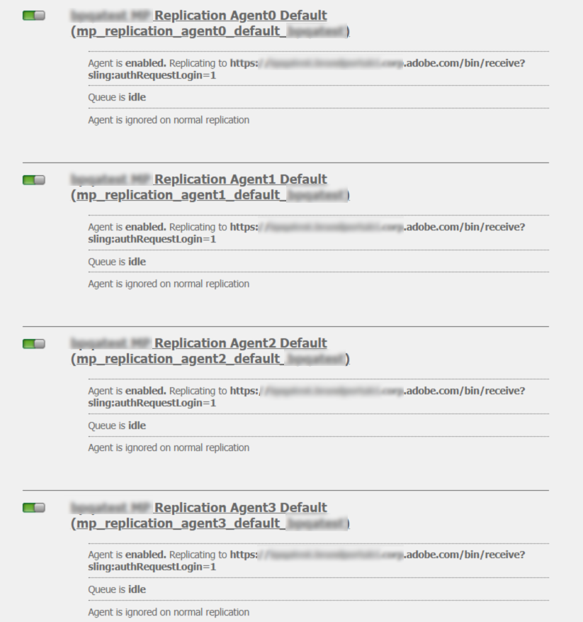

# Configurar o AEM Assets com o Brand Portal {#configure-integration-65}

Os ativos Adobe Experience Manager (AEM) são configurados com o Brand Portal por meio do Adobe Developer Console, que obtém um token IMS para autorização do locatário do Brand Portal.

>[!NOTE]
>
>A configuração de AEM Assets com o Brand Portal por meio do Adobe Developer Console é compatível com o AEM 6.5.4.0 e superior.
>
>Anteriormente, o Brand Portal estava configurado na interface clássica via Gateway OAuth herdado, que usa a troca de token JWT para obter um Token de acesso IMS para autorização.
>
>A configuração por meio do Legacy OAuth não é mais compatível a partir de 6 de abril de 2020 e é alterada para configuração por meio do Adobe Developer Console.

>[!TIP]
>
>***Somente para clientes existentes***
>
>É recomendável continuar usando a configuração existente do gateway OAuth. Caso encontre problemas com a configuração herdada do OAuth Gateway, exclua a configuração existente e crie uma nova configuração por meio do Adobe Developer Console.

Esta ajuda descreve os dois casos de uso a seguir:
* [Nova configuração](#configure-new-integration-65): Se você for um novo usuário do Brand Portal e quiser configurar sua instância de autor de AEM Assets com o Brand Portal, poderá criar uma nova configuração no Adobe Developer Console.
* [Configuração](#upgrade-integration-65)de atualização: Se você for um usuário do Brand Portal com sua instância do autor de AEM Assets configurada com o Brand Portal no gateway OAuth herdado, é recomendável excluir as configurações existentes e criar uma nova configuração no Adobe Developer Console.

As informações fornecidas baseiam-se no pressuposto de que qualquer pessoa que leia esta Ajuda está familiarizada com as seguintes tecnologias:

* Instalação, configuração e administração de pacotes de Adobe Experience Manager e AEM.

* Usando sistemas operacionais Linux e Microsoft Windows.

## Pré-requisitos {#prerequisites}

Você precisa do seguinte para configurar o AEM Assets com o Brand Portal:

* Uma instância do autor de AEM Assets em execução com o Service Pack mais recente.
* URL do locatário do Brand Portal.
* Um usuário com privilégios de administrador do sistema na organização IMS do locatário do Brand Portal.

[Baixar e instalar o AEM 6.5](#aemquickstart)

[Baixe e instale o AEM Service Pack mais recente](#servicepack)

### Baixar e instalar o AEM 6.5 {#aemquickstart}

É recomendável ter o AEM 6.5 para configurar uma instância do autor de AEM. Se o AEM não estiver funcionando, baixe-o dos seguintes locais:

* Se você já for um cliente do AEM, baixe o AEM 6.5 do site [de licenciamento da](http://licensing.adobe.com)Adobe.

* Se você for um parceiro da Adobe, use o Programa  Adobe Partner Training para solicitar o AEM 6.5.

Depois de baixar o AEM, para obter instruções sobre como configurar uma instância do autor de AEM, consulte [implantação e manutenção](https://helpx.adobe.com/experience-manager/6-5/sites/deploying/using/deploy.html#defaultlocalinstall).

### Baixar e instalar o Service Pack mais recente do AEM {#servicepack}

Para obter instruções detalhadas, consulte

* [Notas de versão do AEM 6.5 Service Pack ](https://helpx.adobe.com/experience-manager/6-5/release-notes/sp-release-notes.html)

**Entre em contato com o Atendimento** ao cliente se não conseguir encontrar o pacote AEM ou o Service Pack mais recente.

## Criar configuração {#configure-new-integration-65}

A configuração de AEM Assets com o Brand Portal requer configurações tanto na instância do autor do AEM Assets quanto no Adobe Developer Console.

1. Na instância do autor do AEM Assets, crie uma conta IMS e gere um certificado público (chave pública).

1. No Adobe Developer Console, crie um projeto para seu locatário do Brand Portal (organização).

1. No projeto, configure uma API usando a chave pública para criar uma conexão de conta de serviço (JWT).

1. Obtenha as credenciais da conta de serviço e as informações de carga JWT.

1. Na instância do autor do AEM Assets, configure a conta IMS usando as credenciais da conta de serviço e a carga JWT.

1. Na instância do autor do AEM Assets, configure o serviço em nuvem do Brand Portal usando a conta IMS e o terminal do Brand Portal (URL da organização).

1. Teste a configuração publicando um ativo da instância do autor do AEM Assets para o Brand Portal.

>[!NOTE]
>
>Um locatário do Brand Portal só deve ser configurado com uma instância do autor de AEM Assets.
>
>Não configure um locatário do Brand Portal com várias instâncias do autor de AEM Assets.

Execute as seguintes etapas na sequência listada se você estiver configurando AEM Assets com o Brand Portal pela primeira vez:
1. [Obter certificado público](#public-certificate)
1. [Criar conexão de conta de serviço (JWT)](#createnewintegration)
1. [Configurar conta IMS](#create-ims-account-configuration)
1. [Configurar o serviço em nuvem](#configure-the-cloud-service)
1. [Testar configuração](#test-integration)

### Criar configuração IMS {#create-ims-configuration}

A configuração IMS autentica seu locatário do Brand Portal com a instância do autor do AEM Assets.

A configuração IMS inclui duas etapas:

* [Obter certificado público](#public-certificate)
* [Configurar conta IMS](#create-ims-account-configuration)

### Obter certificado público {#public-certificate}

O certificado público permite autenticar seu perfil no Adobe Developer Console.

1. Faça logon na instância do autor do AEM Assets. O URL padrão é
   `http:// localhost:4502/aem/start.html`
1. From the **Tools**  panel, navigate to **[!UICONTROL Security]** > **[!UICONTROL Adobe IMS Configurations]**.

   

1. Na página Configurações do Adobe IMS, clique em **[!UICONTROL Criar]**.

1. Você é redirecionado para a página Configuração **[!UICONTROL técnica da conta do]** Adobe IMS. By default, the **Certificate** tab opens.

   Selecione a solução em nuvem Portal **[!UICONTROL da marca da]** Adobe.

1. Marque a caixa de seleção **[!UICONTROL Criar novo certificado]** e especifique um **alias** para o certificado. O alias atua como nome da caixa de diálogo.

1. Clique em **[!UICONTROL Criar certificado]**. Em seguida, clique em **[!UICONTROL OK]** na caixa de diálogo para gerar o certificado público.

   

1. Click **[!UICONTROL Download Public Key]** and save the certificate (.crt) file on your machine.

   O arquivo de certificado será usado em outras etapas para configurar a API para o locatário do Brand Portal e gerar credenciais de conta de serviço no Adobe Developer Console.

   

1. Clique em **[!UICONTROL Avançar]**.

   Na guia **Conta** , crie a conta Adobe IMS, mas para isso você precisará das credenciais da conta de serviço geradas no Adobe Developer Console. Mantenha esta página aberta por enquanto.

   Abra uma nova guia e [crie uma conexão de conta de serviço (JWT) no Adobe Developer Console](#createnewintegration) para obter as credenciais e a carga JWT para configurar a conta IMS.

### Criar conexão de conta de serviço (JWT) {#createnewintegration}

No Adobe Developer Console, os projetos e as APIs são configurados no nível da organização (locatário do Brand Portal). Configurar uma API cria uma conexão de conta de serviço (JWT) no Adobe Developer Console. Há dois métodos para configurar a API, gerando um par de chaves (chaves privadas e públicas) ou carregando uma chave pública. Para configurar a instância do autor do AEM Assets com o Brand Portal, você deve gerar um certificado público (chave pública) na instância do autor do AEM Assets e criar credenciais no Adobe Developer Console fazendo upload da chave pública. Essa chave pública é usada para configurar a API para a organização selecionada do Brand Portal e gera as credenciais e a carga JWT para a conta de serviço. Essas credenciais são usadas ainda mais para configurar a conta IMS na instância do autor do AEM Assets. Depois que a conta IMS for configurada, você poderá configurar o serviço em nuvem do Brand Portal na instância do autor do AEM Assets.

Execute as seguintes etapas para gerar as credenciais da conta de serviço e a carga JWT:

1. Faça logon no Adobe Developer Console com privilégios de administrador do sistema na organização IMS (locatário do Brand Portal). O URL padrão é

   [https://www.adobe.com/go/devs_console_ui](https://www.adobe.com/go/devs_console_ui)

   >[!NOTE]
   >
   >Verifique se você selecionou a organização IMS correta (locatário do Brand Portal) na lista suspensa (lista da organização) localizada no canto superior direito.

1. Click **[!UICONTROL Create new project]**. Um projeto em branco é criado para sua organização.

   Clique em **[!UICONTROL Editar projeto]** para atualizar o Título **[!UICONTROL e a]** Descrição **[!UICONTROL do]** projeto e clique em **[!UICONTROL Salvar]**.

   

1. Na guia Visão geral do projeto, clique em **[!UICONTROL Adicionar API]**.

   

1. Na janela Adicionar uma API, selecione **[!UICONTROL AEM Brand Portal]** e clique em **[!UICONTROL Avançar]**.

   Certifique-se de ter acesso ao serviço AEM Brand Portal.

1. Na janela Configurar API, clique em **[!UICONTROL Carregar sua chave]** pública. Em seguida, clique em **[!UICONTROL Selecionar um arquivo]** e faça upload do certificado público (arquivo .crt) que você baixou na seção [obter certificado](#public-certificate) público.

   Clique em **[!UICONTROL Avançar]**.

   

1. Verifique o certificado público e clique em **[!UICONTROL Avançar]**.

1. Selecione o perfil de produto padrão Portal **[!UICONTROL de marcas de]** Ativos de marca e clique em **[!UICONTROL Salvar configuração]**.

   

1. Com a API configurada, você é redirecionado para a visão geral da API. Na navegação à esquerda em **[!UICONTROL Credenciais]**, clique em **[!UICONTROL Service Account (JWT)]**.

   >[!NOTE]
   >
   >Você pode visualização as credenciais e executar outras ações (gerar tokens JWT, copiar detalhes das credenciais, recuperar o segredo do cliente e assim por diante) conforme necessário.

1. Na guia Credenciais **[!UICONTROL do]** cliente, copie a ID **[!UICONTROL do]** cliente.

   Click **[!UICONTROL Retrieve Client Secret]** and copy the **[!UICONTROL client secret]**.

   

1. Navigate to the **[!UICONTROL Generate JWT]** tab and copy the **[!UICONTROL JWT Payload]**.

Agora você pode usar a ID do cliente (chave da API), o segredo do cliente e a carga JWT para [configurar a conta](#create-ims-account-configuration) IMS na instância da nuvem do AEM Assets.

<!--
### Create Adobe I/O integration {#createnewintegration}

Adobe I/O integration generates API Key, Client Secret, and Payload (JWT) which is required in setting up the IMS Account configurations.

1. Login to Adobe I/O Console with system administrator privileges on the IMS organization of the Brand Portal tenant.

   Default URL: [https://console.adobe.io/](https://console.adobe.io/) 

1. Click **[!UICONTROL Create Integration]**.

1. Select **[!UICONTROL Access an API]**, and click **[!UICONTROL Continue]**.

   

1. Create a new integration page opens. 
   
   Select your organization from the drop-down list.

   In **[!UICONTROL Experience Cloud]**, Select **[!UICONTROL AEM Brand Portal]** and click **[!UICONTROL Continue]**. 

   If the Brand Portal option is disabled for you, ensure that you have selected correct organization from the drop-down box above the **[!UICONTROL Adobe Services]** option. If you do not know your organization, contact your administrator.

   

1. Specify a name and description for the integration. Click **[!UICONTROL Select a File from your computer]** and upload the `AEM-Adobe-IMS.crt` file downloaded in the [obtain public certificates](#public-certificate) section.

1. Select the profile of your organization. 

   Or, select the default profile **[!UICONTROL Assets Brand Portal]** and click **[!UICONTROL Create Integration]**. The integration is created.

1. Click **[!UICONTROL Continue to integration details]** to view the integration information. 

   Copy the **[!UICONTROL API Key]** 
   
   Click **[!UICONTROL Retrieve Client Secret]** and copy the Client Secret key.

   

1. Navigate to **[!UICONTROL JWT]** tab, and copy the **[!UICONTROL JWT payload]**.

   The API Key, Client Secret key, and JWT payload information will be used to create IMS account configuration.
-->

### Criar configuração de conta IMS {#create-ims-account-configuration}

Verifique se você executou as seguintes etapas:

* [Obter certificado público](#public-certificate)
* [Criar conexão de conta de serviço (JWT)](#createnewintegration)

Execute as seguintes etapas para configurar a conta IMS que você criou na [obtenção de um certificado](#public-certificate)público.

1. Abra a Configuração IMS e navegue até a guia **[!UICONTROL Contas]** . Você manteve a página aberta ao [obter um certificado](#public-certificate)público.

1. Especifique um **[!UICONTROL Título]** para a conta IMS.

   No **[!UICONTROL Servidor de autorização]**, insira o URL: [https://ims-na1.adobelogin.com/](https://ims-na1.adobelogin.com/)

   Cole a ID do cliente na chave da API, o segredo do cliente e a carga JWT que você copiou ao [criar a conexão](#createnewintegration)da conta de serviço (JWT).

   Clique em **[!UICONTROL Criar]**.

   A conta IMS está configurada.

   

1. Selecione a configuração IMS e clique em **[!UICONTROL Verificar integridade]**.

   Clique em **[!UICONTROL Verificar]** na caixa de diálogo. Na configuração bem-sucedida, será exibida uma mensagem informando que o *Token foi recuperado com êxito*.

   

>[!CAUTION]
>
>Você deve ter apenas uma configuração IMS. Não crie várias configurações IMS.
>
>A configuração IMS deve ser aprovada na verificação de integridade. Se a configuração não for aprovada na verificação de integridade, ela será inválida. Você deve excluí-la e criar uma configuração nova e válida.

### Configurar o serviço em nuvem {#configure-the-cloud-service}

Execute as seguintes etapas para criar o serviço em nuvem do Brand Portal:

1. Faça logon na instância do autor do AEM Assets.

1. From the **Tools**  panel, navigate to **[!UICONTROL Cloud Services]** > **[!UICONTROL AEM Brand Portal]**.

1. Na página Configurações do Brand Portal, clique em **[!UICONTROL Criar]**.

1. Especifique um **[!UICONTROL Título]** para a configuração.

   Selecione a configuração IMS que você criou ao [configurar a conta](#create-ims-account-configuration)IMS.

   In the **[!UICONTROL Service URL]**, enter your Brand Portal tenant (organization) URL.

   

1. Clique em **[!UICONTROL Salvar e fechar]**. A configuração da nuvem é criada. A instância do autor do AEM Assets agora está configurada com o locatário do Brand Portal.

### Testar configuração{#test-integration}

Execute as seguintes etapas para validar a configuração:

1. Faça logon na instância da nuvem do AEM Assets.

1. From the **Tools**  panel, navigate to **[!UICONTROL Deployment]** > **[!UICONTROL Replication]**.

   

1. Na página Replicação, clique em **[!UICONTROL Agentes no autor]**.

   

1. Quatro agentes de replicação são criados para cada locatário.

   Localize os agentes de replicação do seu locatário do Brand Portal.

   Clique no URL do agente de replicação.

   

   >[!NOTE]
   >
   >Os agentes de replicação trabalham em paralelo e compartilham a distribuição de tarefas igualmente, aumentando assim a velocidade de publicação em quatro vezes a velocidade original. Depois que o serviço de nuvem é configurado, não é necessária uma configuração adicional para habilitar os agentes de replicação que são ativados por padrão para habilitar a publicação paralela de vários ativos.

1. Para verificar a conexão entre o AEM Assets e o Brand Portal, clique em **[!UICONTROL Testar conexão]**.

   

   Uma mensagem é exibida na parte inferior da página informando que o pacote de teste foi entregue com êxito.

   

1. Verifique os resultados do teste em todos os quatro agentes de replicação um por um.

   >[!NOTE]
   >
   >Evite desativar qualquer um dos agentes de replicação. Isso pode causar falha na replicação de alguns dos ativos.

A instância do autor do AEM Assets foi configurada com êxito com o Brand Portal, agora é possível:

* [Publicar ativos do AEM Assets no Brand Portal](../assets/brand-portal-publish-assets.md)
* [Publicar pastas do AEM Assets no Brand Portal](../assets/brand-portal-publish-folder.md)
* [Publicar coleções do AEM Assets no Brand Portal](../assets/brand-portal-publish-collection.md)
* [Configure a Fonte](https://docs.adobe.com/content/help/en/experience-manager-brand-portal/using/asset-sourcing-in-brand-portal/brand-portal-asset-sourcing.html) de ativos, permitindo que os usuários do Brand Portal contribuam e publiquem ativos em AEM Assets.

## Atualizar configuração {#upgrade-integration-65}

Execute as seguintes etapas na sequência listada para atualizar as configurações existentes:
1. [Verificar trabalhos em execução](#verify-jobs)
1. [Excluir configurações existentes](#delete-existing-configuration)
1. [Criar configuração](#configure-new-integration-65)

### Verificar trabalhos em execução {#verify-jobs}

Certifique-se de que nenhum trabalho de publicação esteja em execução na instância do autor do AEM Assets antes de fazer qualquer modificação. Para isso, você pode verificar todos os quatro agentes de replicação e garantir que as filas estejam vazias.

1. Faça logon na instância do autor do AEM Assets.

1. No painel **Ferramentas**  , navegue até **[!UICONTROL Implantação]** > Replicação **[!UICONTROL de]** implantação.

1. Na página Replicação, clique em **[!UICONTROL Agentes no autor]**.

   

1. Localize os agentes de replicação do seu locatário do Brand Portal.

   Certifique-se de que a **Fila esteja inativa** para todos os agentes de replicação; nenhum trabalho de publicação está ativo.

   

### Excluir configurações existentes {#delete-existing-configuration}

Você deve executar a seguinte lista de verificação ao excluir as configurações existentes.
* Excluir todos os quatro agentes de replicação
* Excluir serviço em nuvem
* Excluir usuário MAC

1. Faça logon na instância do autor do AEM Assets e abra o CRX Lite como administrador. O URL padrão é

   `http:// localhost:4502/crx/de/index.jsp`

1. Navegue até `/etc/replications/agents.author` e exclua todos os quatro agentes de replicação do seu locatário do Brand Portal.

   

1. Navegue até `/etc/cloudservices/mediaportal` e exclua a configuração **do** Cloud Service.

   

1. Navegue até `/home/users/mac` e exclua o usuário **** MAC do seu locatário do Brand Portal.

   

Agora você pode [criar a configuração](#configure-new-integration-65) por meio do Adobe Developer Console na sua instância de autor do AEM 6.5.

<!--
   Comment Type: draft

   <li> </li>
   -->

<!--
   Comment Type: draft

   <li>Step text</li>
   -->

