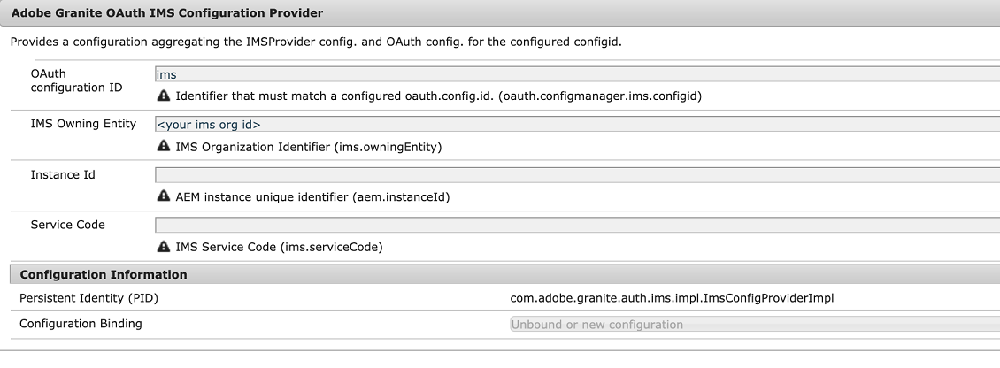

# Configurar o Experience Manager Assets para Adobe Asset Link {#adobe-asset-link}

[Adobe Asset Link (AAL)](https://www.adobe.com/br/creativecloud/business/enterprise/adobe-asset-link.html) O simplifica a colaboração entre criadores e profissionais de marketing no processo de criação de conteúdo. Ele conecta os Adobe Experience Manager Assets aos aplicativos de desktop do Creative Cloud, Adobe InDesign, Adobe Photoshop e Adobe Illustrator. O painel Adobe Asset Link permite que os criadores acessem e modifiquem o conteúdo armazenado no AEM Assets sem deixar os aplicativos criativos com os quais estão mais familiarizados.

Para configurar o Experience Manager Assets para ser usado com o Asset Link, implemente as seguintes tarefas. Use a conta de administrador do Experience Manager para fazer a configuração:

1. Instale os pacotes conforme necessário. Os detalhes estão em [pré-requisitos](#prerequisites).

1. Configure o Experience Manager [manualmente](#manual-configuration) ou usando uma [pacote](#configure-using-package).

1. Para mapear usuários licenciados do Creative Cloud com usuários do Experience Manager, gerencie [controle de acesso do usuário](#user-access).

1. Criar [índice de consulta personalizado](#create-custom-index), configurar [Representações de FPO](/help/assets/configure-fpo-renditions.md) para InDesign, configure [Integração do Adobe Stock](/help/assets/aem-assets-adobe-stock.md)e configurar [pesquisa visual ou de semelhança](https://experienceleague.adobe.com/docs/experience-manager-65/assets/using/search-assets.html#configvisualsearch).

## Pré-requisitos e suporte para várias funcionalidades {#prerequisites}

Certifique-se de instalar o service pack e o pacote adequados conforme necessário. Consulte os requisitos a seguir para cada versão do Experience Manager e para obter recursos específicos.

| Recurso de ativos | Versão Experience Manager e requisitos de suporte |
|--- |--- |
| O Asset Link funciona por padrão | Experience Manager 6.5 e 6.5.2 ou posterior.   Experience Manager 6.4.4 e 6.4.6 ou posterior.   O Adobe recomenda instalar a versão mais recente [Experience Manager service pack (SP)](https://experienceleague.adobe.com/docs/experience-manager-release-information/aem-release-updates/aem-releases-updates.html) antes de utilizar AAL. |
| O Asset Link funciona após instalar um pacote | Para o Experience Manager 6.4.0 - 6.4.3, instale [adobe-asset-link-support](https://experience.adobe.com/#/downloads/content/software-distribution/en/aem.html?package=/content/software-distribution/en/details.html/content/dam/aem/public/adobe/packages/cq640/featurepack/adobe-asset-link-support) pacote. |
| Integração com o Adobe Stock | Experience Manager 6.4.2 ou posterior |
| Pesquisa visual ou semelhante | Experience Manager 6.5.0 ou posterior |

## Configure o Experience Manager usando o pacote de configuração {#configure-using-package}

O Adobe recomenda instalar [adobe-asset-link-config](https://experience.adobe.com/#/downloads/content/software-distribution/en/aem.html?package=/content/software-distribution/en/details.html/content/dam/aem/public/adobe/packages/cq640/product/assets/adobe-asset-link-config) pacote de configuração para automatizar a maioria das tarefas de configuração, seguido por algumas tarefas manuais. Como alternativa, você pode [configurar manualmente](#manual-configuration).

>[!CAUTION]
>
>Se sua instância do Experience Manager estiver configurada para fazer logon de usuário com contas do Adobe IMS, não use o pacote de configuração . Em vez disso, [configurar manualmente](#manual-configuration) sua instância do Experience Manager.

1. Para abrir o Gerenciador de pacotes, na interface da Web do Experience Manager, acesse **[!UICONTROL Ferramentas]** > **[!UICONTROL Implantação]** > **[!UICONTROL Compartilhamento de pacotes]**. Instalar `adobe-asset-link-config` pacote.

1. Acesse **[!UICONTROL Ferramentas]** > **[!UICONTROL Operações]** > **[!UICONTROL Console da Web]**. Localizar **[!UICONTROL Provedor de IMS do Adobe Granite OAuth]** e clique em para editá-la.

   Defina as seguintes propriedades e salve as alterações.

   * [!UICONTROL Mapeamentos de grupo]: Deixe em branco, a menos que desejado. Para obter detalhes, consulte [Mapeamento de grupo](#group-mapping).
   * [!UICONTROL Organização]: Insira a ID da organização usada na Adobe Admin Console. Para obter mais informações sobre IDs da organização, consulte [Criar grupo de usuários](https://helpx.adobe.com/enterprise/using/create-aal-user-group.html).

1. Localizar **[!UICONTROL Manipulador de Autenticação do Portador Adobe Granite]** e clique em para editá-la.

   Adicionar **[!UICONTROL InDesignAem2]** IDs do cliente para a **[!UICONTROL IDs de cliente OAuth permitidas]** propriedade de configuração.

## Configurar manualmente o Experience Manager {#manual-configuration}

Configure manualmente o Experience Manager se você optar por não usar um pacote de configuração ou se a implantação do Experience Manager estiver configurada para suportar o logon de usuário com contas do Adobe IMS.

Para configurar manualmente o Experience Manager:

1. Para acessar o gerenciador de configuração, acesse **[!UICONTROL Ferramentas]** > **[!UICONTROL Operações]** > **[!UICONTROL Console da Web]**. Selecionar **[!UICONTROL OSGi]** > **[!UICONTROL Configuração]** no menu na parte superior.

1. Localize a variável **[!UICONTROL Provedor de IMS do Adobe Granite OAuth]** e clique em para editá-la.

   Defina a seguinte configuração e clique em **[!UICONTROL Salvar]**.

   * [!UICONTROL Endpoint de autorização]: ` https://ims-na1.adobelogin.com/ims/authorize/v1`
   * [!UICONTROL Endpoint de token]: ` https://ims-na1.adobelogin.com/ims/token/v1`
   * [!UICONTROL Endpoint do perfil]: ` https://ims-na1.adobelogin.com/ims/profile/v1`
   * [!UICONTROL URL de validação]: ` https://ims-na1.adobelogin.com/ims/validate_token/v1`
   * [!UICONTROL Organização]: Defina para a ID da organização no [Adobe Admin Console](https://adminconsole.adobe.com/).
   * [!UICONTROL Mapeamentos de grupo]: Deixe em branco a menos que você tenha um caso especial. Para obter detalhes, consulte [Mapeamento de grupo](#group-mapping).

1. Localizar **[!UICONTROL Manipulador de Autenticação do Portador Adobe Granite]** e clique em para editá-la.

   Adicione as seguintes IDs de cliente ao **[!UICONTROL IDs de cliente OAuth permitidas]** propriedade de configuração: `InDesignAem2, cc-europa-desktop_0_1, cc-europa-desktop_1_0, cc-europa-desktop_2_0, cc-europa-desktop_3_0, cc-europa-desktop_4_0, cc-europa-desktop_5_0, cc-europa-desktop_6_0, cc-europa-desktop_7_0, cc-europa-desktop_8_0, cc-europa-desktop_9_0, and cc-europa-desktop_10_0`.

   Para adicionar cada `Client ID`, clique em `+`. Clique em **[!UICONTROL Salvar]** após adicionar todas as IDs.

1. Em **[!UICONTROL Aplicativo e provedor OAuth do Adobe Granite]** , inspecione o **[!UICONTROL Manipulador de Autenticação OAuth do Adobe Granite]** instâncias. Se você localizar uma instância com o `Config ID` valor de `ims`, use-o para obter as instruções deste procedimento. Caso contrário, clique em `+` para criar uma instância de configuração. Defina os seguintes valores de propriedade e clique em **[!UICONTROL Salvar]**.

   * [!UICONTROL ID do cliente]: Não alterar
   * [!UICONTROL Segredo do cliente]: Não alterar
   * [!UICONTROL ID de configuração]: ` ims`
   * [!UICONTROL Escopo]: `AdobeID, OpenID, read_organizations` (outros valores também podem estar na configuração )
   * [!UICONTROL ID do provedor]: ` ims`
   * [!UICONTROL Criar usuários]: ` Checked`
   * [!UICONTROL Propriedade da ID do usuário]: `Email` para configuração recém-criada. Caso contrário, não altere.

1. Localize a variável **[!UICONTROL Manipulador de sincronização padrão do Apache Jackrabbit Oak]** com a **[!UICONTROL Nome do manipulador de sincronização]** `ims` e clique em para editá-la.

   Defina as seguintes propriedades de configuração e clique em **[!UICONTROL Salvar]**.

   * [!UICONTROL Tempo de expiração do usuário e expiração da associação do usuário]: Tempo em minutos após &#39;m&#39; sem espaço. Por exemplo, `15m` por 15 minutos. Para obter detalhes, consulte [Mapeamento de grupo](#group-mapping).
   * [!UICONTROL Associação automática de usuário]: Não alterar
   * [!UICONTROL Associação dinâmica do usuário]: ` Deslect`

1. Localize a variável **[!UICONTROL Manipulador de Autenticação OAuth do Adobe Granite]** e clique em para editá-la. Sem fazer alterações, clique em **[!UICONTROL Salvar]**.

1. Para ajustar a prioridade relativa do manipulador de autenticação do portador, no CRXDE, navegue até `/apps/system/config`. Localizar `com.adobe.granite.auth.oauth.impl.BearerAuthenticationHandler.config` e abra sua configuração. No final, adicione `service.ranking=I"-10"`. Salve as alterações.

   >[!NOTE]
   >
   >Cada solicitação autenticada com um token portador incorre na sobrecarga de três chamadas para o Adobe IMS, sincronização de usuários e a criação de um token de logon no Experience Manager. Para superar essa sobrecarga, o Adobe Asset Link captura o token de login retornado na resposta do Experience Manager e o envia com solicitações subsequentes. Para que esse processo funcione, a prioridade relativa do manipulador de autenticação do portador deve ser ajustada.

1. (Opcional) Se os usuários do Experience Manager tiverem nomes de domínio em letras maiúsculas ou minúsculas misturadas em suas IDs de email, selecione **[!UICONTROL Alterar o bloqueio do usuário para minúsculas]** em **[!UICONTROL Configurações da plataforma ACP do Adobe Granite]** no console Experience Manager Web.

## Configuração adicional após a migração para Perfis de negócios {#configure-migration-activity}

Os usuários do Adobe Asset Link podem se conectar ao Experience Manager para permitir o logon de IMS a partir do Creative Cloud principal para a organização (CCE). O Experience Manager usa as IDs do cliente para identificar a organização IMS permitida. Após a migração para Perfis de negócios, é necessário configurar a ID do cliente e a Chave secreta para a organização IMS no Experience Manager para o Manipulador de autenticação do portador. Para obter mais informações sobre Perfis de Negócios, consulte [introdução a perfis do Adobe](https://helpx.adobe.com/enterprise/kb/introducing-adobe-profiles.html).

A configuração adicional é necessária apenas se você estiver usando diferentes organizações do Adobe IMS para o Experience Manager e o Creative Cloud for Enterprise (CCE) e se uma relação de confiança de domínio for estabelecida entre essas duas organizações.

>[!NOTE]
>
>* A correção para Perfis de negócios é fornecida no Experience Manager 6.5.11.0.
>* A configuração existente continua a funcionar se você estiver usando a mesma organização do Adobe IMS com o Experience Manager e o CCE.

**Pré-requisitos**

1. Uma instância Experience Manager ativa e em execução com a Autenticação do Portador configurada para AAL.
1. Instale o seguinte pacote (Service Pack 11) em sua instância do Experience Manager 6.5.

   [Baixe o Experience Manager 6.5.11.0](https://experience.adobe.com/#/downloads/content/software-distribution/en/aem.html?package=/content/software-distribution/en/details.html/content/dam/aem/public/adobe/packages/cq650/servicepack/aem-service-pkg-6.5.11.zip)

1. Contato [!UICONTROL Suporte ao cliente] para obter a ID do cliente e a chave secreta para a autenticação do portador da sua organização IMS.

Veja a seguir as configurações adicionais necessárias após a migração para Perfis de negócios:

1. Em **[!UICONTROL Fornecedor de Configuração do Adobe Granite OAuth IMS]** (`com.adobe.granite.auth.ims.impl.ImsConfigProviderImpl`), definir:

   * ID de configuração OAuth (`oauth.configmanager.ims.configid`): `ims` (Verificar uma vez, talvez já esteja configurado)

   * Entidade proprietária do IMS (`ims.owningEntity`): Sua ID organizacional IMS

   

1. Abrir **[!UICONTROL Manipulador de Autenticação do Portador]** e adicione a ID do cliente obtida de [!UICONTROL Suporte ao cliente] à lista de **[!UICONTROL IDs de cliente OAuth permitidas]**.

   

1. Abrir **[!UICONTROL Aplicativo e provedor OAuth do Adobe Granite]** e adicione o **[!UICONTROL ID do cliente]** e **[!UICONTROL Segredo do cliente]** (Chave secreta) obtida do Suporte ao cliente.

   Certifique-se de que **[!UICONTROL ID de configuração]** campo (`oauth.config.id`) contém o mesmo valor fornecido em **[!UICONTROL ID de configuração OAuth]** campo (`oauth.configmanager.ims.configid`) acima.

   

1. Abrir **[!UICONTROL Pré-processador de Token de Troca de Cluster do Adobe Granite IMS]** e defina-a como `enable`.

## Gerenciar o controle de acesso do usuário {#user-access}

Esta seção descreve como gerenciar usuários e seu acesso ao repositório do Experience Manager.

### Mapeamento de grupo {#group-mapping}

O mapeamento de grupo determina como os grupos no Experience Manager correspondem aos grupos no Adobe IMS. Ele desempenha uma função importante na maneira como os usuários do Adobe Asset Link recebem permissão para acessar o Experience Manager Assets.

Quando usado com o Adobe Asset Link, o Experience Manager delega funções de gerenciamento de usuários ao Adobe IMS. Ele cria automaticamente usuários e grupos que correspondem a usuários e grupos no Adobe IMS. Além disso, sincroniza usuários, grupos e associações de grupo no Experience Manager para corresponder àqueles no Adobe IMS.

Por exemplo, considere um cenário em que os usuários do Adobe Asset Link são membros do grupo do Adobe IMS Assets/link-usuários. Nesse caso, um grupo sincronizado chamado assetlink-users é criado no Experience Manager quando um usuário desse grupo do Adobe IMS se conecta ao Adobe Asset Link pela primeira vez. Cada novo usuário no grupo do Adobe IMS é adicionado ao grupo correspondente no Experience Manager quando ele se conecta ao Experience Manager por meio do Adobe Asset Link pela primeira vez.

Os grupos no Experience Manager que correspondem e são sincronizados com grupos no Adobe IMS podem receber acesso diretamente ou tornando-os membros de outro grupo. Este é um exemplo de como as permissões podem ser gerenciadas.

As seguintes regras se aplicam aos mapeamentos de grupo no Experience Manager:

* Certifique-se de que **[!UICONTROL Mapeamentos de grupo]** propriedade em **[!UICONTROL Provedor de IMS do Adobe Granite OAuth]** está em branco.
* A associação ao grupo de usuários do Adobe Asset Link é avaliada quando o usuário se autentica e o período de tempo em **[!UICONTROL Tempo de expiração do usuário]** propriedade em **[!UICONTROL Manipulador de sincronização padrão do Apache Jackrabbit Oak]** a configuração do já passou. Atualmente, os usuários podem ser adicionados e removidos dos grupos no Experience Manager para sincronizar com o que foi encontrado no Adobe IMS.
* Evite conflitos de nome de grupo. Certifique-se de que os nomes usados para grupos criados no Adobe IMS (para gerenciar usuários) sejam diferentes de todos os nomes de grupos do sistema de Experience Manager.

   Por exemplo, verifique se eles são diferentes da variável `dam-users` e os grupos criados pelo administrador do Experience Manager.

   Um grupo do Adobe IMS cujo nome está em conflito com o nome de um grupo de sistema do Experience Manager ou de um grupo criado manualmente não é usado para controlar as permissões do usuário.
* Se um usuário do Adobe IMS se conectar a uma instância do Experience Manager, na qual o nome do usuário está em conflito com um usuário do Experience Manager criado anteriormente, o usuário do Adobe IMS recebe outro nome com números adicionados para torná-lo exclusivo.

**Configurar controle de acesso pela primeira vez**

Os usuários que se conectam por meio do Adobe Asset Link só podem visualizar e interagir com ativos depois que receberem a permissão necessária. O [Mapeamento de grupo](#group-mapping) A seção acima discute como os grupos de usuários são criados no Experience Manager, que correspondem e são sincronizados com os grupos de usuários em sua organização no Adobe IMS. É recomendável que os administradores do Experience Manager usem esses grupos para gerenciar o controle de acesso dos usuários do Adobe Asset Link.

Para cada grupo de Experience Manager sincronizado com um grupo do Adobe IMS (usado para gerenciar o controle de acesso do usuário):

1. Certifique-se de que o grupo tenha um membro que possa ser usado para uma conexão inicial do Adobe Asset Link.
1. Use esse usuário para fazer logon no Adobe Asset Link e se conectar ao Experience Manager. Espera-se que esta conexão falhe.
1. No Experience Manager, localize o grupo que corresponde ao grupo no Adobe IMS e conceda a ele o controle de acesso desejado. Por exemplo, o novo grupo torna-se membro do grupo dam-users.
1. Feche o Adobe Asset Link e reinicie o aplicativo Creative Cloud.
1. Para verificar se o usuário tem o acesso esperado, abra novamente o Adobe Asset Link.

Depois que essas etapas são executadas, outros usuários no mesmo grupo podem se conectar ao Experience Manager com o Adobe Asset Link na primeira tentativa. Eles têm automaticamente as mesmas permissões que os outros usuários do grupo.

## Gerenciar usuários do Experience Manager para o Adobe Asset Link {#manage-users}

Os usuários do Adobe Asset Link podem se conectar ao Experience Manager quando estiverem conectados ao aplicativo Creative Cloud. Essa autenticação usa a tecnologia Adobe IMS e cria informações do usuário no Experience Manager, caso não exista. É comum que os clientes da Experience Manager enterprise gerenciem seus usuários com um provedor de identidade externo integrado ao Experience Manager. Os provedores de identidade incluem o Adobe IMS e outros produtos que usam os protocolos SAML e LDAP. Como alternativa, os usuários podem ser criados e gerenciados localmente no Experience Manager.

Os usuários que se conectam ao Experience Manager do Adobe Asset Link não têm conflito com as informações de usuário existentes armazenadas no Experience Manager a partir do logon direto anterior, se:

* Todos os nomes de usuário usados para logon direto no Experience Manager são diferentes dos nomes de usuário usados no Adobe IMS para logon no Creative Cloud.
* O Adobe IMS é usado como o provedor de identidade para logon de Experience Manager direto.
* Os usuários se conectam ao Experience Manager a partir do Adobe Asset Link antes de fazer logon direto no Experience Manager com a mesma conta.

Por outro lado, as informações do usuário criadas como resultado do logon direto no Experience Manager devem ser atualizadas para funcionar com o Adobe Asset Link, nos seguintes cenários:

* O mesmo nome de usuário, como o endereço de email do usuário, é usado para ambos - a conta no Creative Cloud, que usa o Adobe IMS, e a conta em um provedor de identidade externo diferente do Adobe IMS.
* O mesmo nome de usuário é usado para ambos: a conta no Creative Cloud e uma conta Experience Manager local.
* As contas do Creative Cloud no Adobe IMS são Federated IDs, que são atendidas pelo mesmo provedor de identidade externa integrado ao Experience Manager para logon direto.

Os usuários criados por meio desses cenários não têm uma propriedade necessária para os usuários, que são sincronizados com o Adobe IMS.

Para atualizar esses usuários no Experience Manager para trabalhar com o Adobe Asset Link:

1. No console da Web do Experience Manager, localize **[!UICONTROL Apache Jackrabbit Oak External PrincipalConfiguration]** e clique em para editá-la. Desmarque a opção **[!UICONTROL Proteção de identidade externa]** e clique em **[!UICONTROL Salvar]**.
1. Para acessar a interface de Gerenciamento de usuários no Experience Manager, navegue até **[!UICONTROL Ferramentas]** > **[!UICONTROL Segurança]** > **[!UICONTROL Usuários]**. Selecione o usuário que deseja atualizar e anote o caminho do URL do fim do navegador para esse usuário, começando com `/home/users`. Como alternativa, você pode pesquisar o nome do usuário no CRXDE. Um exemplo de caminho de usuário: `/home/users/x/xTac082TDh-guJzzG7WM`.
1. No CRXDE, navegue até o caminho do usuário, selecione o nó do usuário e visualize as propriedades do nó selecionando o **[!UICONTROL Propriedades]** na área do meio inferior. Este nó tem um `jcr:primaryType` valor da propriedade de `rep:User`.
1. Na parte inferior do **[!UICONTROL Propriedades]** , insira uma `Name` valor de `rep:externalId`, `Type` valor de `String`e um `Value` valor de `rep:authorizableId`;`ims`, onde `rep:authorizableId` é o valor da variável `rep:authorizableId` propriedade do nó. (Um ponto e vírgula é usado sem espaços para separar a variável `rep:authorizableId` valor de `ims`.)
1. Clique no botão **[!UICONTROL Adicionar]** à direita da nova entrada e clique em **[!UICONTROL Salvar tudo]**.
1. Repita as etapas de 2 a 5 para qualquer outro usuário que desejar atualizar para trabalhar com o Adobe Asset Link.
1. No console da Web do Experience Manager, localize **[!UICONTROL Apache Jackrabbit Oak External PrincipalConfiguration]** e clique em para editá-la. Desmarque a opção **[!UICONTROL Proteção de identidade externa]** e clique em **[!UICONTROL Salvar]**.

>[!NOTE]
>
>Se os serviços não forem restaurados em alguns minutos, reinicie o Experience Manager para permitir autenticações bem-sucedidas.

Após essa alteração, um usuário atualizado do Experience Manager pode se conectar ao Adobe Asset Link e continuar a usar o método de logon direto no Experience Manager usado antes da atualização. Na autenticação bem-sucedida com o Adobe IMS, as informações de perfil do usuário do Experience Manager são sincronizadas com o perfil do usuário no Adobe IMS.

Há um método pelo qual uma migração em massa de vários usuários do Experience Manager pode ser executada para permitir que eles trabalhem com o Adobe Asset Link. Entre em contato com o Adobe Care para obter mais informações e ajuda para ativar essa opção.

Como alternativa às etapas, em determinadas circunstâncias, um usuário do Adobe Asset Link pode receber acesso rápido ao Experience Manager. Nesses casos, as informações pré-existentes do usuário são encontradas e excluídas com o Experience Manager User Management ou o Experience Manager CRXDE antes de serem conectadas ao Adobe Asset Link. Novas informações de usuário são criadas no Experience Manager após a conexão. Use essa abordagem somente se tiver certeza de que não há dados importantes adicionados como filho do nó do usuário. Esses dados extras são qualquer nó que é filho do nó do usuário diferente de `tokens`, `preferences`, `profile`, `profiles`, `profiles/public`e `rep:policy/*` nós.

## Fluxo de trabalho de início automático para processar ativos condicionalmente {#auto-start-workflow}

No Experience Manager 6.4 e no Experience Manager 6.5, os administradores podem configurar workflows para executar e processar ativos automaticamente com base em condições predefinidas.

A configuração é útil para usuários de linha de negócios e profissionais de marketing, por exemplo, para criar um fluxo de trabalho personalizado em algumas pastas específicas. Digamos que todos os ativos da sessão fotográfica de uma agência possam ter marca d&#39;água ou que todos os ativos carregados por um freelancer possam ser processados para criar representações específicas.

Para obter mais informações e para a configuração de Experience Manager, consulte [executar fluxo de trabalho automaticamente em ativos](https://experienceleague.adobe.com/docs/experience-manager-65/assets/using/assets-workflow.html#auto-execute-workflow-on-some-assets).

## Criar um índice personalizado nas versões do Experience Manager 6.4.x {#create-custom-index}

Experience Manager contém índices usados para consulta. Crie o seguinte índice personalizado para a versão especificada. O Experience Manager 6.5.0 contém esse índice por padrão. O Adobe Asset Link requer esse índice para determinar quais ativos um usuário fez check-out.

1. No CRXDE, localize `/oak:index` nó . Criar um nó chamado `cqDrivelock` e defina seu `Type` para `oak:QueryIndexDefinition`.

1. Adicione as seguintes propriedades ao novo nó e salve as alterações:

   * `Name: type; Type: string; Value: property`

   * `Name: propertyNames; Type: Name[] (click the "Multi" button); Value: cq:drivelock`

## Configurar pesquisa visual ou de semelhança {#configure-visual-similarity-search}

O recurso de Pesquisa visual permite procurar ativos visualmente semelhantes no repositório do AEM Assets, usando o painel Adobe Asset Link. A funcionalidade está disponível na versão 6.5.0 ou posteriores e somente os ativos indexados são pesquisados. Para obter mais informações, consulte [como configurar a pesquisa visual](https://experienceleague.adobe.com/docs/experience-manager-65/assets/using/search-assets.html#configvisualsearch).

## Gerar para representações somente posicionamento para o Adobe InDesign {#fpo-renditions}

O Experience Manager fornece representações que são usadas somente para posicionamento (FPO). Essas renderizações de FPO têm um tamanho de arquivo pequeno, mas têm a mesma proporção. Se uma representação FPO não estiver disponível para um ativo, o Adobe InDesign usará o ativo original. Esse mecanismo de fallback garante que o fluxo de trabalho criativo continue sem interrupções. Para obter mais informações, consulte [gerar representações FPO](/help/assets/configure-fpo-renditions.md).

## Integração com o Adobe Stock {#adobe-stock-integration}

As organizações integram suas contas do Adobe Stock ao Experience Manager Assets. Ajuda os profissionais de marketing a disponibilizar fotos, vetores, ilustrações, vídeos, modelos e ativos 3D licenciados e isentos de royalties para seus projetos de criação e marketing. Profissionais de criação podem usar esses ativos usando o painel Asset Link .

Para integrar-se ao Adobe Stock, consulte [Ativos da Adobe Stock na Experience Manager Assets](/help/assets/aem-assets-adobe-stock.md). O Experience Manager 6.4.2 ou posterior é necessário para integração com o Adobe Stock.

## Solução de problemas relacionados ao Experience Manager {#troubleshoot}

Se tiver problemas ao configurar ou usar o Adobe Asset Link, tente o seguinte:

* Certifique-se de que a implantação atenda aos pré-requisitos. Especificamente, verifique se os pacotes de recursos ou pacotes apropriados estão instalados.
* Entre em contato com o parceiro da organização ou o integrador de sistemas.
* Se os usuários do Creative Cloud não conseguirem verificar nos ativos com check-out, verifique a capitalização dos nomes de domínio nas IDs de email. Para corrigir, consulte [configuração manual](#manual-configuration).
* Para obter mais informações, consulte [solucionar problemas do Asset Link](https://helpx.adobe.com/enterprise/kb/asset-link-troubleshooting.html).

>[!MORELIKETHIS]
>
>* [Sobre o Adobe Asset Link](https://helpx.adobe.com/enterprise/using/adobe-asset-link.html)
>* [Use o Asset Link no aplicativo de desktop do Creative Cloud e gerencie ativos](https://helpx.adobe.com/enterprise/using/manage-assets-using-adobe-asset-link.html)
>* [Configurar o Adobe Experience Manager Assets as a Cloud Service](https://helpx.adobe.com/enterprise/using/configure-aem-assets-for-asset-link.html).

