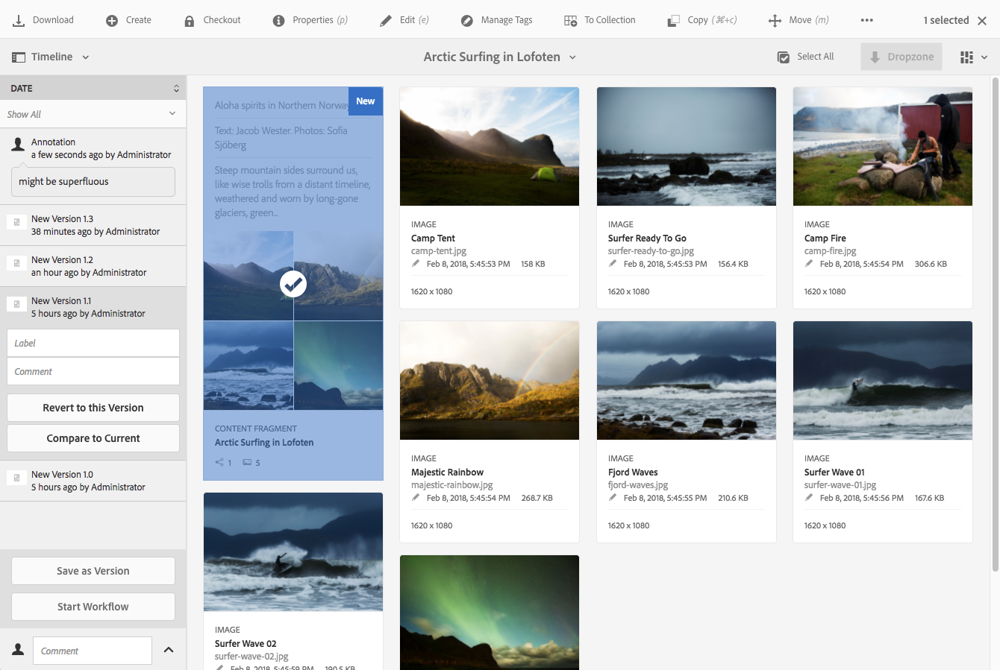

# Gerenciamento dos fragmentos de conteúdo{#managing-content-fragments}

Os Fragmentos de conteúdo são armazenados como **Assets**, portanto, são gerenciados principalmente no console **Assets**.

>[!NOTE]
>
>Fragmentos de conteúdo são usados com páginas de criação; consulte [Criação de página com fragmentos de conteúdo](/help/sites-authoring/content-fragments.md).

## Criação de fragmentos de conteúdo {#creating-content-fragments}

### Criação de um modelo de conteúdo {#creating-a-content-model}

[A ](/help/assets/content-fragments/content-fragments-models.md) modelagem do fragmento de conteúdo pode ser ativada e criada antes da criação de fragmentos de conteúdo com conteúdo estruturado.

>[!NOTE]
>
>Consulte [Desenvolvimento de fragmentos de conteúdo](/help/sites-developing/customizing-content-fragments.md) para obter mais informações sobre modelos; usado para fragmentos de conteúdo simples.

### Criação de um fragmento de conteúdo {#creating-a-content-fragment}

O método de criação de um fragmento de conteúdo é (basicamente) o mesmo para fragmentos simples e estruturados:

1. Navegue até a pasta **Ativos** na qual deseja criar o fragmento.
1. Selecione **Criar** e **Fragmento de conteúdo** para abrir o assistente.
1. A primeira etapa do assistente requer que você especifique a base do novo fragmento.

   * Isso pode ser:

      * [Modelo](/help/sites-developing/content-fragment-templates.md)  - por exemplo, Fragmento  **simples**

      * [Modelo](/help/assets/content-fragments/content-fragments-models.md)  - usado para criar um fragmento que requer conteúdo estruturado; por exemplo,  **** Airportmodel
   * Todos os modelos e modelos disponíveis são exibidos.

   Após a seleção, use **Next** para continuar.

   

1. Na etapa **Propriedades**, especifique:

   * **Básico**

      * **Título**

         O título do fragmento.

         Obrigatório.

      * **Descrição**

      * **Tags**
   * **Avançado**

      * **Nome**

         O nome; será usada para formar o URL.

         Obrigatório; serão derivadas automaticamente do título, mas podem ser atualizadas.

1. Selecione **Criar** para concluir a ação e, em seguida, **Abra** o fragmento para editar ou retorne ao console com **Concluído**.

## Ações para um fragmento de conteúdo {#actions-for-a-content-fragment}

No console **Assets**, uma variedade de ações está disponível para seus fragmentos de conteúdo:

* Na barra de ferramentas; após a seleção do fragmento, todas as ações apropriadas estarão disponíveis.
* Como [ações rápidas](/help/sites-authoring/basic-handling.md#quick-actions); um subconjunto de ações disponível para os cartões de fragmento individuais.

Selecione o fragmento para exibir a barra de ferramentas com as ações aplicáveis:

* **Download**

   * Salve o fragmento como um arquivo ZIP; você pode definir se deseja incluir Elementos, Variações, Metadados.

* **Criar**
* **Check-out**
* **Propriedades**

   * Permite exibir e/ou editar os metadados do fragmento.

* **Editar**

   * Permite [abrir o fragmento para edição de conteúdo](/help/assets/content-fragments/content-fragments-variations.md) junto com seus elementos, variações, conteúdo associado e metadados.

* **Gerenciar tags**
* **Para a coleção**

   * Adicione o fragmento a uma coleção.
   * Isso também pode ser feito ao [associar uma coleção ao fragmento](/help/assets/content-fragments/content-fragments-assoc-content.md#adding-associated-content).

* **Copiar**/**Colar**

* **Mover**
* **Publicação rápida**
* **Gerenciar publicação**
* **Excluir**

>[!NOTE]
>
>Muitas delas são [ações padrão para Assets](/help/assets/manage-assets.md) e/ou o [AEM aplicativo de desktop](https://docs.adobe.com/content/help/en/experience-manager-desktop-app/using/using.html).

## Abrir o Editor de fragmentos {#opening-the-fragment-editor}

Para abrir o fragmento para edição:

>[!CAUTION]
>
>Para editar um fragmento de conteúdo, você precisa [das permissões apropriadas](/help/sites-developing/customizing-content-fragments.md#asset-permissions). Entre em contato com o administrador do sistema em caso de problemas.

1. Use o console **Assets** para navegar até o local do fragmento de conteúdo.
1. Abra o fragmento para edição, por:

   * Clicar/tocar no link do fragmento ou fragmento (depende da exibição do console).
   * Selecionar o fragmento e, em seguida, **Editar** na barra de ferramentas.

   O editor de fragmentos abrirá:

   

   >[!NOTE]
   >
   >1. Uma mensagem será exibida quando o fragmento já estiver referenciado em uma página de conteúdo.
   >2. O painel lateral pode ser oculto/exibido usando o ícone **Alternar painel lateral**.

1. Navegue pelos três modos usando os ícones no painel lateral:

   * Variações: [Editar o conteúdo](#editing-the-content-of-your-fragment) e [Gerenciar as variações](#creating-and-managing-variations-within-your-fragment)

   * [Anotações](/help/assets/content-fragments/content-fragments-variations.md#annotating-a-content-fragment)
   * [Conteúdo associado](#associating-content-with-your-fragment)
   * [Metadados](#viewing-and-editing-the-metadata-properties-of-your-fragment)

   

1. Depois de fazer alterações, use **Save** ou **Cancel** conforme necessário.

   >[!NOTE]
   >
   >Tanto **Salvar** quanto **Cancelar** sairão do editor - consulte [Salvar, cancelar e versões](#save-cancel-and-versions) para obter informações completas sobre como ambas as opções operam para fragmentos de conteúdo.

## Salvar, cancelar e versões {#save-cancel-and-versions}

>[!NOTE]
>
>As versões também podem ser [criadas, comparadas e revertidas da Linha do tempo](/help/assets/content-fragments/content-fragments-managing.md#timeline-for-content-fragments).

O editor tem duas opções:

* **Salvar**

   Salva as alterações mais recentes e saia do editor.

   >[!CAUTION]
   >
   >Para editar um fragmento de conteúdo, você precisa [das permissões apropriadas](/help/sites-developing/customizing-content-fragments.md#asset-permissions). Entre em contato com o administrador do sistema em caso de problemas.

   >[!NOTE]
   >
   >É possível permanecer no editor, fazendo uma série de alterações, antes de selecionar **Save**.

   >[!CAUTION]
   >
   >Além de simplesmente salvar suas alterações, **Save** também atualiza quaisquer referências e garante que o dispatcher seja liberado conforme necessário. Essas alterações podem levar tempo para serem processadas. Devido a isso, pode haver um impacto no desempenho de um sistema grande/complexo/com carga intensa.
   >
   >
   >Lembre-se disso ao usar **Save** e entrar novamente rapidamente no editor de fragmentos para fazer e salvar mais alterações.

* **Cancelar**

   Sairá do editor sem salvar as alterações mais recentes.

Ao editar o fragmento de conteúdo, o AEM cria automaticamente versões para garantir que o conteúdo anterior possa ser restaurado se você **Cancelar** fizer as alterações:

1. Quando um fragmento de conteúdo é aberto para edição, o AEM verifica a existência do token baseado em cookie que indica se existe uma *sessão de edição*:

   1. Se o token for encontrado, o fragmento será considerado parte da sessão de edição existente.
   2. Se o token estiver *não* disponível e o usuário começar a editar o conteúdo, uma versão será criada e um token para esta nova sessão de edição será enviado para o cliente, onde será salvo em um cookie.

2. Embora haja uma sessão de edição *ativa*, o conteúdo que está sendo editado é automaticamente salvo a cada 600 segundos (padrão).

   >[!NOTE]
   >
   >O intervalo de salvamento automático é configurável usando o mecanismo `/conf`.
   >
   >
   >Valor padrão, consulte:
   >
   >
   >`/libs/settings/dam/cfm/jcr:content/autoSaveInterval`

3. Se o usuário selecionar para **Cancelar** a edição, a versão criada no início da sessão de edição será restaurada e o token será removido para encerrar a sessão de edição.
4. Se o usuário selecionar para **Salvar** as edições, os elementos/variações atualizados serão mantidos e o token será removido para encerrar a sessão de edição.

## Edição do conteúdo do fragmento {#editing-the-content-of-your-fragment}

Após abrir o fragmento, você pode usar a guia [Variations](/help/assets/content-fragments/content-fragments-variations.md) para criar o conteúdo.

## Criação e gerenciamento de variações dentro do fragmento {#creating-and-managing-variations-within-your-fragment}

Depois de criar o conteúdo Principal, você pode criar e gerenciar [Variations](/help/assets/content-fragments/content-fragments-variations.md) desse conteúdo.

## Associar conteúdo ao fragmento {#associating-content-with-your-fragment}

Você também pode [associar o conteúdo](/help/assets/content-fragments/content-fragments-assoc-content.md) a um fragmento. Isso fornece uma conexão para que os ativos (ou seja, imagens) possam ser usados (opcionalmente) com o fragmento quando ele é adicionado a uma página de conteúdo.

## Visualização e edição dos metadados (propriedades) do fragmento {#viewing-and-editing-the-metadata-properties-of-your-fragment}

É possível exibir e editar as propriedades de um fragmento usando a guia [Metadados](/help/assets/content-fragments/content-fragments-metadata.md).

## Linha do tempo dos fragmentos de conteúdo {#timeline-for-content-fragments}

Além das opções padrão, [Linha do tempo](/help/assets/manage-assets.md#timeline) fornece informações e ações específicas para fragmentos de conteúdo:

* Exibir informações sobre versões, comentários e anotações
* Ações para versões

   * **[Reverter para esta versão](#reverting-to-a-version)**  (selecione um fragmento existente e, em seguida, uma versão específica)

   * **[Comparar a atual](#comparing-fragment-versions)**  (selecione um fragmento existente e, em seguida, uma versão específica)

   * Adicionar um **Rótulo** e/ou **Comentário** (selecione um fragmento existente e, em seguida, uma versão específica)

   * **Salvar como versão**  (selecione um fragmento existente, em seguida, a seta para cima na parte inferior da Linha do tempo)

* Ações para anotações

   * **Excluir**

>[!NOTE]
>
>Os comentários são:
>
>* Funcionalidade padrão para todos os ativos
>* Feito na Linha do Tempo
>* Relacionado ao ativo de fragmento

>
>
As anotações (para Fragmentos de conteúdo) são:
>
>* Inserido no editor de fragmentos
>* Específico de um segmento selecionado de texto no fragmento

>

Por exemplo:

## Comparação de versões do fragmento {#comparing-fragment-versions}

A ação **Comparar a Atual** está disponível na [Linha do tempo](/help/assets/content-fragments/content-fragments-managing.md#timeline-for-content-fragments) depois de selecionar uma versão específica.

Isso abrirá:

* a versão **Atual** (mais recente) (esquerda)

* a versão selecionada **v&lt;*x.y*** (direita)

Elas serão mostradas lado a lado, onde:

* Quaisquer diferenças são destacadas

   * Texto excluído - vermelho
   * Texto inserido - verde
   * Texto substituído - azul

* O ícone de tela cheia permite abrir uma versão por conta própria; em seguida, voltar para a exibição paralela
* Você pode **Reverter** para a versão específica
* **** Retorna você ao console

>[!NOTE]
>
>Não é possível editar o conteúdo do fragmento ao comparar fragmentos.

## Reverter para uma versão  {#reverting-to-a-version}

Você pode reverter para uma versão específica do fragmento:

* Diretamente da [Linha do tempo](/help/assets/content-fragments/content-fragments-managing.md#timeline-for-content-fragments).

   Selecione a versão necessária e depois a ação **Reverter para esta Versão**.

* Ao [comparar uma versão com a versão atual](/help/assets/content-fragments/content-fragments-managing.md#comparing-fragment-versions) é possível **Reverter** para a versão selecionada.

## Publicação e referência a um fragmento {#publishing-and-referencing-a-fragment}

>[!CAUTION]
>
>Se o fragmento for baseado em um modelo, verifique se o modelo [foi publicado](/help/assets/content-fragments/content-fragments-models.md#publishing-a-content-fragment-model).
>
>Se você publicar um fragmento de conteúdo para o qual o modelo ainda não foi publicado, uma lista de seleção indicará isso e o modelo será publicado com o fragmento.

Fragmentos de conteúdo devem ser publicados para uso no ambiente de publicação. Eles podem ser publicados:

* Após a criação; no console **Assets**.
* Ao [publicar uma página que usa o fragmento](/help/sites-authoring/content-fragments.md#publishing); o fragmento será listado nas referências da página.

>[!CAUTION]
>
>Depois que um fragmento tiver sido publicado e/ou referenciado, AEM exibirá um aviso quando um autor abrir o fragmento para edição novamente. Isso serve para avisar que as alterações no fragmento também afetarão as páginas referenciadas.

## Excluir um fragmento {#deleting-a-fragment}

Para excluir um fragmento:

1. No console **Assets**, navegue até o local do fragmento de conteúdo.
2. Selecione o fragmento.

   >[!NOTE]
   >
   >A ação **Delete** não está disponível como uma ação rápida.

3. Selecione **Delete** na barra de ferramentas.
4. Confirme a ação **Delete**.

   >[!CAUTION]
   >
   >Se o fragmento já estiver referenciado em uma página, você verá uma mensagem de aviso e será solicitado a confirmar se deseja continuar com uma **Exclusão forçada**. O fragmento, junto com seu componente do fragmento de conteúdo, será excluído de qualquer página de conteúdo.
