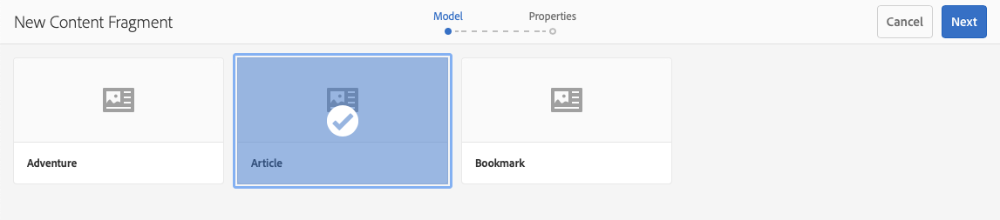
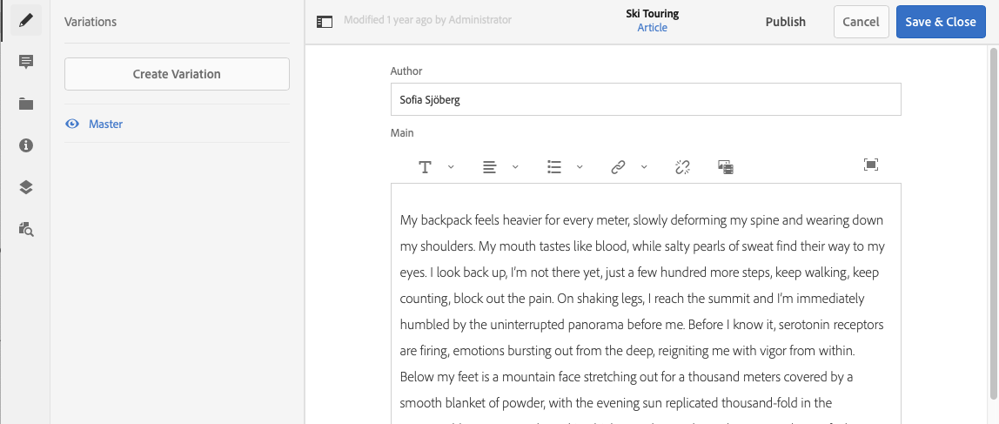
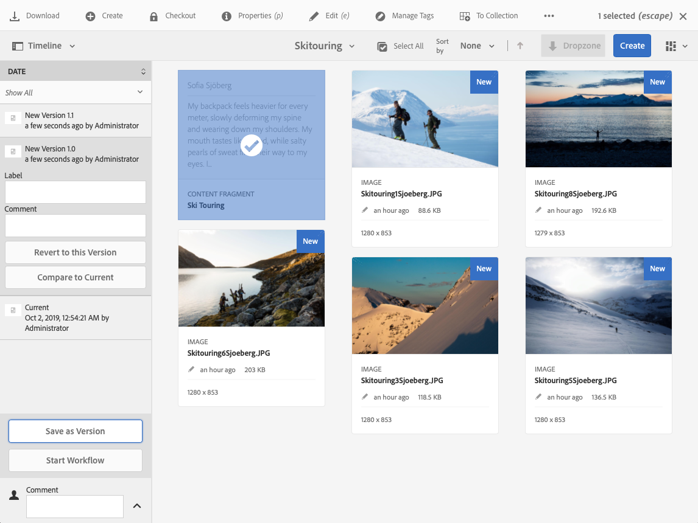
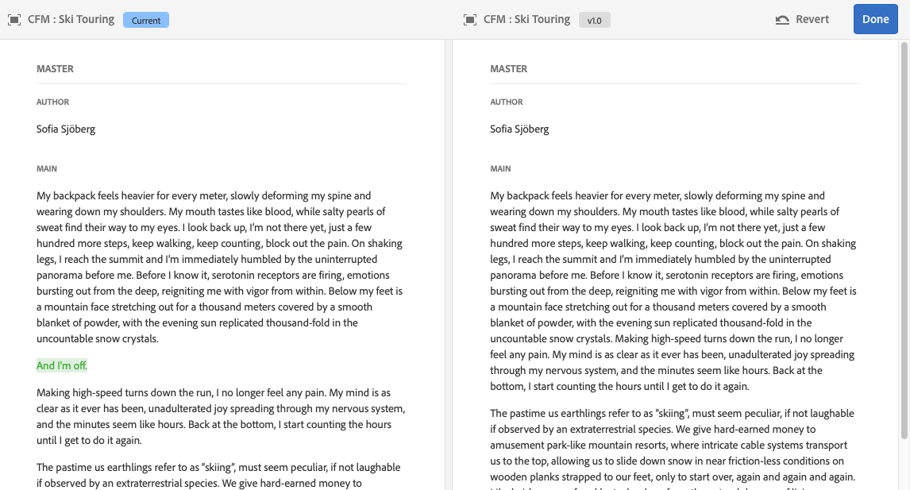

# Gerenciamento dos fragmentos de conteúdo {#managing-content-fragments}

Saiba como usar o console Assets para gerenciar os Fragmentos de conteúdo AEM, a base do seu conteúdo sem periféricos.

Após definir os [Modelos de fragmento de conteúdo](#creating-a-content-model), você pode usá-los para [criar os Fragmentos de conteúdo](#creating-a-content-fragment).

O [Editor de fragmento de conteúdo](#opening-the-fragment-editor) fornece vários [modos](#modes-in-the-content-fragment-editor) para permitir que você:

* [Editar o ](#editing-the-content-of-your-fragment) conteúdo e  [gerenciar variações](#creating-and-managing-variations-within-your-fragment)
* [Anotar em seu fragmento](/help/assets/content-fragments/content-fragments-variations.md#annotating-a-content-fragment)
* [Associar conteúdo ao fragmento](#associating-content-with-your-fragment)
* [Configurar os metadados](#viewing-and-editing-the-metadata-properties-of-your-fragment)
* [Exibir a árvore de estrutura](/help/assets/content-fragments/content-fragments-structure-tree.md)
* [Visualizar a representação JSON](/help/assets/content-fragments/content-fragments-json-preview.md)

>[!NOTE]
>
>Fragmentos de conteúdo podem ser usados:
>
>* ao criar páginas; consulte [Criação de página com fragmentos de conteúdo](/help/sites-authoring/content-fragments.md).
>* para [Entrega de conteúdo sem cabeçalho usando Fragmentos de conteúdo com GraphQL](/help/assets/content-fragments/content-fragments-graphql.md).

>[!NOTE]
>
>Os Fragmentos de conteúdo são armazenados como **Assets**, portanto, são gerenciados principalmente no console **Assets**.

## Criação de fragmentos de conteúdo {#creating-content-fragments}

### Criação de um modelo de conteúdo {#creating-a-content-model}

[A ](/help/assets/content-fragments/content-fragments-models.md) modelagem do fragmento de conteúdo pode ser ativada e criada antes da criação de fragmentos de conteúdo com conteúdo estruturado.

### Criação de um fragmento de conteúdo {#creating-a-content-fragment}

O método de criação de um fragmento de conteúdo é:

1. Navegue até a pasta **Ativos** na qual deseja criar o fragmento.
1. Selecione **Criar** e **Fragmento de conteúdo** para abrir o assistente.
1. A primeira etapa do assistente requer que você especifique a base do novo fragmento.

   * [Modelo](/help/assets/content-fragments/content-fragments-models.md)  - usado para criar um fragmento que requer conteúdo estruturado; por exemplo, o  **** Adventremodel

      * Todos os modelos disponíveis são exibidos.

   Após a seleção, use **Next** para continuar.

   

1. Na etapa **Propriedades**, especifique:

   * **Básico**

      * **Título**

         O título do fragmento.

         Obrigatório.

      * **Descrição**

      * **Tags**
   * **Avançado**

      * **Nome**

         O nome; será usada para formar o URL.

         Obrigatório; serão derivadas automaticamente do título, mas podem ser atualizadas.

1. Selecione **Criar** para concluir a ação e, em seguida, **Abra** o fragmento para editar ou retorne ao console com **Concluído**.

   >[!NOTE]
   >No modo **List** do console, você pode atualizar as **Configurações de exibição** para ativar a coluna **Modelo de fragmento de conteúdo**.

## Ações para um fragmento de conteúdo no console Ativos {#actions-for-a-content-fragment-assets-console}

No console **Assets**, uma variedade de ações está disponível para seus fragmentos de conteúdo:

* Na barra de ferramentas; após a seleção do fragmento, todas as ações apropriadas estarão disponíveis.
* Como [ações rápidas](/help/sites-authoring/basic-handling.md#quick-actions); um subconjunto de ações disponível para os cartões de fragmento individuais.

Selecione o fragmento para exibir a barra de ferramentas com as ações aplicáveis:

* **Download**

   * Salve o fragmento como um arquivo ZIP; você pode definir se deseja incluir Elementos, Variações, Metadados.

* **Criar**
* **Check-out**
* **Propriedades**

   * Permite exibir e/ou editar os metadados do fragmento.

* **Editar**

   * Permite [abrir o fragmento para edição de conteúdo](/help/assets/content-fragments/content-fragments-variations.md) junto com seus elementos, variações, conteúdo associado e metadados.

* **Gerenciar tags**
* **Para a coleção**
* **Copiar**  (e  **Colar**)
* **Mover**
* **Publicação rápida**
* **Gerenciar publicação**
* **Excluir**

>[!NOTE]
>
>Muitas delas são [ações padrão para Assets](/help/assets/manage-assets.md) e/ou o [AEM aplicativo de desktop](https://experienceleague.adobe.com/docs/experience-manager-desktop-app/using/using.html?lang=pt-BR).

## Abrir o Editor de fragmentos {#opening-the-fragment-editor}

Para abrir o fragmento para edição:

>[!CAUTION]
>
>Para editar um fragmento de conteúdo, você precisa [das permissões apropriadas](/help/sites-developing/customizing-content-fragments.md#asset-permissions). Entre em contato com o administrador do sistema em caso de problemas.

>[!CAUTION]
>
>Para editar um fragmento de conteúdo, você precisa das permissões apropriadas. Entre em contato com o administrador do sistema em caso de problemas.

1. Use o console **Assets** para navegar até o local do fragmento de conteúdo.
1. Abra o fragmento para edição, por:

   * Clicar/tocar no link do fragmento ou fragmento (depende da exibição do console).
   * Selecionar o fragmento e, em seguida, **Editar** na barra de ferramentas.

1. O editor de fragmentos será aberto. Faça as alterações necessárias:

   

1. Depois de fazer alterações, use **Salvar e fechar**.

<!-- 
1. After making changes, use **Save**, **Save & close** or **Close** as required.

   >[!NOTE]
   >
   >**Save & close** is available via the **Save** dropdown.

   >[!NOTE]
   >
   >Both **Save & Close** and **Close** will exit the editor - see [Save, Close and Versions](#save-close-and-versions) for full information on how the various options operate for content fragments.
-->

## Modos e ações no Editor de fragmento de conteúdo {#modes-actions-content-fragment-editor}

Há vários modos e ações disponíveis no Editor de fragmentos de conteúdo.

### Modos no Editor de fragmento de conteúdo {#modes-in-the-content-fragment-editor}

Navegue pelos vários modos usando os ícones no painel lateral:

* Variações: [Editar o conteúdo](#editing-the-content-of-your-fragment) e [Gerenciar as variações](#creating-and-managing-variations-within-your-fragment)

* [Anotações](/help/assets/content-fragments/content-fragments-variations.md#annotating-a-content-fragment)
* [Conteúdo associado](#associating-content-with-your-fragment)
* [Metadados](#viewing-and-editing-the-metadata-properties-of-your-fragment)
* [Árvore de estrutura](/help/assets/content-fragments/content-fragments-structure-tree.md)
* [Visualizar](/help/assets/content-fragments/content-fragments-json-preview.md)

### Ações da barra de ferramentas no Editor de fragmentos de conteúdo {#toolbar-actions-in-the-content-fragment-editor}

Alguns recursos na barra de ferramentas superior estão disponíveis em vários modos:

<!-- screenshot changed from original text see commented out below -->

* Uma mensagem será exibida quando o fragmento já estiver referenciado em uma página de conteúdo. Você pode **Fechar** a mensagem.

* O painel lateral pode ser oculto/exibido usando o ícone **Alternar painel lateral**.

* Abaixo do nome do fragmento, você pode ver o nome do [Modelo do fragmento de conteúdo](/help/assets/content-fragments/content-fragments-models.md) usado para criar o fragmento atual:

   * O nome também é um link que abrirá o editor de modelo.

* Ver o status do fragmento; por exemplo, informações sobre quando foi criado, modificado ou publicado.

* **Salvar e fechar**

<!--
Some features in the top toolbar are available from multiple modes:

* A message will be shown when the fragment is already referenced on a content page. You can **Close** the message.

* The side panel can be hidden/shown using the **Toggle Side Panel** icon.

* Underneath the fragment name you can see the name of the [Content Fragment Model](/help/assets/content-fragments/content-fragments-models.md) used for creating the current fragment:

  * The name is also a link that will open the model editor.

* See the status of the fragment; for example, information about when it was created, modified or published. The status is also color-coded:

  * **New**: grey
  * **Draft**: blue
  * **Published**: green
  * **Modified**: orange
  * **Deactivated**: red

* **Save** provides access to the **Save & close** option.
  
* The three dots (**...**) drop-down provides access to additional actions:
  * **Update page references**
    * This updates any page references. 
  * **[Quick publish](#publishing-and-referencing-a-fragment)**
  * **[Manage Publication](#publishing-and-referencing-a-fragment)**
-->

<!--
This updates any page references and ensures that the Dispatcher is flushed as required. -->

<!--
## Save, Close and Versions {#save-close-and-versions}

>[!NOTE]
>
>Versions can also be [created, compared and reverted from the Timeline](/help/assets/content-fragments/content-fragments-managing.md#timeline-for-content-fragments).

The editor has various options:

* **Save** and **Save & close**

  * **Save** will save the latest changes and remain in the editor.
  * **Save & close** will save the latest changes and exit the editor.

  >[!CAUTION]
  >
  >To edit a content fragment you need [the appropriate permissions](/help/sites-developing/customizing-content-fragments.md#asset-permissions). Please contact your system administrator if you are experiencing issues. 

  >[!NOTE]
  >
  >It is possible to remain in the editor, making a series of changes, before saving.

  >[!CAUTION]
  >
  >In addition to simply saving your changes, the actions also update any references and ensures that the Dispatcher is flushed as required. These changes can take time to process. Due to this, there can be a performance impact on a large/complex/heavily-loaded system.
  >
  >Please bear this in mind when using **Save & close** and then quickly re-entering the fragment editor to make and save further changes.

* **Close**

  Will exit the editor without saving the latest changes (i.e made since the last **Save**).

While editing your content fragment AEM automatically creates versions to ensure that prior content can be restored if you cancel your changes (using **Close** without saving):

1. When a content fragment is opened for editing AEM checks for the existence of the cookie-based token that indicates whether an *editing session* exists:

   1. If the token is found, the fragment is considered to be part of the existing editing session.
   2. If the token is *not* available and the user starts editing content, a version is created and a token for this new editing session is sent to the client, where it is saved in a cookie.

2. While there is an *active* editing session, the content being edited is automatically saved every 600 seconds (default).

   >[!NOTE]
   >
   >The auto save interval is configurable using the `/conf` mechanism.
   >
   >Default value, see:
   >&nbsp;&nbsp;`/libs/settings/dam/cfm/jcr:content/autoSaveInterval`

3. If the user cancels the edit, the version created at the start of the editing session is restored and the token is removed to end the editing session.
4. If the user selects to **Save** the edits, the updated elements/variations are persisted and the token is removed to end the editing session.
-->

## Edição do conteúdo do fragmento {#editing-the-content-of-your-fragment}

Após abrir o fragmento, você pode usar a guia [Variations](/help/assets/content-fragments/content-fragments-variations.md) para criar o conteúdo.

## Criação e gerenciamento de variações dentro do fragmento {#creating-and-managing-variations-within-your-fragment}

Depois de criar o conteúdo Principal, você pode criar e gerenciar [Variations](/help/assets/content-fragments/content-fragments-variations.md) desse conteúdo.

## Associar conteúdo ao fragmento {#associating-content-with-your-fragment}

Você também pode [associar o conteúdo](/help/assets/content-fragments/content-fragments-assoc-content.md) a um fragmento. Isso fornece uma conexão para que os ativos (ou seja, imagens) possam ser usados (opcionalmente) com o fragmento quando ele é adicionado a uma página de conteúdo.

## Visualização e edição dos metadados (propriedades) do fragmento {#viewing-and-editing-the-metadata-properties-of-your-fragment}

É possível exibir e editar as propriedades de um fragmento usando a guia [Metadados](/help/assets/content-fragments/content-fragments-metadata.md).

## Linha do tempo dos fragmentos de conteúdo {#timeline-for-content-fragments}

Além das opções padrão, [Linha do tempo](/help/assets/manage-assets.md#timeline) fornece informações e ações específicas para fragmentos de conteúdo:

* Exibir informações sobre versões, comentários e anotações
* Ações para versões

   * **[Reverter para esta versão](#reverting-to-a-version)**  (selecione um fragmento existente e, em seguida, uma versão específica)

   * **[Comparar a atual](#comparing-fragment-versions)**  (selecione um fragmento existente e, em seguida, uma versão específica)

   * Adicionar um **Rótulo** e/ou **Comentário** (selecione um fragmento existente e, em seguida, uma versão específica)

   * **Salvar como versão**  (selecione um fragmento existente, em seguida, a seta para cima na parte inferior da Linha do tempo)

* Ações para anotações

   * **Excluir**

>[!NOTE]
>
>Os comentários são:
>
>* Funcionalidade padrão para todos os ativos
>* Feito na Linha do Tempo
>* Relacionado ao ativo de fragmento

>
>As anotações (para Fragmentos de conteúdo) são:
>
>* Inserido no editor de fragmentos
>* Específico de um segmento selecionado de texto no fragmento

>

Por exemplo:

## Comparação de versões do fragmento {#comparing-fragment-versions}

A ação **Comparar a Atual** está disponível na [Linha do tempo](/help/assets/content-fragments/content-fragments-managing.md#timeline-for-content-fragments) depois de selecionar uma versão específica.

Isso abrirá:

* a versão **Atual** (mais recente) (esquerda)

* a versão selecionada **v&lt;*x.y*** (direita)

Elas serão mostradas lado a lado, onde:

* Quaisquer diferenças são destacadas

   * Texto excluído - vermelho
   * Texto inserido - verde
   * Texto substituído - azul

* O ícone de tela cheia permite abrir uma versão por conta própria; em seguida, voltar para a exibição paralela
* Você pode **Reverter** para a versão específica
* **** Retorna você ao console

>[!NOTE]
>
>Não é possível editar o conteúdo do fragmento ao comparar fragmentos.

## Reverter para uma versão  {#reverting-to-a-version}

Você pode reverter para uma versão específica do fragmento:

* Diretamente da [Linha do tempo](/help/assets/content-fragments/content-fragments-managing.md#timeline-for-content-fragments).

   Selecione a versão necessária e depois a ação **Reverter para esta Versão**.

* Ao [comparar uma versão com a versão atual](/help/assets/content-fragments/content-fragments-managing.md#comparing-fragment-versions) é possível **Reverter** para a versão selecionada.

## Publicação e referência a um fragmento {#publishing-and-referencing-a-fragment}

>[!CAUTION]
>
>Se o fragmento for baseado em um modelo, verifique se o modelo [foi publicado](/help/assets/content-fragments/content-fragments-models.md#publishing-a-content-fragment-model).
>
>Se você publicar um fragmento de conteúdo para o qual o modelo ainda não foi publicado, uma lista de seleção indicará isso e o modelo será publicado com o fragmento.

Os Fragmentos de conteúdo devem ser publicados para uso no ambiente de publicação. Eles podem ser publicados:

* Após a criação; usando [ações disponíveis no console Assets](#actions-for-a-content-fragment-assets-console).
* No [Editor de fragmento de conteúdo](#toolbar-actions-in-the-content-fragment-editor).
* Ao [publicar uma página que usa o fragmento](/help/sites-authoring/content-fragments.md#publishing); o fragmento será listado nas referências da página.

>[!CAUTION]
>
>Depois que um fragmento tiver sido publicado e/ou referenciado, AEM exibirá um aviso quando um autor abrir o fragmento para edição novamente. Isso serve para avisar que as alterações no fragmento também afetarão as páginas referenciadas.

## Excluir um fragmento {#deleting-a-fragment}

Para excluir um fragmento:

1. No console **Assets**, navegue até o local do fragmento de conteúdo.
2. Selecione o fragmento.

   >[!NOTE]
   >
   >A ação **Delete** não está disponível como uma ação rápida.

3. Selecione **Delete** na barra de ferramentas.
4. Confirme a ação **Delete**.

   >[!CAUTION]
   >
   >Se o fragmento já estiver referenciado em uma página, você verá uma mensagem de aviso e será solicitado a confirmar se deseja continuar com uma **Exclusão forçada**. O fragmento, junto com seu componente do fragmento de conteúdo, será excluído de qualquer página de conteúdo.
