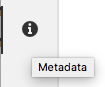

# Metadados - propriedades dos fragmentos{#metadata-fragment-properties}

## Editar propriedades/metadados {#editing-properties-meta-data}

É possível visualização e editar os metadados (propriedades) dos fragmentos de conteúdo:

1. No console **Ativos** , navegue até o local do fragmento de conteúdo.
1. Ou:

   * Selecione Propriedades [**da** Visualização para abrir as caixas de diálogo](/help/assets/manage-assets.md#editing-properties). Uma vez aberto para exibição, você também pode editar.
   * Abra o fragmento [de conteúdo para Editar](/help/assets/content-fragments/content-fragments-managing.md#opening-the-fragment-editor)e selecione **Metadados** no painel lateral.

   

1. A guia **Básico** fornece opções que podem ser visualizações ou editadas:

   * Miniatura, para a qual você pode **carregar a imagem**
   * **Título**
   * **Descrição**
   * **Tags**
   * Criado (somente para exibição)

   

