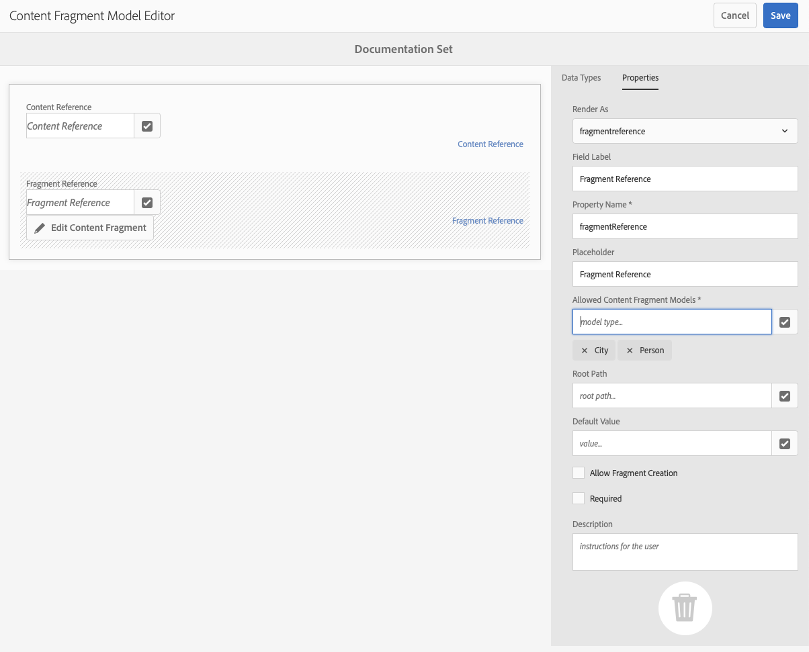

# Modelos de fragmentos do conteúdo {#content-fragment-models}

Os modelos de fragmento de conteúdo no AEM definem a estrutura do conteúdo para os seus [fragmentos de conteúdo](/help/assets/content-fragments/content-fragments.md), servindo como base para o seu conteúdo headless.

Para usar modelos de fragmento de conteúdo, é possível:

1. [Habilite a funcionalidade de Modelo de Fragmento de Conteúdo para sua instância](/help/assets/content-fragments/content-fragments-configuration-browser.md).
1. [Crie](#creating-a-content-fragment-model) e [configure](#defining-your-content-fragment-model) seus Modelos de fragmentos de conteúdo.
1. [Habilite os Modelos de fragmento de conteúdo](#enabling-disabling-a-content-fragment-model) para uso ao criar Fragmentos de conteúdo.
1. [Autorizar os modelos de fragmento de conteúdo nas pastas de ativos necessárias](#allowing-content-fragment-models-assets-folder) ao configurar as **Políticas**.

## Criação de um modelo de fragmento de conteúdo {#creating-a-content-fragment-model}

1. Navegue até **Ferramentas**, **Assets** e abra os **Modelos de Fragmento de Conteúdo**.
1. Navegue até a pasta apropriada à sua [configuração](/help/assets/content-fragments/content-fragments-configuration-browser.md).
1. Use **Criar** para abrir o assistente.

   >[!CAUTION]
   >
   >Se o [uso de modelos de fragmento de conteúdo não foi habilitado](/help/assets/content-fragments/content-fragments-configuration-browser.md), a opção **Criar** não estará disponível.

1. Especifique o **título do modelo**. Você também pode adicionar **Marcas**, uma **Descrição** e selecionar **Habilitar modelo** para [habilitar o modelo](#enabling-disabling-a-content-fragment-model), se necessário.

   

1. Use **Criar** para salvar o modelo vazio. Uma mensagem indica o sucesso da ação. Você pode selecionar **Abrir** para editar imediatamente o modelo, ou **Concluído** para retornar ao console.

## Definição do modelo de fragmento de conteúdo {#defining-your-content-fragment-model}

O modelo de fragmento de conteúdo define efetivamente a estrutura dos fragmentos de conteúdo resultantes usando uma seleção de **[Tipos de dados](#data-types)**. Usando o editor do modelo, é possível adicionar instâncias dos tipos de dados e configurá-las para criar os campos necessários:

>[!CAUTION]
>
>A edição de um modelo de fragmento de conteúdo existente pode afetar fragmentos dependentes.

1. Navegue até **Ferramentas**, **Assets** e abra os **Modelos de Fragmento de Conteúdo**.

1. Navegue até a pasta que contém o modelo de fragmento de conteúdo.

1. Abra o modelo necessário para **Edição**; use a ação rápida ou selecione o modelo e depois a ação na barra de ferramentas.

   Uma vez aberto, o editor de modelo mostra:

   * à esquerda: campos já definidos
   * à direita: **Tipos de dados** disponíveis para criar campos (e **Propriedades** para uso depois que os campos forem criados)

   >[!NOTE]
   >
   >Quando um campo é **obrigatório**, o **rótulo** indicado no painel à esquerda é marcado com um asterisco (**&#42;**).

   

1. **Para adicionar um campo**

   * Arraste um tipo de dados necessário para o local exigido de um campo:

     

   * Depois que um campo é adicionado ao modelo, o painel direito mostra as **Propriedades** que podem ser definidas para esse tipo de dados específico. Aqui é possível definir o que é necessário para esse campo.

      * Muitas propriedades são autoexplicativas. Para obter mais detalhes, consulte [Propriedades](#properties).
      * Digitar um **Rótulo de Campo** preenche automaticamente o **Nome da Propriedade**, se estiver vazio, e pode ser atualizado manualmente posteriormente.

        >[!CAUTION]
        >
        >Ao atualizar manualmente a propriedade **Nome da Propriedade** para um tipo de dados, os nomes devem conter somente caracteres latinos (A-Z, a-z), dígitos numéricos (0-9) e o underline (&quot;_&quot;) como caractere especial.
        >
        >Se os modelos criados em versões anteriores do AEM contiverem caracteres ilegais, remova ou atualize esses caracteres.

     Por exemplo:

     

1. **Para remover um campo**

   Selecione o campo desejado e clique no ícone da lixeira. Você receberá uma solicitação para confirmar a ação.

   

1. Adicione todos os campos obrigatórios e defina as propriedades relacionadas, conforme necessário. Por exemplo:

   

1. Selecione **Salvar** para salvar a definição.

## Tipos de dados {#data-types}

Uma variedade de tipos de dados está disponível para a definição do seu modelo:

* **Texto em linha única**
   * Adicionar um ou mais campos de uma única linha de texto; o comprimento máximo pode ser definido
* **Texto multilinha**
   * Uma área de texto que pode ser Rich Text, Texto sem formatação ou Markdown

     >[!NOTE]
     >
     >Por motivos de desempenho, não é recomendável ter mais de dez campos de Rich Text em um modelo.
     >
     >Se necessário, é recomendável usar [fragmentos de conteúdo aninhados](#fragment-reference-nested-fragments).

* **Número**
   * Adicionar um ou mais campos numéricos
* **Booleano**
   * Adicionar uma caixa de seleção booleana
* **Data e hora**
   * Adicionar uma data e/ou hora
* **Enumeração**
   * Adicionar um conjunto de caixas de seleção, botões de opção ou campos suspensos
* **Tags**
   * Permite que os autores de fragmentos acessem e selecionem áreas de tags
* **Referência de conteúdo**
   * Faz referência a outros conteúdos, de qualquer tipo; pode ser usado para [criar conteúdo aninhado](#using-references-to-form-nested-content)
   * Se uma imagem for referenciada, você pode optar por mostrar uma miniatura
* **Referência do fragmento**
   * Faz referência a outros fragmentos de conteúdo; pode ser usado para [criar conteúdo aninhado](#using-references-to-form-nested-content)
   * O tipo de dados pode ser configurado para permitir que os autores de fragmento:
      * Editem o fragmento referenciado diretamente.
      * Crie um fragmento de conteúdo, com base no modelo apropriado
* **Objeto JSON**
   * Permite que o autor do fragmento de conteúdo insira a sintaxe JSON nos elementos correspondentes de um fragmento.
      * Para permitir que o AEM armazene o JSON direto que você copiou e colou de outro serviço.
      * O JSON será transmitido e emitido como JSON no GraphQL.
      * Inclui o realce da sintaxe JSON, o preenchimento automático e o realce de erros no editor de fragmentos de conteúdo.
* **Espaço reservado da guia**
   * Permite a introdução de guias para uso ao editar o conteúdo do fragmento de conteúdo.
Isso é mostrado como um divisor no editor de modelo, separando seções da lista de tipos de dados de conteúdo. Cada instância representa o início de uma nova guia.
No editor de fragmentos, cada instância aparece como uma guia.

     >[!NOTE]
     >
     >Esse tipo de dados é usado apenas para formatação e é ignorado pelo esquema GraphQL do AEM.

## Propriedades {#properties}

Muitas propriedades são autoexplicativas. Para certas propriedades, os detalhes adicionais são os seguintes:


* **Nome da Propriedade**

  Ao atualizar manualmente essa propriedade para um tipo de dados, os nomes **deve** contêm *somente* A-Z, a-z, 0-9 e o sublinhado &quot;_&quot; como caractere especial.

  >[!CAUTION]
  >
  >Se os modelos criados em versões anteriores do AEM contiverem caracteres ilegais, remova ou atualize esses caracteres.

* **Renderizar como**
As várias opções para realizar/renderizar o campo em um fragmento. Geralmente, isso lhe permite definir se o autor verá uma única instância do campo, ou se poderá criar várias instâncias.

* **Rótulo do campo**
Inserir um **Rótulo de Campo** gera automaticamente um **Nome de Propriedade**, que pode ser atualizado manualmente, se necessário.

* **Validação**
A validação básica está disponível por meio de mecanismos como a propriedade **Obrigatório**. Alguns tipos de dados têm campos de validação adicionais. Consulte [Validação](#validation) para obter mais detalhes.

* No tipo de dados **Texto multilinha**, é possível definir o **Tipo padrão** como:

   * **Rich Text**
   * **Markdown**
   * **Texto sem formatação**

  Se não for especificado, o valor padrão **Rich Text** é usado para esse campo.

  A alteração do **Tipo padrão** em um modelo de fragmento de conteúdo só tem efeito em um fragmento de conteúdo existente relacionado depois que esse fragmento é aberto no editor e salvo.

* **Exclusivo**
O conteúdo (para o campo específico) deve ser exclusivo em todos os fragmentos de conteúdo criados a partir do modelo atual.

  Isso é usado para garantir que os autores de conteúdo não possam repetir o conteúdo já adicionado em outro fragmento do mesmo modelo.

  Por exemplo, um campo **Texto de linha única** chamado de `Country` no modelo de fragmento de conteúdo não pode ter o valor `Japan` em dois fragmentos de conteúdo dependentes. Um aviso será emitido na tentativa da segunda instância.

  >[!NOTE]
  >
  >A exclusividade é assegurada por raiz de idioma.

  >[!NOTE]
  >
  >As variações podem ter o mesmo valor *exclusivo* como variações do mesmo fragmento, mas não o mesmo valor usado em qualquer variação de outros fragmentos.

* Consulte **[Referência de conteúdo](#content-reference)** para obter mais detalhes sobre esse tipo de dados específico e suas propriedades.

* Consulte **[Referência de fragmento (fragmentos aninhados)](#fragment-reference-nested-fragments)** para obter mais detalhes sobre esse tipo de dados específico e suas propriedades.

<!--
* **Translatable**
  Checking the **Translatable** checkbox on a field in the Content Fragment Model editor does the following:

  * Ensures that the field's property name is added to the translation configuration, context `/content/dam/<sites-configuration>`, if not already present. 
  * For GraphQL: sets a `<translatable>` property on the Content Fragment field to `yes`, to allow GraphQL query filter for JSON output with only translatable content.
-->

## Validação {#validation}

Vários tipos de dados agora incluem a possibilidade de definir requisitos de validação para quando o conteúdo é inserido no fragmento resultante:

* **Texto em linha única**
   * Comparar com uma expressão regular predefinida.
* **Número**
   * Verificar valores específicos.
* **Referência de conteúdo**
   * Testar tipos específicos de conteúdo.
   * Somente ativos de tamanho de arquivo especificado ou menores podem ser referenciados.
   * Somente imagens dentro de um intervalo predefinido de largura e/ou altura (em pixels) podem ser referenciadas.
* **Referência do fragmento**
   * Testar um modelo de fragmento de conteúdo específico.

## Usar referências para formar conteúdo aninhado {#using-references-to-form-nested-content}

Os fragmentos de conteúdo podem formar conteúdo aninhado, usando um dos seguintes tipos de dados:

* **[Referência de conteúdo](#content-reference)**
   * Fornece uma referência simples a outro conteúdo, de qualquer tipo.
   * Ele pode ser configurado para uma referência ou várias referências (no fragmento resultante).

* **[Referência de fragmento](#fragment-reference-nested-fragments)** (fragmentos aninhados)
   * Faz referência a outros fragmentos, dependendo dos modelos especificados.
   * Permite incluir/recuperar dados estruturados.

     >[!NOTE]
     >
     >Este método é especialmente interessante com a [Entrega de conteúdo headless usando fragmentos de conteúdo com o GraphQL](/help/assets/content-fragments/content-fragments-graphql.md).
   * Ele pode ser configurado para uma referência ou várias referências (no fragmento resultante).

>[!NOTE]
>
>O AEM tem proteção de recorrência para:
>
>* Referências de conteúdo
>Isso impede que o usuário adicione uma referência ao fragmento atual. Isso pode resultar em uma caixa de diálogo vazia do seletor de referência de fragmento.
>
>* Referências de fragmento no GraphQL
>Se você criar uma consulta profunda que retorna vários Fragmentos de conteúdo referenciados entre si, ela retornará um valor nulo na primeira ocorrência.

### Referência de conteúdo {#content-reference}

A Referência de conteúdo permite renderizar o conteúdo de outra fonte; por exemplo, uma imagem ou fragmento de conteúdo.

Além das propriedades padrão, é possível especificar:

* O **Caminho raiz** para qualquer conteúdo referenciado
* Os tipos de conteúdo que podem ser referenciados
* Limitações para tamanhos de arquivo
* Se uma imagem for referenciada:
   * Mostrar miniatura
   * Restrições de altura e largura da imagem


### Referência de fragmento (fragmentos aninhados) {#fragment-reference-nested-fragments}

A referência do fragmento faz referência a um ou mais fragmentos de conteúdo. Esse recurso é especialmente interessante ao recuperar conteúdo para uso no aplicativo, pois permite recuperar dados estruturados com várias camadas.

Por exemplo:

* Um modelo que define os detalhes de um funcionário. Isso inclui:
   * Uma referência ao modelo que define o empregador (empresa)

```xml
type EmployeeModel {
    name: String
    firstName: String
    company: CompanyModel
}

type CompanyModel {
    name: String
    street: String
    city: String
}
```

>[!NOTE]
>
>Isso é especialmente interessante com a [Entrega de conteúdo headless usando fragmentos de conteúdo com o GraphQL](/help/assets/content-fragments/content-fragments-graphql.md).

Além das propriedades padrão, você pode definir:

* **Renderizar como**:

   * **multifield** — o autor do fragmento pode criar várias referências individuais

   * **fragmentreference** — permite que o autor do fragmento selecione uma única referência a um fragmento

* **Tipo de modelo**
Vários modelos podem ser selecionados. Ao criar o fragmento de conteúdo, qualquer fragmento referenciado deve ter sido criado usando esses modelos.

* **Caminho raiz**
Especifica um caminho raiz para qualquer fragmento referenciado.

* **Permitir criação de fragmentos**

  Isso permite que o autor do fragmento crie um fragmento com base no modelo apropriado.

   * **fragmentreferencecomposite** — permite que o autor do fragmento crie uma composição ao selecionar vários fragmentos

  

>[!NOTE]
>
>Um mecanismo de proteção contra recorrências está em vigor. Ele proíbe que o usuário selecione o fragmento de conteúdo atual na referência do fragmento. Isso pode resultar em uma caixa de diálogo vazia do seletor de referência de fragmento.
>
>Também há uma proteção de recorrência para referências de fragmento em GraphQL. Se você criar uma consulta profunda em dois Fragmentos de conteúdo que fazem referência um ao outro, ela retornará um valor nulo.

## Ativar ou desativar um Modelo de fragmento de conteúdo {#enabling-disabling-a-content-fragment-model}

Para ter controle total sobre o uso dos modelos de fragmento de conteúdo, eles têm um status que pode ser definido.

### Ativar um modelo de fragmento de conteúdo {#enabling-a-content-fragment-model}

Depois que um modelo é criado, ele deve ser ativado para que:

* Ele está disponível para seleção ao criar um fragmento de conteúdo.
* Ela pode ser referenciada a partir de um modelo de fragmento de conteúdo.
* Ele está disponível para o GraphQL; portanto, o esquema é gerado.

Para ativar um modelo que esteja sinalizado como:

* **Rascunho**: novo (nunca ativado).
* **Desabilitado** : foi desabilitado.

Você pode usar a opção **Habilitar** a partir:

* Da barra de ferramentas superior, quando o modelo necessário estiver selecionado.
* Da ação rápida correspondente (passa o mouse sobre o modelo necessário).


### Desativar um modelo de fragmento de conteúdo {#disabling-a-content-fragment-model}

Um modelo também pode ser desativado para que:

* O modelo não fique mais disponível como base para a criação de *novos* fragmentos de conteúdo.
* No entanto:
   * O esquema do GraphQL continua sendo gerado e ainda pode ser consultado (para evitar impacto na API JSON).
   * Quaisquer fragmentos de conteúdo baseados no modelo ainda podem ser consultados e retornados a partir do ponto de acesso do GraphQL.
* O modelo não pode mais ser referenciado, mas as referências existentes são mantidas e ainda podem ser consultadas e retornadas a partir do ponto de acesso do GraphQL.

Para desabilitar um Modelo que esteja sinalizado como **Habilitado**, use a opção **Desabilitar**:

* Da barra de ferramentas superior, quando o modelo necessário estiver selecionado.
* Da ação rápida correspondente (passa o mouse sobre o modelo necessário).


## Permitir modelos de fragmentos de conteúdo na pasta de ativos {#allowing-content-fragment-models-assets-folder}

Para implementar a governança de conteúdo, você pode configurar **Políticas** em uma pasta do Assets para controlar quais modelos de fragmento de conteúdo são permitidos na criação de fragmentos dessa pasta.

>[!NOTE]
>
>O mecanismo é semelhante ao de [permitir modelos de página](/help/sites-authoring/templates.md#allowing-a-template-author) para uma página e suas filhas nas suas propriedades avançadas.

Para configurar as **políticas** para **modelos de fragmento de conteúdo permitidos**:

1. Navegue e abra as **Propriedades** da pasta de ativos necessária.

1. Abra a guia **Políticas**, onde é possível configurar:

   * **Herdado de`<folder>`**

     As políticas são automaticamente herdadas ao criar pastas derivadas; a política pode ser reconfigurada (e a herança quebrada) se as subpastas precisarem permitir modelos diferentes da pasta principal.

   * **Modelos de fragmento de conteúdo permitidos por caminho**

     Vários modelos podem ser permitidos.

   * **Modelos de fragmento de conteúdo permitidos por tag**

     Vários modelos podem ser permitidos.

   

1. **Salve** quaisquer alterações.

Os modelos de fragmento de conteúdo permitidos para uma pasta são resolvidos da seguinte maneira:

* As **políticas** para **modelos de fragmento do conteúdo permitidos**.
* Se estiver vazia, tente determinar a política usando as regras de herança.
* Se a cadeia de herança não fornecer um resultado, verifique a configuração de **Cloud Services** dessa pasta (diretamente e, em seguida, por herança).
* Se nenhuma das opções acima fornecer resultados, então não há modelos permitidos para essa pasta.

## Exclusão de um modelo de fragmento de conteúdo {#deleting-a-content-fragment-model}

>[!CAUTION]
>
>A exclusão de um modelo de fragmento de conteúdo pode afetar fragmentos dependentes.

Para excluir um modelo de fragmento de conteúdo:

1. Navegue até **Ferramentas**, **Assets** e abra os **Modelos de Fragmento de Conteúdo**.

1. Navegue até a pasta que contém o modelo de fragmento de conteúdo.
1. Selecione seu modelo e, em seguida, **Excluir** na barra de ferramentas.

   >[!NOTE]
   >
   >Se o modelo for referenciado, um aviso será exibido. Tome as medidas apropriadas.

## Publicação de um Modelo de fragmento de conteúdo {#publishing-a-content-fragment-model}

Os modelos de fragmento de conteúdo devem ser publicados quando/antes de qualquer fragmento de conteúdo dependente ser publicado.

Para publicar um modelo de fragmento de conteúdo:

1. Navegue até **Ferramentas**, **Assets** e abra os **Modelos de Fragmento de Conteúdo**.

1. Navegue até a pasta que contém o modelo de fragmento de conteúdo.
1. Selecione seu modelo e, em seguida, **Publicar** na barra de ferramentas.
O status publicado é indicado no console.

   >[!NOTE]
   >
   >Se você publicar um fragmento de conteúdo cujo modelo ainda não tenha sido publicado, uma lista de seleção indicará isso e o modelo será publicado junto com o fragmento.

## Desfazer a publicação de um modelo de fragmento de conteúdo {#unpublishing-a-content-fragment-model}

Os modelos de fragmento de conteúdo podem ter sua publicação desfeita se não forem referenciados por nenhum fragmento.

Para desfazer a publicação de um modelo de fragmento de conteúdo:

1. Navegue até **Ferramentas**, **Assets** e abra os **Modelos de Fragmento de Conteúdo**.

1. Navegue até a pasta que contém o modelo de fragmento de conteúdo.
1. Selecione seu modelo e, em seguida, **Desfazer publicação** na barra de ferramentas.
O status publicado é indicado no console.

## Modelo do fragmento de conteúdo — Propriedades {#content-fragment-model-properties}

É possível editar as **Propriedades** de um modelo do fragmento de conteúdo:

* **Básico**
   * **Título do modelo**
   * **Tags**
   * **Descrição**
   * **Fazer upload de imagem**
