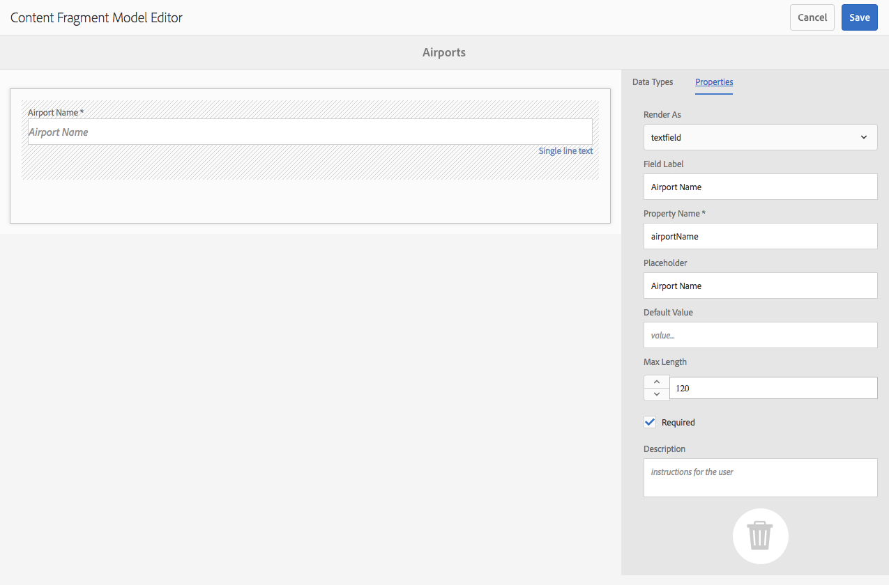

# Modelos de fragmentos do conteúdo{#content-fragment-models}

Os Modelos de fragmento de conteúdo definem a estrutura do conteúdo para seus [fragmentos de conteúdo](/help/assets/content-fragments/content-fragments.md).

## Ativar modelos de fragmento de conteúdo {#enable-content-fragment-models}

>[!CAUTION]
>
>Se você não ativar **Modelos de fragmento de conteúdo** a opção **Criar** não estará disponível para criar novos modelos.

Para ativar os modelos de fragmento de conteúdo, é necessário:

* Ative o uso de modelos de fragmento de conteúdo no [Navegador de configuração](/help/sites-administering/configurations.md)
* Aplicar a configuração à sua pasta Ativos

### Ativar modelos de fragmento de conteúdo no Configuration Manager {#enable-content-fragment-models-in-configuration-manager}

Para [criar um novo Modelo de Fragmento de Conteúdo](#creating-a-content-fragment-model) você **deve** primeiro ativá-los usando o Gerenciador de Configuração:

>[!CAUTION]
>
>Subconfigurações (uma configuração aninhada em uma configuração) não são compatíveis com o Fragmentos de conteúdo.

1. Navegue até **Ferramentas**, **Gerale** abra o **Navegador de configuração**.

1. Use **Criar** para abrir a caixa de diálogo, onde você:

   1. Especifique um **Título**.
   1. Selecione **Modelos de fragmento de conteúdo** para ativar seu uso.

   

1. Selecione **Create** para salvar a definição.

<!-- 1. Select the location appropriate to your website. -->

### Aplique a configuração à sua pasta de ativos {#apply-the-configuration-to-your-assets-folder}

Quando a configuração **global** está ativada para modelos de fragmento de conteúdo, quaisquer modelos criados pelos usuários podem ser usados em qualquer pasta do Assets.

Para usar outras configurações (ou seja, excluindo globais) com uma pasta do Assets comparável, é necessário definir a conexão. Isso é feito usando **Configuração** na guia **Serviços da nuvem** das **Propriedades da pasta** da pasta apropriada.

## Criação de um modelo de fragmento de conteúdo {#creating-a-content-fragment-model}

1. Navegue até **Ferramentas**, **Ativos** e abra **Modelos de fragmento de conteúdo**.
1. Navegue até a pasta apropriada para sua [configuração](#enable-content-fragment-models).
1. Use **Criar** para abrir o assistente.

   >[!CAUTION]
   >
   >Se o [uso de modelos de fragmento de conteúdo não tiver sido ativado](#enable-content-fragment-models), a opção **Criar** não estará disponível.

1. Especifique o **título do modelo**. Você também pode adicionar uma **Descrição**, se necessário.

   

1. Use **Create** para salvar o modelo vazio. Uma mensagem indicará o sucesso da ação, você poderá selecionar **Abrir** para editar imediatamente o modelo ou **Concluído** para retornar ao console.

## Definição do modelo do fragmento de conteúdo {#defining-your-content-fragment-model}

O modelo de fragmento de conteúdo define efetivamente a estrutura dos fragmentos de conteúdo resultantes. Usando o editor de modelo, você pode adicionar e configurar os campos obrigatórios:

>[!CAUTION]
>
>A edição de um modelo de fragmento de conteúdo existente pode afetar fragmentos dependentes.

1. Navegue até **Ferramentas**, **Ativos** e abra **Modelos de fragmento de conteúdo**.

1. Navegue até a pasta que contém o modelo de fragmento de conteúdo.
1. Abra o modelo necessário para **Editar**; use a ação rápida ou selecione o modelo e depois a ação na barra de ferramentas.

   Uma vez aberto, o editor de modelo mostra:

   * esquerda: campos já definidos
   * direito: **Tipos de dados** disponíveis para criar campos (e **Propriedades** para uso depois que os campos forem criados)

   >[!NOTE]
   >
   >Quando um campo é **Obrigatório**, o **Rótulo** indicado no painel à esquerda é marcado com um asterisco (*****).

   

1. **Para adicionar um campo**

   * Arraste um tipo de dados necessário para o local necessário para um campo:

   

   * Depois que um campo é adicionado ao modelo, o painel direito mostrará as **Propriedades** que podem ser definidas para esse tipo de dados específico. Aqui, é possível definir o que é necessário para esse campo. Por exemplo:

   

   >[!NOTE]
   No tipo de dados **Texto de várias linhas**, é possível definir o **Tipo padrão** como:
   * **Texto formatado**

   * **Markdown**

   * **Texto sem formatação**

   Se não especificado, o valor padrão **Rich Text** é usado para este campo.
   Alterar o **Tipo padrão** em um modelo de fragmento de conteúdo só terá efeito em um fragmento de conteúdo existente relacionado depois que esse fragmento for aberto no editor e salvo.

1. **Para remover um campo**

   Selecione o campo desejado e clique/toque no ícone da lixeira. Você receberá uma solicitação para confirmar a ação.

   

1. Depois de adicionar todos os campos obrigatórios e definir as propriedades, use **Save** para persistir a definição. Por exemplo:

   

## Excluindo um modelo de fragmento de conteúdo {#deleting-a-content-fragment-model}

>[!CAUTION]
A exclusão de um modelo de fragmento de conteúdo pode afetar fragmentos dependentes.

Para excluir um modelo de fragmento de conteúdo:

1. Navegue até **Ferramentas**, **Ativos** e abra **Modelos de fragmento de conteúdo**.

1. Navegue até a pasta que contém o modelo de fragmento de conteúdo.
1. Selecione o modelo, seguido por **Delete** na barra de ferramentas.

   >[!NOTE]
   Se o modelo for referenciado, um aviso será dado. Agir adequadamente.

## Publicar um modelo de fragmento de conteúdo {#publishing-a-content-fragment-model}

Os modelos de fragmento de conteúdo precisam ser publicados quando/antes de qualquer fragmento de conteúdo dependente ser publicado.

Para publicar um modelo de fragmento de conteúdo:

1. Navegue até **Ferramentas**, **Ativos** e abra **Modelos de fragmento de conteúdo**.

1. Navegue até a pasta que contém o modelo de fragmento de conteúdo.
1. Selecione o modelo, seguido por **Publish** na barra de ferramentas.

   >[!NOTE]
   Se você publicar um fragmento de conteúdo para o qual o modelo ainda não foi publicado, uma lista de seleção indicará isso e o modelo será publicado com o fragmento.

