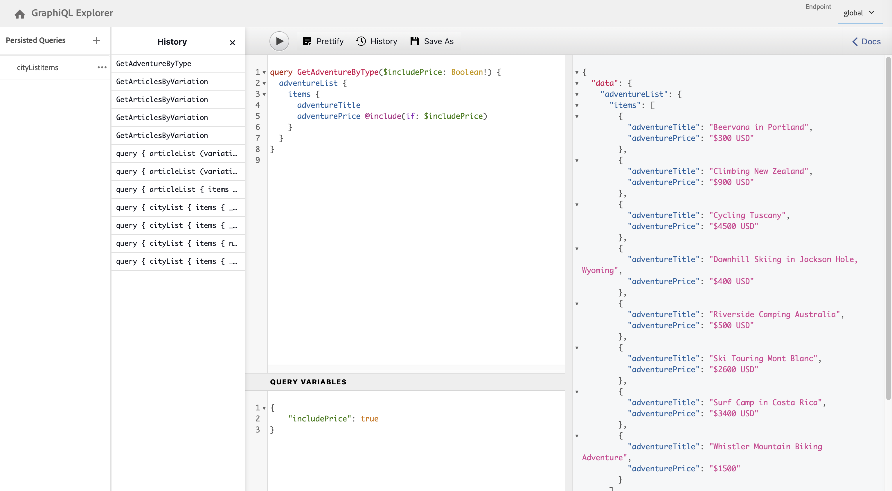

# API GraphQL do AEM para uso com Fragmentos de conteúdo {#graphql-api-for-use-with-content-fragments}

Saiba como usar Fragmentos de conteúdo no Adobe Experience Manager (AEM) com a API do GraphQL AEM para entrega de conteúdo sem periféricos.

A API GraphQL do AEM utilizada com Fragmentos de conteúdo é baseada na API GraphQL padrão de código aberto.

Usar a API GraphQL no AEM permite a entrega eficiente dos Fragmentos de conteúdo aos clientes JavaScript em implementações CMS headless:

* Evitando solicitações de API iterativas como com REST,
* Garantindo que a entrega se limite aos requisitos específicos,
* Permitindo a entrega em massa exatamente daquilo que é necessário para a renderização, como resposta a uma única consulta de API.

>[!NOTE]
>
>O GraphQL é usado atualmente em dois cenários (separados) no Adobe Experience Manager (AEM):
>
>* [O AEM Commerce consome dados de uma plataforma do Commerce por meio do GraphQL](/help/commerce/cif/integrating/magento.md).
>* Fragmentos de conteúdo do AEM trabalham em conjunto com a API GraphQL do AEM (uma implementação personalizada, com base no GraphQL padrão), para fornecer conteúdo estruturado para uso em seus aplicativos.


## A API GraphQL {#graphql-api}

O GraphQL é:

* &quot;*...um idioma de consulta para APIs e um tempo de execução para realizar essas consultas com seus dados existentes. O GraphQL fornece uma descrição completa e compreensível dos dados em sua API, concede aos clientes nada além do poder de solicitar exatamente o que precisam, facilita a evolução das APIs ao longo do tempo e habilita ferramentas avançadas de desenvolvedor.*&quot;.

   Consulte [GraphQL.org](https://graphql.org)

* &quot;*...uma especificação aberta para uma camada de API flexível. Coloque o GraphQL sobre seus back-end existentes para criar produtos mais rápido do que nunca...*&quot;.

   Consulte [Explorar GraphQL](https://www.graphql.com).

* *&quot;...uma linguagem de consulta de dados e especificação desenvolvidas internamente pelo Facebook em 2012, antes de serem disponibilizadas publicamente em 2015. Ele oferece uma alternativa às arquiteturas baseadas em REST, com o objetivo de aumentar a produtividade do desenvolvedor e minimizar as quantidades de dados transferidos. O GraphQL é usado na produção por centenas de organizações de todos os tamanhos...&quot;*

   Consulte [Fundação GraphQL](https://foundation.graphql.org/).

<!--
"*Explore GraphQL is maintained by the Apollo team. Our goal is to give developers and technical leaders around the world all of the tools they need to understand and adopt GraphQL.*". 
-->

Para obter mais informações sobre a API GraphQL, consulte as seguintes seções (entre muitos outros recursos):

* Em [graphql.org](https://graphql.org):

   * [Introdução ao GraphQL](https://graphql.org/learn)

   * [A especificação GraphQL](https://spec.graphql.org/)

* Em [graphql.com](https://graphql.com):

   * [Guias](https://www.graphql.com/guides/)

   * [Tutoriais](https://www.graphql.com/tutorials/)

   * [Estudos de caso](https://www.graphql.com/case-studies/)

A implementação do GraphQL para AEM é baseada na Biblioteca GraphQL Java padrão. Consulte:

* [graphQL.org - Java](https://graphql.org/code/#java)

* [Java GraphQL no GitHub](https://github.com/graphql-java)

### Terminologia de GraphQL {#graphql-terminology}

O GraphQL usa o seguinte:

* **[Consultas](https://graphql.org/learn/queries/)**

* **[Esquemas e Tipos](https://graphql.org/learn/schema/)**:

   * Os esquemas são gerados pelo AEM com base nos modelos de fragmento de conteúdo.
   * Usando seus esquemas, o GraphQL apresenta os tipos e as operações permitidas no GraphQL para implementação no AEM.

* **[Campos](https://graphql.org/learn/queries/#fields)**

* **[Endpoint de GraphQL](#graphql-aem-endpoint)**
   * O caminho no AEM que responde a consultas de GraphQL e fornece acesso aos esquemas de GraphQL.

   * Consulte [Habilitação do endpoint de GraphQL](#enabling-graphql-endpoint) para obter mais detalhes.

Consulte a [Introdução ao GraphQL (GraphQL.org)](https://graphql.org/learn/) para obter detalhes abrangentes, incluindo as [Práticas recomendadas](https://graphql.org/learn/best-practices/).

### Tipos de consulta de GraphQL {#graphql-query-types}

Com o GraphQL, é possível executar consultas para retornar:

* Uma **entrada única**

* Uma **[lista de entradas](https://graphql.org/learn/schema/#lists-and-non-null)**

O AEM fornece recursos para converter consultas (de ambos os tipos) em [](/help/assets/content-fragments/persisted-queries.md)consultas persistentes, que podem ser armazenadas em cache pelo Dispatcher e CDN.

### Práticas recomendadas de consulta GraphQL (Dispatcher e CDN) {#graphql-query-best-practices}

As [consultas persistentes](/help/assets/content-fragments/persisted-queries.md) são o método recomendado a ser usado em instâncias de publicação, como:

* são armazenadas em cache
* são gerenciados centralmente pelo AEM

>[!NOTE]
>
>Geralmente, uma instância de autor não contém o Dispatcher/CDN, portanto, não há vantagem em usar consultas persistentes nesse caso, a menos que seja para testá-las.

As consultas GraphQL que utilizam solicitações POST não são recomendadas, pois não são armazenadas em cache. Portanto, em uma instância padrão, o Dispatcher é configurado para bloquear essas consultas.

Embora o GraphQL também seja compatível com solicitações GET, elas podem atingir limites (por exemplo, o comprimento do URL) que poderiam ser evitados usando consultas persistentes.

>[!NOTE]
>
>A capacidade de realizar consultas diretas pode se tornar obsoleta em algum momento no futuro.

## O GraphQL para AEM Endpoint {#graphql-aem-endpoint}

O endpoint é o caminho usado para acessar o GraphQL no AEM. Usando esse caminho, você (ou seu aplicativo) pode:

* acessar o esquema de GraphQL,
* enviar suas consultas de GraphQL,
* receber as respostas (para suas consultas de GraphQL).

Há dois tipos de endpoints no AEM:

* Global
   * Disponível para uso por todos os sites.
   * Esse endpoint pode usar todos os modelos de fragmento de conteúdo de todas as configurações do Sites (definidas no [Navegador de configuração](/help/assets/content-fragments/content-fragments-configuration-browser.md#enable-content-fragment-functionality-in-configuration-browser)).
   * Se houver modelos de fragmento de conteúdo que devem ser compartilhados entre as configurações do Sites, eles devem ser criados nas configurações globais do Sites.
* Configurações do Sites:
   * Corresponde a uma configuração do Sites, conforme definido no [Navegador de configuração](/help/assets/content-fragments/content-fragments-configuration-browser.md#enable-content-fragment-functionality-in-configuration-browser).
   * Específico de um site/projeto especificado.
   * Um endpoint específico de uma configuração do Sites usará os modelos de fragmento de conteúdo dessa configuração, junto com aqueles da configuração global do Sites.

>[!CAUTION]
>
>O Editor de fragmento de conteúdo pode permitir que um fragmento de conteúdo de uma configuração do Sites faça referência a um fragmento de conteúdo de outra configuração do Sites (por meio de políticas).
>
>Nesse caso, nem todo o conteúdo poderá ser recuperado usando um endpoint específico de uma configuração do Sites.
>
>O autor de conteúdo deve controlar esse cenário; por exemplo, pode ser útil considerar colocar modelos de fragmento de conteúdo compartilhados na configuração global do Sites.

O caminho do repositório do GraphQL para o endpoint global do AEM é:

`/content/cq:graphql/global/endpoint`

Para o qual seu aplicativo pode usar o seguinte caminho no URL da solicitação:

`/content/_cq_graphql/global/endpoint.json`

Para habilitar um endpoint para GraphQL no AEM, é necessário:

* [Habilitar seu endpoint de GraphQL](#enabling-graphql-endpoint)
* [Publicar seu endpoint de GraphQL](#publishing-graphql-endpoint)

### Habilitação do seu endpoint de GraphQL {#enabling-graphql-endpoint}

Para habilitar um endpoint de GraphQL, primeiro é necessário ter uma configuração apropriada. Consulte [Fragmentos de conteúdo - Navegador de configuração](/help/assets/content-fragments/content-fragments-configuration-browser.md).

>[!CAUTION]
>
>Se o [uso de modelos de fragmento de conteúdo não foi habilitado](/help/assets/content-fragments/content-fragments-configuration-browser.md), a opção **Criar** não estará disponível.

Para habilitar o endpoint correspondente:

1. Navegue até **Ferramentas**, **Ativos** e, em seguida, selecione **GraphQL**.
1. Selecione **Criar**.
1. A caixa de diálogo **Criar novo endpoint de GraphQL** será aberta. Aqui, é possível especificar:
   * **Nome**: nome do endpoint; é possível inserir qualquer texto.
   * **Usar o esquema de GraphQL fornecido por**: use a lista suspensa para selecionar o site/projeto necessário.

   >[!NOTE]
   >
   >O seguinte aviso é mostrado na caixa de diálogo:
   >
   >* *Os endpoints de GraphQL podem causar problemas de segurança e desempenho de dados se não forem gerenciados com cuidado. Defina as permissões apropriadas após criar um endpoint.*


1. Confirme com **Criar**.
1. A caixa de diálogo **Próximas etapas** fornecerá um link direto até o console de Segurança, para que você possa garantir que o endpoint recém-criado tenha as permissões adequadas.

   >[!CAUTION]
   >
   >O endpoint é acessível a todos. Isso pode causar uma preocupação de segurança, especialmente em instâncias de publicação, já que as consultas de GraphQL podem colocar uma carga pesada sobre o servidor.
   >
   >É possível configurar ACLs apropriadas ao seu caso de uso no endpoint.

### Publicar seu endpoint de GraphQL {#publishing-graphql-endpoint}

Selecione o novo endpoint e escolha **Publicar** para disponibilizá-lo completamente, em todos os ambientes.

>[!CAUTION]
>
>O endpoint é acessível a todos.
>
>Isso pode causar uma preocupação de segurança em instâncias de publicação, já que as consultas de GraphQL podem colocar uma carga pesada sobre o servidor.
>
>Você deve configurar ACLs apropriadas ao seu caso de uso no endpoint.

## Interface GraphiQL {#graphiql-interface}

Uma implementação do padrão [GraphiQL](https://graphql.org/learn/serving-over-http/#graphiql) A interface do está disponível para uso com AEM GraphQL.

>[!NOTE]
>
>O GraphiQL é incluído em todos os ambientes do AEM (mas só se torna acessível/visível quando você configura os pontos de acesso).
>
>Em versões anteriores, era necessário um pacote para instalar o GraphiQL IDE. Se você o instalou, agora é possível removê-lo.

Essa interface permite que você insira e teste diretamente consultas.

Por exemplo:

* `http://localhost:4502/content/graphiql.html`

Isso fornece recursos como realce de sintaxe, preenchimento automático e sugestão automática, juntamente com um histórico e uma documentação online:


>[!NOTE]
>
>Para obter mais detalhes, consulte [Uso do GraphiQL IDE](/help/assets/content-fragments/graphiql-ide.md).

## Casos de uso para ambientes de Autor e Publicação {#use-cases-author-publish-environments}

Os casos de uso podem depender do tipo de ambiente de AEM:

* Ambiente de publicação; usado para:
   * Consultar dados para o aplicativo JS (caso de uso padrão)

* Ambiente de autor; usado para:
   * Consultar dados para “fins de gerenciamento de conteúdo”:
      * Atualmente, o GraphQL no AEM é uma API somente leitura.
      * A API REST pode ser usada para operações de CR(u)D.

## Permissões {#permission}

As permissões são as necessárias para acessar o Assets.

As consultas GraphQL são executadas com a permissão do usuário do AEM da solicitação subjacente. Se o usuário não tiver acesso de leitura a alguns fragmentos (armazenados como ativos), eles não farão parte do conjunto de resultados.

Além disso, o usuário precisa ter acesso a um ponto de acesso GraphQL para poder executar consultas GraphQL.

## Geração de esquemas {#schema-generation}

O GraphQL é uma API altamente tipificada, o que significa que os dados devem ser estruturados e organizados claramente por tipo.

A especificação GraphQL fornece uma série de diretrizes sobre como criar uma API robusta para interrogar dados em uma determinada instância. Para fazer isso, um cliente precisa buscar o [Esquema](#schema-generation), que contém todos os tipos necessários para uma consulta.

Para fragmentos de conteúdo, os esquemas de GraphQL (estrutura e tipos) são baseados em [modelos de fragmento de conteúdo](/help/assets/content-fragments/content-fragments-models.md) **habilitados** e seus tipos de dados.

>[!CAUTION]
>
>Todos os esquemas de GraphQL (derivados dos modelos de fragmento de conteúdo que foram **Habilitados**) são legíveis por meio do endpoint do GraphQL.
>
>Isso significa que você precisa garantir que não haja dados confidenciais disponíveis, pois eles poderiam ser vazados dessa maneira; por exemplo, isso inclui informações que podem estar presentes como nomes de campo na definição do modelo.

Por exemplo, se um usuário criou um modelo de fragmento de conteúdo chamado `Article`, então o AEM irá gerar o objeto `article`, que é do tipo `ArticleModel`. Os campos desse tipo correspondem aos campos e tipos de dados definidos no modelo.

1. Um modelo de fragmento de conteúdo:

   

1. O esquema de GraphQL correspondente (saída da documentação automática do GraphiQL):
   

   Isso mostra que o tipo gerado `ArticleModel` contém vários [campos](#fields).

   * Três deles foram controlados pelo usuário: `author`, `main` e `referencearticle`.

   * Os outros campos foram adicionados automaticamente pelo AEM e representam métodos úteis para fornecer informações sobre um determinado fragmento de conteúdo; neste exemplo, `_path`, `_metadata` e `_variations`. Esses [campos auxiliares](#helper-fields) estão marcados com um `_` precedente, para distinguir entre o que foi definido pelo usuário e o que foi gerado automaticamente.

1. Depois que um usuário cria um fragmento de conteúdo com base no modelo de Artigo, ele pode ser interrogado por meio do GraphQL. Para obter exemplos, consulte [Exemplos de consulta](/help/assets/content-fragments/content-fragments-graphql-samples.md#graphql-sample-queries) (baseado em uma [amostra da estrutura do fragmento de conteúdo para uso com GraphQL](/help/assets/content-fragments/content-fragments-graphql-samples.md#content-fragment-structure-graphql)).

No GraphQL para AEM, o esquema é flexível. Isso significa que ele é gerado automaticamente toda vez que um modelo de fragmento de conteúdo é criado, atualizado ou excluído. Os caches do esquema de dados também são atualizados quando você atualiza um modelo de fragmento de conteúdo.

O serviço GraphQL do Sites acompanha (em segundo plano) quaisquer modificações feitas em um modelo de fragmento de conteúdo. Quando as atualizações são detectadas, somente essa parte do esquema é gerada novamente. Essa otimização economiza tempo e oferece estabilidade.

Por exemplo, se você:

1. Instalar um pacote contendo `Content-Fragment-Model-1` e `Content-Fragment-Model-2`:

   1. Os tipos de GraphQL para `Model-1` e `Model-2` serão gerados.

1. Em seguida, o `Content-Fragment-Model-2` é modificado:

   1. Somente o tipo de GraphQL para `Model-2` será atualizado.

   1. Já o `Model-1` permanecerá o mesmo.

>[!NOTE]
>
>É importante observar isso caso queira fazer atualizações em massa nos modelos de fragmento de conteúdo por meio da API REST ou de outra maneira.

O esquema é distribuído por meio do mesmo endpoint das consultas de GraphQL, com o cliente lidando com o fato de que o esquema é chamado com a extensão `GQLschema`. Por exemplo, executar uma simples solicitação `GET` em `/content/cq:graphql/global/endpoint.GQLschema` resultará na saída do esquema com o tipo do conteúdo: `text/x-graphql-schema;charset=iso-8859-1`.

### Geração de esquema - Modelos não publicados {#schema-generation-unpublished-models}

Quando os fragmentos de conteúdo são aninhados, pode acontecer que um modelo de fragmento de conteúdo principal seja publicado, mas um modelo referenciado não.

>[!NOTE]
>
>A interface do AEM impede que isso aconteça, mas se a publicação for feita de maneira programática ou com pacotes de conteúdo, isso poderá ocorrer.

Quando isso acontece, o AEM gera um esquema *incompleto* do modelo de fragmento de conteúdo principal. Isso significa que a referência do fragmento, que depende do modelo não publicado, é removida do esquema.

## Campos {#fields}

Dentro do esquema há campos individuais de duas categorias básicas:

* Campos gerados.

   Uma seleção de [Tipos de campos](#field-types) é usada para criar campos com base em como você configura o modelo de fragmento de conteúdo. Os nomes de campo são retirados do campo **Nome da propriedade** do **Tipo de dados**.

   * A propriedade **Renderizar como** também precisa ser considerada, pois os usuários podem configurar determinados tipos de dados; por exemplo, como um texto de linha única ou como um multicampo.

* O GraphQL do AEM também gera vários [campos auxiliares](#helper-fields).

   Eles são usados para identificar um fragmento de conteúdo ou obter mais informações sobre ele.

### Tipos de campos {#field-types}

O GraphQL do AEM oferece suporte a uma lista de tipos. Todos os tipos de dados do modelo de fragmento de conteúdo compatíveis e os tipos de GraphQL correspondentes são representados:

| Modelo de fragmento de conteúdo - Tipo de dados | Tipo de GraphQL | Descrição |
|--- |--- |--- |
| Texto em linha única | Sequência de caracteres, [Sequência de caracteres] |  Usado para sequências de caracteres simples, como nomes de autor, nomes de localização etc. |
| Texto multilinha | Sequência de caracteres |  Usado para saída de texto, como o corpo de um artigo |
| Número |  Flutuante, [Flutuante] | Usado para exibir números de ponto flutuantes e números regulares |
| Booleano |  Booleano |  Usado para exibir caixas de seleção → declarações simples de verdadeiro/falso |
| Data e hora | Calendário |  Usado para exibir data e hora em um formato ISO 8086. Dependendo do tipo selecionado, há três opções disponíveis para uso no GraphQL do AEM: `onlyDate`, `onlyTime` e `dateTime` |
| Enumeração |  Sequência de caracteres |  Usado para exibir uma opção de uma lista de opções definidas na criação do modelo |
|  Tags |  [Sequência de caracteres] |  Usado para exibir uma lista de sequências de caracteres que representam tags usadas no AEM |
| Referência de conteúdo |  Sequência de caracteres |  Usado para exibir o caminho para outro ativo no AEM |
| Referência do fragmento |  *Um tipo de modelo* |  Usado para fazer referência a outro Fragmento de conteúdo de um determinado Tipo de modelo, definido quando o modelo foi criado |

### Campos auxiliares {#helper-fields}

Além dos tipos de dados para campos gerados pelo usuário, o GraphQL para AEM também gera vários campos *auxiliares* para ajudar a identificar um Fragmento de conteúdo ou fornecer informações adicionais sobre um Fragmento de conteúdo.

#### Caminho {#path}

O campo de caminho é usado como um identificador no GraphQL. Ele representa o caminho do ativo Fragmento de conteúdo dentro do repositório do AEM. Escolhemos isso como o identificador de um fragmento de conteúdo, pois ele:

* é exclusivo dentro do AEM,
* pode ser buscado facilmente.

O código a seguir exibirá os caminhos de todos os Fragmentos de conteúdo que foram criados com base no Modelo de fragmento de conteúdo `Person`.

```xml
{
  personList {
    items {
      _path
    }
  }
}
```

Para recuperar um único Fragmento de conteúdo de um tipo específico, também é necessário determinar seu caminho primeiro. por exemplo:

```xml
{
  personByPath(_path: "/content/dam/path/to/fragment/john-doe") {
    item {
      _path
      firstName
      name
    }
  }
}
```

Consulte [Exemplo de consulta - um único fragmento específico de cidade](/help/assets/content-fragments/content-fragments-graphql-samples.md#sample-single-specific-city-fragment).

#### Metadados {#metadata}

Por meio do GraphQL, o AEM também expõe os metadados de um Fragmento de conteúdo. Metadados são as informações que descrevem um fragmento de conteúdo, como o título de um fragmento de conteúdo, o caminho da miniatura, a descrição de um Fragmento de conteúdo, a data de criação, dentre outros.

Como os metadados são gerados por meio do Editor de esquemas e, como tal, não têm uma estrutura específica, o GraphQL tipo `TypedMetaData` foi implementado para expor os metadados de um Fragmento de conteúdo. `TypedMetaData` expõe as informações agrupadas pelos seguintes tipos escalares:

| Texto |
|--- |
| `stringMetadata:[StringMetadata]!` |
| `stringArrayMetadata:[StringArrayMetadata]!` |
| `intMetadata:[IntMetadata]!` |
| `intArrayMetadata:[IntArrayMetadata]!` |
| `floatMetadata:[FloatMetadata]!` |
| `floatArrayMetadata:[FloatArrayMetadata]!` |
| `booleanMetadata:[BooleanMetadata]!` |
| `booleanArrayMetadata:[booleanArrayMetadata]!`  |
| `calendarMetadata:[CalendarMetadata]!` |
| `calendarArrayMetadata:[CalendarArrayMetadata]!` |

Cada tipo escalar representa um único par de nome-valor ou uma matriz de pares de nome-valor, em que o valor desse par é do tipo em que foi agrupado.

Por exemplo, se você quiser recuperar o título de um Fragmento de conteúdo, sabemos que essa é uma propriedade de String; portanto, consultaríamos todos os metadados de String:

Para consultar metadados:

```xml
{
  personByPath(_path: "/content/dam/path/to/fragment/john-doe") {
    item {
      _path
      _metadata {
        stringMetadata {
          name
          value
        }
      }
    }
  }
}
```

É possível exibir todos os tipos de metadados GraphQL, se você exibir o esquema GraphQL gerado. Todos os tipos de modelo têm o mesmo `TypedMetaData`.

>[!NOTE]
>
>**Diferença entre metadados normais e de matriz**
>Lembre-se que `StringMetadata` e `StringArrayMetadata` se referem ao que é armazenado no repositório, não a como você os recupera.
>
>Por exemplo, ao chamar o campo `stringMetadata`, você receberia uma matriz de todos os metadados que foram armazenados no repositório como um `String`; e ao chamar `stringArrayMetadata`, você receberia uma matriz de todos os metadados que foram armazenados no repositório como `String[]`.

Consulte [Exemplo de consulta para metadados - listar os metadados para prêmios denominados GB](/help/assets/content-fragments/content-fragments-graphql-samples.md#sample-metadata-awards-gb).

#### Variações {#variations}

O campo `_variations` foi implementado para simplificar a consulta das variações que um Fragmento de conteúdo possui. Por exemplo:

```xml
{
  personByPath(_path: "/content/dam/path/to/fragment/john-doe") {
    item {
      _variations
    }
  }
}
```

Consulte [Exemplo de consulta - todas as cidades com uma variável nomeada](/help/assets/content-fragments/content-fragments-graphql-samples.md#sample-cities-named-variation).

>[!NOTE]
>
>Se a variação especificada não existir para um Fragmento de conteúdo, a variação principal será retornada como padrão (substituta).

<!--
## Security Considerations {#security-considerations}
-->

## Variáveis GraphQL {#graphql-variables}

O GraphQL permite que as variáveis sejam colocadas na consulta. Para obter mais informações, é possível visualizar a [documentação do GraphQL sobre variáveis](https://graphql.org/learn/queries/#variables).

Por exemplo, para obter todos os Fragmentos de conteúdo do tipo `Article` que tenham uma variação específica, é possível especificar a variável `variation` no GraphiQL.


```xml
### query
query GetArticlesByVariation($variation: String!) {
    articleList(variation: $variation) {
        items {
            _path
            author
            _variations
        }
    }
}
 
### in query variables
{
    "variation": "uk"
}
```

## Diretivas GraphQL {#graphql-directives}

No GraphQL, há uma possibilidade de alterar a consulta com base em variáveis, chamadas de Diretivas GraphQL.

Por exemplo, é possível incluir o campo `adventurePrice` em uma consulta para todos os `AdventureModels`, com base em uma variável `includePrice`.



```xml
### query
query GetAdventureByType($includePrice: Boolean!) {
  adventureList {
    items {
      adventureTitle
      adventurePrice @include(if: $includePrice)
    }
  }
}
 
### in query variables
{
    "includePrice": true
}
```

## Filtragem {#filtering}

Também é possível usar a filtragem em consultas de GraphQL para retornar dados específicos.

A filtragem usa uma sintaxe baseada em operadores lógicos e expressões.

Por exemplo, a consulta a seguir (básica) filtra todas as pessoas cujo nome é `Jobs` ou `Smith`:

```xml
query {
  personList(filter: {
    name: {
      _logOp: OR
      _expressions: [
        {
          value: "Jobs"
        },
        {
          value: "Smith"
        }
      ]
    }
  }) {
    items {
      name
      firstName
    }
  }
}
```

Para obter mais exemplos, consulte:

* detalhes da [GraphQL para extensões do AEM](#graphql-extensions)

* [Exemplos de consulta usando esta amostra de conteúdo e estrutura](/help/assets/content-fragments/content-fragments-graphql-samples.md#graphql-sample-queries-sample-content-fragment-structure)

   * E a [amostra de conteúdo e estrutura](/help/assets/content-fragments/content-fragments-graphql-samples.md#content-fragment-structure-graphql) preparada para uso em consultas de exemplo

* [Exemplos de consulta com base no projeto WKND](/help/assets/content-fragments/content-fragments-graphql-samples.md#sample-queries-using-wknd-project)

## GraphQL para AEM - resumo das extensões {#graphql-extensions}

A operação básica de consultas com o GraphQL para AEM adere à especificação GraphQL padrão. Para consultas de GraphQL com o AEM, há algumas extensões:

* Se você precisar de um único resultado:
   * utilize o nome do modelo; por exemplo, cidade

* Se você espera uma lista de resultados:
   * adicione `List` ao nome do modelo; por exemplo, `cityList`
   * Consulte [Exemplo de consulta - Todas as informações sobre todas as cidades](#sample-all-information-all-cities)

* O filtro `includeVariations` está incluída no `List` tipo de consulta.  Para recuperar as variações do fragmento de conteúdo nos resultados da consulta, em seguida, use o `includeVariations` deve ser definido como `true`.

   >[!CAUTION]
   >O filtro `includeVariations` não pode ser usado junto com o campo gerado pelo sistema `_variation`.

* Se quiser usar um operador OR lógico:
   * use ` _logOp: OR`
   * Consulte [Exemplo de consulta - Todas as pessoas cujo nome é “Jobs” ou “Smith”](/help/assets/content-fragments/content-fragments-graphql-samples.md#sample-all-persons-jobs-smith)

* O operador AND lógico também existe, mas está (muitas vezes) implícito

* Você pode consultar nos nomes de campos que correspondem aos campos no modelo de fragmento de conteúdo
   * Consulte [Exemplo de consulta - Detalhes completos do CEO e dos funcionários de uma empresa](/help/assets/content-fragments/content-fragments-graphql-samples.md#sample-full-details-company-ceos-employees)

* Além dos campos do modelo, há alguns campos gerados pelo sistema (precedidos por um sublinhado):

   * Para conteúdo:

      * `_locale` : para revelar a língua; com base no Gerenciador de idiomas
         * Consulte [Exemplo de consulta para vários fragmentos de conteúdo de uma determinada localidade](/help/assets/content-fragments/content-fragments-graphql-samples.md#sample-wknd-multiple-fragments-given-locale)
      * `_metadata` : para revelar metadados do fragmento
         * Consulte [Exemplo de consulta para metadados - Listar os metadados para prêmios denominados como GB](/help/assets/content-fragments/content-fragments-graphql-samples.md#sample-metadata-awards-gb)
      * `_model` : permite a consulta para um modelo de fragmento de conteúdo (caminho e título)
         * Consulte [Exemplo de consulta para um modelo de fragmento de conteúdo de um modelo](/help/assets/content-fragments/content-fragments-graphql-samples.md#sample-wknd-content-fragment-model-from-model)
      * `_path` : o caminho para o fragmento de conteúdo no repositório
         * Consulte [Exemplo de consulta - Um único fragmento de cidade específico](/help/assets/content-fragments/content-fragments-graphql-samples.md#sample-single-specific-city-fragment)
      * `_reference` : para revelar referências; incluindo referências em linha no Editor de Rich Text
         * Consulte [Exemplo de consulta para vários fragmentos de conteúdo com referências previamente buscadas](/help/assets/content-fragments/content-fragments-graphql-samples.md#sample-wknd-multiple-fragments-prefetched-references)
      * `_variation` : para revelar variações específicas no fragmento de conteúdo

         >[!NOTE]
         >
         >Se a variação especificada não existir para um Fragmento de conteúdo, a variação principal será retornada como padrão (substituta).

         >[!CAUTION]
         >O campo gerado pelo sistema `_variation` não pode ser usado junto com o filtro `includeVariations`.

         * Consulte [Exemplo de consulta - Todas as cidades com uma variação nomeada](/help/assets/content-fragments/content-fragments-graphql-samples.md#sample-cities-named-variation)
      * `_tags` : para revelar as IDs de Fragmentos de conteúdo ou Variações que contêm tags; isso é uma matriz de `cq:tags` identificadores.

         * Consulte [Consulta de exemplo - Nomes de todas as cidades marcadas como quebras de cidade](/help/assets/content-fragments/content-fragments-graphql-samples.md#sample-names-all-cities-tagged-city-breaks)
         * Consulte [Exemplo de consulta para variações do fragmento de conteúdo de um determinado modelo que tem uma tag específica anexada](/help/assets/content-fragments/content-fragments-graphql-samples.md#sample-wknd-fragment-variations-given-model-specific-tag)

         >[!NOTE]
         >
         >As tags também podem ser consultadas ao listar os metadados de um fragmento de conteúdo.
   * E operações:

      * `_operator` : aplica operadores específicos; `EQUALS`, `EQUALS_NOT`, `GREATER_EQUAL`, `LOWER`, `CONTAINS` e `STARTS_WITH`
         * Consulte [Exemplo de consulta - Todas as pessoas cujo nome não é “Jobs”](/help/assets/content-fragments/content-fragments-graphql-samples.md#sample-all-persons-not-jobs)
         * Consulte [Exemplo de consulta - Todas as aventuras em que o `_path` começa com um prefixo específico](/help/assets/content-fragments/content-fragments-graphql-samples.md#sample-wknd-all-adventures-cycling-path-filter)
      * `_apply` : para aplicar condições específicas; por exemplo, `AT_LEAST_ONCE`
         * Consulte [Exemplo de consulta - Filtrar em uma matriz com um item que deve ocorrer pelo menos uma vez](/help/assets/content-fragments/content-fragments-graphql-samples.md#sample-array-item-occur-at-least-once)
      * `_ignoreCase` : para ignorar se os caracteres são maiúsculos ou minúsculos ao consultar
         * Consulte [Exemplo de consulta - Todas as cidades com SAN no nome, independentemente de caracteres maiúsculos ou minúsculos](/help/assets/content-fragments/content-fragments-graphql-samples.md#sample-all-cities-san-ignore-case)


* Os tipos de união GraphQL são compatíveis:

   * use `... on`
      * Consulte [Exemplo de consulta para um fragmento de conteúdo de um modelo específico com uma referência de conteúdo](/help/assets/content-fragments/content-fragments-graphql-samples.md#sample-wknd-fragment-specific-model-content-reference)

* Fazer o fallback ao consultar fragmentos aninhados:

   * Se a variação solicitada não existir em um fragmento aninhado, a variável **Principal** será retornada.

<!--
## Persisted Queries (Caching) {#persisted-queries-caching}

After preparing a query with a POST request, it can be executed with a GET request that can be cached by HTTP caches or a CDN.

This is required as POST queries are usually not cached, and if using GET with the query as a parameter there is a significant risk of the parameter becoming too large for HTTP services and intermediates.

Persisted queries must always use the endpoint related to the [appropriate Sites configuration](#graphql-aem-endpoint); so they can use either, or both:

* The Global configuration and endpoint
  The query has access to all Content Fragment Models.
* Specific Sites configuration(s) and endpoint(s)
  Creating a persisted query for a specific Sites configuration requires a corresponding Sites-configuration-specific endpoint (to provide access to the related Content Fragment Models). 
  For example, to create a persisted query specifically for the WKND Sites configuration, a corresponding WKND-specific Sites configuration, and a WKND-specific endpoint must be created in advance.

>[!NOTE]
>
>See [Enable Content Fragment Functionality in Configuration Browser](/help/assets/content-fragments/content-fragments-configuration-browser.md#enable-content-fragment-functionality-in-configuration-browser) for more details.
>
>The **GraphQL Persistence Queries** need to be enabled, for the appropriate Sites configuration. 

For example, if there is a particular query called `my-query`, which uses a model `my-model` from the Sites configuration `my-conf`:

* You can create a query using the `my-conf` specific endpoint, and then the query will be saved as following: 
`/conf/my-conf/settings/graphql/persistentQueries/my-query`
* You can create the same query using `global` endpoint, but then the query will be saved as following:
`/conf/global/settings/graphql/persistentQueries/my-query`

>[!NOTE]
>
>These are two different queries - saved under different paths. 
>
>They just happen to use the same model - but via different endpoints.


Here are the steps required to persist a given query:

1. Prepare the query by PUTing it to the new endpoint URL `/graphql/persist.json/<config>/<persisted-label>`.

   For example, create a persisted query:

   ```xml
   $ curl -X PUT \
       -H 'authorization: Basic YWRtaW46YWRtaW4=' \
       -H "Content-Type: application/json" \
       "http://localhost:4502/graphql/persist.json/wknd/plain-article-query" \
       -d \
   '{
     articleList {
       items{
           _path
           author
           main {
               json
           }
       }
     }
   }'
   ```

1. At this point, check the response.

   For example, check for success:

     ```xml
     {
       "action": "create",
       "configurationName": "wknd",
       "name": "plain-article-query",
       "shortPath": "/wknd/plain-article-query",
       "path": "/conf/wknd/settings/graphql/persistentQueries/plain-article-query"
     }
     ```

1. You can then replay the persisted query by GETing the URL `/graphql/execute.json/<shortPath>`.

   For example, use the persisted query:

   ```xml
   $ curl -X GET \
       http://localhost:4502/graphql/execute.json/wknd/plain-article-query
   ```

1. Update a persisted query by POSTing to an already existing query path.

   For example, use the persisted query:

   ```xml
   $ curl -X POST \
       -H 'authorization: Basic YWRtaW46YWRtaW4=' \
       -H "Content-Type: application/json" \
       "http://localhost:4502/graphql/persist.json/wknd/plain-article-query" \
       -d \
   '{
     articleList {
       items{
           _path
           author
           main {
               json
           }
         referencearticle {
           _path
         }
       }
     }
   }'
   ```

1. Create a wrapped plain query.

   For example:

   ```xml
   $ curl -X PUT \
       -H 'authorization: Basic YWRtaW46YWRtaW4=' \
       -H "Content-Type: application/json" \
       "http://localhost:4502/graphql/persist.json/wknd/plain-article-query-wrapped" \
       -d \
   '{ "query": "{articleList { items { _path author main { json } referencearticle { _path } } } }"}'
   ```

1. Create a wrapped plain query with cache control.

   For example:

   ```xml
   $ curl -X PUT \
       -H 'authorization: Basic YWRtaW46YWRtaW4=' \
       -H "Content-Type: application/json" \
       "http://localhost:4502/graphql/persist.json/wknd/plain-article-query-max-age" \
       -d \
   '{ "query": "{articleList { items { _path author main { json } referencearticle { _path } } } }", "cache-control": { "max-age": 300 }}'
   ```

1. Create a persisted query with parameters:

   For example:

   ```xml
   $ curl -X PUT \
       -H 'authorization: Basic YWRtaW46YWRtaW4=' \
       -H "Content-Type: application/json" \
       "http://localhost:4502/graphql/persist.json/wknd/plain-article-query-parameters" \
       -d \
   'query GetAsGraphqlModelTestByPath($apath: String!, $withReference: Boolean = true) {
     articleByPath(_path: $apath) {
       item {
         _path
           author
           main {
           plaintext
           }
           referencearticle @include(if: $withReference) {
           _path
           }
         }
       }
     }'
   ```

1. Executing a query with parameters.

   For example:

   ```xml
   $ curl -X POST \
       -H 'authorization: Basic YWRtaW46YWRtaW4=' \
       -H "Content-Type: application/json" \
       "http://localhost:4502/graphql/execute.json/wknd/plain-article-query-parameters;apath=%2fcontent2fdam2fwknd2fen2fmagazine2falaska-adventure2falaskan-adventures;withReference=false"

   $ curl -X GET \
       "http://localhost:4502/graphql/execute.json/wknd/plain-article-query-parameters;apath=%2fcontent2fdam2fwknd2fen2fmagazine2falaska-adventure2falaskan-adventures;withReference=false"
   ```

1. To execute the query on publish, the related persist tree need to replicated

   * Using a POST for replication:

     ```xml
     $curl -X POST   http://localhost:4502/bin/replicate.json \
       -H 'authorization: Basic YWRtaW46YWRtaW4=' \
       -F path=/conf/wknd/settings/graphql/persistentQueries/plain-article-query \
       -F cmd=activate
     ```

   * Using a package:
     1. Create a new package definition.
     1. Include the configuration (for example, `/conf/wknd/settings/graphql/persistentQueries`).
     1. Build the package.
     1. Replicate the package.

   * Using replication/distribution tool.
     1. Go to the Distribution tool.
     1. Select tree activation for the configuration (for example, `/conf/wknd/settings/graphql/persistentQueries`).

   * Using a workflow (via workflow launcher configuration):
     1. Define a workflow launcher rule for executing a workflow model that would replicate the configuration on different events (for example, create, modify, amongst others).

1. Once the query configuration is on publish, the same principles apply, just using the publish endpoint.

   >[!NOTE]
   >
   >For anonymous access the system assumes that the ACL allows "everyone" to have access to the query configuration.
   >
   >If that is not the case it will not be able to execute.

   >[!NOTE]
   >
   >Any semicolons (";") in the URLs need to be encoded.
   >
   >For example, as in the request to Execute a persisted query:
   >
   >```xml
   >curl -X GET \ "http://localhost:4502/graphql/execute.json/wknd/plain-article-query-parameters%3bapath=%2fcontent2fdam2fwknd2fen2fmagazine2falaska-adventure2falaskan-adventures;withReference=false"
   >```

## Querying the GraphQL endpoint from an External Website {#query-graphql-endpoint-from-external-website}

To access the GraphQL endpoint from an external website you need to configure the:

* [CORS Filter](#cors-filter)
* [Referrer Filter](#referrer-filter)
-->

### Filtro CORS {#cors-filter}

>[!NOTE]
>
>Para obter uma visão geral detalhada da política de compartilhamento de recursos do CORS no AEM, consulte [Entenda o CORS (Cross-Origin Resource Sharing, Compartilhamento de recursos entre origens)](https://experienceleague.adobe.com/docs/experience-manager-learn/foundation/security/understand-cross-origin-resource-sharing.html?lang=pt-BR#understand-cross-origin-resource-sharing-(cors)).

Para acessar o terminal GraphQL, uma política CORS deve ser configurada no repositório Git do cliente. Isso é feito adicionando um arquivo de configuração de CORS OSGi apropriado para os endpoints desejados. 

Essa configuração deve especificar uma origem de site confiável `alloworigin` ou `alloworiginregexp` cujo acesso deve ser concedido.

Por exemplo, para conceder acesso ao endpoint do GraphQL  e ao endpoint de consultas persistentes para `https://my.domain`, é possível usar:

```xml
{
  "supportscredentials":true,
  "supportedmethods":[
    "GET",
    "HEAD",
    "POST"
  ],
  "exposedheaders":[
    ""
  ],
  "alloworigin":[
    "https://my.domain"
  ],
  "maxage:Integer":1800,
  "alloworiginregexp":[
    ""
  ],
  "supportedheaders":[
    "Origin",
    "Accept",
    "X-Requested-With",
    "Content-Type",
    "Access-Control-Request-Method",
    "Access-Control-Request-Headers"
  ],
  "allowedpaths":[
    "/content/_cq_graphql/global/endpoint.json",
    "/graphql/execute.json/.*"
  ]
}
```

Se você tiver configurado um caminho personalizado para o endpoint, também poderá usá-lo no `allowedpaths`.

### Filtro de referenciador {#referrer-filter}

Além da configuração do CORS, um filtro Referenciador deve ser configurado para permitir acesso de hosts de terceiros.

Isso é feito adicionando um arquivo de configuração do Filtro de referenciador OSGi apropriado que:

* especifica um nome de host de site confiável; `allow.hosts` ou `allow.hosts.regexp`
* concede acesso a esse nome de host.

Por exemplo, para conceder acesso a solicitações com o referenciador `my.domain`, é possível:

```xml
{
    "allow.empty":false,
    "allow.hosts":[
      "my.domain"
    ],
    "allow.hosts.regexp":[
      ""
    ],
    "filter.methods":[
      "POST",
      "PUT",
      "DELETE",
      "COPY",
      "MOVE"
    ],
    "exclude.agents.regexp":[
      ""
    ]
}
```

>[!CAUTION]
>
>Continua a ser responsabilidade do cliente:
>
>* conceder acesso somente a domínios confiáveis
>* certificar-se de que nenhuma informação sensível seja exposta
>* não usar uma sintaxe [*] curinga; isso desativará o acesso autenticado ao endpoint do GraphQL e também irá expô-lo ao mundo inteiro.


>[!CAUTION]
>
>Toda os [esquemas](#schema-generation) de GraphQL (derivados de modelos de fragmento de conteúdo que foram **Habilitados**) são legíveis por meio do endpoint do GraphQL.
>
>Isso significa que você precisa garantir que não haja dados confidenciais disponíveis, pois eles poderiam ser vazados dessa maneira; por exemplo, isso inclui informações que podem estar presentes como nomes de campo na definição do modelo.

## Autenticação {#authentication}

Consulte [Autenticação para consultas de GraphQL remotas do AEM sobre fragmentos de conteúdo](/help/assets/content-fragments/graphql-authentication-content-fragments.md).

<!-- to be addressed later -->

<!--
## Sorting {#sorting}
-->

<!-- to be addressed later -->

<!--
## Paging {#paging}
-->

## Perguntas frequentes {#faqs}

Perguntas que surgiram:

1. **P**: “*Qual a diferença entre a API GraphQL do AEM e a API do Construtor de consultas?*”

   * **R**: “*A API GraphQL do AEM oferece controle total sobre a saída em JSON e é um padrão do setor para consulta de conteúdo.
A partir de agora, o AEM planeja investir na API GraphQL do AEM.*”

## Tutorial - Introdução ao AEM Headless e GraphQL {#tutorial}

Procurando um tutorial prático? Veja o tutorial completo de [Introdução ao AEM Headless e GraphQL](https://experienceleague.adobe.com/docs/experience-manager-learn/getting-started-with-aem-headless/graphql/overview.html?lang=pt-BR) que ilustra como criar e expor conteúdo usando as APIs GraphQL do AEM e consumi-lo por meio de um aplicativo externo, em um cenário de CMS headless.
