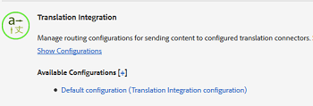
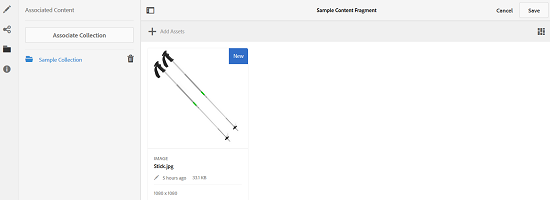
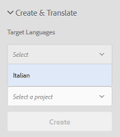
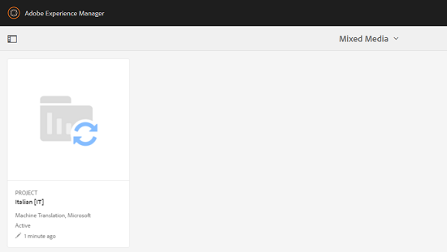
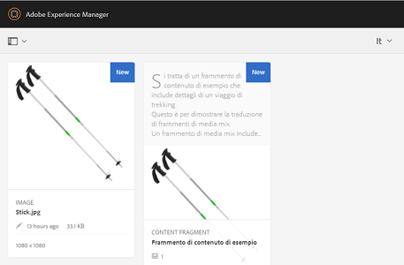

# Criação de projetos de tradução para fragmentos de conteúdo {#creating-translation-projects-for-content-fragments}

Além dos ativos, o Adobe Experience Manager (AEM) Assets oferece suporte a fluxos de trabalho de cópia de idioma para fragmentos [de](content-fragments.md) conteúdo (incluindo variações). Nenhuma otimização adicional é necessária para executar fluxos de trabalho de cópia de idioma em fragmentos de conteúdo. Em cada fluxo de trabalho, todo o fragmento de conteúdo é enviado para tradução.

Os tipos de fluxos de trabalho que você pode executar em fragmentos de conteúdo são exatamente semelhantes aos tipos de fluxo de trabalho que você executa para ativos. Além disso, as opções disponíveis em cada tipo de fluxo de trabalho correspondem às opções disponíveis nos tipos de fluxos de trabalho correspondentes para ativos.

Você pode executar os seguintes tipos de fluxos de trabalho de cópia de idioma em fragmentos de conteúdo:

**Criar e traduzir**

Neste fluxo de trabalho, os fragmentos de conteúdo a serem traduzidos são copiados para a raiz do idioma para o qual você deseja traduzir. Além disso, dependendo das opções escolhidas, um projeto de tradução é criado para os fragmentos de conteúdo no console Projetos. Dependendo das configurações, o projeto de tradução pode ser iniciado manualmente ou pode ser executado automaticamente assim que o projeto de tradução for criado.

**Atualizar cópias de idioma**

Quando o fragmento do conteúdo de origem é atualizado ou modificado, o fragmento do conteúdo específico da localidade/idioma correspondente requer retradução. O fluxo de trabalho de cópias de idioma de atualização traduz um grupo adicional de fragmentos de conteúdo e o inclui em uma cópia de idioma para uma localidade específica. Nesse caso, os fragmentos de conteúdo traduzidos são adicionados à pasta de destino que já contém fragmentos de conteúdo convertidos anteriormente.

## Criar e traduzir fluxo de trabalho {#create-and-translate-workflow}

O fluxo de trabalho Criar e traduzir inclui as seguintes opções. As etapas processuais associadas a cada opção são semelhantes às associadas à opção correspondente para ativos.

* Criar apenas estrutura: Para etapas do procedimento, consulte [Criar estrutura somente para ativos](translation-projects.md#create-structure-only).
* Criar um novo projeto de tradução: Para obter as etapas do procedimento, consulte [Criar um novo projeto de tradução para ativos](translation-projects.md#create-a-new-translation-project).
* Adicionar ao projeto de tradução existente: Para obter as etapas do procedimento, consulte [Adicionar ao projeto de tradução existente para ativos](translation-projects.md#add-to-existing-translation-project).

## Atualizar fluxo de trabalho de cópias de idioma {#update-language-copies-workflow}

O fluxo de trabalho de cópias de idioma de atualização inclui as seguintes opções. As etapas processuais associadas a cada opção são semelhantes às associadas à opção correspondente para ativos.

* Criar um novo projeto de tradução: Para obter as etapas do procedimento, consulte [Criar um novo projeto de tradução para ativos](translation-projects.md#create-a-new-translation-project) (fluxo de trabalho de atualização).
* Adicionar ao projeto de tradução existente: Para obter as etapas do procedimento, consulte [Adicionar ao projeto de tradução existente para ativos](translation-projects.md#add-to-existing-translation-project) (fluxo de trabalho de atualização).

Também é possível criar cópias temporárias de idioma para fragmentos semelhantes à forma como você cria cópias temporárias para ativos. Para obter detalhes, consulte [Criação de cópias de idioma temporário para ativos](translation-projects.md#creating-temporary-language-copies).

## Traduzir fragmentos de mídia mista {#translating-mixed-media-fragments}

O AEM permite que você traduza fragmentos de conteúdo que incluem vários tipos de ativos de mídia e coleções. Se você traduzir um fragmento de conteúdo que inclui ativos em linha, as cópias traduzidas desses ativos serão armazenadas na raiz do idioma de destino.

Se o fragmento de conteúdo incluir uma coleção, os ativos dentro da coleção serão traduzidos juntamente com o fragmento de conteúdo. As cópias traduzidas dos ativos são armazenadas na raiz apropriada do idioma de destino em um local que corresponda ao local físico dos ativos de origem na raiz do idioma de origem.

Para poder traduzir fragmentos de conteúdo que incluem mídia mista, edite primeiro a estrutura de tradução padrão para permitir a tradução de ativos embutidos e coleções associados a fragmentos de conteúdo.

1. Clique/toque no logotipo do AEM e navegue até **[!UICONTROL Ferramentas > Implantação > Serviços]** em nuvem.
1. Localize a integração **[!UICONTROL de]** tradução na **[!UICONTROL Adobe Marketing Cloud]** e clique/toque em **[!UICONTROL Mostrar configurações]**.

   

1. Na lista de configurações disponíveis, clique/toque em Configuração **[!UICONTROL padrão (configuração de integração de tradução)]** para abrir a página de configuração **** padrão.

   

1. Clique em **[!UICONTROL Editar]** na barra de ferramentas para exibir a caixa de diálogo Configuração **[!UICONTROL da]** tradução.

   

1. Navegue até a guia **[!UICONTROL Ativos]** e escolha Ativos de mídia **[!UICONTROL incorporados e Coleções]** associadas na lista **[!UICONTROL Traduzir ativos]** de fragmento de conteúdo. Click/tap **[!UICONTROL OK]** to save the changes.

   

1. Na pasta raiz em inglês, abra um fragmento de conteúdo.

   

1. Clique/toque no ícone **[!UICONTROL Inserir ativo]** .

   

1. Insira um ativo no fragmento de conteúdo.

   

1. Clique/toque no ícone **[!UICONTROL Associar conteúdo]** .

   

1. Clique/toque em **[!UICONTROL Associar conteúdo]**.

   

1. Selecione uma coleção e inclua-a no fragmento do conteúdo. Click/tap **[!UICONTROL Save]**.

   

1. Selecione o fragmento de conteúdo e clique/toque no ícone **[!UICONTROL GlobalNav]** .
1. Selecione **[!UICONTROL Referências]** no menu para exibir o painel **[!UICONTROL Referências]** .

   

1. Clique/toque em Cópias **[!UICONTROL de]** idioma em **[!UICONTROL Cópias]** para exibir as cópias de idioma.

   

1. Clique/toque em **[!UICONTROL Criar e traduzir]** na parte inferior do painel para exibir a caixa de diálogo **[!UICONTROL Criar e traduzir]** .

   

1. Selecione o idioma de destino na lista Idiomas **[!UICONTROL de]** destino.

   

1. Selecione o tipo de projeto de conversão na lista **[!UICONTROL Projeto]** .

   

1. Especifique o título do projeto na caixa Título **[!UICONTROL do]** projeto e clique/toque em **Criar**.

   

1. Navegue até o console **[!UICONTROL Projetos]** e abra a pasta do projeto para o projeto de tradução criado.

   

1. Clique/toque no bloco do projeto para abrir a página de detalhes do projeto.

   

1. No bloco Trabalho de tradução, verifique o número de ativos a serem convertidos.
1. A partir do mosaico Trabalho **[!UICONTROL de]** Tradução, inicie o trabalho de tradução.

   

1. Clique nas elipses na parte inferior do bloco Trabalho de tradução para exibir o status do trabalho de tradução.

   

1. Clique/toque no fragmento de conteúdo para verificar o caminho dos ativos associados convertidos.

   

1. Revise a cópia de idioma da coleção no console Coleções.

   

   Observe que somente o conteúdo da coleção é traduzido. A coleção em si não é traduzida.

1. Navegue até o caminho do ativo associado convertido. Observe que o ativo convertido é armazenado na raiz do idioma de destino.

   

1. Navegue até os ativos dentro da coleção que são traduzidos juntamente com o fragmento de conteúdo. Observe que as cópias traduzidas dos ativos são armazenadas na raiz apropriada do idioma de destino.

   

   >[!NOTE]
   >
   >Os procedimentos para adicionar um fragmento de conteúdo a um projeto existente ou para executar fluxos de trabalho de atualização são semelhantes aos procedimentos correspondentes para ativos. Para obter orientação sobre estes procedimentos, consulte os procedimentos descritos para os ativos.

