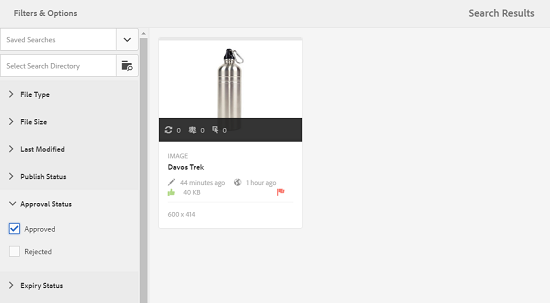

# Digital Rights Management de ativos {#digital-rights-management-in-assets}

Os ativos digitais geralmente são associados a uma licença que especifica os termos e a duração do uso. Como [!DNL Adobe Experience Manager Assets] é totalmente integrado à plataforma [!DNL Experience Manager], você pode gerenciar com eficiência as informações de expiração de ativos e os estados de ativos. Também é possível associar informações de licenciamento a ativos.

## Expiração do ativo {#asset-expiration}

A expiração do ativo é uma maneira eficaz de aplicar os requisitos de licença para ativos. Ela garante que o ativo publicado não seja publicado quando expirar, o que evita a possibilidade de qualquer violação de licença. Um usuário sem permissões de administrador não pode editar, copiar, mover, publicar e baixar um ativo expirado.

Você pode visualização o status de expiração de um ativo no console [!DNL Assets] nas visualizações de cartão e lista.

*Figura: Na visualização da lista, a   coluna Status exibe o   Expiredbanner.*

Você pode visualização o status de expiração de um ativo na [!UICONTROL Linha do tempo] no painel esquerdo.

>[!NOTE]
>
>A data de expiração de um ativo é exibida de forma diferente para usuários em fusos horários diferentes.

Você também pode visualização o status de expiração dos ativos no painel **[!UICONTROL Referências]**. Ele gerencia os status e as relações de expiração de ativos entre ativos compostos e subativos, coleções e projetos referenciados.

1. Navegue até o ativo para o qual você deseja visualização as páginas da Web e os ativos compostos.
1. Selecione o ativo e abra **[!UICONTROL Referências]** no painel esquerdo. Para ativos expirados, o trilho [!UICONTROL References] exibe o status de expiração **[!UICONTROL Asset is Expired]** no topo.

   

   Se o ativo tiver subativos expirados, o painel [!UICONTROL Referências] exibirá o status **[!UICONTROL O ativo tem subativos expirados]**.

   

### Pesquisar ativos expirados {#search-expired-assets}

Você pode pesquisar ativos expirados, incluindo subativos expirados no painel Pesquisar.

1. No console [!DNL Assets], clique em **[!UICONTROL Pesquisar]** na barra de ferramentas para exibir a caixa Omnisearch.

1. Com o cursor na caixa Omnisearch, selecione a tecla `Enter` para exibir a página de resultados da pesquisa.
1. Abra o painel de pesquisa no painel esquerdo. Clique na opção **[!UICONTROL Status de expiração]** para expandi-la.

   

1. Escolha **[!UICONTROL Expired]**. Somente os ativos expirados são exibidos após a filtragem dos resultados da pesquisa.

Quando você escolhe a opção **[!UICONTROL Expired]**, o console [!DNL Assets] exibe apenas os ativos e subativos expirados que são referenciados pelos ativos compostos. Os ativos compostos que fazem referência a subativos expirados não são exibidos imediatamente após a expiração dos subativos. Em vez disso, eles são exibidos depois que [!DNL Experience Manager] detecta que fazem referência a subativos expirados na próxima vez que o scheduler for executado.

Se você modificar a data de expiração de um ativo publicado para uma data anterior ao ciclo de scheduleres atual, a programação ainda detectará esse ativo como um ativo expirado na próxima vez que ele for executado e refletirá seu status de acordo.

Além disso, se uma falha ou erro impedir que o scheduler detecte ativos expirados no ciclo atual, o scheduler examinará novamente esses ativos no ciclo seguinte e detectará seu status expirado.

Para permitir que o console [!DNL Assets] exiba os ativos compostos de referência junto com os subativos expirados, configure um fluxo de trabalho **[!UICONTROL Notificação de expiração do Adobe CQ DAM]** no [!DNL Experience Manager] Configuration Manager.

1. Abra [!DNL Experience Manager] o Configuration Manager.
1. Escolha **[!UICONTROL Notificação de expiração do Adobe CQ DAM]**. Por padrão, **[!UICONTROL Scheduler com base em tempo]** está selecionado, o que programa um trabalho para verificar em um momento específico se um ativo expirou subativos. Após a conclusão da tarefa, os ativos que têm subativos expirados e ativos referenciados são exibidos como expirados nos resultados da pesquisa.

1. Para executar o trabalho periodicamente, desmarque o campo **[!UICONTROL Regra do agendador com base na hora]** e modifique o tempo em segundos no campo **[!UICONTROL Agendador periódico]**. Por exemplo, a expressão de exemplo `0 0 0 &ast; &ast; ?` aciona o trabalho em 00 horas.
1. Selecione **[!UICONTROL enviar e-mail]** para receber e-mails quando um ativo expirar.

   >[!NOTE]
   >
   >Somente o criador do ativo (a pessoa que carrega um ativo específico para [!DNL Assets]) recebe um email quando o ativo expira. Consulte [como configurar a notificação por e-mail](/help/sites-administering/notification.md) para obter mais detalhes sobre como configurar notificações por e-mail no nível [!DNL Experience Manager] geral.

1. No campo **[!UICONTROL Notificação prévia em segundos]**, especifique o tempo em segundos antes do momento em que um ativo expira quando você deseja receber uma notificação sobre a expiração. Os criadores de ativos recebem uma mensagem antes da expiração do ativo notificando que o ativo está prestes a expirar após o tempo especificado. Depois que o ativo expirar, você receberá outra notificação que confirmará a expiração. Além disso, os ativos expirados são desativados.

1. Clique em **[!UICONTROL Salvar]**.

## Estados do ativo {#asset-states}

O console [!DNL Assets] pode exibir vários estados para ativos. Dependendo do estado atual de um ativo específico, sua visualização de cartão exibe um rótulo que descreve seu estado, por exemplo, Expirado, Publicado, Aprovado, Rejeitada e assim por diante.

1. Na interface do usuário [!DNL Assets], selecione um ativo.
1. Clique em **[!UICONTROL Publicar]** na barra de ferramentas. Se você não vir **Publicar** na barra de ferramentas, clique em **[!UICONTROL Mais]** na barra de ferramentas e localize a opção **[!UICONTROL Publicar]** .
1. Escolha **[!UICONTROL Publicar]** no menu e feche a caixa de diálogo de confirmação.
1. Saia do modo de seleção. O status de publicação do ativo aparece na parte inferior da miniatura do ativo na visualização do cartão. Na visualização da lista, a coluna Publicado exibe a hora em que o ativo foi publicado.

   

1. Para exibir a página de detalhes do ativo, na interface [!DNL Assets], selecione um ativo e clique em **[!UICONTROL Propriedades]** .

1. Na guia [!UICONTROL Avançado], defina uma data de expiração para o ativo do campo **[!UICONTROL Expira]**.

   

   *Figura:  [!UICONTROL Guia ] Avançada em   Propriedade do ativo para definir a expiração do ativo.*

1. Clique em **[!UICONTROL Salvar]** e clique em **[!UICONTROL Fechar]** para exibir o console Ativos.
1. O status de publicação do ativo indica um status expirado na parte inferior da miniatura do ativo na visualização do cartão. Na visualização da lista, o status do ativo é exibido como **[!UICONTROL Expired]**.

   

1. No console [!DNL Assets], selecione uma pasta e crie uma tarefa de revisão na pasta.
1. Revise e aprove/rejeite os ativos na tarefa de revisão e clique em **[!UICONTROL Concluir]**.
1. Navegue até a pasta para a qual você criou a tarefa de revisão. O status dos ativos que você aprovou/rejeita é exibido na parte inferior da visualização do cartão. Na visualização da lista, os status de aprovação e expiração são exibidos em colunas apropriadas.

   

1. Para pesquisar ativos com base em seu status, clique em **[!UICONTROL Pesquisar]**  para exibir a barra do Omnisearch.
1. Selecione `Return` e clique em [!DNL Experience Manager] para exibir o painel de pesquisa.
1. No painel de pesquisa, clique em **[!UICONTROL Publicar status]** e selecione **[!UICONTROL Publicado]** para procurar ativos publicados em [!DNL Assets].

   

1. Clique em **[!UICONTROL Status de aprovação]** e clique na opção apropriada para procurar ativos aprovados ou rejeitados.

   

1. Para pesquisar ativos com base no status de expiração, selecione **[!UICONTROL Status de expiração]** no painel Pesquisar e escolha a opção adequada.

   

1. Você também pode pesquisar ativos com base em uma combinação de status em várias facetas de pesquisa. Por exemplo, você pode pesquisar ativos publicados que foram aprovados em uma tarefa de revisão e ainda não expiraram selecionando as opções apropriadas nas facetas de pesquisa.

   

## Digital Rights Management em [!DNL Assets] {#digital-rights-management-in-assets-1}

Este recurso impõe a aceitação do contrato de licença antes que você possa baixar um ativo licenciado de [!DNL Adobe Experience Manager Assets].

Se você selecionar um ativo protegido e clicar em **[!UICONTROL Download]**, será redirecionado para uma página de licença para aceitar o contrato de licença. Se você não aceitar o contrato de licença, a opção **[!UICONTROL Download]** não estará disponível.

Se a seleção contiver vários ativos protegidos, selecione um ativo de cada vez, aceite o contrato de licença e continue com o download do ativo.

Um ativo é considerado protegido se uma dessas condições for cumprida:

* A propriedade de metadados do ativo `xmpRights:WebStatement` aponta para o caminho da página que contém o contrato de licença do ativo.
* O valor da propriedade de metadados do ativo `adobe_dam:restrictions` é um HTML bruto que especifica o contrato de licença.

>[!NOTE]
>
>O local `/etc/dam/drm/licenses` usado para armazenar licenças em versões anteriores de [!DNL Experience Manager] está obsoleto.
>
>Se você criar ou modificar páginas de licença, ou porta-as de versões anteriores do [!DNL Experience Manager], o Adobe recomenda armazená-las em `/apps/settings/dam/drm/licenses` ou `/conf/&ast;/settings/dam/drm/licenses`.

### Baixar ativos protegidos por DRM {#downloading-drm-assets}

1. Na visualização do cartão, selecione os ativos que deseja baixar e clique em **[!UICONTROL Download]**.
1. Na página **[!UICONTROL Gerenciamento de direitos autorais]**, selecione o ativo que deseja baixar na lista.
1. No painel [!UICONTROL Licença], escolha **[!UICONTROL Concordar]**. Uma marca de seleção é exibida ao lado do ativo. Clique na opção **[!UICONTROL Download]**.

   >[!NOTE]
   >
   >A opção **[!UICONTROL Download]** só é ativada quando você opta por concordar com o contrato de licença de um ativo protegido. No entanto, se sua seleção incluir ativos protegidos e desprotegidos, somente os ativos protegidos serão listados no painel e a opção **[!UICONTROL Download]** será ativada para baixar os ativos desprotegidos. Para aceitar simultaneamente contratos de licença para vários ativos protegidos, selecione os ativos na lista e escolha **[!UICONTROL Concordar]**.

   

1. Na caixa de diálogo, clique em **[!UICONTROL Baixar]** para baixar o ativo ou suas representações.
