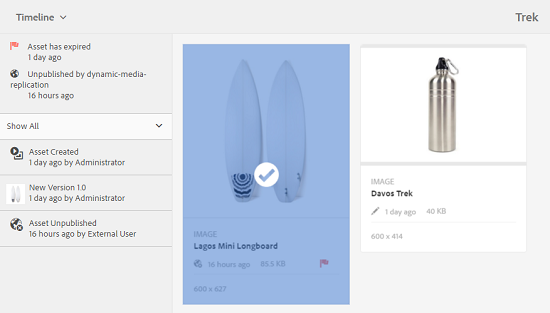
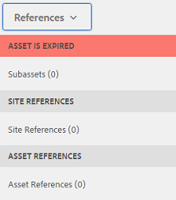

# Digital Rights Management for digital assets {#digital-rights-management-in-assets}

Os ativos digitais geralmente são associados a uma licença, que especifica seus termos e duração de uso. Como os ativos Adobe Experience Manager (AEM) são totalmente integrados à plataforma AEM, você pode gerenciar com eficiência as informações de expiração de ativos e os estados de ativos. Também é possível associar informações de licenciamento a ativos.

## Expiração do ativo {#asset-expiration}

A expiração do ativo é uma forma eficaz de aplicar os requisitos de licença para ativos. Ela garante que o ativo publicado não seja publicado quando expirar, o que evita a possibilidade de qualquer violação de licença. Um usuário sem direitos de administrador não pode editar, copiar, mover, publicar e baixar um ativo expirado.

Você pode exibir o status de expiração de um ativo no console Ativos nas exibições Cartão e Lista.

*Figura: Na exibição de cartão, um sinalizador no cartão indica o ativo expirado*

**Exibição de lista**

*Figura: Na exibição de lista, a coluna[!UICONTROL Status]exibe o banner[!UICONTROL Expirado].*

Você pode exibir o status de expiração de um ativo na linha do tempo. Selecione o ativo e escolha Linha do tempo no menu GlobalNav.

Você também pode exibir o status de expiração dos ativos no painel **[!UICONTROL Referências]** . Ele gerencia os status e as relações de expiração de ativos entre ativos compostos e subativos, coleções e projetos referenciados.

1. Navegue até o ativo para o qual você deseja exibir páginas da Web de referência e ativos compostos.
1. Selecione o ativo e o logotipo do Experience Manager.

1. Escolha **[!UICONTROL Referências]** no menu.

   

   Para ativos expirados, o painel Referências exibe o status de expiração **[!UICONTROL Ativo expirado]** na parte superior.

   

   Se o ativo tiver subativos expirados, o painel Referências exibirá o status **[!UICONTROL Ativo tiver subativos]** expirados.

   

### Pesquisar ativos expirados {#search-expired-assets}

Você pode pesquisar ativos expirados, incluindo subativos expirados no painel Pesquisar.

1. No console Ativos, clique em **[!UICONTROL Pesquisar]** na barra de ferramentas para exibir a caixa Omnisearch.

1. Com o cursor na caixa Omnisearch, pressione a tecla Return para exibir a página Resultados da pesquisa.

   

1. Clique no logotipo do Experience Manager para exibir o painel de pesquisa.

   

1. Clique/toque na opção **[!UICONTROL Status de expiração]** para expandi-la.

   

1. Selecione **[!UICONTROL Expirado]**. Os ativos expirados são exibidos nos resultados da pesquisa.

   

Quando você escolhe a opção **Expirado** , o console Ativos exibe apenas os ativos e subativos expirados que são referenciados pelos ativos compostos. Os ativos compostos que fazem referência a subativos expirados não são exibidos imediatamente após a expiração dos subativos. Em vez disso, eles são exibidos depois que o AEM Assets detecta que fazem referência a subativos expirados na próxima vez que o agendador for executado.

Se você modificar a data de expiração de um ativo publicado para uma data anterior ao ciclo atual do programador, a programação ainda detectará esse ativo como um ativo expirado na próxima vez que ele for executado e refletirá seu status de acordo.

Além disso, se uma falha ou erro impedir que o programador detecte ativos expirados no ciclo atual, o programador examinará novamente esses ativos no ciclo seguinte e detectará seu status expirado.

Para permitir que o console Assets exiba os ativos compostos de referência junto com os ativos secundários expirados, configure um fluxo de trabalho de **Notificação de expiração do Adobe CQ DAM** no AEM Configuration Manager.

1. Abra o AEM Configuration Manager.
1. Escolha **[!UICONTROL Adobe CQ DAM Expiry Notification]**. Por padrão, o Agendador **[!UICONTROL baseado em]** tempo é selecionado, o que agenda uma tarefa para verificar em um horário específico se um ativo expirou subativos. Após a conclusão da tarefa, os ativos que têm subativos expirados e ativos referenciados são exibidos como expirados nos resultados da pesquisa.

   

1. Para executar o trabalho periodicamente, desmarque o campo **[!UICONTROL Regra do agendador com base na hora]** e modifique o tempo em segundos no campo **[!UICONTROL Agendador periódico]**. Por exemplo, a expressão de exemplo &#39;0 0 0 &amp;ast; &amp;ast; ?&#39; aciona o trabalho às 00 horas.
1. Selecione **[!UICONTROL enviar e-mail]** para receber e-mails quando um ativo expirar.

   >[!NOTE]
   >
   >Somente o criador de ativos (a pessoa que carrega um ativo específico para os ativos AEM) recebe um email quando o ativo expira. Consulte [Configuração de notificação](/help/sites-administering/notification.md) por email para obter mais detalhes sobre como configurar notificações por email no nível geral do AEM.

1. No campo Notificação **[!UICONTROL anterior em segundos]** , especifique o tempo em segundos antes do momento em que um ativo expira quando você deseja receber uma notificação sobre a expiração. Se você for um administrador ou o criador do ativo, você receberá uma mensagem antes da expiração do ativo notificando que o ativo está prestes a expirar após o tempo especificado.

   Depois que o ativo expirar, você receberá outra notificação que confirmará a expiração. Além disso, os ativos expirados são desativados.

1. Clique em **[!UICONTROL Salvar]**.

## Estados do ativo {#asset-states}

O console Ativos dos ativos Adobe Experience Manager (AEM) pode exibir vários estados dos ativos. Dependendo do estado atual de um ativo específico, sua exibição de cartão exibe um rótulo que descreve seu estado, por exemplo, Expirado, Publicado, Aprovado, Rejeitado e assim por diante.

1. Na interface do usuário Ativos, selecione um ativo.

   

1. Toque em **[!UICONTROL Publicar]** na barra de ferramentas. Se você não vir **Publicar** na barra de ferramentas, toque em **[!UICONTROL Mais]** na barra de ferramentas e localize a opção **[!UICONTROL Publicar]** .

   

1. Escolha **[!UICONTROL Publicar]** no menu e feche a caixa de diálogo de confirmação.
1. Saia do modo de seleção. O status de publicação do ativo é exibido na parte inferior da miniatura do ativo na exibição do cartão. Na exibição de lista, a coluna Publicado exibe a hora em que o ativo foi publicado.

   

1. Na interface do usuário Ativos, selecione um ativo e toque em **[!UICONTROL Propriedades]** para exibir a página de detalhes do ativo.

   

1. Na guia Avançado, e defina uma data de expiração para o ativo no campo **[!UICONTROL Expira]** em.

   

1. Clique em **[!UICONTROL Salvar]** e em **[!UICONTROL Fechar]** para exibir o console Ativos.
1. O status de publicação do ativo indica um status expirado na parte inferior da miniatura do ativo na exibição do cartão. Na exibição de lista, o status do ativo é exibido como **[!UICONTROL Expirado]**.

   

1. No console Ativos, selecione uma pasta e crie uma tarefa de revisão na pasta.
1. Revise e aprove/rejeite os ativos na tarefa de revisão e clique em **[!UICONTROL Concluir]**.
1. Navegue até a pasta para a qual você criou a tarefa de revisão. O status dos ativos que você aprovou/rejeita é exibido na parte inferior da exibição do cartão. Na exibição de lista, os status de aprovação e expiração são exibidos em colunas apropriadas.

   

1. Para pesquisar ativos com base em seu status, toque em **[!UICONTROL Pesquisar]** para exibir a barra Omnisearch.

   

1. Pressione return (Retornar) e, em seguida, toque em **[!UICONTROL GlobalNav]** para exibir o painel Search (Pesquisar).
1. No painel Pesquisar, toque/clique em **[!UICONTROL Publicar status]** e selecione **[!UICONTROL Publicado]** para procurar ativos publicados nos AEM Assets.

   

1. Toque/clique em **[!UICONTROL Status de aprovação]** e clique na opção apropriada para procurar ativos aprovados ou rejeitados.

   

1. Para pesquisar ativos com base no status de expiração, selecione **[!UICONTROL Status de expiração]** no painel Pesquisar e escolha a opção adequada.

   

1. Você também pode pesquisar ativos com base em uma combinação de status em várias facetas de pesquisa. Por exemplo, você pode pesquisar ativos publicados que foram aprovados em uma tarefa de revisão e ainda não expiraram selecionando as opções apropriadas nas facetas de pesquisa.

   

## Digital Rights Management in Assets {#digital-rights-management-in-assets-1}

Este recurso impõe a aceitação do contrato de licença antes de você poder baixar um ativo licenciado dos ativos Adobe Experience Manager (AEM).

Se você selecionar um ativo protegido e tocar em **[!UICONTROL Download]**, será redirecionado para uma página de licença na qual você aceita o contrato de licença. Se você não aceitar o contrato de licença, o botão **[!UICONTROL Download]** será desativado.

Se a seleção contiver vários ativos protegidos, selecione um ativo de cada vez, aceite o contrato de licença e continue com o download do ativo.

Um ativo é considerado protegido se uma dessas condições for cumprida:

* A propriedade de metadados do ativo `xmpRights:WebStatement` aponta para o caminho da página CQ que contém o contrato de licença do ativo.
* O valor da propriedade de metadados do ativo `adobe_dam:restrictions` é um HTML bruto que especifica o contrato de licença.

>[!NOTE]
>
>O local `/etc/dam/drm/licenses` usado para armazenar licenças em versões anteriores do AEM está obsoleto.
>
>Se você criar ou modificar páginas de licença ou as portar de versões anteriores do AEM, a Adobe recomenda armazená-las em `/apps/settings/dam/drm/licenses` ou `/conf/&ast;/settings/dam/drm/licenses`.

### Baixar ativos protegidos por DRM {#downloading-drm-assets}

1. Na exibição Cartão, selecione os ativos que deseja baixar e clique em **[!UICONTROL Download]**.
1. Na página **[!UICONTROL Gerenciamento de direitos autorais]**, selecione o ativo que deseja baixar na lista.
1. No painel Licença, escolha **[!UICONTROL Concordar]**. Uma marca de verificação é exibida ao lado do ativo para o qual você aceita o contrato de licença. Toque/clique no botão **[!UICONTROL Download]** .

   >[!NOTE]
   >
   >O botão **[!UICONTROL Download]** é ativado somente quando você opta por concordar com o contrato de licença de um ativo protegido. No entanto, se sua seleção incluir ativos protegidos e desprotegidos, somente os ativos protegidos serão listados no painel à esquerda e o botão **[!UICONTROL Download]** será ativado para baixar os ativos desprotegidos. Para aceitar simultaneamente contratos de licença para vários ativos protegidos, selecione os ativos na lista e escolha **[!UICONTROL Concordar]**.

   

1. Na caixa de diálogo, toque/clique em **[!UICONTROL Download]** para baixar o ativo ou suas representações.
