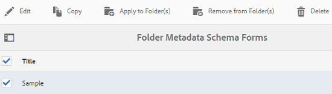

# Esquema de metadados de pastas {#folder-metadata-schema}

Os ativos Adobe Experience Manager permitem que você crie schemas de metadados para pastas de ativos, que definem o layout e os metadados exibidos nas páginas de propriedades da pasta.

## Adicionar um formulário de schema de metadados de pasta {#add-a-folder-metadata-schema-form}

Use o editor de Formulários de Schema de Metadados da Pasta para criar e editar schemas de metadados para pastas.

1. Na interface do Experience Manager, vá para **[!UICONTROL Ferramentas]** > **[!UICONTROL Ativos]** > Schemas **[!UICONTROL de metadados da]** pasta.
1. Na página Formulários [!UICONTROL de Schema de Metadados de] Pasta, clique em **[!UICONTROL Criar]**.
1. Specify a name for the form, and click **[!UICONTROL Create]**. O novo formulário de schema é listado na página Formulários [!UICONTROL de] Schemas.

## Edit folder metadata schema forms {#edit-folder-metadata-schema-forms}

É possível editar um formulário de schema de metadados recém-adicionado ou existente, que inclui o seguinte:

* Guias
* Itens de formulário em guias.

Você pode mapear/configurar esses itens de formulário em um campo dentro de um nó de metadados no repositório CRX. É possível adicionar novas guias ou itens de formulário ao formulário de schema de metadados.

1. Na página Formulários de Schema, selecione o formulário criado e selecione a opção **[!UICONTROL Editar]** na barra de ferramentas.
1. Na página Editor de Schemas de Metadados de Pastas, clique em `+` para adicionar uma guia ao formulário. Para renomear a guia, clique no nome padrão e especifique o novo nome em **[!UICONTROL Configurações]**.

   

   Para adicionar mais guias, clique em `+`. Clique `X` em uma guia para excluí-la.

1. Na guia ativa, adicione um ou mais componentes da guia **[!UICONTROL Criar formulário]** .

   

   Se você criar várias guias, clique em uma guia específica para adicionar componentes.

1. Para configurar um componente, selecione-o e modifique suas propriedades na guia **[!UICONTROL Configurações]** .

   Se necessário, exclua um componente da guia **[!UICONTROL Configurações]** .

   

1. Clique em **[!UICONTROL Salvar]** na barra de ferramentas para salvar as alterações.

### Componentes para criar formulários {#components-to-build-forms}

A guia **[!UICONTROL Criar formulário]** lista itens de formulário que você usa no formulário de schema de metadados da pasta. A guia **[!UICONTROL Configurações]** exibe os atributos para cada item selecionado na guia **[!UICONTROL Criar formulário]** . Esta é uma lista dos itens de formulário disponíveis na guia **[!UICONTROL Criar formulário]** :

| Nome do componente | Descrição |
|---|---|
| [!UICONTROL Título da seção] | Adicione um cabeçalho de seção para uma lista de componentes comuns. |
| [!UICONTROL Texto em linha única] | Adicione uma propriedade de texto de linha única. É armazenado como uma string. |
| [!UICONTROL Texto multivalor] | Adicione uma propriedade de texto de vários valores. Ele é armazenado como uma matriz de string. |
| [!UICONTROL Número] | Adicione um componente de número. |
| [!UICONTROL Data] | Adicione um componente de data. |
| [!UICONTROL Lista suspensa] | Adicione uma lista suspensa. |
| [!UICONTROL Tags padrão] | Adicionar uma tag. |
| [!UICONTROL Campo oculto] | Adicionar um campo oculto. Ele é enviado como um parâmetro POST quando o ativo é salvo. |

### Editar itens de formulário {#editing-form-items}

Para editar as propriedades dos itens de formulário, clique no componente e edite todas as propriedades ou um subconjunto das seguintes na guia **[!UICONTROL Configurações]** .

**[!UICONTROL Rótulo]** do campo: O nome da propriedade de metadados que é exibida na página de propriedades da pasta.

**[!UICONTROL Mapear para propriedade]**: Essa propriedade especifica o caminho relativo do nó de pasta no repositório CRX onde ele é salvo. Ele start com &quot;**./**&quot;, que indica que o caminho está sob o nó da pasta.

Estes são os valores válidos para esta propriedade:

* `./jcr:content/metadata/dc:title`: Armazena o valor no nó de metadados da pasta como a propriedade `dc:title`.

* `./jcr:created`: Exibe a propriedade JCR no nó da pasta. Se você configurar essas propriedades no CRXDE, a Adobe recomenda marcá-las como Desativar edição, pois elas estão protegidas. Caso contrário, o erro &#39; `Asset(s) failed to modify`&#39; ocorrerá quando você salvar as propriedades do ativo.

Para garantir que o componente seja exibido corretamente no formulário de schema de metadados, não inclua um espaço no caminho da propriedade.

**[!UICONTROL Caminho]** JSON: Use-o para especificar o caminho do arquivo JSON no qual você especifica pares de valores chave para opções.

**[!UICONTROL Espaço reservado]**: Use essa propriedade para especificar o texto relevante do espaço reservado para a propriedade metadata.

**[!UICONTROL Opções]**: Use essa propriedade para especificar opções em uma lista.

**[!UICONTROL Descrição]**: Use essa propriedade para adicionar uma breve descrição para o componente de metadados.

**[!UICONTROL Classe]**: Classe de objeto à qual a propriedade está associada.

## Delete folder metadata schema forms {#delete-folder-metadata-schema-forms}

Você pode excluir formulários de schema de metadados de pasta da página Formulários de Schema de Metadados de Pasta. Para excluir um formulário, selecione-o e clique na opção Excluir da barra de ferramentas.

## Atribuir um schema de metadados de pasta {#assign-a-folder-metadata-schema}

Você pode atribuir um schema de metadados de pasta a uma pasta na página Formulários de Schema de Metadados de Pasta ou ao criar uma pasta.

Se você configurar um schema de metadados para uma pasta, o caminho para o formulário de schema será armazenado na propriedade `folderMetadataSchema` do nó de pasta em .*/jcr:content*.

### Atribuir a um schema da página Schema Metadados da pasta {#assign-to-a-schema-from-the-folder-metadata-schema-page}

1. Na interface do Experience Manager, vá para **[!UICONTROL Ferramentas]** > **[!UICONTROL Ativos]** > Schemas **[!UICONTROL de metadados da]** pasta.
1. Na página Formulários de Schema de Metadados de Pastas, selecione o formulário de schema que deseja aplicar a uma pasta.
1. Na barra de ferramentas, clique em **[!UICONTROL Aplicar às pastas]**.

1. Selecione a pasta na qual aplicar o schema e clique em **[!UICONTROL Aplicar]**. Se um schema de metadados já estiver aplicado na pasta, uma mensagem de aviso informará que você está prestes a substituir o schema de metadados existente. Clique em **[!UICONTROL Substituir]**.
1. Abra as propriedades de metadados da pasta na qual você aplicou o schema de metadados.

   

   To view the folder metadata fields, click the **[!UICONTROL Folder Metadata]** tab.

   

### Atribuir um schema ao criar uma pasta {#assign-a-schema-when-creating-a-folder}

Você pode atribuir um schema de metadados de pasta ao criar uma pasta. Se pelo menos um schema de metadados de pasta existir no sistema, uma lista extra será exibida na caixa de diálogo **[!UICONTROL Criar pasta]** . Você pode selecionar o schema desejado. Por padrão, nenhum schema é selecionado.

1. Na interface do [!DNL Experience Manager Assets] usuário, clique em **[!UICONTROL Criar]** na barra de ferramentas.
1. Especifique um título e nome para a pasta.
1. Na lista Schema Metadados da pasta, selecione o schema desejado. Em seguida, clique em **[!UICONTROL Criar]**.

   

1. Abra as propriedades de metadados da pasta na qual você aplicou o schema de metadados.
1. To view the folder metadata fields, click the **[!UICONTROL Folder Metadata]** tab.

## Usar o schema de metadados da pasta {#use-the-folder-metadata-schema}

Abra as propriedades de uma pasta configurada com um esquema de metadados de pasta. A **[!UICONTROL Folder Metadata]** tab is displayed in the folder [!UICONTROL Properties] page. Para exibir o formulário de esquema de metadados da pasta, selecione essa guia.

Insira valores de metadados nos vários campos e clique em **[!UICONTROL Salvar]** para armazenar os valores. Os valores especificados são armazenados no nó da pasta no repositório CRX.

