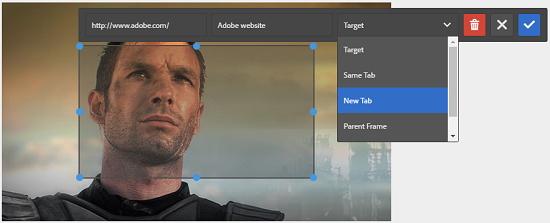

# Adicionar mapas de imagem {#adding-image-maps}

Os mapas de imagem permitem adicionar uma ou mais áreas hipervinculadas que funcionam como outros hiperlinks.

1. Execute um dos procedimentos a seguir para abrir o Editor **[!UICONTROL de imagens]** no local:

   * Usando Ações rápidas, clique em **[!UICONTROL Editar]** que aparece em um ativo na visualização **[!UICONTROL Cartão]** . Na visualização da Lista, selecione o ativo e clique na opção **[!UICONTROL Editar]** na barra de ferramentas.

      >[!NOTE]
      >
      >As Ações rápidas não estão disponíveis na visualização da **[!UICONTROL Lista]** .

   * Na **[!UICONTROL caixa Cartão]** ou visualização de **[!UICONTROL Lista]** , selecione o ativo e clique em **[!UICONTROL Editar]** na barra de ferramentas.
   * Clique em **[!UICONTROL Editar]** na página do ativo.

      

1. Para inserir um mapa de imagem, clique em **[!UICONTROL Iniciar mapa]** de  .
1. Selecione a forma do mapa de imagem. O ponto de acesso da forma selecionada é colocado na imagem.

   

1. Clique no ponto de acesso e insira o URL e o texto Alt. Na lista do **[!UICONTROL Público alvo]** , especifique onde deseja que o mapa de imagem seja exibido, por exemplo, a mesma guia, uma nova guia ou um iFrame. Por exemplo, insira `https://www.adobe.com` como o URL, `Adobe website` como o texto alternativo, e especifique **[!UICONTROL Nova guia]** na lista do **[!UICONTROL Público alvo]** para que o mapa de imagem seja aberto em uma nova guia.

   

1. Clique em **[!UICONTROL Confirmar]** e, em seguida, clique em **[!UICONTROL Concluir]**  na barra de ferramentas para salvar as alterações.

   Para excluir o mapa de imagem, clique no ponto de acesso e em **[!UICONTROL Excluir]** .

1. Para visualização do mapa de imagem, navegue até a página de detalhes do ativo e passe o cursor sobre a imagem.

   

   Se a opção Dynamic Media estiver ativada, navegue até o editor de ativos e clique em **[!UICONTROL Mapa]** para visualização de todos os mapas de imagem aplicados.
