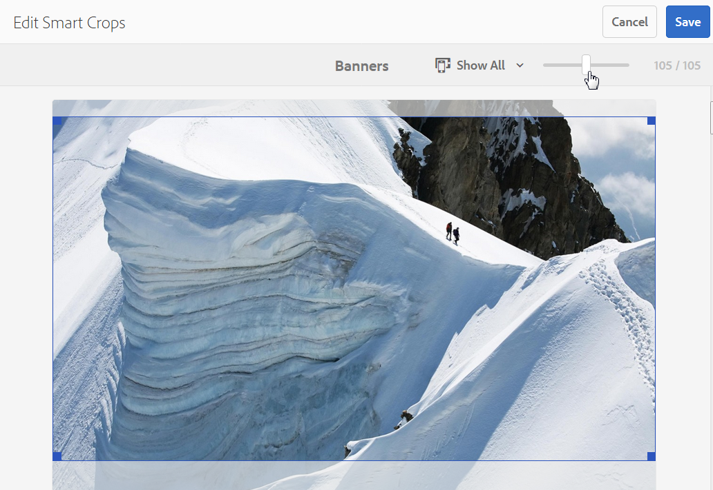
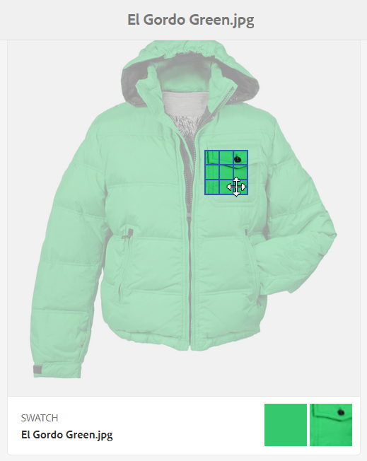

# Perfis de imagem do Dynamic Media {#image-profiles}

Ao fazer upload de imagens, você pode cortar automaticamente a imagem após o upload aplicando um Perfil de imagem à pasta.

>[!IMPORTANT]
>
>· O Recorte inteligente está disponível somente no modo Dynamic Media - Scene7.
· Os perfis de imagem não se aplicam a arquivos PDF, GIF animados ou INDD (Adobe InDesign).

## Opções de corte {#crop-options}

Ao implementar o Recorte inteligente em imagens, o Adobe recomenda a seguinte prática recomendada e impõe o seguinte limite:

| Tipo de limite | Prática recomendada | Limite imposto |
| --- | --- | --- |
| Número de cortes inteligentes por imagem | 5 | 100 |

Consulte também [Limitações do Dynamic Media](/help/assets/limitations.md).

<!-- CQDOC-16069 for paragraph directly below -->

As coordenadas de corte inteligente dependem da taxa de proporção. Para as várias configurações de recorte inteligente em um Perfil de imagem, se a taxa de proporção for a mesma para as dimensões adicionadas no Perfil de imagem, a mesma taxa de proporção será enviada para o Dynamic Media. A Adobe recomenda usar a mesma área de corte. Isso garante que não haja impacto em diferentes dimensões usadas no Perfil de imagem.

Cada geração de Recorte inteligente criada requer processamento extra. Por exemplo, adicionar mais de cinco proporções de corte inteligente pode resultar em uma taxa de assimilação de ativos lenta. Também provoca um aumento de carga nos sistemas. Como você pode aplicar o Corte inteligente no nível da pasta, o Adobe recomenda usá-lo em pastas *somente* onde for necessário.

**Diretrizes para definir o Recorte inteligente em um Perfil de imagem**
Para manter o uso do Corte inteligente sob controle e otimizar o tempo de processamento e o armazenamento das lavouras, a Adobe recomenda as seguintes diretrizes e dicas:

* Evite criar perfis de corte inteligente duplicados que tenham os mesmos valores de largura e altura.
* Nomeie os cortes inteligentes com base nas dimensões do corte, não no uso final. Isso ajuda a otimizar para duplicatas em que uma única dimensão é usada em várias páginas.
* Crie perfis de imagem ao nível da página/tipo de ativo para pastas e subpastas específicas em vez de um perfil de recorte inteligente comum que é aplicado a todas as pastas ou todos os ativos.
* Um perfil de imagem aplicado a subpastas substitui um perfil de imagem aplicado à pasta.
* Crie perfis de imagem para pastas e subpastas específicas em nível de página/tipo de ativo, em vez de um perfil de recorte inteligente comum aplicado a todas as pastas ou a todos os ativos.
* Um Perfil de imagem que você aplica a subpastas substitui um Perfil de imagem que é aplicado à pasta.
* Idealmente, tenha de 10 a 15 recortes inteligentes por imagem para otimizar as taxas de tela e o tempo de processamento.

<!--
* Image assets that are going to have a smart crop applied to them must be a minimum of 50 x 50 pixels or larger. CQDOC-20087
* An Image Profile that contains duplicate smart crop dimensions is not permitted. CQDOC-20087
* Duplicate named Image Profiles that have smart crop options set are not permitted. CQDOC-20087
* Create page-wise/asset type-wise Image Profiles for specific folders and subfolders instead of a common smart crop profile that is applied to all folders or all assets.
* An Image Profile that you apply to subfolders overrides an Image Profile that is applied to the folder.
* Ideally, have 10-15 smart crops per image to optimize for screen ratios and processing time. -->
<!-- * Avoid creating duplicate smart crop profiles that have the same width and height values. 
* Name smart crops based on crop dimensions, not on end usage. Doing so helps to optimize for duplicates where a single dimension is used on multiple pages. -->

Você tem duas opções de corte de imagem para escolher: Corte de pixels ou Corte inteligente. Também é possível optar por automatizar a criação de amostras de cores e imagens.

>[!IMPORTANT]
· A Adobe recomenda que você analise todas as culturas e amostras geradas para garantir que sejam apropriadas e relevantes para sua marca e valores.
· O formato de imagem CMYK não é compatível com o recorte inteligente.

| Opção | Quando usar | Descrição |
| --- | --- | --- |
| Cortar pixel | Imagens de corte em massa somente com base em dimensões. | Para usar essa opção, selecione **[!UICONTROL Cortar pixel]** na lista suspensa Opções de corte.  Para recortar das laterais de uma imagem, digite o número de pixels a serem recortados de qualquer lado ou de cada lado da imagem. O quanto da imagem é cortada depende da configuração ppi (pixels por polegada) no arquivo de imagem.  Um corte de pixel do Perfil de imagem é renderizado da seguinte maneira: · Os valores são Superior, Inferior, Esquerdo e Direito. · Superior esquerdo é considerado `0,0` e o corte de pixels é calculado a partir daí. · Ponto inicial do corte: À esquerda é X e Acima é Y · Cálculo horizontal: dimensão em pixels horizontal da imagem original menos Esquerda e menos Direita. · Cálculo vertical: altura de pixel vertical menos Superior e menos Inferior.  Por exemplo, suponha que você tenha uma imagem de 4000 x 3000 pixels. Você usa valores: Top=250, Bottom=500, Left=300, Right=700.  Do canto superior esquerdo (300.250), corte usando o espaço de preenchimento de (4000-300-700, 3000-250-500 ou 3000.2250). |
| Corte inteligente | Recorte de imagens em massa com base em seu ponto focal visual. | O Recorte inteligente usa o poder da inteligência artificial no Adobe Sensei para automatizar rapidamente o recorte de imagens em massa. O Corte inteligente detecta automaticamente e recorta até o ponto focal em qualquer imagem para capturar o ponto de interesse desejado, independentemente do tamanho da tela.
 
Para usar o Corte inteligente, selecione **[!UICONTROL Corte inteligente]** na lista suspensa Opções de corte, à direita de Recorte responsivo de imagem, ative (ative) o recurso.
 
Os tamanhos padrão de pontos de interrupção de Grande, Médio e Pequeno geralmente cobrem a gama completa de tamanhos que a maioria das imagens é usada em dispositivos móveis e tablets, desktops e banners. Se desejar, você pode editar os nomes padrão Grande, Médio e Pequeno.
 
Para adicionar mais pontos de interrupção, selecione **[!UICONTROL Adicionar corte]** para excluir um corte, selecione o ícone Lixeira. |
| Amostra de cor e imagem | O gera uma amostra de imagem em massa para cada imagem. | **Nota**: a amostra inteligente não é compatível com o Dynamic Media Classic.  Localize e gere automaticamente amostras de alta qualidade a partir de imagens de produtos que mostram cor ou textura.  Para usar a Amostra de cor e imagem, selecione **[!UICONTROL Corte inteligente]** na lista suspensa Opções de corte, à direita de Cor e Amostra de imagem, ative (ative) o recurso. Insira um valor de pixel nas caixas de texto Largura e Altura.  Embora todos os recortes de imagem estejam disponíveis no painel Representações, as amostras são usadas somente por meio do recurso Copiar URL. Use seu próprio componente de visualização para renderizar a amostra em seu site. (A exceção a essa regra são os banners do carrossel. O Dynamic Media fornece o componente de visualização para a amostra usada nos banners do carrossel.)  **Uso de amostras de imagem**  O URL para amostras de imagem é simples. É:  `/is/image/company/&lt;asset_name&gt;:Swatch` onde `:Swatch` está anexado à solicitação de ativo.  **Uso de amostras de cores**  Para usar amostras de cores, você faz um `req=userdata` solicitação com o seguinte: `/is/image/&lt;company_name&gt;/&lt;swatch_asset_name&gt;:Swatch?req=userdata`  Por exemplo, este é um ativo de amostra no Dynamic Media Classic: `https://my.company.com:8080/is/image/DemoCo/Sleek:Swatch` e aqui está a amostra do ativo correspondente `req=userdata` URL: `https://my.company.com:8080/is/image/DemoCo/Sleek:Swatch?req=userdata`  A variável `req=userdata` resposta é a seguinte: `SmartCropDef=Swatch SmartCropHeight=200.0` `SmartCropRect=0.421671,0.389815,0.0848564,0.0592593,200,200` `SmartCropType=Swatch` `SmartCropWidth=200.0` `SmartSwatchColor=0xA56DB2`  Você também pode solicitar uma `req=userdata` resposta no formato XML ou JSON, como nos seguintes exemplos de URL: `https://my.company.com:8080/is/image/DemoCo/Sleek:Swatch?req=userdata,json` `https://my.company.com:8080/is/image/DemoCo/Sleek:Swatch?req=userdata,xml`  **Nota:** Crie seu próprio componente WCM para solicitar uma amostra de cor e analisar o `SmartSwatchColor` atributo, representado por um valor hexadecimal RGB de 24 bits.  Consulte também [`userdata` no Guia de referência de visualizadores](https://experienceleague.adobe.com/docs/dynamic-media-developer-resources/image-serving-api/image-serving-api/http-protocol-reference/command-reference/req/r-userdata.html). |

## Tirar nitidez da máscara {#unsharp-mask}

Use a **[!UICONTROL Tirar nitidez da máscara]** para ajustar um efeito de filtro de nitidez na imagem final com resolução reduzida. É possível controlar a intensidade do efeito, o raio do efeito (medido em pixels) e um limite de contraste que é ignorado. Adobe Photoshop Esse efeito usa as mesmas opções que o *Tirar nitidez da máscara* filtro.

>[!NOTE]
A Tirar nitidez da máscara é aplicada somente a representações em menor escala no PTIFF (tiff de pirâmide) com uma resolução reduzida de mais de 50%. Isso significa que as representações de maior tamanho dentro do ptiff não são afetadas pela Tirar nitidez da máscara, enquanto representações de menor tamanho, como miniaturas, são alteradas (e mostram a Tirar nitidez da máscara).

Entrada **[!UICONTROL Tirar nitidez da máscara]**, você tem as seguintes opções de filtro:

| Opção | Descrição |
| --- | --- |
| Quantidade | Controla a quantidade de contraste aplicada aos pixels de borda. O padrão é 1,75. Para imagens de alta resolução, é possível aumentá-las para até 5. Pense na Quantidade como uma medida da intensidade do filtro. O intervalo é de 0 a 5. |
| Raio | Determina o número de pixels em torno dos pixels de borda que afetam a nitidez. Para imagens de alta resolução, insira de 1 a 2. Um valor baixo aplica nitidez apenas aos pixels de borda; um valor alto aplica nitidez a uma faixa mais ampla de pixels. O valor correto depende da imagem. O valor padrão é 0,2. O intervalo é de 0 a 250. |
| Limite | Determina o intervalo de contraste que deve ser ignorado quando o filtro Tirar nitidez da máscara é aplicado. Em outras palavras, essa opção determina o quão diferentes os pixels com nitidez devem ser da área ao redor antes de serem considerados pixels de borda e de serem nitidez. Para evitar a introdução de ruídos, experimente valores entre 0 e 255. |

A nitidez é descrita em [Nitidez de imagens](/help/assets/assets/sharpening_images.pdf).

## Criar perfis de imagem do Dynamic Media {#creating-image-profiles}

Para definir parâmetros de processamento avançado para outros tipos de ativos, consulte [Configuração do processamento de ativos](config-dms7.md#configuring-asset-processing).

Consulte [Perfis para processamento de metadados, imagens e vídeos](processing-profiles.md).

Consulte também [Práticas recomendadas para organizar ativos digitais para usar perfis de processamento](/help/assets/organize-assets.md).

**Para criar perfis de imagem do Dynamic Media:**

1. Selecione o logotipo do Adobe Experience Manager e navegue até **[!UICONTROL Ferramentas]** > **[!UICONTROL Assets]** > **[!UICONTROL Perfis de imagem]**.
1. Selecionar **[!UICONTROL Criar]** para que você possa adicionar um Perfil de imagem.
1. Insira um nome de perfil e valores para Tirar nitidez da máscara, do recorte ou da amostra, ou ambos.

   Use um nome de perfil específico para a finalidade pretendida. Por exemplo, se você quiser criar um perfil que gere apenas amostras, ou seja, o Recorte inteligente está desativado (desativado) e a Amostra de cor e imagem está ativada (ativada), use o nome de perfil &quot;Amostras inteligentes&quot;.

   Consulte também [Opções de recorte inteligente e amostra inteligente](#crop-options) e [Tirar nitidez da máscara](#unsharp-mask).

   

1. Selecione **[!UICONTROL Salvar]**. O perfil recém-criado aparece na lista de perfis disponíveis.

## Editar ou excluir perfis de imagem do Dynamic Media {#editing-or-deleting-image-profiles}

1. Selecione o logotipo do Experience Manager e acesse **[!UICONTROL Ferramentas]** > **[!UICONTROL Assets]** > **[!UICONTROL Perfis de imagem]**.
1. Selecione o Perfil de imagem que deseja editar ou remover. Para editá-lo, selecione **[!UICONTROL Editar perfil de imagem]**. Para removê-lo, selecione **[!UICONTROL Excluir perfil de imagem]**.

   

1. Se estiver editando, salve as alterações. Se estiver excluindo, confirme se deseja remover o perfil.

## Aplicar um perfil de imagem do Dynamic Media a pastas {#applying-an-image-profile-to-folders}

Quando você atribui um Perfil de imagem a uma pasta, todas as subpastas herdam automaticamente o perfil da pasta principal. Esse fluxo de trabalho significa que você pode atribuir apenas um Perfil de imagem a uma pasta. Dessa forma, considere cuidadosamente a estrutura de pastas de onde você faz upload, armazena, usa e arquiva ativos.

Se você atribuiu um Perfil de imagem diferente a uma pasta, o novo perfil substituirá o perfil anterior. Os ativos de pasta existentes anteriormente permanecem inalterados. O novo perfil é aplicado aos ativos que são adicionados à pasta posteriormente.

As pastas que têm um perfil atribuído a elas são indicadas na interface do usuário usando o nome do perfil exibido no cartão.

<!-- When you add smart crop to an existing Image Profile, you need to re-trigger the [DAM Update Asset workflow](assets-workflow.md) if you want to generate crops for existing assets in your asset repository. -->

Aplique Perfis de imagem a pastas específicas ou globalmente a todos os ativos.

É possível reprocessar ativos em uma pasta que já tenha um Perfil de imagem existente que você alterou posteriormente. Consulte [Reprocessar ativos em uma pasta depois de ter editado seu perfil de processamento](processing-profiles.md#reprocessing-assets).

### Aplicar perfis de imagem do Dynamic Media a pastas específicas {#applying-image-profiles-to-specific-folders}

Aplique um Perfil de imagem a uma pasta na **[!UICONTROL Ferramentas]** ou se estiver na pasta, em **[!UICONTROL Propriedades]**. Esta seção descreve como aplicar Perfis de imagem a pastas de ambas as maneiras.

As pastas que têm um perfil já atribuído a elas são indicadas ao exibir do nome do perfil logo abaixo do nome da pasta.

Você pode reprocessar ativos em uma pasta que já tenha um perfil de vídeo existente que você alterou posteriormente. Consulte [Reprocessar ativos em uma pasta depois de ter editado seu perfil de processamento](processing-profiles.md#reprocessing-assets).

#### Aplicar Perfis de imagem do Dynamic Media a pastas da interface do usuário Perfis {#applying-image-profiles-to-folders-from-profiles-user-interface}

1. Selecione o logotipo do Experience Manager e acesse **[!UICONTROL Ferramentas]** > **[!UICONTROL Assets]** > **[!UICONTROL Perfis de imagem]**.
1. Selecione o Perfil de imagem que deseja aplicar a uma ou várias pastas.

   

1. Selecionar **[!UICONTROL Aplicar perfil de processamento às pastas]** e selecione uma ou várias pastas que deseja usar para receber os ativos carregados recentemente e selecione **[!UICONTROL Aplicar]**. As pastas que têm um perfil já atribuído a elas são indicadas ao exibir do nome do perfil logo abaixo do nome da pasta.

#### Aplicar perfis de imagem do Dynamic Media a pastas de propriedades {#applying-image-profiles-to-folders-from-properties}

1. Selecione o logotipo do Experience League e acesse **[!UICONTROL Assets]**. Em seguida, navegue até a pasta principal da pasta à qual deseja aplicar um Perfil de imagem.
1. Na pasta, marque a marca de seleção para selecioná-la e, em seguida, selecione **[!UICONTROL Propriedades]**.
1. Selecione o **[!UICONTROL Perfis de imagem]** guia. No **[!UICONTROL Nome do perfil]** selecione o perfil e, em seguida, selecione **[!UICONTROL Salvar e fechar]**. As pastas que têm um perfil já atribuído a elas são indicadas ao exibir do nome do perfil logo abaixo do nome da pasta.

   

### Aplicar um perfil de imagem do Dynamic Media globalmente {#applying-an-image-profile-globally}

Além de aplicar um perfil a uma pasta, você também pode aplicar um globalmente, de modo que qualquer conteúdo carregado nos ativos Experience Manager em qualquer pasta tenha o perfil selecionado aplicado.

Você pode reprocessar ativos em uma pasta que já tenha um perfil de vídeo existente que você alterou posteriormente. Consulte [Reprocessamento de ativos em uma pasta após editar seu perfil de processamento](processing-profiles.md#reprocessing-assets).

**Para aplicar um Perfil de imagem do Dynamic Media globalmente:**

1. Siga uma das seguintes opções:

   * Navegue até `https://&lt;AEM server&gt;/mnt/overlay/dam/gui/content/assets/foldersharewizard.html/content/dam` e aplique o perfil apropriado e selecione **[!UICONTROL Salvar]**.

      

   * Navegue até o CRXDE Lite para o seguinte nó: `/content/dam/jcr:content`.

      Adicionar a propriedade `imageProfile:/conf/global/settings/dam/adminui-extension/imageprofile/<name of image profile>` e selecione **[!UICONTROL Salvar tudo]**.

      

## Editar o recorte inteligente ou a amostra inteligente de uma única imagem {#editing-the-smart-crop-or-smart-swatch-of-a-single-image}

>[!IMPORTANT]
· O recorte inteligente está disponível somente no modo Dynamic Media - Scene7.

Você pode realinhar ou redimensionar manualmente a janela de recorte inteligente de uma imagem para refinar ainda mais seu ponto focal.

Depois de editar um recorte inteligente e salvar, a alteração é propagada em todos os lugares em que você usa o recorte para as imagens específicas.

Você pode executar novamente o corte inteligente para gerar os cortes adicionais novamente, se necessário.

Consulte também [Editar o recorte inteligente ou a amostra inteligente de várias imagens](#editing-the-smart-crop-or-smart-swatch-of-multiple-images).

**Para editar o recorte inteligente ou a amostra inteligente de uma única imagem:**

1. Selecione o logotipo do Experience Manager e acesse **[!UICONTROL Assets]**, em seguida, para a pasta que tem um recorte inteligente ou um Perfil de imagem de amostra inteligente aplicado a ela.

1. Selecione a pasta para poder abrir seu conteúdo.
1. Selecione a imagem cujo corte inteligente ou amostra inteligente você deseja ajustar.
1. Na barra de ferramentas, selecione **[!UICONTROL Corte inteligente]**.

1. Siga um destes procedimentos:

   * Próximo ao canto superior direito da página, arraste a barra deslizante para a esquerda ou direita para aumentar ou diminuir a exibição da imagem, respectivamente.
   * Na imagem, arraste uma alça de canto para ajustar o tamanho da área visível do corte ou da amostra.
   * Na imagem, arraste a caixa/amostra para um novo local. Só é possível editar amostras de imagens; as amostras de cores são estáticas.
   * Acima da imagem, selecione  **[!UICONTROL Reverter]** para desfazer todas as edições e restaurar o recorte ou a amostra original.

1. Próximo ao canto superior direito da página, selecione **[!UICONTROL Salvar]** e selecione **[!UICONTROL Fechar]** para retornar à pasta de ativos.

## Editar o recorte inteligente ou a amostra inteligente de várias imagens {#editing-the-smart-crop-or-smart-swatch-of-multiple-images}

>[!IMPORTANT]
· O recorte inteligente está disponível somente no modo Dynamic Media - Scene7.

Depois de aplicar um Perfil de imagem - contendo Recorte inteligente - a uma pasta, todas as imagens nessa pasta têm um recorte aplicado a elas. Se desejar, é possível *manualmente* realinhar ou redimensionar a janela de recorte inteligente em várias imagens para refinar ainda mais seu ponto focal.

Depois de editar um recorte inteligente e salvar, a alteração é propagada em todos os lugares em que você usa o recorte para as imagens específicas.

Você pode executar novamente o corte inteligente para gerar os cortes adicionais novamente, se necessário.

**Para editar o recorte inteligente ou a amostra inteligente de várias imagens:**

1. Selecione o logotipo do Experience Manager e acesse **[!UICONTROL Assets]**, em seguida, para uma pasta que tenha um Recorte inteligente ou um Perfil de imagem de amostra inteligente aplicado a ela.
1. Na pasta, selecione o **[!UICONTROL Mais ações]** (...) e selecione **[!UICONTROL Corte inteligente]**.

1. No **[!UICONTROL Editar cortes inteligentes]** faça o seguinte:

   * Ajuste o tamanho de exibição das imagens na página.

      À direita da lista suspensa de nomes dos pontos de interrupção, arraste a barra deslizante para a esquerda ou direita para alterar o tamanho da exibição da imagem visível.

      

   * Filtrar a lista de imagens visualizáveis com base nos nomes dos pontos de interrupção. No exemplo abaixo, as imagens são filtradas no nome do ponto de interrupção &quot;Médio&quot;.

      Próximo ao canto superior direito da página, na lista suspensa, selecione um nome de ponto de interrupção para filtrar em quais imagens você vê. (Veja a imagem acima.)

      

   * Redimensionar a caixa de corte inteligente. Siga um destes procedimentos:

      * Se a imagem tiver apenas um recorte inteligente ou uma amostra inteligente, arraste a alça do canto da caixa de recorte para ajustar o tamanho da área visível do recorte.
      * Se a imagem tiver um corte inteligente e uma amostra inteligente, arraste a alça do canto da caixa de corte para ajustar o tamanho da área visível do corte. Ou selecione a amostra inteligente abaixo da imagem (as amostras de cores são estáticas) e arraste a alça do canto da caixa de recorte para ajustar o tamanho da área visível da amostra.

      

   * Mova a caixa de corte inteligente. Siga um destes procedimentos:

      * Se a imagem tiver apenas um recorte inteligente ou uma amostra inteligente, arraste a caixa de recorte para um novo local na imagem.
      * Se a imagem tiver um recorte inteligente e uma amostra inteligente, arraste a caixa de recorte inteligente para um novo local na imagem. Ou selecione a amostra inteligente abaixo da imagem (as amostras de cores são estáticas) e arraste a caixa de recorte da amostra inteligente para um novo local.

      

   * Desfazer todas as edições e restaurar o recorte inteligente original ou a amostra inteligente (aplica-se somente à sessão de edição atual).

      Selecionar **[!UICONTROL Reverter]** acima da imagem.

      

1. Próximo ao canto superior direito da página, selecione **[!UICONTROL Salvar]** e selecione **[!UICONTROL Fechar]** para retornar à pasta de ativos.

## Remover um perfil de imagem do Dynamic Media das pastas {#removing-an-image-profile-from-folders}

Ao remover um Perfil de imagem de uma pasta, todas as subpastas herdam automaticamente a remoção do perfil da pasta principal. No entanto, qualquer processamento de arquivos que tenha ocorrido nas pastas permanece intacto.

Remova um Perfil de imagem de uma pasta na **[!UICONTROL Ferramentas]** ou se estiver na pasta, em **[!UICONTROL Propriedades]**. Esta seção descreve como remover Perfis de imagem de pastas de ambas as maneiras.

### Remover perfis de imagem do Dynamic Media de pastas por meio da interface do usuário Perfis {#removing-image-profiles-from-folders-via-profiles-user-interface}

1. Selecione o logotipo do Experience Manager e acesse **[!UICONTROL Ferramentas]** > **[!UICONTROL Assets]** > **[!UICONTROL Perfis de imagem]**.
1. Selecione o Perfil de imagem que deseja remover de uma ou várias pastas.
1. Selecionar **[!UICONTROL Remover perfil de processamento das pastas]** e selecione uma ou várias pastas que deseja usar para remover o perfil e selecione **[!UICONTROL Remover]**.

   É possível confirmar que o Perfil de imagem não é mais aplicado a uma pasta porque o nome não aparece mais abaixo do nome da pasta.

### Remova Perfis de imagem do Dynamic Media das pastas por meio de Propriedades {#removing-image-profiles-from-folders-via-properties}

1. Selecione o logotipo do Experience Manager e navegue **[!UICONTROL Assets]** e, em seguida, na pasta da qual você deseja remover um Perfil de imagem.
1. Na pasta, marque a marca de seleção para selecioná-la e, em seguida, selecione **[!UICONTROL Propriedades]**.
1. Selecione o **[!UICONTROL Perfis de imagem]** guia.
1. No **[!UICONTROL Nome do perfil]** selecione **[!UICONTROL Nenhum]** e selecione **[!UICONTROL Salvar e fechar]**.

   As pastas que têm um perfil já atribuído a elas são indicadas ao exibir do nome do perfil logo abaixo do nome da pasta.
