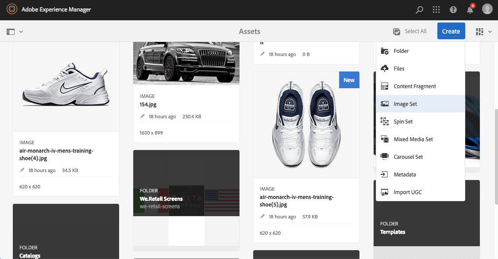

# Conjuntos de imagem {#image-sets}

Os Conjuntos de imagens fornecem aos usuários uma experiência de visualização integrada, onde os usuários podem ver diferentes visualizações de um item clicando em uma imagem em miniatura. Os Conjuntos de imagens permitem que você apresente visualizações alternativas de um item e o visualizador oferece ferramentas de zoom para examinar imagens cuidadosamente.

Os conjuntos de imagens são designados por um banner com a palavra `IMAGESET`. Além disso, se o Conjunto de imagens for publicado, a data de publicação, indicada pelo ícone **[!UICONTROL Mundo]**, estará no banner junto com a última data de modificação, indicada pelo ícone **[!UICONTROL Lápis]**.

No conjunto de imagens, também é possível criar amostras criando um Conjunto de imagens e adicionando miniaturas.

Esse aplicativo é útil para quando você deseja mostrar um item em uma cor, padrão ou conclusão diferente. Para criar um Conjunto de imagens com amostras de cores, você precisa de uma imagem para cada cor, padrão ou acabamento diferente que deseja apresentar aos usuários. Você também precisa de uma cor, padrão ou amostra de finalização para cada cor, padrão ou finalização.

Por exemplo, suponha que você deseja apresentar imagens de maiúsculas com diferentes notas coloridas; as notas são vermelhas, verdes e azuis. Neste caso, você precisa de três tiros do mesmo boné. Você precisa de um tiro com um vermelho, um com um verde e um com uma nota azul. Você também precisa de uma amostra de cor vermelha, verde e azul. As amostras de cores servem como miniaturas que os usuários clicam no Visualizador de Conjunto de Amostras para ver a tampa vermelha, verde ou azul.

>[!NOTE]
>
>Para obter informações sobre a interface do usuário do Assets, consulte [Gerenciar ativos](/help/assets/manage-assets.md).

## Início rápido: Conjuntos de imagens {#quick-start-image-sets}

**Para ativar e executar rapidamente:**

1. [Carregue suas imagens de origem primária para várias exibições](#uploading-assets-in-image-sets).

   Comece carregando as imagens dos seus Conjuntos de imagens. Ao escolher imagens, lembre-se de que seus clientes podem ampliar imagens no Visualizador de conjunto de imagens. Certifique-se de que as imagens tenham pelo menos 2000 pixels na maior dimensão para obter detalhes ideais de zoom. O Dynamic Media pode renderizar imagens de até 25 megapixels cada. Por exemplo, você pode usar uma imagem de 5000 x 5000 megapixels ou qualquer outra combinação de tamanho até 25 megapixels.

   O Adobe Experience Manager Assets é compatível com vários formatos de arquivo de imagem, mas as imagens TIFF, PNG e EPS sem perdas são recomendadas.

1. [Criar conjuntos de imagens](#creating-image-sets).

   Em Conjuntos de imagens, os usuários clicam em imagens em miniatura no Visualizador do Conjunto de imagens.

   Para criar um Conjunto de imagens no Assets, toque ou clique em **[!UICONTROL Criar]** > **[!UICONTROL Conjuntos de imagens]**. Em seguida, adicione imagens e clique em **[!UICONTROL Save]**.

   Você também pode criar conjuntos de imagens automaticamente por meio de [predefinições do conjunto de lotes](/help/assets/config-dms7.md).
   >[!IMPORTANT]
   >
   >Os conjuntos em lotes são criados pelo IPS (Sistema de produção de imagem) como parte da ingestão de ativos e estão disponíveis apenas no modo Dynamic Media - Scene7.

   Consulte [Preparando ativos do Conjunto de imagens para carregar e carregar seus arquivos](#uploading-assets-in-image-sets).

   Consulte [Trabalhar com seletores](/help/assets/working-with-selectors.md).

1. Adicione [Predefinições do visualizador de conjunto de imagens](/help/assets/managing-viewer-presets.md), conforme necessário.

   Os administradores podem criar ou modificar as Predefinições do visualizador de conjunto de imagens. Para ver seu conjunto de imagens com uma predefinição do visualizador, selecione o conjunto de imagens e, no menu suspenso do painel à esquerda, selecione **[!UICONTROL Visualizadores]**.

   Consulte **[!UICONTROL Ferramentas]** > **[!UICONTROL Ativos]** > **[!UICONTROL Predefinições do visualizador]** se desejar criar ou editar predefinições do visualizador.

1. (Opcional) [Visualizando Conjuntos de Imagens](/help/assets/image-sets.md#viewing-image-sets) que foram criados usando predefinições de conjuntos de lotes.
1. [Visualizar conjuntos de imagens](/help/assets/previewing-assets.md).

   Selecione o Conjunto de imagens e você pode visualizá-lo. Clique nos ícones de miniatura para examinar seu Conjunto de imagens no Visualizador selecionado. Você pode escolher visualizadores diferentes no menu **[!UICONTROL Visualizadores]**, disponível no menu suspenso do painel à esquerda.

1. [Publicar conjuntos de imagens](/help/assets/publishing-dynamicmedia-assets.md).

   A publicação de um conjunto de imagens ativa o URL e o código incorporado. Além disso, você deve [publicar qualquer predefinição do visualizador personalizado](/help/assets/managing-viewer-presets.md) que tenha criado. As predefinições do visualizador prontas para uso já estão publicadas.

1. [Vincule URLs ao seu ](/help/assets/linking-urls-to-yourwebapplication.md) aplicativo web ou  [Incorpore o visualizador](/help/assets/embed-code.md) de vídeo ou imagem.

   Os ativos Experience Manager criam chamadas de URL para conjuntos de imagens e as ativam depois que você publica os conjuntos de imagens. Você pode copiar esses URLs ao visualizar ativos. Como alternativa, você pode incorporá-los ao seu site.

   Selecione o Conjunto de imagens e, no menu suspenso do painel à esquerda, selecione **[!UICONTROL Visualizadores]**.

   Consulte [Vincular um conjunto de imagens a uma página da Web](/help/assets/linking-urls-to-yourwebapplication.md) e [Incorporar o visualizador de vídeo ou imagem](/help/assets/embed-code.md).

Para editar Conjuntos de imagens, consulte [editar Conjuntos de imagens](#editing-image-sets). Além disso, você pode visualizar e editar [Propriedades do conjunto de imagens](/help/assets/manage-assets.md#editing-properties).

Se tiver problemas ao criar conjuntos, consulte Imagens e conjuntos em [Solução de problemas do Dynamic Media - Modo Scene7](/help/assets/troubleshoot-dms7.md#images-and-sets).

## Fazer upload de ativos em conjuntos de imagens {#uploading-assets-in-image-sets}

Comece carregando as imagens dos seus Conjuntos de imagens. Ao escolher imagens, lembre-se de que seus clientes podem ampliar imagens no Visualizador de conjunto de imagens. Verifique se as imagens têm pelo menos 2000 pixels na maior dimensão. Os Conjuntos de imagens são compatíveis com vários formatos de arquivo de imagem, mas as imagens TIFF, PNG e EPS sem perdas são recomendadas.

Você pode fazer upload de imagens para Conjuntos de imagens da mesma maneira que faria [upload de qualquer outro ativo no Assets](/help/assets/manage-assets.md#uploading-assets).

### Preparação de ativos do Conjunto de imagens para upload {#preparing-image-set-assets-for-upload}

Antes de criar Conjuntos de imagens, verifique se as imagens têm o tamanho e o formato corretos.

Para criar um Conjunto de imagens com várias exibições, você precisa de imagens que mostrem um item de diferentes pontos de vista ou que mostrem diferentes aspectos do mesmo item. O objetivo é destacar os recursos importantes de um item para que os visualizadores tenham uma imagem completa de como ele se parece ou faz.

Como os usuários podem ampliar imagens em Conjuntos de imagens, verifique se as imagens têm pelo menos 2000 pixels na maior dimensão. Os ativos são compatíveis com vários formatos de arquivo de imagem, mas as imagens TIFF, PNG e EPS sem perdas são recomendadas.

>[!NOTE]
>
>Além disso, se estiver usando miniaturas para indicar amostras de produtos, faça o seguinte:
>
>Você precisa de vinhetas ou fotos diferentes da mesma imagem mostrando-a em cores, padrões ou finalizações diferentes. Você também precisa de arquivos de miniatura que correspondam às diferentes cores, padrões ou finalizações. Por exemplo, para apresentar miniaturas com um Conjunto de imagens mostrando a mesma jaqueta em preto, marrom e verde, é necessário:
>
>* Um tiro preto, marrom e verde da mesma jaqueta.
>* Miniatura de cor preta, marrom e verde.

## Criação de conjuntos de imagens {#creating-image-sets}

Você pode criar Conjuntos de imagens por meio da interface do usuário ou da API. Esta seção descreve como criar Conjuntos de imagens na interface do usuário do .

>[!NOTE]
>
>Você também pode criar conjuntos de imagens automaticamente por meio de [predefinições do conjunto de lotes](/help/assets/config-dms7.md#creating-batch-set-presets-to-auto-generate-image-sets-and-spin-sets).
>**Importante:** os conjuntos em lotes são criados pelo IPS (Sistema de produção de imagem) como parte da ingestão de ativos e estão disponíveis apenas no modo Dynamic Media - Scene7 .

Ao adicionar ativos ao seu conjunto, eles são automaticamente adicionados em ordem alfanumérica. Você pode reorganizar ou classificar ativos manualmente após sua adição.

>[!NOTE]
>
>Os conjuntos de imagens não são compatíveis com ativos com &quot;&quot; (vírgula) no nome do arquivo.

**Para criar um conjunto de imagens**

1. No Experience Manager, toque no logotipo do Experience Manager para acessar o console de navegação global e, em seguida, toque em **[!UICONTROL Navegação]** > **[!UICONTROL Ativos]**. Navegue até o local em que deseja criar um conjunto de imagens, em seguida, toque em **[!UICONTROL Criar]** > **[!UICONTROL Conjunto de imagens]** para abrir a página Editor do conjunto de imagens.

   Além disso, crie o conjunto de dentro de uma pasta que contenha seus ativos.

   

1. Na página Editor do conjunto de imagens, no campo **[!UICONTROL Title]**, digite um nome para o conjunto de imagens. O nome aparece no banner através do Conjunto de imagens. Opcionalmente, informe uma descrição.

   

1. Siga um destes procedimentos:

   * Próximo ao canto superior esquerdo da página Editor do conjunto de imagens, toque em **[!UICONTROL Adicionar ativo]**.

   * Próximo ao meio da página Editor do conjunto de imagens, toque em **[!UICONTROL Toque para abrir o Seletor de ativos]**.
   Toque para selecionar os ativos que deseja incluir no Conjunto de imagens. Os ativos selecionados têm um ícone de marca de seleção sobre eles. Quando terminar, próximo ao canto superior direito da página, toque em **[!UICONTROL Selecionar]**.

   Com o Seletor de ativos, procure por ativos ao digitar uma palavra-chave e tocar ou clicar em **[!UICONTROL Retornar]**. Aplique filtros para refinar os resultados da pesquisa. Filtre por caminho, coleção, tipo de arquivo e tag. Selecione o filtro e toque no ícone **[!UICONTROL Filtro]**, na barra de ferramentas. Altere a exibição ao tocar no ícone Exibir e selecionar **[!UICONTROL Exibição em coluna]**, **[!UICONTROL Exibição de cartão]** ou **[!UICONTROL Exibição em lista]**.

   Consulte [Trabalhar com seletores](/help/assets/working-with-selectors.md).

   

1. Ao adicionar ativos ao seu conjunto, eles são automaticamente adicionados em ordem alfanumérica. Você pode reordenar ou classificar ativos manualmente depois de adicioná-los.

   Se necessário, arraste o ícone Reordenar de um ativo à direita do nome do arquivo do ativo para reorganizar as imagens para cima ou para baixo na lista definida.

   

   Se quiser alterar uma miniatura ou amostra, clique no ícone de **miniatura** **+** ao lado da imagem e navegue até a miniatura ou a amostra desejada. Quando terminar de selecionar todas as imagens, clique em **[!UICONTROL Salvar]**.

1. (Opcional) Siga um destes procedimentos:

   * Para excluir uma imagem, selecione-a e toque em **[!UICONTROL Excluir ativo]**.

   * Para aplicar uma predefinição, próximo ao canto superior direito da página, toque em **[!UICONTROL Predefinição]** e selecione uma predefinição para aplicar a todos os ativos ao mesmo tempo.
   >[!NOTE]
   >
   >Ao criar o conjunto de imagens, você pode alterar a miniatura do conjunto de imagens ou permitir que o Experience Manager selecione a miniatura automaticamente com base nos ativos no conjunto de imagens. Para selecionar uma miniatura, toque em **[!UICONTROL Alterar miniatura]** acima do campo Título na página Editor do conjunto de imagens e selecione qualquer imagem (você também pode navegar para outras pastas para localizar imagens). Se tiver selecionado uma miniatura e decidir que deseja que o Experience Manager gere uma a partir do conjunto de imagens, selecione **[!UICONTROL Alternar para]** **[!UICONTROL Miniatura automática]**.

1. Clique em **[!UICONTROL Salvar]**. O Conjunto de imagens recém-criado é exibido na pasta em que você o criou.

## Visualização de conjuntos de imagens {#viewing-image-sets}

Você pode criar conjuntos de imagens na interface do usuário ou automaticamente usando [predefinições do conjunto de lotes](/help/assets/config-dms7.md#creating-batch-set-presets-to-auto-generate-image-sets-and-spin-sets).

>[!IMPORTANT]
>
>Os conjuntos em lotes são criados pelo IPS [Image Production System] como parte da ingestão de ativos e estão disponíveis apenas no modo Dynamic Media - Scene7.)

No entanto, os conjuntos criados usando predefinições de conjunto de lotes, do *not* aparecem na interface do usuário. Você pode visualizar esses conjuntos de três maneiras diferentes. (Esses métodos estão disponíveis mesmo se você tiver criado os conjuntos de imagens na interface do usuário).

* Abra as propriedades de um ativo individual. As propriedades indicam quais conjuntos o ativo selecionado é referenciado ou um membro de. Clique no nome do conjunto se desejar visualizar o conjunto inteiro.

   

* A partir de uma imagem de membro de qualquer conjunto. Selecione o menu **[!UICONTROL Conjuntos]** para exibir os conjuntos dos quais o ativo é membro.

   

* Na pesquisa, você pode selecionar **[!UICONTROL Filtro]**, expandir **[!UICONTROL Dynamic Media]** e selecionar **[!UICONTROL Conjuntos]**.

   A pesquisa retorna conjuntos correspondentes que foram criados manualmente na interface do usuário ou criados automaticamente por meio de predefinições de conjuntos em lotes. Para conjuntos automatizados, a consulta de pesquisa é realizada usando critérios de pesquisa &quot;Inicia com&quot;, que são diferentes da pesquisa de Experience Manager, baseada no uso de critérios de pesquisa &quot;Contém&quot;. Definir o filtro para **[!UICONTROL Define]** é a única maneira de pesquisar conjuntos automatizados.

   

>[!NOTE]
>
>Você pode visualizar conjuntos por meio da interface do usuário, conforme descrito em [Editar conjuntos de imagens](#editing-image-sets).

## Editar conjuntos de imagens {#editing-image-sets}

Você pode executar várias tarefas de edição em Conjuntos de imagens, como as seguintes:

* Adicione imagens ao conjunto de imagens.
* Reordene imagens no Conjunto de imagens.
* Exclua ativos no Conjunto de imagens.
* Aplicar predefinições do visualizador.
* Exclua o conjunto de imagens.

**Para editar conjuntos de imagens:**

1. Siga um destes procedimentos:

   * Passe o mouse sobre um ativo de Conjunto de imagens e toque em **[!UICONTROL Editar]** (ícone de lápis).
   * Passe o mouse sobre um ativo de Conjunto de imagens, toque em **[!UICONTROL Selecionar]** (ícone de marca de seleção) e toque em **[!UICONTROL Editar]** na barra de ferramentas.
   * Toque em um ativo do Conjunto de imagens e toque em **[!UICONTROL Editar]** (ícone de lápis) na barra de ferramentas.

1. Para editar as imagens no Conjunto de imagens, siga um destes procedimentos:

   * Para reorganizar ativos, arraste uma imagem para um novo local (selecione o ícone de reordenação para mover itens).
   * Para classificar itens em ordem crescente ou decrescente, clique no cabeçalho da coluna.
   * Para adicionar um ativo ou atualizar um ativo existente, clique em **[!UICONTROL Adicionar ativo]**. Navegue até um ativo, selecione-o e toque em **[!UICONTROL Selecionar]** próximo ao canto superior direito da página.

      >[!NOTE]
      >
      >Se você excluir a imagem que o Experience Manager usa para a miniatura ao substituí-la por outra imagem, o ativo original ainda é exibido.
   * Para excluir um ativo, selecione-o e toque ou clique em **[!UICONTROL Excluir ativo]**.
   * Para aplicar uma predefinição, próximo ao canto superior direito da página, toque em **[!UICONTROL Predefinição]** e selecione uma predefinição do visualizador.
   * Para adicionar ou alterar uma miniatura, selecione o ícone de miniatura ao lado direito do ativo. Navegue até a nova miniatura ou ativo de amostra, selecione-o e toque em **[!UICONTROL Selecionar]**.
   * Para excluir um conjunto de imagens inteiro, navegue até o conjunto de imagens, selecione-o e toque em **[!UICONTROL Excluir]**.

   >[!NOTE]
   >
   >Edite as imagens em um Conjunto de imagens ao navegar até o conjunto, tocar em **[!UICONTROL Definir membros]** no painel à esquerda e tocar no ícone Lápis em um ativo individual para abrir a janela de edição.

1. Toque em **[!UICONTROL Salvar]** quando terminar a edição.

## Visualização de conjuntos de imagens {#previewing-image-sets}

Consulte [Visualização de ativos](/help/assets/previewing-assets.md).

## Publicar conjuntos de imagens {#publishing-image-sets}

Consulte [Publicar ativos](/help/assets/publishing-dynamicmedia-assets.md).
