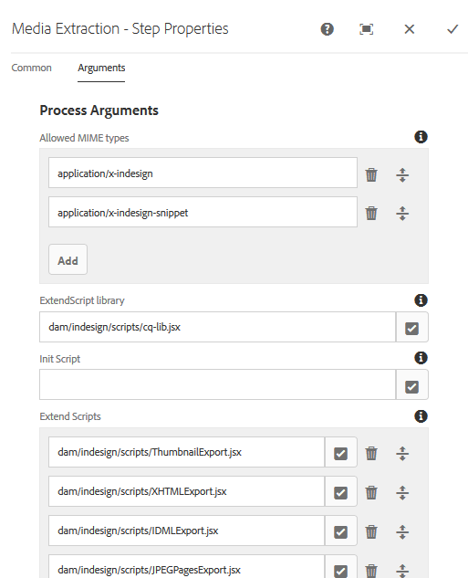

# Integrar [!DNL Adobe Experience Manager Assets] com [!DNL Adobe InDesign Server] {#integrating-aem-assets-with-indesign-server}

[!DNL Adobe Experience Manager Assets] Usa o:

* Um proxy para distribuir a carga de determinadas tarefas de processamento. Um proxy é uma [!DNL Experience Manager] instância que se comunica com um funcionário proxy para atender a uma tarefa específica e outras [!DNL Experience Manager] instâncias para fornecer os resultados.
* Um funcionário proxy para definir e gerenciar uma tarefa específica.
Podem abranger uma grande variedade de tarefas; por exemplo, o uso de um para processar arquivos [!DNL InDesign Server] .

Para fazer upload completo de arquivos para os quais você criou [!DNL Experience Manager Assets] [!DNL Adobe InDesign] um proxy, é usado. Isso usa um funcionário proxy para se comunicar com o [!DNL Adobe InDesign Server], onde [scripts](https://www.adobe.com/devnet/indesign/documentation.html#idscripting) são executados para extrair metadados e gerar várias execuções para [!DNL Experience Manager Assets]. O trabalhador proxy permite a comunicação bidirecional entre a [!DNL InDesign Server] e a(s) [!DNL Experience Manager] instância(s) em uma configuração em nuvem.

>[!NOTE]
>
>[!DNL Adobe InDesign] é oferecido como duas ofertas separadas. [Aplicativo Adobe InDesign](https://www.adobe.com/products/indesign.html) para desktop usado para criar layouts de página para distribuição impressa e digital. [O Adobe InDesign Server](https://www.adobe.com/products/indesignserver.html) permite que você crie documentos automatizados de forma programática com base no que você criou com [!DNL InDesign]. Ele opera como um serviço que oferece uma interface para seu mecanismo [ExtendScript](https://www.adobe.com/devnet/scripting.html) .Os scripts são gravados em [!DNL ExtendScript], o que é semelhante a [!DNL JavaScript]. Para obter informações sobre [!DNL InDesign] scripts, consulte [https://www.adobe.com/devnet/indesign/documentation.html#idscripting](https://www.adobe.com/devnet/indesign/documentation.html#idscripting).

## Como a extração funciona {#how-the-extraction-works}

Os arquivos [!DNL Adobe InDesign Server] podem ser integrados para [!DNL Experience Manager Assets] que os arquivos INDD criados com [!DNL InDesign] possam ser carregados, as representações geradas, todas as mídias extraídas (por exemplo, vídeo) e armazenadas como ativos:

>[!NOTE]
>
>Versões anteriores do [!DNL Experience Manager] eram capazes de extrair XMP e a miniatura, agora todas as mídias podem ser extraídas.

1. Carregue o arquivo INDD para [!DNL Experience Manager Assets].
1. Uma estrutura envia scripts de comando para o [!DNL InDesign Server] SOAP (Simple Object Access Protocol).
Esse script de comando:

   * Recupere o arquivo INDD.
   * Executar [!DNL InDesign Server] comandos:

      * A estrutura, o texto e quaisquer arquivos de mídia são extraídos.
      * Execuções de PDF e JPG são geradas.
      * Execuções HTML e IDML são geradas.
   * Poste os arquivos resultantes de volta para [!DNL Experience Manager Assets].
   >[!NOTE]
   >
   >IDML é um formato baseado em XML que renderiza todo o conteúdo do [!DNL InDesign] arquivo. Ele é armazenado como um pacote compactado usando a compactação [ZIP](https://www.techterms.com/definition/zip) . Para obter mais informações, consulte [InDesign Interchange Formats INX e IDML](http://www.peachpit.com/articles/article.aspx?p=1381880&amp;seqNum=8).

   >[!CAUTION]
   >
   >Se o arquivo não [!DNL InDesign Server] estiver instalado ou configurado, você ainda poderá fazer upload de um arquivo INDD para [!DNL Experience Manager]. No entanto, as renderizações geradas serão limitadas a PNG e JPEG. Não será possível gerar HTML, .idml ou as execuções da página.

1. Após a geração de extração e execução:

   * A estrutura é replicada para um `cq:Page` (tipo de representação).
   * O texto e os arquivos extraídos são armazenados em [!DNL Experience Manager Assets].
   * Todas as representações são armazenadas em, no próprio ativo [!DNL Experience Manager Assets].

## Integrar o [!DNL InDesign Server] com o Experience Manager {#integrating-the-indesign-server-with-aem}

Para integrar o [!DNL InDesign Server] para uso com [!DNL Experience Manager Assets] e depois de configurar seu proxy, é necessário:

1. [Instale o InDesign Server](#installing-the-indesign-server).
1. Se necessário, [configure o Fluxo de trabalho](#configuring-the-aem-assets-workflow)dos ativos Experience Manager.
Isso só é necessário se os valores padrão não forem apropriados para sua instância.
1. Configure um funcionário [proxy para o InDesign Server](#configuring-the-proxy-worker-for-indesign-server).

### Instale o [!DNL InDesign Server] {#installing-the-indesign-server}

Para instalar e start o para uso [!DNL InDesign Server] com [!DNL Experience Manager]:

1. Baixe e instale o [!DNL InDesign Server].

1. Se necessário, você pode personalizar a configuração da sua [!DNL InDesign Server] instância.

1. Na linha de comando, start o servidor:

   `<*ids-installation-dir*>/InDesignServer.com -port 8080`

   Isso start o servidor com o plug-in SOAP que escuta na porta 8080. Todas as mensagens de registro e saída são gravadas diretamente na janela de comando.

   >[!NOTE]
   >
   >Se desejar salvar as mensagens de saída em um arquivo, use redirecionamento; por exemplo, em Windows:
   >`<ids-installation-dir>/InDesignServer.com -port 8080 > ~/temp/INDD-logfile.txt 2>&1`

### Configurar o [!DNL Experience Manager Assets] fluxo de trabalho {#configuring-the-aem-assets-workflow}

[!DNL Experience Manager Assets] tem um Ativo **[!UICONTROL de atualização]** DAM de fluxo de trabalho pré-configurado, que tem várias etapas de processo especificamente para [!DNL InDesign]:

* [Extração de mídia](#media-extraction)
* [Extração de página](#page-extraction)

Este fluxo de trabalho é configurado com valores padrão que podem ser adaptados para sua configuração nas várias instâncias do autor (este é um fluxo de trabalho padrão, portanto, mais informações estão disponíveis em [Editar um fluxo de trabalho](/help/sites-developing/workflows-models.md#configuring-a-workflow-step)). Se você estiver usando os valores padrão (incluindo a porta SOAP), nenhuma configuração será necessária.

Após a configuração, fazer upload de [!DNL InDesign] arquivos para [!DNL Experience Manager Assets] (por qualquer um dos métodos habituais) aciona o fluxo de trabalho para processar o ativo e preparar as várias execuções. Teste sua configuração fazendo upload de um arquivo INDD para confirmar [!DNL Experience Manager Assets] que você visualiza as diferentes execuções criadas pelo IDS em `<*your_asset*>.indd/Renditions`

#### Media extraction {#media-extraction}

Esta etapa controla a extração da mídia a partir do arquivo INDD.

Para personalizar, edite a guia **[!UICONTROL Argumentos]** da etapa **[!UICONTROL Extração de mídia]**.

Argumentos de extração de mídia e caminhos de script

* **Biblioteca** ExtendScript: Esta é uma biblioteca de métodos http get/post simples, exigida pelos outros scripts.

* **Estender scripts**: É possível especificar diferentes combinações de scripts aqui. Se você quiser que seus próprios scripts sejam executados no [!DNL InDesign Server], salve os scripts em `/apps/settings/dam/indesign/scripts`.

Para obter informações sobre [!DNL Adobe InDesign] scripts, consulte a documentação do desenvolvedor do [InDesign](https://www.adobe.com/devnet/indesign/documentation.html#idscripting)

>[!CAUTION]
>
>Não altere a biblioteca ExtendScript. Esta biblioteca fornece a funcionalidade HTTP necessária para se comunicar com o Sling. Essa configuração especifica a biblioteca a ser enviada para o [!DNL InDesign Server] uso lá.

O `ThumbnailExport.jsx` script executado pela etapa de fluxo de trabalho da Extração de mídia gera uma execução em miniatura no formato JPG. Essa execução é usada pela etapa de fluxo de trabalho Processar miniaturas para gerar as representações estáticas exigidas por [!DNL Experience Manager].

Você pode configurar a etapa de fluxo de trabalho Processar miniaturas para gerar representações estáticas em tamanhos diferentes. Certifique-se de não remover os padrões, pois eles são exigidos pela [!DNL Experience Manager Assets] interface. Por fim, a etapa do fluxo de trabalho Excluir representação de Pré-visualização de imagem remove a execução de miniatura JPG, pois ela não é mais necessária.

#### Page extraction {#page-extraction}

Isso cria uma [!DNL Experience Manager] página dos elementos extraídos. Um manipulador de extração é usado para extrair dados de uma execução (atualmente HTML ou IDML). Esses dados são usados para criar uma página usando o PageBuilder.

Para personalizar, edite a guia **[!UICONTROL Argumentos]** da etapa **[!UICONTROL Extração de página]**.

* **Manipulador** de Extração da página: Na lista pop-up, selecione o manipulador que deseja usar. Um manipulador de extração opera em uma representação específica, escolhida por um `RenditionPicker` relacionado (consulte a `ExtractionHandler` API). In a standard [!DNL Experience Manager] installation the following is available:
   * Identificador de Extração de exportação IDML: Opera na `IDML` execução gerada na etapa MediaExtract.

* **Nome** da página: Especifique o nome que deseja atribuir à página resultante. Se deixado em branco, o nome será &quot;page&quot; (ou um derivado se &quot;page&quot; já existir).

* **Título** da página: Especifique o título que deseja atribuir à página resultante.

* **Caminho** raiz da página: O caminho para o local raiz da página resultante. Se deixado em branco, o nó que contém as representações do ativo será usado.

* **Modelo** de página: O modelo a ser usado ao gerar a página resultante.

* **Design** da página: O design da página a ser usado ao gerar a página resultante.

### Configure o trabalho proxy para [!DNL InDesign Server] {#configuring-the-proxy-worker-for-indesign-server}

>[!NOTE]
>
>O trabalhador reside na instância do proxy.

1. No console Ferramentas, expanda Configurações **[!UICONTROL de serviços em]** nuvem no painel esquerdo. Em seguida, expanda Configuração **[!UICONTROL de proxy da]** Cloud.

1. Clique duas vezes no **[!UICONTROL trabalhador IDS]** para abrir a configuração.

1. Clique em **[!UICONTROL Editar]** para abrir a caixa de diálogo de configuração e definir as configurações necessárias:

   

   * **Pool** de IDSs Os pontos de extremidade SOAP a serem usados para comunicação com o [!DNL InDesign Server]. Você pode adicionar, remover e ordenar itens necessários.

1. Clique em OK para salvar.

### Configurar Externalizador de links CQ de dia {#configuring-day-cq-link-externalizer}

Se o [!DNL InDesign Server] e [!DNL Experience Manager] forem executados em hosts diferentes ou em ambos os aplicativos não forem executados em portas padrão, configure o [!UICONTROL Day CQ Link Externalizer] para definir o nome do host, a porta e o caminho do conteúdo para o [!DNL InDesign Server].

1. Acesse o Console da Web em `https://[aem_server]:[port]/system/console/configMgr`.
1. Locate the configuration **[!UICONTROL Day CQ Link Externalizer]**, and click **[!UICONTROL Edit]** to open it.
1. Especifique o nome do host e o caminho de contexto do host [!DNL Adobe InDesign Server] e clique em **Salvar**.

   

### Habilitar processamento de trabalho paralelo para [!DNL InDesign Server] {#enabling-parallel-job-processing-for-indesign-server-s}

Agora você pode ativar o processamento paralelo de tarefas para IDS. Determine o número máximo de trabalhos paralelos (`x`) que um [!DNL InDesign Server] processo pode processar:

* Em uma única máquina de multiprocessador, o número máximo de trabalhos paralelos (`x`) que um usuário [!DNL InDesign Server] pode processar é um menor que o número de processadores executando IDS.
* Ao executar IDS em várias máquinas, é necessário contar o número total de processadores disponíveis (ou seja, em todas as máquinas) e subtrair o número total de máquinas.

Para configurar o número de trabalhos de IDS paralelos:

1. Abra a guia **[!UICONTROL Configurações]** do Console do Felix; por exemplo: `https://[aem_server]:[port]/system/console/configMgr`.

1. Selecione a fila de processamento IDS em `Apache Sling Job Queue Configuration`.

1. Ajustar:

   * **Tipo** - `Parallel`
   * **Máximo de Trabalhos** Paralelos - `<*x*>` (conforme calculado acima)

1. Salve essas alterações.
1. Para habilitar o suporte a várias sessões para a Adobe CS6 e posterior, marque a caixa de seleção, em `enable.multisession.name` `com.day.cq.dam.ids.impl.IDSJobProcessor.name` Configuração.
1. Crie um [pool de funcionários de `x` IDS adicionando pontos de extremidade SOAP à configuração](#configuring-the-proxy-worker-for-indesign-server)do IDS Worker.

   Se houver várias máquinas em execução [!DNL InDesign Server], adicione pontos de extremidade SOAP (número de processadores por máquina -1) para cada máquina.

<!-- 
TBD: Make updates to configurations for allow and block list after product updates are done.
-->

>[!NOTE]
>
>Ao trabalhar com um pool de trabalhadores, você pode ativar a lista bloqueada de funcionários do IDS.
>
>Para fazer isso, ative a caixa de seleção **[!UICONTROL enable.retry.name]** , na `com.day.cq.dam.ids.impl.IDSJobProcessor.name` configuração, que ativa as tentativas de trabalho do IDS.
>
>Além disso, na `com.day.cq.dam.ids.impl.IDSPoolImpl.name` configuração, defina um valor positivo para o `max.errors.to.blacklist` parâmetro que determina o número de tentativas da tarefa antes de excluir uma IDS da lista de manipuladores de tarefas.
>
>Por padrão, após o tempo configurável (`retry.interval.to.whitelist.name`) em minutos, o IDS worker é revalidado. Se o trabalhador estiver online, ele será removido da lista bloqueada.

## Habilitar suporte para [!DNL InDesign Server] 10.0 ou posterior {#enabling-support-for-indesign-server-or-later}

Para [!DNL InDesign Server] 10.0 ou superior, execute as seguintes etapas para habilitar o suporte a várias sessões.

1. Abra o Configuration Manager da sua [!DNL Experience Manager Assets] instância `https://[aem_server]:[port]/system/console/configMgr`.
1. Edite a configuração `com.day.cq.dam.ids.impl.IDSJobProcessor.name`.
1. Selecione a opção **[!UICONTROL ids.cc.enable]** e clique em **[!UICONTROL Salvar]**.

>[!NOTE]
>
>Para [!DNL InDesign Server] integração com [!DNL Experience Manager Assets], use um processador multi-core porque o recurso de suporte de sessão necessário para a integração não é suportado em sistemas de núcleo único.

## Configurar [!DNL Experience Manager] credenciais {#configure-aem-credentials}

Você pode alterar as credenciais padrão do administrador (nome de usuário e senha) para acessar o da sua [!DNL InDesign Server] instância sem interromper a integração com o [!DNL Experience Manager] [!DNL InDesign Server].

1. Ir para `/etc/cloudservices/proxy.html`.
1. Na caixa de diálogo, especifique o novo nome de usuário e senha.
1. Salve as credenciais.

>[!MORELIKETHIS]
>
>* [Sobre o Adobe InDesign Server](https://www.adobe.com/products/indesignserver/faq.html)

