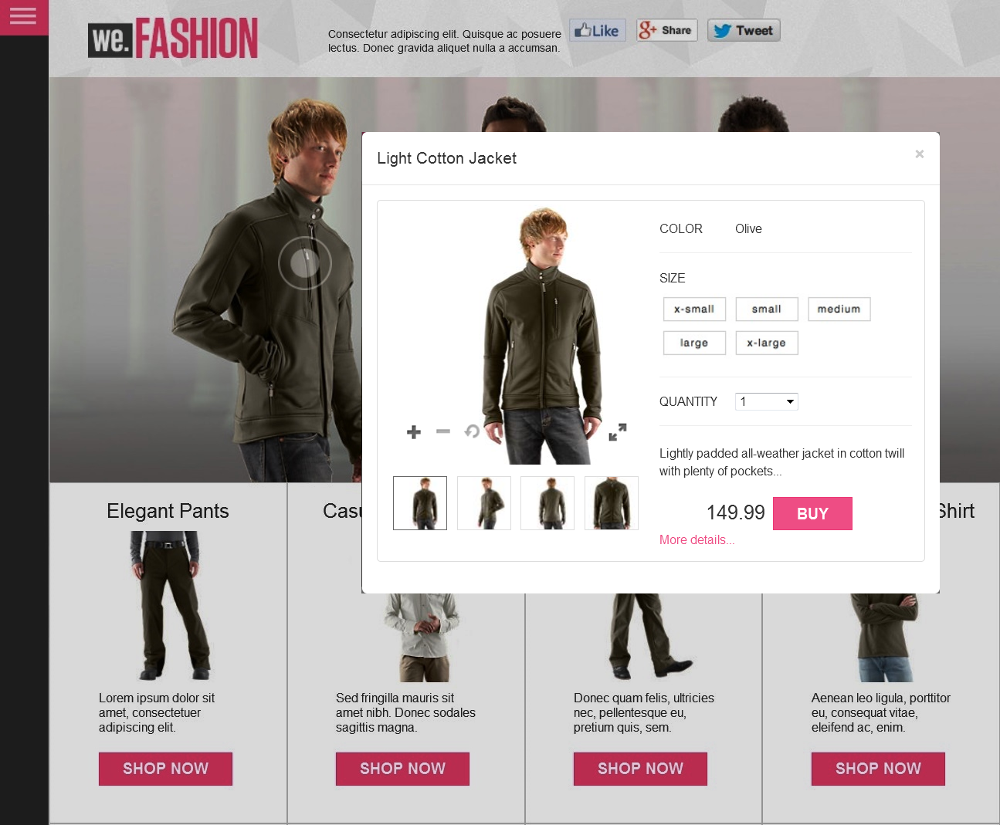

# Imagens interativas{#interactive-images}

Você pode tornar as imagens estáticas ricas em experiências envolventes para os clientes, arrastando e soltando pontos de acesso que podem ser comprados em uma imagem. Os hotspots para consumidores combinam informações adicionais sobre um produto ou serviço com um recurso &quot;Adicionar ao carrinho&quot; ou &quot;Comprar&quot; direto no ponto de venda. Os clientes podem selecionar esses hotspots e ser vinculados diretamente ao produto ou serviço, adicioná-los a um carrinho de compras ou ser vinculados a uma página da Web. Experiências diretas como essas aumentam os envolvimentos e as conversões do cliente no seu site.

Veja a seguir um banner que pode ser comprado com um pop-up do Quickview. Um usuário ativa o Quickview selecionando o círculo ou &quot;ponto de acesso&quot; no modelo.



Veja as imagens interativas em ação na página da Web acima acessando o seguinte:

[https://experienceleague.adobe.com/tools/dynamic-media-demo/shoppable-banner/we-fashion-QVzoom/index2-shoppable.html](https://experienceleague.adobe.com/tools/dynamic-media-demo/shoppable-banner/we-fashion-QVzoom/index2-shoppable.html)

## Veja como os banners de imagem interativos são criados {#watch-how-interactive-image-banners-are-created}

Reproduza uma apresentação sobre [como os banners de imagem interativos são criados](https://s7d5.scene7.com/s7viewers/html5/VideoViewer.html?videoserverurl=https://s7d5.scene7.com/is/content/&amp;emailurl=https://s7d5.scene7.com/s7/emailFriend&amp;serverUrl=https://s7d5.scene7.com/is/image/&amp;config=Scene7SharedAssets/Universal_HTML5_Video_social&amp;contenturl=https://s7d5.scene7.com/skins/&amp;asset=S7tutorials/InteractiveCarouselBanner) (10 minutos e 33 segundos). Você também aprenderá a visualizar, editar e fornecer banners de imagem interativos.

## Início rápido: imagens interativas {#quick-start-interactive-images}

A descrição do fluxo de trabalho passo a passo a seguir foi projetada para ajudar você a começar a trabalhar rapidamente com imagens interativas no Adobe Experience Manager Assets.

Procure o cabeçalho **Exemplo** em algumas tarefas do Início rápido. Ele contém um breve tutorial baseado no seguinte exemplo de página da Web que ainda não tem Imagens interativas adicionadas:

[https://experienceleague.adobe.com/tools/dynamic-media-demo/shoppable-banner/we-fashion/landing-0.html](https://experienceleague.adobe.com/tools/dynamic-media-demo/shoppable-banner/we-fashion/landing-0.html)

O tutorial ajuda a ilustrar as etapas da integração de imagens interativas em seu próprio site.

Etapas de imagens interativas:

1. **(Opcional) Identificar variáveis de ponto de acesso** - Se você usa o Experience Manager Assets e o Dynamic Media de forma independente, comece identificando variáveis dinâmicas usadas na implementação do Quickview existente. Em seguida, você pode inserir dados de ponto de acesso ao criar a imagem interativa. Consulte [(Opcional) Identificar variáveis de ponto de acesso](#optional-identifying-hotspot-variables).
No entanto, se você usar o Adobe Experience Manager Sites, o Adobe Experience Manager eCommerce ou ambos, essa etapa não será necessária.
Consulte [conceitos de comércio eletrônico no Experience Manager Assets](/help/commerce/cif-classic/administering/concepts.md).

1. **(Opcional) Criar uma predefinição do visualizador de Imagem Interativa** - Personalize a imagem gráfica usada para representar pontos de acesso. Criar sua própria predefinição do visualizador de imagens interativas não é necessário se você pretende usar a predefinição pronta para uso do visualizador de imagens interativas chamada `Shoppable_Banner`.
Consulte [(Opcional) Criar uma predefinição do visualizador de Imagem Interativa](/help/assets/managing-viewer-presets.md#creating-a-new-viewer-preset).

1. **Carregar um banner de imagem** - Carregar banners de imagem que você deseja tornar interativos.
Consulte [Carregar um banner de imagem](#uploading-an-image-banner).

1. **Adicionar pontos de acesso a um banner de imagem** - Adicione um ou mais pontos de acesso a um banner de imagem e associe cada um a uma ação, como um hiperlink, uma Quickview ou um Fragmento de experiência. Após adicionar pontos de acesso, você concluirá esta tarefa publicando a imagem interativa.

   * Consulte [Adicionar pontos de acesso a um banner de imagem](#adding-hotspots-to-an-image-banner).
   * Consulte [Visualizar imagens interativas](#optional-previewing-interactive-images) - Opcional. Se desejar, é possível visualizar uma representação do banner que pode ser comprado e testar a interatividade.
   * Consulte [Publish Assets](/help/assets/publishing-dynamicmedia-assets.md) para obter detalhes sobre como publicar ativos de imagem interativos.

1. **Adicionar uma imagem interativa ao seu site** - Se você usa o Experience Manager Sites ou o eCommerce, ou ambos, é possível adicionar a imagem interativa a uma página da Web no Experience Manager. Arraste o componente Mídia interativa para a página. Consulte [Adicionar o Dynamic Media Assets às páginas](/help/assets/adding-dynamic-media-assets-to-pages.md).

   Se você usa o Experience Manager Assets e o Dynamic Media independentes, é necessário copiar o código incorporado no seu site e integrá-lo ao seu Quickview existente. Consulte [Integrar uma imagem interativa com seu site](#integrating-an-interactive-image-with-your-website).

   Se você estiver usando um WCM (Web Content Manager, gerenciador de conteúdo da Web) de terceiros, é necessário integrar o novo vídeo interativo à implementação existente do Quickview usada em seu site. Consulte [Integrar uma imagem interativa a uma exibição rápida existente](#integrating-an-interactive-image-with-an-existing-quickview).

## (Opcional) Identificar variáveis de ponto de acesso {#optional-identifying-hotspot-variables}

>[!NOTE]
>
>Essa tarefa só será necessária se o seguinte for verdadeiro:
>
>* Você deseja adicionar interatividade à sua imagem acionando o Quickview.
>* Sua implementação do Experience Manager *não* usa uma estrutura de integração de comércio eletrônico para obter dados do produto para o Experience Manager de qualquer solução de comércio eletrônico, como IBM® WebSphere® Commerce, Elastic Path, hybris ou Intershop. Consulte [conceitos de comércio eletrônico no Experience Manager Assets](/help/commerce/cif-classic/administering/concepts.md).
>
>Se sua implementação do Experience Manager usar eCommerce, você poderá ignorar essa tarefa e prosseguir para a próxima tarefa.

Comece identificando as variáveis dinâmicas usadas pela sua implementação existente do Quickview, para que você possa inserir dados de ponto de acesso para criar a imagem interativa.

Ao adicionar pontos de acesso a uma imagem de banner no Experience Manager Assets, você deve atribuir uma SKU (Unidade de manutenção de estoque) e variáveis adicionais opcionais a cada ponto de acesso. Essas variáveis de ponto de acesso são usadas posteriormente para corresponder pontos de acesso ao conteúdo do Quickview.

É importante identificar corretamente o número e o tipo de variáveis a serem associadas aos dados do ponto de acesso. Cada ponto de acesso adicionado a uma imagem de banner deve carregar informações suficientes para identificar sem ambiguidade o produto no sistema de back-end existente.

Há diferentes maneiras de identificar um conjunto de variáveis a serem usadas para dados de pontos de acesso.

Às vezes, basta consultar especialistas de TI responsáveis pela implementação do Quickview existente. Os especialistas de TI provavelmente saberão qual é o conjunto mínimo de dados necessários para a identificação do Quickview no sistema. No entanto, também é possível simplesmente analisar o comportamento existente do código front-end.

A maioria das implementações do Quickview usa o seguinte paradigma:

* O usuário ativa um elemento da interface do usuário no site. Por exemplo, selecionar um botão &quot;Quickview&quot;.
* O site envia uma solicitação de Ajax para o backend a fim de carregar os dados ou o conteúdo da Visualização rápida, se necessário.
* Os dados do Quickview são traduzidos no conteúdo como preparação para renderização na página da Web.
* Por fim, o código de front-end renderiza visualmente esse conteúdo na tela.

A abordagem então é visitar diferentes áreas do site existente onde o recurso de Visualização rápida é implementado. Em seguida, você aciona o Quickview e captura o URL do Ajax enviado por página da Web para carregar os dados ou conteúdo do Quickview.

Normalmente, não há necessidade de usar ferramentas de depuração especializadas. Navegadores da Web modernos possuem inspetores da Web que fazem um trabalho adequado. A seguir estão alguns exemplos de navegadores da Web que incluem inspetores da Web:

* Para ver todas as solicitações HTTP de saída no Google Chrome, pressione F12 para abrir o painel Ferramentas do desenvolvedor e selecione a guia Rede.
Em uma Mac, pressione Command+Option+I para abrir o painel Ferramentas do desenvolvedor e selecione a guia Rede.

* No Firefox, você pode ativar o plug-in do Firebug pressionando F12 e usar a guia Net, ou usar a ferramenta Inspetor integrada e a guia Rede.
Em uma Mac, pressione Command+Option+I para abrir o painel Ferramentas do desenvolvedor e selecione a guia Inspetor.

Quando o monitoramento de rede estiver ativado no navegador, acione o Quickview na página.

Agora, localize o URL do Ajax Quickview no log de rede e copie o URL gravado para análise futura. Normalmente, quando você aciona a Visualização rápida, várias solicitações são enviadas para o servidor. Normalmente, o URL do Ajax Quickview é um dos primeiros na lista. Ele tem uma parte ou um caminho de cadeia de caracteres de consulta complexo e seu tipo MIME de resposta é `text/html`, `text/xml` ou `text/javascript`.

Durante esse processo, é importante visitar diferentes áreas do site, com diferentes categorias e tipos de produtos. O motivo é que os URLs do Quickview podem ter partes comuns para uma determinada categoria de site, mas só podem ser alteradas se você visitar uma área diferente do site.

No caso mais simples, a única parte variável no URL do Quickview é o SKU do produto. Nesse caso, o valor da SKU é a única parte dos dados necessária para adicionar pontos de acesso à imagem do banner.

No entanto, em casos complexos, o URL do Quickview tem vários elementos diferentes, além do SKU, como ID de categoria, código de cor e código de tamanho. Nesses casos, cada elemento é uma variável separada na definição de dados do ponto de acesso no recurso de imagem interativa que pode ser comprada no Experience Manager Assets.

Considere os seguintes exemplos de URLs do Quickview e as variáveis de ponto de acesso resultantes:

<table>
  <tbody>
  <tr>
    <td><p>SKU única, encontrada na cadeia de caracteres de consulta.</p> </td>
    <td><p>Os URLs de Quickview gravados incluem o seguinte:</p>
    <ul>
      <li><p><code>https://server/json?productId=866558&amp;source=100</code></p> </li>
      <li><p><code>https://server/json?productId=1196184&amp;source=100</code></p> </li>
      <li><p><code>https://server/json?productId=1081492&amp;source=100</code></p> </li>
      <li><p><code>https://server/json?productId=1898294&amp;source=100</code></p> </li>
    </ul> <p>A única parte variável no URL é o valor do parâmetro da string de consulta productId=, e é claramente um valor de SKU. Portanto, seus pontos de acesso só precisam de campos de SKU preenchidos com valores como <strong><code>866558</code></strong>, <strong><code>1196184</code></strong>, <strong><code>1081492</code></strong>, <strong><code>1898294</code></strong>.</p> </td>
  </tr>
  <tr>
    <td><p>SKU única, encontrada no caminho do URL.</p> </td>
    <td><p>Os URLs de Quickview gravados incluem o seguinte:</p>
    <ul>
      <li><p><code>https://server/product/6422350843</code></p> </li>
      <li><p><code>https://server/product/1607745002</code></p> </li>
      <li><p><code>https://server/product/0086724882</code></p> </li>
    </ul> <p>A parte variável está na última parte do caminho e se torna o valor SKU dos pontos de acesso: <strong><code>6422350843</code></strong>, <strong><code>1607745002</code></strong>, <strong><code>0086724882</code></strong>.</p> </td>
  </tr>
  <tr>
    <td><p>SKU e ID de categoria na cadeia de caracteres de consulta.</p> </td>
    <td><p>Os URLs de Quickview gravados incluem o seguinte:</p>
    <ul>
      <li><p><code>https://server/quickView/product/?category=1100004&amp;prodId=305466</code></p> </li>
      <li><p><code>https://server/quickView/product/?category=1100004&amp;prodId=310181</code></p> </li>
      <li><p><code>https://server/quickView/product/?category=1740148&amp;prodId=308706</code></p> </li>
    </ul> <p>Nesse caso, há duas partes variáveis no URL. A SKU está armazenada no parâmetro <code>prodId</code> e a ID de categoria <code></code> está armazenada no parâmetro <code>category=</code>.</p> <p>Sendo assim, as definições dos pontos de acesso são pares. Isto é, um valor de SKU e uma variável extra chamada <code>categoryId</code>. Os pares resultantes são os seguintes:</p>
    <ul>
      <li><p>A SKU é <strong><code>305466</code></strong> e <code>categoryId</code> é <code>1100004</code>.</p> </li>
      <li><p>A SKU é <strong><code>310181</code></strong> e <code>categoryId</code> é <strong><code>1100004</code></strong>.</p> </li>
      <li><p>A SKU é <strong><code>308706</code></strong> e <code>categoryId</code> é <strong><code>1740148</code></strong>.</p> </li>
    </ul> <p> </p> </td>
  </tr>
  </tbody>
</table>

**Exemplo**

Você pode aplicar a mesma abordagem usada nos três exemplos acima para a página da Web de demonstração:

[https://experienceleague.adobe.com/tools/dynamic-media-demo/shoppable-banner/we-fashion/landing-0.html](https://experienceleague.adobe.com/tools/dynamic-media-demo/shoppable-banner/we-fashion/landing-0.html)

A página da Web de demonstração tem várias miniaturas de produto, cada uma com um botão de visualização rápida chamado &quot;Veja mais&quot;. Com a ferramenta de depuração do navegador da Web ainda ativada, selecione cada botão e anote os URLs de visualização rápida gravados. Depois de ativar todas as quatro exibições rápidas de produto disponíveis na página, você tem a seguinte lista de solicitações de exibição rápida feitas no back-end:

* `/datafeed/Male-Windbreaker.json`
* `/datafeed/Male-SimpleHenley.json`
* `/datafeed/Male-CamoPullover.json`
* `/datafeed/Female-QuiltedDownJacket.json`

Observando as chamadas do servidor, você pode ver que as informações específicas do produto estão presentes somente no caminho da solicitação. Você também percebe que a sequência de consulta não é usada e que há dois tipos distintos de dados envolvidos:

* O primeiro tipo é Masculino ou Feminino. Você pode chamar isso de &quot;categoria de produto&quot;.
* O segundo tipo é o nome do produto, como CamoPullover. Você pode supor que essas informações sejam o SKU do produto.

Dadas essas informações, todo o URL do Quickview tem o seguinte padrão:

`/datafeed/$categoryId$-$SKU$.json`

Com base nessa análise, você usaria `categoryId` e `SKU` para hotspots.

Agora você está pronto para fazer upload de um banner de imagem e adicionar hotspots a ele usando o recurso de imagem interativa que pode ser comprada no Experience Manager Assets.

## (Opcional) Criar uma predefinição interativa do visualizador de imagens {#optional-creating-an-interactive-image-viewer-preset}

Você pode optar por usar a predefinição padrão do visualizador de Imagem interativa, pronta para uso, chamada `Shoppable_Banner`, que vem com o Experience Manager Assets. Ou você pode criar sua própria predefinição de visualizador personalizado para usar com imagens interativas.

Ao criar uma predefinição personalizada do visualizador de imagem interativa, você pode determinar a aparência dos pontos de acesso no banner da imagem. Como parte da criação da predefinição do visualizador, você pode optar por usar um gráfico de ponto de acesso de uma galeria de imagens predefinidas.

Depois de salvar a predefinição do visualizador, ela é ativada automaticamente (ativada) na página Lista de predefinições do visualizador no Experience Manager Assets. Essa funcionalidade significa que ela fica visível no componente de Mídia interativa e sempre que você visualiza um ativo. No entanto, para *entregar* um banner interativo com esta predefinição do visualizador, você também deve *publicar* sua predefinição do visualizador. Essa regra é verdadeira para predefinições do visualizador personalizadas ou predefinidas.

**Para criar uma predefinição do visualizador de Imagem Interativa:**

1. No painel à esquerda, navegue até **[!UICONTROL Ferramentas]** > **[!UICONTROL Assets]** > **[!UICONTROL Predefinições do Visualizador]**.
1. Próximo ao canto superior direito da página, selecione **[!UICONTROL Criar]**.
1. Na caixa de diálogo Nova predefinição do visualizador, digite um nome para descrever a predefinição interativa do visualizador de banner.

   O título é exibido na página da lista Predefinição do visualizador depois de salvar.

1. No menu suspenso Rich Media Type (Tipo de mídia avançada), selecione **[!UICONTROL Imagem interativa]**.
1. Selecione **[!UICONTROL Criar]**.
1. Na página Editar predefinição do visualizador, selecione a guia **[!UICONTROL Aparência]**.
1. Siga uma das seguintes opções:

   * Para carregar sua própria imagem de ponto de acesso que você deseja usar em imagens, selecione o ícone Seletor de ativos. Na página Selecionar conteúdo, navegue até a imagem do ponto de acesso que deseja usar, selecione-a e, em seguida, selecione o ícone Marca de seleção no canto superior direito.
   * Para selecionar uma imagem de ponto de acesso predefinida, selecione o ícone Galeria de pontos de acesso. Na paleta da galeria de pontos de acesso, selecione a imagem do ponto de acesso que deseja usar.

1. Próximo ao canto superior direito da página, selecione **[!UICONTROL Salvar]**.

   Publique a nova predefinição do visualizador.

   Consulte [Publicando Predefinições Do Visualizador Adicionadas](/help/assets/managing-viewer-presets.md#publishing-viewer-presets).

   Agora você está pronto para carregar um banner de imagem.

## Carregar um banner de imagem {#uploading-an-image-banner}

Se você já carregou as imagens que deseja usar, avance para a próxima etapa, [Adicionando hotspots a um banner de imagem](#adding-hotspots-to-an-image-banner).

**Para carregar um banner de imagem:**

1. Carregue banners de imagem que você deseja tornar interativos.

   Consulte [Upload de ativos](/help/assets/manage-assets.md#uploading-assets).

   Agora você está pronto para adicionar pontos de acesso ao banner da imagem. Consulte a próxima tarefa abaixo.

## Adicionar pontos de acesso a um banner de imagem {#adding-hotspots-to-an-image-banner}

Você pode adicionar pontos de acesso a um banner de imagem usando o editor na página Gerenciamento de pontos de acesso.

Ao adicionar pontos de acesso, você pode defini-los como uma exibição pop-up do Quickview, como um hiperlink ou um Fragmento de experiência.

Consulte [Fragmentos de experiência](/help/sites-authoring/experience-fragments.md).

>[!NOTE]
>
>As ferramentas de compartilhamento de redes sociais na Imagem interativa não são compatíveis quando você incorpora o visualizador em um Fragmento de experiência. Para contornar esse problema, é possível usar ou criar predefinições do visualizador que não tenham ferramentas de compartilhamento de redes sociais. Essas predefinições do visualizador permitem incorporá-lo com sucesso aos Fragmentos de experiência.

As opções Desfazer e Refazer, próximas ao canto superior direito da página, são compatíveis durante a sessão de criação/edição atual.

Ao terminar de criar a imagem interativa, você pode usar a Visualização para ver uma representação de como a imagem interativa aparece para os clientes.

Consulte [(Opcional) Visualizar imagens interativas](#optional-previewing-interactive-images).

>[!NOTE]
>
>Ao adicionar pontos de acesso a uma imagem em uma Imagem interativa ou em um Banner do carrossel, as informações do ponto de acesso são armazenadas no mesmo local de metadados. Esse local é relativo ao local da imagem, independentemente de ser uma Imagem interativa ou um Banner do carrossel. Essa funcionalidade significa que você pode reutilizar facilmente a mesma imagem, juntamente com seus dados de ponto de acesso definidos, em qualquer visualizador.
>
>Os banners do carrossel são compatíveis com mapas de imagem em imagens que também podem conter pontos de acesso; as imagens interativas não. Lembre-se dessa regra se você pretende criar uma Imagem interativa ou um Banner de carrossel que use a mesma imagem. Em vez disso, você pode criar Imagens interativas e Banners do carrossel usando cópias separadas da mesma imagem.
>
>Consulte também [Banners do carrossel](/help/assets/carousel-banners.md).

>[!NOTE]
>
>Se você estiver editando imagens interativas com pontos de acesso e recortar a imagem, os pontos de acesso serão removidos.

**Para adicionar hotspots a um banner de imagem:**

1. Na visualização Assets, navegue até o banner de imagem que você deseja tornar interativo.
1. Siga uma das seguintes opções:

   * Passe o mouse sobre a imagem e selecione **[!UICONTROL Selecionar]** (ícone de marca de seleção). Na barra de ferramentas, selecione **[!UICONTROL Editar]**.

   * Passe o mouse sobre a imagem e selecione **[!UICONTROL Mais ações]** (ícone de três pontos) **[!UICONTROL Editar]**.

   * Selecione a imagem para abri-la na página Exibição de detalhes. Na barra de ferramentas, selecione **[!UICONTROL Editar]**.

1. Próximo ao canto superior esquerdo da página, selecione **[!UICONTROL Adicionar ponto de acesso]** (ícone de seleção com dedo) para abrir a página Gerenciamento de ponto de acesso.
1. Próximo ao canto superior esquerdo da página, selecione **[!UICONTROL Ponto de acesso]**.

   1. Próximo ao canto superior esquerdo da página Gerenciamento de pontos de acesso, selecione **[!UICONTROL Ponto de acesso]**.
   1. Na imagem, selecione um local onde deseja que o ponto de acesso apareça. Se necessário, arraste o ponto de conexão para ajustar sua localização.
   1. Adicione pontos de acesso extras, conforme necessário, repetindo as etapas a e b.
   1. (Opcional) Para excluir um ponto de acesso, selecione-o na imagem e **[!UICONTROL Excluir]** (ícone de lixeira) no cabeçalho **[!UICONTROL Pontos de acesso]**.

1. No campo de texto Nome, digite o nome do ponto de acesso. Esse nome também aparece na lista suspensa Ponto de acesso selecionado.
1. Siga uma das seguintes opções:

   * Selecione **[!UICONTROL Quickview]**.

      * Se você for um cliente do Experience Manager Sites ou de comércio eletrônico, selecione o ícone Seletor de produtos (lupa) para abrir a página Selecionar produto. Selecione o produto que deseja usar e selecione **[!UICONTROL Selecionar]** no canto superior direito da página para poder retornar à página Gerenciamento de pontos de acesso.
      * Se você for *não* um cliente do Experience Manager Sites ou de comércio eletrônico

         * Consulte [Identificar variáveis de ponto de acesso](#optional-identifying-hotspot-variables); você deve definir essas variáveis.
         * Em seguida, insira manualmente o valor do SKU. No campo de texto Valor do SKU, digite o SKU (Unidade de manutenção de estoque) do produto, que é um identificador exclusivo para cada produto ou serviço distinto que você oferece. O valor de SKU inserido preenche automaticamente a parte variável do modelo Quickview para que o sistema saiba como associar o ponto de acesso selecionado a uma Quickview de SKU específica.
         * (Opcional) Se houver outras variáveis no Quickview que você deve usar para identificar melhor um produto, selecione **[!UICONTROL Adicionar variável genérica]**. No campo de texto, especifique uma variável extra. Por exemplo, `category=Males` é uma variável adicionada.

   * Selecione **[!UICONTROL Hiperlink]**.

      * Se você for um cliente do Experience Manager Sites, selecione o ícone Seletor de sites (pasta) para navegar até um URL. O método de vinculação baseado em URL não é possível se o conteúdo interativo tiver links com URLs relativos, principalmente links para páginas do Experience Manager Sites.
      * Se você for um cliente independente, no campo de texto HREF, especifique o caminho completo do URL para uma página da Web vinculada.

   Certifique-se de especificar se o link deve ser aberto em uma nova guia do navegador (padrão recomendado) ou na mesma guia.

   Consulte [Trabalhar com seletores](/help/assets/working-with-selectors.md) para obter mais informações.

   * Selecione **[!UICONTROL Fragmento de experiência]**.

      * Se você for um cliente do Experience Manager Sites, selecione o ícone Pesquisar (lupa) para abrir a página Fragmento de experiência. Selecione o Fragmento de experiência que deseja usar e selecione **[!UICONTROL Selecionar]** no canto superior direito da página para poder retornar à página Gerenciamento de pontos de acesso.
Consulte [Fragmentos de experiência](/help/sites-authoring/experience-fragments.md).

      * Especifique a largura e a altura do Fragmento de experiência como deseja que ele apareça no banner.

        >[!NOTE]
        >
        >As ferramentas de compartilhamento de redes sociais na Imagem interativa não são compatíveis quando você incorpora o visualizador em um Fragmento de experiência. Para contornar esse problema, é possível usar ou criar predefinições do visualizador que não tenham ferramentas de compartilhamento de redes sociais. Essas predefinições do visualizador permitem incorporá-lo com sucesso aos Fragmentos de experiência.

1. Selecione **[!UICONTROL Salvar]** para salvar seu trabalho e retornar à página Procurar.
1. Publish a imagem interativa. A publicação permite que o banner seja entregue por meio da nuvem e também gera o código incorporado se você precisar integrar o a um site de terceiros.

   Consulte [ativos do Publish](/help/assets/manage-assets.md#publishing-assets).

   Após adicionar os pontos de acesso e publicar a imagem interativa, você está pronto para adicioná-la ao seu site existente.

   Consulte [Integrar uma imagem interativa com seu site](#integrating-an-interactive-image-with-your-website).

   >[!NOTE]
   >
   >Se você estiver editando imagens interativas com pontos de acesso e recortar a imagem, os pontos de acesso serão excluídos.

### (Opcional) Visualizar imagens interativas {#optional-previewing-interactive-images}

Você pode usar a Visualização para ver uma representação de como sua imagem interativa aparece para os clientes e testar os pontos de acesso da imagem para garantir que eles estejam se comportando conforme esperado.

Quando estiver satisfeito com a imagem interativa, você poderá publicá-la.
Consulte [Incorporar o Visualizador de Vídeo ou Imagem a uma Página da Web](/help/assets/embed-code.md).
Consulte [Vincular URLs ao aplicativo Web](/help/assets/linking-urls-to-yourwebapplication.md). O método de vinculação baseado em URL não é possível se o conteúdo interativo tiver links com URLs relativos, principalmente links para páginas do Experience Manager Sites.
Consulte [Adicionar o Dynamic Media Assets às páginas](/help/assets/adding-dynamic-media-assets-to-pages.md).

**Para visualizar imagens interativas:**

1. Na visualização do Assets, navegue até uma imagem interativa existente que você criou e selecione para abri-la na Visualização.
1. Próximo ao canto superior esquerdo da página Visualização, na lista suspensa Conteúdo, selecione **[!UICONTROL Visualizadores]**.
1. Na lista Visualizadores, selecione **[!UICONTROL Shoppable_Banner]** ou o nome da predefinição interativa do visualizador de imagens que você criou.
1. Selecione pontos de acesso na imagem se desejar testar suas ações associadas.

## ativos de imagem interativos do Publish {#publishing-interactive-image-assets}

Consulte [ativos do Publish](/help/assets/publishing-dynamicmedia-assets.md) para obter detalhes sobre como publicar ativos de imagem interativos.

## Integre uma imagem interativa ao seu site {#integrating-an-interactive-image-with-your-website}

Após carregar uma imagem de banner, adicionar pontos de acesso à imagem e publicar a imagem interativa, você está pronto para adicioná-la à página do site.

Se você for um cliente do Experience Manager Sites, poderá adicionar a imagem interativa arrastando o componente de Mídia interativa para sua página. Consulte [Adicionar o Dynamic Media Assets às páginas](/help/assets/adding-dynamic-media-assets-to-pages.md).

Se você for um cliente independente do Experience Manager Assets, poderá adicionar manualmente a imagem interativa ao seu site, conforme descrito nesta seção.

1. Copie o código incorporado da imagem interativa publicada.
Consulte [Incorporar o Visualizador de Vídeo ou Imagem a uma Página da Web](/help/assets/embed-code.md).

1. Adicione o código incorporado copiado no local desejado na página da Web.
O código incorporado copiado é definido para um ambiente responsivo, de modo que se ajuste automaticamente à área atribuída.

**Exemplo**

Usando o site de demonstração como exemplo:

[https://experienceleague.adobe.com/tools/dynamic-media-demo/shoppable-banner/we-fashion/landing-0.html](https://experienceleague.adobe.com/tools/dynamic-media-demo/shoppable-banner/we-fashion/landing-0.html)

Observe que a imagem dos três machos é uma tag `IMG` estática:

```xml

```

A integração é tão simples quanto remover a tag `IMG` e substituí-la pelo código incorporado copiado do Experience Manager Assets. Você pode ver o resultado no seguinte URL, que mostra a imagem interativa que pode ser comprada na página com três pontos de acesso circulares:

[https://experienceleague.adobe.com/tools/dynamic-media-demo/shoppable-banner/we-fashion/landing-1.html](https://experienceleague.adobe.com/tools/dynamic-media-demo/shoppable-banner/we-fashion/landing-1.html)

>[!NOTE]
>
>Neste ponto, os pontos de acesso na imagem interativa que pode ser comprada do site de demonstração são somente para fins de exibição; eles ainda não estão integrados ao Quickview existente.

Para aplicar um &quot;recorte&quot; a uma imagem interativa que pode ser comprada para um ambiente responsivo, você pode incluir o atributo de configuração Imagem interativa `ZoomView.iscommand` no caminho. O componente `ZoomView` é chamado e `iscommand` é o comando de veiculação de imagens de &quot;recorte&quot; que você aplica.

Consulte o atributo de configuração [ZoomView.iscommand](https://experienceleague.adobe.com/en/docs/dynamic-media-developer-resources/library/viewers-for-aem-assets-only/interactive-images/command-reference-configuration-attributes-interactive-images/r-html5-aem-interactive-image-config-attrib-zoomview-iscommand).

Consulte o comando de veiculação de imagens [crop](https://experienceleague.adobe.com/en/docs/dynamic-media-developer-resources/image-serving-api/image-serving-api/http-protocol-reference/command-reference/r-crop).

Agora você está pronto para integrar a imagem interativa a uma visualização rápida existente no seu site.

## Integrar uma imagem interativa a uma visualização rápida existente {#integrating-an-interactive-image-with-an-existing-quickview}

>[!NOTE]
>
>Essa tarefa só se aplica se você for um cliente independente do Experience Manager Assets.

A última etapa deste processo é integrar a imagem interativa a uma implementação existente do Quickview em seu site. Não há solução para a integração que funcione para todos os casos. Cada implementação do Quickview é única e é necessária uma abordagem específica. Provavelmente, envolve a assistência de um profissional de TI de front-end.

A implementação existente do Quickview normalmente representa uma cadeia de ações inter-relacionadas que ocorrem na página da Web na seguinte ordem:

1. Um usuário aciona um elemento na interface do usuário do seu site.
1. O código de front-end obtém um URL do Quickview com base no elemento de interface do usuário que foi acionado na etapa 1.
1. O código de front-end envia uma solicitação de Ajax usando o URL obtido na etapa 2.
1. A lógica de back-end retorna os dados ou o conteúdo correspondentes do Quickview ao código de front-end.
1. O código de front-end carrega os dados ou o conteúdo da visualização rápida.
1. Como opção, o código de front-end converte os dados do Quickview carregados em uma representação HTML.
1. O código de front-end exibe uma caixa de diálogo ou painel modal e renderiza o conteúdo de HTML na tela para o usuário final.

Essas chamadas não representam chamadas de API públicas independentes que podem ser chamadas pela lógica da página da Web de uma etapa arbitrária. Em vez disso, é uma chamada encadeada em que cada próxima etapa é ocultada na última fase (retorno de chamada) da etapa anterior.

Ao mesmo tempo em que a imagem interativa que pode ser comprada substitui a etapa 1 e parcialmente a etapa 2, quando um usuário seleciona um ponto de acesso dentro da imagem que pode ser comprada, essa interação do usuário é realizada pelo visualizador. O visualizador retorna um evento à página da Web que contém todos os dados de ponto de acesso adicionados anteriormente ao Experience Manager Assets.

Nesse manipulador de eventos, o código de front-end faz o seguinte:

* Escuta um evento emitido pela imagem interativa que pode ser comprada.
* Constrói um URL de visualização rápida com base nos dados do ponto de acesso.
* Aciona o processo de carregar o Quickview do back-end e renderizá-lo na tela para exibição.

O código incorporado retornado pelo Experience Manager Assets já tem um manipulador de eventos pronto para uso em vigor que está comentado, como visto no seguinte fragmento de código destacado:

```xml
        var s7interactiveimageviewer = new s7viewers.InteractiveImage({
            "containerId" : "s7interactiveimage_div",
            "params" : {
                "serverurl" : "https://aodmarketingna.assetsadobe.com/is/image",
                "contenturl" : "https://aodmarketingna.assetsadobe.com/",
                "config" : "/etc/dam/presets/viewer/Shoppable_Media",
                "asset" : "/content/dam/mac/aodmarketingna/shoppable-banner/shoppable-banner.jpg" }
        })
        /* // Example of interactive image event for Quickview.
             s7interactiveimageviewer.setHandlers({
                "quickViewActivate": function(inData) {
                    var sku=inData.sku; //SKU for product ID
                    //To pass other parameter from the hotspot, you must add custom parameter during the hotspot setup as parameterName=value
                    loadQuickView(sku); //Replace this call with your Quickview plugin
                    //See your Quickviewer plugin for the Quickview call
                 },
             });
        */
        s7interactiveimageviewer.init();
```

Portanto, é necessário apenas remover o comentário do código e substituir o corpo do manipulador fictício pelo código específico da página da Web.

O processo de construção do URL do Quickview é oposto ao processo usado para identificar as variáveis de ponto de acesso abordadas anteriormente.

Consulte [Identificar variáveis de ponto de acesso](#optional-identifying-hotspot-variables).

Usando os exemplos de URL do Quickview anterior, você pode ver nos exemplos a seguir, como o URL do Quickview é construído em cada caso:

<table>
 <tbody>
  <tr>
   <td><p>SKU única, encontrada na sequência de consulta</p> </td>
   <td><code class="code">s7interactiveimageviewer.setHandlers(&lbrace;
      "quickViewActivate": function(inData) &lbrace;
      var quickViewUrl = "https://server/json?productId=" + inData.sku + "&amp;source=100";
      &rbrace;,
      &rbrace;);</code></td>
  </tr>
  <tr>
   <td><p>SKU única, encontrada no caminho do URL</p> </td>
   <td><code class="code">s7interactiveimageviewer.setHandlers(&lbrace;
      "quickViewActivate": function(inData) &lbrace;
      var quickViewUrl = "https://server/product/" + inData.sku;
      &rbrace;,
      &rbrace;);</code></td>
  </tr>
  <tr>
   <td><p>SKU e ID de categoria na cadeia de caracteres de consulta</p> </td>
   <td><code class="code">s7interactiveimageviewer.setHandlers(&lbrace;
      "quickViewActivate": function(inData) &lbrace;
      var quickViewUrl = "https://server/quickView/product/?category=" + inData.categoryId + "&amp;prodId=" + inData.sku;
      &rbrace;,
      &rbrace;);</code></td>
  </tr>
 </tbody>
</table>

A última etapa para acionar o URL do Quickview e ativar o painel do Quickview provavelmente requer a assistência de um profissional de TI de front-end do seu departamento de TI. Eles têm o conhecimento para saber melhor como acionar com precisão a implementação do Quickview a partir da etapa adequada, tendo um URL do Quickview pronto para uso.

Você pode ver como essas etapas são aplicadas ao site de demonstração para integrar totalmente uma imagem interativa que pode ser comprada com o código do Quickview. Anteriormente, a estrutura do URL do Quickview era identificada como a seguinte:

```xml
/datafeed/$categoryId$-$SKU$.json
```

Para reconstruir esta URL dentro do manipulador `quickViewActivate`, você pode usar os campos `categoryId` e `SKU` disponíveis no objeto `inData` que é passado para o manipulador pelo código do visualizador:

```xml
var sku=inData.sku;
var categoryId=inData.categoryId;
var quickViewUrl = "datafeed/" + categoryId + "-" + sku + ".json";
```

O site de demonstração está acionando a caixa de diálogo Quickview usando uma simples chamada de função `loadQuickView()`. Essa função aceita apenas um argumento, que é o URL de dados do Quickview. Assim, a última etapa para integrar a imagem interativa que pode ser comprada é adicionar a seguinte linha de código ao manipulador `quickViewActivate`:

```xml
loadQuickView(quickViewUrl);
```

Este é o código-fonte completo:

```xml
 var s7interactiveimageviewer = new s7viewers.InteractiveImage({
  "containerId" : "s7interactiveimage_div",
  "params" : {
   "serverurl" : "https://aodmarketingna.assetsadobe.com/is/image",
   "contenturl" : "https://aodmarketingna.assetsadobe.com/",
   "config" : "/etc/dam/presets/viewer/Shoppable_Media",
   "asset" : "/content/dam/mac/aodmarketingna/shoppable-banner/shoppable-banner.jpg" }
 })
   s7interactiveimageviewer.setHandlers({
   "quickViewActivate": function(inData) {
     var sku=inData.sku;
     var categoryId=inData.categoryId;
    var quickViewUrl = "datafeed/" + categoryId + "-" + sku + ".json";
    loadQuickView(quickViewUrl);
    },
   });
 s7interactiveimageviewer.init();
```

O site de demonstração final com a imagem interativa totalmente integrada é semelhante ao seguinte:

[https://experienceleague.adobe.com/tools/dynamic-media-demo/shoppable-banner/we-fashion/landing-3.html](https://experienceleague.adobe.com/tools/dynamic-media-demo/shoppable-banner/we-fashion/landing-3.html)

## Usar o Quickview para criar pop-ups personalizados {#using-quickviews-to-create-custom-pop-ups}

Consulte [Criar pop-ups personalizados usando o Quickview](/help/assets/custom-pop-ups.md).
