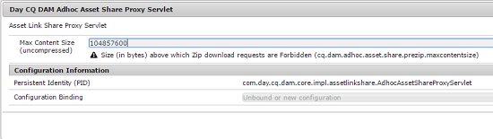

# Compartilhar ativo por meio de um link {#asset-link-sharing}

[!DNL Adobe Experience Manager Assets] permite compartilhar ativos, pastas e coleções como um URL com membros de sua organização e entidades externas, incluindo parceiros e fornecedores. O compartilhamento de ativos por meio de um link é uma maneira conveniente de disponibilizar recursos para partes externas sem que elas precisem primeiro fazer logon em [!DNL Assets].

>[!PREREQUISITES]
>
>* Você precisa de permissão Editar ACL na pasta ou no ativo que deseja compartilhar como um link.
>* Para enviar emails para os usuários, configure os detalhes do servidor SMTP em [Day CQ Mail Service](#configmailservice).

## Compartilhar ativos {#share-assets}

Para gerar o URL para ativos que você deseja compartilhar com usuários, use a caixa de diálogo Compartilhamento de links . Os usuários com privilégios de administrador ou com permissões de leitura no local `/var/dam/share` podem visualizar os links compartilhados com eles.

1. Na interface do usuário [!DNL Assets], selecione o ativo a ser compartilhado como um link.
1. Na barra de ferramentas, clique no ícone **[!UICONTROL Compartilhar link]** . O link que será criado após clicar em **[!UICONTROL Compartilhar]** é exibido antecipadamente no campo [!UICONTROL Compartilhar link]. O link ainda não foi criado até você clicar em **[!UICONTROL Enviar]**.

   

   *Figura: A caixa de diálogo para compartilhar ativos como um link.*

1. Na caixa de endereço de email da caixa de diálogo **[!UICONTROL Compartilhamento de links]**, digite a ID de email do usuário com o qual deseja compartilhar o link. Você pode adicionar um ou mais usuários.

   

   *Figura: Compartilhe links para ativos diretamente da caixa de diálogo  [!UICONTROL Compartilhamento de ] links .*

   >[!NOTE]
   >
   >Se você inserir uma ID de email de um usuário que não seja membro de sua organização, as palavras [!UICONTROL Usuário externo] terão o prefixo da ID de email do usuário.

1. Na caixa **[!UICONTROL Subject]**, insira um assunto para o ativo que deseja compartilhar.

1. Na caixa **[!UICONTROL Message]**, digite uma mensagem opcional.

1. No campo **[!UICONTROL Expiration]**, especifique uma data e hora de expiração para o link parar de funcionar. O tempo de expiração padrão do link é de um dia.

   

1. Para permitir que os usuários baixem o ativo original junto com as representações, selecione **[!UICONTROL Permitir download do arquivo original]**. Por padrão, os usuários só podem baixar as representações do ativo que você compartilha como um link.

1. Clique em **[!UICONTROL Compartilhar]**. Uma mensagem confirma que o link é compartilhado com os usuários por meio de um email.

1. Para exibir o ativo compartilhado, clique no link do email enviado ao usuário. Para gerar uma pré-visualização do ativo, clique no ativo compartilhado. Para fechar a visualização, clique em **[!UICONTROL Voltar]**. Se tiver compartilhado uma pasta, clique em **[!UICONTROL Pasta pai]** para retornar à pasta pai.

   

   >[!NOTE]
   >
   >[!DNL Experience Manager] O suporta a geração de visualização de ativos somente  [dos tipos](/help/assets/assets-formats.md) de arquivos suportados. Se outros tipos MIME forem compartilhados, você só poderá baixar os ativos e não poderá visualizar.

1. Para baixar o ativo compartilhado, clique em **[!UICONTROL Select]** na barra de ferramentas, clique no ativo e em **[!UICONTROL Download]** na barra de ferramentas.

   

1. Para exibir os ativos que você compartilhou como links, acesse a interface do usuário [!DNL Assets] e clique no logotipo [!DNL Experience Manager]. Escolha **[!UICONTROL Navegação]**. No painel Navegação, escolha **[!UICONTROL Links compartilhados]** para exibir uma lista de ativos compartilhados.

1. Para cancelar o compartilhamento de um ativo, selecione-o e clique em **[!UICONTROL Cancelar compartilhamento]** na barra de ferramentas. Uma mensagem de confirmação é exibida. A entrada do ativo é removida da lista.

## Configurar o serviço de email Day CQ {#configure-day-cq-mail-service}

1. Na página inicial [!DNL Experience Manager], navegue até **[!UICONTROL Ferramentas]** > **[!UICONTROL Operações]** > **[!UICONTROL Console da Web]**.
1. Na lista de serviços, localize **[!UICONTROL Day CQ Mail Service]**.
1. Clique em **[!UICONTROL Editar]** ao lado do serviço e configure os seguintes parâmetros para **[!UICONTROL Day CQ Mail Service]** com os detalhes mencionados em seus nomes:

   * Nome do host do servidor SMTP: nome do host do servidor de email
   * Porta do servidor SMTP: porta do servidor de email
   * Usuário SMTP: nome de usuário do servidor de email
   * Senha SMTP: senha do servidor de email

   

1. Clique em **[!UICONTROL Salvar]**.

## Configurar o tamanho máximo dos dados {#configure-maximum-data-size}

Ao baixar ativos do link compartilhado usando o recurso Compartilhamento de link, [!DNL Experience Manager] compacta a hierarquia de ativos do repositório e retorna o ativo em um arquivo ZIP. No entanto, na ausência de limites para a quantidade de dados que pode ser compactada em um arquivo ZIP, grandes quantidades de dados são sujeitas a compactação, o que causa erros de falta de memória na JVM. Para proteger o sistema de um possível ataque de negação de serviço devido a essa situação, configure o tamanho máximo usando o parâmetro **[!UICONTROL Tamanho máximo de conteúdo (descompactado)]** para **[!UICONTROL Servlet proxy de compartilhamento de ativos adhoc CQ do dia]** no Configuration Manager. Se o tamanho descompactado do ativo exceder o valor configurado, as solicitações de download de ativos serão rejeitadas. O valor padrão é 100 MB.

1. Clique no logotipo [!DNL Experience Manager] e acesse **[!UICONTROL Ferramentas]** > **[!UICONTROL Operações]** > **[!UICONTROL Console da Web]**.
1. No Console da Web, localize a configuração **[!UICONTROL Day CQ DAM Adhoc Asset Share Proxy Servlet]**.
1. Abra a configuração do **[!UICONTROL Day CQ DAM Adhoc Asset Share Proxy Servlet]** no modo de edição e modifique o valor do parâmetro **[!UICONTROL Tamanho máximo de conteúdo (descompactado)]**.

   

1. Salve as alterações.

## Práticas recomendadas e solução de problemas {#best-practices-and-troubleshooting}

* As pastas de ativos ou as Coleções que contêm um espaço em branco no nome podem não ser compartilhadas.
* Se os usuários não conseguirem baixar os ativos compartilhados, verifique com seu administrador [!DNL Experience Manager] quais são os [limites de download](#configure-maximum-data-size).
* Se não for possível enviar emails com links para ativos compartilhados ou se os outros usuários não puderem receber seu email, verifique com o administrador [!DNL Experience Manager] se o [serviço de email](#configure-day-cq-mail-service) está configurado ou não.
* Se não for possível compartilhar ativos usando a funcionalidade de compartilhamento de link, verifique se você tem as permissões apropriadas. Consulte [compartilhar ativos](#share-assets).
* Se um ativo compartilhado for movido para um local diferente, seu link para de funcionar. Recrie o link e compartilhe-o com os usuários.

* Se quiser compartilhar links da implantação do [!DNL Experience Manager] Autor em entidades externas, certifique-se de expor apenas os seguintes URLs usados para compartilhamento de link, somente para solicitações de `GET`. Bloquear outros URLs por motivos de segurança.

   * `http://[aem_server]:[port]/linkshare.html`
   * `http://[aem_server]:[port]/linksharepreview.html`
   * `http://[aem_server]:[port]/linkexpired.html`
   Na interface [!DNL Experience Manager], acesse **[!UICONTROL Ferramentas]** > **[!UICONTROL Operações]** > **[!UICONTROL Console da Web]**. Abra a configuração do **[!UICONTROL Day CQ Link Externalizer]** e modifique as seguintes propriedades no campo **[!UICONTROL Domains]** com os valores mencionados em `local`, `author` e `publish`. Para as propriedades `local` e `author`, forneça o URL para as instâncias locais e de Autor, respectivamente. Se você executar uma única instância [!DNL Experience Manager] do Autor, use o mesmo valor para as propriedades `local` e `author`. Para Instâncias de publicação, forneça o URL da instância de publicação [!DNL Experience Manager].
