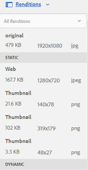

# Gerenciar seus ativos digitais {#manage-digital-assets}

Em [!DNL Adobe Experience Manager Assets], você pode fazer mais do que armazenar e administrar seus ativos. [!DNL Experience Manager] oferece recursos de gerenciamento de ativos de nível empresarial. Você pode editar e compartilhar ativos, executar pesquisas avançadas e criar várias representações de dezenas de formatos de arquivo compatíveis. Você também pode gerenciar versões e direitos digitais, automatizar o processamento de ativos, gerenciar e administrar metadados, colaborar usando anotações e muito mais.

Este artigo descreve as tarefas básicas de gerenciamento de ativos, como criar ou fazer upload; atualizações de metadados; copiar, mover e excluir; publicar, cancelar a publicação e pesquisar ativos. Para entender a interface do usuário, consulte [começar a usar a interface do usuário do assets](/help/sites-authoring/basic-handling.md). Para gerenciar Fragmentos de conteúdo, consulte [gerenciar os ativos dos Fragmentos de conteúdo](/help/assets/content-fragments/content-fragments-managing.md).

## Criar pastas {#creating-folders}

Ao organizar uma coleção de ativos, por exemplo, todas as imagens `Nature`, você pode criar pastas para mantê-las juntas. Você pode usar pastas para categorizar e organizar seus ativos. [!DNL Experience Manager Assets] não exige que você organize ativos em pastas para funcionar melhor.

>[!NOTE]
>
>* O compartilhamento de uma pasta [!DNL Assets] do tipo `sling:OrderedFolder` não é suportado ao compartilhar com o Experience Cloud. Se quiser compartilhar uma pasta, não selecione [!UICONTROL Ordered] ao criar uma pasta.
>* [!DNL Experience Manager] não permite usar o  `subassets` word como nome de uma pasta. É uma palavra-chave reservada para um nó que contém subativos para ativos compostos.


1. Navegue até o local na pasta de ativos digitais onde deseja criar uma pasta. No menu, clique em **[!UICONTROL Create]**. Selecione **[!UICONTROL Nova Pasta]**.
1. No campo **[!UICONTROL Title]**, forneça um nome de pasta. Por padrão, o DAM usa o título fornecido como o nome da pasta. Depois que a pasta for criada, é possível substituir o padrão e especificar outro nome de pasta.
1. Clique em **[!UICONTROL Criar]**. Sua pasta é exibida na pasta de ativos digitais.

Os seguintes caracteres (lista separada por espaços de) não são suportados:

* Um nome de arquivo de ativo não pode conter nenhum destes caracteres: `* / : [ \\ ] | # % { } ? &`
* Um nome de pasta de ativos não pode conter nenhum destes caracteres: `* / : [ \\ ] | # % { } ? \" . ^ ; + & \t`

Não inclua caracteres especiais nas extensões dos nomes de arquivo do ativo.

## Fazer upload de ativos {#uploading-assets}

<!-- TBD the following:
Move this section into a new article. CQDOC-14874 ticket is created for this.
In this complete article, replace emphasis with UICONTROL where appropriate.
-->

Você pode fazer upload de vários tipos de ativos (incluindo imagens, arquivos PDF, arquivos RAW e assim por diante) da pasta local ou de uma unidade de rede para [!DNL Experience Manager Assets].

>[!NOTE]
>
>No modo Dynamic Media - Scene7, o tamanho padrão do arquivo de upload de ativos é de 2 GB ou menos. Para configurar o upload de ativos com mais de 2 GB e até 15 GB, consulte [(Opcional) Configurar o Dynamic Media - Modo Scene7 para fazer upload de ativos com mais de 2 GB](/help/assets/config-dms7.md#optional-config-dms7-assets-larger-than-2gb).

Você pode optar por fazer upload de ativos para pastas com ou sem um perfil de processamento atribuído a eles.

Para pastas que têm um perfil de processamento atribuído, o nome do perfil aparece na miniatura na exibição de cartão. Na exibição de lista, o nome do perfil aparece na coluna **Perfil de processamento**. Consulte [Processando Perfis](/help/assets/processing-profiles.md).

Antes de fazer upload de um ativo, verifique se ele está em um [formato](/help/assets/assets-formats.md) compatível com o [!DNL Experience Manager Assets].

1. Na interface do usuário [!DNL Assets], navegue até o local onde deseja adicionar ativos digitais.
1. Para fazer upload dos ativos, siga um destes procedimentos:

   * Na barra de ferramentas, clique em **[!UICONTROL Create]**. Em seguida, no menu, clique em **[!UICONTROL Files]**. Você pode renomear o arquivo na caixa de diálogo apresentada, se necessário.
   * Em um navegador compatível com HTML5, arraste os ativos diretamente na interface do usuário [!DNL Assets]. A caixa de diálogo para renomear arquivo não é exibida.

   

   Para selecionar vários arquivos, selecione a chave `Ctrl` ou `Command` e selecione os ativos na caixa de diálogo do seletor de arquivos. Ao usar um iPad, você pode selecionar apenas um arquivo de cada vez.

   Você pode pausar o upload de ativos grandes (maior que 500 MB) e retomá-lo posteriormente a partir da mesma página. Clique em **[!UICONTROL Pausar]** ao lado da barra de progresso que aparece quando um upload é iniciado.

   

O tamanho acima do qual um ativo é considerado um ativo grande é configurável. Por exemplo, você pode configurar o sistema para considerar ativos acima de 1000 MB (em vez de 500 MB) como ativos grandes. Nesse caso, **[!UICONTROL Pause]** aparece na barra de progresso quando ativos de tamanho superior a 1000 MB são carregados.

A opção [!UICONTROL Pause] não aparece se um arquivo maior que 1000 MB for carregado com um arquivo menor que 1000 MB. No entanto, se você cancelar o upload de arquivo com menos de 1000 MB, a opção **[!UICONTROL Pausar]** será exibida.

Para modificar o limite de tamanho, configure a propriedade `chunkUploadMinFileSize` do nó `fileupload` no repositório CRX.

Ao clicar em **[!UICONTROL Pause]**, ele alterna para a opção **[!UICONTROL Play]**. Para retomar o upload, clique em **[!UICONTROL Reproduzir]**.

Para cancelar um upload em andamento, clique em fechar (`X`) ao lado da barra de progresso. Ao cancelar a operação de upload, [!DNL Assets] exclui a parte parcialmente carregada do ativo.

A capacidade de retomar o upload é especialmente útil em cenários de baixa largura de banda e falhas de rede, onde o upload de um ativo grande demora muito tempo. Você pode pausar a operação de upload e continuar posteriormente quando a situação melhorar. Ao retomar, o upload começa a partir do ponto em que você o pausou.

Durante a operação de upload, [!DNL Experience Manager] salva as partes do ativo que estão sendo carregadas como partes de dados no repositório CRX. Quando o upload é concluído, [!DNL Experience Manager] consolida essas partes em um único bloco de dados no repositório.

Para configurar a tarefa de limpeza para os trabalhos de upload de partes não concluídos, vá para `https://[aem_server]:[port]/system/console/configMgr/org.apache.sling.servlets.post.impl.helper.ChunkCleanUpTask`.

>[!CAUTION]
>
>O upload de chunk é acionado quando o valor padrão é de 500 MB e o tamanho do chunk é de 50 MB. Se você editar [Apache Jackrabbit Oak TokenConfiguration](https://experienceleague.adobe.com/docs/experience-cloud-kcs/kbarticles/KA-16464.html) e definir o `timeout configuration` para menos do que o tempo necessário para um ativo carregar, você encontrará uma situação de tempo limite de sessão enquanto o upload do ativo estiver em andamento. Portanto, altere os `chunkUploadMinFileSize` e `chunksize` para que cada solicitação de segmento atualize a sessão.
>
>Dada a expiração da credencial, a latência, a largura de banda e os uploads simultâneos esperados, o valor mais alto que permite garantir que o seguinte seja escolhido:
>
>* Para garantir que o upload de chunk esteja ativado para arquivos com tamanhos que possam causar a expiração da credencial enquanto o upload estiver em andamento.
   >
   >
* Para garantir que cada segmento termine antes da credencial expirar.


Se você carregar um ativo com o mesmo nome de um ativo que já está disponível no local em que você está fazendo upload, uma caixa de diálogo de aviso será exibida.

Você pode optar por substituir um ativo existente, criar outra versão ou manter ambos, renomeando o novo ativo que é carregado. Se você substituir um ativo existente, os metadados do ativo e quaisquer modificações anteriores (por exemplo, anotar ou cortar) feitas no ativo existente serão excluídos. Se optar por manter ambos os ativos, o novo ativo será renomeado com o número `1` anexado ao nome.


>[!NOTE]
>
>Quando você seleciona **[!UICONTROL Substituir]** na caixa de diálogo [!UICONTROL Nomear conflito], a ID do ativo é regenerada para o novo ativo. Essa ID é diferente da ID do ativo anterior.
>
>Se o Assets Insights estiver ativado para rastrear impressões ou cliques com [!DNL Adobe Analytics], a ID de ativo regenerada invalida os dados capturados para o ativo em [!DNL Analytics].

Se o ativo carregado existir em [!DNL Assets], a caixa de diálogo **[!UICONTROL Duplicatas Detectadas]** avisa que você está tentando fazer upload de um ativo duplicado. A caixa de diálogo será exibida somente se o valor de `SHA 1` soma de verificação do binário do ativo existente corresponder ao valor de soma de verificação do ativo que você carrega. Nesse caso, os nomes dos ativos não importam.

>[!NOTE]
>
>A caixa de diálogo [!UICONTROL Duplicatas Detectadas] só aparece quando o recurso de detecção de duplicatas está ativado. Para ativar o recurso de detecção de duplicatas, consulte [Ativar Detecção de Duplicados](/help/assets/duplicate-detection.md).


Para reter o ativo duplicado em [!DNL Assets], clique em **[!UICONTROL Keep]**. Para excluir o ativo duplicado carregado, clique em **[!UICONTROL Excluir]**.

[!DNL Experience Manager Assets] impede que você carregue ativos com os caracteres proibidos em seus nomes de arquivo. Se você tentar fazer upload de um ativo com nome de arquivo contendo um caractere não permitido ou mais, [!DNL Assets] exibirá uma mensagem de aviso e interromperá o upload até que você remova esses caracteres ou faça upload com um nome permitido.

Para se adequar às convenções específicas de nomenclatura de arquivos para sua organização, a caixa de diálogo [!UICONTROL Fazer upload de ativos] permite especificar nomes longos para os arquivos carregados.

No entanto, os seguintes caracteres (lista separada por espaços de) não são suportados:

* o nome do arquivo de ativo não deve conter `* / : [ \\ ] | # % { } ? &`
* o nome da pasta de ativos não deve conter `* / : [ \\ ] | # % { } ? \" . ^ ; + & \t`

Não inclua caracteres especiais nas extensões dos nomes de arquivo do ativo.


Além disso, a interface do usuário [!DNL Assets] exibe o ativo mais recente que você fez upload ou a pasta que você criou primeiro.

Se você cancelar a operação de upload antes que os arquivos sejam carregados, [!DNL Assets] interrompe o upload do arquivo atual e atualiza o conteúdo. No entanto, os arquivos que já foram carregados não são excluídos.

A caixa de diálogo andamento do upload em [!DNL Assets] exibe a contagem de arquivos carregados com êxito e os arquivos que não foram carregados.

### Uploads em série {#serialuploads}

O upload de vários ativos em massa consome recursos significativos de E/S, o que pode afetar negativamente o desempenho da sua implantação [!DNL Assets]. Em particular, se você tiver uma conexão lenta com a Internet, o tempo para fazer upload aumenta drasticamente devido a um pico na E/S do disco. Além disso, seu navegador da Web pode introduzir restrições adicionais ao número de solicitações de POST [!DNL Assets] podem lidar com uploads de ativos simultâneos. Como resultado, a operação de upload falha ou é encerrada prematuramente. Em outras palavras, [!DNL Experience Manager Assets] pode perder alguns arquivos ao assimilar um conjunto de arquivos ou, no total, não assimilar nenhum arquivo.

Para superar essa situação, [!DNL Assets] assimila um ativo de cada vez (upload em série) durante uma operação de upload em massa, em vez de assimilar todos os ativos simultaneamente.

O upload em série de ativos é ativado por padrão. Para desativar o recurso e permitir o upload simultâneo, sobreponha o nó `fileupload` no Crx-de e defina o valor da propriedade `parallelUploads` como `true`.

### Fazer upload de ativos usando FTP {#uploading-assets-using-ftp}

O Dynamic Media permite o upload em lote de ativos por meio do servidor FTP. Se você pretende fazer upload de ativos grandes (>1 GB) ou fazer upload de pastas e subpastas inteiras, você deve usar o FTP. Você pode até mesmo configurar o upload do FTP para ocorrer de forma recorrente e programada.

>[!NOTE]
>
>No modo Dynamic Media - Scene7, o tamanho padrão do arquivo de upload de ativos é de 2 GB ou menos. Para configurar o upload de ativos com mais de 2 GB e até 15 GB, consulte [(Opcional) Configurar o Dynamic Media - Modo Scene7 para fazer upload de ativos com mais de 2 GB](/help/assets/config-dms7.md#optional-config-dms7-assets-larger-than-2gb).

>[!NOTE]
>
>Para fazer upload de ativos via FTP no modo Dynamic Media - Scene7, instale o Feature Pack 18912 nas instâncias do autor [!DNL Experience Manager]. Entre em contato com o [Adobe Customer Care](https://experienceleague.adobe.com/?support-solution=General#support) para obter acesso ao FP-18912 e concluir a configuração da sua conta FTP. Para obter mais informações, consulte [Instalar pacote de recursos 18912 para migração de ativos em massa](/help/assets/bulk-ingest-migrate.md).
>
>Se você usar o FTP para fazer upload de ativos, as configurações de upload especificadas em [!DNL Experience Manager] serão ignoradas. Em vez disso, as regras de processamento de arquivos, conforme definido no Dynamic Media Classic, são usadas.

**Para fazer upload de ativos usando FTP**

1. Usando sua escolha de cliente FTP, faça logon no servidor FTP usando o nome de usuário FTP e a senha recebidos do email de provisionamento. No cliente FTP, faça upload de arquivos ou pastas para o servidor FTP.

1. Abra o [aplicativo de desktop do Dynamic Media Classic](https://experienceleague.adobe.com/docs/dynamic-media-classic/using/intro/dynamic-media-classic-desktop-app.html#system-requirements-dmc-app) e faça logon em sua conta.

   Suas credenciais e logon foram fornecidas pelo Adobe no momento do provisionamento. Caso não tenha essas informações, entre em contato com o Suporte Técnico.

1. Na Barra de Navegação Global, clique em **[!UICONTROL Upload]**.
1. Na página Upload , próximo ao canto superior esquerdo, clique na guia **[!UICONTROL Via FTP]**.
1. No lado esquerdo da página, escolha uma pasta FTP da qual fazer upload de arquivos; no lado direito da página, escolha uma pasta de destino.
1. Próximo ao canto inferior direito da página, clique em **[!UICONTROL Opções de trabalho]** e defina as opções desejadas com base nos ativos na pasta selecionada.

   Consulte [Fazer upload de opções de trabalho](#upload-job-options).

   >[!NOTE]
   >
   >Ao fazer upload de ativos via FTP, as opções de trabalho de upload definidas no Dynamic Media Classic (S7) têm prioridade sobre os parâmetros de processamento de ativos definidos em [!DNL Experience Manager].

1. No canto inferior direito da caixa de diálogo Upload Job Options , clique em **[!UICONTROL Save]**.
1. No canto inferior direito da página Upload, clique em **[!UICONTROL Enviar upload]**.

   Para visualizar o progresso do upload, na Barra de Navegação Global, clique em **[!UICONTROL Trabalhos]**. A página Trabalhos exibe o progresso do upload. Você pode continuar trabalhando em [!DNL Experience Manager] e retornar à página Trabalhos no Dynamic Media Classic a qualquer momento para revisar um trabalho em andamento.
Para cancelar um trabalho de upload em andamento, clique em **[!UICONTROL Cancelar]** ao lado da Duração.

#### Fazer upload de opções de trabalho {#upload-job-options}

| Opção de upload | Subopção | Descrição |
|---|---|---|
| Nome da tarefa |  | O nome padrão pré-preenchido no campo de texto inclui a parte do nome inserida pelo usuário e o carimbo de data e hora. Você pode usar o nome padrão ou inserir um nome de sua própria criação para este trabalho de upload. <br>O trabalho e outros trabalhos de upload e publicação são registrados na página Trabalhos, onde você pode verificar o status dos trabalhos. |
| Publicar após o upload |  | Publica automaticamente os ativos que você carrega. |
| Substituir em qualquer pasta, o mesmo nome do ativo base, independentemente da extensão |  | Selecione essa opção se desejar que os arquivos carregados substituam arquivos existentes com os mesmos nomes. O nome dessa opção pode ser diferente, dependendo das configurações em **[!UICONTROL Configuração do aplicativo]** > **[!UICONTROL Configurações gerais]** > **[!UICONTROL Fazer upload para aplicativo]** > **[!UICONTROL Substituir imagens]**. |
| Descompactar arquivos Zip ou Tar no upload |  |  |
| Opções de trabalho |  | Clique em **[!UICONTROL Opções de trabalho]** para abrir a caixa de diálogo [!UICONTROL Fazer upload de opções de trabalho] e escolha as opções que afetam todo o trabalho de upload. Essas opções são as mesmas para todos os tipos de arquivos.<br>Você pode escolher as opções padrão para fazer upload de arquivos, começando na página Configurações gerais do aplicativo . Para abrir esta página, escolha **[!UICONTROL Configurar]** > **[!UICONTROL Configuração do Aplicativo]**. Selecione a opção **[!UICONTROL Opções de Upload Padrão]** para abrir a caixa de diálogo [!UICONTROL Upload Job Options]. |
|  | Quando | Selecione One-Time (Uma vez) ou Recurring (Recorrente). Para definir um trabalho recorrente, escolha uma opção Repetir — Diário, Semanal, Mensal ou Personalizado — para especificar quando você deseja que o trabalho de upload do FTP ocorra novamente. Em seguida, especifique as opções de agendamento, conforme necessário. |
|  | Incluir subpastas | Faça upload de todas as subpastas dentro da pasta que deseja carregar. Os nomes da pasta e suas subpastas que você faz upload são inseridos automaticamente em [!DNL Experience Manager Assets]. |
|  | Opções de corte | Para recortar manualmente das laterais de uma imagem, selecione o menu Recortar e escolha Manual. Em seguida, insira o número de pixels para cortar de qualquer lado ou de cada lado da imagem. A quantidade de imagens cortadas depende da configuração ppi (pixels por polegada) no arquivo de imagem. Por exemplo, se a imagem exibir 150 ppi e você digitar 75 nas caixas de texto Superior, Direito, Inferior e Esquerdo, meia polegada será cortada de cada lado.<br> Para cortar automaticamente pixels de espaço em branco de uma imagem, abra o menu Cortar, escolha Manual e insira medidas de pixel nos campos Superior, Direita, Inferior e Esquerdo para cortar das laterais. Você também pode escolher Aparar no menu Cortar e escolher estas opções:<br> **Aparar com base em** <ul><li>**Cor**  - Escolha a opção Cor. Em seguida, selecione o menu Canto e escolha o canto da imagem com a cor que melhor representa a cor do espaço em branco que deseja recortar.</li><li>**Transparência**  - Escolha a opção Transparência.<br> **Tolerância**  - Arraste o controle deslizante para especificar uma tolerância de 0 a 1. Para aparar com base na cor, especifique 0 para cortar pixels somente se corresponderem exatamente à cor selecionada no canto da imagem. Os números mais próximos de 1 permitem mais diferenças de cor.<br>Para aparar com base na transparência, especifique 0 para cortar pixels somente se forem transparentes. Os números mais próximos de 1 permitem mais transparência.</li></ul><br>Essas opções de corte não são destrutivas. |
|  | Opções de perfil de cores | Escolha uma conversão de cores ao criar arquivos otimizados usados para entrega:<ul><li>Preservação de cor padrão: Mantém as cores da imagem de origem sempre que as imagens contêm informações sobre o espaço de cores; não há conversão de cores. Quase todas as imagens atuais têm o perfil de cores apropriado já incorporado. No entanto, se uma imagem de origem CMYK não contiver um perfil de cor incorporado, as cores serão convertidas em espaço de cor sRGB (azul verde padrão). sRGB é o espaço de cores recomendado para exibir imagens nas páginas da Web.</li><li>Manter espaço de cor original: Mantém as cores originais sem qualquer conversão de cores no momento. Para imagens sem um perfil de cor incorporado, qualquer conversão de cor é feita usando os perfis de cor padrão definidos nas configurações de Publicação. Os perfis de cores podem não estar alinhados com a cor nos arquivos criados com essa opção. Portanto, é recomendável usar a opção Preservação de cor padrão.</li><li>Personalizar de > Para<br> Abre menus para que você possa escolher um espaço de cores Converter de e Converter em. Essa opção avançada substitui qualquer informação de cor incorporada no arquivo de origem. Selecione essa opção quando todas as imagens enviadas contiverem dados de perfil de cores incorretos ou ausentes.</li></ul> |
|  | Opções de edição de imagens | É possível preservar as máscaras de recorte em imagens e escolher um perfil de cor.<br> Consulte  [Opções de configuração para edições de imagem no upload](#setting-image-editing-options-at-upload). |
|  | Opções de postscript | Você pode rasterizar arquivos do PostScript®, recortar arquivos, manter planos de fundo transparentes, escolher uma resolução e escolher um espaço de cores.<br> Consulte  [Definição das opções de upload de PostScript e Illustrator](#setting-postscript-and-illustrator-upload-options). |
|  | Opções do Photoshop | Você pode criar modelos a partir de arquivos Adobe® Photoshop®, manter camadas, especificar como as camadas são nomeadas, extrair texto e especificar como as imagens são ancoradas em modelos.<br> Não há suporte para modelos no  [!DNL Experience Manager].<br> Consulte  [Configuração das opções de upload do Photoshop](#setting-photoshop-upload-options). |
|  | Opções de PDF | Você pode rasterizar os arquivos, extrair palavras de pesquisa e links, gerar automaticamente um eCatalog, definir a resolução e escolher um espaço de cores.<br>Os catálogos eletrônicos não são compatíveis com o  [!DNL Experience Manager]. <br> Consulte  [Configuração das opções de upload de PDF](#setting-pdf-upload-options). |
|  | Opções do Illustrator | Você pode rasterizar arquivos Adobe Illustrator®, manter planos de fundo transparentes, escolher uma resolução e escolher um espaço de cores.<br> Consulte  [Definição das opções de upload de PostScript e Illustrator](#setting-postscript-and-illustrator-upload-options). |
|  | Opções de EVideo | Você pode transcodificar um arquivo de vídeo escolhendo uma Predefinição de vídeo.<br> Consulte  [Configuração das opções de upload de eVideo](#setting-evideo-upload-options). |
|  | Predefinições de conjunto de lotes | Para criar um Conjunto de imagens ou Conjunto de rotação a partir dos arquivos carregados, clique na coluna Ativo da predefinição que deseja usar. Você pode selecionar mais de uma predefinição. Você cria as predefinições na página Configuração do aplicativo/Predefinições do conjunto de lotes do Dynamic Media Classic.<br> Consulte  [Configuração de predefinições de conjuntos de lotes para gerar automaticamente conjuntos de imagens e ](config-dms7.md#creating-batch-set-presets-to-auto-generate-image-sets-and-spin-sets) configurações de rotação para saber mais sobre a criação de predefinições de conjuntos de lotes.<br> Consulte  [Definir predefinições do conjunto de lotes no upload](#setting-batch-set-presets-at-upload). |

#### Definir opções para edições de imagem no upload {#setting-image-editing-options-at-upload}

Ao carregar arquivos de imagem, incluindo arquivos AI, EPS e PSD, você pode realizar as seguintes ações de edição na caixa de diálogo [!UICONTROL Upload Job Options]:

* Recorte o espaço em branco da borda das imagens (consulte a descrição na tabela acima).
* Recorte manualmente das laterais das imagens (veja a descrição na tabela acima).
* Escolha um perfil de cor (consulte a descrição da opção na tabela acima).
* Crie uma máscara a partir de um traçado de recorte.
* Afiar imagens com opções de máscara nítidas
* Plano de Fundo de Vazamento

<!--
| Option | Sub-option | Description |
|---|---|---|
| Create Mask From Clipping Path | | Create a mask for the image based on its clipping path information. This option applies to images created with image-editing applications in which a clipping path was created. |
| Unsharp Masking | | Lets you fine-tune a sharpening filter effect on the final downsampled image, controlling the intensity of the effect, the radius of the effect (as measured in pixels), and a threshold of contrast that is ignored.<br> This effect uses the same options as Photoshop’s Unsharp Mask filter. Contrary to what the name suggests, Unsharp Mask is a sharpening filter. Under Unsharp Masking, set the options you want. Setting options are described in the following: |
| | Amount | Controls the amount of contrast that is applied to edge pixels.<br> Think of it as the intensity of the effect. The main difference between the amount values of Unsharp Mask in Dynamic Media and the amount values in Adobe Photoshop, is that Photoshop has an amount range of 1% to 500%. Whereas, in Dynamic Media, the value range is 0.0 to 5.0. A value of 5.0 is the rough equivalent of 500% in Photoshop; a value of 0.9 is the equivalent of 90%, and so on. |
| | Radius | Controls the radius of the effect. The value range is 0-250.<br> The effect is run on all pixels in an image and radiates out from all pixels in all directions. The radius is measured in pixels. For example, to get a similar sharpening effect for a 2000 x 2000 pixel image and 500 x 500 pixel image, you would set a radius of two pixels on the 2000 x 2000 pixel image and a radius value of one pixel on the 500 x 500 pixel image. A larger value is used for an image that has more pixels. |
| | Threshold | Threshold is a range of contrast that is ignored when the Unsharp Mask filter is applied. It is important so that no "noise" is introduced to an image when this filter is used. The value range is 0-255, which is the number of brightness steps in a grayscale image. 0=black, 128=50% gray and 255=white.<br> For example, a threshold value of 12 ignores slight variations is skin tone brightness to avoid adding noise, but still add edge contrast to areas such as where eyelashes meet skin.<br> For example, if you have a photo of someone’s face, the Unsharp Mask affects the parts of the image, such as where eyelashes and skin meet to create an obvious area of contrast, and the smooth skin itself. Even the smoothest skin exhibits subtle changes in brightness values. If you do not use a threshold value, the filter accentuates these subtle changes in skin pixels. In turn, a noisy and undesirable effect is created while contrast on the eyelashes is increased, enhancing sharpness.<br> To avoid this issue, a threshold value is introduced that tells the filter to ignore pixels that do not change contrast dramatically, like smooth skin.<br> In the zipper graphic shown earlier, notice the texture next to the zippers. Image noise is exhibited because the threshold values were too low to suppress the noise. |
| | Monochrome | Select to unsharp-mask image brightness (intensity).<br> Deselect to unsharp-mask each color component separately. |
| Knockout Background | | Automatically removes the background of an image when you upload it. This technique is useful to draw attention to a particular object and make it stand out from a busy background. Select to enable or “turn on” the Knockout Background feature and the following sub-options: |
| | Corner | Required.<br> The corner of the image that is used to define the background color to knockout.<br> You can choose from **Upper Left**, **Bottom Left**, **Upper Right**, or **Bottom Right**. |
| | Fill Method | Required.<br> Controls pixel transparency from the Corner location that you set.<br> You can choose from the following fill methods: <ul><li>**Flood Fill** - turns all pixels transparent that match the Corner that you have specified and are connected to it.</li><li>**Match Pixel** - turns all matching pixels transparent, regardless of their location on the image.</li></ul> |
| | Tolerance | Optional.<br> Controls the allowable amount of variation in pixel color matching based on the Corner location that you set.<br> Use a value of 0.0 to match pixel colors exactly or, use a value of 1.0 to allow for the greatest variation. |
-->

#### Definir opções de upload do PostScript e do Illustrator {#setting-postscript-and-illustrator-upload-options}

Ao carregar arquivos de imagem PostScript (EPS) ou Illustrator (AI), você pode formatá-los de várias maneiras. Você pode rasterizar os arquivos, manter o plano de fundo transparente, escolher uma resolução e escolher um espaço de cores. As opções para formatação de arquivos PostScript e Illustrator estão disponíveis na caixa de diálogo [!UICONTROL Upload Job Options] em [!UICONTROL PostScript Options] e [!UICONTROL Illustrator Options].

| Opção | Subopção | Descrição |
|---|---|---|
| Processando |  | Escolha **[!UICONTROL Rasterizar]** para converter gráficos vetoriais no arquivo para o formato de bitmap. |
| Manter plano de fundo transparente na imagem renderizada |  | Mantenha a transparência em segundo plano do arquivo. |
| Resolução |  | Determina a configuração de resolução. Essa configuração determina quantos pixels são exibidos por polegada no arquivo. |
| Espaço de cor |  | Selecione o menu Espaço de cores e escolha entre as seguintes opções de espaço de cores: |
|  | Detectar automaticamente | Mantém o espaço de cores do arquivo. |
|  | Forçar como RGB | Converte para o espaço de cores RGB. |
|  | Forçar como CMYK | Converte para o espaço de cores CMYK. |
|  | Forçar como Escala de Cinza | Converte para o espaço de cores em tons de cinza. |

#### Definir as opções de upload do Photoshop {#setting-photoshop-upload-options}

Os arquivos Photoshop Document (PSD) são usados com mais frequência para criar modelos de imagem. Ao carregar um arquivo PSD, você pode criar um modelo de imagem automaticamente a partir do arquivo (selecione a opção [!UICONTROL Criar modelo] na tela Upload).

O Dynamic Media cria várias imagens de um arquivo PSD com camadas se você usar o arquivo para criar um modelo; ele cria uma imagem para cada camada.

Use as [!UICONTROL Opções de recorte] e as [!UICONTROL Opções do perfil de cor], descritas acima, com as opções de upload do Photoshop.

>[!NOTE]
>
>Não há suporte para modelos em [!DNL Experience Manager].

| Opção | Subopção | Descrição |
|---|---|---|
| Manter camadas |  | Remove as camadas na PSD, se houver, em ativos individuais. As camadas de ativo permanecem associadas ao PSD. Você pode visualizá-los abrindo o arquivo PSD na exibição de Detalhes e selecionando o painel de camada. |
| Criar modelo |  | Cria um modelo a partir das camadas no arquivo PSD. |
| Extrair texto |  | Extrai o texto para que os usuários possam pesquisar por texto em um Visualizador. |
| Estender camadas ao tamanho do plano de fundo |  | Estende o tamanho das camadas de imagem cortadas até o tamanho da camada de plano de fundo. |
| Nomenclatura de camada |  | As camadas no arquivo PSD são carregadas como imagens separadas. |
|  | Nome da camada | Nomes das imagens após os nomes das camadas no arquivo PSD. Por exemplo, uma camada chamada Tag de preço no arquivo PSD original se torna uma imagem chamada Tag de preço. No entanto, se os nomes de camada no arquivo PSD forem nomes de camada padrão do Photoshop (Plano de fundo, Camada 1, Camada 2 e assim por diante), as imagens serão nomeadas após seus números de camada no arquivo PSD. Eles não são nomeados após seus nomes de camada padrão. |
|  | Photoshop e número de camada | Nomes das imagens depois de seus números de camada no arquivo PSD, ignorando os nomes da camada original. As imagens são nomeadas com o nome do arquivo Photoshop e um número de camada anexado. Por exemplo, a segunda camada de um arquivo chamado Spring Ad.psd é chamada Spring Ad_2 , mesmo que tenha um nome não padrão no Photoshop. |
|  | Photoshop e Nome da Camada | Nomes das imagens após o arquivo PSD seguido do nome da camada ou do número da camada. O número da camada é usado se os nomes da camada no arquivo PSD forem nomes padrão da camada do Photoshop. Por exemplo, uma camada chamada Tag de preço em um arquivo PSD chamado SpringAd é chamada Tag Ad_Price Primavera. Uma camada com o nome padrão Camada 2 é chamada de Anúncio de primavera_2. |
| Âncora |  | Especifique como as imagens são ancoradas em modelos que são gerados a partir da composição em camadas produzida a partir do arquivo PSD. Por padrão, a âncora é o centro. Uma âncora central permite que imagens de substituição preencham melhor o mesmo espaço, independentemente da proporção da imagem de substituição. Imagens com um aspecto diferente que substituem essa imagem, ao referenciar o modelo e usar substituição de parâmetro, ocupam efetivamente o mesmo espaço. Altere para uma configuração diferente se o aplicativo exigir as imagens de substituição para preencher o espaço alocado no modelo. |

#### Definir opções de upload de PDF {#setting-pdf-upload-options}

Ao carregar um arquivo PDF, você pode formatá-lo de várias maneiras. Você recorta suas páginas, extrai palavras de pesquisa, digita uma resolução de pixels por polegada e escolhe um espaço de cores. Os arquivos PDF geralmente contêm uma margem de corte, marcas de corte, marcas de registro e outras marcas de impressora. É possível recortar essas marcas das laterais das páginas ao carregar um arquivo PDF.

>[!NOTE]
>
>Os catálogos eletrônicos não são suportados em [!DNL Experience Manager].

Escolha entre as seguintes opções:

| Opção | Subopção | Descrição |
|---|---|---|
| Processando | Rasterizar | (Padrão) Ripsa as páginas no arquivo PDF e converte gráficos vetoriais em imagens de bitmap. Escolha essa opção se quiser criar um eCatalog. |
| Extrair | Pesquisar palavras | Extrai palavras do arquivo PDF para que o arquivo possa ser pesquisado por palavra-chave em um Visualizador de catálogo eletrônico. |
|  | Links | Extrai links dos arquivos PDF e os converte em mapas de imagem usados em um visualizador de eCatalog. |
| Gerar automaticamente o catálogo eletrônico a partir de PDF de várias páginas |  | Cria automaticamente um eCatalog a partir do arquivo PDF. O eCatalog é nomeado após o arquivo PDF que você carregou. (Essa opção só estará disponível se você rasterizar o arquivo PDF ao carregá-lo.) |
| Resolução |  | Determina a configuração de resolução. Essa configuração determina quantos pixels são exibidos por polegada no arquivo PDF. O padrão é 150. |
| Espaço de cor |  | Selecione o menu Espaço de cores e escolha um espaço de cores para o arquivo PDF. A maioria dos arquivos PDF tem imagens coloridas RGB e CMYK. O espaço de cores RGB é preferível para visualização online. |
|  | Detectar automaticamente | Mantém o espaço de cores do arquivo PDF. |
|  | Forçar como RGB | Converte para o espaço de cores RGB. |
|  | Forçar como CMYK | Converte para o espaço de cores CMYK. |
|  | Forçar como Escala de Cinza | Converte para o espaço de cores em tons de cinza. |

#### Definir as opções de upload de eVideo {#setting-evideo-upload-options}

Para transcodificar um arquivo de vídeo, escolha dentre várias predefinições de vídeo.

| Opção | Subopção | Descrição |
|---|---|---|
| Vídeo adaptável |  | Uma única predefinição de codificação que funciona com qualquer proporção para criar vídeos para entrega em dispositivos móveis, tablets e desktops. Os vídeos de origem carregados codificados com essa predefinição são definidos com uma altura fixa. No entanto, a largura é dimensionada automaticamente para preservar a proporção do vídeo. <br>A prática recomendada é usar a codificação Adaptive Video. |
| Predefinições de codificação única | Ordenar predefinições de codificação | Selecione **[!UICONTROL Name]** ou **[!UICONTROL Size]** se desejar classificar as predefinições de codificação listadas em Desktop, Mobile e Tablet por nome ou por tamanho de resolução. |
|  | Área de trabalho | Crie um arquivo MP4 para fornecer uma experiência de streaming ou vídeo progressivo aos computadores desktop. Selecione uma ou mais proporções com o tamanho da resolução e a taxa de dados de destino desejados. |
|  | Móvel | Crie um arquivo MP4 para entrega em dispositivos móveis iPhone ou Android™. Selecione uma ou mais proporções com o tamanho da resolução e a taxa de dados de destino desejados. |
|  | Tablet | Crie um arquivo MP4 para entrega em dispositivos tablet iPad ou Android™. Selecione uma ou mais proporções com o tamanho da resolução e a taxa de dados de destino desejados. |

#### Definir predefinições do conjunto de lotes no upload {#setting-batch-set-presets-at-upload}

Para criar automaticamente um Conjunto de imagens ou um Conjunto de rotação a partir de imagens carregadas, clique na coluna Ativo da predefinição que deseja usar. Você pode selecionar mais de uma predefinição.

Consulte [Configurando predefinições de conjunto de lotes para gerar automaticamente conjuntos de imagens e conjuntos de rotação](/help/assets/config-dms7.md#creating-batch-set-presets-to-auto-generate-image-sets-and-spin-sets) para saber mais sobre como criar predefinições de conjunto de lotes.

### Uploads continuados {#streamed-uploads}

Se você carregar muitos ativos no Adobe Experience Manager, as solicitações de E/S para o servidor aumentarão drasticamente, o que reduz a eficiência do upload e pode até fazer com que algumas tarefas de upload atinjam o tempo limite. [!DNL Experience Manager Assets] O suporta upload simplificado de ativos. O upload em fluxo reduz a E/S do disco durante a operação de upload, evitando o armazenamento de ativos em uma pasta temporária no servidor antes de copiá-lo para o repositório. Em vez disso, os dados são transferidos diretamente para o repositório. Dessa forma, o tempo para fazer upload de ativos grandes e a possibilidade de tempos limite são reduzidos. O upload sequenciado é ativado por padrão em [!DNL Assets].

>[!NOTE]
>
>O upload de streaming está desativado para o Adobe Experience Manager em execução no servidor JEE com a versão servlet-api inferior a 3.1.

### Extrair arquivo ZIP contendo ativos {#extractzip}

Você pode fazer upload de arquivos ZIP como qualquer outro ativo suportado. As mesmas regras de nome de arquivo se aplicam aos arquivos ZIP. [!DNL Experience Manager] permite extrair um arquivo ZIP para um local DAM. Se os arquivos de arquivamento não contiverem ZIP como extensão, ative a detecção de tipo de arquivo usando conteúdo.

Selecione um arquivo ZIP de cada vez, clique em **[!UICONTROL Extrair arquivo]** e selecione uma pasta de destino. Selecione uma opção que você deseja manipular conflitos, se houver. Se os ativos no arquivo ZIP existirem na pasta de destino, você poderá selecionar uma destas opções: ignore a extração, substitua os arquivos existentes, mantenha ambos os ativos renomeando ou crie uma versão.

Após a conclusão da extração, [!DNL Experience Manager] notifica você na área de notificação. Enquanto [!DNL Experience Manager] extrai o ZIP, você pode voltar ao seu trabalho sem interromper a extração.


Algumas limitações do recurso são:

* Se uma pasta com o mesmo nome existir no destino, os ativos do arquivo ZIP serão extraídos na pasta existente.
* Se você cancelar a extração, os ativos já extraídos não serão excluídos.
* Não é possível selecionar dois arquivos ZIP ao mesmo tempo e extraí-los. Você só pode extrair um arquivo ZIP por vez.
* Ao carregar um arquivo ZIP, se a caixa de diálogo de upload exibir um erro de servidor 500, tente novamente após instalar [o Service Pack mais recente](/help/release-notes/sp-release-notes.md).

## Visualizar ativos {#previewing-assets}

Para visualizar um ativo, siga estas etapas.

1. Na interface do usuário [!DNL Assets], navegue até o local do ativo que deseja visualizar.
1. Clique no ativo desejado para abri-lo.

1. No modo de visualização, as opções de zoom estão disponíveis para [tipos de imagem suportados](/help/assets/assets-formats.md#supported-raster-image-formats) (com edição interativa).

   Para ampliar um ativo, clique em `+` (ou clique na lupa do ativo). Para diminuir o zoom, clique em `-`. Ao ampliar, você pode observar cuidadosamente qualquer área da imagem ao fazer o panorama. A seta de redefinição do zoom o traz de volta à exibição original. Para redefinir a exibição para o tamanho original, clique em **[!UICONTROL Redefinir]** .

**Visualizar ativos usando apenas teclas do teclado**

Para visualizar um ativo usando teclado, siga estas etapas:

1. Na interface do usuário [!DNL Assets], navegue até o ativo desejado usando `Tab` e as teclas de seta.

1. Pressione a tecla `Enter` no ativo desejado para abri-lo. É possível ampliar os ativos no modo de visualização.

1. Para ampliar o ativo:
   1. Use a tecla `Tab` para mover o foco para a opção de zoom.
   1. Use a tecla `Enter` para ampliar a imagem.

   Para diminuir o zoom, use a tecla `Tab` para colocar o foco na opção de zoom e pressione `Enter`.

1. Use as teclas `Shift` + `Tab` para mover o foco de volta na imagem.

1. Use as teclas de seta para percorrer a imagem com zoom.

>[!MORELIKETHIS]
>
>* [Visualizar ativos da Dynamic Media](/help/assets/previewing-assets.md).
>* [Exibir subativos](managing-linked-subassets.md#viewing-subassets).


## Editar propriedades e metadados {#editing-properties}

1. Navegue até o local do ativo cujos metadados você deseja editar.

1. Selecione o ativo e, na barra de ferramentas, selecione **[!UICONTROL Propriedades]** para visualizar as propriedades do ativo. Como alternativa, escolha a ação rápida **[!UICONTROL Propriedades]** no cartão de ativos.

   

1. Na página [!UICONTROL Properties], edite as propriedades dos metadados em várias guias. Por exemplo, na guia **[!UICONTROL Basic]**, edite o título e a descrição.

   >[!NOTE]
   >
   >O layout da página [!UICONTROL Propriedades] e as propriedades de metadados disponíveis dependem do esquema de metadados subjacente. Para saber como modificar o layout da página [!UICONTROL Properties], consulte [Esquemas de metadados](/help/assets/metadata-schemas.md).

1. Para programar uma data/hora específica para a ativação do ativo, use o seletor de datas ao lado do campo **[!UICONTROL No horário]**.

   

   *Figura: Use o seletor de datas para agendar a ativação de ativos.*

1. Para desativar o ativo após uma duração específica, escolha a data/hora de desativação do seletor de datas ao lado do campo **[!UICONTROL Hora de desativação]**. A data de desativação deve ser posterior à data de ativação de um ativo. Após o [!UICONTROL Tempo desligado], um ativo e suas representações não estarão disponíveis por meio da interface da Web [!DNL Assets] ou por meio da API HTTP.

1. No campo **[!UICONTROL Tags]**, selecione uma ou mais tags. Para adicionar uma tag personalizada, digite o nome da tag na caixa e selecione `Enter`. A nova tag é salva em [!DNL Experience Manager]. [!DNL YouTube] O requer tags para publicação. Consulte [publicar vídeos no YouTube](video.md#publishing-videos-to-youtube).

   >[!NOTE]
   >
   >Para criar tags, você precisa de permissão de gravação em `/content/cq:tags/default` no repositório CRX.

1. Para fornecer uma classificação ao ativo, clique na guia **[!UICONTROL Avançado]** e, em seguida, clique na estrela na posição apropriada para atribuir a classificação desejada.

   

   A pontuação de classificação atribuída ao ativo é exibida em **[!UICONTROL Suas classificações]**. A pontuação de classificação média que o ativo recebido dos usuários que classificaram o ativo é exibido em **[!UICONTROL Classificação]**. Além disso, o detalhamento das pontuações de classificação que contribuem para a pontuação de classificação média é exibido em **[!UICONTROL Detalhamento da classificação]**. Você pode pesquisar ativos com base nas pontuações de classificação média.

1. Para exibir as estatísticas de uso do ativo, clique na guia **[!UICONTROL Insights]**.

   As estatísticas de uso incluem:

   * Número de vezes que o ativo foi visualizado ou baixado
   * Canais/dispositivos pelos quais o ativo foi usado
   * Soluções criativas nas quais o ativo foi usado recentemente

   Para obter mais detalhes, consulte [Insights do Assets](/help/assets/asset-insights.md).

1. Clique em **[!UICONTROL Salvar e fechar]**.
1. Navegue até a interface do usuário [!DNL Assets]. As propriedades de metadados editados, incluindo título, descrição, classificações e assim por diante, são exibidas no cartão de ativo na exibição Cartão e em colunas relevantes na exibição Lista.

## Copiar ativos {#copying-assets}

Ao copiar um ativo ou uma pasta, todo o ativo ou a pasta é copiada, juntamente com sua estrutura de conteúdo. Um ativo copiado ou uma pasta é duplicado no local de destino. O ativo no local de origem não é alterado.

Alguns atributos exclusivos a uma cópia específica de um ativo não são transportados. Alguns exemplos:

* ID do ativo, data e hora de criação e versões e histórico da versão. Algumas dessas propriedades são indicadas pelas propriedades `jcr:uuid`, `jcr:created` e `cq:name`.

* O tempo de criação e os caminhos referenciados são exclusivos para cada ativo e sua representação.

As outras propriedades e informações de metadados são retidas. Uma cópia parcial não é criada ao copiar um ativo.

1. Na interface [!DNL Assets], selecione um ou mais ativos e clique em **[!UICONTROL Copiar]** na barra de ferramentas. Como alternativa, selecione a opção **[!UICONTROL Copiar]**  ação rápida do cartão de ativos.

   >[!NOTE]
   >
   >Se você usar a ação rápida [!UICONTROL Copiar], poderá copiar apenas um ativo de cada vez.

1. Navegue até o local onde deseja copiar os ativos.

   >[!NOTE]
   >
   >Se você copiar um ativo no mesmo local, [!DNL Experience Manager] gera automaticamente uma variação do nome. Por exemplo, se você copiar um ativo chamado `Square`, [!DNL Experience Manager] gera automaticamente o título para sua cópia como `Square1`.

1. Clique na opção **[!UICONTROL Colar]**  na barra de ferramentas. Os ativos são copiados para esse local.

   >[!NOTE]
   >
   >A opção **[!UICONTROL Colar]** está disponível na barra de ferramentas até que a operação de colar seja concluída.

## Mover e renomear ativos {#moving-or-renaming-assets}

Ao mover ativos (ou pastas) para outro local, os ativos (ou pastas) não são duplicados de forma diferente ao copiar o ativo. Os ativos (ou as pastas) são colocados no local de destino e são removidos do local de origem. Também é possível renomear o ativo ao movê-lo para o novo local.
Se você estiver movendo um ativo publicado para um local diferente, é possível republicar o ativo opcionalmente. Por padrão, a operação de movimentação em um ativo publicado o desfaz automaticamente. Um ativo movido é republicado se o autor selecionar a opção [!UICONTROL Republicar] ao mover o ativo.


Para mover ativos ou pastas:

1. Navegue até o local do ativo que deseja mover.

1. Selecione o ativo e clique na opção **[!UICONTROL Mover]** na barra de ferramentas.
   

1. No assistente [!UICONTROL Mover ativos], siga um destes procedimentos:

   * Especifique o nome do ativo após movê-lo. Em seguida, clique em **[!UICONTROL Next]** para prosseguir.

   * Clique em **[!UICONTROL Cancelar]** para interromper o processo.
   >[!NOTE]
   >
   >* Você pode especificar o mesmo nome para o ativo se não houver um ativo com esse nome no novo local. No entanto, você deve usar um nome diferente se mover o ativo para um local onde um ativo com o mesmo nome existe. Se você usar o mesmo nome, o sistema gera automaticamente uma variação do nome. Por exemplo, se o ativo tiver o nome Quadrado, o sistema gera o nome Quadrado1 para a cópia.
   >* Ao renomear, o espaço em branco não é permitido no nome do arquivo.


1. Na caixa de diálogo **[!UICONTROL Selecionar destino]**, siga um destes procedimentos:

   * Navegue até o novo local dos ativos e clique em **[!UICONTROL Avançar]** para prosseguir.

   * Clique em **[!UICONTROL Voltar]** para retornar à tela **[!UICONTROL Renomear]**.

1. Se os ativos que estão sendo movidos tiverem páginas, ativos ou coleções de referência, a guia **[!UICONTROL Ajustar referências]** aparecerá ao lado da guia **[!UICONTROL Selecionar destino]**.

   Siga um destes procedimentos na tela **[!UICONTROL Ajustar referências]**:

   * Especifique as referências a serem ajustadas com base nos novos detalhes e clique em **[!UICONTROL Mover]** para prosseguir.

   * Na coluna **[!UICONTROL Ajustar]**, selecione/desmarque referências aos ativos.
   * Clique em **[!UICONTROL Voltar]** para retornar à tela **[!UICONTROL Selecionar destino]**.

   * Clique em **[!UICONTROL Cancelar]** para interromper a operação de movimentação.

   Se você não atualizar referências, elas continuarão apontando para o caminho anterior do ativo. Se você ajustar as referências, elas serão atualizadas para o novo caminho do ativo.

### Mover ativos usando a operação de arrastar {#move-using-drag}

Você pode mover ativos (ou pastas) para uma pasta irmão, arrastando-os para o local de destino, em vez de usar a opção [!UICONTROL Move] na interface do usuário. No entanto, essa operação é possível somente na exibição de lista.

Mover ativos arrastando-os não abre o assistente [!UICONTROL Mover ativo], portanto, você não tem a opção de renomear os ativos ao mover-se. Além disso, os ativos já publicados são republicados ao movê-los arrastando-os, sem buscar a aprovação do usuário para republicar.


## Gerenciar representações {#managing-renditions}

1. Você pode adicionar ou remover representações de um ativo, exceto o original. Navegue até o local do ativo para o qual deseja adicionar ou remover representações.

1. Clique no ativo para que sua página seja aberta.
1. Na interface do Experience Manager, selecione **[!UICONTROL Representações]** na lista.
1. No painel **[!UICONTROL Representações]**, visualize a lista de representações geradas para o ativo.

   

   >[!NOTE]
   >
   >Por padrão, [!DNL Assets] não exibe a representação original do ativo no modo de visualização. Se você for um administrador, poderá usar as sobreposições para configurar [!DNL Assets] para exibir as representações originais no modo de visualização.

1. Selecione uma representação para exibir ou excluir a representação.

   **Excluir uma representação**

   Selecione uma representação no painel **[!UICONTROL Representações]** e clique na opção **[!UICONTROL Excluir representação]**  da barra de ferramentas. As representações não podem ser excluídas em massa após a conclusão do processamento do ativo. Para ativos individuais, você pode remover as renderizações manualmente da interface do usuário. Para vários ativos, você pode personalizar o Experience Manager para excluir representações específicas ou excluir os ativos e fazer upload novamente dos ativos excluídos.

   **Carregar uma nova representação**

   Navegue até a página de detalhes do ativo e clique na opção **[!UICONTROL Adicionar representação]**  na barra de ferramentas para fazer upload de uma nova representação do ativo.

   >[!NOTE]
   >
   >Se você selecionar uma representação no painel **[!UICONTROL Representações]**, a barra de ferramentas alterará o contexto e exibirá somente as ações relevantes para a representação. As opções, como [!UICONTROL Upload Rendition], não são exibidas. Para exibir essas opções na barra de ferramentas, navegue até a página de detalhes do ativo.

   Você pode configurar as dimensões para a representação que deseja exibir na página de detalhes de um ativo de imagem ou vídeo. Com base nas dimensões especificadas, [!DNL Assets] exibe a representação com as dimensões exatas ou mais próximas.

   Para configurar as dimensões de representação de uma imagem no nível de detalhes do ativo, sobreponha o nó `renditionpicker` (`libs/dam/gui/content/assets/assetpage/jcr:content/body/content/content/items/assetdetail/items/col1/items/assetview/renditionpicker`) e configure o valor da propriedade largura. Configure a propriedade **[!UICONTROL size (Long) em KB]** no lugar da largura, para que você possa personalizar a representação na página de detalhes do ativo com base no tamanho da imagem. Para personalização baseada em tamanho, a propriedade `preferOriginal` atribui preferência ao original se o tamanho da representação correspondente for maior que o original.

   Da mesma forma, é possível personalizar a imagem da página Anotação ao sobrepor `libs/dam/gui/content/assets/annotate/jcr:content/body/content/content/items/content/renditionpicker`.

   

   Para configurar dimensões de representação para um ativo de vídeo, navegue até o nó `videopicker` no repositório CRX no local `/libs/dam/gui/content/assets/assetpage/jcr:content/body/content/content/items/assetdetail/items/col1/items/assetview/videopicker`, sobreponha o nó e edite a propriedade apropriada.

   >[!NOTE]
   >
   >As anotações de vídeo são suportadas somente em navegadores com formatos de vídeo compatíveis com HTML5. Além disso, dependendo do navegador, diferentes formatos de vídeo são compatíveis.

Para obter mais informações sobre a geração e exibição de subativos, consulte [gerenciar subativos](managing-linked-subassets.md#generate-subassets).

## Excluir ativos {#deleting-assets}

Para excluir ativos, um usuário requer permissões de exclusão em `dam/asset`. Se você só tiver permissões de modificação, poderá editar os metadados do ativo e adicionar anotações ao ativo. No entanto, não é possível excluir o ativo ou seus metadados.

Para resolver ou remover as referências recebidas de outras páginas, atualize as referências relevantes antes de excluir um ativo. Para impedir que os usuários excluam ativos referenciados e deixem links quebrados, desative a opção forçar exclusão usando uma sobreposição.

Para excluir um ativo ou uma pasta que contenha o ativo:

1. Navegue até o local do ativo ou da pasta que deseja excluir.

1. Selecione o ativo ou a pasta e clique em **[!UICONTROL Delete]**  na barra de ferramentas.

   Após confirmar a exclusão:

   * Se o ativo não tiver referências, o ativo será excluído.

   * Se o ativo tiver referências, uma mensagem de erro informa que **Um ou mais ativos são referenciados**. Você pode selecionar **[!UICONTROL Forçar exclusão]** ou **[!UICONTROL Cancelar]**.
   >[!NOTE]
   >
   >* Para resolver ou remover as referências recebidas de outras páginas, atualize as referências relevantes antes de excluir um ativo. Além disso, desative a opção forçar exclusão usando uma sobreposição para impedir que os usuários excluam ativos referenciados e deixem links quebrados.
   >* É possível excluir uma *pasta* que contém arquivos de ativos com check-out. Antes de excluir uma pasta, verifique se não há check-out de ativos digitais para os usuários.


>[!NOTE]
>
>Se você excluir uma pasta usando o método acima da interface do usuário, os grupos de usuários associados também serão excluídos.
>
>No entanto, grupos de usuários redundantes, não utilizados e gerados automaticamente podem ser excluídos do repositório usando o método `clean` no JMX na sua instância do autor (`http://[server]:[port]/system/console/jmx/com.day.cq.dam.core.impl.team%3Atype%3DClean+redundant+groups+for+Assets`).

## Baixar ativos {#downloading-assets}

Consulte [Baixar ativos do Experience Manager](/help/assets/download-assets-from-aem.md).

## Publicar ou desfazer a publicação de ativos {#publish-assets}

Após fazer upload, processar ou editar seus ativos no autor de [!DNL Experience Manager], publique o ativo no servidor de publicação. A publicação torna o ativo disponível publicamente. A ação de desfazer a publicação removeu o ativo do servidor de publicação, mas não do servidor de criação.

Para obter informações específicas de [!DNL Dynamic Media], consulte [publicar [!DNL Dynamic Media] ativos](/help/assets/publishing-dynamicmedia-assets.md).

1. Navegue até o local do ativo ou da pasta de ativos que deseja publicar ou que deseja remover do ambiente de publicação (cancelar a publicação).

1. Selecione o ativo ou a pasta que deseja cancelar a publicação e clique na opção **[!UICONTROL Gerenciar publicação]**  na barra de ferramentas. Como alternativa, para publicar rapidamente, selecione a opção **[!UICONTROL Publicação rápida]** na barra de ferramentas. Se a pasta que você deseja publicar incluir uma pasta vazia, a pasta vazia não será publicada.

1. Selecione a opção **[!UICONTROL Publish]** ou **[!UICONTROL Unpublish]** conforme necessário.

   
   *Figura: Opções de publicação e cancelamento de publicação e a opção de agendamento.*

1. Selecione **[!UICONTROL Agora]** para agir no ativo imediatamente ou selecione **[!UICONTROL Mais Tarde]** para agendar a ação. Selecione uma data e hora se escolher a opção **[!UICONTROL Later]**. Clique em **[!UICONTROL Avançar]**.

1. Ao publicar, se um ativo fizer referência a outros ativos, suas referências serão listadas no assistente. Somente as referências são exibidas, que não são publicadas ou modificadas desde a última publicação. Escolha as referências que deseja publicar.

1. Ao cancelar a publicação, se um ativo fizer referência a outros ativos, escolha as referências que deseja cancelar a publicação. Clique em **[!UICONTROL Cancelar publicação]**. Na caixa de diálogo de confirmação, clique em **[!UICONTROL Cancelar]** para interromper a ação ou clique em **[!UICONTROL Cancelar publicação]** para confirmar que a publicação dos ativos deve ser cancelada na data especificada.

Entenda as seguintes limitações e dicas relacionadas à publicação ou ao cancelamento da publicação de ativos ou pastas:

* A opção para [!UICONTROL Gerenciar publicação] está disponível somente para as contas de usuário que têm permissões de replicação.
* Ao cancelar a publicação de um ativo complexo, cancele a publicação somente do ativo. Evite cancelar a publicação das referências, pois elas podem ser referenciadas por outros ativos publicados.
* Pastas vazias não são publicadas.
* Se você publicar um ativo que está sendo processado, somente o conteúdo original será publicado. As representações estão ausentes. Aguarde até que o processamento seja concluído e publique ou republique o ativo após a conclusão do processamento.

## Grupo de usuário fechado {#closed-user-group}

Um grupo de usuários fechado (CUG) é usado para limitar o acesso a pastas de ativos específicas publicadas a partir de [!DNL Experience Manager]. Se você criar um CUG para uma pasta, o acesso a ela (incluindo ativos e subpastas de pastas) será restrito somente a membros ou grupos atribuídos. Para acessar a pasta, eles devem fazer logon usando suas credenciais de segurança.

Os CUGs são uma maneira extra de restringir o acesso aos seus ativos. Você também pode configurar uma página de logon para a pasta .

1. Selecione uma pasta na interface [!DNL Assets] e clique na opção [!UICONTROL Propriedades] na barra de ferramentas para exibir a página de propriedades.
1. Na guia **[!UICONTROL Permissões]**, adicione membros ou grupos em **[!UICONTROL Grupo de usuários fechado]**.

   

1. Para exibir uma tela de logon quando os usuários acessarem a pasta, selecione a opção **[!UICONTROL Ativar]**. Em seguida, selecione o caminho para uma página de logon em [!DNL Experience Manager] e salve as alterações.

   

   >[!NOTE]
   >
   >Se você não especificar o caminho para uma página de logon, [!DNL Experience Manager] exibirá a página de logon padrão na instância de publicação.

1. Publique a pasta e tente acessá-la da instância de publicação. Uma tela de logon é exibida.
1. Se você for um membro CUG, informe suas credenciais de segurança. A pasta é exibida depois que [!DNL Experience Manager] o autentica.

## Pesquisar ativos {#assetsearch}

Pesquisar ativos é essencial para o uso de um sistema de gerenciamento de ativos digitais. Essa funcionalidade é importante para os criadores, para o gerenciamento robusto de ativos pelos usuários e profissionais de marketing ou para a administração por administradores do DAM.

Para pesquisas simples, avançadas e personalizadas para descobrir e usar os ativos mais apropriados, consulte [pesquisar ativos no Experience Manager](search-assets.md).

## Ações rápidas {#quick-actions}

Os ícones de ação rápida estão disponíveis para um único ativo por vez. Dependendo do seu dispositivo, execute as seguintes ações para exibir os ícones de ação rápida:

* Dispositivos de toque: Toque e segure. Por exemplo, em um iPad, é possível tocar e segurar um ativo para que as ações rápidas sejam exibidas.
* Dispositivos sem toque: Ponteiro do mouse. Por exemplo, em um dispositivo de desktop, a barra de ação rápida é exibida se você passar o ponteiro do mouse sobre a miniatura do ativo.

### Navegar e selecionar ativos {#navigating-and-selecting-assets}

É possível visualizar, navegar e selecionar ativos com qualquer uma das exibições disponíveis (Cartão, Coluna e Lista) usando a opção **[!UICONTROL Selecionar]**.

Na exibição de lista e na exibição de coluna, a opção **[!UICONTROL Selecionar]** é exibida ao passar o ponteiro do mouse sobre a miniatura do ativo.

Na exibição de cartão, a opção **[!UICONTROL Selecionar]** é exibida como uma ação rápida.

Ao navegar por uma pasta ou coleção na interface do usuário [!DNL Assets] em um navegador, é possível selecionar todos os ativos exibidos ou carregados usando a opção [!UICONTROL Selecionar tudo] no canto superior direito. Inicialmente, apenas 100 ativos são carregados na exibição de cartão e 200 são carregados na exibição em lista. Mais ativos são carregados na visualização à medida que você rolar a página de resultados da pesquisa. A opção [!UICONTROL Selecionar tudo] seleciona somente os ativos carregados.

Para obter mais informações, consulte [visualizar e selecionar seus recursos](/help/sites-authoring/basic-handling.md#viewing-and-selecting-resources).

## Editar imagens {#editing-images}

As ferramentas de edição na interface [!DNL Assets] permitem executar pequenos trabalhos de edição em ativos de imagem. Você pode recortar, girar, virar e executar outros trabalhos de edição em imagens. Também é possível adicionar mapas de imagem a ativos.

>[!NOTE]
>
>Para alguns componentes, o modo de Tela cheia tem opções adicionais disponíveis.

1. Siga um destes procedimentos para abrir um ativo no modo de edição:

   * Selecione o ativo e clique em **[!UICONTROL Editar]** na barra de ferramentas.
   * Clique na opção **[!UICONTROL Editar]** que é exibida em um ativo na exibição de cartão.
   * Clique em **[!UICONTROL Editar]** na barra de ferramentas .

1. Para recortar a imagem, clique em **[!UICONTROL Recortar]** .

1. Selecione a opção desejada na lista. A área de corte aparece na imagem com base na opção escolhida. A opção **Mão livre** permite cortar a imagem sem restrições de proporção.

1. Selecione a área a ser cortada e redimensione-a ou reposicione-a na imagem.

1. Use as opções **[!UICONTROL Desfazer]**  e **[!UICONTROL Refazer]**  para reverter para a imagem não cortada ou manter a imagem cortada, respectivamente.
1. Clique na opção **[!UICONTROL Girar]** apropriada para girar a imagem no sentido horário ou anti-horário.

   

1. Clique nas opções apropriadas **[!UICONTROL Flip]** se desejar virar a imagem horizontalmente  ou verticalmente .

1. Para concluir a edição de imagem, clique em **[!UICONTROL Finish]** . Clicar em **Finish** também inicia a regeneração de representações.

>[!NOTE]
>
>A edição de imagens é compatível com formatos de arquivos BMP, GIF, PNG e JPEG.

Também é possível adicionar mapas de imagem usando o editor de imagens. Para obter detalhes, consulte [Adicionar mapas de imagem](/help/assets/image-maps.md).

>[!NOTE]
>
>Para editar um arquivo TXT, defina **Day CQ Link Externalizer** no Configuration Manager.

## Linha do tempo {#timeline}

A linha do tempo permite visualizar vários eventos de um item selecionado, como fluxos de trabalho ativos de um ativo, comentários/anotações, registros de atividades e versões.


*Figura: Classificar entradas de linha do tempo de um ativo.*

>[!NOTE]
>
>No console [Coleções](/help/assets/manage-collections.md#navigating-the-collections-console), a lista **[!UICONTROL Mostrar tudo]** fornece opções para exibir somente comentários e fluxos de trabalho. Além disso, a linha do tempo é exibida somente para coleções de nível superior listadas no console. Ele não é exibido se você navegar dentro de qualquer uma das coleções.

>[!NOTE]
>
>A linha do tempo contém várias [opções específicas para fragmentos de conteúdo](/help/assets/content-fragments/content-fragments-managing.md#timeline-for-content-fragments).

## Anotar ativos {#annotating}

Anotações são comentários ou notas explicativas adicionadas a imagens ou vídeos. As anotações oferecem aos profissionais de marketing a capacidade de colaborar e deixar comentários sobre ativos.

As anotações de vídeo são suportadas apenas em navegadores com formatos de vídeo compatíveis com HTML5. Os formatos de vídeo compatíveis com [!DNL Assets] dependem do navegador.

>[!NOTE]
>
>Para Fragmentos de conteúdo, as anotações [são criadas no editor de fragmentos](/help/assets/content-fragments/content-fragments-variations.md#annotating-a-content-fragment).

1. Navegue até o local do ativo ao qual deseja adicionar anotações.
1. Clique na opção **[!UICONTROL Anotar]** de uma das seguintes opções:

   * [Ações rápidas](/help/assets/manage-assets.md#quick-actions)
   * Na barra de ferramentas, depois de selecionar o ativo ou navegar até a página de ativos.

1. Adicione um comentário na caixa **[!UICONTROL Comentário]** na parte inferior da linha do tempo. Como alternativa, marque uma área na imagem e adicione uma anotação na caixa de diálogo **[!UICONTROL Adicionar anotação]**.

1. Para notificar um usuário sobre uma anotação, especifique o endereço de email do usuário e adicione o comentário. Por exemplo, para notificar Aaron MacDonald sobre uma anotação, digite @aa. As dicas para todos os usuários correspondentes são exibidas em uma lista. Selecione o endereço de email de Aaron na lista para marcar a pessoa com o comentário. Da mesma forma, é possível marcar mais usuários em qualquer lugar dentro da anotação, antes ou depois dela.

   

   >[!NOTE]
   >
   >Para um usuário que não seja administrador, as sugestões serão exibidas somente se o usuário tiver permissões de leitura no caminho `/home` no CRXDE.

1. Depois de adicionar a anotação, clique em **[!UICONTROL Adicionar]** para salvá-la. Uma notificação para a anotação é enviada para Aaron.

   >[!NOTE]
   >
   >É possível adicionar várias anotações antes de salvá-las.

1. Clique em **[!UICONTROL Fechar]** para sair do modo Anotar.
1. Para exibir a notificação, faça logon em [!DNL Assets] com as credenciais do Aaron MacDonald e clique na opção **[!UICONTROL Notifications]** para exibir a notificação.

   >[!NOTE]
   >
   >As anotações também podem ser adicionadas aos ativos de vídeo. Ao anotar vídeos, o reprodutor pausa para permitir que você anote em um quadro. Para obter detalhes, consulte [gerenciamento de ativos de vídeo](/help/assets/managing-video-assets.md).

1. Para escolher uma cor diferente para diferenciar os usuários, clique na opção Perfil e clique em **[!UICONTROL Minhas preferências]**.

   

   Especifique a cor desejada na caixa **[!UICONTROL Cor da anotação]** e clique em **[!UICONTROL Aceitar]**.

   

>[!NOTE]
>
>Também é possível adicionar anotações a uma coleção. No entanto, se uma coleção contiver coleções secundárias, você poderá adicionar anotações/comentários somente à coleção principal. A opção Anotar não está disponível para coleções secundárias.

### Exibir anotações salvas {#viewing-saved-annotations}

É possível exibir apenas uma anotação por vez.

>[!NOTE]
>
>Se estiver selecionando várias anotações, a anotação mais recente ficará visível na interface do usuário.
>
>A seleção múltipla é suportada apenas para imprimir o ativo anotado como PDF.

**Para exibir anotações salvas de um ativo:**

1. Vá para o local do ativo e abra a página do ativo.

1. Na interface do Experience Manager, escolha **[!UICONTROL Linha do tempo]**.
1. Na lista **[!UICONTROL Exibir todos]** na linha do tempo, selecione **[!UICONTROL Comentários]** para filtrar os resultados com base em anotações.

   Clique em um comentário no painel **[!UICONTROL Linha do tempo]** se desejar visualizar a anotação correspondente na imagem.

   

   Clique em **[!UICONTROL Delete]** para excluir um comentário específico.

### Imprimir anotações {#printing-annotations}

Se um ativo tiver anotações ou tiver sido sujeito a um fluxo de trabalho de revisão, é possível imprimir o ativo junto com anotações e revisar o status como um arquivo PDF para revisão offline.

Você também pode optar por imprimir somente as anotações ou o status da revisão.

>[!NOTE]
>
>É possível selecionar várias anotações ao imprimir o ativo anotado como PDF.

Para imprimir as anotações e o status de revisão, clique em **[!UICONTROL Imprimir]** e siga as instruções do assistente. A opção **[!UICONTROL Imprimir]** aparece na barra de ferramentas somente quando o ativo tem pelo menos um status de anotação ou revisão atribuído a ele.

1. Na interface [!DNL Assets], abra a página de visualização de um ativo.
1. Faça uma das seguintes opções:

   * Para imprimir todas as anotações e o status da revisão, pule a etapa 3 e vá diretamente para a etapa 4.
   * Para imprimir anotações específicas e verificar o status, abra a [linha do tempo](/help/assets/manage-assets.md#timeline) e vá para a etapa 3.

1. Para imprimir anotações específicas, selecione as anotações na linha do tempo.

   

   Para imprimir somente o status da revisão, selecione-o na linha do tempo.

1. Clique em **[!UICONTROL Imprimir]** na barra de ferramentas.

1. Na caixa de diálogo Imprimir, escolha a posição em que deseja que o status das anotações/revisões seja exibido no PDF. Por exemplo, se você quiser que as anotações/status sejam impressas na parte superior direita da página que contém a imagem impressa, use a configuração **Parte superior esquerda**. Ele é selecionado por padrão.

   É possível escolher outras configurações, dependendo da posição em que deseja que as anotações/status apareçam no PDF impresso. Se desejar que as anotações/status apareçam em uma página separada do ativo impresso, escolha **[!UICONTROL Próxima página]**.

1. Clique em **[!UICONTROL Imprimir]**. Dependendo da opção escolhida na etapa 2, o PDF gerado exibirá as anotações/os status na posição especificada. Por exemplo, se optar por imprimir as anotações e o status da revisão usando a configuração **Superior esquerdo**, o resultado será semelhante ao arquivo PDF mostrado aqui.

   

1. Baixe a opção  ou imprima  o PDF usando as opções no canto superior direito.

   >[!NOTE]
   >
   >Se o ativo tiver subativos, é possível imprimir todos os subativos junto com suas anotações específicas em toda a página.

   Para editar a aparência do arquivo PDF renderizado, por exemplo, a cor, o tamanho e o estilo da fonte, abra a **[!UICONTROL Configuração do PDF de anotação]** no Configuration Manager e modifique as opções desejadas. Por exemplo, para alterar a cor de exibição do status aprovado, modifique o código de cor no campo correspondente. Para obter informações sobre como alterar a cor da fonte das anotações, consulte [Anotar](/help/assets/manage-assets.md#annotating).

   

   Retorne ao arquivo PDF renderizado e atualize-o. O PDF atualizado reflete as alterações feitas.

Se um ativo incluir anotações em idiomas estrangeiros (especialmente idiomas não latinos), primeiro você deve configurar o CQ-DAM-Handler-Gibson Font Manager Service no servidor [!DNL Experience Manager] para poder imprimir essas anotações. Ao configurar o CQ-DAM-Handler-Gibson Font Manager Service, forneça o caminho onde as fontes dos idiomas desejados estão localizadas.

1. Abra a página de configuração do Serviço do Gerenciador de Fontes CQ-DAM-Handler-Gibson a partir do URL `https://[aem_server]:[port]/system/console/configMgr/com.day.cq.dam.handler.gibson.fontmanager.impl.FontManagerServiceImpl`.
1. Para configurar o CQ-DAM-Handler-Gibson Font Manager Service, siga um destes procedimentos:

   * Na opção de diretório Fontes do sistema , especifique o caminho completo para o diretório de fontes em seu sistema. Por exemplo, se você for um usuário do Mac, poderá especificar o caminho como */Library/Fonts* na opção de diretório Fontes do sistema. [!DNL Experience Manager] busca as fontes desse diretório.
   * Crie um diretório chamado `fonts` dentro da pasta `crx-quickstart`. O CQ-DAM-Handler-Gibson Font Manager Service busca automaticamente as fontes no local `crx-quickstart/fonts`. Você pode substituir esse caminho padrão de dentro da opção de diretório Fontes do Adobe Server.

   * Crie uma pasta para fontes em seu sistema e armazene as fontes desejadas na pasta . Em seguida, especifique o caminho completo para essa pasta na opção de diretório Fontes do cliente .

1. Acesse a configuração do PDF de anotação no URL `https://[aem_server]:[4502]/system/console/configMgr/com.day.cq.dam.core.impl.annotation.pdf.AnnotationPdfConfig`.
1. Configure o PDF de anotação com o conjunto correto de tipos de letra como segue:

   * Inclua a string `<font_family_name_of_custom_font, sans-serif>` na opção de família de fontes. Por exemplo, se você deseja imprimir anotações no CJK (chinês, japonês e coreano), inclua a string `Arial Unicode MS, Noto Sans, Noto Sans CJK JP, sans-serif` na opção família de fontes. Se quiser imprimir anotações em hindi, baixe a fonte apropriada e configure a família de fontes como Arial® Unicode MS®, Noto Sans, Noto Sans CJK JP, Noto Sans Devanagari, sans-serif.

1. Reinicie a implantação [!DNL Experience Manager].

Este é um exemplo de como você pode configurar [!DNL Experience Manager] para imprimir anotações no CJK (chinês, japonês e coreano):

1. Baixe fontes do Google Noto CJK nos links a seguir e armazene-as no diretório de fontes configurado no Serviço do Gerenciador de Fontes.

   * Todas em uma fonte Super CJK: [https://www.google.com/get/noto/help/cjk/](https://www.google.com/get/noto/help/cjk/)
   * Noto Sans (para as línguas europeias): [https://www.google.com/get/noto/](https://www.google.com/get/noto/)
   * Não use fontes para um idioma de sua escolha: [https://www.google.com/get/noto/](https://www.google.com/get/noto/)

1. Configure o arquivo PDF de anotação definindo o parâmetro fonte-família como `Arial Unicode MS, Noto Sans, Noto Sans CJK JP, sans-serif`. Essa configuração está disponível por padrão e funciona para todos os idiomas europeus e CJK.
1. Se o idioma escolhido for diferente dos idiomas mencionados na etapa 2, anexe uma entrada apropriada (separada por vírgulas) à família de fontes padrão.

## Criar, gerenciar, visualizar e reverter versões de ativos {#asset-versioning}

O controle de versão cria um instantâneo de ativos digitais em um ponto específico do tempo. O controle de versão ajuda a restaurar ativos para um estado anterior posteriormente. Por exemplo, se você deseja desfazer uma alteração feita em um ativo, restaure a versão não editada do ativo. Em [!DNL Experience Manager], você pode criar uma versão, exibir a revisão atual, exibir as diferenças lado a lado entre duas versões de imagens e restaurar um ativo para a versão anterior.

Você pode criar versões em [!DNL Experience Manager] nos seguintes cenários:

* Faça upload de um ativo com o mesmo nome de arquivo que existe no mesmo local. Pode ser um novo ativo ou uma versão modificada do mesmo ativo.
* Edite uma imagem em [!DNL Experience Manager] e salve as alterações.
* Edite os metadados de um ativo.
* Use o [!DNL Experience Manager] aplicativo de desktop para fazer check-out de um ativo existente, editá-lo e [fazer upload de suas alterações](https://experienceleague.adobe.com/docs/experience-manager-desktop-app/using/using.html#edit-assets-upload-updated-assets).

Você também pode ativar o controle de versão automático por meio de um fluxo de trabalho. Ao criar uma versão para um ativo, os metadados e as representações são salvos junto com a versão. As representações são alternativas renderizadas das mesmas imagens, por exemplo, uma representação PNG de um arquivo JPEG carregado.

1. Navegue até o local do ativo para o qual deseja criar uma versão e clique nele para abrir sua visualização. No canto superior esquerdo da página, abra o menu e selecione **[!UICONTROL Linha do tempo]**.

   

   *Figura: Abra o menu na área superior esquerda da página e selecione a opção   Linha do tempo .*

1. Para criar uma versão do ativo:

   * Clique em **[!UICONTROL Actions]** na parte inferior.
   * Clique em **[!UICONTROL Salvar como versão]** para criar uma versão para o ativo. Como opção, adicione um rótulo e comentário.
   * Clique em **[!UICONTROL Criar]** para criar uma versão.

      

      *Figura: Crie uma versão de um ativo na barra lateral   esquerda do Timelineline.*

1. Para exibir uma versão de um ativo:

   * Clique em **[!UICONTROL Mostrar tudo]** em [!UICONTROL Linha do tempo].
   * Clique em **[!UICONTROL Versões]**. Todas as versões criadas para um ativo são listadas na barra lateral esquerda.

   * Selecione uma versão específica do ativo e clique em **[!UICONTROL Visualizar versão]**.

1. Para reverter para uma versão mais antiga do ativo, faça o seguinte: Após a reversão, essa versão é exibida na interface [!DNL Assets] e está disponível para uso.

   * Clique em uma versão do ativo. Opcionalmente, adicione um rótulo e um comentário.
   * Clique em **[!UICONTROL Reverter para esta Versão]**.

      

      *Figura: Selecione uma versão e reverta para ela. Transforma-se na versão atual que está então disponível para os usuários do DAM.*

1. Para comparar duas versões de uma imagem, siga estas etapas:
   * Clique na versão a ser comparada com a versão atual.
   * Arraste o controle deslizante para a esquerda para sobrepor esta versão sobre a versão atual e compare.

   

   *Figura: Use o controle deslizante para comparar facilmente as versões selecionadas de um ativo com a versão atual.*

### Iniciar um fluxo de trabalho em um ativo {#starting-a-workflow-on-an-asset}

Para aplicar um fluxo de trabalho para processar um ativo, consulte [iniciar fluxo de trabalho em um ativo](/help/assets/assets-workflow.md#apply-a-workflow-to-an-asset).

## Coleções {#collections}

Uma coleção é um conjunto ordenado de ativos. Use coleções para compartilhar ativos relacionados entre usuários ou para agrupar ativos semelhantes para fácil descoberta.

* Uma coleção pode incluir ativos de locais diferentes, pois eles contêm apenas referências a esses ativos. Cada coleção mantém a integridade referencial dos ativos.
* Você pode compartilhar coleções com vários usuários com diferentes níveis de privilégio, incluindo edição, visualização e assim por diante.

Para saber mais sobre o Gerenciamento de coleções, consulte [gerenciar coleções](/help/assets/manage-collections.md).

## Ocultar ativos expirados ao visualizar ativos no aplicativo de desktop ou no Adobe Asset Link {#hide-expired-assets-via-acp-api}

[!DNL Experience Manager] o aplicativo de desktop permite acesso ao repositório DAM do desktop do Windows ou Mac. O Adobe Asset Link permite acesso a ativos a partir dos aplicativos de desktop [!DNL Creative Cloud] compatíveis.

Ao navegar pelos ativos na interface do usuário [!DNL Experience Manager], os ativos expirados não são exibidos. Para evitar visualizar, pesquisar e buscar ativos expirados ao navegar por ativos do aplicativo de desktop e do Asset Link, os administradores podem fazer a seguinte configuração. A configuração funciona para todos os usuários, independentemente do privilégio de administrador.

Execute o seguinte comando CURL. Garanta o acesso de leitura em `/conf/global/settings/dam/acpapi/` para os usuários que acessam ativos. Os usuários que fazem parte do grupo `dam-user` têm a permissão por padrão.

```curl
curl -v -u admin:admin --location --request POST 'http://localhost:4502/conf/global/settings/dam/acpapi/configuration/_jcr_content' \
--header 'Content-Type: application/x-www-form-urlencoded' \
--data-urlencode 'jcr:title=acpapiconfig' \
--data-urlencode 'hideExpiredAssets=true' \
--data-urlencode 'hideExpiredAssets@TypeHint=Boolean' \
--data-urlencode 'jcr:primaryType=nt:unstructured' \
--data-urlencode '../../jcr:primaryType=sling:Folder'
```

Para saber mais, consulte como [procurar ativos do DAM usando o aplicativo de desktop](https://experienceleague.adobe.com/docs/experience-manager-desktop-app/using/using.html#browse-search-preview-assets) e [como usar o Adobe Asset Link](https://helpx.adobe.com/enterprise/admin-guide.html/enterprise/using/manage-assets-using-adobe-asset-link.ug.html).
