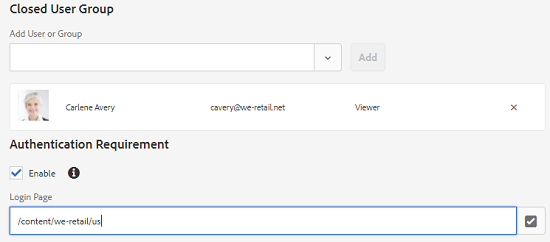

# Organize seus ativos digitais {#manage-digital-assets}

| Versão | Link do artigo |
| -------- | ---------------------------- |
| AEM as a Cloud Service | [Clique aqui](https://experienceleague.adobe.com/docs/experience-manager-cloud-service/content/assets/manage/manage-digital-assets.html?lang=pt-BR) |
| AEM 6.5 | Este artigo |

No [!DNL Adobe Experience Manager Assets], você pode fazer mais do que armazenar e controlar seus ativos. O [!DNL Experience Manager] oferece recursos de gerenciamento de ativos de nível empresarial. Você pode editar e compartilhar ativos, executar pesquisas avançadas e criar várias representações de dezenas de formatos de arquivo compatíveis. Você também pode gerenciar versões e direitos digitais, automatizar o processamento de ativos, gerenciar e controlar metadados, colaborar usando anotações e muito mais.

Este artigo descreve as tarefas básicas de gerenciamento de ativos, como criar ou fazer upload; atualizações de metadados; copiar, mover e excluir; publicar, cancelar a publicação e pesquisar ativos. Para entender a interface do usuário, consulte [introdução à interface do usuário do assets](/help/sites-authoring/basic-handling.md). Para gerenciar Fragmentos de conteúdo, consulte [gerenciar Fragmentos de conteúdo](/help/assets/content-fragments/content-fragments-managing.md) ativos.

## Criar pastas {#creating-folders}

Ao organizar uma coleção de ativos, por exemplo, todas as imagens do `Nature`, você pode criar pastas para mantê-las juntas. Você pode usar pastas para categorizar e organizar seus ativos. [!DNL Experience Manager Assets] não requer que você organize os ativos nas pastas para que funcionem melhor.

>[!NOTE]
>
>* Não há suporte para o compartilhamento de uma pasta [!DNL Assets] do tipo `sling:OrderedFolder` ao compartilhar com o Experience Cloud. Para compartilhar uma pasta, não selecione [!UICONTROL Ordenados] ao criar uma pasta.
>* [!DNL Experience Manager] não permite usar a palavra `subassets` como o nome de uma pasta. É uma palavra-chave reservada para um nó que contém subativos para ativos compostos.

1. Navegue até o local na pasta de ativos digitais em que deseja criar uma pasta. No menu, clique em **[!UICONTROL Criar]**. Selecione **[!UICONTROL Nova Pasta]**.
1. No campo **[!UICONTROL Título]**, forneça um nome de pasta. Por padrão, o DAM usa o título fornecido como o nome da pasta. Depois que a pasta for criada, você poderá substituir o padrão e especificar outro nome de pasta.
1. Clique em **[!UICONTROL Criar]**. Sua pasta é exibida na pasta de ativos digitais.

Os seguintes caracteres (lista separada por espaços de) não são suportados:

* Um nome de arquivo de ativo não pode conter nenhum destes caracteres: `* / : [ \\ ] | # % { } ? &`
* Um nome de pasta de ativos não pode conter nenhum destes caracteres: `* / : [ \\ ] | # % { } ? \" . ^ ; + & \t`

Não inclua caracteres especiais nas extensões dos nomes de arquivo do ativo.

## Upload de ativos {#uploading-assets}

<!-- TBD the following:
Move this section into a new article. CQDOC-14874 ticket is created for this.
In this complete article, replace emphasis with UICONTROL where appropriate.
-->

Você pode carregar vários tipos de ativos (incluindo imagens, arquivos PDF, arquivos RAW e assim por diante) de sua pasta local ou de uma unidade de rede para [!DNL Experience Manager Assets].

>[!NOTE]
>
>No modo Dynamic Media - Scene7, o tamanho padrão do arquivo de upload de ativos é de 2 GB ou menos. Para configurar o upload de ativos maiores que 2 GB até 15 GB, consulte [(Opcional) Configurar o Dynamic Media - Modo Scene7 para o upload de ativos maiores que 2 GB](/help/assets/config-dms7.md#optional-config-dms7-assets-larger-than-2gb).

>[!IMPORTANT]
>
>O Assets que você carregar em Experience Manager com um nome de arquivo maior que 100 caracteres terá um nome encurtado quando for usado no Dynamic Media.
>
>Os primeiros 100 caracteres no nome do arquivo são usados como estão; todos os caracteres restantes são substituídos por uma sequência alfanumérica. Esse método de renomeação garante um nome exclusivo quando o ativo é usado no Dynamic Media. Também se destina a acomodar o tamanho máximo permitido para o nome do arquivo do ativo no Dynamic Media.

Você pode optar por fazer upload de ativos para pastas com ou sem um perfil de processamento atribuído a eles.

Para pastas que têm um perfil de processamento atribuído, o nome do perfil aparece na miniatura na exibição de cartão. Na exibição de lista, o nome do perfil aparece na coluna **Processando Perfil**. Consulte [Processando Perfis](/help/assets/processing-profiles.md).

Antes de carregar um ativo, verifique se ele está em um [formato](/help/assets/assets-formats.md) compatível com [!DNL Experience Manager Assets].

1. Na interface do usuário do [!DNL Assets], navegue até o local em que deseja adicionar ativos digitais.
1. Para fazer upload dos ativos, siga um destes procedimentos:

   * Na barra de ferramentas, clique em **[!UICONTROL Criar]**. No menu, clique em **[!UICONTROL Arquivos]**. Você pode renomear o arquivo na caixa de diálogo apresentada, se necessário.
   * Em um navegador compatível com o HTML5, arraste os ativos diretamente para a interface do usuário do [!DNL Assets]. A caixa de diálogo para renomear arquivo não é exibida.

   

   Para selecionar vários arquivos, selecione a chave `Ctrl` ou `Command` e selecione os ativos na caixa de diálogo do seletor de arquivos. Ao usar uma iPad, você pode selecionar apenas um arquivo por vez.

   Você pode pausar o upload de ativos grandes (maiores que 500 MB) e retomá-lo posteriormente da mesma página. Clique em **[!UICONTROL Pausar]** ao lado da barra de progresso que aparece quando um carregamento é iniciado.

   

O tamanho acima do qual um ativo é considerado um ativo grande é configurável. Por exemplo, você pode configurar o sistema para considerar ativos acima de 1000 MB (em vez de 500 MB) como ativos grandes. Nesse caso, **[!UICONTROL Pausar]** aparece na barra de progresso quando ativos de tamanho superior a 1000 MB são carregados.

A opção [!UICONTROL Pausar] não mostra se um arquivo com mais de 1000 MB foi carregado com um arquivo com menos de 1000 MB. No entanto, se você cancelar o carregamento de arquivo com menos de 1000 MB, a opção **[!UICONTROL Pausar]** será exibida.

Para modificar o limite de tamanho, configure a propriedade `chunkUploadMinFileSize` do nó `fileupload` no repositório do CRX disponível em `/apps/dam/gui/content/assets/jcr:content/actions/secondary/create/items/fileupload`.

Ao clicar em **[!UICONTROL Pausar]**, ele alterna para a opção **[!UICONTROL Reproduzir]**. Para retomar o carregamento, clique em **[!UICONTROL Reproduzir]**.

Para cancelar um carregamento em andamento, clique em fechar (`X`) ao lado da barra de progresso. Quando você cancela a operação de carregamento, o [!DNL Assets] exclui a parte parcialmente carregada do ativo.

A capacidade de retomar o upload é especialmente útil em cenários de baixa largura de banda e falhas de rede, em que leva muito tempo para carregar um grande ativo. Você pode pausar a operação de upload e continuar mais tarde quando a situação melhorar. Ao retomar, o upload começa no ponto em que você o pausou.

Durante a operação de carregamento, [!DNL Experience Manager] salva as partes do ativo que estão sendo carregadas como partes de dados no repositório do CRX. Quando o carregamento for concluído, [!DNL Experience Manager] consolida essas partes em um único bloco de dados no repositório.

Para configurar a tarefa de limpeza para os trabalhos de carregamento de partes não concluídos, vá para `https://[aem_server]:[port]/system/console/configMgr/org.apache.sling.servlets.post.impl.helper.ChunkCleanUpTask`.

>[!CAUTION]
>
>O upload de partes é acionado quando o valor padrão é 500 MB e o tamanho da parte é 50 MB. Se você editar o [Apache Jackrabbit Oak TokenConfiguration](https://experienceleague.adobe.com/docs/experience-cloud-kcs/kbarticles/KA-16464.html?lang=pt-BR) e definir o `timeout configuration` como um tempo menor que o necessário para um ativo carregar, você encontrará uma situação de tempo limite de sessão enquanto o carregamento do ativo estiver em andamento. Portanto, altere o `chunkUploadMinFileSize` e o `chunksize` para que cada solicitação de segmento atualize a sessão.
>
>Considerando o tempo limite de expiração de credencial, a latência, a largura de banda e os uploads simultâneos esperados, o valor mais alto que permite garantir que o seguinte seja escolhido:
>
>* Para garantir que o carregamento de partes esteja habilitado para arquivos com tamanhos que possam causar expiração de credencial enquanto o carregamento estiver em andamento.
>
>* Para garantir que cada parte seja concluída antes que a credencial expire.

Se você fizer upload de um ativo com o mesmo nome de um ativo que já está disponível no local em que você está fazendo upload do ativo, uma caixa de diálogo de aviso será exibida.

É possível optar por substituir um ativo existente, criar outra versão ou manter ambos renomeando o novo ativo que é carregado. Se você substituir um ativo existente, os metadados do ativo e qualquer modificação anterior (por exemplo, anotação ou recorte) feita no ativo existente serão excluídos. Se você optar por manter ambos os ativos, o novo ativo será renomeado com o número `1` anexado ao seu nome.


>[!NOTE]
>
>Ao selecionar **[!UICONTROL Substituir]** na caixa de diálogo [!UICONTROL Conflito de Nome], a ID do ativo é gerada novamente para o novo ativo. Essa ID é diferente da ID do ativo anterior.
>
>Se o Assets Insights estiver habilitado para rastrear impressões ou cliques com [!DNL Adobe Analytics], a ID de ativo regenerada invalida os dados capturados para o ativo em [!DNL Analytics].

Se o ativo que você carregou existe em [!DNL Assets], a caixa de diálogo **[!UICONTROL Duplicatas Detectadas]** avisa que você está tentando carregar um ativo duplicado. A caixa de diálogo será exibida somente se o valor de soma de verificação `SHA 1` do binário do ativo existente corresponder ao valor de soma de verificação do ativo que você carregou. Nesse caso, os nomes dos ativos não importam.

>[!NOTE]
>
>A caixa de diálogo [!UICONTROL Duplicatas Detectadas] aparece somente quando o recurso de detecção de duplicidades está habilitado. Para habilitar o recurso de detecção de duplicidades, consulte [Habilitar Detecção de Duplicidades](/help/assets/duplicate-detection.md).


Para reter o ativo duplicado em [!DNL Assets], clique em **[!UICONTROL Manter]**. Para excluir o ativo duplicado carregado, clique em **[!UICONTROL Excluir]**.

[!DNL Experience Manager Assets] impede que você carregue ativos com os caracteres proibidos em seus nomes de arquivo. Se você tentar carregar um ativo com um nome de arquivo contendo um caractere não permitido ou mais, o [!DNL Assets] exibirá uma mensagem de aviso e interromperá o carregamento até que você remova esses caracteres ou carregue com um nome permitido.

Para se adequar às convenções de nomenclatura de arquivo específicas da sua organização, a caixa de diálogo [!UICONTROL Carregar Assets] permite que você especifique nomes longos para os arquivos carregados.

No entanto, os seguintes caracteres (lista separada por espaços de) não são suportados:

* o nome do arquivo do ativo não deve conter `* / : [ \\ ] | # % { } ? &`
* o nome da pasta de ativos não deve conter `* / : [ \\ ] | # % { } ? \" . ^ ; + & \t`

Não inclua caracteres especiais nas extensões dos nomes de arquivo do ativo.


Além disso, a interface de usuário do [!DNL Assets] exibe o ativo mais recente que você carregou para a pasta que você criou primeiro.

Se você cancelar a operação de carregamento antes que os arquivos sejam carregados, o [!DNL Assets] interromperá o carregamento do arquivo atual e atualizará o conteúdo. No entanto, os arquivos que já foram carregados não são excluídos.

A caixa de diálogo de progresso do carregamento em [!DNL Assets] exibe a contagem de arquivos carregados com êxito e os arquivos que falharam no carregamento.

### Uploads seriais {#serialuploads}

O carregamento de vários ativos em massa consome recursos significativos de E/S, o que pode afetar negativamente o desempenho da implantação do [!DNL Assets]. Especificamente, se você tiver uma conexão lenta com a Internet, o tempo para fazer upload aumenta drasticamente devido a um pico na E/S de disco. Além disso, seu navegador pode introduzir restrições adicionais ao número de solicitações de POST que [!DNL Assets] pode manipular para uploads de ativos simultâneos. Como resultado, a operação de upload falha ou é encerrada prematuramente. Em outras palavras, [!DNL Experience Manager Assets] pode perder alguns arquivos ao assimilar um conjunto de arquivos ou não conseguir assimilar nenhum arquivo.

Para superar essa situação, o [!DNL Assets] assimila um ativo de cada vez (carregamento serial) durante uma operação de carregamento em massa, em vez de assimilar todos os ativos simultaneamente.

O upload serial de ativos é ativado por padrão. Para desabilitar o recurso e permitir o carregamento simultâneo, sobreponha o nó `fileupload` no Crx-de e defina o valor da propriedade `parallelUploads` como `true`.

### Fazer upload de ativos usando FTP {#uploading-assets-using-ftp}

O Dynamic Media permite o upload em lote de ativos por meio do servidor FTP. Se você pretende fazer upload de ativos grandes (>1 GB) ou fazer upload de pastas e subpastas inteiras, use o FTP. Você pode até configurar o upload do FTP para que ele ocorra de forma recorrente e programada.

>[!NOTE]
>
>No modo Dynamic Media - Scene7, o tamanho padrão do arquivo de upload de ativos é de 2 GB ou menos. Para configurar o upload de ativos maiores que 2 GB até 15 GB, consulte [(Opcional) Configurar o Dynamic Media - Modo Scene7 para o upload de ativos maiores que 2 GB](/help/assets/config-dms7.md#optional-config-dms7-assets-larger-than-2gb).

>[!NOTE]
>
>Para carregar ativos via FTP no modo Dynamic Media - Scene7, instale o Pacote de recursos 18912 nas instâncias de autor [!DNL Experience Manager]. Entre em contato com o [Suporte ao Cliente do Adobe](https://experienceleague.adobe.com/pt-br?support-solution=General#support) para obter acesso ao FP-18912 e concluir a configuração da sua conta FTP. Para obter mais informações, consulte [Instalar o pacote de recursos 18912 para migração de ativos em massa](/help/assets/bulk-ingest-migrate.md).
>
>Se você usar o FTP para carregar ativos, as configurações de carregamento especificadas em [!DNL Experience Manager] serão ignoradas. Em vez disso, as regras de processamento de arquivos, conforme definidas no Dynamic Media Classic, são usadas.

**Para carregar ativos usando FTP**

1. Usando sua escolha de cliente FTP, faça logon no servidor FTP usando o nome de usuário e a senha FTP recebidos do email de provisionamento. No cliente FTP, carregue arquivos ou pastas para o servidor FTP.

1. Abra o [aplicativo de desktop do Dynamic Media Classic](https://experienceleague.adobe.com/docs/dynamic-media-classic/using/intro/dynamic-media-classic-desktop-app.html?lang=pt-BR#system-requirements-dmc-app) e entre na sua conta.

   Suas credenciais e logon foram fornecidos pelo Adobe no momento do provisionamento. Se você não tiver essas informações, entre em contato com o Suporte ao cliente da Adobe.

1. Na Barra de navegação global, clique em **[!UICONTROL Carregar]**.
1. Na página Upload, próximo ao canto superior esquerdo, clique na guia **[!UICONTROL Via FTP]**.
1. No lado esquerdo da página, escolha uma pasta FTP para fazer upload de arquivos. No lado direito da página, escolha uma pasta de destino.
1. Próximo ao canto inferior direito da página, clique em **[!UICONTROL Opções de Trabalho]** e defina as opções desejadas com base nos ativos da pasta selecionada.

   Consulte [Carregar Opções De Trabalho](#upload-job-options).

   >[!NOTE]
   >
   >Ao carregar ativos via FTP, as opções de trabalho de carregamento definidas no Dynamic Media Classic (S7) têm precedência sobre os parâmetros de processamento de ativos definidos no [!DNL Experience Manager].

1. No canto inferior direito da caixa de diálogo Fazer Upload das Opções de Trabalho, clique em **[!UICONTROL Salvar]**.
1. No canto inferior direito da página Upload, clique em **[!UICONTROL Enviar Upload]**.

   Para exibir o progresso do carregamento, na Barra de Navegação Global, clique em **[!UICONTROL Trabalhos]**. A página Jobs exibe o progresso do upload. Você pode continuar trabalhando no [!DNL Experience Manager] e retornar à página Trabalhos no Dynamic Media Classic a qualquer momento para revisar um trabalho em andamento.
Para cancelar um trabalho de carregamento em andamento, clique em **[!UICONTROL Cancelar]** ao lado da Duração.

#### Fazer upload das opções de trabalho {#upload-job-options}

| Opção de upload | Subopção | Descrição |
|---|---|---|
| Nome da tarefa | | O nome padrão pré-preenchido no campo de texto inclui a parte inserida pelo usuário do nome e o carimbo de data e hora. Você pode usar o nome padrão ou inserir um nome de sua própria criação para esse trabalho de upload. <br>O trabalho e outros trabalhos de carregamento e publicação são registrados na página Trabalhos, onde você pode verificar o status dos trabalhos. |
| Publish depois do upload | | Publica automaticamente os ativos que você faz upload. |
| Substituir em qualquer pasta, mesmo nome de ativo base independentemente da extensão | | Selecione essa opção se desejar que os arquivos dos quais você fez upload substituam arquivos existentes com os mesmos nomes. O nome desta opção pode ser diferente, dependendo das configurações em **[!UICONTROL Configuração do Aplicativo]** > **[!UICONTROL Configurações Gerais]** > **[!UICONTROL Carregar no Aplicativo]** > **[!UICONTROL Substituir Imagens]**. |
| Descompactar arquivos zip ou tar ao fazer upload | | |
| Opções de trabalho | | Clique em **[!UICONTROL Opções de Trabalho]** para abrir a caixa de diálogo [!UICONTROL Carregar Opções de Trabalho] e escolher as opções que afetam todo o trabalho de carregamento. Essas opções são as mesmas para todos os tipos de arquivos.<br>Você pode escolher opções padrão para carregar arquivos a partir da página Configurações Gerais do Aplicativo. Para abrir esta página, escolha **[!UICONTROL Instalação]** > **[!UICONTROL Instalação do Aplicativo]**. Selecione a opção **[!UICONTROL Opções de Carregamento Padrão]** para abrir a caixa de diálogo [!UICONTROL Opções de Carregamento do Trabalho]. |
| | Quando | Selecione Ocasional ou Recorrente. Para definir um trabalho recorrente, escolha uma opção Repetir — Diariamente, Semanalmente, Mensalmente ou Personalizado — para especificar quando você deseja que o trabalho de upload do FTP se repita. Em seguida, especifique as opções de agendamento, conforme necessário. |
| | Incluir subpastas | Faça upload de todas as subpastas contidas na pasta que você deseja fazer upload. Os nomes da pasta e suas subpastas que você carregou são inseridos automaticamente em [!DNL Experience Manager Assets]. |
| | Opções de corte | Para recortar manualmente das laterais de uma imagem, selecione o menu Recortar e escolha Manual. Em seguida, insira o número de pixels a serem cortados de qualquer lado ou de cada lado da imagem. O quanto da imagem é cortada depende da configuração ppi (pixels por polegada) no arquivo de imagem. Por exemplo, se a imagem exibir 150 ppi e você inserir 75 nas caixas de texto Superior, Direito, Inferior e Esquerdo, uma meia polegada será cortada de cada lado.<br> Para recortar automaticamente os pixels de espaço em branco de uma imagem, abra o menu Recortar, escolha Manual e insira medidas de pixels nos campos Superior, Direito, Inferior e Esquerdo para recortar das laterais. Você também pode escolher Aparar no menu Cortar e escolher estas opções:<br> **Aparar Com Base Em** <ul><li>**Cor** - Escolha a opção Cor. Em seguida, selecione o menu Canto e escolha o canto da imagem com a cor que melhor representa a cor do espaço em branco que você deseja cortar.</li><li>**Transparência** - Escolha a opção Transparência.<br> **Tolerância** - Arraste o controle deslizante para especificar uma tolerância de 0 a 1.Para cortar com base na cor, especifique 0 para cortar pixels somente se eles corresponderem exatamente à cor selecionada no canto da imagem. Números próximos a 1 permitem mais diferença de cor.<br>Para cortar com base na transparência, especifique 0 para cortar os pixels somente se eles forem transparentes. Números mais próximos de 1 permitem mais transparência.</li></ul><br>Estas opções de corte não são destrutivas. |
| | Opções de perfil de cores | Escolha uma conversão de cores ao criar arquivos otimizados usados para entrega:<ul><li>Preservação de cor padrão: mantém as cores da imagem de origem sempre que as imagens contêm informações de espaço de cores; não há conversão de cores. Quase todas as imagens atuais têm o perfil de cores apropriado já incorporado. No entanto, se uma imagem de origem CMYK não contiver um perfil de cores incorporado, as cores serão convertidas no espaço de cores sRGB (azul vermelho verde padrão). sRGB é o espaço de cores recomendado para exibir imagens em páginas da Web.</li><li>Manter espaço de cor original: retém as cores originais sem nenhuma conversão de cores no ponto. Para imagens sem um perfil de cores incorporado, qualquer conversão de cores é feita usando os perfis de cores padrão definidos nas configurações do Publish. Os perfis de cores podem não estar alinhados com a cor nos arquivos criados com essa opção. Portanto, é recomendável usar a opção Preservação de cor padrão.</li><li>Personalizar de > para <br> Abre menus para que você possa escolher um espaço de cores para Converter de e Converter para. Essa opção avançada substitui qualquer informação de cor incorporada no arquivo de origem. Selecione essa opção quando todas as imagens que você está enviando contiverem dados de perfil de cores incorretos ou ausentes.</li></ul> |
| | Opções de edição de imagem | É possível preservar as máscaras de recorte nas imagens e escolher um perfil de cores.<br> Consulte [Opções de configuração para edições de imagem no carregamento](#setting-image-editing-options-at-upload). |
| | Opções de Postscript | É possível rasterizar arquivos de PostScript®, cortar arquivos, manter planos de fundo transparentes, escolher uma resolução e escolher um espaço de cores.<br> Consulte [Definindo opções de carregamento de PostScript e Illustrator](#setting-postscript-and-illustrator-upload-options). |
| | Opções do Photoshop | É possível criar modelos a partir de arquivos Adobe® Photoshop®, manter camadas, especificar como as camadas são nomeadas, extrair texto e especificar como as imagens são ancoradas em modelos.<br> Modelos não são suportados em [!DNL Experience Manager].<br> Consulte [Definindo opções de carregamento do Photoshop](#setting-photoshop-upload-options). |
| | Opções de PDF | Você pode rasterizar os arquivos, extrair palavras e links de pesquisa, gerar automaticamente um eCatalog, definir a resolução e escolher um espaço de cores.<br>Não há suporte para eCatalogs em [!DNL Experience Manager]. <br> Consulte [Definindo opções de carregamento de PDF](#setting-pdf-upload-options).<br>**Observação**: o número máximo de páginas para um PDF a ser considerado para extração é 5.000 para novos carregamentos. Esse limite será alterado para 100 páginas (para todos os PDF) em 31 de dezembro de 2022. Consulte também [limitações do Dynamic Media](/help/assets/limitations.md). |
| | Opções do Illustrator | É possível rasterizar arquivos Adobe Illustrator®, manter planos de fundo transparentes, escolher uma resolução e um espaço de cores.<br> Consulte [Definindo opções de carregamento de PostScript e Illustrator](#setting-postscript-and-illustrator-upload-options). |
| | Opções de EVideo | É possível transcodificar um arquivo de vídeo escolhendo uma Predefinição de vídeo.<br> Consulte [Definindo opções de carregamento de eVideo](#setting-evideo-upload-options). |
| | Predefinições de conjunto de lotes | Para criar um Conjunto de imagens ou um Conjunto de rotação a partir dos arquivos carregados, clique na coluna Ativo da predefinição que deseja usar. É possível selecionar mais de uma predefinição. Crie as predefinições na página Configuração do aplicativo/Predefinições de conjunto de lotes do Dynamic Media Classic.<br> Consulte [Configuração de predefinições de conjunto de lotes para gerar automaticamente conjuntos de imagens e conjuntos de rotação](config-dms7.md#creating-batch-set-presets-to-auto-generate-image-sets-and-spin-sets) para saber mais sobre como criar predefinições de conjunto de lotes.<br> Consulte [Definindo predefinições de conjunto de lotes no carregamento](#setting-batch-set-presets-at-upload). |

#### Definir opções para edições de imagem no upload {#setting-image-editing-options-at-upload}

Ao carregar arquivos de imagem, incluindo arquivos AI, EPS e PSD, você pode realizar as seguintes ações de edição na caixa de diálogo [!UICONTROL Carregar Opções de Trabalho]:

* Cortar espaço em branco da borda das imagens (consulte a descrição na tabela acima).
* Recortar manualmente nas laterais das imagens (consulte a descrição na tabela acima).
* Escolha um perfil de cores (consulte descrição da opção na tabela acima).
* Criar uma máscara a partir de um traçado de recorte.
* Nitidez de imagens com opções de máscara sem nitidez
* Plano de fundo de separação

<!--
| Option | Sub-option | Description |
|---|---|---|
| Create Mask From Clipping Path | | Create a mask for the image based on its clipping path information. This option applies to images created with image-editing applications in which a clipping path was created. |
| Unsharp Masking | | Lets you fine-tune a sharpening filter effect on the final downsampled image, controlling the intensity of the effect, the radius of the effect (as measured in pixels), and a threshold of contrast that is ignored.<br> This effect uses the same options as Photoshop's Unsharp Mask filter. Contrary to what the name suggests, Unsharp Mask is a sharpening filter. Under Unsharp Masking, set the options you want. Setting options are described in the following: |
| | Amount | Controls the amount of contrast that is applied to edge pixels.<br> Think of it as the intensity of the effect. The main difference between the amount values of Unsharp Mask in Dynamic Media and the amount values in Adobe Photoshop, is that Photoshop has an amount range of 1% to 500%. Whereas, in Dynamic Media, the value range is 0.0 to 5.0. A value of 5.0 is the rough equivalent of 500% in Photoshop; a value of 0.9 is the equivalent of 90%, and so on. |
| | Radius | Controls the radius of the effect. The value range is 0-250.<br> The effect is run on all pixels in an image and radiates out from all pixels in all directions. The radius is measured in pixels. For example, to get a similar sharpening effect for a 2000 x 2000 pixel image and 500 x 500 pixel image, you would set a radius of two pixels on the 2000 x 2000 pixel image and a radius value of one pixel on the 500 x 500 pixel image. A larger value is used for an image that has more pixels. |
| | Threshold | Threshold is a range of contrast that is ignored when the Unsharp Mask filter is applied. It is important so that no "noise" is introduced to an image when this filter is used. The value range is 0-255, which is the number of brightness steps in a grayscale image. 0=black, 128=50% gray and 255=white.<br> For example, a threshold value of 12 ignores slight variations is skin tone brightness to avoid adding noise, but still add edge contrast to areas such as where eyelashes meet skin.<br> For example, if you have a photo of someone's face, the Unsharp Mask affects the parts of the image, such as where eyelashes and skin meet to create an obvious area of contrast, and the smooth skin itself. Even the smoothest skin exhibits subtle changes in brightness values. If you do not use a threshold value, the filter accentuates these subtle changes in skin pixels. In turn, a noisy and undesirable effect is created while contrast on the eyelashes is increased, enhancing sharpness.<br> To avoid this issue, a threshold value is introduced that tells the filter to ignore pixels that do not change contrast dramatically, like smooth skin.<br> In the zipper graphic shown earlier, notice the texture next to the zippers. Image noise is exhibited because the threshold values were too low to suppress the noise. |
| | Monochrome | Select to unsharp-mask image brightness (intensity).<br> Deselect to unsharp-mask each color component separately. |
| Knockout Background | | Automatically removes the background of an image when you upload it. This technique is useful to draw attention to a particular object and make it stand out from a busy background. Select to enable or "turn on" the Knockout Background feature and the following sub-options: |
| | Corner | Required.<br> The corner of the image that is used to define the background color to knockout.<br> You can choose from **Upper Left**, **Bottom Left**, **Upper Right**, or **Bottom Right**. |
| | Fill Method | Required.<br> Controls pixel transparency from the Corner location that you set.<br> You can choose from the following fill methods: <ul><li>**Flood Fill** - turns all pixels transparent that match the Corner that you have specified and are connected to it.</li><li>**Match Pixel** - turns all matching pixels transparent, regardless of their location on the image.</li></ul> |
| | Tolerance | Optional.<br> Controls the allowable amount of variation in pixel color matching based on the Corner location that you set.<br> Use a value of 0.0 to match pixel colors exactly or, use a value of 1.0 to allow for the greatest variation. |
-->

#### Definir opções de upload do PostScript e do Illustrator {#setting-postscript-and-illustrator-upload-options}

Ao fazer upload de arquivos de imagem do PostScript (EPS) ou do Illustrator (AI), você pode formatá-los de várias maneiras. É possível rasterizar os arquivos, manter o plano de fundo transparente, escolher uma resolução e escolher um espaço de cores. As opções de formatação de arquivos PostScript e Illustrator estão disponíveis na caixa de diálogo [!UICONTROL Opções de Trabalho de Carregamento] em [!UICONTROL Opções do PostScript] e [!UICONTROL Opções do Illustrator].

| Opção | Subopção | Descrição |
|---|---|---|
| Processamento | | Escolha **[!UICONTROL Rasterizar]** para converter gráficos vetoriais no arquivo para o formato de bitmap. |
| Manter plano de fundo transparente na imagem renderizada | | Mantenha a transparência de fundo do arquivo. |
| Resolução | | Determina a configuração de resolução. Essa configuração determina quantos pixels são exibidos por polegada no arquivo. |
| Espaço de cor | | Selecione o menu Espaço de cor e escolha entre as seguintes opções de espaço de cor: |
| | Detectar automaticamente | Mantém o espaço de cores do arquivo. |
| | Forçar como RGB | Converte para o espaço de cores do RGB. |
| | Forçar como CMYK | Converte para o espaço de cores CMYK. |
| | Forçar como escala de cinza | Converte para o espaço de cor de tons de cinza. |

#### Definir opções de upload do Photoshop {#setting-photoshop-upload-options}

Os arquivos de documento (PSD) do Photoshop são usados com mais frequência para criar modelos de imagem. Ao carregar um arquivo de PSD, você pode criar um modelo de imagem automaticamente a partir do arquivo (selecione a opção [!UICONTROL Criar modelo] na tela Upload).

O Dynamic Media cria várias imagens a partir de um arquivo PSD com camadas, se você usar o arquivo para criar um modelo; ele cria uma imagem para cada camada.

Use as [!UICONTROL Opções de Corte] e as [!UICONTROL Opções de Perfil de Cores], descritas acima, com as opções de carregamento do Photoshop.

>[!NOTE]
>
>Não há suporte para modelos em [!DNL Experience Manager].

| Opção | Subopção | Descrição |
|---|---|---|
| Manter camadas | | Extrai as camadas na PSD, se houver, para ativos individuais. As camadas de ativos permanecem associadas ao PSD. Para exibi-los, abra o arquivo PSD na exibição de Detalhes e selecione o painel de camadas. |
| Criar modelo | | Cria um modelo a partir das camadas no arquivo PSD. |
| Extrair texto | | Extrai o texto para que os usuários possam pesquisar texto em um Visualizador. |
| Estender camadas ao tamanho do plano de fundo | | Estende o tamanho das camadas de imagem extraídas para o tamanho da camada de plano de fundo. |
| Nomeação de camada | | As camadas no arquivo PSD são carregadas como imagens separadas. |
| | Nome da camada | Nomeia as imagens com base nos nomes das camadas no arquivo PSD. Por exemplo, uma camada chamada Etiqueta de preço no arquivo de PSD original se torna uma imagem chamada Etiqueta de preço. No entanto, se os nomes das camadas no arquivo PSD forem nomes de camadas padrão do Photoshop (Plano de fundo, Camada 1, Camada 2 e assim por diante), as imagens serão nomeadas após seus números de camada no arquivo PSD. Eles não são nomeados com base nos nomes de camada padrão. |
| | Photoshop e Número de Camada | Nomeia as imagens de acordo com seus números de camada no arquivo PSD, ignorando os nomes das camadas originais. As imagens são nomeadas com o nome de arquivo do Photoshop e um número de camada anexado. Por exemplo, a segunda camada de um arquivo chamado Spring Ad.psd é chamada Spring Ad_2, mesmo se tiver um nome não padrão no Photoshop. |
| | Photoshop e nome da camada | Nomeia as imagens após o arquivo PSD seguido pelo nome ou número da camada. O número da camada é usado se os nomes das camadas no arquivo PSD forem nomes de camadas Photoshop padrão. Por exemplo, uma camada chamada Price Tag em um arquivo de PSD chamado SpringAd é chamada Spring Ad_Price Tag. Uma camada com o nome padrão Layer 2 é chamada Spring Ad_2. |
| Âncora | | Especifique como as imagens são ancoradas em modelos que são gerados a partir da composição em camadas produzida a partir do arquivo PSD. Por padrão, a âncora é o centro. Uma âncora central permite que imagens de substituição preencham melhor o mesmo espaço, independentemente da proporção da imagem de substituição. As imagens com um aspecto diferente que substituem essa imagem, ao referenciar o modelo e usar a substituição de parâmetro, ocupam efetivamente o mesmo espaço. Altere para uma configuração diferente se seu aplicativo exigir que as imagens de substituição preencham o espaço alocado no modelo. |

#### Definir opções de upload de PDF {#setting-pdf-upload-options}

Ao fazer upload de um arquivo PDF, você pode formatá-lo de várias maneiras. Corta as páginas, extrai palavras de pesquisa, insere uma resolução de pixels por polegada e escolhe um espaço de cor. Os arquivos PDF geralmente contêm uma margem de apara, marcas de corte, marcas de registro e outras marcas de impressora. Você pode cortar essas marcas nas laterais das páginas ao fazer upload de um arquivo PDF.

O número máximo de páginas para um PDF a ser considerado para extração é 5000 para novos uploads. Esse limite será alterado para 100 páginas (para todos os PDF) em 31 de dezembro de 2022. Consulte também [limitações do Dynamic Media](/help/assets/limitations.md).

>[!NOTE]
>
>Não há suporte para eCatalogs em [!DNL Experience Manager].

Escolha entre as seguintes opções:

| Opção | Subopção | Descrição |
|---|---|---|
| Processamento | Rasterizar | (Padrão) Extrai as páginas no arquivo PDF e converte gráficos de vetor em imagens de bitmap. Escolha essa opção se desejar criar um eCatalog. |
| Extrair | Pesquisar palavras | Extrai palavras do arquivo PDF para que o arquivo possa ser pesquisado por palavra-chave em um eCatalog Viewer. |
| | Links | Extrai links dos arquivos PDF e os converte em Mapas de imagem que são usados em um eCatalog Viewer. |
| Gerar automaticamente eCatalog a partir de PDF de várias páginas | | Cria automaticamente um eCatalog a partir do arquivo PDF. O eCatalog é nomeado com base no arquivo PDF que você carregou. (Essa opção só estará disponível se você rasterizar o arquivo de PDF à medida que fizer upload dele.) |
| Resolução | | Determina a configuração de resolução. Essa configuração determina quantos pixels são exibidos por polegada no arquivo PDF. O padrão é 150. |
| Espaço de cor | | Selecione o menu Espaço de cor e escolha um espaço de cor para o arquivo PDF. A maioria dos arquivos PDF tem imagens coloridas RGB e CMYK. O espaço de cores do RGB é preferível para visualização on-line. |
| | Detectar automaticamente | Mantém o espaço de cores do arquivo PDF. |
| | Forçar como RGB | Converte para o espaço de cores do RGB. |
| | Forçar como CMYK | Converte para o espaço de cores CMYK. |
| | Forçar como escala de cinza | Converte para o espaço de cor de tons de cinza. |

#### Definir opções de upload de eVideo {#setting-evideo-upload-options}

Para transcodificar um arquivo de vídeo escolhendo entre várias predefinições de vídeo.

| Opção | Subopção | Descrição |
|---|---|---|
| Vídeo adaptável | | Uma única predefinição de codificação que funciona com qualquer taxa de proporção para criar vídeos, para serem enviados a dispositivos móveis, tablets e computadores de mesa. Os vídeos de origem carregados codificados com essa predefinição são definidos com uma altura fixa. No entanto, a largura é dimensionada automaticamente para preservar a proporção do vídeo. <br>A prática recomendada é usar a codificação do Vídeo Adaptável. |
| Predefinições de codificação única | Predefinições de codificação de classificação | Selecione **[!UICONTROL Nome]** ou **[!UICONTROL Tamanho]** se desejar classificar as predefinições de codificação listadas em Área de Trabalho, Dispositivo Móvel e Tablet por nome ou por tamanho de resolução. |
| | Desktop | Crie um arquivo MP4 para proporcionar uma experiência de vídeo contínua ou progressiva a computadores desktop. Selecione uma ou mais taxas de proporção com o tamanho da resolução e a taxa de dados de destino desejados. |
| | Mobile | Crie um arquivo MP4 para entrega em dispositivos móveis iPhone ou Android™. Selecione uma ou mais taxas de proporção com o tamanho da resolução e a taxa de dados de destino desejados. |
| | Tablet | Crie um arquivo MP4 para entrega em dispositivos tablet iPad ou Android™. Selecione uma ou mais taxas de proporção com o tamanho da resolução e a taxa de dados de destino desejados. |

#### Definir predefinições de conjunto de lotes no upload {#setting-batch-set-presets-at-upload}

Se quiser criar automaticamente um Conjunto de imagens ou um Conjunto de rotação a partir de imagens carregadas, clique na coluna Ativo da predefinição que deseja usar. É possível selecionar mais de uma predefinição.

Consulte [Configuração de predefinições de conjunto de lotes para gerar automaticamente conjuntos de imagens e conjuntos de rotação](/help/assets/config-dms7.md#creating-batch-set-presets-to-auto-generate-image-sets-and-spin-sets) para saber mais sobre como criar predefinições de conjunto de lotes.

### Uploads transmitidos {#streamed-uploads}

Se você fizer upload de muitos ativos para o Adobe Experience Manager, as solicitações de E/S para o servidor aumentarão drasticamente, o que reduz a eficiência do upload e pode até fazer com que algumas tarefas de upload atinjam o tempo limite. O [!DNL Experience Manager Assets] oferece suporte ao carregamento transmitido de ativos. O upload transmitido reduz a E/S de disco durante a operação de upload, evitando o armazenamento de ativos em uma pasta temporária no servidor antes de copiá-lo para o repositório. Em vez disso, os dados são transferidos diretamente para o repositório. Dessa forma, o tempo para carregar grandes ativos e a possibilidade de tempos limite é reduzido. O carregamento transmitido está habilitado por padrão em [!DNL Assets].

>[!NOTE]
>
>O upload de streaming está desativado para o Adobe Experience Manager em execução no servidor JEE com a versão da api de servlet inferior a 3.1.

### Extrair arquivo ZIP contendo ativos {#extractzip}

Você pode carregar arquivos ZIP como qualquer outro ativo compatível. As mesmas regras de nome de arquivo se aplicam a arquivos ZIP. [!DNL Experience Manager] permite extrair um arquivo ZIP para um local DAM. Se os arquivos compactados não contiverem ZIP como extensão, habilite a detecção de tipo de arquivo usando conteúdo.

Selecione um arquivo ZIP por vez, clique em **[!UICONTROL Extrair arquivo]** e selecione uma pasta de destino. Selecione uma opção que resolva conflitos, se houver. Se os ativos no arquivo ZIP existirem na pasta de destino, é possível selecionar uma destas opções: ignorar a extração, substituir arquivos existentes, manter ambos os ativos renomeando ou criar uma versão.

Após a conclusão da extração, [!DNL Experience Manager] o notifica na área de notificação. Enquanto o [!DNL Experience Manager] extrai o ZIP, você pode voltar ao seu trabalho sem interromper a extração.


Algumas limitações do recurso são:

* Se uma pasta com o mesmo nome existir no destino, os ativos do arquivo ZIP serão extraídos na pasta existente.
* Se você cancelar a extração, os ativos já extraídos não serão excluídos.
* Não é possível selecionar dois arquivos ZIP ao mesmo tempo e extraí-los. Só é possível extrair um arquivo ZIP de cada vez.
* Ao carregar um arquivo ZIP, se a caixa de diálogo de carregamento exibir um erro de servidor 500, tente novamente após instalar o [Service Pack mais recente](/help/release-notes/release-notes.md).

## Visualizar ativos {#previewing-assets}

Para visualizar um ativo, siga estas etapas.

1. Na interface de usuário do [!DNL Assets], navegue até o local do ativo que deseja visualizar.
1. Clique no ativo desejado para que você possa abri-lo.

1. No modo de visualização, as opções de zoom estão disponíveis para [tipos de imagem com suporte](/help/assets/assets-formats.md#supported-raster-image-formats) (com edição interativa).

   Para ampliar um ativo, clique em `+` (ou clique na lupa do ativo). Para reduzir, clique em `-`. Ao ampliar, você pode observar de perto qualquer área da imagem com um movimento panorâmico. A seta para redefinir zoom leva você de volta à exibição original. Para redefinir o modo de exibição para o tamanho original, clique em **[!UICONTROL Redefinir]** .

**Visualizar ativos usando apenas teclas de teclado**

Para visualizar um ativo usando o teclado, siga estas etapas:

1. Na interface de usuário do [!DNL Assets], navegue até o ativo desejado usando `Tab` e as teclas de seta.

1. Pressione a tecla `Enter` no ativo desejado para que você possa abri-lo. É possível ampliar ativos no modo de visualização.

1. Para ampliar o ativo:
   1. Use a tecla `Tab` para mover o foco para a opção de ampliação.
   1. Use a tecla `Enter` para aplicar zoom na imagem.

   Para reduzir, use a tecla `Tab` para colocar o foco na opção de redução e pressione `Enter`.

1. Use as teclas `Shift` + `Tab` para mover o foco de volta na imagem.

1. Use as teclas de seta para se mover ao redor da imagem com zoom.

>[!MORELIKETHIS]
>
>* [Visualizar o Dynamic Media Assets](/help/assets/previewing-assets.md).
>* [Exibir subativos](managing-linked-subassets.md#viewing-subassets).

## Editar propriedades e metadados {#editing-properties}

1. Navegue até o local do ativo cujos metadados você deseja editar.

1. Selecione o ativo e, na barra de ferramentas, selecione **[!UICONTROL Propriedades]** para exibir as propriedades do ativo. Como alternativa, escolha a ação rápida **[!UICONTROL Propriedades]** no cartão de ativos.

   

1. Na página [!UICONTROL Propriedades], edite as propriedades de metadados em várias guias. Por exemplo, na guia **[!UICONTROL Básico]**, edite o título e a descrição.

   >[!NOTE]
   >
   >O layout da página [!UICONTROL Propriedades] e as propriedades de metadados disponíveis dependem do esquema de metadados subjacente. Para saber como modificar o layout da página [!UICONTROL Propriedades], consulte [Esquemas de Metadados](/help/assets/metadata-schemas.md).

1. Para programar uma data/hora específica para a ativação do ativo, use o seletor de datas ao lado do campo **[!UICONTROL No horário]**.

   

   *Figura: use o seletor de datas para agendar a ativação do ativo.*

1. Marque a opção **[!UICONTROL Tempo de ativação/desativação atingido]** se desejar atualizar os acionadores do agente de replicação nas propriedades de metadados.
   

1. Para desativar o ativo após uma duração específica, escolha a data/hora de desativação no seletor de datas ao lado do campo **[!UICONTROL Tempo de desativação]**. A data de desativação deve ser posterior à data de ativação de um ativo. Após o [!UICONTROL Tempo Desativado], um ativo e suas representações não estarão disponíveis nem pela interface da Web do [!DNL Assets] nem pela API HTTP.

1. No campo **[!UICONTROL Marcas]**, selecione uma ou mais marcas. Para adicionar uma marca personalizada, digite o nome da marca na caixa e selecione `Enter`. A nova marca foi salva em [!DNL Experience Manager]. [!DNL YouTube] requer tags para publicar. Consulte [publicar vídeos no YouTube](video.md#publishing-videos-to-youtube).

   >[!NOTE]
   >
   >Para criar tags, você precisa de permissão de gravação em `/content/cq:tags/default` no repositório do CRX.

1. Para fornecer uma classificação ao ativo, clique na guia **[!UICONTROL Avançado]** e clique na estrela na posição apropriada para atribuir a classificação desejada.

   

   A pontuação de classificação atribuída ao ativo é exibida em **[!UICONTROL Suas classificações]**. A pontuação média de classificação que o ativo recebeu dos usuários que classificaram o ativo é exibida em **[!UICONTROL Classificação]**. Além disso, o detalhamento das pontuações de classificação que contribuem para a pontuação de classificação média é exibido em **[!UICONTROL Detalhamento da classificação]**. Você pode pesquisar ativos com base nas pontuações médias de classificação.

1. Para exibir as estatísticas de uso do ativo, clique na guia **[!UICONTROL Insights]**.

   As estatísticas de uso incluem o seguinte:

   * Número de vezes que o ativo foi visualizado ou baixado
   * Canais/dispositivos pelos quais o ativo foi usado
   * Soluções criativas nas quais o ativo foi usado recentemente

   Para obter mais detalhes, consulte [Assets Insights](/help/assets/asset-insights.md).

1. Clique em **[!UICONTROL Salvar e fechar]**.
1. Navegue até a interface de usuário [!DNL Assets]. As propriedades de metadados editados, incluindo título, descrição, classificações e assim por diante, são exibidas no cartão de ativos na exibição Cartão e em colunas relevantes na exibição Lista.

## Copiar ativos {#copying-assets}

Ao copiar um ativo ou uma pasta, o ativo inteiro ou a pasta é copiada, juntamente com sua estrutura de conteúdo. Um ativo ou uma pasta copiada é duplicada no local de destino. O ativo no local de origem não é alterado.

Alguns atributos exclusivos de uma cópia específica de um ativo não são transferidos. Alguns exemplos são:

* ID do ativo, data e hora de criação e versões e histórico de versões. Algumas dessas propriedades são indicadas pelas propriedades `jcr:uuid`, `jcr:created` e `cq:name`.

* O tempo de criação e os caminhos referenciados são exclusivos para cada ativo e cada representação.

As outras propriedades e informações de metadados são retidas. Uma cópia parcial não é criada ao copiar um ativo.

1. Na interface do [!DNL Assets], selecione um ou mais ativos e clique em **[!UICONTROL Copiar]** na barra de ferramentas. Como alternativa, selecione a opção **[!UICONTROL Copiar]**  para ação rápida a partir do cartão de ativos.

   >[!NOTE]
   >
   >Se você usar a ação rápida [!UICONTROL Copiar], só será possível copiar um ativo de cada vez.

1. Navegue até o local onde deseja copiar os ativos.

   >[!NOTE]
   >
   >Se você copiar um ativo no mesmo local, [!DNL Experience Manager] automaticamente gera uma variação do nome. Por exemplo, se você copiar um ativo intitulado `Square`, [!DNL Experience Manager] gerará automaticamente o título para sua cópia como `Square1`.

1. Clique na opção de ativo **[!UICONTROL Colar]**  da barra de ferramentas. Em seguida, os Assets são copiados para esse local.

   >[!NOTE]
   >
   >A opção **[!UICONTROL Colar]** está disponível na barra de ferramentas até que a operação de colagem seja concluída.

## Mover e renomear ativos {#moving-or-renaming-assets}

Ao mover ativos (ou pastas) para outro local, os ativos (ou pastas) não são duplicados, ao contrário da cópia do ativo. Os ativos (ou as pastas) são colocados no local de destino e são removidos do local de origem. Você também pode renomear o ativo ao movê-lo para o novo local.
Se você estiver movendo um ativo publicado para um local diferente, será possível republicar o ativo. Por padrão, a operação Mover em um ativo publicado cancela a publicação automaticamente. Um ativo movido será republicado se o autor selecionar a opção [!UICONTROL Republicar] ao mover o ativo.


Para mover ativos ou pastas:

1. Navegue até o local do ativo que deseja mover.

1. Selecione o ativo e clique na opção **[!UICONTROL Mover]** da barra de ferramentas.
   

1. No assistente [!UICONTROL Mover Assets], siga um destes procedimentos:

   * Especifique o nome do ativo depois que ele for movido. Em seguida, clique em **[!UICONTROL Avançar]** para continuar.

   * Clique em **[!UICONTROL Cancelar]** para parar o processo.

   >[!NOTE]
   >
   >* Você pode especificar o mesmo nome para o ativo se não houver um ativo com esse nome no novo local. No entanto, você deve usar um nome diferente se mover o ativo para um local onde exista um ativo com o mesmo nome. Se você usar o mesmo nome, o sistema gerará automaticamente uma variação do nome. Por exemplo, se o ativo tiver o nome Quadrado, o sistema gera o nome Quadrado1 para sua cópia.
   >* Ao renomear, não é permitido espaço em branco no nome do arquivo.

1. Na caixa de diálogo **[!UICONTROL Selecionar Destino]**, siga um destes procedimentos:

   * Navegue até o novo local dos ativos e clique em **[!UICONTROL Avançar]** para continuar.

   * Clique em **[!UICONTROL Voltar]** para retornar à tela **[!UICONTROL Renomear]**.

1. Se os ativos que estão sendo movidos tiverem páginas de referência, ativos ou coleções, a guia **[!UICONTROL Ajustar Referências]** será exibida ao lado da guia **[!UICONTROL Selecionar Destino]**.

   Siga um destes procedimentos na tela **[!UICONTROL Ajustar Referências]**:

   * Especifique as referências a serem ajustadas com base nos novos detalhes e clique em **[!UICONTROL Mover]** para continuar.

   * Na coluna **[!UICONTROL Ajustar]**, selecione/desmarque referências aos ativos.
   * Clique em **[!UICONTROL Voltar]** para retornar à tela **[!UICONTROL Selecionar destino]**.

   * Clique em **[!UICONTROL Cancelar]** para interromper a operação de movimentação.

   Se você não atualizar as referências, elas continuarão apontando para o caminho anterior do ativo. Se você ajustar as referências, elas serão atualizadas para o novo caminho do ativo.

### Mover ativos usando a operação de arrastar {#move-using-drag}

Você pode mover ativos (ou pastas) para uma pasta irmã arrastando-os para o local de destino, em vez de usar a opção [!UICONTROL Mover] na interface. No entanto, essa operação é possível somente na exibição de lista.

Mover ativos arrastando-os não abre o assistente [!UICONTROL Mover ativo]. Portanto, você não tem a opção de renomear os ativos enquanto os move. Além disso, os ativos já publicados são republicados ao movê-los arrastando, sem buscar a aprovação do usuário para republicar.


## Gerenciar representações {#managing-renditions}

1. É possível adicionar ou remover representações de um ativo, exceto o original. Navegue até o local do ativo ao qual deseja adicionar ou remover representações.

1. Clique no ativo para abrir a página.
1. Na interface Experience Manager, selecione **[!UICONTROL Representações]** na lista.
1. No painel **[!UICONTROL Representações]**, exiba a lista de representações geradas para o ativo.

   

   >[!NOTE]
   >
   >Por padrão, [!DNL Assets] não exibe a representação original do ativo no modo de visualização. Se você for um administrador, poderá usar sobreposições para configurar o [!DNL Assets] para exibir representações originais no modo de visualização.

1. Selecione uma representação para exibir ou excluir a representação.

   **Excluir uma representação**

   Selecione uma representação no painel **[!UICONTROL Representações]** e clique na opção **[!UICONTROL Excluir Representação]**  da barra de ferramentas. As representações não podem ser excluídas em massa após a conclusão do processamento de ativos. Para ativos individuais, é possível remover representações manualmente da interface do usuário. Para vários ativos, é possível personalizar o Experience Manager para excluir representações específicas ou excluir os ativos e fazer upload novamente dos ativos excluídos.

   **Carregar uma nova representação**

   Navegue até a página de detalhes do ativo e clique na opção **[!UICONTROL Adicionar representação]**  na barra de ferramentas para carregar uma nova representação para o ativo.

   >[!NOTE]
   >
   >Se você selecionar uma representação no painel **[!UICONTROL Representações]**, a barra de ferramentas alterará o contexto e exibirá somente as ações relevantes para a representação. Opções, como a opção [!UICONTROL Carregar Representação], não são exibidas. Para exibir essas opções na barra de ferramentas, navegue até a página de detalhes do ativo.

   É possível configurar as dimensões da representação que deseja exibir na página de detalhes de um ativo de imagem ou vídeo. Com base nas dimensões especificadas, [!DNL Assets] exibe a representação com as dimensões exatas ou mais próximas.

   Para configurar as dimensões de representação de uma imagem no nível de detalhes do ativo, sobreponha o nó `renditionpicker` (`libs/dam/gui/content/assets/assetpage/jcr:content/body/content/content/items/assetdetail/items/col1/items/assetview/renditionpicker`) e configure o valor da propriedade largura. Configure a propriedade **[!UICONTROL size (Long) em KB]** no lugar da largura para que você possa personalizar a representação na página de detalhes do ativo com base no tamanho da imagem. Para personalização baseada em tamanho, a propriedade `preferOriginal` atribui preferência ao original se o tamanho da representação correspondente for maior que o original.

   Da mesma forma, você pode personalizar a imagem da página de Anotação sobrepondo `libs/dam/gui/content/assets/annotate/jcr:content/body/content/content/items/content/renditionpicker`.

   

   Para configurar as dimensões de representação para um ativo de vídeo, navegue até o nó `videopicker` no repositório do CRX no local `/libs/dam/gui/content/assets/assetpage/jcr:content/body/content/content/items/assetdetail/items/col1/items/assetview/videopicker`, sobreponha o nó e edite a propriedade apropriada.

   >[!NOTE]
   >
   >As anotações de vídeo são suportadas apenas em navegadores com formatos de vídeo compatíveis com o HTML5. Além disso, dependendo do navegador, diferentes formatos de vídeo são compatíveis. No entanto, o formato de vídeo MXF ainda não é compatível com anotações de vídeo.

Para obter mais informações sobre como gerar e exibir subativos, consulte [Gerenciar subativos](managing-linked-subassets.md#generate-subassets).

## Excluir ativos {#deleting-assets}

Para excluir ativos, um usuário precisa de permissões de exclusão em `dam/asset`. Se você só tiver permissões de modificação, poderá editar os metadados do ativo e adicionar anotações ao ativo. No entanto, não é possível excluir o ativo ou seus metadados.

Para resolver ou remover as referências recebidas de outras páginas, atualize as referências relevantes antes de excluir um ativo. Para impedir que os usuários excluam ativos referenciados e deixem links desfeitos, desative a opção Forçar exclusão usando uma sobreposição.

Para excluir um ativo ou uma pasta contendo ativo:

1. Navegue até o local do ativo ou a pasta que deseja excluir.

1. Selecione o ativo ou pasta e clique em **[!UICONTROL Excluir]**  na barra de ferramentas.

   Depois de confirmar a exclusão:

   * Se o ativo não tiver referências, o ativo é excluído.

   * Se o ativo tiver referências, uma mensagem de erro informará que **Um ou mais ativos são referenciados**. Você pode selecionar **[!UICONTROL Forçar Exclusão]** ou **[!UICONTROL Cancelar]**.

   >[!NOTE]
   >
   >* Para resolver ou remover as referências recebidas de outras páginas, atualize as referências relevantes antes de excluir um ativo. Além disso, desative a opção forçar exclusão usando uma sobreposição, para impedir que os usuários excluam os ativos referenciados e deixem links desfeitos.
   >* É possível excluir uma *pasta* que contenha arquivos de ativos com check-out. Antes de excluir uma pasta, verifique se nenhum ativo digital foi retirado por usuários.

>[!NOTE]
>
>Se você excluir uma pasta usando o método acima na interface do usuário do, os grupos de usuários associados também serão excluídos.
>
>No entanto, grupos de usuários redundantes, não utilizados e gerados automaticamente podem ser apagados do repositório usando o método `clean` no JMX em sua instância do autor (`https://[server]:[port]/system/console/jmx/com.day.cq.dam.core.impl.team%3Atype%3DClean+redundant+groups+for+Assets`).

## Baixar ativos {#downloading-assets}

Consulte [Baixar ativos do Experience Manager](/help/assets/download-assets-from-aem.md).

## Publish ou cancelar a publicação de ativos {#publish-assets}

Depois de carregar, processar ou editar os ativos no autor do [!DNL Experience Manager], você os publica no servidor de publicação. A publicação disponibiliza o ativo publicamente. A ação de desfazer a publicação removeu o ativo do servidor de publicação, mas não do servidor de criação.

Para obter informações específicas do [!DNL Dynamic Media], consulte [publicação [!DNL Dynamic Media] ativos](/help/assets/publishing-dynamicmedia-assets.md).

1. Navegue até o local do ativo ou da pasta de ativos que deseja publicar ou remover do ambiente de publicação (cancelar publicação).

1. Selecione o ativo ou a pasta que deseja cancelar a publicação e clique na opção **[!UICONTROL Gerenciar publicação]**  da barra de ferramentas. Como alternativa, para publicar rapidamente, selecione a opção **[!UICONTROL Publish rápido]** na barra de ferramentas. Se a pasta que você deseja publicar incluir uma pasta vazia, ela não será publicada.

1. Selecione a opção **[!UICONTROL Publish]** ou **[!UICONTROL Cancelar publicação]**, conforme necessário.

   
   *Figura: opções de Publish e cancelamento de publicação e a opção de agendamento.*

1. Selecione **[!UICONTROL Agora]** para atuar no ativo imediatamente ou selecione **[!UICONTROL Mais tarde]** para agendar a ação. Selecione uma data e hora se você escolher a opção **[!UICONTROL Mais tarde]**. Clique em **[!UICONTROL Avançar]**.

1. Ao publicar, se um ativo fizer referência a outros ativos, suas referências serão listadas no assistente. Somente essas referências são exibidas, não publicadas ou modificadas desde a última publicação. Escolha as referências que deseja publicar.

1. Ao desfazer a publicação, se um ativo fizer referência a outros ativos, escolha as referências que deseja desfazer a publicação. Clique em **[!UICONTROL Desfazer a publicação]**. Na caixa de diálogo de confirmação, clique em **[!UICONTROL Cancelar]** para interromper a ação ou em **[!UICONTROL Cancelar publicação]** para confirmar se a publicação dos ativos será desfeita na data especificada.

Entenda as seguintes limitações e dicas relacionadas à publicação ou ao cancelamento da publicação de ativos ou pastas:

* A opção [!UICONTROL Gerenciar Publicação] está disponível somente para as contas de usuário que têm permissões de replicação.
* Ao desfazer a publicação de um ativo complexo, cancele a publicação somente do ativo. Evite desfazer a publicação das referências, pois elas podem ser referenciadas por outros ativos publicados.
* Pastas vazias não são publicadas.
* Se você publicar um ativo que está sendo processado, somente o conteúdo original será publicado. As representações estão ausentes. Aguarde a conclusão do processamento e publique ou republique o ativo depois que o processamento for concluído.

## Grupo de usuário fechado {#closed-user-group}

Um grupo de usuários fechado (CUG) é usado para limitar o acesso a pastas de ativos específicas publicadas de [!DNL Experience Manager]. Se você criar um CUG para uma pasta, o acesso à pasta (incluindo ativos e subpastas da pasta) será restrito somente aos membros ou grupos atribuídos. Para acessar a pasta, é necessário fazer logon usando suas credenciais de segurança.

Os CUGs são uma maneira extra de restringir o acesso aos seus ativos. Você também pode configurar uma página de logon para a pasta.

1. Selecione uma pasta na interface [!DNL Assets] e clique na opção [!UICONTROL Propriedades] na barra de ferramentas para exibir a página de propriedades.
1. Na guia **[!UICONTROL Permissões]**, adicione membros ou grupos em **[!UICONTROL Grupo de usuários fechado]**.

   

1. Para exibir uma tela de logon quando os usuários acessarem a pasta, selecione a opção **[!UICONTROL Habilitar]**. Em seguida, selecione o caminho para uma página de logon em [!DNL Experience Manager] e salve as alterações.

   

   >[!NOTE]
   >
   >Se você não especificar o caminho para uma página de logon, [!DNL Experience Manager] exibirá a página de logon padrão na instância de publicação.

1. Publish na pasta e tente acessá-la a partir da instância de publicação. Uma tela de logon é exibida.
1. Se você for um membro CUG, digite suas credenciais de segurança. A pasta é exibida depois que [!DNL Experience Manager] autentica você.

## Pesquisar ativos {#assetsearch}

A pesquisa de ativos é essencial para o uso de um sistema de gerenciamento de ativos digitais. Essa funcionalidade é importante para atividades criativas, para o gerenciamento robusto de ativos pelos usuários empresariais e profissionais de marketing ou para administração por administradores do DAM.

Para pesquisas simples, avançadas e personalizadas para descobrir e usar os ativos mais apropriados, consulte [pesquisar ativos no Experience Manager](search-assets.md).

## Ações rápidas {#quick-actions}

Os ícones de ação rápida estão disponíveis para um único ativo de cada vez. Dependendo do dispositivo, execute as seguintes ações para exibir os ícones de ação rápida:

* Dispositivos de toque: toque e segure. Por exemplo, em uma iPad, é possível selecionar e manter um ativo para que as ações rápidas sejam exibidas.
* Dispositivos sem toque: passe o ponteiro do mouse. Por exemplo, em um dispositivo de desktop, a barra de ação rápida é exibida se você passar o ponteiro do mouse sobre a miniatura do ativo.

### Navegar e selecionar ativos {#navigating-and-selecting-assets}

Você pode exibir, navegar e selecionar ativos com qualquer uma das exibições disponíveis (Cartão, Coluna e Lista) usando a opção **[!UICONTROL Selecionar]**.

Na exibição em lista e na exibição em coluna, a opção **[!UICONTROL Selecionar]** é exibida quando você passa o mouse sobre a miniatura do ativo.

No modo de exibição de cartão, a opção **[!UICONTROL Selecionar]** é exibida como uma ação rápida.

Ao navegar em uma pasta ou coleção na interface de usuário do [!DNL Assets] em um navegador, você pode selecionar todos os ativos exibidos ou carregados usando a opção [!UICONTROL Selecionar tudo] no canto superior direito. Inicialmente, apenas 100 ativos são carregados na exibição de cartão e 200 na exibição de lista. Mais ativos são carregados na exibição ao rolar a página de resultados da pesquisa. A opção [!UICONTROL Selecionar tudo] seleciona somente os ativos carregados.

Para obter mais informações, consulte [exibir e selecionar seus recursos](/help/sites-authoring/basic-handling.md#viewing-and-selecting-resources).

## Editar imagens {#editing-images}

As ferramentas de edição da interface do [!DNL Assets] permitem executar pequenos trabalhos de edição em ativos de imagem. É possível cortar, girar, virar e executar outros trabalhos de edição em imagens. Também é possível adicionar mapas de imagem a ativos.

>[!NOTE]
>
>Para alguns componentes, o modo Tela cheia tem opções adicionais disponíveis.

1. Siga um destes procedimentos para abrir um ativo no modo de edição:

   * Selecione o ativo e clique em **[!UICONTROL Editar]** na barra de ferramentas.
   * Clique na opção **[!UICONTROL Editar]** que aparece em um ativo na exibição de cartão.
   * Clique em **[!UICONTROL Editar]** na opção .

1. Para recortar a imagem, clique em **[!UICONTROL Cortar]** .

1. Selecione a opção desejada na lista. A área de corte aparece na imagem com base na opção escolhida. A opção **Mão livre** permite cortar a imagem sem restrições de proporção.

1. Selecione a área a ser cortada e redimensione-a ou reposicione-a na imagem.

1. Use as opções **[!UICONTROL Desfazer]**  e **[!UICONTROL Refazer]**  para reverter para a imagem não cortada ou manter a imagem cortada, respectivamente.
1. Clique na opção **[!UICONTROL Girar]** apropriada para girar a imagem no sentido horário ou anti-horário.

   

1. Clique nas opções **[!UICONTROL Inverter]** apropriadas se desejar inverter a imagem horizontalmente  ou verticalmente .

1. Para concluir a edição da imagem, clique em **[!UICONTROL Concluir]** . Clicar em **Concluir** também inicia a regeneração de representações.

>[!NOTE]
>
>A edição de imagens é compatível com os formatos de arquivos BMP, GIF, PNG e JPEG.

Também é possível adicionar mapas de imagem usando o editor de imagens. Para obter detalhes, consulte [Adicionando Mapas de Imagens](/help/assets/image-maps.md).

>[!NOTE]
>
>Para editar um arquivo TXT, defina o **Day CQ Link Externalizer** do Configuration Manager.

## Linha do tempo {#timeline}

A linha do tempo permite exibir vários eventos para um item selecionado, como fluxos de trabalho ativos para um ativo, comentários/anotações, logs de atividades e versões.


*Figura: Classificar entradas da linha do tempo de um ativo.*

>[!NOTE]
>
>No [console Coleções](/help/assets/manage-collections.md#navigating-the-collections-console), a lista **[!UICONTROL Mostrar tudo]** fornece opções somente para exibir comentários e fluxos de trabalho. Além disso, a linha do tempo é exibida somente para coleções de nível superior listadas no console. Ela não será exibida se você navegar dentro de qualquer uma das coleções.

>[!NOTE]
>
>A linha do tempo contém várias [opções específicas para fragmentos de conteúdo](/help/assets/content-fragments/content-fragments-managing.md#timeline-for-content-fragments).

## Anotar ativos {#annotating}

Anotações são comentários ou notas explicativas adicionados a imagens ou vídeos. As anotações fornecem aos profissionais de marketing a capacidade de colaborar e deixar comentários sobre os ativos.

As anotações de vídeo são suportadas apenas em navegadores com formatos de vídeo compatíveis com o HTML5. Os formatos de vídeo para os quais o [!DNL Assets] oferece suporte dependem do navegador. No entanto, o formato de vídeo MXF ainda não é compatível com anotações de vídeo.

>[!NOTE]
>
>Para fragmentos de conteúdo, [as anotações são criadas no editor de fragmento](/help/assets/content-fragments/content-fragments-variations.md#annotating-a-content-fragment).

1. Navegue até o local do ativo ao qual deseja adicionar anotações.
1. Clique na opção **[!UICONTROL Anotar]** de um dos seguintes:

   * [Ações rápidas](/help/assets/manage-assets.md#quick-actions)
   * Na barra de ferramentas, depois de selecionar o ativo ou navegar até a página do ativo.

1. Adicione um comentário na caixa **[!UICONTROL Comentário]** na parte inferior da linha do tempo. Como alternativa, marque uma área na imagem e adicione uma anotação na caixa de diálogo **[!UICONTROL Adicionar anotação]**.

1. Para notificar um usuário sobre uma anotação, especifique o endereço de email do usuário e adicione o comentário. Por exemplo, para notificar Aaron MacDonald sobre uma anotação, digite @aa. As dicas para todos os usuários correspondentes são exibidas em uma lista. Selecione o endereço de email de Aaron na lista para que você possa marcar a pessoa com o comentário. Da mesma forma, é possível marcar mais usuários em qualquer lugar na anotação, ou antes ou depois dela.

   

   >[!NOTE]
   >
   >Para um usuário não administrador, as sugestões serão exibidas somente se o usuário tiver permissões de leitura no caminho `/home` no CRXDE.

1. Depois de adicionar a anotação, clique em **[!UICONTROL Adicionar]** para salvá-la. Uma notificação para a anotação é enviada a Aaron.

   >[!NOTE]
   >
   >É possível adicionar várias anotações antes de salvá-las.

1. Clique em **[!UICONTROL Fechar]** para sair do modo de Anotação.
1. Para exibir a notificação, faça logon em [!DNL Assets] com as credenciais de Aaron MacDonald&#39;s e clique na opção **[!UICONTROL Notificações]** para exibir a notificação.

   >[!NOTE]
   >
   >As anotações também podem ser adicionadas a ativos de vídeo. Ao anotar vídeos, o reprodutor faz uma pausa para permitir que você faça anotações em um quadro. Para obter detalhes, consulte [gerenciamento de ativos de vídeo](/help/assets/managing-video-assets.md). O formato de vídeo MXF ainda não é compatível com anotações de vídeo.

1. Para escolher uma cor diferente e diferenciar os usuários, clique na opção de Perfil e em **[!UICONTROL Minhas Preferências]**.

   

   Especifique a cor desejada na caixa **[!UICONTROL Cor da anotação]** e clique em **[!UICONTROL Aceitar]**.

   

>[!NOTE]
>
>Também é possível adicionar anotações a uma coleção. No entanto, se uma coleção contiver coleções secundárias, você poderá adicionar anotações/comentários somente à coleção principal. A opção Anotar não está disponível para coleções secundárias.

### Exibir anotações salvas {#viewing-saved-annotations}

Você pode exibir somente uma anotação por vez.

>[!NOTE]
>
>Se você estiver selecionando várias anotações, a anotação mais recente estará visível na interface.
>
>A seleção múltipla é compatível somente com a impressão do ativo anotado como PDF.

**Para exibir as anotações salvas de um ativo:**

1. Vá para o local do ativo e abra a página do ativo.

1. Na interface Experience Manager, escolha **[!UICONTROL Linha do tempo]**.
1. Na lista **[!UICONTROL Exibir todos]** na linha do tempo, selecione **[!UICONTROL Comentários]** para filtrar os resultados com base em anotações.

   Clique em um comentário no painel **[!UICONTROL Linha do tempo]** se desejar exibir a anotação correspondente na imagem.

   

   Clique em **[!UICONTROL Excluir]** para excluir um comentário específico.

### Imprimir anotações {#printing-annotations}

Se um ativo tiver anotações ou tiver sido sujeito a um fluxo de trabalho de revisão, você poderá imprimir o ativo junto com as anotações e revisar o status como um arquivo PDF para revisão offline.

Também é possível optar por imprimir somente as anotações ou o status da revisão.

>[!NOTE]
>
>É possível selecionar várias anotações ao imprimir o ativo anotado como PDF.

Para imprimir as anotações e revisar o status, clique em **[!UICONTROL Imprimir]** e siga as instruções do assistente. A opção **[!UICONTROL Imprimir]** aparece na barra de ferramentas somente quando o ativo tem pelo menos uma anotação ou status de revisão atribuído a ele.

1. Na interface [!DNL Assets], abra a página de visualização de um ativo.
1. Siga uma das seguintes opções:

   * Para imprimir todas as anotações e o status da revisão, ignore a etapa 3 e vá diretamente para a etapa 4.
   * Para imprimir anotações específicas e revisar o status, abra a [linha do tempo](/help/assets/manage-assets.md#timeline) e vá para a etapa 3.

1. Para imprimir anotações específicas, selecione as anotações na linha do tempo.

   

   Para imprimir somente o status da revisão, selecione-o na linha do tempo.

1. Clique em **[!UICONTROL Imprimir]** na barra de ferramentas.

1. Na caixa de diálogo Imprimir, escolha a posição em que deseja que o status de anotações/revisão seja exibido no PDF. Por exemplo, se você quiser que as anotações/status sejam impressas no canto superior direito da página que contém a imagem impressa, use a configuração **Canto superior esquerdo**. Ela é selecionada por padrão.

   É possível escolher outras configurações, dependendo da posição em que deseja que as anotações/status apareçam no PDF impresso. Se desejar que as anotações/status apareçam em uma página separada do ativo impresso, escolha **[!UICONTROL Próxima página]**.

1. Clique em **[!UICONTROL Imprimir]**. Dependendo da opção escolhida na etapa 2, o PDF gerado exibirá as anotações/os status na posição especificada. Por exemplo, se optar por imprimir as anotações e o status da revisão usando a configuração **Superior esquerdo**, o resultado será semelhante ao arquivo PDF mostrado aqui.

   

1. Baixe a  ou imprima  PDF usando as opções no canto superior direito.

   >[!NOTE]
   >
   >Se o ativo tiver subativos, você poderá imprimir todos os subativos junto com suas anotações específicas em toda a página.

   Para editar a aparência do arquivo de PDF renderizado, por exemplo, a cor, o tamanho e o estilo da fonte, abra a **[!UICONTROL Configuração de PDF de anotação]** no Configuration Manager e modifique as opções desejadas. Por exemplo, para alterar a cor de exibição do status de aprovado, modifique o código de cor no campo correspondente. Para obter informações sobre como alterar a cor da fonte das anotações, consulte [Anotação](/help/assets/manage-assets.md#annotating).

   

   Retorne ao arquivo PDF renderizado e atualize-o. O PDF atualizado reflete as alterações feitas.

Se um ativo incluir anotações em idiomas estrangeiros (especialmente em idiomas não latinos), primeiro você deverá configurar o CQ-DAM-Handler-Gibson Font Manager Service no servidor [!DNL Experience Manager] para poder imprimir essas anotações. Ao configurar o CQ-DAM-Handler-Gibson Font Manager Service, forneça o caminho onde as fontes dos idiomas desejados estão localizadas.

1. Abra a página de configuração do serviço de gerenciador de fontes CQ-DAM-Handler-Gibson na URL `https://[aem_server]:[port]/system/console/configMgr/com.day.cq.dam.handler.gibson.fontmanager.impl.FontManagerServiceImpl`.
1. Para configurar o CQ-DAM-Handler-Gibson Font Manager Service, siga um destes procedimentos:

   * Na opção de diretório Fontes do sistema, especifique o caminho completo para o diretório de fontes no sistema. Por exemplo, se você for um usuário do Mac, poderá especificar o caminho como */Biblioteca/Fontes* na opção de diretório Fontes do Sistema. [!DNL Experience Manager] busca as fontes deste diretório.
   * Crie um diretório chamado `fonts` dentro da pasta `crx-quickstart`. O CQ-DAM-Handler-Gibson Font Manager Service busca automaticamente as fontes no local `crx-quickstart/fonts`. Você pode substituir esse caminho padrão na opção de diretório Fontes do servidor Adobe.

   * Crie uma pasta para fontes no sistema e armazene as fontes desejadas na pasta. Em seguida, especifique o caminho completo para essa pasta na opção de diretório Fontes do cliente.

1. Acesse a configuração do PDF de Anotação da URL `https://[aem_server]:[4502]/system/console/configMgr/com.day.cq.dam.core.impl.annotation.pdf.AnnotationPdfConfig`.
1. Configure o PDF de anotação com o conjunto correto de família de fontes, da seguinte maneira:

   * Inclua a cadeia de caracteres `<font_family_name_of_custom_font, sans-serif>` na opção font-family. Por exemplo, se você deseja imprimir anotações em CJK (chinês, japonês e coreano), inclua a cadeia de caracteres `Arial Unicode MS, Noto Sans, Noto Sans CJK JP, sans-serif` na opção font-family. Se você deseja imprimir anotações em hindi, baixe a fonte apropriada e configure a família de fontes como Arial® Unicode MS®, Noto Sans, Noto Sans CJK JP, Noto Sans Devanagari, sans-serif.

1. Reinicie a implantação [!DNL Experience Manager].

Este é um exemplo de como você pode configurar o [!DNL Experience Manager] para imprimir anotações no CJK (Chinês, Japonês e Coreano):

1. Baixe fontes Google Noto CJK nos links a seguir e armazene-as no diretório de fontes configurado no Serviço do gerenciador de fontes.

   * Fonte All In One Super CJK: [https://fonts.google.com/noto/use](https://fonts.google.com/noto/use)
   * Noto Sans (para idiomas europeus): [https://fonts.google.com/noto](https://fonts.google.com/noto)
   * Nenhuma fonte para um idioma de sua escolha: [https://fonts.google.com/noto](https://fonts.google.com/noto)

1. Configure o arquivo PDF de anotação definindo o parâmetro font-family como `Arial Unicode MS, Noto Sans, Noto Sans CJK JP, sans-serif`. Essa configuração está disponível por padrão e funciona para todos os idiomas europeu e CJK.
1. Se o idioma de sua escolha for diferente dos idiomas mencionados na etapa 2, anexe uma entrada apropriada (separada por vírgulas) à família de fontes padrão.

## Criar, gerenciar, visualizar e reverter versões de ativos {#asset-versioning}

O controle de versão cria um instantâneo dos ativos digitais em um ponto específico do tempo. O controle de versão ajuda a restaurar ativos para um estado anterior posteriormente. Por exemplo, se você deseja desfazer uma alteração feita em um ativo, restaure a versão não editada do ativo. No [!DNL Experience Manager], você pode criar uma versão, exibir a revisão atual, exibir as diferenças lado a lado entre duas versões de imagens e restaurar um ativo para a versão anterior.

Você pode criar versões em [!DNL Experience Manager] nos seguintes cenários:

* Faça upload de um ativo com o mesmo nome de arquivo que existe no mesmo local. Pode ser um novo ativo ou uma versão modificada do mesmo ativo.
* Edite uma imagem em [!DNL Experience Manager] e salve as alterações.
* Editar os metadados de um ativo.
* Use o aplicativo de desktop [!DNL Experience Manager] para fazer check-out de um ativo existente, editá-lo e [carregar suas alterações](https://experienceleague.adobe.com/docs/experience-manager-desktop-app/using/using.html?lang=pt-BR#edit-assets-upload-updated-assets).

Você também pode ativar o controle automático de versão por meio de um fluxo de trabalho. Ao criar uma versão para um ativo, os metadados e as representações são salvos junto com a versão. As representações são alternativas renderizadas das mesmas imagens, por exemplo, uma representação PNG de um arquivo JPEG carregado.

1. Navegue até o local do ativo para o qual deseja criar uma versão e clique nele para abrir sua visualização. No canto superior esquerdo da página, abra o menu e selecione **[!UICONTROL Linha do tempo]**.

   

   *Figura: Abra o menu na área superior esquerda da página e selecione a opção [!UICONTROL Linha do Tempo].*

1. Para criar uma versão do ativo:

   * Clique em **[!UICONTROL Ações]** na parte inferior.
   * Clique em **[!UICONTROL Salvar como versão]** para poder criar uma versão para o ativo. Opcionalmente, adicione um rótulo e comentário.
   * Clique em **[!UICONTROL Criar]** para criar uma versão.

     

     *Figura: crie uma versão de um ativo a partir da [!UICONTROL Linha do tempo] barra lateral esquerda.*

1. Para exibir uma versão de um ativo:

   * Clique em **[!UICONTROL Mostrar tudo]** na [!UICONTROL Linha do tempo].
   * Clique em **[!UICONTROL Versões]**. Todas as versões criadas para um ativo são listadas na barra lateral esquerda.

   * Selecione uma versão específica do ativo e clique em **[!UICONTROL Visualizar versão]**.

1. Para reverter para uma versão mais antiga do ativo, faça o seguinte. Após a reversão, esta versão é exibida na interface do [!DNL Assets] e está disponível para uso.

   * Clique em uma versão do ativo. Opcionalmente, adicione um rótulo e um comentário.
   * Clique em **[!UICONTROL Reverter para esta versão]**.

     

     *Figura: selecione uma versão e reverta para ela. Ele se torna a versão atual que está disponível para os usuários do DAM.*

1. Para comparar entre duas versões de uma imagem, siga estas etapas:
   * Clique na versão a ser comparada com a versão atual.
   * Arraste o controle deslizante para a esquerda para sobrepor esta versão à versão atual e comparar.

   

   *Figura: use o controle deslizante para comparar facilmente as versões selecionadas de um ativo com a versão atual.*

### Iniciar um fluxo de trabalho em um ativo {#starting-a-workflow-on-an-asset}

Para aplicar um fluxo de trabalho para processar um ativo, consulte [iniciar fluxo de trabalho em um ativo](/help/assets/assets-workflow.md#apply-a-workflow-to-an-asset).

## Coleções {#collections}

Uma coleção é um conjunto ordenado de ativos. Use coleções para compartilhar ativos relacionados entre usuários ou para agrupar ativos semelhantes para facilitar a descoberta.

* Uma coleção pode incluir ativos de locais diferentes, pois eles contêm apenas referências a esses ativos. Cada coleção mantém a integridade referencial dos ativos.
* Você pode compartilhar coleções com vários usuários com diferentes níveis de privilégio, incluindo edição, visualização e assim por diante.

Para saber detalhes do Gerenciamento de coleções, consulte [Gerenciar coleções de ativos digitais](/help/assets/manage-collections.md).

## Ocultar ativos expirados ao visualizar ativos no aplicativo de desktop ou Adobe Asset Link {#hide-expired-assets-via-acp-api}

O aplicativo de desktop [!DNL Experience Manager] permite acesso ao repositório DAM a partir da área de trabalho do Windows ou Mac. O Adobe Asset Link permite o acesso a ativos de dentro dos aplicativos de desktop [!DNL Creative Cloud] compatíveis.

Ao navegar pelos ativos na interface do usuário do [!DNL Experience Manager], os ativos expirados não são exibidos. Para impedir a visualização, pesquisa e busca de ativos expirados ao navegar pelos ativos do aplicativo de desktop e do Asset Link, os administradores podem fazer a seguinte configuração. A configuração funciona para todos os usuários, independentemente do privilégio de administrador.

Execute o seguinte comando CURL. Garanta o acesso de leitura em `/conf/global/settings/dam/acpapi/` para os usuários que acessam ativos. Os usuários que fazem parte do grupo `dam-user` têm a permissão por padrão.

```curl
curl -v -u admin:admin --location --request POST 'http://localhost:4502/conf/global/settings/dam/acpapi/configuration/_jcr_content' \
--header 'Content-Type: application/x-www-form-urlencoded' \
--data-urlencode 'jcr:title=acpapiconfig' \
--data-urlencode 'hideExpiredAssets=true' \
--data-urlencode 'hideExpiredAssets@TypeHint=Boolean' \
--data-urlencode 'jcr:primaryType=nt:unstructured' \
--data-urlencode '../../jcr:primaryType=sling:Folder'
```

Para saber mais, veja como [procurar ativos DAM usando o aplicativo de desktop](https://experienceleague.adobe.com/docs/experience-manager-desktop-app/using/using.html?lang=pt-BR#browse-search-preview-assets) e [como usar o Adobe Asset Link](https://helpx.adobe.com/br/enterprise/using/manage-assets-using-adobe-asset-link.html).
