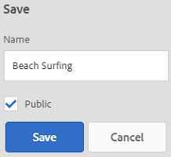

# Gerenciar coleções {#managing-collections}

| Versão | Link do artigo |
| -------- | ---------------------------- |
| AEM as a Cloud Service | [Clique aqui](https://experienceleague.adobe.com/docs/experience-manager-cloud-service/content/assets/manage/manage-collections.html?lang=en) |
| AEM 6.5 | Este artigo |
| AEM 6.4 | [Clique aqui](https://experienceleague.adobe.com/docs/experience-manager-64/assets/managing/managing-collections-touch-ui.html?lang=en) |

Uma coleção é um conjunto de ativos no [!DNL Adobe Experience Manager Assets]. Use coleções para compartilhar ativos entre usuários. O conjunto pode ser uma coleção estática ou dinâmica baseada em resultados de pesquisa.

Diferente de pastas, uma coleção pode incluir ativos de locais diferentes. Você pode compartilhar coleções com vários usuários aos quais são atribuídos diferentes níveis de privilégios, incluindo exibição, edição e assim por diante.

Você pode compartilhar várias coleções com um usuário. Cada coleção contém referências a ativos. A integridade referencial dos ativos é mantida entre as coleções.

As coleções são dos seguintes tipos, com base na maneira como coletam ativos:

* Uma coleção que contém uma lista de referência estática de ativos, pastas e outras coleções.

* Uma coleção inteligente que inclui dinamicamente ativos com base em critérios de pesquisa.

## Acesse o console Coleções {#navigating-the-collections-console}

Para abrir o **[!UICONTROL Coleções]** no [!DNL Experience Manager] interface, vá para **[!UICONTROL Ativos]** > **[!UICONTROL Coleções]**.

## Criar uma coleção {#creating-a-collection}

Você pode criar uma coleção com [referências estáticas](#creating-a-collection-with-static-references) ou com base em [filtro baseado em critérios de pesquisa](#creating-a-smart-collection). Você também pode criar uma coleção de um lightbox.

### Criar uma coleção com referências estáticas {#creating-a-collection-with-static-references}

Você pode criar uma coleção com referências estáticas, por exemplo, uma coleção com referências a ativos, pastas, coleções, conjuntos de rotação e conjuntos de imagens.

1. Navegue até o **[!UICONTROL Coleções]** console.
1. Na barra de ferramentas, clique em **[!UICONTROL Criar]**.
1. No **[!UICONTROL Criar coleção]** , insira um título e uma descrição opcional para a coleção.
1. Adicione membros à coleção e atribua as permissões apropriadas. Como alternativa, selecione **[!UICONTROL Coleção pública]** para permitir que todos os usuários acessem a coleção.

   >[!NOTE]
   >
   >Para permitir que os membros compartilhem coleções com outros usuários, forneça a variável `dam-users` permissões de leitura de grupo no caminho `home/users`. Conceder permissão aos usuários em `/content/dam/collections` local para permitir que os usuários visualizem as Coleções em listas pop-up. Como alternativa, faça do usuário parte de `dam-users` grupo.

1. (Opcional) Adicione uma imagem em miniatura para a coleção.
1. Clique em **[!UICONTROL Criar]** e, em seguida, clique em **[!UICONTROL OK]** para fechar a caixa de diálogo. Uma coleção com o título e as propriedades especificadas é aberta no console Coleções.

   >[!NOTE]
   >
   >[!DNL Experience Manager Assets] permite criar tarefas de revisão para uma coleção semelhante à forma como você cria tarefas de revisão para uma pasta de ativos.

   Para adicionar ativos à coleção, navegue até o [!DNL Assets] interface do usuário. Para obter detalhes, consulte [Adicionar ativos a uma coleção](#adding-assets-to-a-collection).

### Criar coleções usando o dropzone {#create-collections-using-dropzone}

Você pode arrastar ativos da [!DNL Assets] interface do usuário para uma coleção. Você também pode criar uma cópia de uma coleção e arrastar os ativos para lá.

1. No [!DNL Assets] na interface do usuário, selecione os ativos que deseja adicionar a uma coleção.
1. Arraste os ativos para a **[!UICONTROL Quebra na coleção]** zona. Como alternativa, clique em **[!UICONTROL Para Coleção]** na barra de ferramentas.

   

1. No **[!UICONTROL Adicionar à coleção]** página, clique em **[!UICONTROL Criar coleção]** na barra de ferramentas.

   Se desejar adicionar os ativos a uma coleção existente, selecione-a na página e clique em **[!UICONTROL Adicionar]**. Por padrão, a coleção atualizada mais recentemente é selecionada.

1. Na caixa de diálogo **[!UICONTROL Criar nova coleção]**, especifique o nome da coleção. Se quiser que a coleção seja acessível a todos os usuários, selecione **[!UICONTROL Coleção pública]**.
1. Clique em **[!UICONTROL Continuar]** para criar a coleção.

### Criar uma coleção inteligente {#creating-a-smart-collection}

Uma coleção inteligente usa critérios de pesquisa para preencher dinamicamente ativos. Você pode criar uma Coleção inteligente usando somente arquivos e não pastas ou arquivos e pastas.

Para criar uma coleção inteligente, siga as etapas:

1. Navegue até o [!DNL Assets] interface do usuário e clique em pesquisar.

1. Digite a palavra-chave de pesquisa na caixa Omnisearch e selecione `Enter`. Abra o painel Filtros e aplique um filtro de pesquisa.

1. No **[!UICONTROL Arquivos e pastas]** lista, selecione **[!UICONTROL Arquivos]**.

   

1. Clique em **[!UICONTROL Salvar coleção inteligente]**.

1. Especifique um nome para a coleção. Selecionar **[!UICONTROL Público]** para adicionar o grupo Usuários de DAM com a função Visualizador à coleção inteligente.

   

   >[!NOTE]
   >
   >Se você selecionar **[!UICONTROL Público]**, a coleção inteligente ficará disponível para todos com a função de proprietário depois de criá-la. Se você cancelar a **[!UICONTROL Público]** , o grupo de usuários do DAM não está mais associado à coleção inteligente.

1. Clique em **[!UICONTROL Salvar]** para criar a coleção inteligente e fechar a caixa de mensagem para concluir o processo.

   A nova coleção inteligente também é adicionada à lista **[!UICONTROL Pesquisas salvas.]**

   

   O rótulo da **[!UICONTROL Criar seleção inteligente]** a opção muda para **[!UICONTROL Editar seleção inteligente]**. Para editar as configurações da coleção inteligente, selecione **[!UICONTROL Arquivos]** na lista **[!UICONTROL Arquivos e pastas]**. Clique no botão **[!UICONTROL Editar seleção inteligente]**  opção.

## Adicionar ativos a uma coleção {#adding-assets-to-a-collection}

Você pode adicionar ativos a uma coleção que contém uma lista de ativos ou pastas referenciados. As coleções inteligentes usam um query de pesquisa para preencher ativos. Portanto, referências estáticas a ativos e pastas não se aplicam a elas.

1. No [!DNL A]define a interface do usuário, selecione o ativo e clique em **[!UICONTROL Para Coleção]**  na barra de ferramentas.
Como alternativa, você pode arrastar o ativo para a **[!UICONTROL Quebra na coleção]** na interface. Adicione os ativos quando o rótulo da região for alterado para **[!UICONTROL Soltar para adicionar]**.

1. No **[!UICONTROL Adicionar à coleção]** selecione a coleção à qual deseja adicionar o ativo.

1. Clique em **[!UICONTROL Adicionar]** e então feche a mensagem de confirmação. O ativo é adicionado à coleção.

## Editar uma coleção inteligente {#editing-a-smart-collection}

As coleções inteligentes são criadas salvando uma pesquisa para que você possa alterar seu conteúdo modificando os parâmetros de pesquisa do [pesquisa salva](#saved-searches).

1. No [!DNL Assets] interface do usuário, clique na opção de pesquisa  na barra de ferramentas.
1. Com o cursor na caixa Omnisearch, selecione o `Return` chave.
1. No [!DNL Experience Manager] abra o painel Filtros .
1. Na lista **[!UICONTROL Pesquisas salvas]**, selecione a coleção inteligente que deseja modificar. O painel Pesquisar exibe os filtros configurados para a pesquisa salva.

   

1. No **[!UICONTROL Arquivos e pastas]** lista, selecione **[!UICONTROL Arquivos]**.
1. Modifique um ou mais filtros, conforme necessário. Clique em **[!UICONTROL Editar coleção inteligente]**.

   Também é possível editar o nome da coleção inteligente.

   

1. Clique em **[!UICONTROL Salvar]**. O **[!UICONTROL Editar coleção inteligente]** será exibida.
1. Clique em **[!UICONTROL Substituir]** para substituir a coleção inteligente original pela coleção editada. Como alternativa, selecione **[!UICONTROL Salvar como]** para salvar a coleção editada separadamente.
1. Na caixa de diálogo de confirmação, clique em **[!UICONTROL Salvar]** para concluir o processo.

## Exibir e editar metadados da coleção {#view-edit-collection-metadata}

Os metadados da coleção incluem dados sobre a coleção, incluindo quaisquer tags adicionadas.

1. No [!UICONTROL Coleções] , selecione uma coleção e clique em **[!UICONTROL Propriedades]** na barra de ferramentas.
1. Na página **[!UICONTROL Metadados da coleção]**, visualize os metadados da coleção nas guias **[!UICONTROL Básico]** e **[!UICONTROL Avançado]**.
1. Modifique os metadados, conforme necessário. Para salvar as alterações, clique em **[!UICONTROL Salvar e fechar]** na barra de ferramentas.

## Editar metadados de várias coleções em massa {#editing-collection-metadata-in-bulk}

Você pode editar os metadados de várias coleções simultaneamente. Essa funcionalidade ajuda você a replicar rapidamente metadados comuns em várias coleções.

1. No console Coleções , selecione duas ou mais coleções.
1. Na barra de ferramentas, clique em **[!UICONTROL Propriedades]**.
1. Na página **[!UICONTROL Metadados da coleção]**, edite os metadados nas guias **[!UICONTROL Básico]** e **[!UICONTROL Avançado]**, conforme necessário.
1. Para exibir as propriedades de metadados de uma coleção específica, cancele a seleção das coleções restantes na lista de coleções. Os campos do editor de metadados são preenchidos com os metadados para a coleção específica.

   >[!NOTE]
   >
   >* No [!UICONTROL Propriedades] você pode remover coleções da lista de coleções cancelando a seleção. A lista de coleções tem todas as coleções selecionadas por padrão. [!DNL Experience Manager] não atualiza os metadados das coleções removidas.
   >* Na parte superior da lista, marque a caixa de seleção ao lado de **[!UICONTROL Título]** para alternar entre selecionar as coleções e limpar a lista.

1. Clique em **[!UICONTROL Salvar e fechar]** na barra de ferramentas e feche a caixa de diálogo de confirmação.
1. Para anexar os novos metadados aos existentes, selecione **[!UICONTROL Modo anexar]**. Se você não selecionar essa opção, os novos metadados substituirão os existentes nos campos. Clique em **[!UICONTROL Enviar]**.

   >[!NOTE]
   >
   >Os metadados adicionados às coleções selecionadas substituem os metadados anteriores para essas coleções. Use o [!UICONTROL Modo anexar] para adicionar novos valores aos metadados existentes nos campos que podem conter vários valores. Os campos de valor único são sempre substituídos. Qualquer tag adicionada na [!UICONTROL Tags] , são anexadas à lista existente de tags nos metadados.

Como personalizar os metadados [!UICONTROL Propriedades] , incluindo adicionar, modificar, excluir propriedades de metadados, use o editor de Esquema .

>[!TIP]
>
>O método de edição em massa funciona para ativos disponíveis em uma coleção. Para os ativos que estão disponíveis em pastas ou que correspondem a um critério comum, é possível [atualização em massa dos metadados após a pesquisa](/help/assets/search-assets.md#metadataupdates).

## Pesquisar coleções {#searching-collections}

Você pode pesquisar coleções no console Coleções. Ao pesquisar com palavras-chave na caixa Omnisearch, [!DNL Assets] pesquisa nomes de coleção, metadados e as tags adicionadas às coleções.

Se você pesquisar por coleções do nível superior, somente coleções individuais serão retornadas nos resultados da pesquisa. [!DNL Assets] As pastas ou nas coleções são excluídas. Em todos os outros casos (por exemplo, em uma coleção individual ou em uma hierarquia de pasta), todos os ativos, pastas e coleções relevantes são retornados.

## Pesquisar em coleções {#searching-within-collections}

No console Coleções , clique em uma coleção para abri-la.

Em uma coleção, [!DNL Experience Manager] a pesquisa é restrita aos ativos (e suas tags e metadados) dentro da coleção que você está visualizando. Ao pesquisar em uma pasta, todos os ativos e pastas filhas correspondentes na pasta atual são retornados. Ao pesquisar em uma coleção, somente os ativos, pastas e outras coleções correspondentes que são membros diretos da coleção são retornados.

## Editar configurações de coleção {#editing-collection-settings}

É possível editar configurações da coleção, como título e descrição, ou adicionar membros a uma coleção.

1. Selecione uma coleção e clique em **[!UICONTROL Configurações]** na barra de ferramentas. Como alternativa, use o **[!UICONTROL Configurações]** ação rápida da miniatura da coleção.
1. Modifique as configurações da coleção na página **[!UICONTROL Configurações da coleção]**. Por exemplo, modifique o título da coleção, as descrições, os membros e as permissões, conforme discutido em [Adicionar coleções](#creating-a-collection).

1. Para salvar as alterações, clique em **[!UICONTROL Salvar]**.

## Excluir uma coleção {#deleting-a-collection}

1. No console Coleções , selecione uma ou mais coleções e clique em excluir na barra de ferramentas.

1. Na caixa de diálogo , clique em **[!UICONTROL Excluir]** para confirmar a ação de exclusão.

   >[!NOTE]
   >
   >Também é possível excluir coleções inteligentes por [excluindo pesquisas salvas](#saved-searches).

## Baixar uma coleção {#downloading-a-collection}

Ao baixar uma coleção, toda a hierarquia de ativos na coleção é baixada, incluindo pastas e coleções secundárias.

1. No console Coleções , selecione uma ou mais coleções para baixar.
1. Na barra de ferramentas, clique em **[!UICONTROL Baixar]**.
1. No **[!UICONTROL Baixar]** , clique em **[!UICONTROL Baixar]**. Se desejar baixar as representações dos ativos na coleção, selecione **[!UICONTROL Representações]**. Selecione o **[!UICONTROL Email]** para enviar uma notificação por email ao proprietário da coleção.

   Ao selecionar uma coleção para baixar, a hierarquia completa da pasta na coleção é baixada. Para incluir cada coleção que você baixar (incluindo ativos em coleções secundárias aninhadas sob a coleção pai) em uma pasta individual, selecione **[!UICONTROL Criar uma pasta separada para cada ativo]**.

## Criar coleções aninhadas {#creating-nested-collections}

Você pode adicionar uma coleção a outra coleção, criando uma coleção aninhada.

1. No console Coleções , selecione a coleção ou o grupo de coleções desejado e clique em **[!UICONTROL Para Coleção]** na barra de ferramentas.

1. No **[!UICONTROL Adicionar à coleção]** selecione a coleção na qual deseja adicionar a coleção.

   >[!NOTE]
   >
   >A coleção atualizada mais recentemente é selecionada por padrão no **[!UICONTROL Adicionar à coleção]** página.

1. Clique em **[!UICONTROL Adicionar]**. Uma mensagem confirma que a coleção é adicionada à coleção de público-alvo na **[!UICONTROL Selecionar destino]** página. Feche a mensagem para concluir o processo.

>[!NOTE]
>
>Coleções inteligentes não podem ser aninhadas. Em outras palavras, as coleções inteligentes não podem conter nenhuma outra coleção.

## Pesquisas salvas {#saved-searches}

No [!DNL Assets] na interface do usuário, você pode pesquisar ou filtrar ativos com base em determinadas regras, critérios de pesquisa ou aspectos de pesquisa personalizados. Se salvá-los como **[!UICONTROL Pesquisas salvas]**, você poderá acessá-los posteriormente na lista **[!UICONTROL Pesquisas salvas]** do painel Filtro. Criar uma pesquisa salva também cria uma coleção inteligente.

Pesquisas salvas são criadas quando você cria uma coleção inteligente. As coleções inteligentes são adicionadas automaticamente à lista **[!UICONTROL Pesquisas salvas]**. O [!UICONTROL Pesquisas salvas] A consulta para a coleção é salva no `dam:query` no CRXDE no local relativo `/content/dam/collections/`. Não há limites para as pesquisas que você pode salvar e nas pesquisas salvas exibidas na lista.

>[!NOTE]
>
>Você pode compartilhar coleções inteligentes da mesma forma que compartilha coleções estáticas.

Editar pesquisas salvas é o mesmo que editar coleções inteligentes. Para obter detalhes, consulte [editar uma coleção inteligente](#editing-a-smart-collection).

Para excluir pesquisas salvas, siga estas etapas:

1. No [!DNL Assets] interface do usuário, clique em pesquisar .
1. Com o cursor no campo Omnisearch , selecione o `Return` chave.
1. No [!DNL Experience Manager] abra o painel Filtros .
1. No **[!UICONTROL Pesquisas salvas]** listar, clique em **[!UICONTROL Excluir]** ao lado da coleção inteligente que deseja excluir.

   

1. Na caixa de diálogo , clique em **[!UICONTROL Excluir]** para excluir a pesquisa salva.

## Executar um fluxo de trabalho em uma coleção {#running-a-workflow-on-a-collection}

Você pode executar um fluxo de trabalho para os ativos em uma coleção. Se a coleção contiver coleções aninhadas, o fluxo de trabalho também será executado nos ativos dentro das coleções aninhadas. No entanto, se a coleção e a coleção aninhada contiverem ativos duplicados, o fluxo de trabalho será executado apenas uma vez para esses ativos.

1. Abrir **[!UICONTROL Ativos]** > **[!UICONTROL Coleções]**. Para executar um workflow em uma coleção específica, selecione-o.
1. Abrir **[!UICONTROL Linha do tempo]** trilho. Clique em  e clique em **[!UICONTROL Iniciar fluxo de trabalho]**.
1. Na seção **[!UICONTROL Iniciar fluxo de trabalho]**, selecione um modelo de fluxo de trabalho da lista. Por exemplo, selecione o modelo **[!UICONTROL Atualizar ativo DAM]**.
1. Insira um título para o fluxo de trabalho e clique em **[!UICONTROL Iniciar]**.
1. Na caixa de diálogo , clique em **[!UICONTROL Continue]**. O fluxo de trabalho processa todos os ativos na coleção selecionada.

>[!MORELIKETHIS]
>
>* [Configurar notificações por email do Experience Manager Assets](/help/sites-administering/notification.md#assetsconfig)
>* [Criar uma tarefa de revisão para Coleções](bulk-approval.md)

