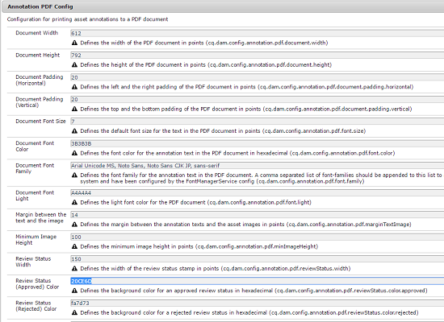
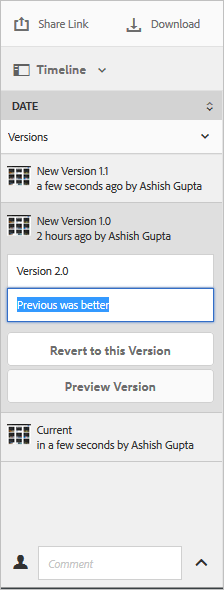

# Gerenciar seus ativos digitais {#managing-assets-with-the-touch-optimized-ui}

Este artigo descreve como gerenciar e editar ativos nos ativos Adobe Experience Manager (AEM). Para começar a usar a interface do usuário e o layout, consulte Manuseio [básico da interface do usuário](/help/sites-authoring/basic-handling.md)de toque. Para gerenciar fragmentos de conteúdo, consulte [Gerenciamento de ativos de fragmentos](content-fragments-managing.md) de conteúdo.

## Criar pastas {#creating-folders}

Ao organizar uma coleção de ativos, por exemplo, todas as `Nature` imagens, você pode criar pastas para mantê-las juntas. Você pode usar pastas para categorizar e organizar seus ativos. Os ativos AEM não exigem que você organize ativos em pastas para trabalhar melhor.

>[!NOTE]
>
>O compartilhamento de uma pasta Ativos do tipo `sling:OrderedFolder`não é suportado ao compartilhar com a Marketing Cloud. Se desejar compartilhar uma pasta, não selecione [!UICONTROL Solicitado] ao criar uma pasta.

1. Navegue até o local na pasta de ativos digitais onde deseja criar uma nova pasta. No menu, clique em **[!UICONTROL Criar]**. Selecione **[!UICONTROL Nova pasta]**.
1. No campo **[!UICONTROL Título]** , forneça um nome de pasta. Por padrão, o DAM usa o título fornecido como o nome da pasta. Depois que a pasta for criada, você poderá substituir o padrão e especificar outro nome de pasta.
1. Clique em **[!UICONTROL Criar]**. Sua pasta é exibida na pasta de ativos digitais.

Os seguintes caracteres (lista separada por espaços de) não são suportados:

* Um nome de arquivo de ativo não pode conter nenhum destes caracteres: `* / : [ \\ ] | # % { } ? &`
* O nome da pasta de ativos não pode conter nenhum destes caracteres: `* / : [ \\ ] | # % { } ? \" . ^ ; + & \t`

## Upload assets {#uploading-assets}

<!-- TBD the following:
Move this section into a new article. CQDOC-14874 ticket is created for this.
In this complete article, replace emphasis with UICONTROL where appropriate.
-->

Você pode fazer upload de vários tipos de ativos (incluindo imagens, arquivos PDF, arquivos RAW etc.) da sua pasta local ou de uma unidade de rede para os ativos AEM.

>[!NOTE]
>
>No modo Mídia dinâmica - Scene7, você só pode fazer upload de ativos com tamanhos de arquivo de 2 GB ou menos.

Você pode optar por carregar ativos para pastas com ou sem um perfil de processamento atribuído a eles.

Para pastas com um perfil de processamento atribuído, o nome do perfil aparece na miniatura na exibição de cartão. Na exibição de lista, o nome do perfil aparece na coluna Perfil **de** processamento. Consulte Perfis [de processamento](/help/assets/processing-profiles.md).

Antes de fazer upload de um ativo, verifique se ele está em um [formato](/help/assets/assets-formats.md) compatível com os ativos AEM.

1. Na interface do usuário do Assets, navegue até o local onde deseja adicionar ativos digitais.
1. Para carregar os ativos, execute um dos procedimentos a seguir:

   * Na barra de ferramentas, toque no ícone **[!UICONTROL Criar]** . Em seguida, no menu, toque em **[!UICONTROL Arquivos]**. Você pode renomear o arquivo na caixa de diálogo apresentada, se necessário.
   * Em um navegador compatível com HTML5, arraste os ativos diretamente na interface do usuário dos Ativos. A caixa de diálogo para renomear o arquivo não é exibida.
   

   Para selecionar vários arquivos, pressione a tecla Ctrl ou Command e selecione os ativos na caixa de diálogo do seletor de arquivos. Ao usar um iPad, você pode selecionar apenas um arquivo de cada vez.

   Você pode pausar o upload de ativos grandes (maior que 500 MB) e retomá-lo posteriormente a partir da mesma página. Toque no ícone **[!UICONTROL Pausar]** ao lado da barra de progresso que aparece quando um upload é iniciado.

   

   O tamanho acima do qual um ativo é considerado um grande ativo é configurável. Por exemplo, você pode configurar o sistema para considerar ativos acima de 1000 MB (em vez de 500 MB) como ativos grandes. Nesse caso, **[!UICONTROL Pausar]** é exibido na barra de progresso quando ativos de tamanho maior que 1000 MB são carregados.

   O botão Pausar não mostra se um arquivo maior que 1000 MB é carregado com um arquivo menor que 1000 MB. No entanto, se você cancelar o carregamento de arquivo com menos de 1000 MB, o botão **[!UICONTROL Pausar]** será exibido.

   Para modificar o limite de tamanho, configure a `chunkUploadMinFileSize` propriedade do `fileupload`nó no repositório CRX.

   Quando você clica no ícone **[!UICONTROL Pausar]** , ele alterna para um ícone **[!UICONTROL Reproduzir]** . Para retomar o carregamento, clique no ícone **[!UICONTROL Reproduzir]** .

   

   Para cancelar um upload em andamento, clique em Fechar (`X`) ao lado da barra de progresso. Ao cancelar a operação de upload, os ativos AEM excluem a parte parcialmente carregada do ativo.

   A capacidade de retomar o carregamento é especialmente útil em cenários de largura de banda baixa e falhas de rede, onde demora muito para carregar um grande ativo. Você pode pausar a operação de upload e continuar mais tarde quando a situação melhorar. Ao retomar, o upload é iniciado a partir do ponto em que você o pausou.

   Durante a operação de upload, o AEM salva as partes do ativo que estão sendo carregadas como partes de dados no repositório CRX. Quando o upload é concluído, o AEM consolida esses blocos em um único bloco de dados no repositório.

   Para configurar a tarefa de limpeza para as tarefas de carregamento de segmentos não concluídas, vá para `https://[aem_server]:[port]/system/console/configMgr/org.apache.sling.servlets.post.impl.helper.ChunkCleanUpTask`.

   Se você carregar um ativo com o mesmo nome de um ativo já disponível no local em que você está fazendo upload do ativo, uma caixa de diálogo de aviso será exibida.

   Você pode optar por substituir um ativo existente, criar outra versão ou manter ambos renomeando o novo ativo que é carregado. Se você substituir um ativo existente, os metadados do ativo e quaisquer modificações anteriores (por exemplo, anotação ou recorte) que você fez no ativo existente serão excluídos. Se você optar por manter ambos os ativos, o novo ativo será renomeado com o número `1` anexado ao seu nome.

   

   >[!NOTE]
   >
   >Quando você seleciona **[!UICONTROL Substituir]** na caixa de diálogo Conflito [!UICONTROL de] nomes, a ID do ativo é regenerada para o novo ativo. Essa ID é diferente da ID do ativo anterior.
   >
   >Se o Asset Insights estiver habilitado para rastrear impressões/cliques com o Adobe Analytics, a ID de ativo regenerada invalida os dados capturados para o ativo no Analytics.

   Se o ativo carregado existir nos ativos AEM, a caixa de diálogo **[!UICONTROL Duplicatas detectadas]** avisará que você está tentando carregar um ativo duplicado. A caixa de diálogo é exibida somente se o valor de `SHA 1` soma de verificação do binário do ativo existente corresponder ao valor de soma de verificação do ativo que você carrega. Neste caso, os nomes dos ativos não importam.

   >[!NOTE]
   >
   >A caixa de diálogo [!UICONTROL Duplicatas detectadas] é exibida somente quando o recurso de detecção de duplicatas está ativado. Para ativar o recurso de detecção de duplicatas, consulte [Ativar detecção](/help/assets/duplicate-detection.md)de duplicatas.

   

   Para manter o ativo duplicado nos ativos AEM, toque/clique em **[!UICONTROL Manter]**. Para excluir o ativo duplicado carregado, toque/clique em **[!UICONTROL Excluir]**.

   Os ativos AEM impedem que você carregue ativos com os caracteres proibidos em seus nomes de arquivo. Se você tentar carregar um ativo com um nome de arquivo contendo um caractere não permitido ou mais, os ativos AEM exibirão uma mensagem de aviso e pararão o upload até que você remova esses caracteres ou faça upload com um nome permitido.

   Para adequar-se a convenções de nomenclatura de arquivos específicas para sua organização, a caixa de diálogo [!UICONTROL Carregar ativos] permite especificar nomes longos para os arquivos carregados.

   No entanto, os seguintes caracteres (lista separada por espaços de) não são suportados:

   * o nome do arquivo de ativo não deve conter `* / : [ \\ ] | # % { } ? &`
   * o nome da pasta de ativos não deve conter `* / : [ \\ ] | # % { } ? \" . ^ ; + & \t`
   

   Além disso, a interface do usuário Ativos exibe o ativo mais recente que você carregou ou a pasta que criou primeiro.

   Se você cancelar a operação de upload antes que os arquivos sejam carregados, o AEM Assets interromperá o upload do arquivo atual e atualizará o conteúdo. No entanto, os arquivos que já foram carregados não são excluídos.

   A caixa de diálogo de andamento do upload nos ativos AEM exibe a contagem de arquivos carregados com êxito e os arquivos que não foram carregados.

### Carregamentos em série {#serialuploads}

Fazer upload de diversos ativos em massa consome recursos de E/S significativos, o que pode afetar negativamente o desempenho da instância do AEM Assets. Em particular, se você tiver uma conexão lenta com a Internet, o tempo de carregamento aumenta drasticamente devido a um pico na E/S do disco. Além disso, seu navegador da Web pode introduzir restrições adicionais ao número de solicitações POST que os ativos AEM podem processar para uploads de ativos simultâneos. Como resultado, a operação de upload falha ou termina prematuramente. Em outras palavras, os ativos do AEM podem perder alguns arquivos ao assimilar vários arquivos ou não assimilar nenhum arquivo.

Para superar essa situação, o AEM Assets ingere um ativo por vez (upload em série) durante uma operação de upload em massa, em vez de ingressar simultaneamente todos os ativos.

Por padrão, o carregamento em série de ativos é ativado. Para desativar o recurso e permitir o upload simultâneo, sobreponha o `fileupload` nó no Crx-de e defina o valor da `parallelUploads` propriedade como `true`.

### Fazer upload de ativos usando FTP {#uploading-assets-using-ftp}

O Dynamic Media permite o carregamento em lote de ativos por meio do servidor FTP. Se você pretende carregar ativos grandes (> 1 GB) ou pastas e subpastas inteiras, deve usar o FTP. Você pode até mesmo configurar o upload do FTP para que ocorra de forma recorrente.

>[!NOTE]
>
>No modo Mídia dinâmica - Scene7, você só pode fazer upload de ativos com tamanhos de arquivo de 2 GB ou menos.

>[!NOTE]
>
>Para carregar ativos via FTP no modo Dynamic Media - Scene7, instale o Feature Pack 18912 nas instâncias do autor de AEM. Entre em contato com o Atendimento [ao cliente da](https://helpx.adobe.com/contact/enterprise-support.ec.html) Adobe para obter acesso ao FP-18912 e concluir a configuração da sua conta FTP. Para obter mais informações, consulte [Instalação do pacote de recursos 18912 para migração](/help/assets/bulk-ingest-migrate.md)de ativos em massa.
>
>Se você usar o FTP para fazer upload de ativos, as configurações de upload especificadas no AEM serão ignoradas. Em vez disso, as regras de processamento de arquivos, conforme definidas no Dynamic Media Classic, são usadas.

**Para fazer upload de ativos usando FTP**

1. Usando sua escolha de cliente FTP, faça logon no servidor FTP usando o nome de usuário e a senha FTP recebidos do email de provisionamento. No cliente FTP, carregue arquivos ou pastas no servidor FTP.
1. [Faça logon no Dynamic Media Classic](https://www.adobe.com/marketing-cloud/experience-manager/scene7-login.html) usando as credenciais recebidas do email de provisionamento. Na barra de navegação global, toque em **[!UICONTROL Carregar]**.

1. Na página Carregar, perto do canto superior esquerdo, toque na guia **[!UICONTROL Via FTP]** .
1. No lado esquerdo da página, escolha uma pasta FTP da qual fazer upload de arquivos; no lado direito da página, escolha uma pasta de destino.
1. Perto do canto inferior direito da página, clique em Opções **[!UICONTROL de]** trabalho e defina as opções desejadas com base nos ativos na pasta selecionada.

   Consulte Opções [de](#upload-job-options)upload de tarefa.

   >[!NOTE]
   >
   >Ao carregar ativos via FTP, as opções de trabalho de upload definidas no Dynamic Media Classic (S7) têm prioridade sobre os parâmetros de processamento de ativos definidos no AEM.

1. No canto inferior direito da caixa de diálogo Carregar opções de trabalho, toque em **[!UICONTROL Salvar]**.
1. No canto inferior direito da página Carregar, toque em **[!UICONTROL Enviar upload]**.

   Para exibir o progresso do upload, na barra de navegação global, toque em **[!UICONTROL Tarefas]**. A página Tarefas exibe o progresso do upload. Você pode continuar trabalhando no AEM e voltar para a página de Tarefas no Dynamic Media Classic a qualquer momento para revisar um trabalho em andamento.
Para cancelar um trabalho de upload em andamento, toque em **[!UICONTROL Cancelar]** ao lado da Duração.

#### Carregar opções de trabalho {#upload-job-options}

| Opção Carregar | Subopção | Descrição |
|---|---|---|
| Nome da tarefa |  | O nome padrão pré-preenchido no campo de texto inclui a parte digitada pelo usuário do nome e o carimbo de data e hora. Você pode usar o nome padrão ou digitar o nome de sua própria criação para este trabalho de upload.  O trabalho e outros trabalhos de upload e publicação são registrados na página Tarefas, onde você pode verificar o status dos trabalhos. |
| Publicar após carregar |  | Publica automaticamente os ativos que você carrega. |
| Substituir em qualquer pasta, o mesmo nome do ativo base, independentemente da extensão |  | Selecione essa opção se desejar que os arquivos carregados substituam os arquivos existentes pelos mesmos nomes. O nome dessa opção pode ser diferente, dependendo das configurações em Configuração **[!UICONTROL do]** aplicativo > Configurações **** gerais > **[!UICONTROL Carregar no aplicativo]** > **[!UICONTROL Substituir imagens]**. |
| Descompacte arquivos Zip ou Tar no upload |  |  |
| Opções de trabalho |  | Toque/ clique em Opções **[!UICONTROL de]** trabalho para abrir a caixa de diálogo Opções [!UICONTROL de trabalho de] upload e escolha as opções que afetam todo o trabalho de upload. Essas opções são as mesmas para todos os tipos de arquivos. Você pode escolher as opções padrão para fazer upload de arquivos a partir da página Configurações gerais do aplicativo. Para abrir esta página, escolha **[!UICONTROL Configuração]** > Configuração **** do aplicativo. Toque no botão Opções **[!UICONTROL de upload]** padrão para abrir a caixa de diálogo Opções [!UICONTROL de] upload de trabalho. |
|  | Quando | Selecione Uma vez ou Recorrente. Para definir um trabalho recorrente, escolha uma opção Repetir (Diário, Semanal, Mensal ou Personalizado) para especificar quando você deseja que o trabalho de upload do FTP seja repetido. Em seguida, especifique as opções de agendamento conforme necessário. |
|  | Incluir subpastas | Carregue todas as subpastas dentro da pasta que você deseja carregar. Os nomes da pasta e suas subpastas carregadas são inseridos automaticamente nos ativos AEM. |
|  | Opções de corte | Para recortar manualmente das laterais de uma imagem, selecione o menu Recortar e escolha Manual. Em seguida, insira o número de pixels a serem cortados de qualquer lado ou de cada lado da imagem. A quantidade de imagens cortadas depende da configuração ppi (pixels por polegada) no arquivo de imagem. Por exemplo, se a imagem exibir 150 ppi e você digitar 75 nas caixas de texto Superior, Direita, Inferior e Esquerda, meia polegada será cortada de cada lado.  Para recortar automaticamente pixels de espaço em branco de uma imagem, abra o menu Recortar, escolha Manual e insira medidas de pixel nos campos Superior, Direita, Inferior e Esquerda para recortar das laterais. Você também pode escolher Aparar no menu Cortar e escolher estas opções:  **Aparar com base em** <ul><li>**Cor** - Escolha a opção Cor. Em seguida, selecione o menu Canto e escolha o canto da imagem com a cor que melhor representa a cor do espaço em branco que deseja cortar.</li><li>**Transparência** - Escolha a opção Transparência.  **Tolerância** - Arraste o controle deslizante para especificar uma tolerância de 0 a 1.Para aparar com base na cor, especifique 0 para recortar pixels somente se eles corresponderem exatamente à cor selecionada no canto da imagem. Números próximos a 1 permitem mais diferenças de cor. Para aparar com base na transparência, especifique 0 para cortar pixels somente se eles forem transparentes. Números mais próximos a 1 permitem mais transparência.</li></ul> Observe que essas opções de corte não são destrutivas. |
|  | Opções de perfil de cor | Escolha uma conversão de cores ao criar arquivos otimizados usados para entrega:<ul><li>Preservação de cor padrão: Mantém as cores da imagem de origem sempre que as imagens contêm informações de espaço de cor; não há conversão de cores. Quase todas as imagens hoje têm o perfil de cor apropriado já incorporado. No entanto, se uma imagem de origem CMYK não contiver um perfil de cor incorporado, as cores serão convertidas em espaço de cor sRGB (azul verde padrão). sRGB é o espaço de cores recomendado para exibir imagens em páginas da Web.</li><li>Manter espaço de cor original: Mantém as cores originais sem qualquer conversão de cores no momento. Para imagens sem um perfil de cor incorporado, qualquer conversão de cor é feita usando os perfis de cor padrão definidos nas configurações de Publicação. Os perfis de cores podem não estar alinhados com a cor nos arquivos criados com essa opção. Portanto, é recomendável usar a opção Preservação de cor padrão.</li><li>Os menus Personalizado de > Para  abre para que você possa escolher um espaço de cores Converter de e Converter em. Essa opção avançada substitui todas as informações de cores incorporadas no arquivo de origem. Selecione essa opção quando todas as imagens que você está enviando contiverem dados de perfil de cor incorretos ou ausentes.</li></ul> |
|  | Opções de edição de imagens | É possível preservar as máscaras de recorte em imagens e escolher um perfil de cor.  Consulte [Configuração de opções de edição de imagens no upload](#setting-image-editing-options-at-upload). |
|  | Opções de Postscript | Você pode rasterizar arquivos PostScript®, cortar arquivos, manter planos de fundo transparentes, escolher uma resolução e escolher um espaço de cor.  Consulte [Configuração de opções](#setting-postscript-and-illustrator-upload-options)de upload do PostScript e do Illustrator. |
|  | Opções do Photoshop | Você pode criar modelos a partir de arquivos do Adobe® Photoshop®, manter camadas, especificar como as camadas são nomeadas, extrair texto e especificar como as imagens são ancoradas em modelos.  Observe que os modelos não são suportados no AEM.  Consulte [Configuração de opções](#setting-photoshop-upload-options)de upload do Photoshop. |
|  | Opções de PDF | Você pode rasterizar os arquivos, extrair palavras de pesquisa e links, gerar automaticamente um eCatalog, definir a resolução e escolher um espaço de cor.  Observe que o AEM não oferece suporte a eCatalogs.   Consulte [Configuração de opções](#setting-pdf-upload-options)de upload de PDF. |
|  | Opções do Illustrator | Você pode rasterizar arquivos do Adobe Illustrator®, manter planos de fundo transparentes, escolher uma resolução e escolher um espaço de cor.  Consulte [Configuração de opções](#setting-postscript-and-illustrator-upload-options)de upload do PostScript e do Illustrator. |
|  | Opções de vídeo | Você pode transcodificar um arquivo de vídeo escolhendo uma predefinição de vídeo.  Consulte [Configuração de opções](#setting-evideo-upload-options)de upload de eVideo. |
|  | Predefinições de Conjunto de Lotes | Para criar um Conjunto de imagens ou um Conjunto de rotação a partir dos arquivos carregados, clique na coluna Ativo da predefinição que deseja usar. É possível selecionar mais de uma predefinição. As predefinições são criadas na página Predefinições de configuração/conjunto de lotes do Dynamic Media Classic.  Consulte [Configuração de predefinições de conjuntos de lotes para gerar automaticamente conjuntos de imagens e conjuntos](config-dms7.md#creating-batch-set-presets-to-auto-generate-image-sets-and-spin-sets) de rotação para saber mais sobre como criar predefinições de conjuntos de lotes.  Consulte [Configuração de predefinições de conjuntos de lotes no upload](#setting-batch-set-presets-at-upload). |

#### Definir opções de edição de imagem no upload {#setting-image-editing-options-at-upload}

Ao carregar arquivos de imagem, incluindo arquivos AI, EPS e PSD, você pode realizar as seguintes ações de edição na caixa de diálogo Opções [!UICONTROL de trabalho de] upload:

* Recorte o espaço em branco da borda das imagens (consulte a descrição na tabela acima).
* Recorte manualmente das laterais das imagens (consulte a descrição na tabela acima).
* Escolha um perfil de cor (consulte a descrição da opção na tabela acima).
* Crie uma máscara a partir de um caminho de recorte.
* Nitidez de imagens com opções de máscara nítida
* Plano de fundo de separação

<!--
| Option | Sub-option | Description |
|---|---|---|
| Create Mask From Clipping Path | | Create a mask for the image based on its clipping path information. This option applies to images created with image-editing applications in which a clipping path was created. |
| Unsharp Masking | | Lets you fine-tune a sharpening filter effect on the final downsampled image, controlling the intensity of the effect, the radius of the effect (as measured in pixels), and a threshold of contrast that is ignored.  This effect uses the same options as Photoshop’s Unsharp Mask filter. Contrary to what the name suggests, Unsharp Mask is a sharpening filter. Under Unsharp Masking, set the options you want. Setting options are described in the following: |
| | Amount | Controls the amount of contrast that is applied to edge pixels.  Think of it as the intensity of the effect. The main difference between the amount values of Unsharp Mask in Dynamic Media and the amount values in Adobe Photoshop, is that Photoshop has an amount range of 1% to 500%. Whereas, in Dynamic Media, the value range is 0.0 to 5.0. A value of 5.0 is the rough equivalent of 500% in Photoshop; a value of 0.9 is the equivalent of 90%, and so on. |
| | Radius | Controls the radius of the effect. The value range is 0-250.  The effect is run on all pixels in an image and radiates out from all pixels in all directions. The radius is measured in pixels. For example, to get a similar sharpening effect for a 2000 x 2000 pixel image and 500 x 500 pixel image, you would set a radius of two pixels on the 2000 x 2000 pixel image and a radius value of one pixel on the 500 x 500 pixel image. A larger value is used for an image that has more pixels. |
| | Threshold | Threshold is a range of contrast that is ignored when the Unsharp Mask filter is applied. It is important so that no "noise" is introduced to an image when this filter is used. The value range is 0-255, which is the number of brightness steps in a grayscale image. 0=black, 128=50% gray and 255=white.  For example, a threshold value of 12 ignores slight variations is skin tone brightness to avoid adding noise, but still add edge contrast to areas such as where eyelashes meet skin.  For example, if you have a photo of someone’s face, the Unsharp Mask affects the parts of the image, such as where eyelashes and skin meet to create an obvious area of contrast, and the smooth skin itself. Even the smoothest skin exhibits subtle changes in brightness values. If you do not use a threshold value, the filter accentuates these subtle changes in skin pixels. In turn, a noisy and undesirable effect is created while contrast on the eyelashes is increased, enhancing sharpness.  To avoid this issue, a threshold value is introduced that tells the filter to ignore pixels that do not change contrast dramatically, like smooth skin.  In the zipper graphic shown earlier, notice the texture next to the zippers. Image noise is exhibited because the threshold values were too low to suppress the noise. |
| | Monochrome | Select to unsharp-mask image brightness (intensity).  Deselect to unsharp-mask each color component separately. |
| Knockout Background | | Automatically removes the background of an image when you upload it. This technique is useful to draw attention to a particular object and make it stand out from a busy background. Select to enable or “turn on” the Knockout Background feature and the following sub-options: |
| | Corner | Required.  The corner of the image that is used to define the background color to knockout.  You can choose from **Upper Left**, **Bottom Left**, **Upper Right**, or **Bottom Right**. |
| | Fill Method | Required.  Controls pixel transparency from the Corner location that you set.  You can choose from the following fill methods: <ul><li>**Flood Fill** - turns all pixels transparent that match the Corner that you have specified and are connected to it.</li><li>**Match Pixel** - turns all matching pixels transparent, regardless of their location on the image.</li></ul> |
| | Tolerance | Optional.  Controls the allowable amount of variation in pixel color matching based on the Corner location that you set.  Use a value of 0.0 to match pixel colors exactly or, use a value of 1.0 to allow for the greatest variation. |
-->

#### Definir opções de upload do PostScript e do Illustrator {#setting-postscript-and-illustrator-upload-options}

Ao carregar arquivos de imagem PostScript (EPS) ou Illustrator (AI), você pode formatá-los de várias maneiras. Você pode rasterizar os arquivos, manter o plano de fundo transparente, escolher uma resolução e escolher um espaço de cor. As opções para a formatação de arquivos PostScript e Illustrator estão disponíveis na caixa de diálogo Opções [!UICONTROL de trabalho de] upload, em Opções  PostScript e Opções [!UICONTROL do]Illustrator.

| Opção | Subopção | Descrição |
|---|---|---|
| Processando |  | Escolha **[!UICONTROL Rasterizar]** para converter gráficos vetoriais no arquivo para o formato de bitmap. |
| Manter plano de fundo transparente na imagem renderizada |  | Manter a transparência em segundo plano do arquivo. |
| Resolução |  | Determina a configuração de resolução. Essa configuração determina quantos pixels são exibidos por polegada no arquivo. |
| Espaço de cor |  | Selecione o menu Espaço de cor e escolha entre as seguintes opções de espaço de cor: |
|  | Detectar automaticamente | Mantém o espaço de cores do arquivo. |
|  | Forçar como RGB | Converte para o espaço de cores RGB. |
|  | Forçar como CMYK | Converte para o espaço de cores CMYK. |
|  | Forçar como escala de cinza | Converte para o espaço de cores em tons de cinza. |

#### Definir opções de upload do Photoshop {#setting-photoshop-upload-options}

Os arquivos PSD (Photoshop Document) são usados com mais frequência para criar modelos de imagem. Ao carregar um arquivo PSD, você pode criar um modelo de imagem automaticamente a partir do arquivo (selecione a opção [!UICONTROL Criar modelo] na tela Carregar).

O Dynamic Media cria várias imagens de um arquivo PSD com camadas se você usar o arquivo para criar um modelo; cria uma imagem para cada camada.

Use as Opções [!UICONTROL de] corte e as Opções [!UICONTROL de perfil de]cor, descritas acima, com as opções de upload do Photoshop.

>[!NOTE]
>
>Modelos não são suportados no AEM.

| Opção | Subopção | Descrição |
|---|---|---|
| Manter camadas |  | Limpa as camadas no PSD, se houver, em ativos individuais. As camadas de ativo permanecem associadas ao PSD. É possível visualizá-los abrindo o arquivo PSD na exibição Detalhe e selecionando o painel de camadas. |
| Criar modelo |  | Cria um modelo a partir das camadas no arquivo PSD. |
| Extrair texto |  | Extrai o texto para que os usuários possam pesquisar por texto em um Visualizador. |
| Estender camadas ao tamanho do plano de fundo |  | Estende o tamanho das camadas de imagem recortadas até o tamanho da camada de plano de fundo. |
| Nomenclatura de camada |  | As camadas no arquivo PSD são carregadas como imagens separadas. |
|  | Nome da camada | Nomeia as imagens após seus nomes de camada no arquivo PSD. Por exemplo, uma camada chamada Tag de preço no arquivo PSD original se torna uma imagem chamada Tag de preço. Entretanto, se os nomes de camada no arquivo PSD forem nomes de camada padrão do Photoshop (Plano de fundo, Camada 1, Camada 2 e assim por diante), as imagens serão nomeadas após seus números de camada no arquivo PSD, não seus nomes de camada padrão. |
|  | Photoshop e número de camada | Nomeia as imagens após seus números de camada no arquivo PSD, ignorando os nomes das camadas originais. As imagens são nomeadas com o nome de arquivo do Photoshop e um número de camada anexado. Por exemplo, a segunda camada de um arquivo chamado Spring Ad.psd é chamada Spring Ad_2 mesmo se ela tiver um nome não padrão no Photoshop. |
|  | Photoshop e nome de camada | Nomeia as imagens após o arquivo PSD seguido do nome da camada ou do número da camada. O número da camada será usado se os nomes de camada no arquivo PSD forem nomes de camada padrão do Photoshop. Por exemplo, uma camada chamada Marca de preço em um arquivo PSD chamado SpringAd é chamada Marca Ad_Price Primavera. Uma camada com o nome padrão Camada 2 é chamada Primavera Ad_2. |
| Âncora |  | Especifique como as imagens são ancoradas em modelos gerados a partir da composição em camadas produzida a partir do arquivo PSD. Por padrão, a âncora é o centro. Uma âncora central permite que as imagens de substituição preencham melhor o mesmo espaço, independentemente da proporção da imagem de substituição. Imagens com um aspecto diferente que substituem essa imagem, ao referenciar o modelo e usar substituição de parâmetro, ocupam efetivamente o mesmo espaço. Altere para uma configuração diferente se o aplicativo exigir as imagens de substituição para preencher o espaço alocado no modelo. |

#### Definir opções de upload de PDF {#setting-pdf-upload-options}

Ao carregar um arquivo PDF, você pode formatá-lo de várias maneiras. Você corta suas páginas, extrai palavras de pesquisa, digita uma resolução de pixels por polegada e escolhe um espaço de cor. Os arquivos PDF geralmente contêm uma margem de aparagem, marcas de corte, marcas de registro e marcas de outra impressora. É possível recortar essas marcas dos lados das páginas ao carregar um arquivo PDF.

>[!NOTE]
>
>O AEM não oferece suporte a eCatalogs.

Escolha uma das seguintes opções:

| Opção | Subopção | Descrição |
|---|---|---|
| Processando | Rasterizar | (Padrão) Limpa as páginas no arquivo PDF e converte gráficos vetoriais em imagens de bitmap. Escolha essa opção para criar um eCatalog. |
| Extrair | Pesquisar palavras | Extrai palavras do arquivo PDF para que o arquivo possa ser pesquisado por palavra-chave em um eCatalog Viewer. |
|  | Links | Extrai links dos arquivos PDF e os converte em mapas de imagem usados em um eCatalog Viewer. |
| Gerar automaticamente o eCatalog de várias páginas em PDF |  | Cria automaticamente um eCatalog a partir do arquivo PDF. O eCatalog recebe o nome do arquivo PDF que você carregou. Essa opção só estará disponível se você rasterizar o arquivo PDF ao carregá-lo. |
| Resolução |  | Determina a configuração de resolução. Essa configuração determina quantos pixels são exibidos por polegada no arquivo PDF. O padrão é 150. |
| Espaço de cor |  | Selecione o menu Espaço de cor e escolha um espaço de cor para o arquivo PDF. A maioria dos arquivos PDF tem imagens coloridas RGB e CMYK. O espaço de cores RGB é preferível para visualização online. |
|  | Detectar automaticamente | Mantém o espaço de cores do arquivo PDF. |
|  | Forçar como RGB | Converte para o espaço de cores RGB. |
|  | Forçar como CMYK | Converte para o espaço de cores CMYK. |
|  | Forçar como escala de cinza | Converte para o espaço de cores em tons de cinza. |

#### Definir opções de upload de eVideo {#setting-evideo-upload-options}

Para transcodificar um arquivo de vídeo escolhendo uma variedade de predefinições de vídeo.

| Opção | Subopção | Descrição |
|---|---|---|
| Vídeo adaptável |  | Uma única predefinição de codificação que funciona com qualquer proporção para criar vídeos para entrega em dispositivos móveis, tablets e desktops. Os vídeos de origem carregados codificados com essa predefinição são definidos com uma altura fixa. Entretanto, a largura é dimensionada automaticamente para preservar a proporção do vídeo.  A prática recomendada é usar a codificação de vídeo adaptável. |
| Predefinições de codificação única | Classificar predefinições de codificação | Selecione Nome ou Tamanho para classificar as predefinições de codificação listadas em Desktop, Móvel e Tablet por nome ou tamanho de resolução. |
|  | Área de trabalho | Crie um arquivo MP4 para fornecer uma experiência de streaming ou vídeo progressivo para computadores desktop.Selecione uma ou mais proporções com o tamanho da resolução e a taxa de dados de destino desejados. |
|  | Móvel | Crie um arquivo MP4 para entrega em dispositivos móveis iPhone ou Android.Selecione uma ou mais proporções com o tamanho de resolução e a taxa de dados de destino desejados. |
|  | Tablet | Crie um arquivo MP4 para entrega em dispositivos tablet iPad ou Android.Selecione uma ou mais proporções com o tamanho de resolução e a taxa de dados de destino desejados. |

#### Definir predefinições de conjunto de lotes ao carregar {#setting-batch-set-presets-at-upload}

Se quiser criar automaticamente um Conjunto de imagens ou um Conjunto de rotação a partir de imagens carregadas, clique na coluna Ativo da predefinição que deseja usar. É possível selecionar mais de uma predefinição.

 Consulte [Configuração de predefinições de conjuntos de lotes para gerar automaticamente conjuntos de imagens e conjuntos](/help/assets/config-dms7.md#creating-batch-set-presets-to-auto-generate-image-sets-and-spin-sets) de rotação para saber mais sobre como criar predefinições de conjuntos de lotes.

### Carregamentos em fluxo {#streamed-uploads}

Se você fizer upload de muitos ativos para o AEM, as solicitações de E/S para o servidor aumentarão drasticamente, o que reduz a eficiência do upload e pode até mesmo fazer com que algumas tarefas de upload sejam encerradas. O AEM Assets oferece suporte ao upload simplificado de ativos. O carregamento em sequência reduz a E/S do disco durante a operação de upload, evitando o armazenamento de ativos em uma pasta temporária no servidor antes de copiá-lo para o repositório. Em vez disso, os dados são transferidos diretamente para o repositório. Dessa forma, o tempo de carregamento de grandes ativos e a possibilidade de tempos limite são reduzidos. Por padrão, o upload em fluxo é ativado nos ativos AEM.

>[!NOTE]
>
>O carregamento de fluxo é desativado para o AEM em execução no servidor JEE com a versão servlet-api inferior a 3.1.

### Extrair arquivo ZIP contendo ativos {#extractzip}

Você pode carregar arquivos ZIP como qualquer outro ativo suportado. As mesmas regras de nome de arquivo se aplicam aos arquivos ZIP. O AEM permite que você extraia um arquivo ZIP para um local DAM. Se os arquivos de arquivamento não contiverem ZIP como extensão, ative a detecção de tipo de arquivo usando conteúdo.

Selecione um arquivo ZIP de cada vez, clique em **[!UICONTROL Extrair arquivo]** e selecione uma pasta de destino. Selecione uma opção para lidar com conflitos, se houver. Se os ativos no arquivo ZIP já existirem na pasta de destino, você poderá selecionar uma destas opções: ignore a extração, substitua os arquivos existentes, mantenha ambos os ativos renomeando ou crie uma nova versão.

Após a extração ser concluída, o AEM notifica você na área de notificação. Enquanto o AEM extrai o ZIP, você pode voltar ao seu trabalho sem interromper a extração.

Algumas limitações do recurso são:

* Se uma pasta com o mesmo nome existir no destino, os ativos do arquivo ZIP serão extraídos na pasta existente.
* Se você cancelar a extração, os ativos já extraídos não serão excluídos.
* Não é possível selecionar dois arquivos ZIP ao mesmo tempo e extraí-los. Você só pode extrair um arquivo ZIP por vez.
* Ao carregar um arquivo ZIP, se a caixa de diálogo de upload exibir um erro de servidor 500, tente novamente após instalar o service pack mais recente.

## Visualizar ativos {#previewing-assets}

Para visualizar um ativo, siga estas etapas.

1. Na interface do usuário Ativos, navegue até o local do ativo que deseja visualizar.
1. Toque no ativo desejado para abri-lo.

1. No modo de visualização, as opções de zoom estão disponíveis para os tipos [de imagem](/help/assets/assets-formats.md#supported-raster-image-formats) suportados (com edição interativa).

   Para aplicar zoom em um ativo, toque/clique `+` (ou toque/clique na lupa do ativo). Para diminuir o zoom, toque/clique em `-`. Ao aplicar zoom, você pode observar cuidadosamente qualquer área da imagem ao aplicar panorama. A seta para redefinir zoom leva você de volta à exibição original.

   

   Toque em **[!UICONTROL Redefinir]** para redefinir a exibição para o tamanho original.

   

Consulte também [Visualizar ativos de mídia dinâmica.](/help/assets/previewing-assets.md)

## Editar propriedades e metadados {#editing-properties}

1. Navegue até o local do ativo cujos metadados você deseja editar.

1. Selecione o ativo e toque/clique em **[!UICONTROL Propriedades]** na barra de ferramentas para exibir as propriedades do ativo. Como alternativa, escolha a ação rápida **[!UICONTROL Propriedades]** no cartão de ativos.

   

1. Na página [!UICONTROL Propriedades] , edite as propriedades de metadados em várias guias. Por exemplo, na guia **[!UICONTROL Básico]** , edite o título, a descrição e assim por diante.

   >[!NOTE]
   >
   >O layout da página [!UICONTROL Propriedades] e as propriedades de metadados disponíveis dependem do esquema de metadados subjacente. Para saber como modificar o layout da página [!UICONTROL Propriedades] , consulte Esquemas [de metadados](/help/assets/metadata-schemas.md).

1. Para programar uma data/hora específica para a ativação do ativo, use o seletor de datas ao lado do campo **[!UICONTROL No horário]**.

   

1. Para desativar o ativo após uma duração específica, escolha a data/hora de desativação no seletor de datas ao lado do campo Tempo de **[!UICONTROL desativação]** . A data de desativação deve ser posterior à data de ativação de um ativo. Depois do tempo de [!UICONTROL desligado], um ativo e suas representações não estão disponíveis por meio da interface da Web Ativos ou por meio da API HTTP.

   

1. No campo **[!UICONTROL Tags]** , selecione uma ou mais tags. Para adicionar uma tag personalizada, digite o nome da tag na caixa e pressione Enter. A nova tag é salva no AEM. O YouTube requer tags para publicação. Consulte [publicar vídeos no YouTube](video.md#publishing-videos-to-youtube).

   >[!NOTE]
   >
   >Para criar tags, você precisa de permissão de gravação `/content/cq:tags/default` no repositório CRX.

1. Para fornecer uma classificação ao ativo, toque/clique na guia **[!UICONTROL Avançado]** e, em seguida, toque/clique na estrela na posição apropriada para atribuir a classificação desejada.

   

   A pontuação de classificação atribuída ao ativo é exibida em **[!UICONTROL Suas Classificações]**. A pontuação de classificação média recebida dos usuários que classificaram o ativo é exibida em **[!UICONTROL Classificação]**. Além disso, a análise das pontuações de classificação que contribuem para a pontuação de classificação média é exibida em **[!UICONTROL Análise]** de classificação. Você pode pesquisar ativos com base nas pontuações de classificação médias.

1. Para exibir as estatísticas de uso do ativo, clique/toque na guia **[!UICONTROL Insights]** .

   As estatísticas de uso incluem o seguinte:

   * Número de vezes que o ativo foi exibido ou baixado
   * Canais/dispositivos pelos quais o ativo foi usado
   * Soluções criativas onde o ativo foi usado recentemente
   Para obter mais detalhes, consulte [Asset Insights](/help/assets/touch-ui-asset-insights.md).

1. Toque/clique em **[!UICONTROL Salvar e fechar]**.
1. Navegue até a interface do usuário Ativos. As propriedades de metadados editadas, incluindo título, descrição, classificações e assim por diante, são exibidas no cartão de ativos na exibição Cartão e nas colunas relevantes na exibição Lista.

## Copiar ativos {#copying-assets}

Quando você copia um ativo ou uma pasta, o ativo inteiro ou a pasta é copiado, juntamente com sua estrutura de conteúdo. Um ativo copiado ou uma pasta é duplicado no local de destino. O ativo no local de origem não é alterado.

Alguns atributos exclusivos a uma cópia específica de um ativo não são transmitidos. Alguns exemplos são:

* Caminho relativo, ID do ativo, data e hora de criação e versões e histórico de versões. Algumas dessas propriedades são indicadas pelas propriedades `dam:relativePath`, `jcr:uuid`, `jcr:created`e `cq:name`.

* O tempo de criação e os caminhos referenciados são exclusivos para cada ativo e cada uma de suas execuções.

As outras propriedades e informações de metadados são mantidas. Uma cópia parcial não é criada ao copiar um ativo.

1. Na interface do usuário do Assets, selecione um ou mais ativos e toque/clique no ícone **[!UICONTROL Copiar]** da barra de ferramentas. Como alternativa, selecione a ação rápida **[!UICONTROL Copiar]** no cartão de ativos.
   

   >[!NOTE]
   >
   >Se você usar a ação rápida [!UICONTROL Copiar] , poderá copiar apenas um ativo por vez.

1. Navegue até o local onde deseja copiar os ativos.

   >[!NOTE]
   >
   >Se você copiar um ativo no mesmo local, o AEM gera automaticamente uma variação do nome. Por exemplo, se você copiar um ativo intitulado `Square`, o AEM gera automaticamente o título para sua cópia como `Square1`.

1. Clique/ toque no ícone **[!UICONTROL Colar]** ativo na barra de ferramentas.

   Os ativos são copiados para este local.

   >[!NOTE]
   >
   >O ícone **[!UICONTROL Colar]** está disponível na barra de ferramentas até que a operação de colar seja concluída.

### Mover ou renomear ativos {#moving-or-renaming-assets}

1. Navegue até o local do ativo que deseja mover.

1. Selecione o ativo e toque/clique no ícone **[!UICONTROL Mover]** na barra de ferramentas.
   

1. No assistente de Ativos de Movimentação, execute um dos procedimentos a seguir:

   * Especifique o nome do ativo depois de movê-lo. Em seguida, toque/clique em **[!UICONTROL Avançar]** para continuar.

   * Toque/clique em **[!UICONTROL Cancelar]** para interromper o processo.
   >[!NOTE]
   >
   >* Você pode especificar o mesmo nome para o ativo se não houver um ativo com esse nome no novo local. No entanto, você deve usar um nome diferente se mover o ativo para um local onde um ativo com o mesmo nome exista. Se você usar o mesmo nome, o sistema gera automaticamente uma variação do nome. Por exemplo, se seu ativo tiver o nome Quadrado, o sistema gera o nome Quadrado1 para sua cópia.
   >* Ao renomear, o espaço em branco não é permitido no nome do arquivo.

1. Na caixa de diálogo **[!UICONTROL Selecionar destino]** , siga um destes procedimentos:

   * Navegue até o novo local dos ativos e toque/clique em **[!UICONTROL Avançar]** para continuar.

   * Toque/clique em **[!UICONTROL Voltar]** para retornar à tela **[!UICONTROL Renomear]** .

1. Se os ativos que estão sendo movidos tiverem páginas, ativos ou coleções de referência, a guia **[!UICONTROL Ajustar referências]** aparecerá ao lado da guia **[!UICONTROL Selecionar destino]** .

   Execute um dos procedimentos a seguir na tela **[!UICONTROL Ajustar referências]** :

   * Especifique as referências a serem ajustadas com base nos novos detalhes e toque/clique em **[!UICONTROL Mover]** para continuar.

   * Na coluna **[!UICONTROL Ajustar]** , selecione/desmarque referências aos ativos.
   * Toque/clique em **[!UICONTROL Voltar]** para retornar à tela **[!UICONTROL Selecionar destino]** .

   * Toque/clique em **[!UICONTROL Cancelar]** para interromper a operação de movimentação.
   Se você não atualizar referências, elas continuarão apontando para o caminho anterior do ativo. Se você ajustar as referências, elas serão atualizadas para o novo caminho do ativo.

## Gerenciar execuções {#managing-renditions}

1. Você pode adicionar ou remover representações de um ativo, exceto o original. Navegue até o local do ativo para o qual você deseja adicionar ou remover representações.

1. Toque/clique no ativo para abrir sua página de ativos.

   

1. Toque/clique no ícone GlobalNav e selecione **[!UICONTROL Representações]** na lista.

   

1. No painel **[!UICONTROL Representações]** , visualize a lista de representações geradas para o ativo.

   

   >[!NOTE]
   >
   >Por padrão, os ativos AEM não exibem a representação original do ativo no modo de visualização. Se você for um administrador, poderá usar sobreposições para configurar os ativos AEM para exibir as representações originais no modo de visualização.

1. Selecione uma representação para exibir ou excluir a representação.

   **Excluir uma representação**

   Selecione uma representação no painel **[!UICONTROL Representações]** e toque/clique no ícone **[!UICONTROL Excluir representação]** da barra de ferramentas.

   

   **Carregar uma nova execução**

   Navegue até a página de detalhes do ativo e toque/clique no ícone **[!UICONTROL Adicionar representação]** na barra de ferramentas para fazer upload de uma nova representação do ativo.

   

   >[!NOTE]
   >
   >Se você selecionar uma representação no painel **[!UICONTROL Representações]**, a barra de ferramentas alterará o contexto e exibirá somente as ações relevantes para a representação. As opções, como o ícone Fazer upload da representação, não são exibidas. Para exibir essas opções na barra de ferramentas, navegue até a página de detalhes do ativo.

   Você pode configurar as dimensões para a representação que deseja exibir na página de detalhes de um ativo de imagem ou vídeo. Com base nas dimensões especificadas, os ativos AEM exibem a representação com as dimensões exatas ou mais próximas.

   Para configurar as dimensões de representação de uma imagem no nível de detalhes do ativo, sobreponha o nó `renditionpicker` (`libs/dam/gui/content/assets/assetpage/jcr:content/body/content/content/items/assetdetail/items/col1/items/assetview/renditionpicker`) e configure o valor da propriedade largura. Configure o **[!UICONTROL tamanho (Longo) em KB]** da propriedade no lugar da largura para personalizar a representação na página Detalhes do ativo com base no tamanho da imagem. Para personalização baseada em tamanho, a propriedade `preferOriginal` atribui preferência ao original se o tamanho da representação correspondente for maior que o original.

   Da mesma forma, é possível personalizar a imagem da página Anotar sobrepondo `libs/dam/gui/content/assets/annotate/jcr:content/body/content/content/items/content/renditionpicker`.

   

   Para configurar dimensões de representação para um ativo de vídeo, navegue até o `videopicker` nó no repositório CRX no local, sobreponha o nó `/libs/dam/gui/content/assets/assetpage/jcr:content/body/content/content/items/assetdetail/items/col1/items/assetview/videopicker`e edite a propriedade apropriada.

   >[!NOTE]
   >
   >As anotações em vídeo são compatíveis apenas em navegadores com formatos de vídeo compatíveis com HTML5. Além disso, dependendo do navegador, diferentes formatos de vídeo são suportados.

Para obter mais informações sobre como gerar e exibir subativos, consulte [gerenciar subativos](managing-linked-subassets.md#generate-subassets).

## Delete assets {#deleting-assets}

Para resolver ou remover as referências recebidas de outras páginas, atualize as referências relevantes antes de excluir um ativo.

Além disso, desative o botão forçar exclusão usando uma sobreposição para impedir que os usuários excluam ativos referenciados e deixem links quebrados.

1. Vá ao local do(s) ativo(s) que deseja excluir.

1. Selecione o ativo e toque/clique no ícone **[!UICONTROL Excluir]** na barra de ferramentas.

   

1. Na caixa de diálogo de confirmação, clique em:

   * **[!UICONTROL Cancelar]** para parar a ação
   * **[!UICONTROL Excluir]** para confirmar a ação:

      * Se o ativo não tiver referências, ele será excluído.
      * Se o ativo tiver referências, uma mensagem de erro informará que **Um ou mais ativos são referenciados.** Você pode selecionar **[!UICONTROL Forçar exclusão]** ou **[!UICONTROL Cancelar]**.
   >[!NOTE]
   >
   >Para excluir ativos, um usuário requer permissões de exclusão em `dam/asset`. Se você tiver apenas permissões de modificação, poderá apenas editar os metadados do ativo e adicionar anotações ao ativo. No entanto, não é possível excluir o ativo ou seus metadados.

   >[!NOTE]
   >
   >Para resolver ou remover as referências recebidas de outras páginas, atualize as referências relevantes antes de excluir um ativo. Além disso, desative o botão forçar exclusão usando uma sobreposição para impedir que os usuários excluam ativos referenciados e deixem links quebrados.

## Baixar ativos {#downloading-assets}

See [Download assets from AEM](/help/assets/download-assets-from-aem.md).

## Publish assets {#publishing-assets}

>[!NOTE]
>
>Para obter mais informações específicas do Dynamic Media, consulte [Publicação de ativos de Dynamic Media.](/help/assets/publishing-dynamicmedia-assets.md)

1. Navegue até o local dos ativos/pastas que deseja publicar

1. Selecione a ação rápida **[!UICONTROL Publicar]** no cartão de ativos ou selecione o ativo e toque/clique no ícone **[!UICONTROL Publicação rápida]** na barra de ferramentas.
1. Se o ativo fizer referência a outros ativos, suas referências serão listadas no assistente. Somente as referências que não foram publicadas ou modificadas desde a última vez que foram publicadas/não foram publicadas são exibidas. Escolha as referências que deseja publicar.

   

   >[!NOTE]
   >
   >Pastas vazias, que fazem parte de uma pasta publicada, não são publicadas.

1. Toque/clique em **[!UICONTROL Publicar]** para confirmar a ativação dos ativos.

>[!CAUTION]
>
>Se você publicar ativos que estão sendo processados, somente o conteúdo original será publicado. As execuções estão faltando. Aguarde a conclusão do processamento e publique ou republique o ativo quando o processamento for concluído.

## Cancelar publicação de ativos {#unpublishing-assets}

1. Navegue até o local da pasta de ativos/ativos que deseja remover do ambiente de publicação (cancelar publicação).

1. Selecione o ativo/pasta para cancelar a publicação e toque/clique no ícone **[!UICONTROL Gerenciar publicação]** na barra de ferramentas.

   

1. Selecione a ação **[!UICONTROL Cancelar publicação]** na lista.

   

1. Para cancelar a publicação do ativo mais tarde, selecione **[!UICONTROL Cancelar publicação mais tarde]** e selecione uma data para cancelar a publicação do ativo.
1. Agende uma data para o ativo ficar indisponível no ambiente de publicação.
1. Se o ativo fizer referência a outros ativos, escolha as referências que deseja cancelar a publicação. Toque/clique em **[!UICONTROL Cancelar publicação]**.
1. Na caixa de diálogo de confirmação, toque/clique em:

   * **[!UICONTROL Cancelar]** para parar a ação
   * **[!UICONTROL Cancele a publicação]** para confirmar que os ativos não foram publicados (não estão mais disponíveis no ambiente de publicação) na data especificada.
   >[!NOTE]
   >
   >Ao cancelar a publicação de um ativo complexo, cancele a publicação somente do ativo. Evite cancelar a publicação das referências, pois elas podem ser referenciadas por outros ativos publicados.

## Grupo de usuário fechado {#closed-user-group}

Um grupo de usuários fechado (CUG) é usado para limitar o acesso a pastas de ativos específicas publicadas do AEM. Se você criar um CUG para uma pasta, o acesso à pasta (incluindo os ativos e as subpastas da pasta) será restrito somente aos membros ou grupos atribuídos. Para acessar a pasta, eles devem fazer logon usando suas credenciais de segurança.

Os CUGs são uma maneira extra de restringir o acesso aos seus ativos. Você também pode configurar uma página de logon para a pasta.

1. Selecione uma pasta na interface do usuário do Assets e toque/clique no ícone Propriedades na barra de ferramentas para exibir a página de propriedades.
1. Na guia **[!UICONTROL Permissões]** , adicione membros ou grupos em Grupo **[!UICONTROL de usuários]** fechado.

   

1. Para exibir uma tela de logon quando os usuários acessarem a pasta, selecione a opção **[!UICONTROL Ativar]** . Em seguida, selecione o caminho para uma página de logon no AEM e salve as alterações.

   

   >[!NOTE]
   >
   >Se você não especificar o caminho para uma página de logon, o AEM exibirá a página de logon padrão na instância de publicação.

1. Publique a pasta e tente acessá-la da instância de publicação. Uma tela de login é exibida.
1. Se você for um membro do CUG, insira suas credenciais de segurança. A pasta é exibida depois que o AEM o autentica.

## Pesquisar ativos {#assetsearch}

Pesquisar ativos é fundamental para o uso de um sistema de gerenciamento de ativos digitais — seja para uso adicional por parte de profissionais de criação, para o gerenciamento robusto de ativos pelos usuários e comerciantes de negócios ou para administração por administradores de DAM.

Para obter pesquisas simples, avançadas e personalizadas para descobrir e usar os ativos mais apropriados, consulte Ativos de [pesquisa no AEM](search-assets.md).

## Ações rápidas {#quick-actions}

Os ícones de ação rápida estão disponíveis para um único ativo por vez. Dependendo do seu dispositivo, execute as seguintes ações para exibir os ícones de ação rápida:

* Dispositivos de toque: Toque e segure. Por exemplo, em um iPad, é possível tocar e segurar um ativo para que as ações rápidas sejam exibidas.
* Dispositivos não sensíveis ao toque: Ponteiro do mouse. Por exemplo, em um dispositivo desktop, a barra de ação rápida é exibida se você passar o ponteiro do mouse sobre a miniatura do ativo.

### Navegar e selecionar ativos {#navigating-and-selecting-assets}

Você pode exibir, navegar e selecionar ativos com qualquer uma das exibições disponíveis (Cartão, Coluna e Lista) usando a opção **[!UICONTROL Selecionar]** .

Na exibição de lista e na exibição de coluna, a opção **[!UICONTROL Selecionar]** é exibida quando você passa o ponteiro sobre a miniatura do ativo.

Na exibição do cartão, a opção **[!UICONTROL Selecionar]** é exibida como uma ação rápida.

Ao navegar em uma pasta ou coleção na interface do usuário Ativos em um navegador, você pode selecionar todos os ativos usando a opção [!UICONTROL Selecionar tudo] no canto superior direito.

Para obter mais informações, consulte [Exibir e selecionar seus recursos](/help/sites-authoring/basic-handling.md#viewing-and-selecting-resources).

## Editar imagens {#editing-images}

As ferramentas de edição na interface do AEM Assets permitem executar pequenos trabalhos de edição em ativos de imagem. Você pode cortar, girar, virar e executar outras tarefas de edição em imagens. Também é possível adicionar mapas de imagem a ativos.

>[!NOTE]
>
>Para alguns componentes, o modo Tela cheia tem opções adicionais disponíveis.

1. Execute um dos procedimentos a seguir para abrir um ativo no modo de edição:

   * Selecione o ativo e clique/toque no ícone **[!UICONTROL Editar]** na barra de ferramentas.
   * Toque/clique no ícone **[!UICONTROL Editar]** que aparece em um ativo na exibição Cartão.
   * Na página do ativo, toque/clique no ícone **[!UICONTROL Editar]** na barra de ferramentas.
   

1. Para recortar a imagem, toque/clique no ícone **Recortar** .

   

1. Selecione a opção desejada na lista. A área de corte aparece na imagem com base na opção escolhida. A opção **Mão livre** permite cortar a imagem sem restrições de proporção.

   

1. Selecione a área a ser cortada e redimensione ou reposicione-a na imagem.
1. Use o ícone **Concluir** (canto superior direito) para cortar a imagem. Clicar no ícone **Concluir** também aciona a regeneração de execuções.

   

1. Use os ícones **Desfazer** e **Refazer** na parte superior direita para reverter para a imagem não cortada ou manter a imagem cortada, respectivamente.

   

1. Toque/clique no ícone Girar apropriado para girar a imagem no sentido horário ou anti-horário.

   

1. Toque/clique no ícone Virar apropriado para virar a imagem na horizontal ou na vertical.

   

1. Toque/clique no ícone **Concluir** para salvar as alterações.

   

>[!NOTE]
>
>A edição de imagens é compatível com os formatos BMP, GIF, PNG e JPEG.

Também é possível adicionar mapas de imagem usando o editor de imagens. Para obter detalhes, consulte [Adicionar mapas](/help/assets/image-maps.md)de imagem.

>[!NOTE]
>
>Para editar um arquivo TXT, defina o **Day CQ Link Externalizer** do Configuration Manager.

## Linha do tempo {#timeline}

A linha do tempo permite exibir vários eventos de um item selecionado, como fluxos de trabalho ativos de um ativo, comentários/anotações, registros de atividades e versões.

*Figura: Classificar entradas de linha do tempo de um ativo*

>[!NOTE]
>
>No console Coleções, a lista **[!UICONTROL Mostrar tudo]** fornece opções para exibir somente comentários e fluxos de trabalho. Além disso, a linha do tempo é exibida somente para coleções de nível superior listadas no console. Ela não será exibida se você navegar dentro de qualquer uma das coleções.

>[!NOTE]
>
>A linha do tempo contém várias [opções específicas para fragmentos](/help/assets/content-fragments-managing.md#timeline-for-content-fragments)de conteúdo.

## Anotar ativos {#annotating}

Anotações são comentários ou notas explicativas adicionadas a imagens ou vídeos. As anotações fornecem aos comerciantes a capacidade de colaborar e deixar feedback sobre os ativos.

As anotações de vídeo são compatíveis apenas em navegadores com formatos de vídeo compatíveis com HTML5. Os formatos de vídeo suportados pelo AEM Assets dependem do navegador.

>[!NOTE]
>
>Para Fragmentos de conteúdo, [as anotações são criadas no editor](/help/assets/content-fragments-variations.md#annotating-a-content-fragment)de fragmentos.

1. Navegue até o local do ativo ao qual deseja adicionar anotações.
1. Toque/clique no ícone **[!UICONTROL Anotar]** de um dos seguintes:

   * [Ações rápidas](/help/assets/managing-assets-touch-ui.md#quick-actions)
   * Na barra de ferramentas depois de selecionar o ativo ou navegar até a página do ativo
   

1. Adicione um comentário na caixa **[!UICONTROL Comentário]** na parte inferior da linha do tempo. Como alternativa, marque uma área na imagem e adicione uma anotação na caixa de diálogo **[!UICONTROL Adicionar anotação]**.

   

1. Para notificar um usuário sobre uma anotação, especifique o endereço de email do usuário e adicione o comentário. Por exemplo, para notificar Aaron MacDonald sobre uma anotação, digite @aa. As dicas para todos os usuários correspondentes são exibidas em uma lista. Selecione o endereço de email do Aaron na lista para marcá-la com o comentário. Da mesma forma, você pode marcar mais usuários em qualquer lugar dentro da anotação ou antes ou depois dela.

   >[!NOTE]
   >
   >Para um usuário que não seja administrador, as sugestões serão exibidas somente se o usuário tiver permissões de Leitura em */home* no Crx-de.

   

1. Depois de adicionar a anotação, clique em **[!UICONTROL Adicionar]** para salvá-la. Uma notificação para a anotação é enviada para Aaron.

   

   >[!NOTE]
   >
   >É possível adicionar várias anotações antes de salvá-las.

1. Toque/clique em **[!UICONTROL Fechar]** para sair do modo Anotar.
1. Para exibir a notificação, faça logon nos ativos AEM com as credenciais do Aaron MacDonald e clique no ícone **[!UICONTROL Notificações]** para exibir a notificação.

   >[!NOTE]
   >
   >As anotações também podem ser adicionadas aos ativos de vídeo. Ao anotar vídeos, o player pausa para permitir que você anote em um quadro. Para obter detalhes, consulte [Gerenciamento de ativos](/help/assets/managing-video-assets.md)de vídeo.

1. Para escolher uma cor diferente para diferenciar os usuários, clique/toque no ícone Perfil e clique/toque em **[!UICONTROL Minhas preferências]**.

   

   Especifique a cor desejada na caixa **[!UICONTROL Cor da anotação]** e clique/toque em **[!UICONTROL Aceitar]**.

   

>[!NOTE]
>
>Também é possível adicionar anotações a uma coleção. No entanto, se uma coleção contiver coleções secundárias, você poderá adicionar anotações/comentários somente à coleção pai. A opção Anotar não está disponível para coleções secundárias.

### Exibir anotações salvas {#viewing-saved-annotations}

1. Para exibir anotações salvas para um ativo, navegue até o local do ativo e abra a página do ativo para o ativo.

1. Toque/clique no ícone GlobalNav e escolha **[!UICONTROL Linha do tempo]** na lista.

   

1. Na lista **[!UICONTROL Exibir todos]** na linha do tempo, selecione **[!UICONTROL Comentários]** para filtrar os resultados com base em anotações.

   

   Toque/clique em um comentário no painel **[!UICONTROL Linha]** do tempo para exibir a anotação correspondente na imagem.

   

   Toque/clique em **[!UICONTROL Excluir]** para excluir um comentário específico.

### Imprimir anotações {#printing-annotations}

Se um ativo tiver anotações ou tiver sido submetido a um fluxo de trabalho de revisão, você poderá imprimir o ativo junto com anotações e revisar o status como um arquivo PDF para revisão offline.

Você também pode imprimir somente as anotações ou o status da revisão.

Para imprimir as anotações e revisar o status, toque/clique no ícone **[!UICONTROL Imprimir]** e siga as instruções do assistente. O ícone **[!UICONTROL Imprimir]** aparece na barra de ferramentas somente quando o ativo tem pelo menos uma anotação ou status de revisão atribuídos a ele.

1. Na interface do usuário Ativos, abra a página de visualização de um ativo.
1. Faça uma das seguintes opções:

   * Para imprimir todas as anotações e o status da revisão, pule a etapa 3 e vá diretamente para a etapa 4.
   * Para imprimir anotações específicas e revisar o status, abra a [linha do tempo](/help/assets/managing-assets-touch-ui.md#timeline) e vá para a etapa 3.

1. Para imprimir anotações específicas, selecione as anotações na linha do tempo.

   

   Para imprimir somente o status da revisão, selecione-o na linha do tempo.

   

1. Tap/click the **[!UICONTROL Print]** icon from the toolbar.

   

1. Na caixa de diálogo Imprimir, escolha a posição que deseja que o status de anotações/revisão seja exibido no PDF. Por exemplo, se desejar que as anotações/status sejam impressas na parte superior direita da página que contém a imagem impressa, use a configuração **Superior esquerda** . Está selecionado por padrão.

   

   É possível escolher outras configurações, dependendo da posição em que deseja que as anotações/status apareçam no PDF impresso. Se desejar que as anotações/status apareçam em uma página separada do ativo impresso, escolha **[!UICONTROL Próxima página]**.

   >[!NOTE]
   >
   >Anotações extensas podem não ser renderizadas corretamente no arquivo PDF. Para uma renderização ideal, a Adobe recomenda que você limite as anotações a 50 palavras.

1. Toque/clique em **[!UICONTROL Imprimir]**. Dependendo da opção escolhida na etapa 2, o PDF gerado exibirá as anotações/os status na posição especificada. Por exemplo, se optar por imprimir as anotações e o status da revisão usando a configuração **Superior esquerdo**, o resultado será semelhante ao arquivo PDF mostrado aqui.

   

1. Baixe ou imprima o PDF usando as opções na parte superior direita.

   

   >[!NOTE]
   >
   >Se o ativo tiver subativos, você poderá imprimir todos os subativos junto com suas anotações específicas em nível de página.

   Para modificar a aparência do arquivo PDF renderizado, por exemplo, a cor, o tamanho e o estilo da fonte, a cor de plano de fundo dos comentários e status, abra a configuração **[!UICONTROL do PDF de]** anotação no Configuration Manager e modifique as opções desejadas. Por exemplo, para alterar a cor de exibição do status aprovado, modifique o código de cor no campo correspondente. Para obter informações sobre como alterar a cor da fonte das anotações, consulte [Anotar](/help/assets/managing-assets-touch-ui.md#annotating).

   

   Retorne ao arquivo PDF renderizado e atualize-o. O PDF atualizado reflete as alterações feitas.

Se um ativo incluir anotações em idiomas estrangeiros (especialmente idiomas não latinos), você deve primeiro configurar o serviço CQ-DAM-Handler-Gibson Font Manager no servidor AEM para poder imprimir essas anotações. Ao configurar o serviço CQ-DAM-Handler-Gibson Font Manager, forneça o caminho onde as fontes dos idiomas desejados estão localizadas.

1. Abra a página de configuração do serviço CQ-DAM-Handler-Gibson Font Manager do URL `https://[aem_server]:[port]/system/console/configMgr/com.day.cq.dam.handler.gibson.fontmanager.impl.FontManagerServiceImpl`.
1. Para configurar o serviço CQ-DAM-Handler-Gibson Font Manager, execute um dos seguintes procedimentos:

   * Na opção de diretório Fontes do sistema, especifique o caminho completo para o diretório de fontes no sistema. Por exemplo, se você for um usuário do Mac, poderá especificar o caminho como */Library/Fonts* na opção de diretório System Fonts. O AEM busca as fontes desse diretório.
   * Crie um diretório nomeado `fonts` dentro da ``crx-quickstart`` pasta. O serviço CQ-DAM-Handler-Gibson Font Manager busca automaticamente as fontes no local `crx-quickstart/fonts`. Você pode substituir esse caminho padrão na opção de diretório Fontes do Adobe Server.

   * Crie uma nova pasta para fontes em seu sistema e armazene as fontes desejadas na pasta. Em seguida, especifique o caminho completo para essa pasta na opção de diretório Fontes do cliente.

1. Acesse a configuração do PDF de anotação do URL `https://[aem_server]:[4502]/system/console/configMgr/com.day.cq.dam.core.impl.annotation.pdf.AnnotationPdfConfig`.
1. Configure o PDF de anotação com o conjunto correto de tipos de letra/família da seguinte maneira:

   * Inclua a string `<font_family_name_of_custom_font, sans-serif>` na opção font-family. Por exemplo, se você quiser imprimir anotações em CJK (chinês, japonês e coreano), inclua a string `Arial Unicode MS, Noto Sans, Noto Sans CJK JP, sans-serif` na opção família de fontes. Se quiser imprimir anotações em Hindi, baixe a fonte apropriada e configure a família de fontes como Arial Unicode MS, Noto Sans, Noto Sans CJK JP, Noto Sans Devanagari, sans-serif.

1. Reinicie a instância do AEM.

Este é um exemplo de como configurar o AEM para imprimir anotações em CJK (chinês, japonês e coreano):

1. Baixe as fontes do Google Noto CJK dos links a seguir e armazene-as no diretório de fontes configurado no Serviço do Gerenciador de fontes.

   * Todas em uma fonte Super CJK: [https://www.google.com/get/noto/help/cjk/](https://www.google.com/get/noto/help/cjk/)
   * Noto Sans (para as línguas europeias): [https://www.google.com/get/noto/](https://www.google.com/get/noto/)
   * Não use fontes para um idioma de sua escolha: [https://www.google.com/get/noto/](https://www.google.com/get/noto/)

1. Configure o arquivo PDF de anotação definindo o parâmetro font-family como `Arial Unicode MS, Noto Sans, Noto Sans CJK JP, sans-serif`. Esta configuração está disponível por padrão e funciona para todos os idiomas europeus e CJK.
1. Se o idioma de sua escolha for diferente dos idiomas mencionados na etapa 2, anexe uma entrada apropriada (separada por vírgulas) à família de fontes padrão.

## Versões de ativos {#asset-versioning}

O controle de versão cria um instantâneo de ativos digitais em um ponto específico do tempo. O controle de versão ajuda a restaurar ativos para um estado anterior posteriormente. Por exemplo, se você deseja desfazer uma alteração feita em um ativo, restaure a versão não editada do ativo.

A seguir estão os cenários nos quais você cria versões:

* Você modifica uma imagem em um aplicativo diferente e faz upload para os ativos AEM. Uma versão da imagem é criada para que sua imagem original não seja substituída.
* Edite os metadados de um ativo.
* Use o aplicativo de desktop AEM para fazer check-out de um ativo existente e salvar as alterações. Uma nova versão é criada sempre que o ativo é salvo.

Você também pode ativar o controle automático de versão por meio de um fluxo de trabalho. Quando você cria uma versão para um ativo, os metadados e as execuções são salvos junto com a versão. As execuções são alternativas renderizadas das mesmas imagens, por exemplo, uma execução PNG de um arquivo JPEG carregado.

A funcionalidade de controle de versão permite fazer o seguinte:

* Criar uma versão de um ativo.
* Exibir a revisão atual de um ativo.
* Restaure o ativo para uma versão anterior.

1. Navegue até o local do ativo para o qual deseja criar uma versão e toque/clique nele para abrir sua página de ativo.

1. Toque/clique no ícone GlobalNav e escolha **[!UICONTROL Linha do tempo]** no menu.

   

1. Toque/clique no ícone **[!UICONTROL Ações]** (seta) na parte inferior para exibir as ações disponíveis que podem ser executadas no ativo.

   

1. Toque/clique em **[!UICONTROL Salvar como versão]** para criar uma versão para o ativo.

   

1. Adicione um rótulo e um comentário e clique em **[!UICONTROL Criar]** para criar uma versão. Como alternativa, toque/clique em **Cancelar** para sair da operação.

   

1. Para exibir a nova versão, abra a lista **[!UICONTROL Mostrar tudo]** na linha do tempo da página Detalhes do ativo ou na interface do usuário do Assets e escolha **[!UICONTROL Versões]**. Todas as versões criadas para um ativo são listadas na guia Linha do tempo. Filtre a lista para mostrar Versões ao clicar na seta suspensa e selecionar **[!UICONTROL Versões]** na lista.

   

1. Selecione uma versão específica do ativo para visualizá-lo ou permitir que ele apareça na interface do usuário do Assets.

   

   >[!NOTE]
   >
   >Você também pode selecionar o ativo na exibição  Lista ou na exibição Coluna.

1. Adicione um rótulo e um comentário para a versão para reverter para a versão específica na interface do usuário do Assets.

   

1. Para gerar uma visualização da versão, toque/clique em **[!UICONTROL Visualizar versão]**.
1. Para exibir essa versão na interface do usuário do Assets, selecione **[!UICONTROL Reverter para esta versão]**.
1. Para comparar entre duas versões, vá para a página de ativos do ativo e toque/clique na versão a ser comparada com a versão atual.

   

1. Na linha do tempo, selecione a versão que deseja comparar e arraste o controle deslizante para a esquerda para sobrepor essa versão à versão atual e compare.

   

### Iniciar um fluxo de trabalho em um ativo {#starting-a-workflow-on-an-asset}

1. Navegue até o local do ativo para o qual você deseja iniciar um fluxo de trabalho e toque/clique no ativo para abrir a página do ativo.
1. Toque no ícone GlobalNav e selecione **[!UICONTROL Linha]** do tempo no menu para exibir a linha do tempo.

   

1. Toque no ícone **[!UICONTROL Ações]** (seta) na parte inferior para abrir a lista de ações disponíveis para o ativo.

   

1. Toque em **[!UICONTROL Iniciar fluxo de trabalho]** na lista.

   

1. In the **[!UICONTROL Start Workflow]** dialog, select a workflow model from the list.

   

1. (Opcional) Especifique um título para o fluxo de trabalho, que pode ser usado para fazer referência à instância do fluxo de trabalho.

   

1. Tap **[!UICONTROL Start]**, then tap **[!UICONTROL Proceed]** in the dialog to confirm. Cada etapa do fluxo de trabalho é exibida na linha do tempo como um evento.

   

## Coleções {#collections}

Uma coleção é um conjunto ordenado de ativos. Use coleções para compartilhar ativos relacionados entre usuários ou para agrupar ativos semelhantes para fácil descoberta.

* Uma coleção pode incluir ativos de diferentes locais, pois eles só contêm referências a esses ativos. Cada coleção mantém a integridade referencial dos ativos.
* Você pode compartilhar coleções com vários usuários com diferentes níveis de privilégio, incluindo edição, visualização e assim por diante.

Consulte [gerenciar coleções](/help/assets/managing-collections-touch-ui.md) para obter detalhes sobre o gerenciamento de coleções.
