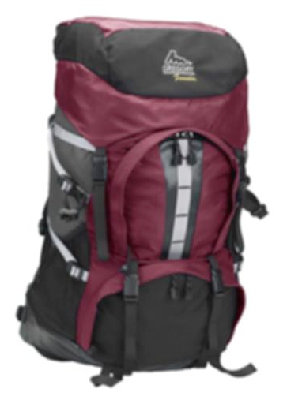

# Gerenciamento de predefinições de imagens do Dynamic Media{#managing-image-presets}

As predefinições de imagens permitem que os ativos Adobe Experience Manager forneçam dinamicamente imagens de diferentes tamanhos, formatos diferentes ou com outras propriedades de imagem geradas dinamicamente. Cada predefinição de imagem representa uma coleção predefinida de comandos de tamanho e formato para a exibição de imagens. Ao criar uma Predefinição de imagem, você escolhe um tamanho para a entrega da imagem. Você também escolhe comandos de formatação para que a aparência da imagem seja otimizada quando a imagem for entregue para exibição.

Os administradores podem criar predefinições para exportar ativos. Os usuários podem escolher uma predefinição quando exportam imagens, o que também reformata as imagens para as especificações especificadas pelo administrador.

Também é possível criar predefinições de imagens responsivas. Se você aplicar uma predefinição de imagem responsiva a seus ativos, eles serão alterados dependendo do dispositivo ou do tamanho da tela em que são visualizados. Você pode configurar predefinições de imagens para usar CMYK no espaço de cores, além de RGB ou Cinza.

Esta seção descreve como criar, modificar e gerenciar predefinições de imagens em geral. Você pode aplicar uma predefinição de imagem a uma imagem sempre que visualizá-la. Consulte [Aplicação de predefinições da imagem](/help/assets/image-presets.md).

>[!NOTE]
>
>A geração de imagens inteligentes funciona com as predefinições de imagens existentes e usa inteligência nos últimos milissegundos do delivery para reduzir ainda mais o tamanho do arquivo de imagem com base na velocidade do navegador ou da conexão de rede. Consulte [Imagem inteligente](/help/assets/imaging-faq.md) para obter mais informações.

## Noções básicas sobre predefinições de imagens do Dynamic Media {#understanding-image-presets}

Como uma macro, uma Predefinição de imagem é uma coleção predefinida de comandos de dimensionamento e formatação salvos em um nome. Para entender como as Predefinições de imagem funcionam, suponha que o site exija que cada imagem do produto apareça em tamanhos diferentes, formatos diferentes e taxas de compactação para entrega de desktop e dispositivo móvel.

>[!NOTE]
>
>No modo Dynamic Media - Scene7, as predefinições de imagens são suportadas somente para ativos de imagem.

Você pode criar duas predefinições de imagem: um com 500 x 500 pixels para a versão desktop e 150 x 150 pixels para a versão móvel. Você cria duas Predefinições de imagem, uma chamada `Enlarge` para exibir imagens a 500x500 pixels e uma chamada `Thumbnail` para exibir imagens em 150 x 150 pixels. Para entregar imagens no `Enlarge` e `Thumbnail` size, o Experience Manager procura a definição de Enlarge Image Preet e Thumbnail Image Preset. Em seguida, o Experience Manager gera dinamicamente uma imagem no tamanho e nas especificações de formatação de cada Predefinição de imagem.

As imagens que são reduzidas quando entregues dinamicamente podem perder nitidez e detalhes. Por esse motivo, cada Predefinição de imagem contém controles de formatação para otimizar uma imagem quando ela é entregue em um tamanho específico. Esses controles garantem que suas imagens sejam nítidas e claras quando forem entregues ao seu site ou aplicativo.

Os administradores podem criar Predefinições de imagem. Para criar uma predefinição de imagem, você pode começar do zero ou começar com uma existente e salvá-la com um novo nome.

## Gerenciamento de predefinições de imagens do Dynamic Media {#managing-image-presets-1}

Gerencie as predefinições de imagens no Experience Manager ao tocar ou clicar no logotipo do Experience Manager para acessar o console de navegação global e tocar ou clicar no ícone Ferramentas e navegar para **[!UICONTROL Ativos > Predefinições de imagem]**.


>[!NOTE]
>
>Todas as predefinições de imagens criadas também estão disponíveis como representações dinâmicas ao visualizar ou entregar ativos.
>
>Em *Dynamic Media - Modo Scene7*, você *not* é necessário publicar predefinições de imagens conforme as predefinições de imagens são publicadas automaticamente.
>
>Em *Dynamic Media - Modo híbrido*, você deve publicar manualmente as predefinições de imagens.
>
>Consulte [Publicar predefinições da imagem](#publishing-image-presets).

>[!NOTE]
>
>O sistema mostra várias representações ao selecionar **[!UICONTROL Representações]** na Exibição de detalhes de um ativo. Você pode aumentar ou diminuir o número de predefinições de imagens exibidas. Consulte [Aumento do número de predefinições de imagens exibidas](#increasing-or-decreasing-the-number-of-image-presets-that-display).

### Recortes inteligentes, Adobe Illustrator (AI), Postscript (EPS) e formatos de arquivo PDF {#adobe-illustrator-ai-postscript-eps-and-pdf-file-formats}

>[!NOTE]
>
>Este tópico é aplicável somente ao Dynamic Media - Modo híbrido.

Se você pretende suportar a assimilação de arquivos AI, EPS e PDF para gerar representações dinâmicas desses formatos de arquivo, analise as seguintes informações antes de criar predefinições de imagem.

O formato de arquivo Adobe Illustrator é uma variante do PDF. As principais diferenças, no contexto do Experience Manager Assets, são as seguintes:

* Os documentos do Adobe Illustrator consistem em uma única página com várias camadas. Cada camada é extraída como um subativo PNG no ativo principal do Illustrator.
* Os documentos PDF consistem em uma ou mais páginas. Cada página é extraída como um subativo de PDF de página única no documento principal de PDF de várias páginas.

Os subativos são criados pela variável `Create Sub Asset process` no geral `DAM Update Asset` fluxo de trabalho. Para ver esse componente de processo no fluxo de trabalho, toque em **[!UICONTROL Ferramentas]** > **[!UICONTROL Fluxo de trabalho]** > **[!UICONTROL Modelos]** > **[!UICONTROL Ativo de atualização DAM]** > **[!UICONTROL Editar]**.

Consulte também [Exibição de páginas de um arquivo de várias páginas](/help/assets/managing-linked-subassets.md#view-pages-of-a-multi-page-file).

Você pode exibir os subativos ou as páginas ao abrir o ativo, tocar no menu Conteúdo e selecionar **[!UICONTROL Subativos]** ou **[!UICONTROL Páginas]**. Os subativos são ativos reais. Ou seja, PDF páginas são extraídas pela variável `Create Sub Asset` componente de fluxo de trabalho. Eles são armazenados como `page1.pdf`, `page2.pdf`e assim por diante, abaixo do ativo principal. Depois que forem armazenadas, a variável `DAM Update Asset` O workflow os processa.

Para usar o Dynamic Media para visualizar e gerar representações dinâmicas para arquivos AI, EPS ou PDF, as seguintes etapas de processamento são necessárias:

1. No `DAM Update Asset` workflow, a variável `Rasterize PDF/AI Image Preview Rendition` componente de processo rasteriza a primeira página do ativo original — usando a resolução configurada — em um `cqdam.preview.png` representação.

1. O `cqdam.preview.png` a renderização é então otimizada em um PTIFF pelo `Dynamic Media Process Image Assets` componente de processo no fluxo de trabalho.

>[!NOTE]
>
>No [!UICONTROL Ativo de atualização DAM] workflow, a variável **[!UICONTROL Miniaturas do EPS]** gera miniaturas para arquivos EPS.

#### Propriedades de metadados de ativos PDF/AI/EPS {#pdf-ai-eps-asset-metadata-properties}

| **Propriedade de metadados** | **Descrição** |
|---|---|
| `dam:Physicalwidthininches` | Largura do documento em polegadas. |
| `dam:Physicalheightininches` | Altura do documento em polegadas. |

Você acessa `Rasterize PDF/AI Image Preview Rendition` processar as opções do componente por meio do `DAM Update Asset` fluxo de trabalho.

Toque em Adobe Experience Manager no canto superior esquerdo, navegue até **[!UICONTROL Ferramentas]** > **[!UICONTROL Fluxo de trabalho]** > **[!UICONTROL Modelos]**. Na página Modelos de fluxo de trabalho , selecione **[!UICONTROL Ativo de atualização DAM]**, em seguida, na barra de ferramentas, toque em **[!UICONTROL Editar]**. No [!UICONTROL Ativo de atualização DAM] na página do fluxo de trabalho, toque duas vezes no `Rasterize PDF/AI Image Preview Rendition` componente do processo para abrir a caixa de diálogo Propriedades da etapa .

#### Rasterizar opções de representação de visualização de imagem do PDF/AI {#rasterize-pdf-ai-image-preview-rendition-options}


Argumentos para rasterizar o fluxo de trabalho do PDF ou AI

<table>
 <tbody>
  <tr>
   <td><strong>Argumento do processo</strong></td>
   <td><strong>Configuração padrão</strong></td>
   <td><strong>Descrição</strong></td>
  </tr>
  <tr>
   <td>Tipos de mime</td>
   <td><p>application/pdf</p> <p>application/postscript</p> <p>aplicativo/ilustrador<br /> </p> </td>
   <td>Lista de tipos MIME de documentos considerados documentos PDF ou Illustrator.<br /> </td>
  </tr>
  <tr>
   <td>Largura máxima</td>
   <td>2048</td>
   <td>Largura máxima da representação de visualização gerada, em pixels.<br /> </td>
  </tr>
  <tr>
   <td>Altura máxima</td>
   <td>2048</td>
   <td>Altura máxima da representação de visualização gerada, em pixels.<br /> </td>
  </tr>
  <tr>
   <td>Resolução</td>
   <td>72</td>
   <td>Resolução para rasterizar a primeira página, em ppi (pixels por polegada).</td>
  </tr>
 </tbody>
</table>

Usando os argumentos padrão do processo, a primeira página de um documento PDF/AI é rasterizada em 72 ppi e a imagem de visualização gerada é dimensionada em 2048 x 2048 pixels. Para uma implantação típica, convém aumentar a resolução para um mínimo de 150 ppi ou mais. Por exemplo, um documento de tamanho de letra dos EUA a 300 ppi requer uma largura e altura máximas de 2550 x 3300 pixels, respectivamente.

Largura máxima e Altura máxima limitam a resolução na qual rasterizar. Por exemplo, se os máximos estiverem inalterados e a Resolução for definida como 300 ppi, um documento Carta dos EUA será rasterizado em 186 ppi. Ou seja, o documento tem 1581 x 2046 pixels.

O `Rasterize PDF/AI Image Preview Rendition` o componente de processo tem um máximo definido para garantir que não crie imagens excessivamente grandes na memória. Imagens tão grandes podem estender a memória fornecida para a JVM (Java™ Virtual Machine). Deve-se tomar cuidado para fornecer à JVM memória suficiente para gerenciar o número configurado de fluxos de trabalho paralelos, cada um com o potencial de criar uma imagem no tamanho máximo configurado.

### Formato de arquivo INDD (InDesign) {#indesign-indd-file-format}

Se você pretende suportar a assimilação de arquivos INDD para gerar a representação dinâmica desse formato de arquivo, convém revisar as seguintes informações antes de criar predefinições de imagem.

Para arquivos InDesign, os sub-ativos são extraídos somente se o Adobe InDesign Server estiver integrado ao Experience Manager. Os ativos referenciados são vinculados com base em seus metadados. O InDesign Server não é necessário para vinculação. No entanto, os ativos referenciados devem estar presentes no Experience Manager antes que os arquivos do InDesign sejam processados para que os links sejam criados entre os arquivos do InDesign e os ativos referenciados.

Consulte [Integração do Experience Manager Assets com o InDesign Server](/help/assets/indesign.md).

O componente do processo de Extração de mídia no `DAM Update Asset` O fluxo de trabalho do executa vários scripts estendidos pré-configurados para processar arquivos de InDesign.


Os caminhos do ExtendScript nos argumentos do componente do processo de Extração de mídia no [!UICONTROL Ativo de atualização DAM] fluxo de trabalho.

Os seguintes scripts são usados pela integração do Dynamic Media:

<table>
 <tbody>
  <tr>
   <td><strong>Nome do ExtendScript</strong></td>
   <td><strong>Padrão</strong></td>
   <td><strong>Descrição</strong></td>
  </tr>
  <tr>
   <td>ThumbnailExport.jsx</td>
   <td>Sim</td>
   <td>Gera um 300 ppi <code>thumbnail.jpg</code> representação que é otimizada e transformada em uma representação PTIFF por <code>Dynamic Media Process Image Assets</code> componente de processo.<br /> </td>
  </tr>
  <tr>
   <td>JPEGPagesExport.jsx</td>
   <td>Sim</td>
   <td>Gera um subativo JPEG de 300 PPI para cada página. O subativo JPEG é um ativo real armazenado no ativo InDesign. Também é otimizado e transformado em PTIFF pela <code>DAM Update Asset</code> fluxo de trabalho.<br /> </td>
  </tr>
  <tr>
   <td>PDFPagesExport.jsx</td>
   <td>Não</td>
   <td>Gera um subativo PDF para cada página. O subativo PDF é processado conforme descrito anteriormente. Como o PDF contém apenas uma única página, nenhum subativo é gerado.<br /> </td>
  </tr>
 </tbody>
</table>

## Configuração do tamanho da miniatura da imagem {#configuring-image-thumbnail-size}

Você pode configurar o tamanho das miniaturas definindo essas configurações no **[!UICONTROL Ativo de atualização DAM]** fluxo de trabalho. Há duas etapas no fluxo de trabalho, onde você pode configurar o tamanho da miniatura dos ativos de imagem. Embora (**[!UICONTROL Ativos de imagem de processo Dynamic Media]**) é usada para ativos de imagem dinâmicos e (**[!UICONTROL Processar miniaturas]**) é para geração de miniaturas estáticas ou quando todos os outros processos não geram miniaturas, *both* deve ter as mesmas configurações.

Com a etapa **[!UICONTROL Ativos de imagem de processo do Dynamic Media]**, as miniaturas são geradas pelo servidor de imagem e essa configuração é independente da configuração aplicada à etapa **[!UICONTROL Processar miniaturas]**. Gerar miniaturas por meio da etapa **[!UICONTROL Processar miniaturas]** é a maneira mais lenta e intensiva de memória para criar miniaturas.

O dimensionamento de miniaturas é definido no seguinte formato: **[!UICONTROL largura:height:center]**, por exemplo `80:80:false`. A largura e a altura determinam o tamanho em pixels da miniatura. O valor central é false ou true e, se definido como true, indica que a imagem em miniatura tem exatamente o tamanho fornecido na configuração. Se a imagem redimensionada for menor, ela será centralizada na miniatura.

>[!NOTE]
>
>* Os tamanhos de miniatura dos arquivos EPS são configurados na variável **[!UICONTROL Miniaturas do EPS]** na **[!UICONTROL Argumentos]** em Miniaturas.
>
>* Os tamanhos de miniatura dos vídeos são configurados no **[!UICONTROL Miniaturas do FFmpeg]** na **[!UICONTROL Processo]** guia em **[!UICONTROL Argumentos]**.
>


**Para configurar o tamanho da miniatura da imagem:**

1. Toque **[!UICONTROL Ferramentas]** > **[!UICONTROL Fluxo de trabalho]** > **[!UICONTROL Modelos]** > **[!UICONTROL Ativo de atualização DAM]** > **[!UICONTROL Editar]**.
1. Toque no **[!UICONTROL Ativos de imagem de processo Dynamic Media]** e toque ou clique no botão **[!UICONTROL Miniaturas]** guia . Altere o tamanho da miniatura, conforme necessário, e toque em **[!UICONTROL OK]**.

   

1. Toque na etapa **[!UICONTROL Processar miniaturas]** e toque na guia **[!UICONTROL Miniaturas]**. Altere o tamanho da miniatura, conforme necessário, e toque em **[!UICONTROL OK]**.

   >[!NOTE]
   >
   >Os valores no argumento de miniaturas da etapa **[!UICONTROL Processar miniaturas]** devem corresponder ao argumento de miniaturas na etapa **[!UICONTROL Ativos de imagem do processo do Dynamic Media]**.

1. Toque **[!UICONTROL Salvar]** para salvar as alterações no workflow.

### Aumentar ou diminuir o número de predefinições de imagens do Dynamic Media exibidas {#increasing-or-decreasing-the-number-of-image-presets-that-display}

As predefinições de imagens criadas estão disponíveis como representações dinâmicas ao visualizar ativos. O Experience Manager mostra várias representações dinâmicas ao visualizar um ativo de **[!UICONTROL Exibição de detalhes > Representações]**. Você pode aumentar ou diminuir o limite de representações exibidas.

**Aumente ou diminua o número de predefinições de imagens do Dynamic Media exibidas:**

1. Navegue até o CRXDE Lite ([https://localhost:4502/crx/de](https://localhost:4502/crx/de)).
1. Navegue até o nó de listagem da predefinição de imagem em `/libs/dam/gui/coral/content/commons/sidepanels/imagepresetsdetail/imgagepresetslist`

   

1. Na propriedade **[!UICONTROL limit]**, altere o **[!UICONTROL Value]**, que é definido como 15 por padrão, para o número desejado.
1. Navegue até a fonte de dados da predefinição de imagens em `/libs/dam/gui/coral/content/commons/sidepanels/imagepresetsdetail/imgagepresetslist/datasource`

   

1. Na propriedade limit , altere o número para o número desejado, por exemplo `{empty requestPathInfo.selectors[1] ? "20" : requestPathInfo.selectors[1]}`
1. Toque **[!UICONTROL Salvar tudo]**.

## Criar uma predefinição de imagem do Dynamic Media {#creating-image-presets}

Criar uma predefinição de imagem do Dynamic Media permite aplicar essas configurações a qualquer imagem ao visualizar ou publicar.

>[!NOTE]
>
>Se estiver usando o Internet Explorer 9, a criação de uma predefinição não será exibida na lista predefinida imediatamente após ser salva. Para contornar esse problema, desative o cache do IE9.

Se você pretende suportar a assimilação de arquivos AI, PDF e EPS para gerar a representação dinâmica desses formatos de arquivo, analise as seguintes informações antes de criar predefinições de imagem.
Consulte [Adobe Illustrator (AI), Postscript (EPS) e formatos de arquivo PDF](#adobe-illustrator-ai-postscript-eps-and-pdf-file-formats).

Se você pretende suportar a assimilação de arquivos INDD para gerar a representação dinâmica desse formato de arquivo, convém revisar as seguintes informações antes de criar predefinições de imagem.
Consulte [Formato de arquivo INDD (InDesign)](#indesign-indd-file-format).

>[!NOTE]
>
>Para criar predefinições de imagens da Dynamic Media, você deve ter privilégios de administrador como administrador de Experience Manager ou administrador de Admin Console.

**Para criar uma predefinição de imagem do Dynamic Media:**

1. No Experience Manager, toque no logotipo do Experience Manager para acessar o console de navegação global e, em seguida, toque em **[!UICONTROL Ferramentas]** > **[!UICONTROL Ativos]** > **[!UICONTROL Predefinições de imagem]**.
1. Clique em **[!UICONTROL Criar]**. O **[!UICONTROL Editar predefinição de imagem]** será aberta.

   

   >[!NOTE]
   >
   >Para tornar essa predefinição de imagem responsiva, apague os valores nos campos **[!UICONTROL largura]** e **[!UICONTROL altura]** e deixe-os em branco.

1. Insira valores nas guias **[!UICONTROL Básico]** e **[!UICONTROL Avançado]**, conforme apropriado, incluindo um nome. As opções são descritas em [Opções de predefinição de imagem](#image-preset-options). As predefinições aparecem no painel à esquerda e podem ser usadas junto com outros ativos.

   

1. Clique em **[!UICONTROL Salvar]**.

## Criação de uma predefinição de imagem responsiva {#creating-a-responsive-image-preset}

Para criar uma predefinição de imagem responsiva, execute as etapas em [Criação de predefinições de imagens](#creating-image-presets). Ao inserir a altura e a largura na variável **[!UICONTROL Editar predefinição de imagem]** apague os valores e deixe-os em branco.

Deixá-los em branco informa ao Experience Manager que essa predefinição de imagem é responsiva. É possível ajustar os outros valores, conforme necessário.


>[!NOTE]
>
>Para ver a variável **[!UICONTROL URL]** e **[!UICONTROL RESS]** botões ao aplicar uma predefinição de imagem a um ativo, o ativo deve ser publicado.
>
>
>
>No modo Dynamic Media - Scene7, as predefinições de imagens e os ativos de imagem são publicados automaticamente.
>
>No Dynamic Media - Modo híbrido, é necessário publicar manualmente as predefinições de imagens e os ativos de imagem.

### Opções de predefinição de imagem {#image-preset-options}

Ao criar ou editar predefinições de imagens, você tem as opções descritas nesta seção. Além disso, o Adobe recomenda que essas opções de &quot;práticas recomendadas&quot; comecem:

* **[!UICONTROL Formatar]** (guia **[!UICONTROL Básico]**) - Selecione **[!UICONTROL JPEG]** ou outro formato que atenda aos requisitos. Todos os navegadores da Web são compatíveis com o formato de imagem JPEG; ele oferece um bom equilíbrio entre arquivos pequenos e qualidade de imagem. No entanto, as imagens no formato JPEG usam um esquema de compactação com perdas que pode apresentar artefatos de imagem indesejados se a configuração de compactação for muito baixa. Por esse motivo, a Adobe recomenda definir a qualidade de compactação como 75. Essa configuração oferece um bom equilíbrio entre a qualidade da imagem e o tamanho pequeno de arquivo.

* **[!UICONTROL Ativar nitidez simples]** - Não selecione **[!UICONTROL Ativar nitidez simples]** (este filtro de nitidez oferece menos controle do que as configurações Tirar nitidez da máscara).

* **[!UICONTROL Nitidez: Modo de nova amostra]** - Selecionar **[!UICONTROL Sharp2]**.

#### Opções básicas da guia {#basic-tab-options}

<table>
 <tbody>
  <tr>
   <td><strong>Texto</strong></td>
   <td><strong>Descrição</strong></td>
  </tr>
  <tr>
   <td><strong>Nome</strong></td>
   <td>Insira um nome descritivo sem espaços em branco. Inclua a especificação do tamanho da imagem no nome para ajudar os usuários a identificar essa predefinição de imagem.</td>
  </tr>
  <tr>
   <td><strong>Largura e altura</strong></td>
   <td>Insira em pixels o tamanho em que a imagem é entregue. A largura e a altura devem ser maiores que 0 pixels. Se um dos valores for 0, nenhuma predefinição será criada. Se ambos os valores estiverem em branco, uma predefinição de imagem responsiva será criada.</td>
  </tr>
  <tr>
   <td><strong>Formato</strong></td>
   <td><p>Escolha um formato no menu .</p> <p>Escolha <strong>JPEG</strong> O oferece as seguintes opções adicionais:</p>
    <ul>
     <li><strong>Qualidade</strong> - Controla o nível de compactação JPEG. Essa configuração afeta o tamanho do arquivo e a qualidade da imagem. A escala de qualidade do JPEG é de 1 a 100. A escala fica visível ao arrastar o controle deslizante.</li>
     <li><strong>Ativar a redução da amostragem do JPG Chrominance</strong> - Como o olho é menos sensível à informação de cores de alta frequência do que à luminância de alta frequência, as imagens de JPEG dividem a informação da imagem em componentes de luminância e cor. Quando uma imagem de JPEG é compactada, o componente de luminância é deixado em resolução completa, enquanto os componentes de cor são reduzidos pela média de grupos de pixels. A redução da amostragem reduz o volume de dados em um terço ou metade, quase sem impacto na qualidade percebida. A redução da amostragem não é aplicável a imagens em tons de cinza. Essa técnica reduz a quantidade de compactação útil para imagens com alto contraste (por exemplo, imagens com texto sobreposto).</li>
    </ul>
    <div>
      Escolha
     <strong>GIF</strong> ou
     <strong>GIF com alfa</strong> fornece estes
     <strong>Quantidade de cores GIF</strong> opções:
    </div>
    <ul>
     <li><strong>Tipo </strong>- Selecionar <strong>Adaptável</strong> (o padrão), <strong>Web</strong>ou <strong>Macintosh</strong>. Se você selecionar <strong>GIF com Alfa</strong>, a opção Macintosh não está disponível.</li>
     <li><strong>Dither</strong> - Selecionar <strong>Difusa</strong> ou <strong>Desligado</strong>.</li>
     <li><strong>Número de Cores </strong>- Insira um número de 2 a 256.</li>
     <li><strong>Lista de cores</strong> - Insira uma lista separada por vírgulas. Por exemplo, para branco, cinza e preto, digite <code>000000,888888,ffffff</code>.</li>
    </ul>
    <div>
      Escolha
     <strong>PDF</strong>,
     <strong>TIFF</strong>ou
     <strong>TIFF com alfa</strong> O fornece esta opção adicional:
    </div>
    <ul>
     <li><strong>Compactação</strong> - Selecione um algoritmo de compactação. Opções de algoritmo para PDF são <strong>Nenhum</strong>, <strong>CEP</strong>e <strong>Jpeg</strong>; para o TIFF são as opções <strong>Nenhum</strong>, <strong>LZW</strong>, <strong>Jpeg</strong>e <strong>CEP</strong>; e para TIFF com Alfa são <strong>Nenhum</strong>, <strong>LZW</strong>e <strong>CEP</strong>.</li>
    </ul> <p>Escolha <strong>PNG</strong>, <strong>PNG com alfa,</strong> ou <strong>EPS</strong> não fornece opções adicionais.</p> </td>
  </tr>
  <tr>
   <td><strong>Nitidez</strong></td>
   <td>Selecione o <strong>Ativar nitidez simples</strong> opção para aplicar um filtro básico de nitidez à imagem depois que toda a escala ocorrer. A nitidez pode ajudar a compensar a indefinição que pode resultar na exibição de uma imagem em um tamanho diferente. </td>
  </tr>
 </tbody>
</table>

#### Opções avançadas de guia {#advanced-tab-options}

<table>
 <tbody>
  <tr>
   <td><strong>Texto</strong></td>
   <td><strong>Descrição</strong></td>
  </tr>
  <tr>
   <td><strong>Espaço de cor</strong></td>
   <td>Selecionar <strong>RGB, CMYK,</strong> ou <strong>Escala de cinza</strong> para o espaço de cores.</td>
  </tr>
  <tr>
   <td><strong>Perfil de cor</strong></td>
   <td>Selecione o perfil de espaço de cores de saída para o qual o ativo deve ser convertido se ele for diferente do perfil de trabalho.</td>
  </tr>
  <tr>
   <td><strong>Renderizar recuo</strong></td>
   <td>Você pode substituir a intenção de renderização padrão. As intenções de renderização determinam o que acontece com as cores que não podem ser reproduzidas no perfil de cores de destino (fora do gamut). A intenção de renderização é ignorada se não for compatível com o perfil ICC.
    <ul>
     <li>Selecionar <strong>Perceptivo</strong> para compactar a gama total de um espaço de cores em outro espaço de cores, quando uma ou mais cores na imagem original estiver fora do gamut do espaço de cores de destino.</li>
     <li>Selecionar <strong>Colorimétrica relativa</strong> quando uma cor no espaço de cores atual está fora de gama no espaço de cores de destino. E você quer mapeá-lo para a cor mais próxima possível dentro do gama do espaço de cores alvo sem afetar outras cores. </li>
     <li>Selecionar <strong>Saturação</strong> se você quiser reproduzir a saturação de cores da imagem original ao converter para o espaço de cores de destino. </li>
     <li>Selecionar <strong>Colorimétrica absoluta</strong> para corresponder cores exatamente sem ajuste para ponto branco ou ponto preto que alteraria o brilho da imagem.</li>
    </ul> </td>
  </tr>
  <tr>
   <td><strong>Compensação de pontos pretos</strong></td>
   <td>Selecione esta opção se o perfil de saída suportar este recurso. A compensação de ponto preto é ignorada se não for compatível com o perfil ICC especificado.</td>
  </tr>
  <tr>
   <td><strong>Pontilhamento</strong></td>
   <td>Selecione essa opção para evitar ou reduzir artefatos de faixas de cores. </td>
  </tr>
  <tr>
   <td><strong>Tipo de nitidez</strong></td>
   <td><p>Selecionar <strong>Nenhum</strong>, <strong>Nitidez</strong>ou <strong>Tirar nitidez da máscara</strong>. </p>
    <ul>
     <li>Selecionar <strong>Nenhum</strong> se desejar desativar a nitidez.</li>
     <li>Selecionar <strong>Nitidez</strong> se quiser aplicar um filtro básico de nitidez à imagem depois que toda a escala ocorrer. A nitidez pode ajudar a compensar a indefinição que pode resultar na exibição de uma imagem em um tamanho diferente. </li>
     <li>Selecionar<strong> Tirar nitidez da máscara</strong> se quiser ajustar um efeito de filtro de nitidez na imagem final com resolução reduzida. Você pode controlar a intensidade do efeito, o raio do efeito (medido em pixels) e um limite de contraste que é ignorado. Esse efeito usa as mesmas opções do filtro "Tirar nitidez da máscara" do Photoshop.</li>
    </ul> <p>Em <strong>Tirar nitidez da máscara</strong>, você tem as seguintes opções:</p>
    <ul>
     <li><strong>Valor</strong> - Controla a quantidade de contraste aplicado aos pixels da borda. O valor padrão do número real é 1,0. Para imagens de alta resolução, você pode aumentá-lo até 5,0. Considere Quantia como uma medida de intensidade de filtro.</li>
     <li><strong>Raio</strong> - Determina o número de pixels em torno dos pixels da borda que afetam a nitidez. Para imagens de alta resolução, insira um número real de 1 a 2. Um valor baixo ajuste a nitidez apenas dos pixels da borda; um valor alto ajuste a nitidez de uma faixa mais ampla de pixels. O valor correto depende do tamanho da imagem.</li>
     <li><strong>Limite</strong> - Determina o intervalo de contraste a ser ignorado quando o filtro de máscara nítida for aplicado. Em outras palavras, essa opção determina o quão diferentes os pixels com nitidez devem ser da área ao redor antes de serem considerados pixels de borda e terem nitidez. Para evitar a introdução de ruído, experimente com valores inteiros de 2 a 20. </li>
     <li><strong>Aplicar a</strong> - Determina se a nitidez não se aplica a cada cor ou brilho.</li>
    </ul>
    <div>
      A nitidez é descrita em
     <a href="https://experienceleague.adobe.com/docs/experience-manager-65/assets/sharpening_images.pdf">Nitidez de imagens</a>.
    </div> </td>
  </tr>
  <tr>
   <td><strong>Modo de nova amostra</strong></td>
   <td>Selecione um <strong>Modo de nova amostra</strong> opção. Essas opções aprimoram a imagem quando ela é reduzida:
    <ul>
     <li><strong>Bi-Linear</strong> - O método de reamostragem mais rápido. Alguns artefatos de aliasing são perceptíveis.</li>
     <li><strong>Bi-Cúbico</strong> - Aumenta o uso da CPU, mas gera imagens mais nítidas com artefatos de aliasing menos perceptíveis.</li>
     <li><strong>Sharp2</strong> - Pode produzir resultados ligeiramente mais nítidos que o Bi-Cubic, mas com um custo de CPU ainda maior.</li>
     <li><strong>BiSharp</strong> - Seleciona o reamplador padrão Photoshop para reduzir o tamanho da imagem, que é chamado de <strong>afiador bicúbico</strong> no Adobe Photoshop.</li>
     <li><strong>Cada cor</strong> e <strong>Brilho</strong> - cada método pode ser baseado na cor ou no brilho. Por padrão <strong>Cada cor</strong> está selecionada.</li>
    </ul> </td>
  </tr>
  <tr>
   <td><strong>Resolução de impressão</strong></td>
   <td>Selecione uma resolução para imprimir esta imagem; 72 pixels é o padrão.</td>
  </tr>
  <tr>
   <td><strong>Modificador de imagem</strong></td>
   <td><p>Além das configurações de imagem comuns disponíveis na interface do usuário, o Dynamic Media suporta várias modificações de imagem avançadas que você pode especificar na <strong>Modificadores de imagem</strong> campo. Esses parâmetros são definidos na variável <a href="https://experienceleague.adobe.com/docs/dynamic-media-developer-resources/image-serving-api/image-serving-api/http-protocol-reference/command-reference/c-command-reference.html#image-serving-api">Referência de comando do protocolo do servidor de imagens</a>.</p> <p>Importante: Não há suporte para a seguinte funcionalidade listada na API:</p>
    <ul>
     <li>Modelos básicos e comandos de renderização de texto: <code>text= textAngle= textAttr= textFlowPath= textFlowXPath= textPath=</code> e <code>textPs=</code></li>
     <li>Comandos de localização: <code>locale=</code> e <code>req=xlate</code></li>
     <li><code>req=set</code> não está disponível para uso geral.</li>
     <li><code>req=mbrset</code></li>
     <li><code>req=saveToFile</code></li>
     <li><code>req=targets</code></li>
     <li><code>template=</code></li>
     <li>Serviços Dynamic Media não principais: SVG, Renderização de Imagens e Web-to-Print</li>
    </ul> </td>
  </tr>
 </tbody>
</table>

## Definição das opções de predefinição de imagem com modificadores de imagem {#defining-image-preset-options-with-image-modifiers}

Além das opções disponíveis nas guias Básico e Avançado , é possível definir modificadores de imagem para fornecer mais opções ao definir predefinições de imagem. A renderização de imagem depende da API de renderização de imagem que é definida detalhadamente na variável [Referência do protocolo HTTP](https://experienceleague.adobe.com/docs/dynamic-media-developer-resources/image-serving-api/image-serving-api/http-protocol-reference/command-reference/c-command-reference.html#image-serving-api).

A seguir estão alguns exemplos básicos do que você pode fazer com modificadores de imagem.

>[!NOTE]
>
>Alguns modificadores de imagem [não pode ser usado no Experience Manager](#advanced-tab-options).

* [op_invert](https://experienceleague.adobe.com/docs/dynamic-media-developer-resources/image-serving-api/image-serving-api/http-protocol-reference/command-reference/r-op-invert.html#image-serving-api) - Inverte cada componente de cor para obter um efeito de imagem negativo.

   ```xml
   &op_invert=1
   ```

   

* [op_blur](https://experienceleague.adobe.com/docs/dynamic-media-developer-resources/image-serving-api/image-serving-api/http-protocol-reference/command-reference/r-op-blur.html#image-serving-api) - Aplica um filtro de desfoque à imagem.

   ```xml
   &op_blur=7
   ```

   

* Comandos combinados - op_blur e op-invert

   ```xml
   &op_invert=1&op_blur=7
   ```

   

* [op_brightness](https://experienceleague.adobe.com/docs/dynamic-media-developer-resources/image-serving-api/image-serving-api/http-protocol-reference/command-reference/r-op-brightness.html#image-serving-api) - Diminui ou aumenta o brilho.

   ```xml
   &op_brightness=58
   ```

   

* [opac](https://experienceleague.adobe.com/docs/dynamic-media-developer-resources/image-serving-api/image-serving-api/http-protocol-reference/command-reference/r-opac.html#image-serving-api) - Ajusta a opacidade da imagem. Permite diminuir a opacidade do primeiro plano.

   ```xml
   opac=29
   ```

   

## Editar predefinições da imagem {#modifying-image-presets}

1. No Experience Manager, toque no logotipo do Experience Manager para acessar o console de navegação global e, em seguida, toque em **[!UICONTROL Ferramentas]** > **[!UICONTROL Ativos]** > **[!UICONTROL Predefinições de imagem]**.

   

1. Selecione uma predefinição e clique em **[!UICONTROL Editar]**. O **[!UICONTROL Editar predefinição de imagem]** será aberta.
1. Faça alterações e clique em **[!UICONTROL Salvar]** para salvar as alterações ou **[!UICONTROL Cancelar]** para cancelar as alterações.

## Publicar predefinições de imagens do Dynamic Media {#publishing-image-presets}

Se você estiver executando o Dynamic Media - Modo híbrido, será necessário publicar manualmente as predefinições de imagens.

(Se você estiver executando o modo Dynamic Media - Scene7, as predefinições de imagens serão publicadas automaticamente para você; não é necessário concluir essas etapas.)

**Para publicar predefinições de imagens no Dynamic Media - Modo híbrido:**

1. No Experience Manager, toque ou clique no logotipo do Experience Manager para acessar o console de navegação global e toque ou clique no ícone Ferramentas e navegue até **[!UICONTROL Ativos]** > **[!UICONTROL Predefinições de imagem]**.
1. Selecione a predefinição de imagem ou várias predefinições de imagem da lista de predefinições de imagem e clique ou toque em **[!UICONTROL Publicar]**.
1. Após a publicação da predefinição de imagem, o status muda de não publicado para publicado.

   

## Excluir predefinições de imagens do Dynamic Media {#deleting-image-presets}

1. No Experience Manager, toque ou clique no logotipo do Experience Manager para acessar o console de navegação global.
1. Toque no **[!UICONTROL Ferramentas]** e navegue até **[!UICONTROL Ativos]** > **[!UICONTROL Predefinições de imagem]**.
1. Selecione uma predefinição e clique em **[!UICONTROL Excluir]**. A Dynamic Media confirma que você deseja excluí-la. Toque **[!UICONTROL Excluir]** para excluir ou tocar **[!UICONTROL Cancelar]** para suspender.
