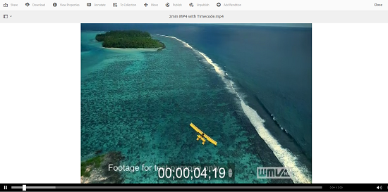

# Gerenciar ativos de vídeo {#manage-video-assets}

O formato de vídeo é uma parte essencial dos ativos digitais de uma organização. [!DNL Adobe Experience Manager] O oferta amadurece as ofertas e os recursos para gerenciar todo o ciclo de vida de seus ativos de vídeo após sua criação.

Saiba como gerenciar e editar os ativos de vídeo em [!DNL Adobe Experience Manager Assets]. A codificação e a transcodificação de vídeo, por exemplo, a transcodificação FFmpeg, é possível usando a [!DNL Dynamic Media] integração.

## Fazer upload e pré-visualização de ativos de vídeo {#upload-and-preview-video-assets}

[!DNL Adobe Experience Manager Assets] gera pré-visualizações para ativos de vídeo com a extensão MP4. Se o formato do ativo não for MP4, instale o FFmpeg pack para gerar uma pré-visualização. FFmpeg cria representações de vídeo do tipo OGG e MP4. Você pode pré-visualização as execuções na interface do [!DNL Assets] usuário.

1. Na pasta ou subpastas de ativos digitais, navegue até o local onde deseja adicionar ativos digitais.
1. Para carregar o ativo, clique em **[!UICONTROL Criar]** na barra de ferramentas e escolha **[!UICONTROL Arquivos]**. Como alternativa, arraste um arquivo na interface do usuário. Consulte [fazer upload de ativos](manage-assets.md#uploading-assets) para obter detalhes.
1. Para pré-visualização de um vídeo na visualização de placa, clique na opção **[!UICONTROL Reproduzir]**  no ativo de vídeo. Você pode pausar ou reproduzir vídeo apenas na visualização do cartão. As opções [!UICONTROL Reproduzir] e [!UICONTROL Pausar] não estão disponíveis na visualização da lista.

1. Para pré-visualização do vídeo na página de detalhes do ativo, clique em **[!UICONTROL Editar]** no cartão. O vídeo é reproduzido no player de vídeo nativo do navegador. Você pode reproduzir, pausar, controlar o volume e aplicar zoom no vídeo em tela cheia.

   

## Configuração para carregar ativos com mais de 2 GB {#configuration-to-upload-assets-that-are-larger-than-gb}

Por padrão, [!DNL Assets] não permite fazer upload de ativos com mais de 2 GB devido a um limite de tamanho de arquivo. No entanto, você pode substituir esse limite indo para o CRXDE Lite e criando um nó no `/apps` diretório. O nó deve ter o mesmo nome de nó, estrutura de diretório e propriedades de ordem de nó comparáveis.

Além da [!DNL Assets] configuração, altere as seguintes configurações para fazer upload de ativos grandes:

* Aumente o tempo de expiração do token. Consulte Servlet [!UICONTROL CSRF] Adobe Granite no Console da Web em `https://[aem_server]:[port]/system/console/configMgr`. Para obter mais informações, consulte Proteção CSRF.
* Aumente a configuração `receiveTimeout` no Dispatcher. Para obter mais informações, consulte Configuração [do](https://docs.adobe.com/content/help/en/experience-manager-dispatcher/using/configuring/dispatcher-configuration.html#renders-options)Dispatcher.

>[!NOTE]
>
>A interface do usuário [!DNL Experience Manager] Classic não tem uma restrição de limite de tamanho de arquivo de 2 GB. Além disso, o fluxo de trabalho completo para vídeos grandes não é totalmente compatível.

Para configurar um limite de tamanho de arquivo maior, execute as seguintes etapas no `/apps` diretório.

1. In [!DNL Experience Manager], click **[!UICONTROL Tools]** > **[!UICONTROL General]** > **[!UICONTROL CRXDE Lite]**.
1. No CRXDE Lite, navegue até `/libs/dam/gui/content/assets/jcr:content/actions/secondary/create/items/fileupload`. Para ver a janela do diretório, clique no `>>`.
1. From the toolbar, click the **[!UICONTROL Overlay Node]**. Como alternativa, selecione **[!UICONTROL Sobrepor nó]** no menu de contexto.
1. In the **[!UICONTROL Overlay Node]** dialog, click **[!UICONTROL OK]**.

   

1. Atualize o navegador. O nó de sobreposição `/apps/dam/gui/content/assets/jcr:content/actions/secondary/create/items/fileupload` é selecionado.
1. Na guia **[!UICONTROL Propriedades]** , digite o valor apropriado em bytes para aumentar o limite de tamanho para o tamanho desejado. Por exemplo, para aumentar o limite de tamanho para 30 GB, digite `32212254720` valor.

1. Na barra de ferramentas, clique em **[!UICONTROL Salvar tudo]**.
1. In [!DNL Experience Manager], click **[!UICONTROL Tools]** > **[!UICONTROL Operations]** > **[!UICONTROL Web Console]**.
1. Na página Pacotes [!DNL Adobe Experience Manager] do Console [!UICONTROL Web, na coluna Nome da tabela, localize e clique em] Adobe Granite Workflow Job Handler ****.
1. On the [!UICONTROL Adobe Granite Workflow External Process Job Handler] page, set the seconds for both **[!UICONTROL Default Timeout]** and **[!UICONTROL Max Timeout]** fields to `18000` (five hours). Clique em **[!UICONTROL Salvar]**.
1. Em [!DNL Experience Manager], clique em **[!UICONTROL Ferramentas]** > **[!UICONTROL Fluxo de trabalho]** > **[!UICONTROL Modelos]**.
1. Na página Modelos de fluxo de trabalho, selecione **[!UICONTROL Dynamic Media Encode Video]** e clique em **[!UICONTROL Editar]**.
1. Na página de fluxo de trabalho, clique com o duplo no componente Processo **[!UICONTROL de serviço de vídeo do]** Dynamic Media.
1. Na caixa de diálogo [!UICONTROL Propriedades da etapa], na guia **[!UICONTROL Comum]**, expanda **Configurações avançadas**.
1. In the **[!UICONTROL Timeout]** field, specify a value of `18000`, then click **[!UICONTROL OK]** to return to the **[!UICONTROL Dynamic Media Encode Video]** workflow page.
1. Próximo à parte superior da página, abaixo do título da página Codificação de vídeo [!UICONTROL do] Dynamic Media, clique em **[!UICONTROL Salvar]**.

## Publicar ativos de vídeo {#publish-video-assets}

Após a publicação, você pode incluir os ativos de vídeo em uma página da Web como um URL ou incorporar diretamente os ativos. Para obter detalhes, consulte [publicar ativos](/help/assets/publishing-dynamicmedia-assets.md)de Mídia dinâmica.

## Anotar ativos de vídeo {#annotate-video-assets}

1. No [!DNL Assets] console, selecione **[!UICONTROL Editar]** no cartão do ativo para exibir a página de detalhes do ativo.
1. Para reproduzir o vídeo, clique em **[!UICONTROL Pré-visualização]**.
1. Para anotar o vídeo, clique em **[!UICONTROL Anotar]**. Uma anotação é adicionada no horário específico (quadro) do vídeo. Ao anotar, você pode desenhar na tela e incluir um comentário com o desenho. Os comentários são salvos automaticamente. Para sair do assistente de anotações, clique em **[!UICONTROL Fechar]**.

   

1. Procure um ponto específico no vídeo, especifique o tempo em segundos no campo de **texto** e clique em **Pular**. Por exemplo, para pular os primeiros 20 segundos de vídeo, digite 20 no campo de texto.

   

1. Para visualização na linha do tempo, clique em uma anotação. Para excluir a anotação da linha do tempo, clique em **[!UICONTROL Excluir]**.

   

>[!MORELIKETHIS]
>
>* [Gerenciar ativos digitais nos ativos Experience Manager](/help/assets/manage-assets.md)
>* [Gerenciar coleções nos ativos Experience Manager](/help/assets/manage-collections.md)
>* [Documentação](/help/assets/video.md)de vídeo do Dynamic Media.

