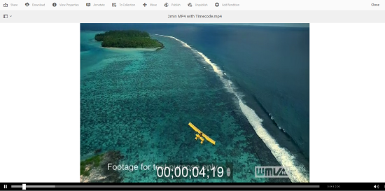

# Gerenciar ativos de vídeo {#manage-video-assets}

Saiba como gerenciar e editar os ativos de vídeo nos ativos Adobe Experience Manager (AEM). Além disso, se você estiver licenciado para usar o Dynamic Media, consulte a documentação [de vídeo do](/help/assets/video.md)Dynamic Media.

## Fazer upload e pré-visualização de ativos de vídeo {#upload-and-preview-video-assets}

Os ativos Adobe Experience Manager geram pré-visualizações para ativos de vídeo com a extensão MP4. Se o formato do ativo não for MP4, instale o FFmpeg pack para gerar uma pré-visualização. FFmpeg cria representações de vídeo do tipo OGG e MP4. Você pode pré-visualização essas execuções na interface do usuário do AEM Assets.

1. Na pasta ou subpastas Ativos digitais, navegue até o local onde deseja adicionar ativos digitais.
1. Para carregar o ativo, clique em **[!UICONTROL Criar]** na barra de ferramentas e escolha **[!UICONTROL Arquivos]**. Como alternativa, solte-o diretamente na área de ativos. Consulte [Fazer upload de ativos](managing-assets-touch-ui.md#uploading-assets) para obter detalhes sobre a operação de upload.
1. Para pré-visualização de um vídeo na visualização de placa, clique no botão **[!UICONTROL Reproduzir]** no ativo de vídeo.

   

   Você pode pausar ou reproduzir vídeo apenas na visualização do cartão. Os botões [!UICONTROL Reproduzir] e [!UICONTROL Pausar] não estão disponíveis na visualização da lista.

1. Para pré-visualização do vídeo na página de detalhes do ativo, clique no ícone **[!UICONTROL Editar]** no cartão.

   O vídeo é reproduzido no player de vídeo nativo do navegador. Você pode reproduzir, pausar, controlar o volume e aplicar zoom no vídeo em tela cheia.

   

## Configuração para carregar ativos com mais de 2 GB {#configuration-to-upload-assets-that-are-larger-than-gb}

Por padrão, os ativos Experience Manager não permitem que você carregue ativos com mais de 2 GB devido a um limite de tamanho de arquivo. No entanto, você pode substituir esse limite indo para o CRXDE Lite e criando um nó no `/apps` diretório. O nó deve ter o mesmo nome de nó, estrutura de diretório e propriedades de ordem de nó comparáveis.

Além da configuração dos Ativos do Experience Manager, altere as seguintes configurações para fazer upload de ativos grandes:

* Aumente o tempo de expiração do token. Consulte Servlet [!UICONTROL CSRF] Adobe Granite no Console da Web em `https://[aem_server]:[port]/system/console/configMgr`. Para obter mais informações, consulte Proteção CSRF.
* Aumente a configuração `receiveTimeout` no Dispatcher. Para obter mais informações, consulte Configuração [do Dispatcher do](https://docs.adobe.com/content/help/en/experience-manager-dispatcher/using/configuring/dispatcher-configuration.html#renders-options)Experience Manager.

>[!NOTE]
>
>A interface de usuário do AEM Classic não tem uma restrição de limite de tamanho de arquivo de 2 GB. Além disso, o fluxo de trabalho completo para vídeos grandes não é totalmente compatível.

Para configurar um limite de tamanho de arquivo maior, execute as seguintes etapas no `/apps` diretório.

1. In AEM, click **[!UICONTROL Tools]** > **[!UICONTROL General]** > **[!UICONTROL CRXDE Lite]**.
1. No CRXDE Lite, navegue até `/libs/dam/gui/content/assets/jcr:content/actions/secondary/create/items/fileupload`. Para ver a janela do diretório, toque no `>>` ícone.
1. From the toolbar, click the **[!UICONTROL Overlay Node]**. Como alternativa, selecione **[!UICONTROL Sobrepor nó]** no menu de contexto.
1. In the **[!UICONTROL Overlay Node]** dialog, click **[!UICONTROL OK]**.

   

1. Atualize o navegador. O nó de sobreposição `/jcr_root/apps/dam/gui/content/assets/jcr:content/actions/secondary/create/items/fileupload` é selecionado.
1. Na guia **[!UICONTROL Propriedades]** , digite o valor apropriado em bytes para aumentar o limite de tamanho para o tamanho desejado. Por exemplo, para aumentar o limite de tamanho para 30 GB, digite `{sizeLimit : "32212254720"}` valor.

1. Na barra de ferramentas, toque em **[!UICONTROL Salvar tudo]**.
1. In AEM, click **[!UICONTROL Tools]** > **[!UICONTROL Operations]** > **[!UICONTROL Web Console]**.
1. Na página Pacotes do console da Web do Adobe Experience Manager, na coluna Nome da tabela, localize e clique em **[!UICONTROL Adobe Granite Workflow External Process Job Handler]**.
1. Na página Manipulação de trabalho do processo externo do fluxo de trabalho do Adobe Granite, defina os segundos para os campos **[!UICONTROL Tempo limite padrão]** e **[!UICONTROL Tempo máximo]** como `18000` (cinco horas).
1. Clique em **[!UICONTROL Salvar]**.
1. No AEM, clique em **[!UICONTROL Ferramentas]** > **[!UICONTROL Fluxo de trabalho]** > **[!UICONTROL Modelos]**.
1. Na página Modelos de fluxo de trabalho, selecione **[!UICONTROL Dynamic Media Encode Video]** e clique em **[!UICONTROL Editar]**.
1. Na página de fluxo de trabalho, clique com o duplo no componente Processo **[!UICONTROL de serviço de vídeo do]** Dynamic Media.
1. Na caixa de diálogo [!UICONTROL Propriedades da etapa], na guia **[!UICONTROL Comum]**, expanda **Configurações avançadas**.
1. In the **[!UICONTROL Timeout]** field, specify a value of `18000`, then click **[!UICONTROL OK]** to return to the **[!UICONTROL Dynamic Media Encode Video]** workflow page.
1. Próximo à parte superior da página, abaixo do título da página Codificação de vídeo do Dynamic Media, clique em **[!UICONTROL Salvar]**.

## Publicar ativos de vídeo {#publish-video-assets}

Após a publicação dos ativos de vídeo, eles estarão disponíveis para inclusão em uma página da Web por meio de um URL ou incorporação em uma página da Web. Consulte [publicar ativos](/help/assets/publishing-dynamicmedia-assets.md).

## Anotar ativos de vídeo {#annotate-video-assets}

1. No console Ativos, clique no ícone [!UICONTROL Editar] no cartão do ativo para exibir a página de detalhes do ativo.
1. Para reproduzir o vídeo, clique no ícone de [!UICONTROL Pré-visualização] .
1. Para anotar o vídeo, clique no botão **[!UICONTROL Anotar]** . Uma anotação é adicionada no ponto de tempo específico (quadro) do vídeo. Ao anotar, você pode desenhar na tela e incluir um comentário com o desenho. Os comentários são salvos automaticamente.

   

   Para sair do assistente de anotações, clique em **[!UICONTROL Fechar]**.

1. Procure um ponto específico no vídeo, especifique o tempo em segundos no campo de **texto** e clique em **Pular**. Por exemplo, para pular os primeiros 10 segundos de vídeo, digite 20 no campo de texto.

   

1. Para visualização na linha do tempo, clique em uma anotação. Para excluir a anotação da linha do tempo, clique em **[!UICONTROL Excluir]**.

   
