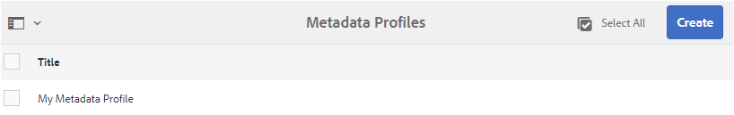

# Configuração e administração da funcionalidade de metadados em [!DNL Assets] {#config-metadata}

| Versão | Link do artigo |
| -------- | ---------------------------- |
| AEM as a Cloud Service | [Clique aqui](https://experienceleague.adobe.com/docs/experience-manager-cloud-service/content/assets/manage/metadata-profiles.html?lang=en) |
| AEM 6.5 | Este artigo |

<!-- Scope of metadata articles:
* metadata.md: The scope of this article is basic metadata updates, changes, and so on, operations that end-users can do.
* metadata-concepts.md: All conceptual information. Minor instructions are OK but it is an FYI article about support and standards.
* metadata-config.md: New article. Contains all configuration and administration how-to info related to metadata of assets.
-->

[!DNL Adobe Experience Manager Assets] mantém metadados para cada ativo. Ele facilita a categorização e a organização de ativos e ajuda as pessoas que estão procurando um ativo específico. Com a capacidade de manter e gerenciar metadados com seus ativos, você pode organizar e processar ativos automaticamente com base nos metadados. O [!DNL Adobe Experience Manager Assets] permite que os administradores configurem e personalizem a funcionalidade de metadados para modificar a oferta de Adobe padrão.

## Editar esquema de metadados {#metadata-schema}

Para obter detalhes, consulte [editar formulários de esquema de metadados](metadata-schemas.md#edit-metadata-schema-forms).

## Registrar um namespace personalizado em [!DNL Experience Manager] {#registering-a-custom-namespace-within-aem}

Você pode adicionar seus próprios namespaces em [!DNL Experience Manager]. Assim como há namespaces predefinidos como `cq`, `jcr` e `sling`, você pode ter um namespace para seus metadados de repositório e processamento XML.

1. Acesse a página de administração do tipo de nó `https://[aem_server]:[port]/crx/explorer/nodetypes/index.jsp`.
1. Para acessar a página de administração de namespace, clique em **[!UICONTROL Namespaces]** na parte superior da página.
1. Para adicionar um namespace, clique em **[!UICONTROL Novo]** na parte inferior da página.
1. Especifique um namespace personalizado na convenção de namespace XML. Especifique a ID no formato de um URI e um prefixo associado para a ID. Clique em **[!UICONTROL Salvar]**.

## Configurar limites para atualização de metadados em massa {#bulk-metadata-update-limit}

Para evitar uma situação como DOS (negação de serviço), [!DNL Enterprise Manager] limita o número de parâmetros com suporte em uma solicitação Sling. Ao atualizar metadados de muitos ativos de uma só vez, você pode atingir o limite e os metadados não são atualizados para mais ativos. O Enterprise Manager gera a seguinte advertência nos logs:

`org.apache.sling.engine.impl.parameters.Util Too many name/value pairs, stopped processing after 10000 entries`

Para alterar o limite, acesse **[!UICONTROL Ferramentas]** > **[!UICONTROL Operações]** > **[!UICONTROL Console da Web]** e altere o valor de **[!UICONTROL Parâmetros de POST máximo]** na **[!UICONTROL Manipulação de parâmetro da solicitação do Apache]** Configuração OSGi.

## Perfis de metadados {#metadata-profiles}

Um perfil de metadados permite aplicar metadados padrão a ativos em uma pasta. Crie um perfil de metadados e aplique-o a uma pasta. Qualquer ativo enviado posteriormente para a pasta herda os metadados padrão configurados no perfil de metadados.

### Adicionar um perfil de metadados {#adding-a-metadata-profile}

1. Navegue até **[!UICONTROL Ferramentas]** > **[!UICONTROL Assets]** > **[!UICONTROL Perfis de Metadados]** e clique em **[!UICONTROL Criar]**.
1. Insira um título para o perfil, por exemplo, `Sample Metadata`, e clique em **[!UICONTROL Criar]**. O [!UICONTROL Formulário de Edição] do perfil de metadados é exibido.

   

1. Clique em um componente e configure suas propriedades na guia **[!UICONTROL Configurações]**. Por exemplo, clique no componente **[!UICONTROL Descrição]** e edite suas propriedades.

   

   Edite as seguintes propriedades para o componente **[!UICONTROL Descrição]**:

   * **[!UICONTROL Rótulo do Campo]**: o nome para exibição da propriedade de metadados. É somente para referência do usuário.

   * **[!UICONTROL Mapear para a Propriedade]**: o valor dessa propriedade fornece o caminho relativo ou o nome para o nó do ativo onde ele é salvo no repositório. O valor deve sempre começar com `./` porque indica que o caminho está sob o nó do ativo.

   

   O valor especificado para **[!UICONTROL Mapear para a propriedade]** é armazenado como uma propriedade no nó de metadados do ativo. Por exemplo, se você especificar `./jcr:content/metadata/dc:desc` como o nome de **[!UICONTROL Mapear para a propriedade]**, [!DNL Assets] armazenará o valor `dc:desc` no nó de metadados do ativo. A Adobe recomenda mapear apenas um campo para uma determinada propriedade no esquema de metadados. Caso contrário, o campo adicionado mais recente mapeado para a propriedade será escolhido pelo sistema.

   * **[!UICONTROL Valor Padrão]**: use essa propriedade para adicionar um valor padrão para o componente de metadados. Por exemplo, se você especificar &quot;Minha descrição&quot;, esse valor será atribuído à propriedade `dc:desc` no nó de metadados do ativo.

   

   >[!NOTE]
   >
   >A adição de um valor padrão a uma nova propriedade de metadados (que não existe no nó `/jcr:content/metadata`) não exibe a propriedade e seu valor na página [!UICONTROL Propriedades] do ativo por padrão. Para exibir a nova propriedade na página [!UICONTROL Propriedades] dos ativos, modifique o formulário de esquema correspondente.

1. (Opcional) Na guia **[!UICONTROL Criar Formulário]**, adicione mais componentes a [!UICONTROL Editar Formulário] e configure as propriedades na guia **[!UICONTROL Configurações]**. As seguintes propriedades estão disponíveis na guia **[!UICONTROL Criar Formulário]**:

| Componente | Propriedades |
| ----------------------------- | ----------------------------------------------------------------------- |
| [!UICONTROL Cabeçalho da seção] | Rótulo do Campo, Descrição   |
| [!UICONTROL Texto em linha única] | Rótulo do Campo,   Mapear para a propriedade,   Valor Padrão |
| [!UICONTROL Texto de vários valores] | Rótulo do Campo,   Mapear para a propriedade,   Valor Padrão |
| [!UICONTROL Número] | Rótulo do Campo,   Mapear para a propriedade,   Valor Padrão |
| [!UICONTROL Data] | Rótulo do Campo,   Mapear para a propriedade,   Valor Padrão |
| [!UICONTROL Marcas Padrão] | Rótulo do Campo,   Mapear para a propriedade,   Valor Padrão,   Descrição |

1. Clique em **[!UICONTROL Concluído]**. O Perfil de Metadados foi adicionado à lista de perfis na página **[!UICONTROL Perfis de Metadados]**. 

   

### Copiar um perfil de metadados {#copying-a-metadata-profile}

1. Na página **[!UICONTROL Perfis de metadados]**, selecione um perfil de metadados para fazer uma cópia dele.

   

1. Clique em **[!UICONTROL Copiar]** na barra de ferramentas.
1. Na caixa de diálogo **[!UICONTROL Copiar Perfil de Metadados]**, insira um título para a nova cópia do Perfil de Metadados.
1. Clique em **[!UICONTROL Copiar]**. A cópia do Perfil de metadados aparece na lista de perfis na página **[!UICONTROL Perfis de metadados]**.

   

### Excluir um perfil de metadados {#deleting-a-metadata-profile}

1. Na página **[!UICONTROL Perfis de metadados]**, selecione um perfil a ser excluído.

1. Clique em **[!UICONTROL Excluir Perfis de Metadados]** na barra de ferramentas.
1. Na caixa de diálogo, clique em **[!UICONTROL Excluir]** para confirmar a operação de exclusão. O perfil de metadados é excluído da lista.

<!-- TBD: Revisit to find out the correct config. and update these steps. When fixed, also o
These steps have been carried forward from old AEM versions. See https://helpx.adobe.com/experience-manager/6-2/assets/using/metadata-profiles.html#ApplyingaMetadataProfiletoFolders

### Configuration to apply a metadata profile globally {#apply-a-metadata-profile-globally}

In addition to applying a profile to a folder, you can also apply one globally so that any content uploaded into [!DNL Experience Manager] assets in any folder has the selected profile applied.

You can reprocess assets in a folder that already has an existing metadata profile that you later changed. See [Reprocessing assets in a folder after you have edited its processing profile](processing-profiles.md#reprocessing-assets).

To apply a metadata profile globally, follow these steps:

* Navigate to `https://[aem_server]:[port]/mnt/overlay/dam/gui/content/assets/foldersharewizard.html/content/dam` and apply the appropriate profile and click **[!UICONTROL Save]**.

  

* In CRXDE Lite, navigate to the following node: `/content/dam/jcr:content`. Add the property `metadataProfile:/etc/dam/metadata/dynamicmedia/<name of metadata profile>` and click **[!UICONTROL Save All]**.

  
-->

## Esquema de metadados para uma pasta {#folder-metadata-schema}

O [!DNL Adobe Experience Manager Assets] permite criar esquemas de metadados para pastas de ativos, que definem o layout e os metadados exibidos nas páginas de propriedades da pasta.

### Adicionar um formulário de esquema de metadados de pasta {#add-a-folder-metadata-schema-form}

Use o editor do Forms de Esquema de metadados de pasta para criar e editar esquemas de metadados para pastas.

1. Na interface [!DNL Experience Manager], vá para **[!UICONTROL Ferramentas]** > **[!UICONTROL Assets]** > **[!UICONTROL Esquemas de Metadados de Pasta]**.
1. Na página [!UICONTROL Forms do Esquema de Metadados da Pasta], clique em **[!UICONTROL Criar]**.
1. Especifique um nome para o formulário e clique em **[!UICONTROL Criar]**. O novo formulário de esquema está listado na página [!UICONTROL Forms de Esquema].

### Editar formulários de esquema de metadados de pasta {#edit-folder-metadata-schema-forms}

É possível editar um formulário de esquema de metadados recém-adicionado ou existente, que inclui o seguinte:

* Guias
* Itens de formulário em guias.

Você pode mapear/configurar esses itens de formulário para um campo em um nó de metadados no repositório do CRX. Você pode adicionar novas guias ou itens de formulário ao formulário de esquema de metadados.

1. Na página Forms de esquema, selecione o formulário criado e selecione a opção **[!UICONTROL Editar]** na barra de ferramentas.
1. Na página Editor de esquema de metadados de pasta, clique em `+` para adicionar uma guia ao formulário. Para renomear a guia, clique no nome padrão e especifique o novo nome em **[!UICONTROL Configurações]**.

   

   Para adicionar mais guias, clique em `+`. Para excluir, clique em `X` em uma guia.

1. Na guia ativa, adicione um ou mais componentes da guia **[!UICONTROL Criar Formulário]**.

   

   Se você criar várias guias, clique em uma guia específica para adicionar componentes.

1. Para configurar um componente, selecione-o e modifique suas propriedades na guia **[!UICONTROL Configurações]**.

   Se necessário, exclua um componente da guia **[!UICONTROL Configurações]**.

   

1. Para salvar as alterações, selecione **[!UICONTROL Salvar]** na barra de ferramentas.

#### Componentes para criar formulários {#components-to-build-forms}

A guia **[!UICONTROL Criar Formulário]** lista itens de formulário que você usa no formulário de esquema de metadados da pasta. A guia **[!UICONTROL Configurações]** exibe os atributos para cada item selecionado na guia **[!UICONTROL Formulário de compilação]**. Aqui está uma lista dos itens de formulário disponíveis na guia **[!UICONTROL Criar Formulário]**:

| Nome do componente | Descrição |
|---|---|
| [!UICONTROL Cabeçalho da seção] | Adicione um cabeçalho de seção para obter uma lista de componentes comuns. |
| [!UICONTROL Texto em linha única] | Adicione uma propriedade de texto de linha única. Ele é armazenado como uma string. |
| [!UICONTROL Texto de vários valores] | Adicione uma propriedade de texto de vários valores. Ele é armazenado como uma matriz de sequência. |
| [!UICONTROL Número] | Adiciona um componente de número. |
| [!UICONTROL Data] | Adiciona um componente de data. |
| [!UICONTROL Lista suspensa] | Adiciona uma lista suspensa. |
| [!UICONTROL Marcas Padrão] | Adicione uma tag. |
| [!UICONTROL Campo oculto] | Adicione um campo oculto. Ele é enviado como um parâmetro POST quando o ativo é salvo. |

#### Edição de itens de formulário {#editing-form-items}

Para editar as propriedades dos itens de formulário, clique no componente e edite todas ou um subconjunto das seguintes propriedades na guia **[!UICONTROL Configurações]**.

**[!UICONTROL Rótulo do Campo]**: o nome da propriedade de metadados exibida na página de propriedades da pasta.

**[!UICONTROL Mapear para a Propriedade]**: esta propriedade especifica o caminho relativo do nó de pasta no repositório do CRX onde ele é salvo. Ele começa com &quot;**./**&quot;, que indica que o caminho está sob o nó da pasta.

A seguir estão os valores válidos para essa propriedade:

* `./jcr:content/metadata/dc:title`: armazena o valor no nó de metadados da pasta como a propriedade `dc:title`.

* `./jcr:created`: exibe a propriedade JCR no nó da pasta. Se você configurar essas propriedades no CRXDE, a Adobe recomenda marcá-las como Desativar edição, pois elas estão protegidas. Caso contrário, o erro &#39; `Asset(s) failed to modify`&#39; ocorre ao salvar as propriedades do ativo.

Para garantir que o componente seja exibido corretamente no formulário de esquema de metadados, não inclua um espaço no caminho da propriedade.

**[!UICONTROL Caminho JSON]**: use-o para especificar o caminho do arquivo JSON onde você especifica pares de valores chave para opções.

**[!UICONTROL Espaço reservado]**: use essa propriedade para especificar texto de espaço reservado relevante em relação à propriedade de metadados.

**[!UICONTROL Opções]**: use esta propriedade para especificar opções em uma lista.

**[!UICONTROL Descrição]**: use essa propriedade para adicionar uma descrição curta para o componente de metadados.

**[!UICONTROL Classe]**: classe de objeto à qual a propriedade está associada.

### Excluir formulários de esquema de metadados de pasta {#delete-folder-metadata-schema-forms}

Você pode deletar formulários de esquema de metadados de pasta da página Forms de Esquema de Metadados de Pasta. Para excluir um formulário, selecione-o e clique na opção de exclusão na barra de ferramentas.

### Atribuir um esquema de metadados de pasta {#assign-a-folder-metadata-schema}

Você pode atribuir um esquema de metadados de pasta a uma pasta na página Forms de Esquema de metadados de pasta ou ao criar uma pasta.

Se você configurar um esquema de metadados para uma pasta, o caminho para o formulário de esquema será armazenado na propriedade `folderMetadataSchema` do nó da pasta em `./jcr:content`.

#### Atribuir a um esquema a partir da página Esquema de metadados de pasta {#assign-to-a-schema-from-the-folder-metadata-schema-page}

1. Na interface [!DNL Experience Manager], vá para **[!UICONTROL Ferramentas]** > **[!UICONTROL Assets]** > **[!UICONTROL Esquemas de Metadados de Pasta]**.
1. Na página Forms do Esquema de Metadados da Pasta, selecione o formulário de esquema que deseja aplicar a uma pasta.
1. Na barra de ferramentas, clique em **[!UICONTROL Aplicar às pastas]**.

1. Selecione a pasta na qual aplicar o esquema e clique em **[!UICONTROL Aplicar]**. Se um esquema de metadados já estiver aplicado à pasta, uma mensagem de aviso informará que você está prestes a substituir o esquema de metadados existente. Clique em **[!UICONTROL Substituir]**.
1. Abra as propriedades de metadados da pasta à qual você aplicou o esquema de metadados.

   

   Para exibir os campos de metadados da pasta, clique na guia **[!UICONTROL Metadados da pasta]**.

   

#### Atribuir um esquema ao criar uma pasta {#assign-a-schema-when-creating-a-folder}

Você pode atribuir um esquema de metadados de pasta ao criar uma pasta. Se existir pelo menos um esquema de metadados de pasta no sistema, uma lista extra será exibida na caixa de diálogo **[!UICONTROL Criar Pasta]**. Você pode selecionar o esquema desejado. Por padrão, nenhum schema está selecionado.

1. Na interface de usuário do [!DNL Experience Manager Assets], clique em **[!UICONTROL Criar]** na barra de ferramentas.
1. Especifique um título e nome para a pasta.
1. Na lista Esquema de metadados de pasta, selecione o esquema desejado. Em seguida, clique em **[!UICONTROL Criar]**.

   

1. Abra as propriedades de metadados da pasta à qual você aplicou o esquema de metadados.
1. Para exibir os campos de metadados da pasta, clique na guia **[!UICONTROL Metadados da pasta]**.

### Usar o esquema de metadados da pasta {#use-the-folder-metadata-schema}

Abra as propriedades de uma pasta configurada com um esquema de metadados de pasta. Uma guia **[!UICONTROL Metadados da Pasta]** é exibida na página [!UICONTROL Propriedades] da pasta. Para exibir o formulário de esquema de metadados da pasta, selecione essa guia.

Insira os valores de metadados nos vários campos e clique em **[!UICONTROL Salvar]** para armazenar os valores. Os valores especificados são armazenados no nó da pasta no repositório do CRX.

## Dicas e limitações {#best-practices-limitations}

* Para importar metadados em namespaces personalizados, primeiro registre os namespaces.
* O Seletor de propriedades exibe as propriedades que são usadas em editores de esquema e formulários de pesquisa. O Seletor de propriedades não seleciona propriedades de metadados de um ativo.
* Você pode ter perfis de metadados pré-existentes desde antes de atualizar para o [!DNL Experience Manager] 6.5. Após a atualização, se você aplicar esse perfil na pasta [!UICONTROL Propriedades] na guia [!UICONTROL Perfis de Metadados], os campos do formulário de metadados não serão exibidos. No entanto, se você aplicar um perfil de metadados recém-criado, os campos de formulário serão exibidos, mas indisponíveis conforme esperado. Não há perda de funcionalidade, mas se você quiser ver os campos de formulário (indisponíveis), edite e salve os perfis de metadados existentes.

>[!MORELIKETHIS]
>
>* [Conceitos e noções básicas sobre metadados](metadata-concepts.md).
>* [Editar propriedades de metadados de várias coleções](manage-collections.md#editing-collection-metadata-in-bulk).
>* [Importação e exportação de metadados no Experience Manager Assets](https://experienceleague.adobe.com/docs/experience-manager-learn/assets/metadata/metadata-import-export.html).
>* [Perfis para processar metadados, imagens e vídeos](processing-profiles.md).
>* [Práticas recomendadas para organizar seus ativos digitais para usar perfis de processamento](/help/assets/organize-assets.md).
>* [Writeback XMP](/help/assets/xmp-writeback.md).
