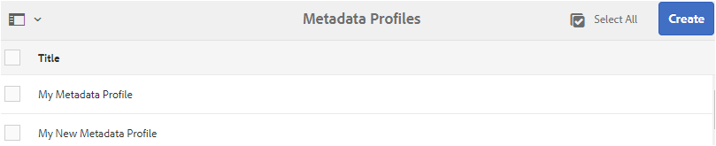
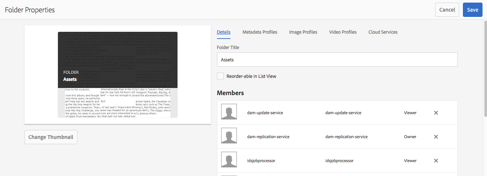
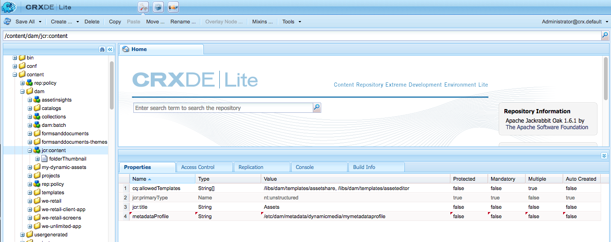

# Perfis de metadados {#metadata-profiles}

Um perfil de metadados permite aplicar metadados padrão a ativos em uma pasta. Crie um perfil de metadados e aplique-o a uma pasta. Qualquer ativo carregado posteriormente para a pasta herda os metadados padrão configurados no perfil de metadados.

## Adicionar um perfil de metadados {#adding-a-metadata-profile}

1. Navegue até **[!UICONTROL Ferramentas]** > **[!UICONTROL Ativos]** > Perfis **** de metadados e clique em **[!UICONTROL Criar]**.
1. Digite um título para o Perfil Metadados, por exemplo Metadados de amostra, e clique em **[!UICONTROL Criar]**. O formulário [!UICONTROL Editar formulário] para o perfil de metadados é exibido.

   

1. Clique em um componente e configure suas propriedades na guia **[!UICONTROL Configurações]** . Por exemplo, clique no componente **[!UICONTROL Descrição]** e edite suas propriedades.

   

   Edite as seguintes propriedades para o componente **[!UICONTROL Descrição]** :

   * **[!UICONTROL Rótulo]** do campo: O nome de exibição da propriedade de metadados. É apenas para a referência do usuário.

   * **[!UICONTROL Mapear para propriedade]**: O valor dessa propriedade fornece o caminho/nome relativo para o nó do ativo no qual ele é salvo no repositório. O valor deve sempre ser start `./` porque indica que o caminho está sob o nó do ativo.

   

   The value you specify for **[!UICONTROL Map to property]** is stored as a property under the asset&#39;s metadata node. Por exemplo, se você especificar . `/jcr:content/metadata/dc:desc` como o nome do **[!UICONTROL Mapa para a propriedade]**, o Assets armazena o valor `dc:desc` no nó de metadados do ativo.

   * **[!UICONTROL Valor]** padrão: Use essa propriedade para adicionar um valor padrão para o componente de metadados. Por exemplo, se você especificar &quot;Minha descrição&quot;, esse valor será atribuído à propriedade `dc:desc` no nó de metadados do ativo.

   

   >[!NOTE]
   >
   >Adicionando um valor padrão a uma nova propriedade de metadados (que ainda não existe no . `/jcr:content/metadata` nó) não exibe a propriedade e seu valor na página Propriedades do ativo por padrão. Para visualização da nova propriedade na página [!UICONTROL Propriedades] dos ativos, modifique o formulário de schema correspondente.

1. (Opcional) Adicione mais componentes ao Formulário de edição na guia **[!UICONTROL Criar formulário]** e configure as propriedades na guia **[!UICONTROL Configurações]**. As seguintes propriedades estão disponíveis na guia **[!UICONTROL Criar formulário]**:

| Componente | Propriedades |
| ----------------------------- | ----------------------------------------------------------------------- |
| [!UICONTROL Título da seção] | Rótulo do campo,   Descrição |
| [!UICONTROL Texto em linha única] | Rótulo do campo,   Mapear para propriedade,   Valor padrão |
| [!UICONTROL Texto multivalor] | Rótulo do campo,   Mapear para propriedade,   Valor padrão |
| [!UICONTROL Número] | Rótulo do campo,   Mapear para propriedade,   Valor padrão |
| [!UICONTROL Data] | Rótulo do campo,   Mapear para propriedade,   Valor padrão |
| [!UICONTROL Tags padrão] | Rótulo do campo,   Mapear para propriedade,   Valor padrão,   Descrição |

1. Clique em **[!UICONTROL Concluído]**. O Perfil Metadados é adicionado à lista de perfis na página Perfis **** Metadados. 

   

## Copiar um perfil de metadados {#copying-a-metadata-profile}

1. Na página Perfis **[!UICONTROL de]** metadados, selecione um perfil de metadados para fazer uma cópia dele.

   

1. Click **[!UICONTROL Copy]** from the toolbar.
1. Na caixa de diálogo **[!UICONTROL Copiar Perfil]** de Metadados, digite um título para a nova cópia do Perfil de Metadados.
1. Clique em **[!UICONTROL Copiar]**. A cópia do Perfil de metadados aparece na lista de perfis na página **[!UICONTROL Perfis de metadados]**.

   

## Excluir um perfil de metadados {#deleting-a-metadata-profile}

1. Na página Perfis **[!UICONTROL de]** metadados, selecione um perfil a ser excluído.

   

1. Para[] **[!UICONTROL Excluir Perfis]** de metadados na barra de ferramentas.
1. Na caixa de diálogo, clique em **[!UICONTROL Excluir]** para confirmar a operação de exclusão. O perfil de metadados é excluído da lista.

## Aplicar um perfil de metadados a pastas {#applying-a-metadata-profile-to-folders}

Quando você atribui um perfil de metadados a uma pasta, qualquer subpasta herda automaticamente o perfil da pasta pai. Isso significa que você pode atribuir apenas um perfil de metadados a uma pasta. Dessa forma, considere cuidadosamente a estrutura de pastas de onde você carrega, armazena, usa e arquiva ativos.

Se você atribuiu um perfil de metadados diferente a uma pasta, o novo perfil substituirá o perfil anterior. Os ativos de pasta existentes anteriormente permanecem inalterados. O novo perfil é aplicado aos ativos adicionados posteriormente à pasta.

As pastas que têm um perfil atribuído a ele são indicadas na interface do usuário pelo nome do perfil que aparece no nome do cartão.

Você pode aplicar perfis de metadados a pastas específicas ou globalmente a todos os ativos.

Você pode reprocessar ativos em uma pasta que já tenha um perfil de metadados existente que você tenha alterado posteriormente. Consulte o [reprocessando de ativos em uma pasta após a edição do perfil de processamento](processing-profiles.md#reprocessing-assets).

### Aplicar perfis de metadados a pastas específicas {#applying-metadata-profiles-to-specific-folders}

Aplique um perfil de metadados a uma pasta no menu **[!UICONTROL Ferramentas]** ou, se estiver na pasta, em **[!UICONTROL Propriedades]**. Esta seção descreve como aplicar perfis de metadados a pastas de ambas as maneiras.

As pastas que têm um perfil já atribuído a elas são indicadas ao exibir do nome do perfil logo abaixo do nome da pasta.

Você pode reprocessar ativos em uma pasta que já tenha um perfil de vídeo existente que você tenha alterado posteriormente. Consulte o [reprocessando de ativos em uma pasta após a edição do perfil de processamento](processing-profiles.md#reprocessing-assets).

#### Aplicar perfis de metadados a pastas da interface do usuário do Perfis {#applying-metadata-profiles-to-folders-from-profiles-user-interface}

Siga as etapas para aplicar o perfil de metadados:

1. Clique no logotipo do Experience Manager e navegue até **[!UICONTROL Ferramentas]** > **[!UICONTROL Ativos]** > Perfis **[!UICONTROL de]** metadados.
1. Selecione o perfil de metadados que deseja aplicar a uma pasta ou várias pastas.

   

1. Click **[!UICONTROL Apply Metadata Profile to Folder(s)]** and select the folder or multiple folders you want use to receive the newly uploaded assets and click **[!UICONTROL Done]**. As pastas que têm um perfil já atribuído a elas são indicadas ao exibir do nome do perfil logo abaixo do nome da pasta.

#### Aplicar perfis de metadados a pastas a partir de Propriedades {#applying-metadata-profiles-to-folders-from-properties}

1. No painel esquerdo, clique em **[!UICONTROL Ativos]** e navegue até a pasta à qual deseja aplicar um perfil de metadados.
1. Na pasta, clique na marca de seleção para selecioná-la e clique em **[!UICONTROL Propriedades]**.

1. Select the **[!UICONTROL Metadata Profiles]** tab and select the profile from the drop-down menu and click **[!UICONTROL Save]**.

   

   As pastas que têm um perfil já atribuído a elas são indicadas ao exibir do nome do perfil logo abaixo do nome da pasta.

### Aplicar um perfil de metadados globalmente {#applying-a-metadata-profile-globally}

Além de aplicar um perfil a uma pasta, também é possível aplicar um globalmente para que qualquer conteúdo carregado em ativos do Experience Manager em qualquer pasta tenha o perfil selecionado aplicado.

Você pode reprocessar ativos em uma pasta que já tenha um perfil de metadados existente que você tenha alterado posteriormente. Consulte o [reprocessando de ativos em uma pasta após a edição do perfil de processamento](processing-profiles.md#reprocessing-assets).

Para aplicar um perfil de metadados globalmente, siga estas etapas:

* Navegue até `https://[aem_server]:[port]/mnt/overlay/dam/gui/content/assets/foldersharewizard.html/content/dam` e aplique o perfil apropriado e clique em **[!UICONTROL Salvar]**.

   

* No CRXDE Lite, navegue até o seguinte nó: `/content/dam/jcr:content`. Adicione a propriedade `metadataProfile:/etc/dam/metadata/dynamicmedia/<name of metadata profile>` e clique em **[!UICONTROL Salvar tudo]**.

   

## Remover um perfil de metadados das pastas {#removing-a-metadata-profile-from-folders}

Quando você remove um perfil de metadados de uma pasta, qualquer subpasta herda automaticamente a remoção do perfil da pasta pai. No entanto, qualquer processamento de arquivos que tenha ocorrido dentro das pastas permanece intacto.

Remova um perfil de metadados a uma pasta do menu **[!UICONTROL Ferramentas]** ou, se estiver na pasta, nas **[!UICONTROL Propriedades]**. Esta seção descreve como remover perfis de metadados de pastas de ambas as maneiras.

### Remover perfis de metadados de pastas por meio da interface do usuário de Perfis {#removing-metadata-profiles-from-folders-via-profiles-user-interface}

1. Clique no logotipo do Experience Manager e navegue até **[!UICONTROL Ferramentas]** > **[!UICONTROL Ativos]** > Perfis **[!UICONTROL de]** metadados.
1. Selecione o perfil de metadados que deseja remover de uma pasta ou de várias pastas.
1. Click **[!UICONTROL Remove Metadata Profile from Folder(s)]** and select the folder or multiple folders you want use to remove a profile from and click **[!UICONTROL Done]**.

   Você pode confirmar que o perfil de metadados não é mais aplicado a uma pasta porque o nome não aparece mais abaixo do nome da pasta.

### Remover perfis de metadados de pastas por Propriedades {#removing-metadata-profiles-from-folders-via-properties}

1. Clique no logotipo do Experience Manager, navegue **[!UICONTROL pelos Ativos]** e, em seguida, até a pasta da qual deseja remover um perfil de metadados.
1. Na pasta, clique na marca de seleção para selecioná-la e clique em **[!UICONTROL Propriedades]**.
1. Selecione a guia **[!UICONTROL Perfis de metadados]**, selecione **[!UICONTROL Nenhum]** no menu suspenso e clique em **[!UICONTROL Salvar]**. As pastas que têm um perfil já atribuído a elas são indicadas ao exibir do nome do perfil logo abaixo do nome da pasta.

## Limitations and best practices {#limitations-best-practices-tips}

* Você pode ter perfis de metadados pré-existentes desde antes de atualizar para a versão [!DNL Experience Manager] 6.5. Após a atualização, se esse perfil for aplicado nas [!UICONTROL Propriedades] da pasta na guia Perfis [!UICONTROL de] metadados, os campos do formulário de metadados não serão exibidos. No entanto, se um perfil de metadados recém-criado for aplicado, os campos do formulário serão exibidos, mas não estarão disponíveis conforme esperado. Não há perda de funcionalidade, mas se você quiser ver os campos de formulário (indisponíveis), edite e salve os perfis de metadados existentes.

>[!MORELIKETHIS]
>
>* [Perfis para processar metadados, imagens e vídeos](processing-profiles.md)
>* [Práticas recomendadas para organizar seus ativos digitais para usar perfis de processamento](/help/assets/organize-assets.md)

