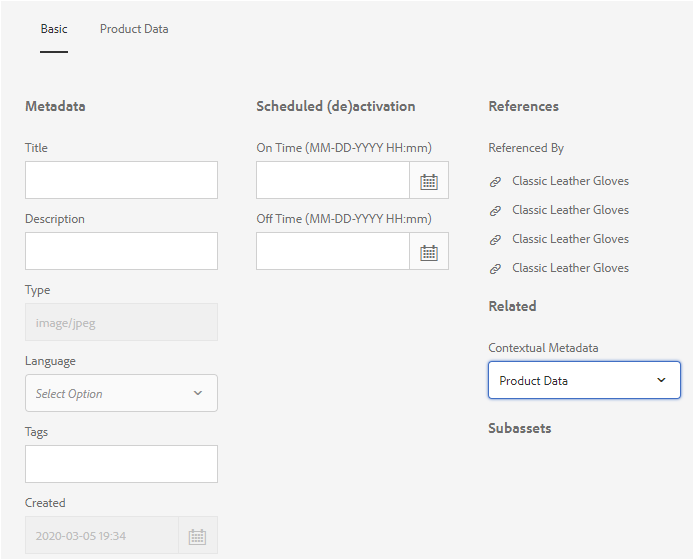

# Esquemas de metadados {#metadata-schemas}

As organizações vêm com um modelo de metadados que aprimora a descoberta de ativos, o uso, a interoperabilidade e assim por diante. A aplicação correta de metadados é sacrossanta para manter workflows e processos orientados por metadados. Para aderir à estratégia e aos padrões de metadados de toda a organização, você pode usar schemas de metadados que ajudam os usuários do DAM a se alinhar. [!DNL Adobe Experience Manager] permite que métodos fáceis e flexíveis criem, mantenham e apliquem schemas de metadados.

Em [!DNL Adobe Experience Manager Assets], os schemas contêm campos específicos para informações específicas a serem preenchidas. Ele também contém informações de layout para exibir campos de metadados de uma forma fácil de usar. As propriedades de metadados incluem título, descrição, tipos MIME, tags e muito mais. Você pode usar o editor de Formulários [!UICONTROL de Schemas de] Metadados para modificar os schemas existentes ou adicionar schemas de metadados personalizados.

Para visualização e edição da página de propriedades de um ativo, siga estas etapas:

1. Clique no ícone Propriedades **[!UICONTROL da]** Visualização em Ações rápidas no bloco de ativo em visualização de cartão.

   

   Como alternativa, selecione um ativo e clique no ícone [!UICONTROL Propriedades] na barra de ferramentas.

1. É possível editar as várias propriedades de metadados editáveis nas guias disponíveis. No entanto, não é possível modificar o [!UICONTROL Tipo] de ativo na guia [!UICONTROL Básico] da página de propriedades.

   

*Figura: Guia Básico em[!UICONTROL Propriedades]do ativo.*

Para modificar o tipo MIME de um ativo, use um formulário de schema de metadados personalizado ou modifique um formulário existente. Consulte [Editar formulários](/help/assets/metadata-schemas.md#edit-metadata-schema-forms) de Schema de metadados para obter mais informações. Se você modificar o schema de metadados de um tipo MIME, o layout da página de propriedades dos ativos e todos os subtipos serão modificados. Por exemplo, modificar um schema jpeg em `default/image` modifica somente o layout de metadados (propriedades do ativo) para ativos com tipo MIME `image/jpeg`. No entanto, se você editar o schema padrão, suas alterações modificarão o layout de metadados de todos os tipos de ativos.

## Formulários de esquema de metadados {#default-metadata-schema-forms}

Para visualização de uma lista de formulários ou modelos, na [!DNL Experience Manager] interface, navegue até **[!UICONTROL Ferramentas]** > **[!UICONTROL Ativos]** > Schemas **** de metadados.

[!DNL Experience Manager] fornece os seguintes modelos de formulário de Schema de metadados.

| Modelos |  | Descrição |
|---|---|---|
| [!UICONTROL default] |  | O formulário de schema de metadados base para ativos. |
|  | Os seguintes formulários filho herdam as propriedades do formulário [!UICONTROL padrão] : |  |
|  | [!UICONTROL image] | Formulário de Schema para imagens com o tipo MIME, como `image/jpeg` e `image/png`.   O formulário de [!UICONTROL imagem] tem os seguintes modelos de formulário filho: <ul><li> [!UICONTROL jpeg]: Formulário de Schema para ativos com subtipo [!UICONTROL jpeg].</li> <li>[!UICONTROL TIFF]: Formulário de Schema para os ativos com subtipo TIFF.</li></ul> |
|  | [!UICONTROL aplicativo] | Formulário de Schema para ativos com tipo MIME, como `application/pdf` e `application/zip`.  [!UICONTROL pdf]: Formulário de Schema para ativos com subtipo PDF. |
|  | [!UICONTROL vídeo] | Formulário de Schema para ativos de vídeo com tipo MIME, como `video/avi` e `video/mp4`. |
| [!UICONTROL collection] |  | Formulário de Schema para coleções. |
| [!UICONTROL contentfragment] |  | [Formulário de Schema para fragmentos](/help/sites-developing/customizing-content-fragments.md)de conteúdo. |
| [!UICONTROL formulários] |  | Este formulário de schema está relacionado ao [Adobe Experience Manager Forms](/help/forms/home.md). |

<!-- 
TBD: Add dm_video child for the default form OOTB.
video doesn't contain any sub types as listed above OOTB.
application doesn't contain the sub type zip OOTB.
-->

>[!NOTE]
>
>Para visualização dos formulários filho de um formulário de schema, clique no nome do formulário do schema.

## Adicionar um formulário de schema de metadados {#add-a-metadata-schema-form}

Para adicionar um formulário de schema de metadados, siga estas etapas:

1. Para adicionar um modelo personalizado à lista, clique em **[!UICONTROL Criar]** na barra de ferramentas.

   >[!NOTE]
   >
   >Um ícone de cadeado é exibido com os modelos não editados. Se você personalizar um modelo, o ícone de cadeado não será exibido.

1. Na caixa de diálogo, forneça o título do formulário de schema e clique em **[!UICONTROL Criar]** para concluir o processo de criação do formulário.

## Editar formulários de schema de metadados {#edit-metadata-schema-forms}

É possível editar um formulário de schema de metadados recém-adicionado ou existente. O formulário de schema de metadados inclui guias e itens de formulário dentro de guias. Você pode mapear/configurar esses itens de formulário em um campo dentro de um nó de metadados no repositório CRX. É possível adicionar guias ou itens de formulário ao formulário de schema de metadados. As guias e os itens de formulário derivados do pai estão no estado bloqueado. Não é possível alterá-los no nível da criança.

1. Na página Formulários [!UICONTROL de Schema de] metadados, selecione um formulário e clique em **[!UICONTROL Editar]** na barra de ferramentas.

1. Na página Editor **[!UICONTROL de formulário de Schema de]** metadados, personalize o formulário de metadados. Arraste os componentes necessários da guia **[!UICONTROL Criar formulário]** para uma das guias.

   

   *Figura: Uma página do Editor[!UICONTROL de formulário de Schema de]metadados com guias disponíveis.*

1. Para configurar um componente, selecione-o e modifique suas propriedades na guia **[!UICONTROL Configurações]** .

### Componentes na guia [!UICONTROL Criar formulário] {#components-within-the-build-form-tab}

A guia **[!UICONTROL Criar formulário]** lista itens de formulário usados no formulário do schema. A guia **[!UICONTROL Configurações]** fornece os atributos de cada item selecionado na guia **[!UICONTROL Criar formulário]** . A tabela a seguir lista os itens de formulário disponíveis na guia **[!UICONTROL Criar formulário]** :

| Nome do componente | Descrição |
| -------------------------------- | ----------------------------------------------------------------------------------- |
| [!UICONTROL Título da seção] | Adicione um cabeçalho de seção para uma lista de componentes comuns. |
| [!UICONTROL Texto em linha única] | Adicione uma única propriedade de texto de linha. É armazenado como uma string. |
| [!UICONTROL Texto multivalor] | Adicione uma propriedade de texto de vários valores. Ele é armazenado como uma matriz de string. |
| [!UICONTROL Número] | Adicione um componente de número. |
| [!UICONTROL Data] | Adicione um componente de data. |
| [!UICONTROL Lista suspensa] | Adicione uma lista suspensa. |
| [!UICONTROL Tags padrão] | Adicionar uma tag. |
| [!UICONTROL Tags inteligentes] | Adicione para aumentar os recursos de pesquisa adicionando automaticamente tags de metadados. |
| [!UICONTROL Campo oculto] | Adicionar um campo oculto. Ele é enviado como um parâmetro POST quando o ativo é salvo. |
| [!UICONTROL Ativo referenciado por] | Adicione esse componente à lista de visualização de ativos referenciados pelo ativo. |
| [!UICONTROL Fazer referência ao ativo] | Adicionar para exibir uma lista de ativos que fazem referência ao ativo. |
| [!UICONTROL Referências de produtos] | Adicionar para mostrar a lista de produtos vinculados ao ativo. |
| [!UICONTROL Classificação do ativo] | Adicione para exibir opções para classificar o ativo. |
| [!UICONTROL Metadados do contexto] | Adicione para controlar a exibição de outras guias de metadados na página de propriedades dos ativos. |

#### Editar o componente de metadados {#edit-the-metadata-component}

Para editar as propriedades de um componente de metadados no formulário, clique no componente para editar todas ou um subconjunto das seguintes propriedades na guia **[!UICONTROL Configurações]** .

**Rótulo** do campo: O nome da propriedade de metadados que é exibida na página de propriedades do ativo.

**Mapear para propriedade**: Essa propriedade especifica o caminho relativo ou o nome do nó do ativo no qual ele é salvo no repositório CRX. Ele é start `./` para indicar que o caminho está sob o nó do ativo.

Estes são os valores válidos para esta propriedade:

* `./jcr:content/metadata/dc:title`: armazena o valor no nó de metadados do ativo como a propriedade `dc:title`.

* `./jcr:created`: Armazena a data e a hora de criação de um ativo. É uma propriedade protegida. Se você configurar essas propriedades, a Adobe recomenda marcá-las como Desativar edição.

Para garantir que o componente seja exibido corretamente no formulário de schema de metadados, o caminho da propriedade não deve incluir espaços.

* **Espaço reservado**: Use essa propriedade para especificar o texto relevante do espaço reservado para a propriedade metadata.
* **Obrigatório**: Use essa propriedade para marcar uma propriedade de metadados como obrigatória na página de propriedades.
* **Desabilitar edição**: Use essa propriedade para proibir qualquer edição em uma propriedade na página de propriedades.
* **Mostrar campo vazio em somente** leitura: Marque essa propriedade para exibir uma propriedade de metadados na página de propriedades, mesmo que ela não tenha valor. Por padrão, quando uma propriedade de metadados não tem valor, ela não é listada na página de propriedades.
* **Mostrar lista ordenada**: Use essa propriedade para exibir uma lista ordenada de opções.
* **Opções**: Use essa propriedade para especificar opções em uma lista.
* **Descrição** : Use essa propriedade para adicionar uma breve descrição para o componente de metadados.
* **Classe**: Classe de objeto à qual a propriedade está associada.
* **Excluir**: Clique em [!UICONTROL Excluir] para excluir um componente do formulário de schema.

>[!NOTE]
>
>O componente Campo  oculto não inclui esses atributos. Em vez disso, inclui propriedades, como Nome dos atributos, Valor, Rótulo do campo e Descrição. Os valores do componente Campo oculto são enviados como um parâmetro POST sempre que o ativo é salvo. Ele não é salvo como metadados para o ativo.

Se você selecionar a opção **[!UICONTROL Obrigatório]**, poderá pesquisar por ativos sem metadados obrigatórios. No painel **[!UICONTROL Filtros]**, expanda o predicado **[!UICONTROL Validação de metadados]** e selecione a opção **[!UICONTROL Inválido]**. Os resultados de pesquisa exibem ativos que não têm metadados obrigatórios configurados por meio do formulário de esquema.

Se você adicionar o componente Metadados contextuais a qualquer guia de qualquer formulário de schema, o componente aparecerá como uma lista na página de propriedades dos ativos aos quais o schema específico é aplicado. A lista inclui todas as outras guias, exceto a guia à qual você aplicou o componente Metadados contextuais. Atualmente, esse recurso fornece funcionalidade básica para controlar a exibição de metadados com base no contexto.

Para exibir qualquer guia na página de propriedades, além da guia na qual o componente Metadados contextuais é aplicado, selecione a guia na lista. A guia é adicionada à página de propriedades.

*Figura: Metadados contextuais na página de propriedades do ativo.*

### Especificar propriedades no arquivo JSON {#specify-properties-in-json-file}

Em vez de especificar propriedades para as opções na guia **[!UICONTROL Configurações]**, defina as opções em um arquivo JSON especificando pares de valores chave correspondentes. Especifique o caminho do arquivo JSON no campo **[!UICONTROL Caminho JSON]**.

#### Adicionar ou excluir uma guia no formulário de schema {#adding-deleting-a-tab-in-the-schema-form}

O editor de esquema permite adicionar ou excluir uma guia. The default schema form includes the **[!UICONTROL Basic]**, **[!UICONTROL Advanced]** , **[!UICONTROL IPTC]**, and **[!UICONTROL IPTC Extension]** tabs.

Clique em `+` para adicionar uma guia em um formulário de schema. Por padrão, a nova guia tem o nome `Unnamed-1`. É possível modificar o nome na guia **[!UICONTROL Configurações]** .

Clique `X` para excluir uma guia.

## Excluir formulários de schema de metadados {#delete-metadata-schema-forms}

[!DNL Experience Manager] permite que você exclua somente formulários de schema personalizados. Isso não permite que você exclua os formulários/modelos de schema padrão. No entanto, é possível excluir quaisquer alterações personalizadas nesses formulários.

Para excluir um formulário, selecione-o e clique em Excluir.

>[!NOTE]
>
>* Após excluir as alterações personalizadas em um formulário padrão, o ícone de cadeado será exibido novamente antes dele na interface do Schema de metadados. Indica que o formulário é revertido para seu estado padrão.
>* Não é possível excluir os formulários de schema de metadados padrão em [!DNL Assets].

## Formulários de Schema para tipos MIME {#schema-forms-for-mime-types}

[!DNL Experience Manager] fornece formulários padrão para vários tipos MIME prontos para uso. No entanto, você pode adicionar formulários personalizados para ativos de vários tipos MIME.

### Adicionar novos formulários para tipos MIME {#add-new-forms-for-mime-types}

Crie um formulário no tipo de formulário apropriado. For example, to add a template for the `image/png` subtype, create the form under the &quot;image&quot; forms. O título do formulário de esquema é o nome do subtipo. Nesse caso, o título é `png`.

#### Usar um modelo de schema existente para vários tipos MIME {#use-an-existing-schema-template-for-various-mime-types}

Você pode usar um modelo existente para um tipo MIME diferente. Por exemplo, use o `image/jpeg` formulário para ativos do tipo MIME `image/png`.

Nesse caso, crie um nó `/etc/dam/metadataeditor/mimetypemappings` no repositório CRX. Especifique um nome para o nó e defina as seguintes propriedades:

| Nome | Descrição | Tipo | Valor |
|------|-------------|------|-------|
| `exposedmimetype` | Nome do formulário existente a ser mapeado | `String` | `image/jpeg` |
| `mimetypes` | Lista de tipos MIME que usam o formulário definido no `exposedmimetype` atributo | `String` | `image/png` |

[!DNL Assets] mapeia os seguintes tipos MIME e formulários de schema:

| Formulário de Schema | Tipos MIME |
| --------------------------- | --------------------------------------------------- |
| image/jpeg | image/pjpeg |
| image/tiff | image/x-tiff |
| application/pdf | application/postscript |
| application/x-ImageSet | Multipart/Related; type=application/x-ImageSet |
| application/x-SpinSet | Multipart/Related; type=application/x-SpinSet |
| application/x-MixedMediaSet | Multipart/Related; type=application/x-MixedMediaSet |
| video/quicktime | video/x-quicktime |
| video/mpeg4 | video/mp4 |
| vídeo/avi | video/avi, video/msvideo, video/x-msvideo |
| video/wmv | video/x-ms-wmv |
| video/flv | video/x-flv |

## Conceder acesso a schemas de metadados {#grant-access-to-metadata-schemas}

O recurso Schema de metadados está disponível somente para administradores. No entanto, os administradores podem fornecer acesso a não administradores modificando algumas permissões. Forneça aos usuários não administradores permissões para criar, modificar e excluir na `/conf` pasta.

## Aplicar metadados específicos da pasta {#apply-folder-specific-metadata}

[!DNL Assets] permite definir uma variante de um schema de metadados e aplicá-la a uma pasta específica.

Por exemplo, você pode definir uma variante do schema de metadados padrão e aplicá-la a uma pasta. Quando você aplica o schema modificado, ele substitui o schema de metadados padrão original aplicado aos ativos dentro da pasta.

Somente os ativos carregados na pasta à qual esse schema é aplicado estão em conformidade com os metadados modificados definidos no schema de metadados da variante. [!DNL Assets] em outras pastas onde o schema original é aplicado, continue em conformidade com os metadados definidos no schema original.

A herança de metadados por ativos baseia-se no schema aplicado à pasta de primeiro nível na hierarquia. Em outras palavras, se uma pasta não contiver subpastas, os ativos dentro dela herdarão os metadados do schema aplicado à pasta.

Você pode aplicar um schema diferente na subpasta. Os ativos dentro de uma subpasta herdam o schema de metadados da subpasta imediata. Se nenhum schema ou mesmo schema for aplicado no nível da subpasta, seus ativos herdarão o schema da pasta pai.

1. Na [!DNL Experience Manager] interface, navegue até **[!UICONTROL Ferramentas]** > **[!UICONTROL Ativos]** > Schemas **** de metadados. A página **[!UICONTROL Formulários de esquema de metadados]** é exibida.
1. Marque a caixa de seleção antes de um formulário, por exemplo, o formulário de metadados padrão, clique em **[!UICONTROL Copiar]** e salve-o como um formulário personalizado. Especifique um nome personalizado para o formulário, por exemplo `my_default`. Como alternativa, é possível criar um formulário personalizado.

1. Na página Formulários **[!UICONTROL de Schema de]** metadados, selecione o `my_default` formulário e clique em **[!UICONTROL Editar]**.

1. Na página Editor **[!UICONTROL de Schemas de]** metadados, adicione um campo de texto ao formulário de schema. Por exemplo, adicione um campo com a **[!UICONTROL Categoria]** do rótulo.

   

   *Figura: Campo de texto adicionado ao editor de formulário de schema de metadados.*

1. Clique em **[!UICONTROL Salvar]**. O formulário modificado é listado na página Formulários **[!UICONTROL de Schema de]** metadados.
1. Clique em **[!UICONTROL Aplicar às pastas]** na barra de ferramentas para aplicar os metadados personalizados a uma pasta.

1. Selecione a pasta na qual aplicar o schema modificado e clique em **[!UICONTROL Aplicar]**.

   

1. Se a pasta tiver o outro schema de metadados aplicado, será exibida uma mensagem avisando que você está prestes a substituir o schema de metadados existente. Clique em **Substituir**.
1. Clique em **OK** para fechar a mensagem de sucesso.
1. Navegue até a pasta na qual você aplicou o schema de metadados modificado.

## Definir metadados obrigatórios {#define-mandatory-metadata}

Você pode definir campos obrigatórios em nível de pasta, que é imposto aos ativos que são carregados na pasta. Se você carregar ativos com metadados ausentes para os campos obrigatórios definidos anteriormente, uma indicação visual para metadados ausentes será exibida nos ativos na visualização do cartão.

>[!NOTE]
>
>Um campo de metadados pode ser definido como obrigatório com base no valor de outro campo. Na visualização do cartão, [!DNL Experience Manager] não exibe a mensagem de aviso sobre metadados ausentes para esses campos de metadados obrigatórios.

1. Na [!DNL Experience Manager] interface, navegue até **[!UICONTROL Ferramentas]** > **[!UICONTROL Ativos]** > Schemas **** de metadados. A página **[!UICONTROL Formulários de esquema de metadados]** é exibida.
1. Salve o formulário de metadados padrão como um formulário personalizado. Por exemplo, salve-o como `my_default`.

1. Edite o formulário personalizado. Adicione um campo obrigatório. Por exemplo, adicione um campo de **[!UICONTROL Categoria]** e torne-o obrigatório.

   

   *Figura: Campo obrigatório no editor de formulário de schema de metadados.*

1. Clique em **[!UICONTROL Salvar]**. O formulário modificado é listado na página Formulários **[!UICONTROL de Schema de]** metadados. Selecione o formulário e clique em **[!UICONTROL Aplicar às pastas]** na barra de ferramentas para aplicar os metadados personalizados a uma pasta.

1. Navegue até a pasta e carregue alguns ativos com metadados ausentes para o campo obrigatório adicionado ao formulário personalizado. Uma mensagem para os metadados ausentes do campo obrigatório é exibida na visualização do cartão do ativo.

   

1. (Opcional) Acesso `https://[aem_server]:[port]/system/console/components/`. Configure e ative `com.day.cq.dam.core.impl.MissingMetadataNotificationJob` o componente que está desativado por padrão. Defina uma frequência na qual [!DNL Experience Manager] verifica a validade dos metadados nos ativos. Essa configuração adiciona uma propriedade `hasValidMetadata` a `jcr:content` ativos. [!DNL Experience Manager] usa essa propriedade para filtrar os ativos inválidos em um resultado de pesquisa. Se você adicionar um ativo após uma verificação, o ativo não será sinalizado `hasValidMetadata` até a próxima verificação programada. Portanto, os ativos não aparecem nos filtros de pesquisa para metadados inválidos até após a próxima verificação programada.

   >[!CAUTION]
   >
   >As verificações de validação de metadados consomem muitos recursos e podem afetar o desempenho do seu sistema. Agendar as verificações em conformidade. Se o servidor não conseguir lidar com a carga, tente desativar esta tarefa.

<!-- TBD: Add this method to find invalid metadata in the metadata.md article later when it is published as a top-level metadata article.
-->
