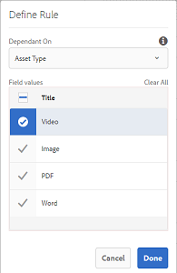

# Esquemas de metadados {#metadata-schemas}

As organizações vêm com um modelo de metadados que melhora a detecção de ativos, o uso, a interoperabilidade e assim por diante. A aplicação correta de metadados é sacrossanta para manter fluxos de trabalho e processos orientados por metadados. Para aderir à estratégia e aos padrões de metadados de toda a organização, você pode usar esquemas de metadados que ajudam os usuários do DAM a se alinhar. [!DNL Adobe Experience Manager] O permite que métodos fáceis e flexíveis criem, mantenham e apliquem esquemas de metadados.

Em [!DNL Adobe Experience Manager Assets], os esquemas contêm campos específicos para informações específicas a serem preenchidas. Também contém informações de layout para exibir campos de metadados de maneira fácil de usar. As propriedades dos metadados incluem título, descrição, tipos MIME, tags e muito mais. Você pode usar o editor [!UICONTROL Metadata Schema Forms] para modificar os esquemas existentes ou adicionar esquemas de metadados personalizados.

Para exibir e editar a página de propriedades de um ativo, siga estas etapas:

1. Clique na opção **[!UICONTROL Exibir propriedades]** nas ações rápidas no bloco de ativos na exibição de cartão. Como alternativa, selecione um ativo e clique em **[!UICONTROL Propriedades]**  na barra de ferramentas.

1. É possível editar as várias propriedades de metadados editáveis nas guias disponíveis. No entanto, não é possível modificar o ativo [!UICONTROL Type] na guia [!UICONTROL Basic] da página de propriedades.

   

   *Figura: Guia Básico em  [!UICONTROL Propriedades] do ativo.*

   Certifique-se de que apenas uma propriedade esteja mapeada para um campo enquanto você cria ou edita o esquema de metadados.

   Para modificar o tipo MIME de um ativo, use um formulário de esquema de metadados personalizado ou modifique um formulário existente. Consulte [Editar esquema de metadados Forms](#edit-metadata-schema-forms) para obter mais informações. Se você modificar o esquema de metadados de um tipo MIME, o layout da página de propriedades dos ativos e todos os subtipos serão modificados. Por exemplo, modificar um esquema jpeg em `default/image` modifica apenas o layout de metadados (propriedades de ativos) para ativos com o tipo MIME `image/jpeg`. No entanto, se você editar o esquema padrão, suas alterações modificarão o layout de metadados para todos os tipos de ativos.

## Formulários de esquema de metadados {#default-metadata-schema-forms}

Para exibir uma lista de formulários ou modelos, na interface [!DNL Experience Manager], navegue até **[!UICONTROL Ferramentas]** > **[!UICONTROL Ativos]** > **[!UICONTROL Esquemas de metadados]**.

[!DNL Experience Manager] O fornece os seguintes modelos de Formulário de esquema de metadados.

| Modelos |  | Descrição |
|---|---|---|
| [!UICONTROL default] |  | O formulário de esquema de metadados básico para ativos. |
|  | Os seguintes formulários filho herdam as propriedades do formulário [!UICONTROL padrão]: |  |
|  | <ul><li>[!UICONTROL dm_video]</li></ul> | Formulário de esquema para vídeos do Dynamic Media. |
|  | <ul><li>[!UICONTROL imagem]</li></ul> | Formulário de esquema para imagens com o tipo MIME, como `image/jpeg` e `image/png`.   A   forma de imagem tem os seguintes modelos de formulário filho: <ul><li> [!UICONTROL jpeg]: Formulário de esquema para ativos com subtipo  [!UICONTROL jpeg].</li> <li>[!UICONTROL tiff]: Formulário de esquema dos ativos com subtipo TIFF.</li></ul> |
|  | <ul><li>[!UICONTROL aplicativo]</li></ul> | Formulário de esquema para ativos com tipo MIME, como `application/pdf` e `application/zip`.  [!UICONTROL pdf]: Formulário de esquema para ativos com PDF de subtipo. |
|  | <ul><li>[!UICONTROL vídeo]</li></ul> | Formulário de esquema para ativos de vídeo com tipo MIME, como `video/avi` e `video/mp4`. |
| [!UICONTROL collection] |  | Formulário de esquema para coleções. |
| [!UICONTROL contentfragment] |  | [Formulário de esquema para fragmentos](/help/sites-developing/customizing-content-fragments.md) de conteúdo. |
| [!UICONTROL formulários] |  | Este formulário de esquema está relacionado a [Adobe Experience Manager Forms](/help/forms/home.md). |
| [!UICONTROL ugc_contentfragment] |  | Formulário de esquema para partes de conteúdo geradas pelo usuário e ativos integrados no Experience Manager a partir de redes sociais. |

>[!NOTE]
>
>Para exibir os formulários filho de um formulário de esquema, clique no nome do formulário de esquema.

## Adicionar um formulário de esquema de metadados {#add-a-metadata-schema-form}

Para adicionar um formulário de esquema de metadados, siga estas etapas:

1. Para adicionar um modelo personalizado à lista, clique em **[!UICONTROL Create]** na barra de ferramentas.

   >[!NOTE]
   >
   >Um símbolo de cadeado é exibido com os modelos não editados. Se você personalizar um modelo, ele não será bloqueado .

1. Na caixa de diálogo , forneça o título do formulário de esquema e clique em **[!UICONTROL Create]** para concluir o processo de criação do formulário.

## Editar formulários de esquema de metadados {#edit-metadata-schema-forms}

É possível editar um formulário de esquema de metadados recém-adicionado ou existente. O formulário de esquema de metadados inclui guias e itens de formulário em guias. Você pode mapear/configurar esses itens de formulário em um campo dentro de um nó de metadados no repositório CRX. É possível adicionar guias ou itens de formulário ao formulário de esquema de metadados. As guias e os itens de formulário derivados do pai estão no estado bloqueado. Não é possível alterá-los no nível filho.

1. Na página [!UICONTROL Forms] do Esquema de Metadados, selecione um formulário e clique em **[!UICONTROL Editar]** na barra de ferramentas.

1. Na página **[!UICONTROL Editor de formulário de esquema de metadados]** , personalize o formulário de metadados. Arraste os componentes necessários da guia **[!UICONTROL Criar formulário]** para uma das guias.

1. Para configurar um componente, selecione-o e modifique suas propriedades na guia **[!UICONTROL Settings]**.

### Componentes na guia [!UICONTROL Criar formulário] {#components-within-the-build-form-tab}

A guia **[!UICONTROL Criar formulário]** lista os itens de formulário que você usa no formulário de esquema. A guia **[!UICONTROL Settings]** fornece os atributos de cada item selecionado na guia **[!UICONTROL Criar formulário]**. A tabela a seguir lista os itens de formulário disponíveis na guia **[!UICONTROL Criar formulário]**:

| Nome do componente | Descrição |
| -------------------------------- | ----------------------------------------------------------------------------------- |
| [!UICONTROL Título da seção] | Adicione um cabeçalho de seção para obter uma lista de componentes comuns. |
| [!UICONTROL Texto em linha única] | Adicione uma propriedade de texto de linha única. Ele é armazenado como uma string. |
| [!UICONTROL Texto multivalor] | Adicione uma propriedade de texto de vários valores. Ele é armazenado como uma matriz de sequência de caracteres. |
| [!UICONTROL Número] | Adicione um componente de número. |
| [!UICONTROL Data] | Adicione um componente de data. |
| [!UICONTROL Lista suspensa] | Adicione uma lista suspensa. |
| [!UICONTROL Tags padrão] | Adicionar uma tag. |
| [!UICONTROL Tags inteligentes] | Adicione para aumentar os recursos de pesquisa, adicionando automaticamente as tags de metadados. |
| [!UICONTROL Campo oculto] | Adicione um campo oculto. Ele é enviado como um parâmetro POST quando o ativo é salvo. |
| [!UICONTROL Ativo referenciado por] | Adicione este componente para exibir a lista de ativos referenciados pelo ativo. |
| [!UICONTROL Fazer referência ao ativo] | Adicionar para exibir uma lista de ativos que fazem referência ao ativo. |
| [!UICONTROL Referências de produtos] | Adicionar para mostrar a lista de produtos vinculados ao ativo. |
| [!UICONTROL Classificação do ativo] | Adicionar para exibir opções para classificar o ativo. |
| [!UICONTROL Metadados do contexto] | Adicionar para controlar a exibição de outras guias de metadados na página de propriedades dos ativos. |

#### Editar o componente de metadados {#edit-the-metadata-component}

Para editar as propriedades de um componente de metadados no formulário, clique no componente para editar todas ou um subconjunto das seguintes propriedades na guia **[!UICONTROL Settings]**. É recomendável mapear apenas um campo para uma determinada propriedade no esquema de metadados. Caso contrário, o campo adicionado mais recente mapeado para a propriedade será escolhido pelo sistema.

**Rótulo** do campo: O nome da propriedade de metadados exibida na página de propriedades do ativo.

**Mapear para propriedade**: Essa propriedade especifica o caminho relativo ou o nome do nó do ativo, onde ele é salvo no repositório CRX. Ela começa com `./` para indicar que o caminho está no nó do ativo.

Veja a seguir os exemplos de valores válidos para uma propriedade:

* `./jcr:content/metadata/dc:title`: armazena o valor no nó de metadados do ativo como a propriedade `dc:title`.

* `./jcr:created`: Armazena a data e a hora de criação de um ativo. É uma propriedade protegida. Se você configurar essas propriedades, o Adobe recomenda marcá-las como Desativar edição. Caso contrário, o erro &quot;Os ativos falharam ao serem modificados&quot; ocorre ao salvar as propriedades do ativo.

Para garantir que o componente seja exibido corretamente no formulário de esquema de metadados, o caminho da propriedade não deve incluir espaços.

* **Espaço reservado**: Use essa propriedade para especificar o texto de espaço reservado relevante em relação à propriedade de metadados.
* **Obrigatório**: Use essa propriedade para marcar uma propriedade de metadados como obrigatória na página de propriedades.
* **Desativar edição**: Use essa propriedade para não permitir edições em uma propriedade na página de propriedades.
* **Mostrar Campo Vazio Em Somente** Leitura: Marque essa propriedade para exibir uma propriedade de metadados na página de propriedades, mesmo que ela não tenha um valor. Por padrão, quando uma propriedade de metadados não tem valor, ela não é listada na página de propriedades.
* **Mostrar ordem** da lista: Use essa propriedade para exibir uma lista ordenada de opções.
* **Opções**: Use essa propriedade para especificar opções em uma lista.
* **Descrição** : Use essa propriedade para adicionar uma breve descrição para o componente de metadados.
* **Classe**: Classe de objeto à qual a propriedade está associada.
* **Excluir**: Clique em   Excluir para excluir um componente do formulário de esquema.

>[!NOTE]
>
>O componente [!UICONTROL Campo oculto] não inclui esses atributos. Em vez disso, inclui propriedades, como atributos Nome, Valor, Rótulo do campo e Descrição. Os valores do componente Campo oculto são enviados como um parâmetro de POST sempre que o ativo é salvo. Ele não é salvo como metadados para o ativo.

Se você selecionar a opção **[!UICONTROL Obrigatório]**, poderá pesquisar por ativos sem metadados obrigatórios. No painel **[!UICONTROL Filtros]**, expanda o predicado **[!UICONTROL Validação de metadados]** e selecione a opção **[!UICONTROL Inválido]**. Os resultados de pesquisa exibem ativos que não têm metadados obrigatórios configurados por meio do formulário de esquema.

Se você adicionar o componente Metadados contextuais a qualquer guia de qualquer formulário de esquema, o componente aparecerá como uma lista na página de propriedades dos ativos aos quais o schema específico é aplicado. A lista inclui todas as outras guias, exceto a guia à qual você aplicou o componente de Metadados contextuais. No momento, esse recurso fornece funcionalidades básicas para controlar a exibição de metadados com base no contexto.

Para exibir qualquer guia na página de propriedades, além da guia em que o componente de Metadados contextuais é aplicado, selecione a guia na lista. A guia é adicionada à página de propriedades.

*Figura: Metadados contextuais na página de propriedades do ativo.*

### Especificar propriedades no arquivo JSON {#specify-properties-in-json-file}

Em vez de especificar propriedades para as opções na guia **[!UICONTROL Configurações]**, defina as opções em um arquivo JSON especificando pares de valores chave correspondentes. Especifique o caminho do arquivo JSON no campo **[!UICONTROL Caminho JSON]**.

#### Adicionar ou excluir uma guia no formulário de esquema {#adding-deleting-a-tab-in-the-schema-form}

O editor de esquema permite adicionar ou excluir uma guia. O formulário de esquema padrão inclui as guias **[!UICONTROL Basic]**, **[!UICONTROL Advanced]** , **[!UICONTROL IPTC]** e **[!UICONTROL IPTC Extension]**.

Clique em `+` para adicionar uma guia em um formulário de esquema. Por padrão, a nova guia tem o nome `Unnamed-1`. Você pode modificar o nome da guia **[!UICONTROL Settings]**. Clique em `X` para excluir uma guia.

## Metadados em cascata {#cascading-metadata}

Ao capturar as informações de metadados de um ativo, os usuários fornecem informações nos vários campos disponíveis. É possível exibir campos de metadados específicos ou valores de campo que dependem das opções selecionadas nos outros campos. Essa exibição condicional de metadados é chamada de metadados em cascata. Em outras palavras, é possível criar uma dependência entre um campo/valor de metadados específico e um ou mais campos e/ou seus valores.

Use esquemas de metadados para definir regras para exibir metadados em cascata. Por exemplo, se o esquema de metadados incluir um campo de tipo de ativo, você poderá definir um conjunto pertinente de campos a serem exibidos com base no tipo de ativo selecionado pelo usuário.

>[!CAUTION]
>
>Metadados em cascata não são compatíveis com Fragmentos de conteúdo.

Estes são alguns casos de uso para os quais você pode definir metadados em cascata:

* Sempre que a localização do usuário for necessária, exiba nomes de cidades relevantes com base na escolha do país e do estado pelo usuário.
* Carregue nomes de marcas pertinentes em uma lista com base na escolha de categoria de produto pelo usuário.
* Alternar a visibilidade de um campo específico com base no valor especificado em outro campo. Por exemplo, exiba campos de endereço de entrega separados se o usuário desejar que a entrega seja entregue em um endereço diferente.
* Atribua um campo como obrigatório com base no valor especificado em outro campo.
* Altere as opções exibidas para um campo específico com base no valor especificado em outro campo.
* Defina o valor dos metadados padrão em um campo específico com base no valor especificado em outro campo.

### Configurar metadados em cascata em [!DNL Experience Manager] {#configure-cascading-metadata-in-aem}

Considere um cenário em que deseja exibir metadados em cascata com base no tipo de ativo selecionado. Alguns exemplos

* Para um vídeo, exiba campos aplicáveis, como formato, codec, duração e assim por diante.
* Para um documento do Word ou PDF, exiba campos, como contagem de páginas, autor e assim por diante.

Independentemente do tipo de ativo escolhido, exiba as informações de direitos autorais como um campo obrigatório.

1. Na interface [!DNL Experience Manager], vá para **[!UICONTROL Ferramentas]** > **[!UICONTROL Ativos]** > **[!UICONTROL Esquemas de metadados]**.
1. Na página **[!UICONTROL Schema Forms]**, selecione um formulário de esquema e clique em **[!UICONTROL Editar]** na barra de ferramentas para editar o esquema.

   

1. (Opcional) No editor de esquema de metadados, crie um novo campo para condicionar. Especifique um nome e um caminho de propriedade na guia **[!UICONTROL Settings]**.

   Para criar uma nova guia, clique em `+` para adicionar uma guia e, em seguida, adicione um campo de metadados.

   

1. Adicione um campo suspenso para o tipo de ativo. Especifique um nome e um caminho de propriedade na guia **[!UICONTROL Settings]**. Adicione uma descrição opcional.

   

1. Os pares de valores-chave são as opções fornecidas a um usuário do formulário. Você pode fornecer os pares de valores chave manualmente ou de um arquivo JSON.

   * Para especificar os valores manualmente, selecione **[!UICONTROL Adicionar Manualmente]**, clique em **[!UICONTROL Adicionar Escolha]** e especifique o texto e o valor da opção. Por exemplo, especifique tipos de ativos de Vídeo, PDF, Word e Imagem.

   * Para buscar os valores de um arquivo JSON dinamicamente, selecione **[!UICONTROL Adicionar por meio do caminho JSON]** e forneça o caminho do arquivo JSON. [!DNL Experience Manager] busca os pares de valor chave em tempo real, quando o formulário é apresentado ao usuário.

   Ambas as opções são mutuamente exclusivas. Não é possível importar as opções de um arquivo JSON e editar manualmente.

   

   >[!NOTE]
   >
   >Ao adicionar um arquivo JSON, os pares de valor chave não são exibidos no editor de esquema de metadados, mas estão disponíveis no formulário publicado.

   >[!NOTE]
   >
   >Ao adicionar opções, se você clicar no campo Suspenso , a interface fica distorcida e a opção de exclusão das opções para de funcionar. Não clique na lista suspensa até salvar as alterações. Se você enfrentar esse problema, salve o schema e abra-o novamente para continuar a edição.

1. (Opcional) Adicione os outros campos obrigatórios. Por exemplo, formato, codec e duração do vídeo de tipo de ativo.

   Da mesma forma, adicione campos dependentes para outros tipos de ativos. Por exemplo, adicione campos contagem de páginas e criação para ativos de documento, como arquivos PDF e Word.

   

1. Para criar uma dependência entre o campo do tipo de ativo e outros campos, escolha o campo dependente e abra a guia **[!UICONTROL Rules]**.

   

1. Em **[!UICONTROL Requisito]**, escolha a opção **[!UICONTROL Obrigatório, com base na nova regra]**.
1. Clique em **[!UICONTROL Adicionar regra]** e escolha o campo **[!UICONTROL Tipo de ativo]** para criar uma dependência. Também escolha o valor do campo no qual criar a dependência. Nesse caso, escolha **[!UICONTROL Vídeo]**. Clique em **[!UICONTROL Concluído]** para salvar as alterações.

   

   >[!NOTE]
   >
   >A lista suspensa com valores predefinidos manualmente pode ser usada com regras. Menus suspensos com caminho JSON configurado não podem ser usados com regras que usam valores predefinidos para aplicar condições. Se os valores forem carregados do JSON no tempo de execução, não será possível aplicar uma regra predefinida.

1. Em **[!UICONTROL Visibilidade]**, escolha **[!UICONTROL Visível, com base na nova opção de regra]**.

1. Clique em **[!UICONTROL Adicionar regra]** e escolha o campo **[!UICONTROL Tipo de ativo]** para criar uma dependência. Também escolha o valor do campo no qual criar a dependência. Nesse caso, escolha **[!UICONTROL Vídeo]**. Clique em **[!UICONTROL Concluído]** para salvar as alterações.

   

   >[!NOTE]
   >
   >Clicar em um espaço em branco (ou em qualquer lugar diferente dos valores) redefine os valores. Se isso acontecer, selecione novamente os valores.

   >[!NOTE]
   >
   >É possível aplicar as condições de **[!UICONTROL Requisito]** e **[!UICONTROL Visibilidade]** independentemente umas das outras.

1. Da mesma forma, crie uma dependência entre o valor Vídeo no campo Tipo de ativo e outros campos, como Codec e Duration.
1. Repita as etapas para criar dependência entre ativos de documento (PDF e Word) no campo [!UICONTROL Tipo de ativo] e campos como [!UICONTROL Contagem de página] e [!UICONTROL Autor].
1. Clique em **[!UICONTROL Salvar]**. Aplique o esquema de metadados a uma pasta.

1. Navegue até a pasta na qual você aplicou o Esquema de metadados e abra a página de propriedades de um ativo. Dependendo de sua escolha no campo Tipo de ativo , os campos de metadados em cascata pertinentes são exibidos.

   

   *Figura: Metadados em cascata para um vídeo.*

   

   *Figura: Metadados em cascata para um documento.*

## Excluir formulários de esquema de metadados {#delete-metadata-schema-forms}

[!DNL Experience Manager] permite excluir somente formulários de esquema personalizados. Ela não permite excluir os formulários/modelos de esquema padrão. No entanto, é possível excluir quaisquer alterações personalizadas nesses formulários.

Para excluir um formulário, selecione-o e clique em excluir.

>[!NOTE]
>
>* Após excluir as alterações personalizadas em um formulário padrão, o bloqueio  reaparece antes do formulário. Indica que o formulário é revertido para seu estado padrão.
>* Não é possível excluir os formulários de esquema de metadados padrão em [!DNL Assets].

## Formulários de esquema para tipos MIME {#schema-forms-for-mime-types}

[!DNL Experience Manager] O fornece formulários padrão para vários tipos MIME prontos para uso. No entanto, é possível adicionar formulários personalizados a ativos de vários tipos MIME.

### Adicionar novos formulários para tipos MIME {#add-new-forms-for-mime-types}

Crie um formulário no tipo de formulário apropriado. Por exemplo, para adicionar um modelo para o subtipo `image/png`, crie o formulário nos formulários &quot;image&quot;. O título do formulário de esquema é o nome do subtipo. Nesse caso, o título é `png`.

#### Usar um modelo de esquema existente para vários tipos MIME {#use-an-existing-schema-template-for-various-mime-types}

Você pode usar um modelo existente para um tipo MIME diferente. Por exemplo, use o formulário `image/jpeg` para ativos do tipo MIME `image/png`.

Nesse caso, crie um nó em `/etc/dam/metadataeditor/mimetypemappings` no repositório CRX. Especifique um nome para o nó e defina as seguintes propriedades:

| Nome | Descrição | Tipo | Valor |
|------|-------------|------|-------|
| `exposedmimetype` | Nome do formulário existente a ser mapeado | `String` | `image/jpeg` |
| `mimetypes` | Lista de tipos MIME que usam o formulário definido no atributo `exposedmimetype` | `String` | `image/png` |

[!DNL Assets] O mapeia os seguintes tipos MIME e formulários de esquema:

| Formulário de esquema | Tipos MIME |
|---|---|
| image/jpeg | image/pjpeg |
| image/tiff | image/x-tiff |
| application/pdf | application/postscript |
| application/x-ImageSet | Multipart/Related; type=application/x-ImageSet |
| application/x-SpinSet | Multipart/Related; type=application/x-SpinSet |
| application/x-MixedMediaSet | Multipart/Related; type=application/x-MixedMediaSet |
| video/quicktime | vídeo/x-quicktime |
| vídeo/mpeg4 | video/mp4 |
| vídeo/avi | vídeo/avi, vídeo/msvideo, vídeo/x-msvideo |
| vídeo/wmv | video/x-ms-wmv |
| vídeo/flv | video/x-flv |

## Conceder acesso aos esquemas de metadados {#grant-access-to-metadata-schemas}

O recurso Esquema de metadados está disponível somente para administradores do . No entanto, os administradores podem fornecer acesso a não administradores modificando algumas permissões. Forneça permissões para que usuários não administradores criem, modifiquem e excluam na pasta `/conf`.

## Aplicar metadados específicos da pasta {#apply-folder-specific-metadata}

[!DNL Assets] permite definir uma variante de um schema de metadados e aplicá-la a uma pasta específica.

Por exemplo, você pode definir uma variante do esquema de metadados padrão e aplicá-la a uma pasta. Ao aplicar o schema modificado, ele substitui o schema de metadados padrão original aplicado aos ativos na pasta.

Somente os ativos carregados na pasta à qual esse esquema é aplicado estão em conformidade com os metadados modificados definidos no esquema de metadados da variante. [!DNL Assets] em outras pastas onde o esquema original é aplicado, continue em conformidade com os metadados definidos no esquema original.

A herança de metadados por ativos é baseada no esquema aplicado à pasta de nível superior na hierarquia. O mesmo schema é aplicado ou herdado pelas subpastas. Se um schema diferente for aplicado no nível da subpasta, a herança será interrompida.

1. Na interface [!DNL Experience Manager], navegue até **[!UICONTROL Ferramentas]** > **[!UICONTROL Ativos]** > **[!UICONTROL Esquemas de metadados]**. A página **[!UICONTROL Formulários de esquema de metadados]** é exibida.
1. Marque a caixa de seleção ao lado de um formulário, por exemplo, o formulário de metadados padrão, clique em **[!UICONTROL Copiar]** e salve-o como um formulário personalizado. Especifique um nome personalizado para o formulário, por exemplo `my_default`. Como alternativa, é possível criar um formulário personalizado.

1. Na página **[!UICONTROL Forms do esquema de metadados]**, selecione o formulário `my_default` e clique em **[!UICONTROL Editar]**.

1. Na página **[!UICONTROL Editor de esquema de metadados]** , adicione um campo de texto ao formulário de esquema. Por exemplo, adicione um campo com o rótulo **[!UICONTROL Category]**.

   

   *Figura: Campo de texto adicionado ao editor de formulário de esquema de metadados.*

1. Clique em **[!UICONTROL Salvar]**. O formulário modificado é listado na página **[!UICONTROL Forms]** do Esquema de Metadados.
1. Clique em **[!UICONTROL Aplicar às pastas]** na barra de ferramentas para aplicar os metadados personalizados a uma pasta.

1. Selecione a pasta na qual aplicar o schema modificado e clique em **[!UICONTROL Apply]**.

   

1. Se a pasta tiver o outro esquema de metadados aplicado, será exibida uma mensagem avisando que você está prestes a substituir o esquema de metadados existente. Clique em **Substituir**.
1. Clique em **OK** para fechar a mensagem de sucesso.
1. Navegue até a pasta na qual você aplicou o esquema de metadados modificado.

## Definir metadados obrigatórios {#define-mandatory-metadata}

Você pode definir campos obrigatórios em um nível de pasta, que é empregado em ativos que são carregados na pasta. Se você fizer upload de ativos com metadados ausentes para os campos obrigatórios definidos anteriormente, uma indicação visual para metadados ausentes aparecerá nos ativos na exibição de cartão.

>[!NOTE]
>
>Um campo de metadados pode ser definido como obrigatório com base no valor de outro campo. Na exibição de cartão, [!DNL Experience Manager] não exibe a mensagem de aviso sobre metadados ausentes nesses campos de metadados obrigatórios.

1. Na interface [!DNL Experience Manager], navegue até **[!UICONTROL Ferramentas]** > **[!UICONTROL Ativos]** > **[!UICONTROL Esquemas de metadados]**. A página **[!UICONTROL Formulários de esquema de metadados]** é exibida.
1. Salve o formulário de metadados padrão como um formulário personalizado. Por exemplo, salve-o como `my_default`.

1. Edite o formulário personalizado. Adicione um campo obrigatório. Por exemplo, adicione um campo **[!UICONTROL Category]** e torne o campo obrigatório.

   

   *Figura: Campo obrigatório no editor de formulário de esquema de metadados.*

1. Clique em **[!UICONTROL Salvar]**. O formulário modificado é listado na página **[!UICONTROL Forms]** do Esquema de Metadados. Selecione o formulário e clique em **[!UICONTROL Apply to Folder(s)]** na barra de ferramentas para aplicar os metadados personalizados a uma pasta.

1. Navegue até a pasta e faça upload de alguns ativos com metadados ausentes para o campo obrigatório adicionado ao formulário personalizado. Uma mensagem para os metadados ausentes do campo obrigatório é exibida na exibição de cartão do ativo.

   

1. (Opcional) Acesse `https://[aem_server]:[port]/system/console/components/`. Configure e habilite o componente `com.day.cq.dam.core.impl.MissingMetadataNotificationJob` que está desabilitado por padrão. Defina uma frequência em que [!DNL Experience Manager] verifique a validade dos metadados nos ativos. Essa configuração adiciona uma propriedade `hasValidMetadata` a `jcr:content` de ativos. [!DNL Experience Manager] O usa essa propriedade para filtrar os ativos inválidos em um resultado de pesquisa. Se você adicionar um ativo após uma verificação, o ativo não será sinalizado com `hasValidMetadata` até a próxima verificação agendada. Portanto, os ativos não aparecem nos filtros de pesquisa para metadados inválidos até depois da próxima verificação agendada.

   >[!CAUTION]
   >
   >As verificações de validação de metadados consomem muitos recursos e podem afetar o desempenho do sistema. Agendar as verificações em conformidade. Se o servidor não conseguir lidar com a carga, tente desabilitar esse trabalho.

<!-- TBD: Add this method to find invalid metadata in the metadata.md article later when it is published as a top-level metadata article.
-->
