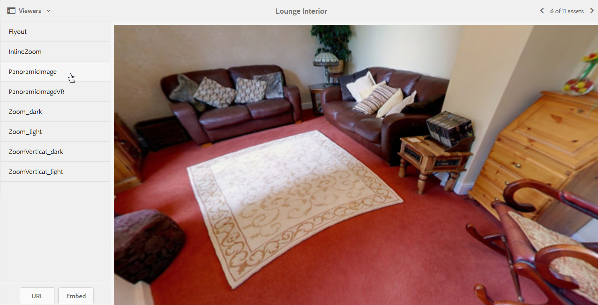

# Panoramic images{#panoramic-images}

Esta seção descreve como trabalhar com o visualizador Imagem panorâmica para renderizar imagens panorâmicas esféricas para uma experiência de visualização de 360° imersiva de uma sala, propriedade, local ou paisagem.

See also [Managing Viewer Presets](/help/assets/managing-viewer-presets.md).

## Fazer upload de ativos para uso com o Visualizador de imagem panorâmica {#uploading-assets-for-use-with-the-panoramic-image-viewer}

Para um ativo carregado se qualificar como uma imagem de panorama esférica que você pretende usar com o visualizador de Imagem panorâmica, o ativo deve ter um ou ambos os seguintes itens:

* Uma proporção largura/altura de 2.
Você pode substituir a configuração de proporção padrão de 2 no CRXDE Lite no seguinte:
   `/conf/global/settings/cloudconfigs/dmscene7/jcr:content`

* Marcado com as palavras-chave `equirectangular`, ou `spherical`e `panorama`, ou `spherical` e `panoramic`. Consulte [Uso de tags](/help/sites-authoring/tags.md).

Both the aspect ratio and keyword criteria apply to panoramic assets for the asset details page and the `Panoramic Media` WCM component.

Para fazer upload de ativos para uso com o visualizador de Imagem panorâmica, consulte [Fazer upload de ativos](/help/assets/managing-assets-touch-ui.md#uploading-assets).

## Configuração do Dynamic Media Classic (Scene7) {#configuring-dynamic-media-classic-scene}

Para que o visualizador de Imagem panorâmica funcione corretamente no AEM, você deve sincronizar as predefinições do visualizador de Imagem panorâmica com os metadados específicos do Dynamic Media Classic (Scene7) e do Dynamic Media Classic (Scene7) para que as predefinições do visualizador sejam atualizadas no JCR. Para fazer isso, configure o Dynamic Media Classic (Scene7) da seguinte maneira:

1. [Faça logon na sua instância do Dynamic Media Classic (Scene7)](https://www.adobe.com/marketing-cloud/experience-manager/scene7-login.html) para cada conta de empresa.

1. Perto do canto superior direito da página, clique em **[!UICONTROL Configuração > Configuração de aplicativo > Configuração de publicação > Servidor de imagem.]**
1. Na página de Publicação do Servidor de Imagens, no menu suspenso **[!UICONTROL Publicar contexto]** próximo à parte superior, selecione Serviço de **[!UICONTROL Imagens.]**

1. Na mesma página de Publicação do Image Server, localize o cabeçalho Atributos **[!UICONTROL de solicitação.]**
1. No cabeçalho Solicitar atributos, localize o Limite de tamanho de imagem de **[!UICONTROL resposta.]** Em seguida, nos campos Largura e Altura associados, aumente o tamanho máximo permitido da imagem para imagens panorâmicas.

   O Dynamic Media Classic (Scene7) tem um limite de 25.000.000 pixels. O tamanho máximo permitido para imagens com uma proporção de 2:1 é 7000 x 3500. No entanto, para telas típicas de desktop, 4096 x 2048 pixels são suficientes.

   >[!NOTE]
   >
   >Somente as imagens que se encaixam no tamanho máximo permitido de imagem são suportadas. As solicitações de imagens acima do limite de tamanho resultarão em uma resposta 403.

1. Em Atributos de solicitação, faça o seguinte:

   * Defina Request Obfuscation Mode (Modo de ofuscação de solicitação) como **[!UICONTROL Disabled (Desativado).]**
   * Defina Request Locking Mode (Modo de bloqueio de solicitação) como **[!UICONTROL Disabled (Desativado).]**

   Essas configurações são necessárias para o uso do componente `Panoramic Media` WCM no AEM.

1. Na parte inferior da página Publicação do Servidor de imagens, no lado esquerdo, clique em **[!UICONTROL Salvar.]**

1. No canto inferior direito, clique em **[!UICONTROL Fechar.]**

### Solução de problemas do componente WCM de mídia panorâmica {#troubleshooting-the-panoramic-media-wcm-component}

Se você soltou uma imagem no componente de Mídia panorâmica em seu WCM e o espaço reservado do componente desabou, talvez você queira solucionar o seguinte problema:

* Se você encontrar um erro 403 Proibido, ele pode ter sido causado pelo tamanho da imagem solicitada ser muito grande. Revise as configurações de Limite **[!UICONTROL de tamanho de imagem de]** resposta em [Configuração do Dynamic Media Classic (Scene7)](/help/assets/panoramic-images.md#configuring%20dynamic%20media%20classic%20(scene7)).

* Para um &quot;Bloqueio inválido&quot; no ativo ou &quot;Erro de análise&quot; exibido na página, marque Modo de ofuscação de solicitação e Modo de bloqueio de solicitação para garantir que eles estejam desativados.
* Para um erro de tela contaminada, configure um Caminho de arquivo de definição de conjunto de regras e Invalide o CTN para as solicitações anteriores do ativo de imagem.
* Se a qualidade da imagem ficar muito baixa após uma solicitação de imagem com dimensionamento acima do limite suportado, verifique se a configuração Atributos de codificação **[!UICONTROL JPEG > Qualidade]** não está vazia. Uma configuração típica para o campo **[!UICONTROL Qualidade]** é `95`. Você pode encontrar a configuração na página Publicação do Servidor de imagens. Para acessar a página, consulte [Configuração do Dynamic Media Classic (Scene7)](/help/assets/panoramic-images.md#configuring%20dynamic%20media%20classic%20(scene7)).

## Visualização de imagens panorâmicas {#previewing-panoramic-images}

Consulte [Visualizar ativos](/help/assets/previewing-assets.md).

## Publicação de imagens panorâmicas {#publishing-panoramic-images}

Consulte [Publicação de ativos](/help/assets/publishing-dynamicmedia-assets.md).
